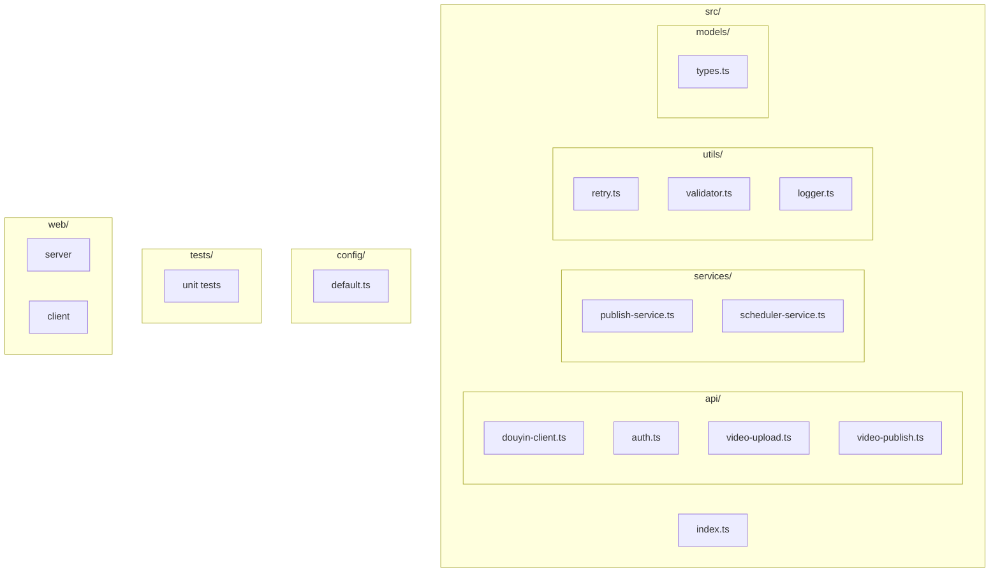
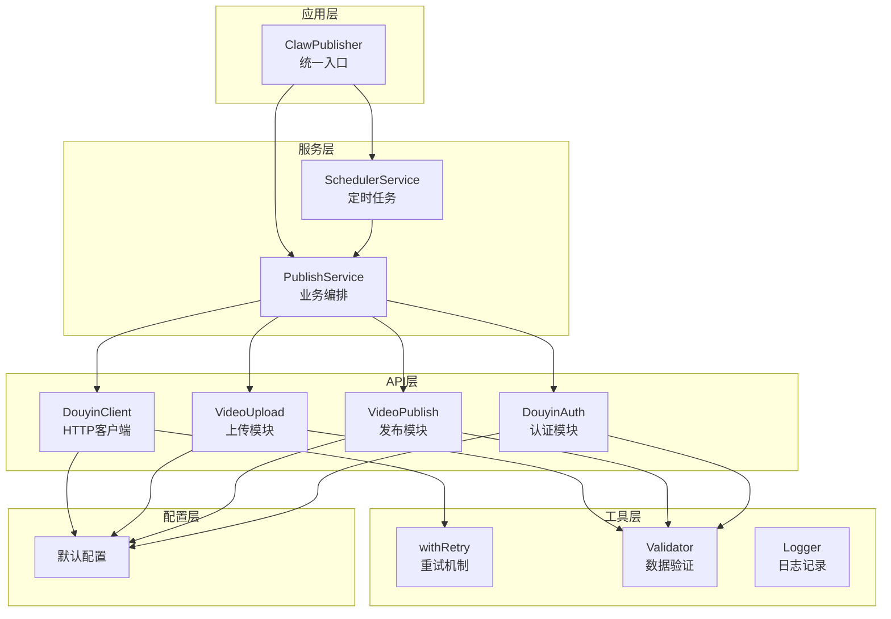
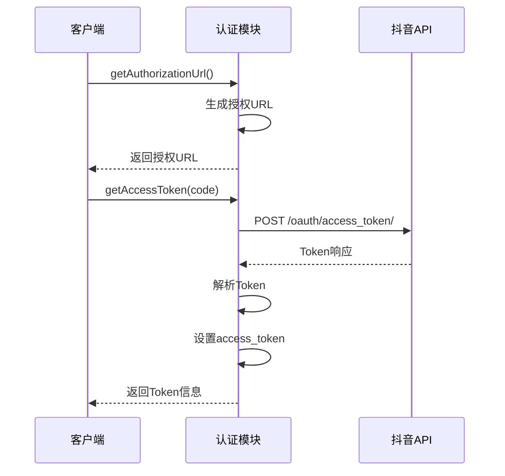
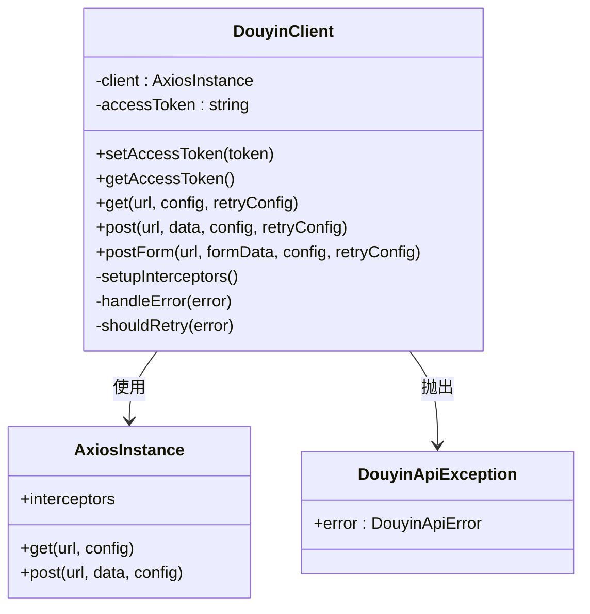
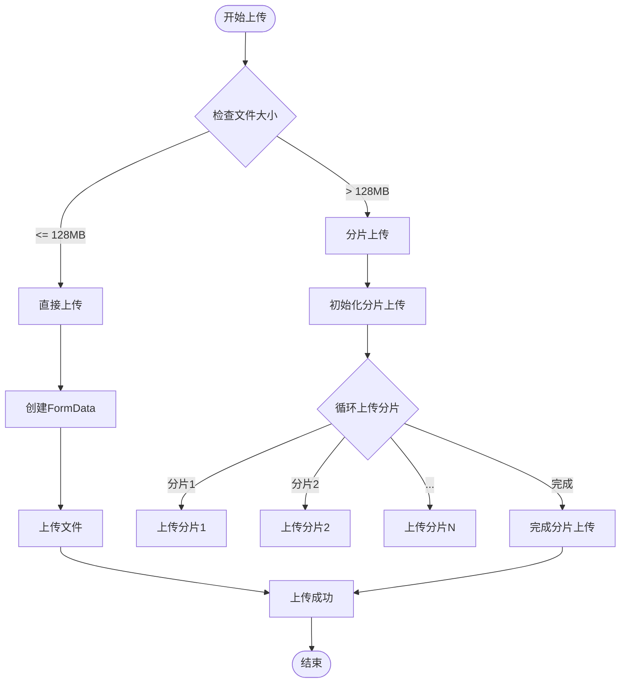
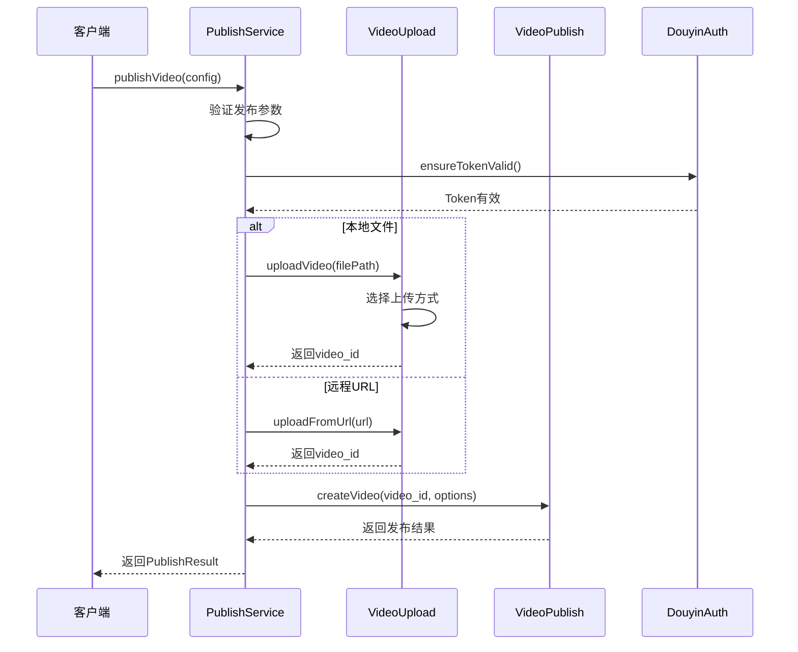
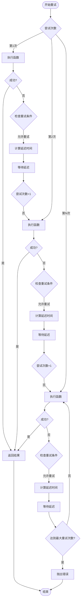
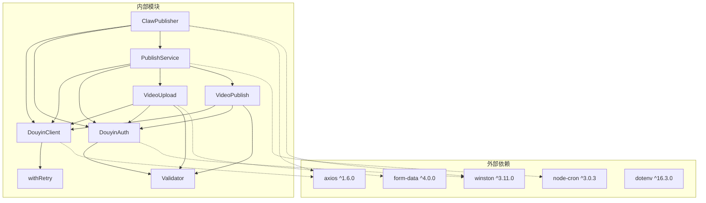

# 抖音HTTP客户端

<cite>
**本文档引用的文件**
- [douyin-client.ts](file://src/api/douyin-client.ts)
- [publish-service.ts](file://src/services/publish-service.ts)
- [video-upload.ts](file://src/api/video-upload.ts)
- [auth.ts](file://src/api/auth.ts)
- [video-publish.ts](file://src/api/video-publish.ts)
- [types.ts](file://src/models/types.ts)
- [retry.ts](file://src/utils/retry.ts)
- [validator.ts](file://src/utils/validator.ts)
- [default.ts](file://config/default.ts)
- [index.ts](file://src/index.ts)
- [example.ts](file://example.ts)
- [package.json](file://package.json)
- [README.md](file://README.md)
</cite>

## 目录
1. [简介](#简介)
2. [项目结构](#项目结构)
3. [核心组件](#核心组件)
4. [架构概览](#架构概览)
5. [详细组件分析](#详细组件分析)
6. [依赖关系分析](#依赖关系分析)
7. [性能考虑](#性能考虑)
8. [故障排除指南](#故障排除指南)
9. [结论](#结论)

## 简介

抖音HTTP客户端是一个专门设计用于与抖音开放平台API进行交互的Node.js客户端库。该项目提供了完整的视频上传、发布、管理和监控功能，支持本地文件上传、远程URL上传、分片上传、定时发布等高级特性。

该客户端库采用模块化设计，包含认证管理、API封装、业务逻辑编排、错误处理和重试机制等多个层次，为开发者提供了一个稳定可靠的抖音内容管理解决方案。

## 项目结构

项目采用清晰的分层架构，主要分为以下几个核心目录：

**图表来源**
- [index.ts:1-248](file://src/index.ts#L1-L248)
- [douyin-client.ts:1-237](file://src/api/douyin-client.ts#L1-L237)
- [auth.ts:1-190](file://src/api/auth.ts#L1-L190)

**章节来源**
- [package.json:1-38](file://package.json#L1-L38)
- [README.md:92-105](file://README.md#L92-L105)

## 核心组件

### 主要功能模块

1. **认证模块 (DouyinAuth)**: 处理OAuth认证流程，包括授权URL生成、Token获取和刷新
2. **API客户端 (DouyinClient)**: 基于Axios的HTTP客户端，封装请求拦截器和错误处理
3. **视频上传模块 (VideoUpload)**: 支持直接上传和分片上传两种模式
4. **视频发布模块 (VideoPublish)**: 处理视频创建、状态查询和删除操作
5. **发布服务 (PublishService)**: 业务逻辑编排层，协调各个模块的工作
6. **重试工具 (withRetry)**: 实现指数退避的重试机制
7. **验证器 (Validator)**: 数据验证和格式化工具

**章节来源**
- [auth.ts:29-190](file://src/api/auth.ts#L29-L190)
- [douyin-client.ts:13-237](file://src/api/douyin-client.ts#L13-L237)
- [video-upload.ts:20-241](file://src/api/video-upload.ts#L20-L241)
- [video-publish.ts:15-174](file://src/api/video-publish.ts#L15-L174)
- [publish-service.ts:22-228](file://src/services/publish-service.ts#L22-L228)

## 架构概览

项目采用分层架构设计，各层职责明确，耦合度低：

**图表来源**
- [index.ts:29-248](file://src/index.ts#L29-L248)
- [publish-service.ts:22-31](file://src/services/publish-service.ts#L22-L31)
- [douyin-client.ts:13-27](file://src/api/douyin-client.ts#L13-L27)

## 详细组件分析

### 认证模块 (DouyinAuth)

认证模块实现了完整的OAuth 2.0流程，支持多种授权方式：

**图表来源**
- [auth.ts:45-91](file://src/api/auth.ts#L45-L91)
- [auth.ts:67-91](file://src/api/auth.ts#L67-L91)

**章节来源**
- [auth.ts:29-190](file://src/api/auth.ts#L29-L190)
- [types.ts:17-46](file://src/models/types.ts#L17-L46)

### API客户端 (DouyinClient)

HTTP客户端封装了所有API调用，提供了统一的请求接口：

**图表来源**
- [douyin-client.ts:13-237](file://src/api/douyin-client.ts#L13-L237)

**章节来源**
- [douyin-client.ts:13-237](file://src/api/douyin-client.ts#L13-L237)

### 视频上传模块 (VideoUpload)

上传模块支持智能文件大小检测和两种上传策略：

**图表来源**
- [video-upload.ts:35-54](file://src/api/video-upload.ts#L35-L54)
- [video-upload.ts:104-152](file://src/api/video-upload.ts#L104-L152)

**章节来源**
- [video-upload.ts:20-241](file://src/api/video-upload.ts#L20-L241)

### 发布服务 (PublishService)

发布服务作为业务编排层，协调整个发布流程：

**图表来源**
- [publish-service.ts:38-80](file://src/services/publish-service.ts#L38-L80)
- [publish-service.ts:133-172](file://src/services/publish-service.ts#L133-L172)

**章节来源**
- [publish-service.ts:22-228](file://src/services/publish-service.ts#L22-L228)

### 重试机制 (withRetry)

实现指数退避的智能重试系统：

**图表来源**
- [retry.ts:41-81](file://src/utils/retry.ts#L41-L81)

**章节来源**
- [retry.ts:1-84](file://src/utils/retry.ts#L1-L84)

## 依赖关系分析

项目的主要依赖关系如下：

**图表来源**
- [package.json:18-33](file://package.json#L18-L33)
- [index.ts:1-248](file://src/index.ts#L1-L248)

**章节来源**
- [package.json:18-33](file://package.json#L18-L33)

## 性能考虑

### 上传性能优化

1. **智能文件大小检测**: 自动选择最适合的上传方式
2. **分片上传**: 大文件自动使用分片上传，提高成功率
3. **进度监控**: 实时显示上传进度，提升用户体验
4. **并发控制**: 合理的并发连接数，避免资源耗尽

### 错误处理和重试

1. **指数退避**: 重试延迟呈指数增长，避免雪崩效应
2. **智能重试条件**: 仅对可重试的错误进行重试
3. **超时控制**: 合理的请求超时设置
4. **连接池管理**: 有效的连接复用机制

### 内存管理

1. **流式上传**: 大文件使用流式上传，避免内存溢出
2. **临时文件清理**: 自动清理下载的临时文件
3. **资源释放**: 及时关闭文件句柄和网络连接

## 故障排除指南

### 常见问题及解决方案

#### 认证相关问题

**问题**: Token过期导致API调用失败
**解决方案**: 
- 使用 `ensureTokenValid()` 方法自动检查和刷新Token
- 定期检查 `isTokenValid()` 状态
- 实现Token刷新回调机制

**问题**: 授权URL生成失败
**解决方案**:
- 检查OAuth配置参数
- 验证redirect_uri设置
- 确认客户端密钥有效性

#### 上传相关问题

**问题**: 分片上传失败
**解决方案**:
- 检查网络连接稳定性
- 验证分片大小设置
- 确认服务器存储空间

**问题**: 上传进度不准确
**解决方案**:
- 检查文件流监听器
- 验证文件大小统计
- 确认进度回调函数

#### 发布相关问题

**问题**: 视频发布状态异常
**解决方案**:
- 使用 `queryVideoStatus()` 查询实时状态
- 检查发布参数格式
- 验证视频内容合规性

**章节来源**
- [auth.ts:146-151](file://src/api/auth.ts#L146-L151)
- [douyin-client.ts:204-220](file://src/api/douyin-client.ts#L204-L220)
- [video-upload.ts:104-152](file://src/api/video-upload.ts#L104-L152)

### 日志调试

系统提供了完整的日志记录机制，便于问题诊断：

1. **认证日志**: 记录Token获取和刷新过程
2. **上传日志**: 跟踪文件上传的每个阶段
3. **发布日志**: 记录视频创建和状态变化
4. **错误日志**: 详细记录异常信息和堆栈跟踪

**章节来源**
- [auth.ts:58](file://src/api/auth.ts#L58)
- [video-upload.ts:46](file://src/api/video-upload.ts#L46)
- [publish-service.ts:41](file://src/services/publish-service.ts#L41)

## 结论

抖音HTTP客户端是一个功能完整、架构清晰的Node.js客户端库。它提供了：

1. **完整的API覆盖**: 支持抖音开放平台的所有核心功能
2. **健壮的错误处理**: 智能重试和完善的异常处理机制
3. **高性能设计**: 智能上传策略和内存优化
4. **易用的接口**: 统一的API设计和丰富的配置选项
5. **良好的扩展性**: 模块化设计便于功能扩展

该客户端库适合用于构建各种抖音内容管理应用，包括自动化发布系统、内容监控工具和数据分析平台等。通过合理的配置和使用，可以显著提升抖音内容运营的效率和质量。