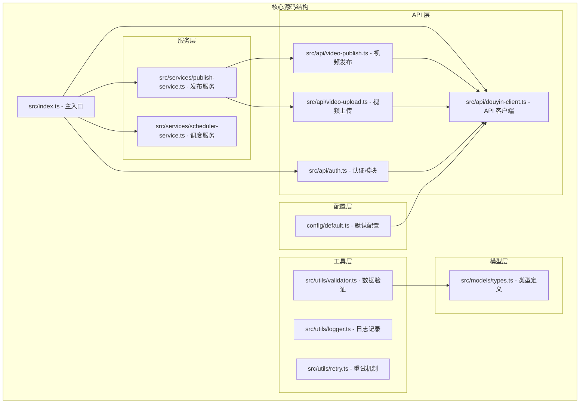
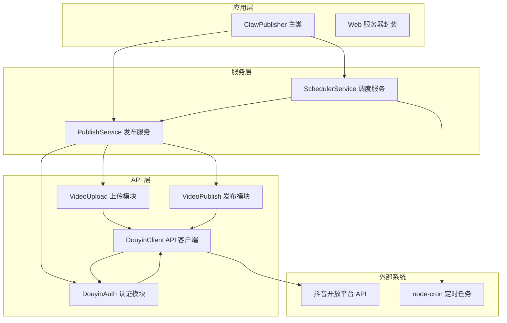
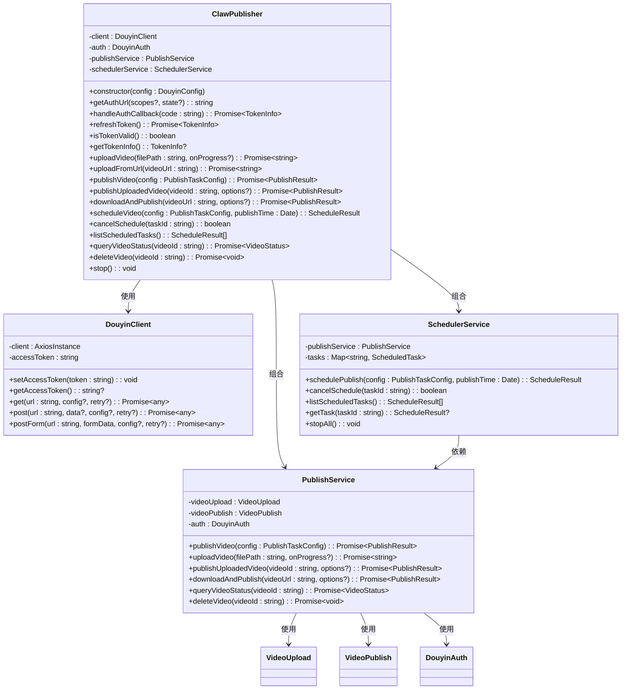
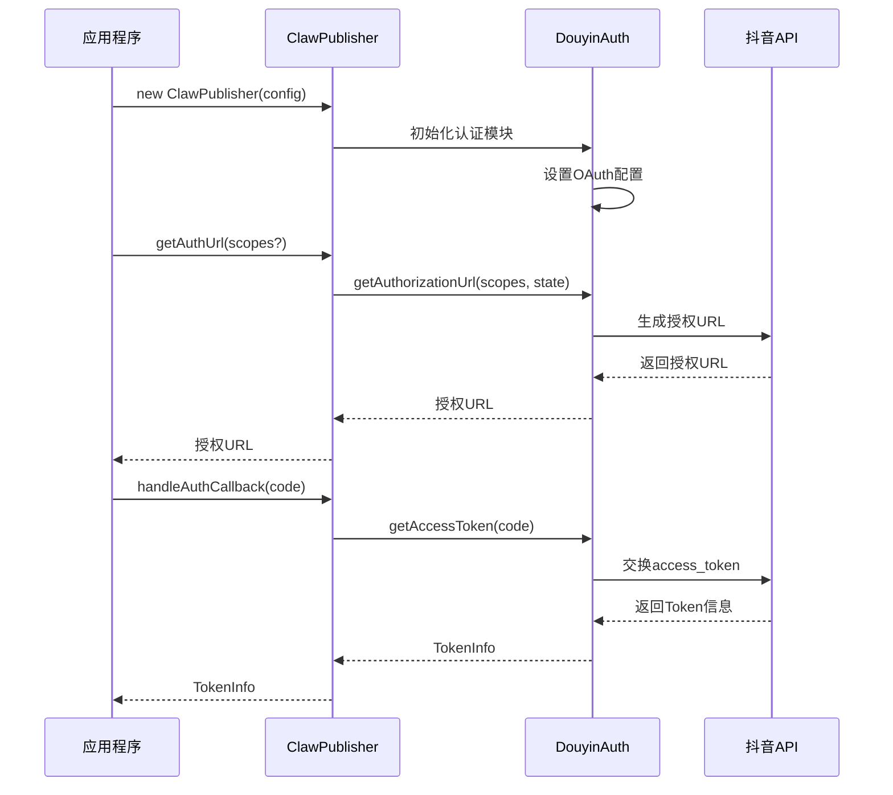
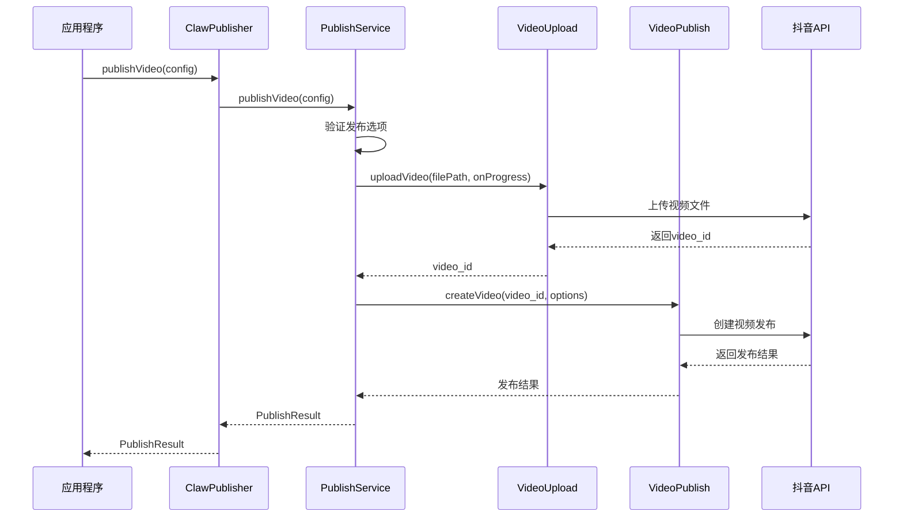
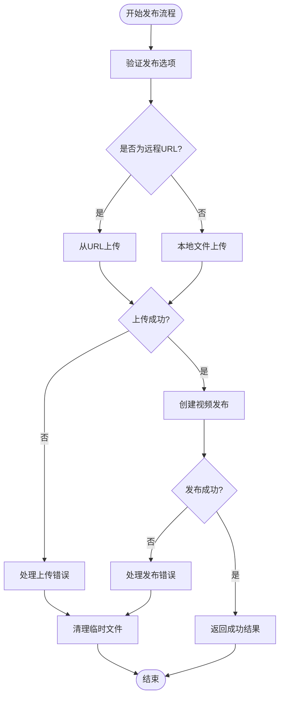
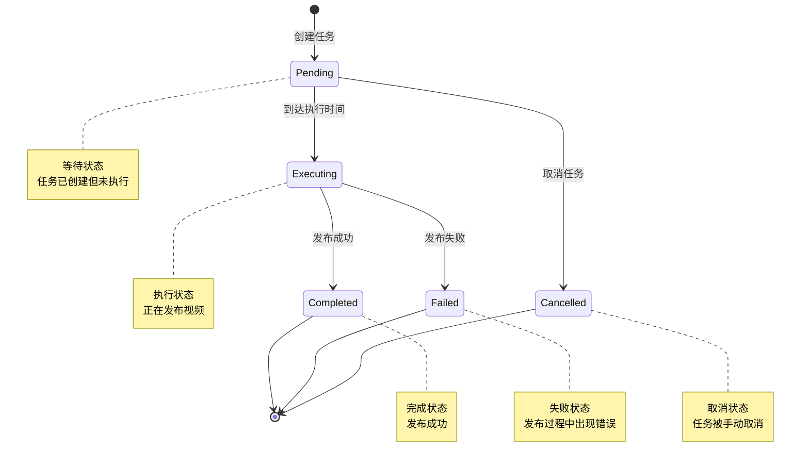
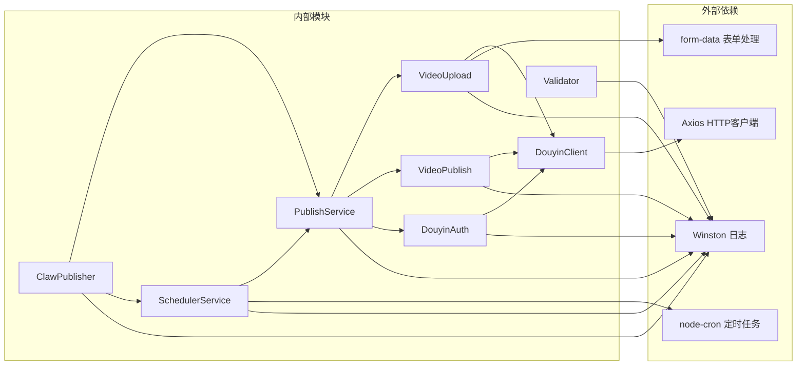

# ClawPublisher 主类

<cite>
**本文档引用的文件**
- [src/index.ts](file://src/index.ts)
- [src/services/publish-service.ts](file://src/services/publish-service.ts)
- [src/api/video-publish.ts](file://src/api/video-publish.ts)
- [src/api/video-upload.ts](file://src/api/video-upload.ts)
- [src/api/auth.ts](file://src/api/auth.ts)
- [src/api/douyin-client.ts](file://src/api/douyin-client.ts)
- [src/services/scheduler-service.ts](file://src/services/scheduler-service.ts)
- [src/models/types.ts](file://src/models/types.ts)
- [src/utils/validator.ts](file://src/utils/validator.ts)
- [config/default.ts](file://config/default.ts)
- [example.ts](file://example.ts)
- [web/server/src/services/publisher.ts](file://web/server/src/services/publisher.ts)
</cite>

## 目录
1. [简介](#简介)
2. [项目结构](#项目结构)
3. [核心组件](#核心组件)
4. [架构概览](#架构概览)
5. [详细组件分析](#详细组件分析)
6. [依赖关系分析](#依赖关系分析)
7. [性能考虑](#性能考虑)
8. [故障排除指南](#故障排除指南)
9. [结论](#结论)

## 简介

ClawPublisher 是一个专为抖音（TikTok）平台设计的视频发布自动化系统。该主类提供了统一的接口，用于集成到 ClawBot 或其他系统中，实现视频内容的上传、发布、定时发布等功能。系统基于 TypeScript 构建，采用模块化设计，具有良好的扩展性和维护性。

## 项目结构

该项目采用清晰的分层架构设计，主要包含以下核心目录：

**图表来源**
- [src/index.ts:1-248](file://src/index.ts#L1-L248)
- [src/api/auth.ts:1-190](file://src/api/auth.ts#L1-L190)
- [src/api/douyin-client.ts:1-237](file://src/api/douyin-client.ts#L1-L237)

**章节来源**
- [src/index.ts:1-248](file://src/index.ts#L1-L248)
- [config/default.ts:1-49](file://config/default.ts#L1-L49)

## 核心组件

ClawPublisher 主类作为整个系统的入口点，集成了多个核心功能模块：

### 主要功能特性

1. **统一认证管理** - OAuth 2.0 授权流程，Token 自动刷新机制
2. **多模式视频上传** - 支持本地文件直传和分片上传，以及远程 URL 上传
3. **智能发布流程** - 自动化的上传-发布一体化流程
4. **定时发布系统** - 基于 cron 的定时任务调度
5. **完整的视频管理** - 视频状态查询、删除等操作
6. **强大的配置系统** - 支持多种上传策略和发布选项

### 关键接口概览

| 功能分类 | 核心方法 | 描述 |
|---------|---------|------|
| 认证管理 | `getAuthUrl()`, `handleAuthCallback()`, `refreshToken()` | OAuth 授权和 Token 管理 |
| 视频上传 | `uploadVideo()`, `uploadFromUrl()` | 支持本地和远程视频上传 |
| 视频发布 | `publishVideo()`, `publishUploadedVideo()`, `downloadAndPublish()` | 完整的发布流程 |
| 定时发布 | `scheduleVideo()`, `cancelSchedule()`, `listScheduledTasks()` | 任务调度管理 |
| 视频管理 | `queryVideoStatus()`, `deleteVideo()` | 视频生命周期管理 |

**章节来源**
- [src/index.ts:29-244](file://src/index.ts#L29-L244)
- [src/models/types.ts:191-201](file://src/models/types.ts#L191-L201)

## 架构概览

ClawPublisher 采用了典型的三层架构模式，实现了关注点分离：

**图表来源**
- [src/index.ts:29-67](file://src/index.ts#L29-L67)
- [src/services/publish-service.ts:22-31](file://src/services/publish-service.ts#L22-L31)
- [src/services/scheduler-service.ts:23-29](file://src/services/scheduler-service.ts#L23-L29)

## 详细组件分析

### ClawPublisher 主类

ClawPublisher 是整个系统的核心控制器，负责协调各个子模块的工作：

**图表来源**
- [src/index.ts:29-244](file://src/index.ts#L29-L244)
- [src/services/publish-service.ts:22-31](file://src/services/publish-service.ts#L22-L31)
- [src/services/scheduler-service.ts:23-29](file://src/services/scheduler-service.ts#L23-L29)

#### 认证流程序列图

**图表来源**
- [src/index.ts:77-88](file://src/index.ts#L77-L88)
- [src/api/auth.ts:45-91](file://src/api/auth.ts#L45-L91)

#### 发布流程序列图

**图表来源**
- [src/index.ts:153-155](file://src/index.ts#L153-L155)
- [src/services/publish-service.ts:38-80](file://src/services/publish-service.ts#L38-L80)

### 发布服务组件

PublishService 作为业务编排层，负责协调上传和发布的具体流程：

**图表来源**
- [src/services/publish-service.ts:38-80](file://src/services/publish-service.ts#L38-L80)
- [src/services/publish-service.ts:133-172](file://src/services/publish-service.ts#L133-L172)

### 定时发布组件

SchedulerService 提供了基于 cron 的定时任务调度功能：

**图表来源**
- [src/services/scheduler-service.ts:11-18](file://src/services/scheduler-service.ts#L11-L18)
- [src/services/scheduler-service.ts:140-162](file://src/services/scheduler-service.ts#L140-L162)

**章节来源**
- [src/index.ts:29-244](file://src/index.ts#L29-L244)
- [src/services/publish-service.ts:22-228](file://src/services/publish-service.ts#L22-L228)
- [src/services/scheduler-service.ts:23-202](file://src/services/scheduler-service.ts#L23-L202)

## 依赖关系分析

系统采用模块化设计，各组件之间的依赖关系清晰明确：

**图表来源**
- [package.json:18-33](file://package.json#L18-L33)
- [src/index.ts:1-14](file://src/index.ts#L1-L14)

### 核心依赖说明

| 依赖包 | 版本 | 用途 |
|--------|------|------|
| axios | ^1.6.0 | HTTP 请求客户端，处理与抖音 API 的通信 |
| node-cron | ^3.0.3 | 定时任务调度，实现视频定时发布功能 |
| form-data | ^4.0.0 | 处理 multipart/form-data 请求，支持文件上传 |
| winston | ^3.11.0 | 结构化日志记录，提供详细的系统运行日志 |
| dotenv | ^16.3.0 | 环境变量管理，支持敏感配置的安全存储 |

**章节来源**
- [package.json:18-33](file://package.json#L18-L33)
- [src/index.ts:1-20](file://src/index.ts#L1-L20)

## 性能考虑

系统在设计时充分考虑了性能优化和资源管理：

### 上传性能优化

1. **智能上传策略** - 根据文件大小自动选择直传或分片上传
2. **进度监控** - 实时反馈上传进度，提升用户体验
3. **并发控制** - 合理的并发连接数，避免资源耗尽

### 缓存和重试机制

1. **Token 缓存** - 避免频繁的认证请求
2. **智能重试** - 针对网络错误和限流情况的自适应重试
3. **超时控制** - 合理的请求超时设置，防止长时间阻塞

### 内存管理

1. **流式处理** - 大文件采用流式读取，避免内存溢出
2. **临时文件清理** - 自动清理下载的临时文件
3. **连接池管理** - 复用 HTTP 连接，减少资源消耗

## 故障排除指南

### 常见问题及解决方案

#### 认证相关问题

| 问题症状 | 可能原因 | 解决方案 |
|----------|----------|----------|
| Token 过期错误 | Access Token 已过期 | 调用 `refreshToken()` 方法刷新 Token |
| 授权失败 | Client Key/Secret 配置错误 | 检查抖音开发者平台的凭证配置 |
| 回调地址错误 | Redirect URI 不匹配 | 确认回调地址与抖音平台配置一致 |

#### 上传相关问题

| 问题症状 | 可能原因 | 解决方案 |
|----------|----------|----------|
| 上传失败 | 文件格式不支持 | 检查文件格式是否在支持列表中 |
| 上传超时 | 网络连接不稳定 | 检查网络状况，考虑使用分片上传 |
| 进度不更新 | 上传监听器未正确设置 | 确认 onProgress 回调函数的正确性 |

#### 发布相关问题

| 问题症状 | 可能原因 | 解决方案 |
|----------|----------|----------|
| 发布失败 | 发布选项验证失败 | 检查标题、描述、hashtag 等选项的长度限制 |
| 定时任务不执行 | Cron 表达式错误 | 验证定时时间设置的合理性 |
| 视频状态查询失败 | Video ID 无效 | 确认视频 ID 的正确性 |

#### 调试和日志

系统提供了完善的日志记录机制，建议：

1. **启用详细日志** - 在开发环境中启用 DEBUG 级别日志
2. **监控 API 调用** - 记录所有与抖音 API 的交互
3. **错误追踪** - 捕获并记录详细的错误信息和堆栈跟踪

**章节来源**
- [src/api/auth.ts:133-151](file://src/api/auth.ts#L133-L151)
- [src/utils/validator.ts:45-86](file://src/utils/validator.ts#L45-L86)
- [src/services/publish-service.ts:71-79](file://src/services/publish-service.ts#L71-L79)

## 结论

ClawPublisher 主类是一个设计精良的抖音视频发布自动化系统，具有以下显著特点：

### 技术优势

1. **模块化设计** - 清晰的分层架构，便于维护和扩展
2. **完整的功能覆盖** - 从认证到发布的全链路支持
3. **强大的配置能力** - 灵活的上传策略和发布选项
4. **健壮的错误处理** - 完善的异常捕获和恢复机制
5. **优秀的性能表现** - 智能的资源管理和优化策略

### 应用价值

该系统特别适用于需要批量处理抖音内容的企业和个人创作者，能够显著提升内容发布的效率和质量。通过提供统一的 API 接口，开发者可以轻松集成到现有的工作流中，实现自动化的内容管理和分发。

### 发展前景

随着抖音生态的不断发展，ClawPublisher 系统还可以进一步扩展：

1. **多平台支持** - 扩展到其他短视频平台
2. **AI 功能集成** - 添加智能内容分析和优化功能
3. **数据分析增强** - 提供更深入的视频表现分析
4. **团队协作功能** - 支持多人协作的内容管理

通过持续的优化和功能扩展，ClawPublisher 将成为抖音内容运营领域的重要工具，为企业和个人创作者提供强有力的技术支撑。