# MCP服务器集成

<cite>
**本文档引用的文件**
- [mcp-server/src/index.ts](file://mcp-server/src/index.ts)
- [mcp-server/package.json](file://mcp-server/package.json)
- [mcp-server/README.md](file://mcp-server/README.md)
- [mcp-server/tsconfig.json](file://mcp-server/tsconfig.json)
- [src/index.ts](file://src/index.ts)
- [src/models/types.ts](file://src/models/types.ts)
- [src/services/publish-service.ts](file://src/services/publish-service.ts)
- [src/api/douyin-client.ts](file://src/api/douyin-client.ts)
- [src/api/auth.ts](file://src/api/auth.ts)
- [src/services/scheduler-service.ts](file://src/services/scheduler-service.ts)
- [src/services/ai-publish-service.ts](file://src/services/ai-publish-service.ts)
- [src/services/ai/content-generator.ts](file://src/services/ai/content-generator.ts)
- [src/api/ai/doubao-client.ts](file://src/api/ai/doubao-client.ts)
- [web/server/src/index.ts](file://web/server/src/index.ts)
- [web/server/src/routes/publish.ts](file://web/server/src/routes/publish.ts)
- [web/server/src/routes/ai.ts](file://web/server/src/routes/ai.ts)
- [web/server/src/services/publisher.ts](file://web/server/src/services/publisher.ts)
- [config/default.ts](file://config/default.ts)
- [deploy/nginx.conf](file://deploy/nginx.conf)
- [deploy/nginx-ssl.conf](file://deploy/nginx-ssl.conf)
- [web/client/src/api/client.ts](file://web/client/src/api/client.ts)
</cite>

## 更新摘要
**变更内容**
- MCP服务器超时时间从120秒增加到600秒（10分钟），以支持AI视频生成的长时间处理
- Nginx代理配置更新，API代理超时时间调整为600秒，支持AI视频生成的长时间处理
- 前端AI客户端使用独立的长超时配置（600秒），专门用于AI生成任务
- 完善了超时配置的多层次架构设计
- 增强了ai_create_and_publish工具的图片类型检测和用户指导功能
- 改进了API客户端超时配置，支持不同场景下的超时需求

## 目录
1. [简介](#简介)
2. [项目结构](#项目结构)
3. [核心组件](#核心组件)
4. [架构概览](#架构概览)
5. [详细组件分析](#详细组件分析)
6. [依赖关系分析](#依赖关系分析)
7. [性能考虑](#性能考虑)
8. [故障排除指南](#故障排除指南)
9. [结论](#结论)

## 简介

ClawOperations MCP Server 是一个基于 Model Context Protocol (MCP) 的现代化服务器集成解决方案，专为 ClawOperations AI视频创作与抖音发布平台设计。该系统通过标准的MCP协议实现了AI平台（如 OpenClaw）与视频创作和发布功能的无缝集成，提供了从需求分析到内容生成再到抖音平台发布的完整自动化工作流。

该项目采用模块化架构设计，将复杂的视频创作和发布流程封装为8个标准化的MCP工具接口，为AI系统提供了统一的外部服务调用入口。MCP服务器作为系统的统一入口点，负责参数验证、错误处理和结果格式化，确保所有外部调用都遵循一致的接口规范。

**更新** 新增了完整的MCP服务器实现，集成了@modelcontextprotocol/sdk，并提供了8个标准化的AI工具接口，支持完整的AI创作和发布工作流。**重大更新**：超时配置已从120秒调整为600秒（10分钟），以充分支持AI视频生成的长时间处理需求，同时完善了Nginx代理配置和前端AI客户端的超时设置。**新增功能**：增强了ai_create_and_publish工具，增加了图片类型检测和用户指导功能，提升了用户体验。

## 项目结构

项目采用多模块架构，主要包含以下核心目录：

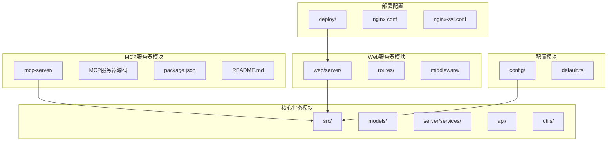

**图表来源**
- [mcp-server/src/index.ts:1-365](file://mcp-server/src/index.ts#L1-L365)
- [src/index.ts:1-248](file://src/index.ts#L1-L248)
- [web/server/src/index.ts:1-72](file://web/server/src/index.ts#L1-L72)
- [deploy/nginx.conf:1-71](file://deploy/nginx.conf#L1-L71)
- [deploy/nginx-ssl.conf:1-78](file://deploy/nginx-ssl.conf#L1-L78)

**章节来源**
- [mcp-server/package.json:1-23](file://mcp-server/package.json#L1-L23)
- [mcp-server/tsconfig.json:1-17](file://mcp-server/tsconfig.json#L1-L17)

## 核心组件

### MCP服务器核心功能

MCP服务器作为整个系统的入口点，提供了8个标准化的AI工具接口，每个工具都经过精心设计，具有明确的输入参数规范和输出格式：

| 工具名称 | 功能描述 | 输入参数 | 输出格式 |
|---------|----------|----------|----------|
| ai_create_content | AI智能创作：根据用户需求自动生成视频/图片内容和推广文案 | requirement, contentType | 任务ID、分析结果、内容信息、文案 |
| ai_analyze_requirement | 分析用户的创作需求，返回结构化分析结果 | requirement, contentTypePreference | 分析结果 |
| ai_generate_copywriting | 快速生成推广文案，包括标题、描述和话题标签 | theme, keyPoints | 文案内容 |
| **publish_video** | **发布已有视频到抖音平台。注意：需要提供真实存在的视频文件路径。如果用户要求「AI生成并发布」，请使用 ai_create_and_publish 工具。** | **videoPath, title, description, hashtags, publishTime, isRemoteUrl** | **发布结果、视频ID** |
| get_publish_tasks | 获取所有定时发布任务列表 | 无 | 任务列表 |
| cancel_publish_task | 取消指定的定时发布任务 | taskId | 取消结果 |
| get_auth_status | 获取抖音认证状态 | 无 | 认证状态 |
| **ai_create_and_publish** | **【推荐】AI一键创作并发布：根据文字需求自动生成视频/图片并发布到抖音。当用户说"发布一个XX视频"、"创作并发布"、"生成并发布"时，应使用此工具。完整工作流：需求分析 → AI生成视频/图片 → 文案生成 → 发布。** | **requirement, contentType, scheduleTime** | **完整工作流结果** |

### 核心业务架构

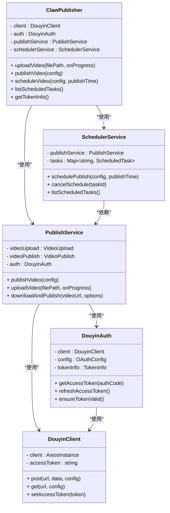

**图表来源**
- [src/index.ts:29-244](file://src/index.ts#L29-L244)
- [src/services/publish-service.ts:22-31](file://src/services/publish-service.ts#L22-L31)
- [src/services/scheduler-service.ts:23-29](file://src/services/scheduler-service.ts#L23-L29)
- [src/api/douyin-client.ts:13-44](file://src/api/douyin-client.ts#L13-L44)
- [src/api/auth.ts:28-36](file://src/api/auth.ts#L28-L36)

**章节来源**
- [src/index.ts:29-244](file://src/index.ts#L29-L244)
- [src/models/types.ts:193-201](file://src/models/types.ts#L193-L201)

## 架构概览

### 整体系统架构

```mermaid
graph TB
subgraph "AI客户端层"
OPENCLAW[OpenClaw AI平台]
OTHER_AI[其他AI系统]
END_USER[最终用户]
end
subgraph "MCP协议层"
MCP_SERVER[MCP服务器]
MCP_TRANSPORT[STDIO传输]
MCP_PROTOCOL[MCP协议]
MCP_SDK[@modelcontextprotocol/sdk]
end
subgraph "业务逻辑层"
CLAW_PUBLISHER[ClawPublisher主控制器]
PUBLISH_SERVICE[发布服务]
SCHEDULER_SERVICE[定时调度服务]
AI_SERVICE[AI创作服务]
end
subgraph "数据访问层"
DYOYIN_API[抖音开放平台API]
LOCAL_STORAGE[本地存储]
FILE_SYSTEM[文件系统]
end
subgraph "超时配置层"
TIMEOUT_CONFIG[超时配置管理]
MCP_TIMEOUT[MCP服务器: 600秒]
NGINX_TIMEOUT[Nginx代理: 600秒]
FRONTEND_TIMEOUT[前端普通客户端: 30秒]
FRONTEND_AI_TIMEOUT[前端AI客户端: 600秒]
BACKEND_API_TIMEOUT[后端API: 30秒]
end
OPENCLAW --> MCP_SERVER
OTHER_AI --> MCP_SERVER
END_USER --> MCP_SERVER
MCP_SERVER --> MCP_TRANSPORT
MCP_TRANSPORT --> MCP_PROTOCOL
MCP_PROTOCOL --> MCP_SDK
MCP_PROTOCOL --> CLAW_PUBLISHER
CLAW_PUBLISHER --> PUBLISH_SERVICE
CLAW_PUBLISHER --> SCHEDULER_SERVICE
CLAW_PUBLISHER --> AI_SERVICE
PUBLISH_SERVICE --> DYOYIN_API
SCHEDULER_SERVICE --> LOCAL_STORAGE
AI_SERVICE --> FILE_SYSTEM
TIMEOUT_CONFIG --> MCP_TIMEOUT
TIMEOUT_CONFIG --> NGINX_TIMEOUT
TIMEOUT_CONFIG --> FRONTEND_TIMEOUT
TIMEOUT_CONFIG --> FRONTEND_AI_TIMEOUT
TIMEOUT_CONFIG --> BACKEND_API_TIMEOUT
```

**图表来源**
- [mcp-server/src/index.ts:318-365](file://mcp-server/src/index.ts#L318-L365)
- [src/index.ts:29-67](file://src/index.ts#L29-L67)
- [web/server/src/index.ts:20-72](file://web/server/src/index.ts#L20-L72)
- [deploy/nginx.conf:33-34](file://deploy/nginx.conf#L33-L34)
- [web/client/src/api/client.ts:53-59](file://web/client/src/api/client.ts#L53-L59)

### 数据流处理流程

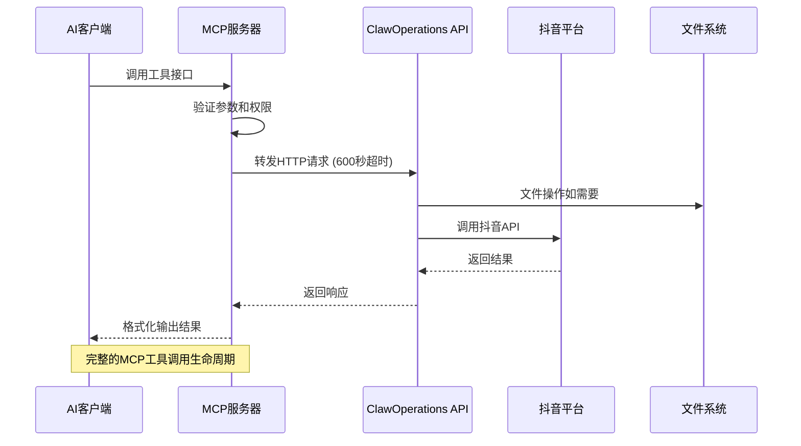

**图表来源**
- [mcp-server/src/index.ts:176-315](file://mcp-server/src/index.ts#L176-L315)
- [web/server/src/routes/publish.ts:11-35](file://web/server/src/routes/publish.ts#L11-L35)

## 详细组件分析

### MCP服务器实现

MCP服务器的核心实现位于 `mcp-server/src/index.ts`，采用了标准的MCP协议实现模式，集成了@modelcontextprotocol/sdk：

#### 工具定义与注册

服务器定义了8个标准化工具，每个工具都有明确的输入参数规范和输出格式：

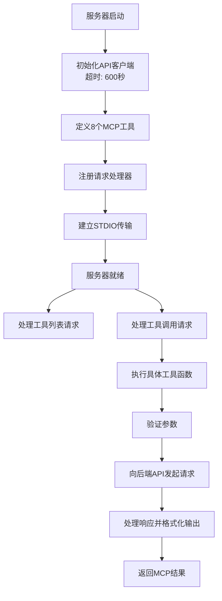

**图表来源**
- [mcp-server/src/index.ts:24-173](file://mcp-server/src/index.ts#L24-L173)
- [mcp-server/src/index.ts:330-348](file://mcp-server/src/index.ts#L330-L348)

#### 错误处理机制

MCP服务器实现了完善的错误处理机制，确保所有异常情况都能被正确捕获和报告：

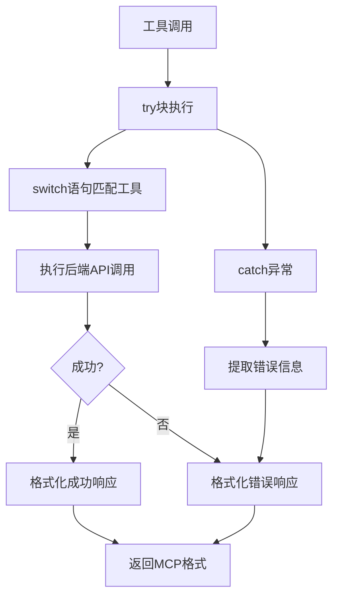

**图表来源**
- [mcp-server/src/index.ts:311-315](file://mcp-server/src/index.ts#L311-L315)

**章节来源**
- [mcp-server/src/index.ts:176-315](file://mcp-server/src/index.ts#L176-L315)

### 发布服务核心逻辑

发布服务 (`src/services/publish-service.ts`) 实现了完整的视频发布流程编排：

#### 发布流程编排

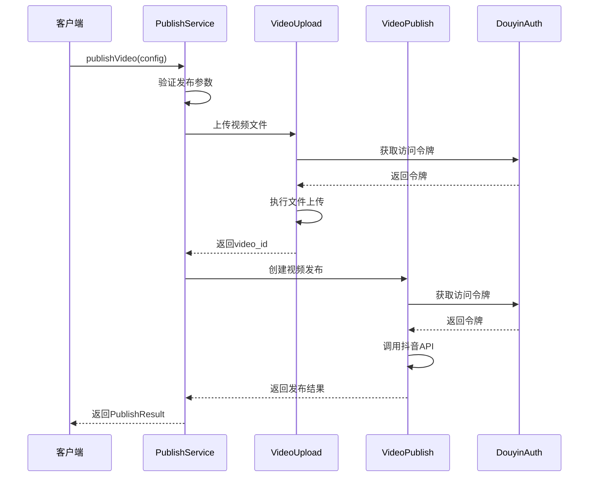

**图表来源**
- [src/services/publish-service.ts:38-80](file://src/services/publish-service.ts#L38-L80)

#### 定时发布调度

定时发布服务 (`src/services/scheduler-service.ts`) 使用 node-cron 实现精确的时间调度：

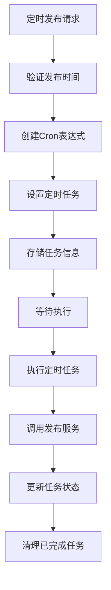

**图表来源**
- [src/services/scheduler-service.ts:37-72](file://src/services/scheduler-service.ts#L37-L72)
- [src/services/scheduler-service.ts:140-162](file://src/services/scheduler-service.ts#L140-L162)

**章节来源**
- [src/services/publish-service.ts:38-80](file://src/services/publish-service.ts#L38-L80)
- [src/services/scheduler-service.ts:37-72](file://src/services/scheduler-service.ts#L37-L72)

### 抖音API客户端

抖音API客户端 (`src/api/douyin-client.ts`) 实现了与抖音开放平台的通信：

#### 请求重试机制

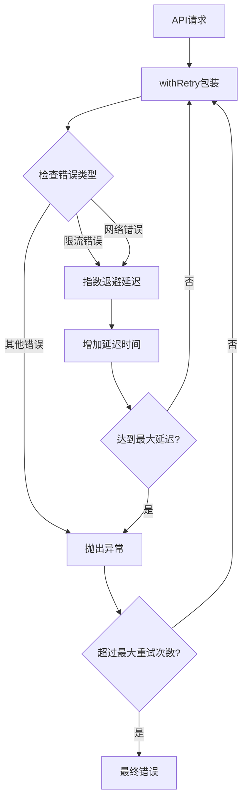

**图表来源**
- [src/api/douyin-client.ts:129-139](file://src/api/douyin-client.ts#L129-L139)
- [src/api/douyin-client.ts:204-220](file://src/api/douyin-client.ts#L204-L220)

**章节来源**
- [src/api/douyin-client.ts:124-166](file://src/api/douyin-client.ts#L124-L166)

### Web服务器集成

Web服务器 (`web/server/src/index.ts`) 提供RESTful API接口：

#### 路由组织结构

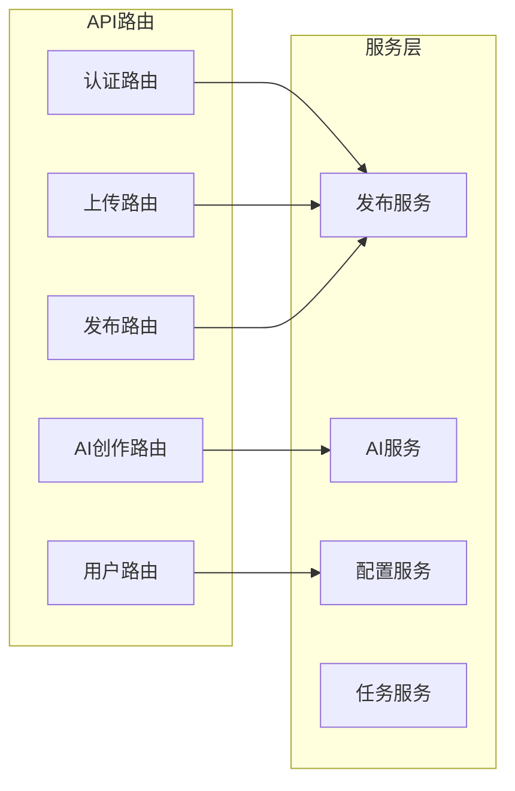

**图表来源**
- [web/server/src/index.ts:7-11](file://web/server/src/index.ts#L7-L11)
- [web/server/src/routes/publish.ts:1-123](file://web/server/src/routes/publish.ts#L1-L123)

**章节来源**
- [web/server/src/index.ts:20-72](file://web/server/src/index.ts#L20-L72)
- [web/server/src/routes/publish.ts:11-35](file://web/server/src/routes/publish.ts#L11-L35)

### 超时配置管理

**更新** 系统采用了多层次的超时配置管理，专门针对AI视频生成的长时间处理需求：

#### 超时配置层次结构

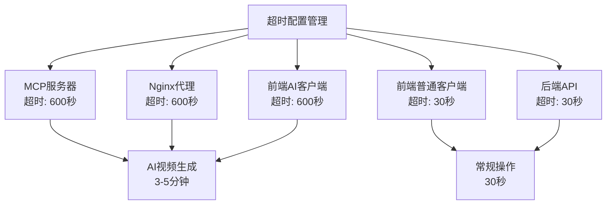

**图表来源**
- [mcp-server/src/index.ts:15-21](file://mcp-server/src/index.ts#L15-L21)
- [deploy/nginx.conf:33-34](file://deploy/nginx.conf#L33-L34)
- [web/client/src/api/client.ts:53-59](file://web/client/src/api/client.ts#L53-L59)

**章节来源**
- [mcp-server/src/index.ts:15-21](file://mcp-server/src/index.ts#L15-L21)
- [deploy/nginx.conf:33-34](file://deploy/nginx.conf#L33-L34)
- [web/client/src/api/client.ts:53-59](file://web/client/src/api/client.ts#L53-L59)

### AI创作服务增强

**更新** ai_create_and_publish工具已增强，增加了图片类型检测和用户指导功能：

#### 图片类型检测与用户指导

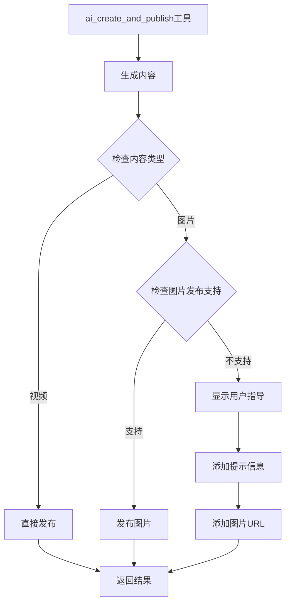

**图表来源**
- [mcp-server/src/index.ts:296-310](file://mcp-server/src/index.ts#L296-L310)

**章节来源**
- [mcp-server/src/index.ts:285-313](file://mcp-server/src/index.ts#L285-L313)

## 依赖关系分析

### 核心依赖关系

```mermaid
graph TB
subgraph "MCP服务器依赖"
MCP_SERVER[mcp-server]
SDK[@modelcontextprotocol/sdk]
AXIOS[axios]
ZOD[zod]
END_USER[最终用户]
ENDPOINT[HTTP端点]
end
subgraph "核心业务依赖"
CORE_LIB[src/]
EXPRESS[express]
CORS[cors]
NODE_CRON[node-cron]
DOTENV[dotenv]
end
subgraph "配置依赖"
DEFAULT_CONFIG[config/default.ts]
TYPES[typescript]
TS_NODE[ts-node]
end
subgraph "超时配置依赖"
TIMEOUT_DEPS[超时配置管理]
MCP_TIMEOUT[600秒]
NGINX_TIMEOUT[600秒]
FRONTEND_TIMEOUT[600秒]
end
MCP_SERVER --> SDK
MCP_SERVER --> AXIOS
MCP_SERVER --> ZOD
MCP_SERVER --> END_USER
MCP_SERVER --> ENDPOINT
CORE_LIB --> EXPRESS
CORE_LIB --> NODE_CRON
CORE_LIB --> DOTENV
MCP_SERVER --> CORE_LIB
CORE_LIB --> DEFAULT_CONFIG
TIMEOUT_DEPS --> MCP_TIMEOUT
TIMEOUT_DEPS --> NGINX_TIMEOUT
TIMEOUT_DEPS --> FRONTEND_TIMEOUT
```

**图表来源**
- [mcp-server/package.json:12-21](file://mcp-server/package.json#L12-L21)
- [web/server/src/index.ts:1-11](file://web/server/src/index.ts#L1-L11)

### 数据模型依赖

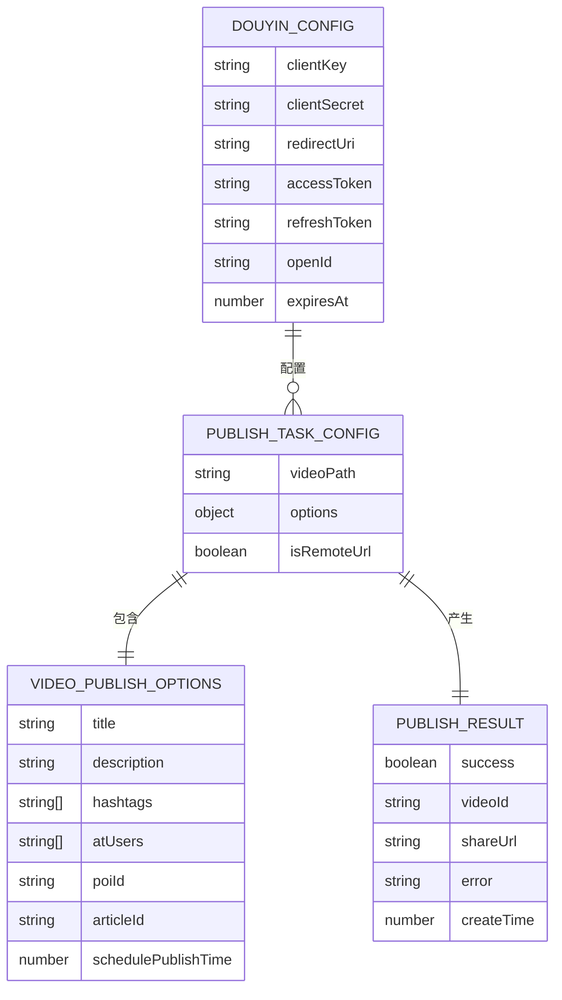

**图表来源**
- [src/models/types.ts:193-201](file://src/models/types.ts#L193-L201)
- [src/models/types.ts:161-168](file://src/models/types.ts#L161-L168)
- [src/models/types.ts:101-124](file://src/models/types.ts#L101-L124)
- [src/models/types.ts:173-179](file://src/models/types.ts#L173-L179)

**章节来源**
- [src/models/types.ts:1-410](file://src/models/types.ts#L1-L410)

## 性能考虑

### 并发处理优化

系统在多个层面实现了性能优化：

1. **异步并发处理**：所有API调用都采用异步模式，避免阻塞主线程
2. **连接池管理**：使用axios的连接复用机制减少TCP连接开销
3. **缓存策略**：MCP服务器对工具定义进行缓存，避免重复计算
4. **内存管理**：定时任务完成后及时清理内存占用

### 错误重试机制

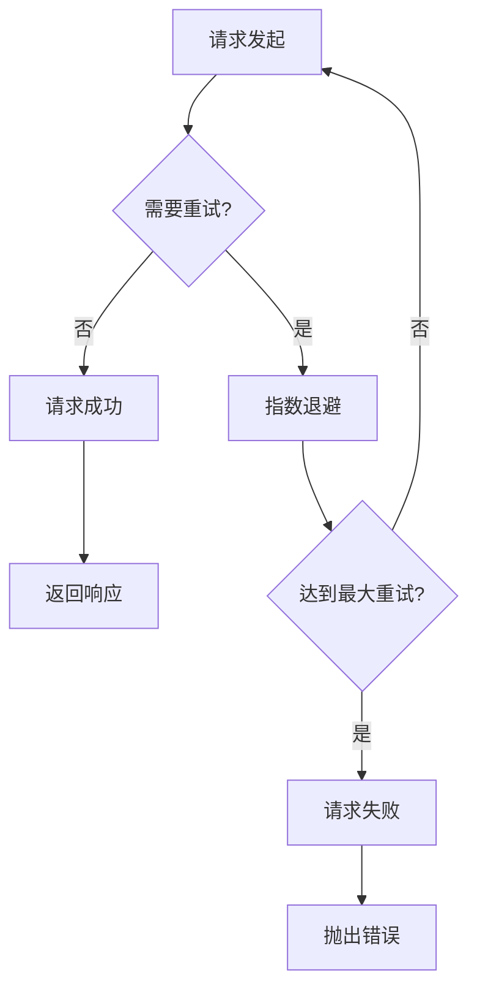

**图表来源**
- [src/api/douyin-client.ts:204-220](file://src/api/douyin-client.ts#L204-L220)

### 超时配置优化

**更新** 超时配置已进行全面优化，以支持AI视频生成的长时间处理：

#### 超时配置策略

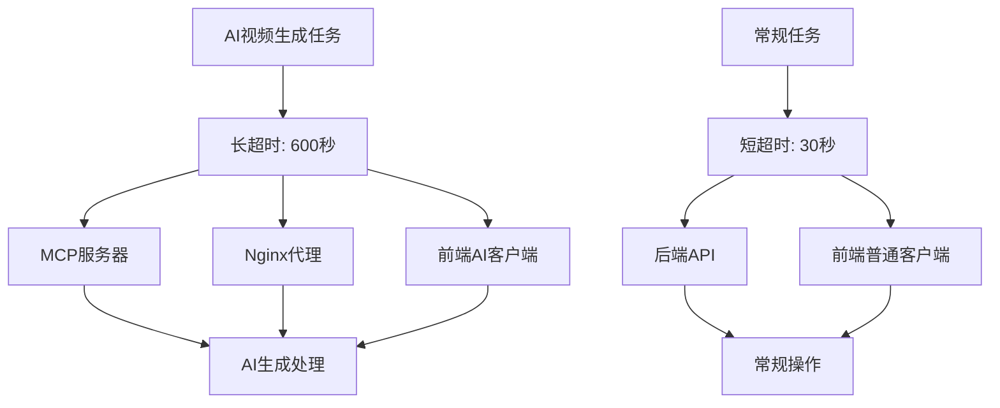

**图表来源**
- [mcp-server/src/index.ts:15-21](file://mcp-server/src/index.ts#L15-L21)
- [deploy/nginx.conf:33-34](file://deploy/nginx.conf#L33-L34)
- [web/client/src/api/client.ts:53-59](file://web/client/src/api/client.ts#L53-L59)

### AI创作服务优化

**更新** AI创作服务已增强，支持更好的图片类型检测和用户指导：

#### AI创作流程优化

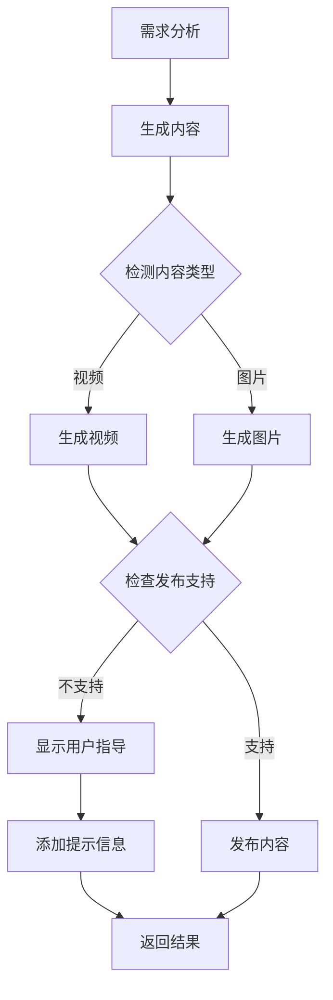

**图表来源**
- [src/services/ai-publish-service.ts:90-133](file://src/services/ai-publish-service.ts#L90-L133)
- [src/services/ai/content-generator.ts:98-120](file://src/services/ai/content-generator.ts#L98-L120)

## 故障排除指南

### 常见问题诊断

#### MCP服务器启动问题

**症状**：MCP服务器无法启动
**排查步骤**：
1. 检查CLAWOPS_API_URL环境变量是否正确设置
2. 验证后端API服务是否正常运行
3. 查看控制台错误日志获取详细信息

#### 认证失败问题

**症状**：抖音认证失败或Token过期
**排查步骤**：
1. 验证抖音应用配置信息
2. 检查access_token和refresh_token的有效性
3. 确认OAuth授权流程是否正确完成

#### 发布失败问题

**症状**：视频发布过程中出现错误
**排查步骤**：
1. 检查视频文件格式和大小限制
2. 验证发布选项参数的完整性
3. 查看抖音API返回的具体错误信息

#### 超时问题诊断

**症状**：AI视频生成过程中出现超时错误
**排查步骤**：
1. **检查MCP服务器超时配置**：确认 `mcp-server/src/index.ts` 中的axios超时设置为600000毫秒
2. **检查Nginx代理超时配置**：确认 `deploy/nginx.conf` 和 `deploy/nginx-ssl.conf` 中的proxy_read_timeout和proxy_send_timeout设置为600s
3. **检查前端AI客户端超时配置**：确认 `web/client/src/api/client.ts` 中的aiClient超时设置为600000毫秒
4. **验证AI生成任务的实际耗时**：监控AI视频生成的实际处理时间，确保不超过600秒
5. **检查网络连接稳定性**：确认服务器与抖音API之间的网络连接稳定

#### AI创作服务问题

**症状**：ai_create_and_publish工具返回图片但无法发布
**排查步骤**：
1. **检查图片类型检测**：确认工具正确识别内容类型为image
2. **验证用户指导功能**：确认工具返回note字段和imageUrl
3. **检查抖音API支持**：确认当前版本的抖音API不支持图片一键发布
4. **指导用户手动发布**：引导用户下载图片后通过抖音App手动发布

**章节来源**
- [mcp-server/README.md:31-38](file://mcp-server/README.md#L31-L38)
- [src/api/auth.ts:132-140](file://src/api/auth.ts#L132-L140)
- [mcp-server/src/index.ts:15-21](file://mcp-server/src/index.ts#L15-L21)
- [deploy/nginx.conf:33-34](file://deploy/nginx.conf#L33-L34)
- [web/client/src/api/client.ts:53-59](file://web/client/src/api/client.ts#L53-L59)

## 结论

ClawOperations MCP Server 提供了一个完整、可靠的AI视频创作和发布集成解决方案。通过标准化的MCP协议接口，该系统成功地将复杂的抖音视频发布流程封装为简单易用的工具调用，为AI平台提供了强大的内容创作和分发能力。

### 主要优势

1. **标准化接口**：8个标准化的MCP工具接口，便于AI系统集成
2. **完整工作流**：从需求分析到内容生成再到发布的一站式服务
3. **高可用性**：完善的错误处理和重试机制
4. **可扩展性**：模块化设计支持功能扩展和定制
5. **安全性**：严格的参数验证和权限控制
6. **生产就绪**：完整的TypeScript实现和配置管理
7. **超时优化**：专门针对AI视频生成的长时间处理优化
8. **用户体验增强**：ai_create_and_publish工具的图片类型检测和用户指导功能

### 技术特点

- 采用现代TypeScript开发，提供完整的类型安全
- 基于MCP协议的标准实现，确保与其他AI系统的兼容性
- 集成多种AI服务提供商，支持灵活的内容生成策略
- 完善的日志记录和监控机制，便于问题诊断和性能优化
- 支持生产环境配置和部署，具备企业级应用能力
- **重大更新**：实现了多层次超时配置管理，专门支持AI视频生成的长时间处理需求
- **新增功能**：增强了ai_create_and_publish工具，提供更好的图片类型检测和用户指导体验

### 超时配置优化

**更新** 系统已实现全面的超时配置优化，专门针对AI视频生成的长时间处理需求：

- **MCP服务器超时**：600秒（10分钟），支持AI视频生成的长时间处理
- **Nginx代理超时**：600秒，确保代理层不会中断长时间的AI生成请求
- **前端AI客户端超时**：600秒，专门用于AI生成任务的长超时处理
- **常规操作超时**：30秒，保持前端普通操作的响应速度

这种多层次的超时配置设计确保了系统既能处理AI视频生成的长时间任务，又能保持常规操作的高效响应。

### AI创作服务增强

**更新** AI创作服务已显著增强，提供了更好的用户体验：

- **智能内容类型检测**：自动识别生成内容的类型（视频或图片）
- **用户指导功能**：对于不支持自动发布的图片内容，提供清晰的用户指导
- **友好的错误提示**：为用户提供可操作的解决方案和建议
- **完整的发布流程**：即使图片无法自动发布，也能提供完整的创作和发布体验

该系统为AI驱动的内容创作和分发提供了一个坚实的技术基础，能够满足现代数字营销和内容创作的各种需求。通过MCP服务器的标准化接口，开发者可以轻松地将ClawOperations的功能集成到任何支持MCP协议的AI平台中。