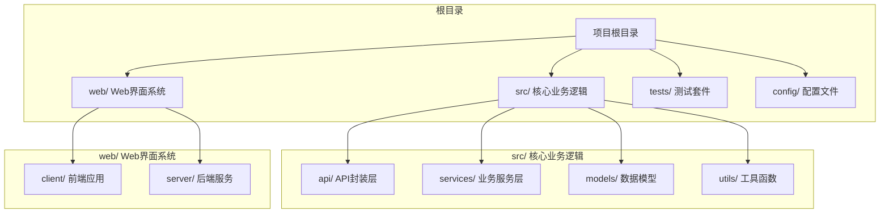
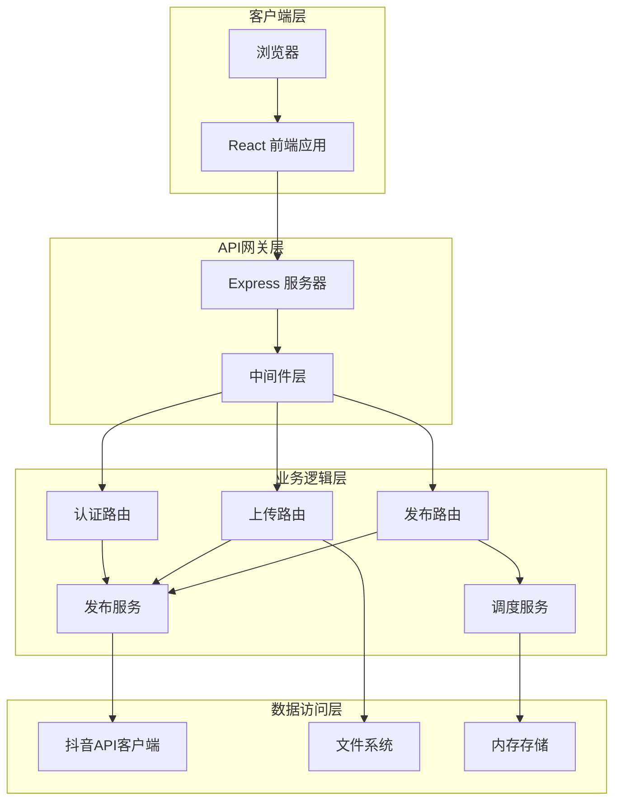
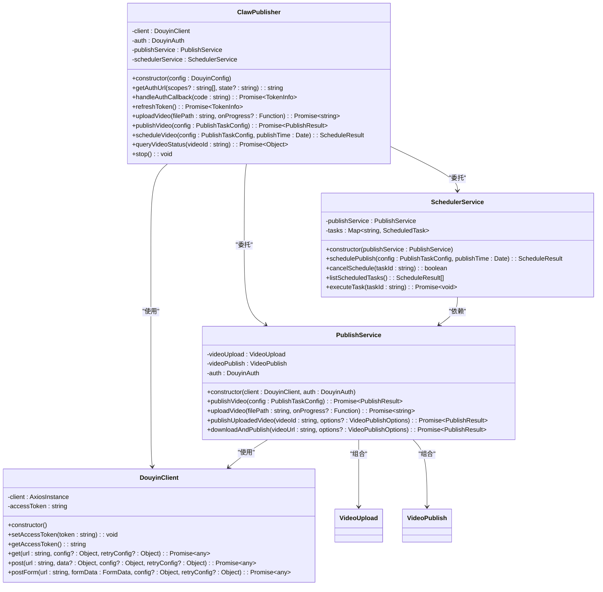
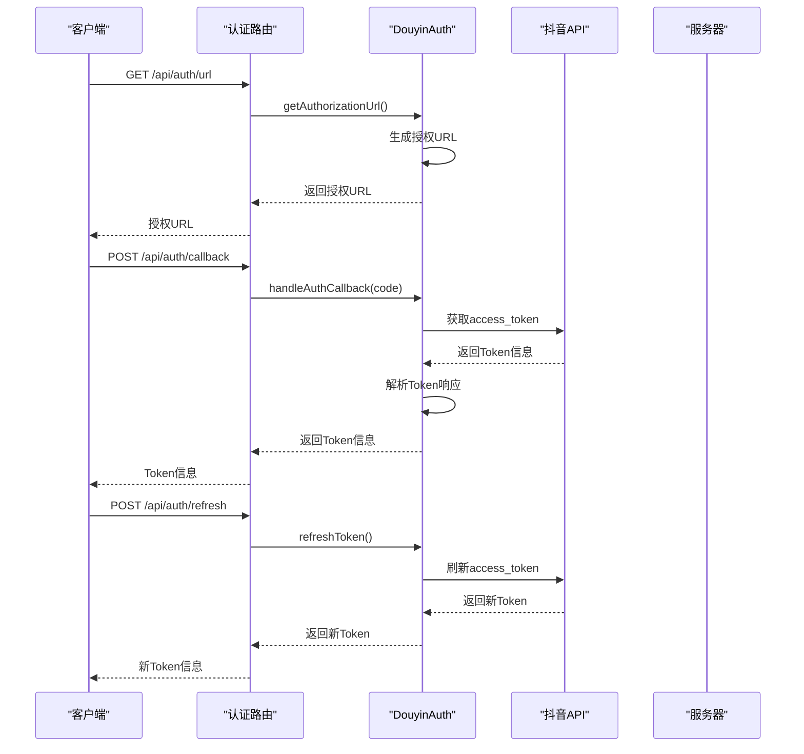
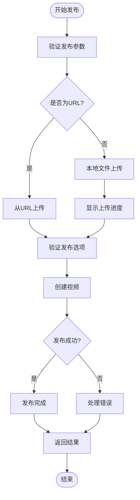
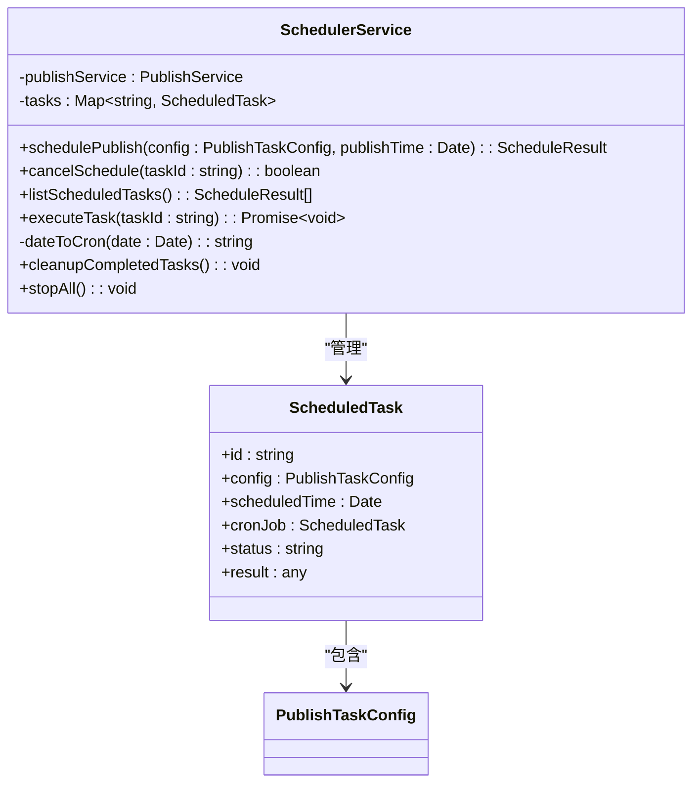
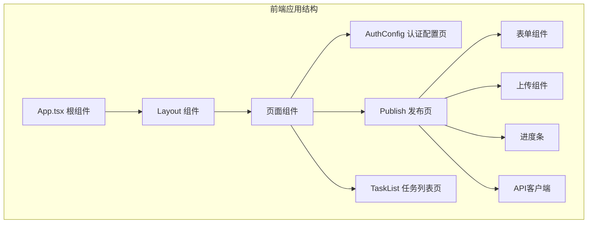
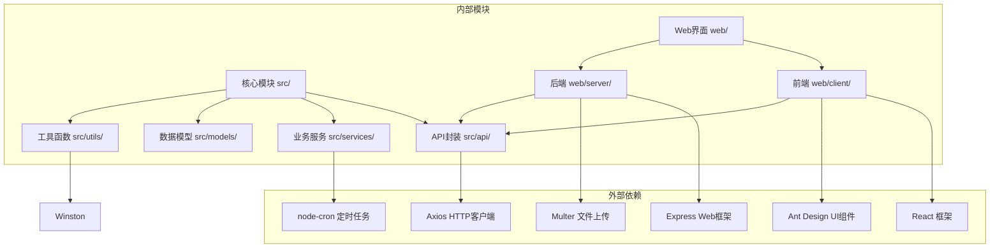

# Web界面系统

<cite>
**本文档引用的文件**
- [README.md](file://README.md)
- [package.json](file://package.json)
- [src/index.ts](file://src/index.ts)
- [src/models/types.ts](file://src/models/types.ts)
- [src/api/douyin-client.ts](file://src/api/douyin-client.ts)
- [src/api/auth.ts](file://src/api/auth.ts)
- [src/services/publish-service.ts](file://src/services/publish-service.ts)
- [src/services/scheduler-service.ts](file://src/services/scheduler-service.ts)
- [web/server/src/index.ts](file://web/server/src/index.ts)
- [web/server/src/routes/auth.ts](file://web/server/src/routes/auth.ts)
- [web/server/src/routes/upload.ts](file://web/server/src/routes/upload.ts)
- [web/server/src/routes/publish.ts](file://web/server/src/routes/publish.ts)
- [web/client/package.json](file://web/client/package.json)
- [web/client/src/App.tsx](file://web/client/src/App.tsx)
- [web/client/src/pages/Publish.tsx](file://web/client/src/pages/Publish.tsx)
</cite>

## 目录
1. [简介](#简介)
2. [项目结构](#项目结构)
3. [核心组件](#核心组件)
4. [架构概览](#架构概览)
5. [详细组件分析](#详细组件分析)
6. [依赖关系分析](#依赖关系分析)
7. [性能考虑](#性能考虑)
8. [故障排除指南](#故障排除指南)
9. [结论](#结论)

## 简介

ClawOperations 是一个专为抖音（TikTok）小龙虾营销账号设计的自动化运营管理系统。该系统提供完整的视频发布、定时发布、内容管理和数据分析功能，帮助用户高效管理抖音营销账户。

系统采用前后端分离架构，后端使用 Node.js + Express 提供 RESTful API，前端使用 React + Ant Design 构建用户界面。通过与抖音官方 API 的深度集成，实现了从视频上传到发布的完整自动化流程。

## 项目结构

该项目采用模块化组织方式，主要分为以下几个核心部分：

**图表来源**
- [package.json:1-38](file://package.json#L1-L38)
- [README.md:92-105](file://README.md#L92-L105)

**章节来源**
- [package.json:1-38](file://package.json#L1-L38)
- [README.md:92-105](file://README.md#L92-L105)

## 核心组件

### 主要技术栈

系统采用现代化的技术栈构建：

- **后端**: Node.js 18+, Express.js, TypeScript
- **前端**: React 18, Ant Design, Vite
- **数据库**: 无（纯 API 驱动）
- **构建工具**: npm scripts, Vite, TypeScript compiler

### 核心架构模式

系统采用分层架构设计，包括：

1. **表现层**: React 前端应用
2. **控制层**: Express.js API 服务
3. **业务层**: 核心业务逻辑服务
4. **数据访问层**: 抖音 API 客户端封装

**章节来源**
- [package.json:18-33](file://package.json#L18-L33)
- [web/client/package.json:12-30](file://web/client/package.json#L12-L30)

## 架构概览

系统采用微服务化的架构设计，前后端分离，通过 RESTful API 进行通信：

**图表来源**
- [web/server/src/index.ts:1-42](file://web/server/src/index.ts#L1-L42)
- [web/server/src/routes/auth.ts:1-119](file://web/server/src/routes/auth.ts#L1-L119)
- [web/server/src/routes/upload.ts:1-106](file://web/server/src/routes/upload.ts#L1-L106)
- [web/server/src/routes/publish.ts:1-123](file://web/server/src/routes/publish.ts#L1-L123)

## 详细组件分析

### 核心发布系统

ClawPublisher 是系统的核心类，提供了统一的对外接口：

**图表来源**
- [src/index.ts:29-244](file://src/index.ts#L29-L244)
- [src/api/douyin-client.ts:13-237](file://src/api/douyin-client.ts#L13-L237)
- [src/services/publish-service.ts:22-228](file://src/services/publish-service.ts#L22-L228)
- [src/services/scheduler-service.ts:23-202](file://src/services/scheduler-service.ts#L23-L202)

**章节来源**
- [src/index.ts:29-244](file://src/index.ts#L29-L244)
- [src/api/douyin-client.ts:13-237](file://src/api/douyin-client.ts#L13-L237)
- [src/services/publish-service.ts:22-228](file://src/services/publish-service.ts#L22-L228)
- [src/services/scheduler-service.ts:23-202](file://src/services/scheduler-service.ts#L23-L202)

### 认证系统

系统实现了完整的 OAuth 2.0 认证流程：

**图表来源**
- [src/api/auth.ts:29-190](file://src/api/auth.ts#L29-L190)
- [web/server/src/routes/auth.ts:53-116](file://web/server/src/routes/auth.ts#L53-L116)

**章节来源**
- [src/api/auth.ts:29-190](file://src/api/auth.ts#L29-L190)
- [web/server/src/routes/auth.ts:53-116](file://web/server/src/routes/auth.ts#L53-L116)

### 发布流程

视频发布流程包含上传、验证、发布等步骤：

**图表来源**
- [src/services/publish-service.ts:38-80](file://src/services/publish-service.ts#L38-L80)
- [src/services/publish-service.ts:101-125](file://src/services/publish-service.ts#L101-L125)

**章节来源**
- [src/services/publish-service.ts:38-80](file://src/services/publish-service.ts#L38-L80)
- [src/services/publish-service.ts:101-125](file://src/services/publish-service.ts#L101-L125)

### 定时发布系统

系统使用 node-cron 实现定时发布功能：

**图表来源**
- [src/services/scheduler-service.ts:23-202](file://src/services/scheduler-service.ts#L23-L202)

**章节来源**
- [src/services/scheduler-service.ts:23-202](file://src/services/scheduler-service.ts#L23-L202)

### 前端界面系统

React 前端应用提供了直观的用户界面：

**图表来源**
- [web/client/src/App.tsx:12-35](file://web/client/src/App.tsx#L12-L35)
- [web/client/src/pages/Publish.tsx:29-368](file://web/client/src/pages/Publish.tsx#L29-L368)

**章节来源**
- [web/client/src/App.tsx:12-35](file://web/client/src/App.tsx#L12-L35)
- [web/client/src/pages/Publish.tsx:29-368](file://web/client/src/pages/Publish.tsx#L29-L368)

## 依赖关系分析

系统的主要依赖关系如下：

**图表来源**
- [package.json:18-33](file://package.json#L18-L33)
- [web/client/package.json:12-30](file://web/client/package.json#L12-L30)

**章节来源**
- [package.json:18-33](file://package.json#L18-L33)
- [web/client/package.json:12-30](file://web/client/package.json#L12-L30)

## 性能考虑

### 并发处理
- 使用 node-cron 实现高效的定时任务调度
- Axios 实现并发请求处理
- 内存中的任务状态管理

### 缓存策略
- Token 信息缓存在内存中
- 上传进度实时反馈
- 临时文件自动清理机制

### 错误处理
- 自动重试机制（指数退避）
- 限流错误处理
- 网络异常重试

## 故障排除指南

### 常见问题及解决方案

1. **认证失败**
   - 检查客户端密钥配置
   - 验证重定向 URI 设置
   - 确认网络连接正常

2. **视频上传失败**
   - 检查文件格式和大小限制
   - 验证磁盘空间充足
   - 查看网络连接稳定性

3. **定时任务异常**
   - 检查系统时间设置
   - 验证 cron 表达式正确性
   - 确认任务状态管理

**章节来源**
- [src/api/douyin-client.ts:97-116](file://src/api/douyin-client.ts#L97-L116)
- [src/services/publish-service.ts:157-172](file://src/services/publish-service.ts#L157-L172)

## 结论

ClawOperations 系统是一个功能完整、架构清晰的抖音营销自动化平台。通过模块化的代码设计和前后端分离的架构，系统实现了以下优势：

1. **高内聚低耦合**: 核心业务逻辑清晰分离
2. **易于扩展**: 插件化的服务架构支持功能扩展
3. **用户友好**: 直观的前端界面和完善的错误处理
4. **稳定可靠**: 完善的重试机制和异常处理

系统特别适合需要批量管理和自动化运营抖音营销账户的企业和个人用户，能够显著提升内容发布的效率和质量。