# AI创作页面

<cite>
**本文档引用的文件**
- [AICreator.tsx](file://web/client/src/pages/AICreator.tsx)
- [content-generator.ts](file://src/services/ai/content-generator.ts)
- [copywriting-generator.ts](file://src/services/ai/copywriting-generator.ts)
- [requirement-analyzer.ts](file://src/services/ai/requirement-analyzer.ts)
- [types.ts](file://src/models/types.ts)
- [client.ts](file://web/client/src/api/client.ts)
- [deepseek-client.ts](file://src/api/ai/deepseek-client.ts)
- [doubao-client.ts](file://src/api/ai/doubao-client.ts)
- [ai.ts](file://web/server/src/routes/ai.ts)
- [publisher.ts](file://web/server/src/services/publisher.ts)
- [default.ts](file://config/default.ts)
</cite>

## 目录
1. [项目概述](#项目概述)
2. [系统架构](#系统架构)
3. [核心组件分析](#核心组件分析)
4. [AI创作流程](#ai创作流程)
5. [前端界面设计](#前端界面设计)
6. [后端服务架构](#后端服务架构)
7. [AI服务集成](#ai服务集成)
8. [配置管理](#配置管理)
9. [错误处理与重试机制](#错误处理与重试机制)
10. [性能优化策略](#性能优化策略)
11. [部署与运维](#部署与运维)
12. [总结](#总结)

## 项目概述

ClawOperations 是一个专门针对TikTok（抖音）营销账户管理的自动化管理系统，特别针对小龙虾主题的营销活动。该项目提供了完整的AI驱动内容创作解决方案，包括需求分析、内容生成、文案创作和一键发布功能。

该系统的核心创新在于其AI创作页面，用户只需输入简单的创作需求，AI即可自动生成高质量的图片或视频内容，并配套专业的推广文案，实现从创意到发布的完整自动化流程。

## 系统架构

### 整体架构图

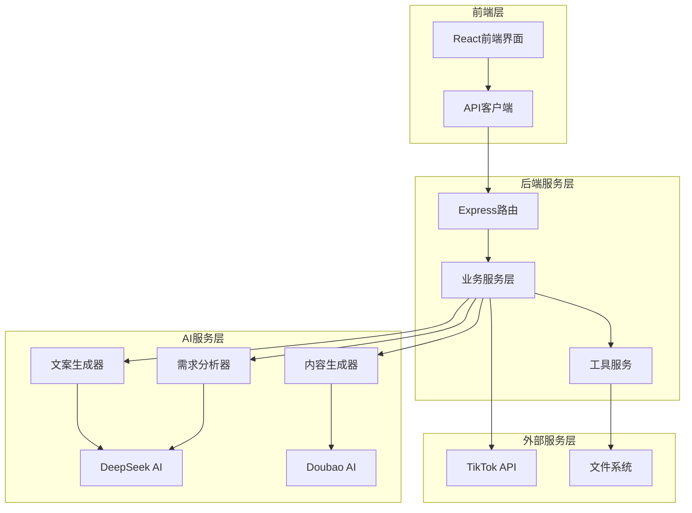

**架构图来源**
- [AICreator.tsx:1-513](file://web/client/src/pages/AICreator.tsx#L1-L513)
- [ai.ts:1-323](file://web/server/src/routes/ai.ts#L1-L323)

### 数据流架构

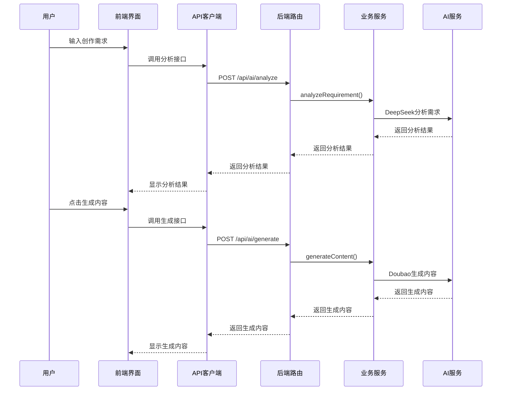

**架构图来源**
- [AICreator.tsx:80-202](file://web/client/src/pages/AICreator.tsx#L80-L202)
- [ai.ts:60-123](file://web/server/src/routes/ai.ts#L60-L123)

## 核心组件分析

### 前端组件结构

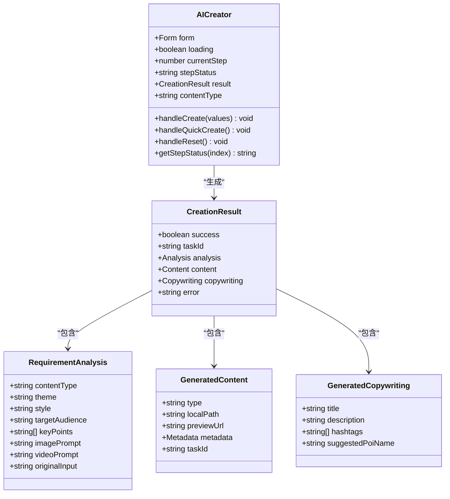

**类图来源**
- [AICreator.tsx:49-70](file://web/client/src/pages/AICreator.tsx#L49-L70)
- [types.ts:207-259](file://src/models/types.ts#L207-L259)

### 后端服务架构

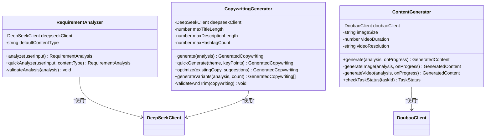

**类图来源**
- [requirement-analyzer.ts:25-72](file://src/services/ai/requirement-analyzer.ts#L25-L72)
- [content-generator.ts:38-102](file://src/services/ai/content-generator.ts#L38-L102)
- [copywriting-generator.ts:30-74](file://src/services/ai/copywriting-generator.ts#L30-L74)

## AI创作流程

### 分步创作流程

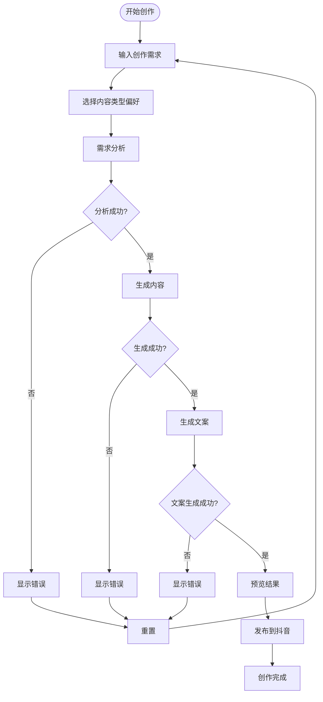

**流程图来源**
- [AICreator.tsx:80-202](file://web/client/src/pages/AICreator.tsx#L80-L202)

### 一键创作流程

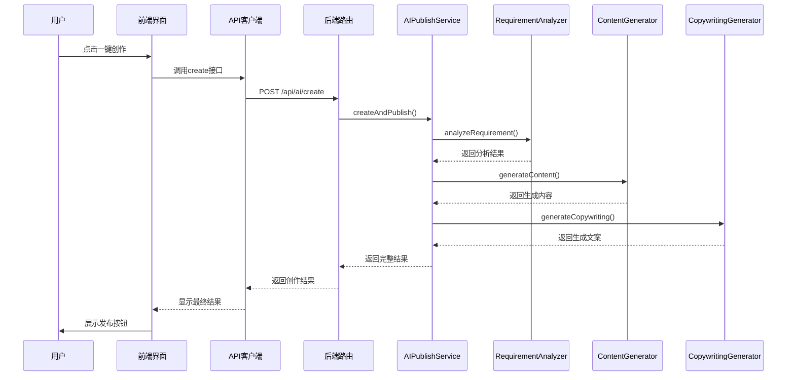

**流程图来源**
- [AICreator.tsx:154-202](file://web/client/src/pages/AICreator.tsx#L154-L202)
- [ai.ts:155-191](file://web/server/src/routes/ai.ts#L155-L191)

## 前端界面设计

### 组件层次结构

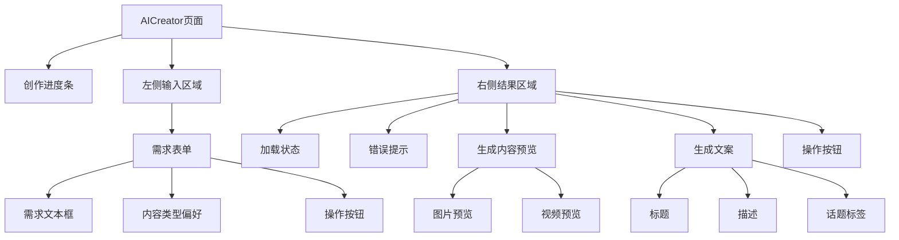

**架构图来源**
- [AICreator.tsx:220-510](file://web/client/src/pages/AICreator.tsx#L220-L510)

### 状态管理

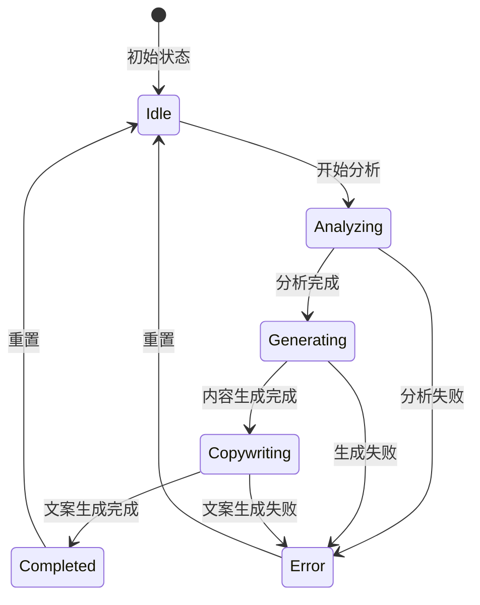

**状态图来源**
- [AICreator.tsx:72-152](file://web/client/src/pages/AICreator.tsx#L72-L152)

## 后端服务架构

### 路由设计

```mermaid
graph LR
subgraph "AI创作路由"
Analyze[/api/ai/analyze]
Generate[/api/ai/generate]
Copywriting[/api/ai/copywriting]
Create[/api/ai/create]
Publish[/api/ai/publish]
QuickCopywriting[/api/ai/quick-copywriting]
TaskStatus[/api/ai/task/:taskId]
Tasks[/api/ai/tasks]
end
subgraph "业务逻辑"
Analyzer[需求分析服务]
Generator[内容生成服务]
Copywriter[文案生成服务]
Publisher[发布服务]
end
Analyze --> Analyzer
Generate --> Generator
Copywriting --> Copywriter
Create --> Publisher
Publish --> Publisher
QuickCopywriting --> Copywriter
TaskStatus --> Publisher
Tasks --> Publisher
```

**架构图来源**
- [ai.ts:60-323](file://web/server/src/routes/ai.ts#L60-L323)

### 服务依赖关系

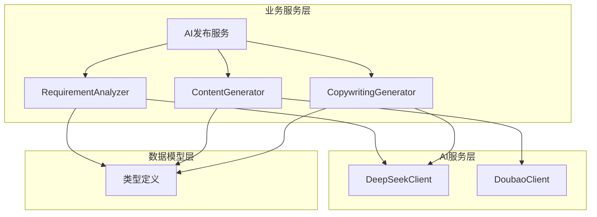

**架构图来源**
- [requirement-analyzer.ts:6-34](file://src/services/ai/requirement-analyzer.ts#L6-L34)
- [content-generator.ts:6-54](file://src/services/ai/content-generator.ts#L6-L54)
- [copywriting-generator.ts:6-47](file://src/services/ai/copywriting-generator.ts#L6-L47)

## AI服务集成

### DeepSeek AI集成

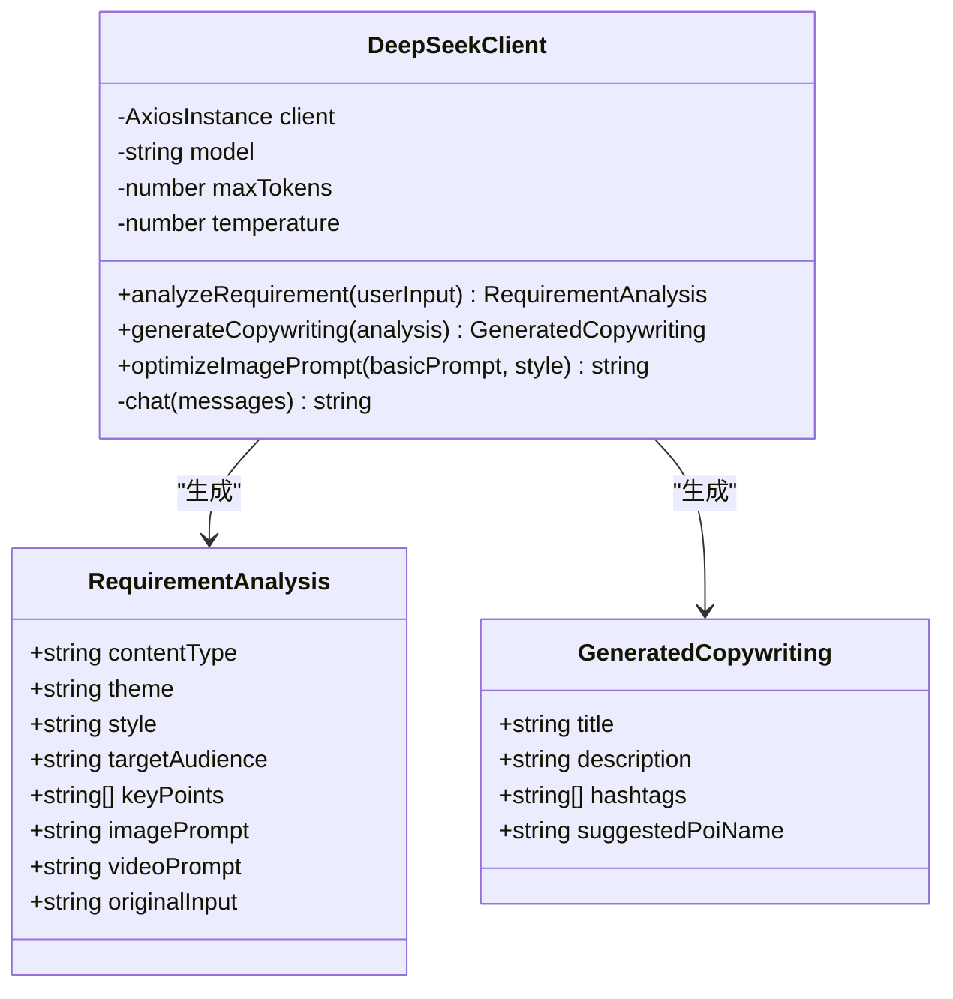

**类图来源**
- [deepseek-client.ts:55-283](file://src/api/ai/deepseek-client.ts#L55-L283)
- [types.ts:207-259](file://src/models/types.ts#L207-L259)

### Doubao AI集成

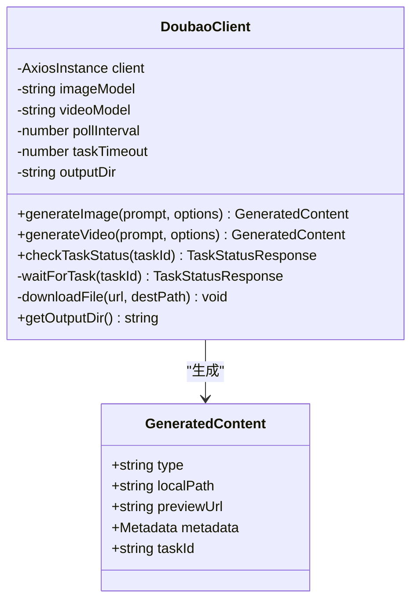

**类图来源**
- [doubao-client.ts:76-349](file://src/api/ai/doubao-client.ts#L76-L349)
- [types.ts:229-245](file://src/models/types.ts#L229-L245)

## 配置管理

### 环境配置

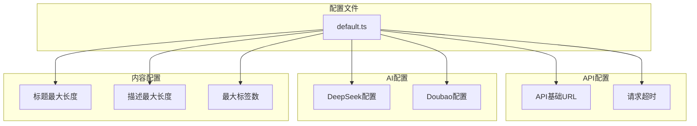

**架构图来源**
- [default.ts:5-70](file://config/default.ts#L5-L70)

### 类型定义

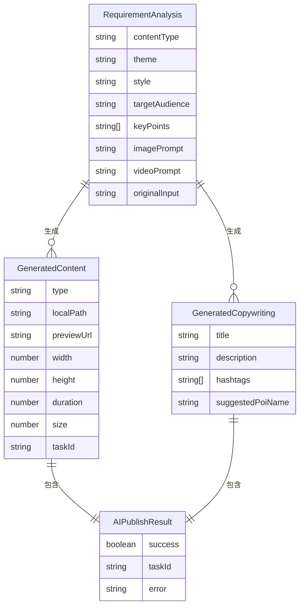

**实体关系图来源**
- [types.ts:207-316](file://src/models/types.ts#L207-L316)

## 错误处理与重试机制

### 错误处理策略

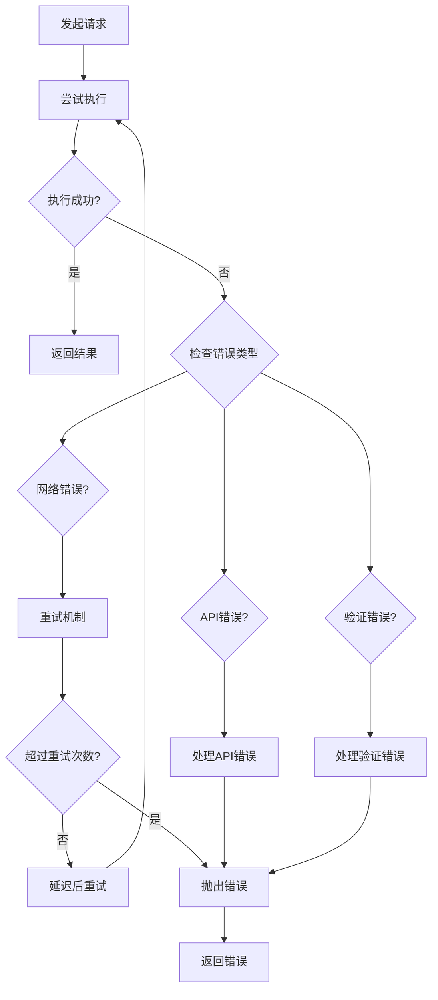

**流程图来源**
- [deepseek-client.ts:86-114](file://src/api/ai/deepseek-client.ts#L86-L114)
- [doubao-client.ts:267-292](file://src/api/ai/doubao-client.ts#L267-L292)

### 重试配置

系统实现了智能重试机制，支持指数退避算法：

- **最大重试次数**: 3次
- **基础延迟**: 1秒
- **最大延迟**: 30秒
- **超时控制**: 60秒（DeepSeek），120秒（Doubao）

## 性能优化策略

### 缓存策略

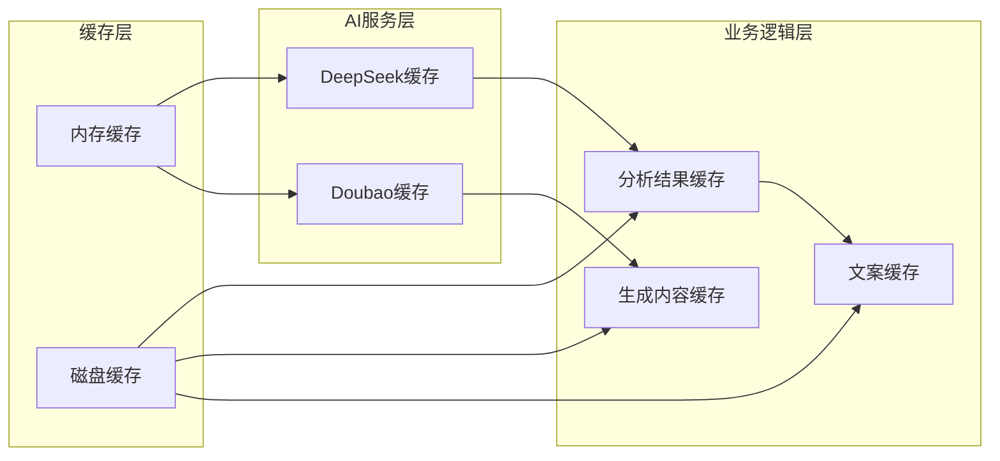

### 并发控制

系统采用以下并发控制策略：
- **请求限流**: 防止AI服务过载
- **任务队列**: 异步处理耗时任务
- **资源池**: 管理AI服务连接
- **超时控制**: 防止长时间阻塞

## 部署与运维

### 环境要求

- **Node.js**: 18+
- **API密钥**: DeepSeek和Doubao的API密钥
- **存储空间**: 至少1GB用于生成内容
- **网络连接**: 稳定的互联网连接

### 配置文件

```bash
# .env文件示例
DEEPSEEK_API_KEY=your_deepseek_api_key
DOUBAO_API_KEY=your_doubao_api_key
DEEPSEEK_BASE_URL=https://api.deepseek.com
DOUBAO_BASE_URL=https://ark.cn-beijing.volces.com/api/v3
DOUBAO_ENDPOINT_ID_IMAGE=image_model_id
DOUBAO_ENDPOINT_ID_VIDEO=video_model_id
```

### 监控指标

系统监控以下关键指标：
- **AI调用成功率**
- **内容生成时间**
- **API响应延迟**
- **存储使用情况**
- **用户活跃度**

## 总结

AI创作页面是ClawOperations系统的核心功能模块，通过深度整合AI服务和TikTok平台，为用户提供了一站式的自动化内容创作解决方案。该系统具有以下特点：

### 技术优势
- **模块化设计**: 清晰的服务分离和依赖管理
- **AI集成**: 深度集成DeepSeek和Doubao两大AI平台
- **用户体验**: 直观的界面设计和流畅的操作流程
- **扩展性**: 支持多种内容类型和发布渠道

### 功能特色
- **智能需求分析**: 基于自然语言处理的创作需求理解
- **多样化内容生成**: 支持图片和视频的AI生成
- **专业文案创作**: 自动生成符合平台规范的推广文案
- **一键发布**: 直接发布到TikTok平台

### 应用价值
该系统显著提升了内容创作效率，降低了营销成本，为小龙虾主题的TikTok营销活动提供了强有力的技术支撑。通过AI驱动的自动化流程，用户可以专注于创意构思，而将技术实现交给系统完成。