# AI创作页面

<cite>
**本文档引用的文件**
- [AICreator.tsx](file://web/client/src/pages/AICreator.tsx)
- [WorkflowSteps.tsx](file://web/client/src/components/ai-creator/WorkflowSteps.tsx)
- [DraftManager.tsx](file://web/client/src/components/ai-creator/DraftManager.tsx)
- [HistoryDrawer.tsx](file://web/client/src/components/ai-creator/HistoryDrawer.tsx)
- [TemplateSelector.tsx](file://web/client/src/components/ai-creator/TemplateSelector.tsx)
- [NextActionGuide.tsx](file://web/client/src/components/ai-creator/NextActionGuide.tsx)
- [QualityCheckResult.tsx](file://web/client/src/components/ai-creator/QualityCheckResult.tsx)
- [useCreationWorkflow.ts](file://web/client/src/hooks/useCreationWorkflow.ts)
- [content-generator.ts](file://src/services/ai/content-generator.ts)
- [copywriting-generator.ts](file://src/services/ai/copywriting-generator.ts)
- [requirement-analyzer.ts](file://src/services/ai/requirement-analyzer.ts)
- [types.ts](file://src/models/types.ts)
- [client.ts](file://web/client/src/api/client.ts)
- [deepseek-client.ts](file://src/api/ai/deepseek-client.ts)
- [doubao-client.ts](file://src/api/ai/doubao-client.ts)
- [ai.ts](file://web/server/src/routes/ai.ts)
- [publisher.ts](file://web/server/src/services/publisher.ts)
- [default.ts](file://config/default.ts)
</cite>

## 更新摘要
**所做更改**
- 新增视频预览功能的详细实现分析
- 增强媒体预览系统的用户界面组件
- 改进的用户界面组件交互设计
- 新增内容质量校验功能的完整实现
- 完善草稿管理、历史记录和模板管理功能

## 目录
1. [项目概述](#项目概述)
2. [系统架构](#系统架构)
3. [核心组件分析](#核心组件分析)
4. [AI创作流程](#ai创作流程)
5. [前端界面设计](#前端界面设计)
6. [后端服务架构](#后端服务架构)
7. [AI服务集成](#ai服务集成)
8. [配置管理](#配置管理)
9. [错误处理与重试机制](#错误处理与重试机制)
10. [性能优化策略](#性能优化策略)
11. [部署与运维](#部署与运维)
12. [总结](#总结)

## 项目概述

ClawOperations 是一个专门针对TikTok（抖音）营销账户管理的自动化管理系统，特别针对小龙虾主题的营销活动。该项目提供了完整的AI驱动内容创作解决方案，包括需求分析、内容生成、文案创作和一键发布功能。

该系统的核心创新在于其AI创作页面，用户只需输入简单的创作需求，AI即可自动生成高质量的图片或视频内容，并配套专业的推广文案，实现从创意到发布的完整自动化流程。

**更新** 新版本引入了视频预览功能、增强的媒体预览系统、内容质量校验功能以及改进的用户界面组件，显著提升了用户体验和创作效率。

## 系统架构

### 整体架构图

```mermaid
graph TB
subgraph "前端层"
UI[React前端界面]
API[API客户端]
COMPONENTS[AI创作组件库]
END
subgraph "后端服务层"
ROUTER[Express路由]
SERVICE[业务服务层]
UTILS[工具服务]
END
subgraph "AI服务层"
DS[DeepSeek AI]
DB[Doubao AI]
CL[内容生成器]
CW[文案生成器]
RA[需求分析器]
QC[质量校验器]
END
subgraph "外部服务层"
TT[TikTok API]
FS[文件系统]
END
UI --> API
UI --> COMPONENTS
COMPONENTS --> API
API --> ROUTER
ROUTER --> SERVICE
SERVICE --> CL
SERVICE --> CW
SERVICE --> RA
SERVICE --> QC
CL --> DB
CW --> DS
RA --> DS
QC --> DS
SERVICE --> UTILS
UTILS --> FS
SERVICE --> TT
```

**架构图来源**
- [AICreator.tsx:1-695](file://web/client/src/pages/AICreator.tsx#L1-L695)
- [ai.ts:1-800](file://web/server/src/routes/ai.ts#L1-L800)

### 数据流架构

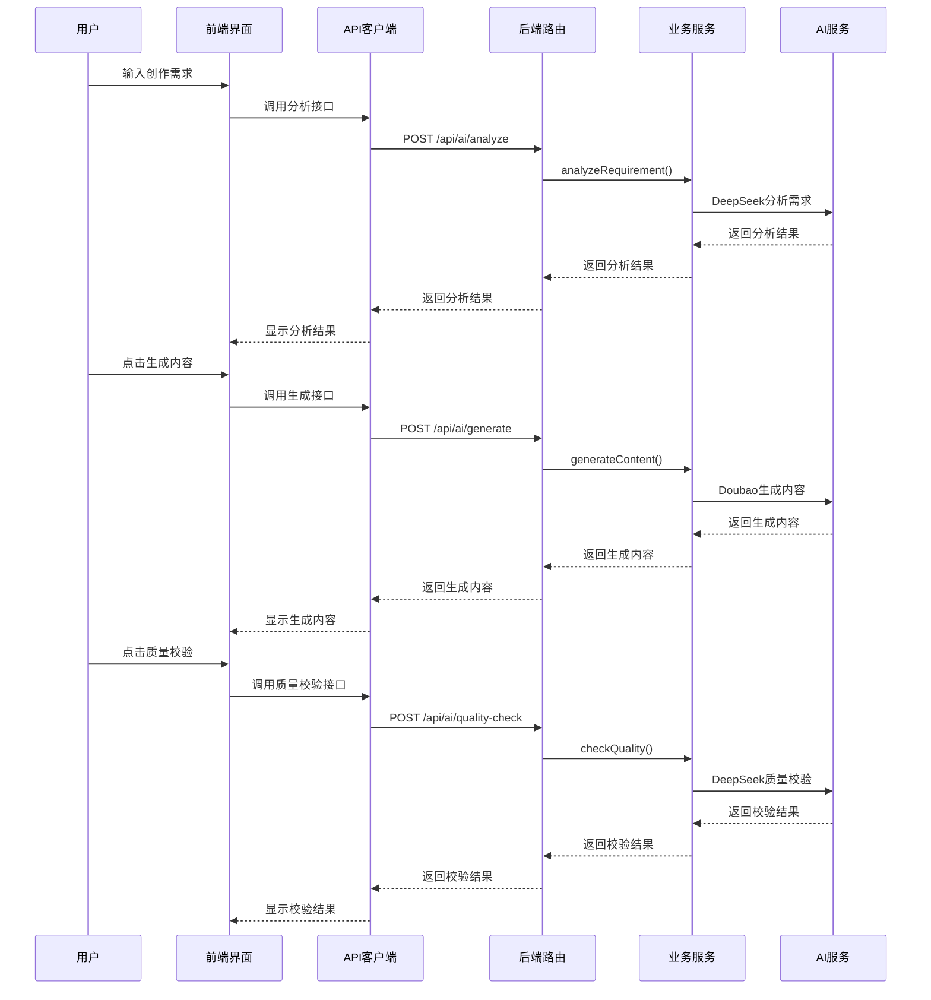

**架构图来源**
- [AICreator.tsx:80-202](file://web/client/src/pages/AICreator.tsx#L80-L202)
- [ai.ts:105-133](file://web/server/src/routes/ai.ts#L105-L133)

## 核心组件分析

### 前端组件结构

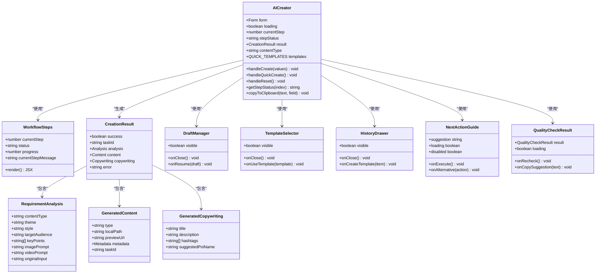

**类图来源**
- [AICreator.tsx:68-95](file://web/client/src/pages/AICreator.tsx#L68-L95)
- [WorkflowSteps.tsx:1-190](file://web/client/src/components/ai-creator/WorkflowSteps.tsx#L1-L190)
- [DraftManager.tsx:1-217](file://web/client/src/components/ai-creator/DraftManager.tsx#L1-L217)
- [TemplateSelector.tsx:1-370](file://web/client/src/components/ai-creator/TemplateSelector.tsx#L1-L370)
- [HistoryDrawer.tsx:1-345](file://web/client/src/components/ai-creator/HistoryDrawer.tsx#L1-L345)
- [NextActionGuide.tsx:1-146](file://web/client/src/components/ai-creator/NextActionGuide.tsx#L1-L146)
- [QualityCheckResult.tsx:1-407](file://web/client/src/components/ai-creator/QualityCheckResult.tsx#L1-L407)
- [types.ts:207-261](file://src/models/types.ts#L207-L261)

### 后端服务架构

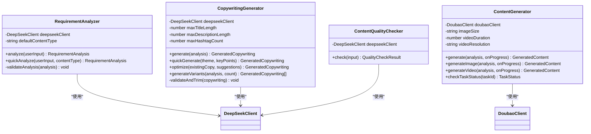

**类图来源**
- [requirement-analyzer.ts:25-72](file://src/services/ai/requirement-analyzer.ts#L25-L72)
- [content-generator.ts:38-102](file://src/services/ai/content-generator.ts#L38-L102)
- [copywriting-generator.ts:30-74](file://src/services/ai/copywriting-generator.ts#L30-L74)

## AI创作流程

### 五步进度指示器流程


**更新** 新增质量校验步骤，提供更全面的内容审核流程

**流程图来源**
- [AICreator.tsx:202-208](file://web/client/src/pages/AICreator.tsx#L202-L208)
- [WorkflowSteps.tsx:22-53](file://web/client/src/components/ai-creator/WorkflowSteps.tsx#L22-L53)

### 快捷模板创作流程

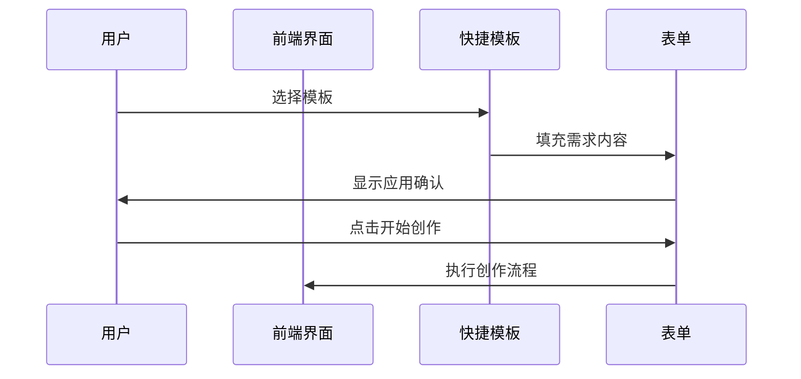

**新增** 快捷模板功能允许用户快速应用预设的创作需求

**流程图来源**
- [AICreator.tsx:58-66](file://web/client/src/pages/AICreator.tsx#L58-L66)
- [AICreator.tsx:124-131](file://web/client/src/pages/AICreator.tsx#L124-L131)

### 一键创作流程

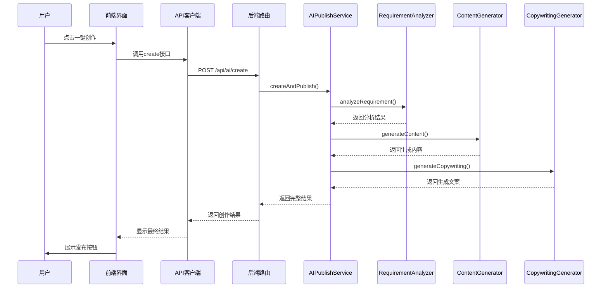

**流程图来源**
- [AICreator.tsx:154-202](file://web/client/src/pages/AICreator.tsx#L154-L202)
- [ai.ts:259-292](file://web/server/src/routes/ai.ts#L259-L292)

## 前端界面设计

### 组件层次结构

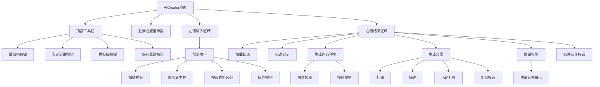

**更新** 新增质量校验组件和增强的媒体预览功能

**架构图来源**
- [AICreator.tsx:216-695](file://web/client/src/pages/AICreator.tsx#L216-L695)

### 视频预览功能实现

**新增** 视频预览功能提供了完整的视频内容展示解决方案：

- **HTML5视频播放器**: 使用原生video元素实现视频播放
- **预览URL支持**: 支持在线视频URL直接预览
- **本地文件展示**: 显示本地生成的视频文件路径
- **播放控件**: 包含标准播放、暂停、进度控制等控件
- **占位符设计**: 当视频未生成时显示占位符图标和文件路径
- **响应式布局**: 视频容器支持自适应宽度

**Section sources**
- [AICreator.tsx:464-496](file://web/client/src/pages/AICreator.tsx#L464-L496)

### 媒体预览系统增强

**更新** 媒体预览系统现在支持双模式内容展示：

- **图片预览**: 使用Ant Design Image组件，支持缩略图和全屏查看
- **视频预览**: 使用HTML5 video元素，提供完整的播放控制
- **统一样式**: 两种媒体类型采用一致的圆角边框和阴影效果
- **状态指示**: 根据内容类型动态显示相应的图标和样式
- **错误处理**: 当预览URL为空时提供友好的占位符显示

**Section sources**
- [AICreator.tsx:458-496](file://web/client/src/pages/AICreator.tsx#L458-L496)

### 快捷模板功能

**新增** 快捷模板功能提供了四种预设的创作场景：

- **美食推广**: 制作美食推广视频，突出产品特色和口感
- **产品展示**: 创作产品展示视频，展示产品功能和使用场景  
- **活动宣传**: 制作活动宣传视频，突出活动亮点和优惠信息
- **品牌故事**: 创作品牌故事视频，展示品牌理念和发展历程

**Section sources**
- [AICreator.tsx:58-66](file://web/client/src/pages/AICreator.tsx#L58-L66)

### 按钮式单选组设计

**更新** 内容类型选择现在使用按钮式单选组，提供更直观的用户交互：

- **自动模式**: AI根据需求自动选择最佳内容类型
- **图片模式**: 专门生成图片内容
- **视频模式**: 专门生成视频内容

每个按钮都配有相应的图标和样式，支持禁用状态和加载状态。

**Section sources**
- [AICreator.tsx:310-328](file://web/client/src/pages/AICreator.tsx#L310-L328)

### 复制到剪贴板功能

**新增** 文案生成结果支持一键复制到剪贴板：

- **标题复制**: 点击复制按钮可快速复制标题内容
- **描述复制**: 支持复制详细的视频描述
- **反馈提示**: 复制成功后显示绿色对勾图标和成功消息
- **字段标识**: 通过copiedField状态跟踪当前复制的字段

**Section sources**
- [AICreator.tsx:98-103](file://web/client/src/pages/AICreator.tsx#L98-L103)
- [AICreator.tsx:522-529](file://web/client/src/pages/AICreator.tsx#L522-L529)
- [AICreator.tsx:544-551](file://web/client/src/pages/AICreator.tsx#L544-L551)

### 内容质量校验功能

**新增** 内容质量校验功能提供了全面的内容审核解决方案：

- **质量评分**: 基于0-100分的综合评分系统
- **问题分类**: 敏感词风险、品牌问题、平台适配、内容结构、发布建议
- **严重等级**: 错误、警告、建议三个等级
- **详细报告**: 每个问题包含位置、原文、建议和替代表达
- **发布建议**: 提供发布时间和标签优化建议
- **重新校验**: 支持对修改后的内容进行重新校验

**Section sources**
- [AICreator.tsx:176-209](file://web/client/src/pages/AICreator.tsx#L176-L209)
- [QualityCheckResult.tsx:1-407](file://web/client/src/components/ai-creator/QualityCheckResult.tsx#L1-L407)

### 状态管理

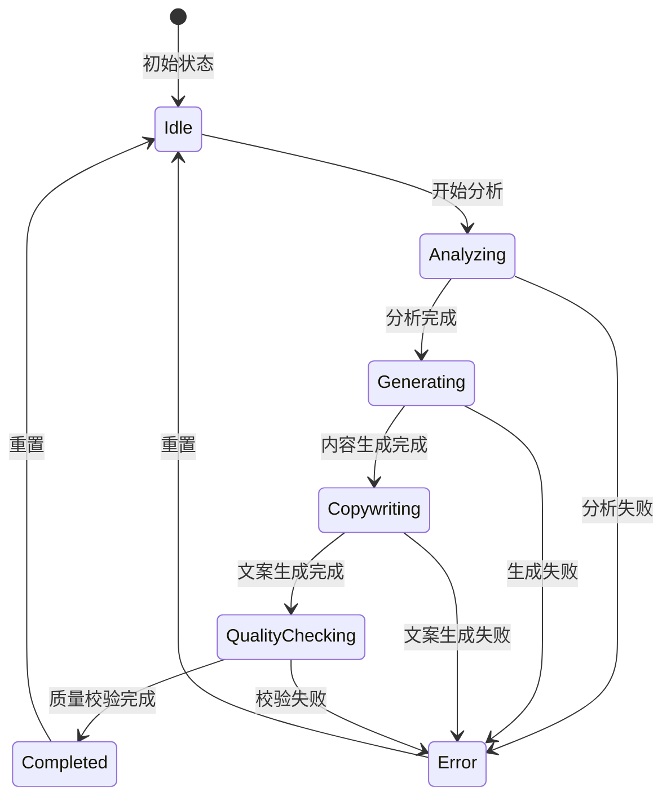

**状态图来源**
- [AICreator.tsx:72-152](file://web/client/src/pages/AICreator.tsx#L72-L152)

## 后端服务架构

### 路由设计

```mermaid
graph LR
subgraph "AI创作路由"
Analyze[/api/ai/analyze]
Generate[/api/ai/generate]
Copywriting[/api/ai/copywriting]
Create[/api/ai/create]
Publish[/api/ai/publish]
QuickCopywriting[/api/ai/quick-copywriting]
QualityCheck[/api/ai/quality-check]
TaskStatus[/api/ai/task/:taskId]
Tasks[/api/ai/tasks]
Draft[/api/ai/draft]
History[/api/ai/history]
Template[/api/ai/template]
WorkflowStart[/api/ai/workflow/start]
WorkflowStep[/api/ai/workflow/step]
NextAction[/api/ai/workflow/:taskId/next-action]
end
subgraph "业务逻辑"
Analyzer[需求分析服务]
Generator[内容生成服务]
Copywriter[文案生成服务]
Publisher[发布服务]
DraftService[草稿服务]
HistoryService[历史服务]
TemplateService[模板服务]
QualityChecker[质量校验服务]
end
Analyze --> Analyzer
Generate --> Generator
Copywriting --> Copywriter
Create --> Publisher
Publish --> Publisher
QuickCopywriting --> Copywriter
QualityCheck --> QualityChecker
TaskStatus --> Publisher
Tasks --> Publisher
Draft --> DraftService
History --> HistoryService
Template --> TemplateService
WorkflowStart --> Publisher
WorkflowStep --> Publisher
NextAction --> Publisher
```

**更新** 新增质量校验路由和工作流管理路由

**架构图来源**
- [ai.ts:96-800](file://web/server/src/routes/ai.ts#L96-L800)

### 服务依赖关系

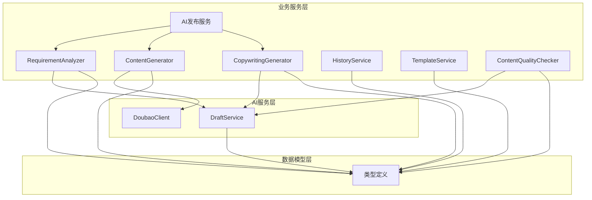

**更新** 新增质量校验服务和工作流管理服务

**架构图来源**
- [requirement-analyzer.ts:6-34](file://src/services/ai/requirement-analyzer.ts#L6-L34)
- [content-generator.ts:6-54](file://src/services/ai/content-generator.ts#L6-L54)
- [copywriting-generator.ts:6-47](file://src/services/ai/copywriting-generator.ts#L6-L47)

## AI服务集成

### DeepSeek AI集成

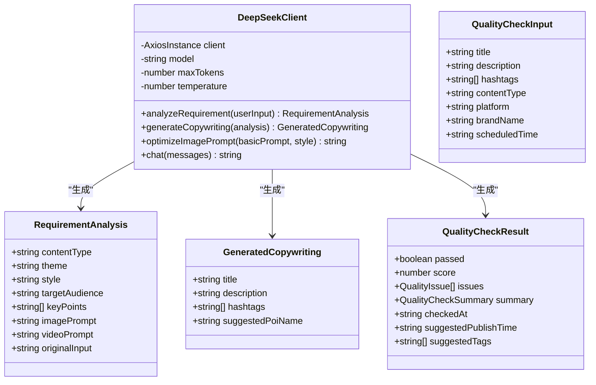

**类图来源**
- [deepseek-client.ts:55-283](file://src/api/ai/deepseek-client.ts#L55-L283)
- [types.ts:207-261](file://src/models/types.ts#L207-L261)
- [types.ts:623-662](file://src/models/types.ts#L623-L662)

### Doubao AI集成

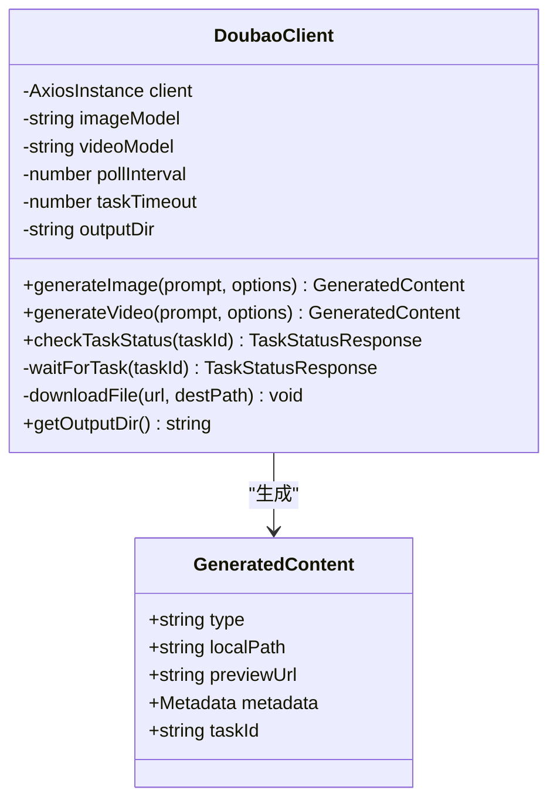

**类图来源**
- [doubao-client.ts:76-349](file://src/api/ai/doubao-client.ts#L76-L349)
- [types.ts:231-247](file://src/models/types.ts#L231-L247)

## 配置管理

### 环境配置

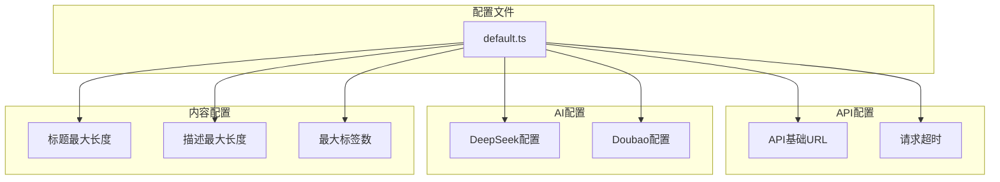

**架构图来源**
- [default.ts:5-70](file://config/default.ts#L5-L70)

### 类型定义

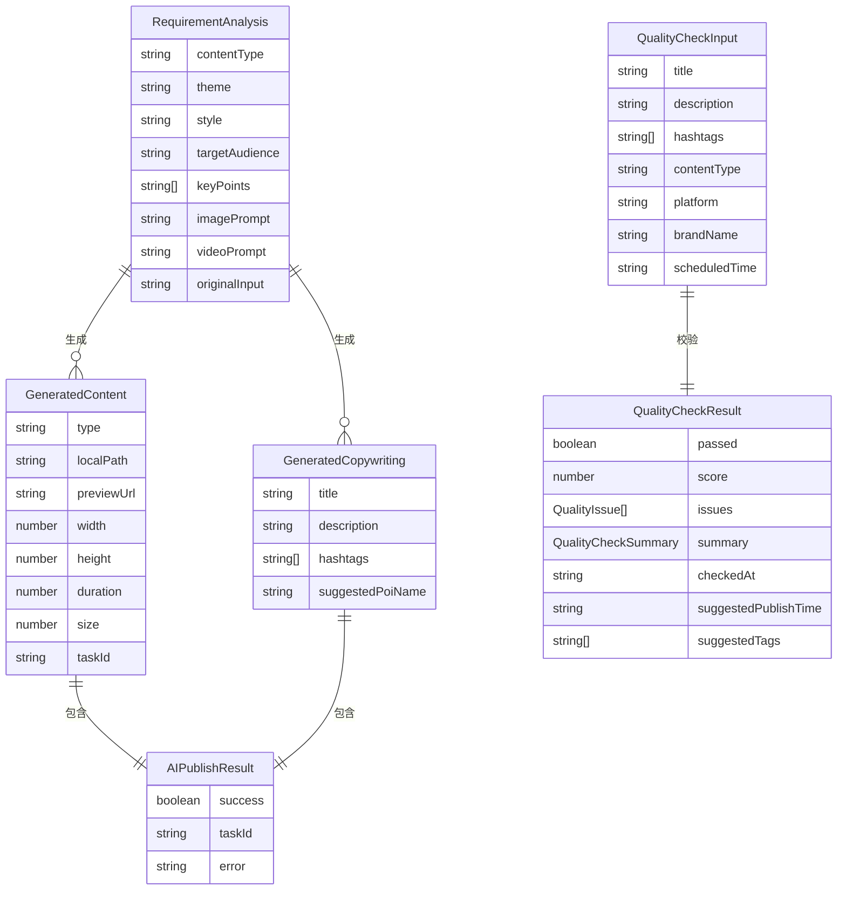

**实体关系图来源**
- [types.ts:207-316](file://src/models/types.ts#L207-L316)
- [types.ts:623-682](file://src/models/types.ts#L623-L682)

## 错误处理与重试机制

### 错误处理策略

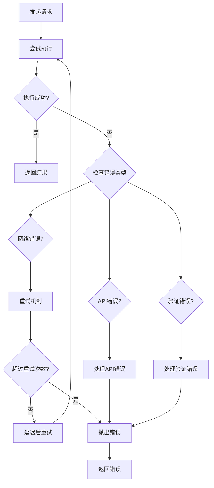

**流程图来源**
- [deepseek-client.ts:86-114](file://src/api/ai/deepseek-client.ts#L86-L114)
- [doubao-client.ts:267-292](file://src/api/ai/doubao-client.ts#L267-L292)

### 重试配置

系统实现了智能重试机制，支持指数退避算法：

- **最大重试次数**: 3次
- **基础延迟**: 1秒
- **最大延迟**: 30秒
- **超时控制**: 60秒（DeepSeek），120秒（Doubao）

## 性能优化策略

### 缓存策略

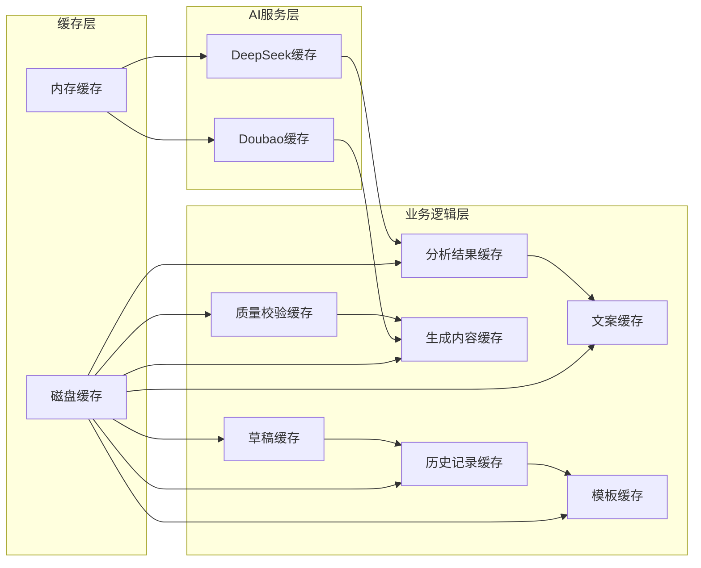

**更新** 新增质量校验缓存策略

### 并发控制

系统采用以下并发控制策略：
- **请求限流**: 防止AI服务过载
- **任务队列**: 异步处理耗时任务
- **资源池**: 管理AI服务连接
- **超时控制**: 防止长时间阻塞

## 部署与运维

### 环境要求

- **Node.js**: 18+
- **API密钥**: DeepSeek和Doubao的API密钥
- **存储空间**: 至少1GB用于生成内容
- **网络连接**: 稳定的互联网连接

### 配置文件

```bash
# .env文件示例
DEEPSEEK_API_KEY=your_deepseek_api_key
DOUBAO_API_KEY=your_doubao_api_key
DEEPSEEK_BASE_URL=https://api.deepseek.com
DOUBAO_BASE_URL=https://ark.cn-beijing.volces.com/api/v3
DOUBAO_ENDPOINT_ID_IMAGE=image_model_id
DOUBAO_ENDPOINT_ID_VIDEO=video_model_id
```

### 监控指标

系统监控以下关键指标：
- **AI调用成功率**
- **内容生成时间**
- **API响应延迟**
- **存储使用情况**
- **用户活跃度**

## 总结

AI创作页面是ClawOperations系统的核心功能模块，通过深度整合AI服务和TikTok平台，为用户提供了一站式的自动化内容创作解决方案。该系统具有以下特点：

### 技术优势
- **模块化设计**: 清晰的服务分离和依赖管理
- **AI集成**: 深度集成DeepSeek和Doubao两大AI平台
- **用户体验**: 直观的界面设计和流畅的操作流程
- **扩展性**: 支持多种内容类型和发布渠道

### 功能特色
- **智能需求分析**: 基于自然语言处理的创作需求理解
- **多样化内容生成**: 支持图片和视频的AI生成
- **专业文案创作**: 自动生成符合平台规范的推广文案
- **一键发布**: 直接发布到TikTok平台
- **质量校验**: 全面的内容质量审核和优化建议

### UI改进亮点
**更新** 新版本的重大UI改进包括：

- **视频预览功能**: 完整的HTML5视频播放器，支持在线和本地视频预览
- **增强媒体预览系统**: 统一的图片和视频预览界面，提供更好的用户体验
- **内容质量校验**: 详细的评分系统和问题分类，帮助用户优化内容质量
- **改进的用户界面组件**: 更直观的按钮式单选组和增强的草稿管理功能
- **五步进度指示器**: 清晰的创作流程可视化，让用户了解当前所处阶段

### 应用价值
该系统显著提升了内容创作效率，降低了营销成本，为小龙虾主题的TikTok营销活动提供了强有力的技术支撑。通过AI驱动的自动化流程，用户可以专注于创意构思，而将技术实现交给系统完成。

**更新** 新的UI改进和功能增强进一步提升了用户的创作体验，使AI创作变得更加简单、高效和直观。视频预览功能和质量校验系统的加入，为用户提供了更全面的内容创作和优化解决方案。