# AI创作页面

<cite>
**本文档引用的文件**
- [AICreator.tsx](file://web/client/src/pages/AICreator.tsx)
- [TaskList.tsx](file://web/client/src/pages/TaskList.tsx)
- [client.ts](file://web/client/src/api/client.ts)
- [ai.ts](file://web/server/src/routes/ai.ts)
- [WorkflowSteps.tsx](file://web/client/src/components/ai-creator/WorkflowSteps.tsx)
- [DraftManager.tsx](file://web/client/src/components/ai-creator/DraftManager.tsx)
- [HistoryDrawer.tsx](file://web/client/src/components/ai-creator/HistoryDrawer.tsx)
- [TemplateSelector.tsx](file://web/client/src/components/ai-creator/TemplateSelector.tsx)
- [NextActionGuide.tsx](file://web/client/src/components/ai-creator/NextActionGuide.tsx)
- [QualityCheckResult.tsx](file://web/client/src/components/ai-creator/QualityCheckResult.tsx)
- [useCreationWorkflow.ts](file://web/client/src/hooks/useCreationWorkflow.ts)
- [content-generator.ts](file://src/services/ai/content-generator.ts)
- [copywriting-generator.ts](file://src/services/ai/copywriting-generator.ts)
- [requirement-analyzer.ts](file://src/services/ai/requirement-analyzer.ts)
- [content-quality-checker.ts](file://src/services/ai/content-quality-checker.ts)
- [types.ts](file://src/models/types.ts)
- [deepseek-client.ts](file://src/api/ai/deepseek-client.ts)
- [doubao-client.ts](file://src/api/ai/doubao-client.ts)
- [publisher.ts](file://web/server/src/services/publisher.ts)
- [ai-publish-service.ts](file://src/services/ai-publish-service.ts)
- [default.ts](file://config/default.ts)
- [publish.ts](file://web/server/src/routes/publish.ts)
</cite>

## 更新摘要
**所做更改**
- 新增营销潜力评估功能，支持综合评分和维度分析
- 新增内容开场钩子生成功能，提供黄金3秒吸引策略
- 新增营销数据分析接口，支持内容类型分布和趋势分析
- 扩展需求分析结果，新增情感触发词、痛点识别等营销增强字段
- 新增营销评分和改进建议功能，提供AI驱动的优化指导
- 完善AI创作页面的营销分析能力，实现从需求到发布的全链路营销优化

## 目录
1. [项目概述](#项目概述)
2. [系统架构](#系统架构)
3. [核心组件分析](#核心组件分析)
4. [AI创作流程](#ai创作流程)
5. [前端界面设计](#前端界面设计)
6. [后端服务架构](#后端服务架构)
7. [AI服务集成](#ai服务集成)
8. [任务管理集成](#任务管理集成)
9. [营销分析功能](#营销分析功能)
10. [配置管理](#配置管理)
11. [错误处理与重试机制](#错误处理与重试机制)
12. [性能优化策略](#性能优化策略)
13. [部署与运维](#部署与运维)
14. [总结](#总结)

## 项目概述

ClawOperations 是一个专门针对TikTok（抖音）营销账户管理的自动化管理系统，特别针对小龙虾主题的营销活动。该项目提供了完整的AI驱动内容创作解决方案，包括需求分析、内容生成、文案创作和一键发布功能。

该系统的核心创新在于其AI创作页面，用户只需输入简单的创作需求，AI即可自动生成高质量的图片或视频内容，并配套专业的推广文案，实现从创意到发布的完整自动化流程。

**更新** 新版本引入了强大的营销分析功能，包括营销潜力评估、内容钩子生成、情感触发器分析、目标受众痛点识别等AI驱动的营销优化能力。这些功能为用户提供从内容创作到营销效果的全链路分析和优化指导，显著提升了内容营销的效果和效率。

## 系统架构

### 整体架构图

```mermaid
graph TB
subgraph "前端层"
UI[React前端界面]
API[API客户端]
COMPONENTS[AI创作组件库]
TASKLIST[任务列表页面]
PREVIEW[预览模态框]
MARKETING[营销分析组件]
END
subgraph "后端服务层"
ROUTER[Express路由]
SERVICE[业务服务层]
UTILS[工具服务]
TASKMANAGER[任务管理器]
ANALYTICS[营销分析器]
END
subgraph "AI服务层"
DS[DeepSeek AI]
DB[Doubao AI]
CL[内容生成器]
CW[文案生成器]
RA[需求分析器]
QC[质量校验器]
ME[营销评估器]
CH[内容钩子生成器]
END
subgraph "外部服务层"
TT[TikTok API]
FS[文件系统]
END
UI --> API
UI --> COMPONENTS
UI --> TASKLIST
UI --> PREVIEW
UI --> MARKETING
COMPONENTS --> API
TASKLIST --> API
PREVIEW --> API
MARKETING --> API
API --> ROUTER
ROUTER --> SERVICE
ROUTER --> TASKMANAGER
ROUTER --> ANALYTICS
SERVICE --> CL
SERVICE --> CW
SERVICE --> RA
SERVICE --> QC
SERVICE --> ME
SERVICE --> CH
TASKMANAGER --> SERVICE
ANALYTICS --> ME
ANALYTICS --> CH
CL --> DB
CW --> DS
RA --> DS
QC --> DS
ME --> DS
CH --> DS
SERVICE --> UTILS
UTILS --> FS
SERVICE --> TT
```

**架构图来源**
- [AICreator.tsx:1-715](file://web/client/src/pages/AICreator.tsx#L1-L715)
- [TaskList.tsx:1-821](file://web/client/src/pages/TaskList.tsx#L1-L821)
- [client.ts:1-515](file://web/client/src/api/client.ts#L1-L515)
- [ai.ts:1-1321](file://web/server/src/routes/ai.ts#L1-L1321)

### 数据流架构

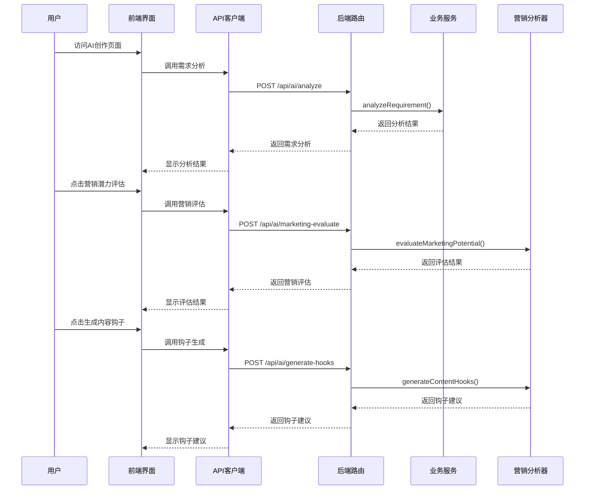

**架构图来源**
- [AICreator.tsx:305-346](file://web/client/src/pages/AICreator.tsx#L305-L346)
- [ai.ts:1171-1244](file://web/server/src/routes/ai.ts#L1171-L1244)

## 核心组件分析

### 前端组件结构

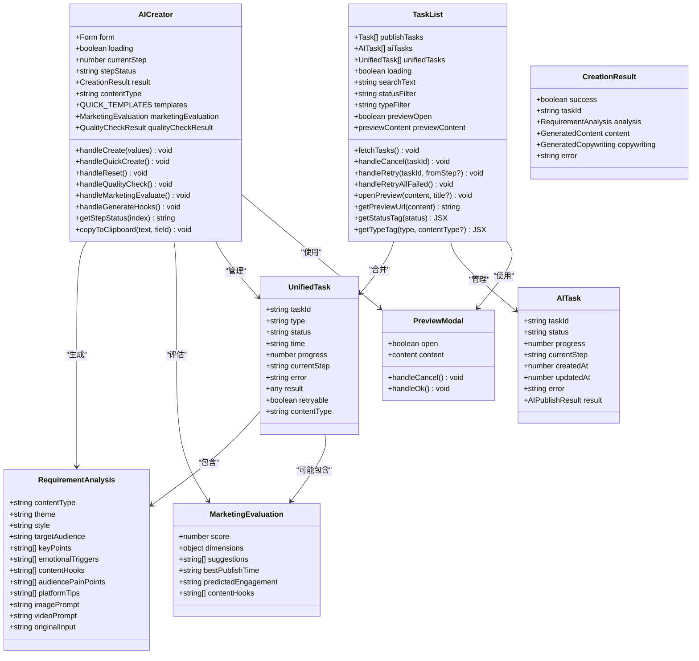

**类图来源**
- [AICreator.tsx:68-95](file://web/client/src/pages/AICreator.tsx#L68-L95)
- [TaskList.tsx:58-110](file://web/client/src/pages/TaskList.tsx#L58-L110)
- [TaskList.tsx:143-164](file://web/client/src/pages/TaskList.tsx#L143-L164)
- [WorkflowSteps.tsx:1-190](file://web/client/src/components/ai-creator/WorkflowSteps.tsx#L1-L190)
- [DraftManager.tsx:1-217](file://web/client/src/components/ai-creator/DraftManager.tsx#L1-L217)
- [TemplateSelector.tsx:1-370](file://web/client/src/components/ai-creator/TemplateSelector.tsx#L1-L370)
- [HistoryDrawer.tsx:1-345](file://web/client/src/components/ai-creator/HistoryDrawer.tsx#L1-L345)
- [NextActionGuide.tsx:1-146](file://web/client/src/components/ai-creator/NextActionGuide.tsx#L1-L146)
- [QualityCheckResult.tsx:1-429](file://web/client/src/components/ai-creator/QualityCheckResult.tsx#L1-L429)
- [types.ts:207-316](file://src/models/types.ts#L207-L316)

### 后端服务架构

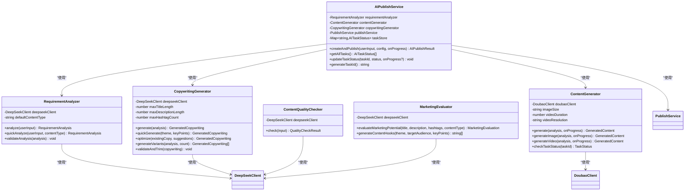

**类图来源**
- [requirement-analyzer.ts:25-72](file://src/services/ai/requirement-analyzer.ts#L25-L72)
- [content-generator.ts:38-102](file://src/services/ai/content-generator.ts#L38-L102)
- [copywriting-generator.ts:30-74](file://src/services/ai/copywriting-generator.ts#L30-L74)
- [ai-publish-service.ts:43-200](file://src/services/ai-publish-service.ts#L43-L200)
- [deepseek-client.ts:340-448](file://src/api/ai/deepseek-client.ts#L340-L448)

## AI创作流程

### 五步进度指示器流程

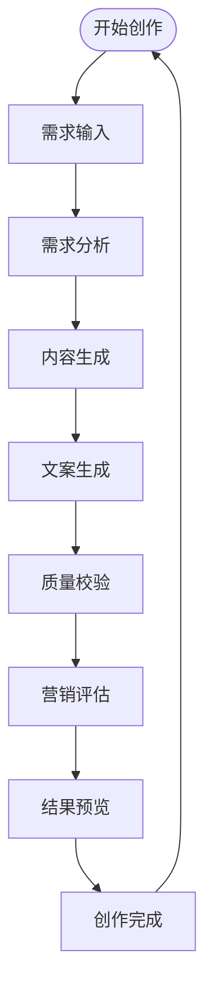

**更新** 新增营销评估步骤，提供全面的营销效果分析和优化建议

**流程图来源**
- [AICreator.tsx:202-208](file://web/client/src/pages/AICreator.tsx#L202-L208)
- [WorkflowSteps.tsx:22-53](file://web/client/src/components/ai-creator/WorkflowSteps.tsx#L22-L53)

### 营销潜力评估流程

**新增** 营销潜力评估的完整流程：

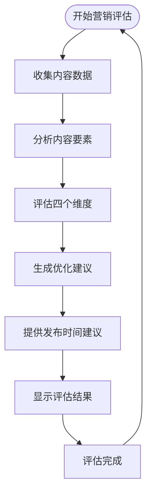

**流程图来源**
- [AICreator.tsx:305-318](file://web/client/src/pages/AICreator.tsx#L305-L318)
- [deepseek-client.ts:340-425](file://src/api/ai/deepseek-client.ts#L340-L425)

### 内容钩子生成流程

**新增** 内容钩子生成的创意设计流程：

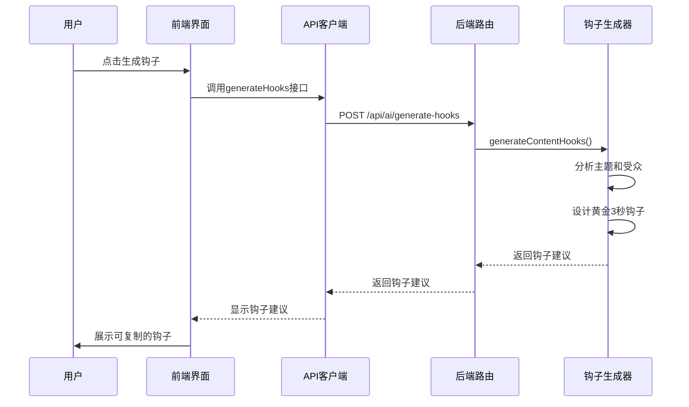

**流程图来源**
- [AICreator.tsx:320-347](file://web/client/src/pages/AICreator.tsx#L320-L347)
- [ai.ts:1210-1244](file://web/server/src/routes/ai.ts#L1210-L1244)

### 统一任务管理流程

**更新** TaskList页面的统一任务管理流程：

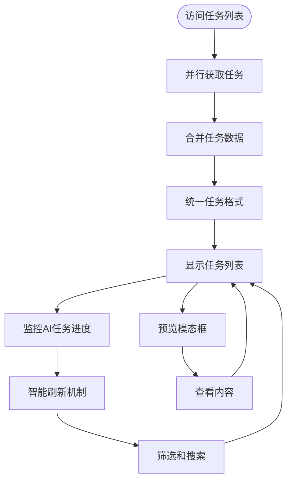

**流程图来源**
- [TaskList.tsx:118-143](file://web/client/src/pages/TaskList.tsx#L118-L143)
- [TaskList.tsx:145-173](file://web/client/src/pages/TaskList.tsx#L145-L173)
- [TaskList.tsx:151-164](file://web/client/src/pages/TaskList.tsx#L151-L164)

## 前端界面设计

### 营销分析组件设计

**新增** 营销分析组件的完整设计：

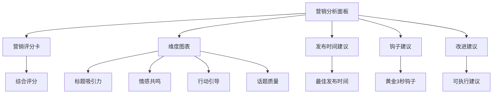

**架构图来源**
- [AICreator.tsx:957-1092](file://web/client/src/pages/AICreator.tsx#L957-L1092)

### 营销评分卡设计

**新增** 营销评分卡的可视化设计：

- **综合评分显示**: 以圆形进度条形式展示整体营销评分
- **智能评分提示**: 根据评分等级显示不同颜色和提示信息
- **维度评分对比**: 展示四个核心维度的具体分数
- **互动式评分**: 支持点击重新评估功能
- **响应式布局**: 适配不同屏幕尺寸的显示效果

**Section sources**
- [AICreator.tsx:305-318](file://web/client/src/pages/AICreator.tsx#L305-L318)

### 维度评分图表设计

**新增** 四个营销维度的可视化评分系统：

- **标题吸引力**: 评估标题的悬念、数字、情感触发程度
- **情感共鸣**: 分析内容引发的情感反应强度
- **行动引导**: 检查CTA的明确性和紧迫感
- **话题质量**: 评估话题标签的相关性和影响力

每个维度都以进度条形式展示，支持颜色编码和数值显示。

**Section sources**
- [AICreator.tsx:994-1011](file://web/client/src/pages/AICreator.tsx#L994-L1011)

### 发布时间建议设计

**新增** 智能发布时间建议功能：

- **时段推荐**: 基于平台数据分析的最佳发布时间段
- **个性化建议**: 根据内容类型和受众特征提供定制化建议
- **可视化展示**: 以卡片形式清晰展示建议的发布时间
- **一键复制**: 支持快速复制发布时间建议到剪贴板

**Section sources**
- [AICreator.tsx:1014-1029](file://web/client/src/pages/AICreator.tsx#L1014-L1029)

### 内容钩子建议设计

**新增** 黄金3秒钩子建议的交互设计：

- **钩子列表展示**: 以卡片列表形式展示多个钩子建议
- **一键复制功能**: 支持快速复制任意钩子到剪贴板
- **交互式设计**: 鼠标悬停效果和点击反馈
- **可编辑性**: 支持用户对钩子进行修改和优化

**Section sources**
- [AICreator.tsx:1039-1058](file://web/client/src/pages/AICreator.tsx#L1039-L1058)

### 改进建议面板设计

**新增** 可执行改进建议的智能展示：

- **建议分类**: 将改进建议按重要性和紧急程度分类
- **可操作性**: 每条建议都提供具体可行的优化方案
- **视觉层次**: 使用不同颜色和图标区分建议类型
- **进度追踪**: 支持用户标记已完成的建议

**Section sources**
- [AICreator.tsx:1062-1080](file://web/client/src/pages/AICreator.tsx#L1062-L1080)

### 营销数据分析功能

**新增** 营销数据分析的综合展示：

- **内容类型分布**: 展示图片和视频内容的占比分析
- **成功率统计**: 显示整体任务的成功率和失败率
- **平均营销评分**: 基于历史数据计算的平均营销评分
- **热门话题分析**: 统计最常用的话题标签及其使用频率
- **创作趋势分析**: 展示近7天的创作活动趋势

**Section sources**
- [ai.ts:1246-1318](file://web/server/src/routes/ai.ts#L1246-L1318)

### 统一任务列表设计

**更新** TaskList页面的统一任务列表设计：

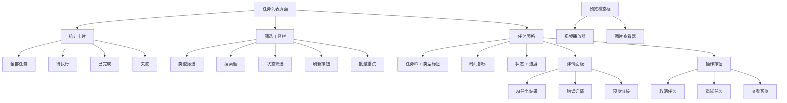

**架构图来源**
- [TaskList.tsx:522-821](file://web/client/src/pages/TaskList.tsx#L522-L821)

### 统一任务格式设计

**新增** 统一任务格式的设计理念：

- **统一字段映射**: 将AI任务和发布任务转换为统一的UnifiedTask格式
- **类型标识**: 通过type字段区分AI任务和发布任务
- **状态标准化**: AI任务状态映射到统一的状态体系
- **进度统一**: AI任务的progress字段用于显示实时进度
- **内容类型**: 通过contentType字段标识生成内容类型

**Section sources**
- [TaskList.tsx:118-143](file://web/client/src/pages/TaskList.tsx#L118-L143)

### 实时进度监控

**新增** AI任务的实时进度监控机制：

- **智能刷新频率**: 有进行中AI任务时每5秒刷新，无AI任务时每30秒刷新
- **进度条显示**: AI任务状态为进行中时显示实时进度条
- **步骤指示**: 显示当前执行的步骤名称
- **状态颜色**: 不同状态使用不同的颜色标识

**Section sources**
- [TaskList.tsx:214-230](file://web/client/src/pages/TaskList.tsx#L214-L230)
- [TaskList.tsx:409-424](file://web/client/src/pages/TaskList.tsx#L409-L424)

### 任务类型标识

**新增** 任务类型的可视化标识：

- **AI任务标签**: 使用机器人图标和紫色背景标识AI创作任务
- **发布任务标签**: 使用相机图标和蓝色背景标识定时发布任务
- **内容类型指示**: AI任务标签包含内容类型信息（图片/视频）
- **统一显示**: 在任务ID下方统一显示任务类型标签

**Section sources**
- [TaskList.tsx:336-350](file://web/client/src/pages/TaskList.tsx#L336-L350)

### 错误详情面板

**新增** 统一的错误详情展示：

- **折叠面板**: 失败任务使用折叠面板展示详细错误信息
- **友好消息**: 显示用户友好的错误提示
- **建议措施**: 提供具体的解决方案和建议
- **失败步骤**: 显示具体失败的步骤信息
- **素材状态**: 显示已上传素材的状态

**Section sources**
- [TaskList.tsx:463-512](file://web/client/src/pages/TaskList.tsx#L463-L512)

### 批量重试功能

**新增** 批量重试功能：

- **智能检测**: 自动检测可重试的失败任务
- **确认对话框**: 批量操作前显示确认对话框
- **进度反馈**: 显示批量重试的结果统计
- **条件限制**: 仅对定时发布任务提供批量重试

**Section sources**
- [TaskList.tsx:275-314](file://web/client/src/pages/TaskList.tsx#L275-L314)

### 预览模态框系统

**新增** 预览模态框系统的完整实现：

- **模态框状态管理**: 使用previewOpen和previewContent状态控制模态框显示
- **内容类型判断**: 自动识别视频和图片内容类型
- **统一预览接口**: 通过openPreview函数统一处理预览逻辑
- **智能URL处理**: 解决豆包URL过期问题，支持本地文件预览
- **响应式设计**: 视频模态框宽度800px，图片模态框宽度600px
- **自动播放**: 视频内容自动播放，提供更好的用户体验

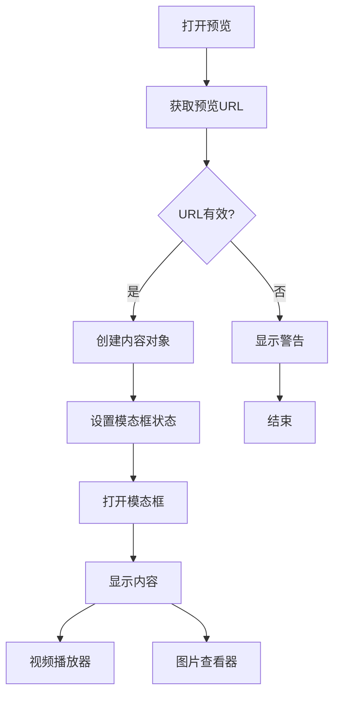

**流程图来源**
- [TaskList.tsx:151-164](file://web/client/src/pages/TaskList.tsx#L151-L164)
- [TaskList.tsx:112-131](file://web/client/src/pages/TaskList.tsx#L112-L131)
- [TaskList.tsx:773-815](file://web/client/src/pages/TaskList.tsx#L773-L815)

**Section sources**
- [TaskList.tsx:143-164](file://web/client/src/pages/TaskList.tsx#L143-L164)
- [TaskList.tsx:112-131](file://web/client/src/pages/TaskList.tsx#L112-L131)
- [TaskList.tsx:773-815](file://web/client/src/pages/TaskList.tsx#L773-L815)

### URL处理能力增强

**新增** 增强的URL处理能力：

- **本地URL优先**: 优先使用本地/generated/路径的预览URL
- **文件名提取**: 从localPath提取文件名构造本地URL
- **过期URL回退**: 当外部URL过期时自动回退到原始URL
- **智能判断**: 支持多种URL格式和路径结构
- **错误处理**: 当无法获取有效URL时显示警告消息

**Section sources**
- [TaskList.tsx:112-131](file://web/client/src/pages/TaskList.tsx#L112-L131)

### 加载状态管理改进

**新增** 改进的加载状态管理：

- **初始加载**: 首次加载时显示loading状态
- **手动刷新**: 手动点击刷新按钮时显示loading状态
- **后台轮询**: 后台自动轮询时不显示loading状态
- **条件渲染**: 根据不同场景显示不同的loading状态
- **用户体验**: 避免频繁的loading闪烁影响用户体验

**Section sources**
- [TaskList.tsx:193-212](file://web/client/src/pages/TaskList.tsx#L193-L212)

### 视频预览功能实现

**新增** 视频预览功能提供了完整的视频内容展示解决方案：

- **HTML5视频播放器**: 使用原生video元素实现视频播放
- **预览URL支持**: 支持在线视频URL直接预览
- **本地文件展示**: 显示本地生成的视频文件路径
- **播放控件**: 包含标准播放、暂停、进度控制等控件
- **占位符设计**: 当视频未生成时显示占位符图标和文件路径
- **响应式布局**: 视频容器支持自适应宽度

**Section sources**
- [AICreator.tsx:464-496](file://web/client/src/pages/AICreator.tsx#L464-L496)

### 媒体预览系统增强

**更新** 媒体预览系统现在支持双模式内容展示：

- **图片预览**: 使用Ant Design Image组件，支持缩略图和全屏查看
- **视频预览**: 使用HTML5 video元素，提供完整的播放控制
- **统一样式**: 两种媒体类型采用一致的圆角边框和阴影效果
- **状态指示**: 根据内容类型动态显示相应的图标和样式
- **错误处理**: 当预览URL为空时提供友好的占位符显示

**Section sources**
- [AICreator.tsx:458-496](file://web/client/src/pages/AICreator.tsx#L458-L496)

### 快捷模板功能

**新增** 快捷模板功能提供了四种预设的创作场景：

- **美食推广**: 制作美食推广视频，突出产品特色和口感
- **产品展示**: 创作产品展示视频，展示产品功能和使用场景  
- **活动宣传**: 制作活动宣传视频，突出活动亮点和优惠信息
- **品牌故事**: 创作品牌故事视频，展示品牌理念和发展历程

**Section sources**
- [AICreator.tsx:58-66](file://web/client/src/pages/AICreator.tsx#L58-L66)

### 按钮式单选组设计

**更新** 内容类型选择现在使用按钮式单选组，提供更直观的用户交互：

- **自动模式**: AI根据需求自动选择最佳内容类型
- **图片模式**: 专门生成图片内容
- **视频模式**: 专门生成视频内容

每个按钮都配有相应的图标和样式，支持禁用状态和加载状态。

**Section sources**
- [AICreator.tsx:310-328](file://web/client/src/pages/AICreator.tsx#L310-L328)

### 复制到剪贴板功能

**新增** 文案生成结果支持一键复制到剪贴板：

- **标题复制**: 点击复制按钮可快速复制标题内容
- **描述复制**: 支持复制详细的视频描述
- **反馈提示**: 复制成功后显示绿色对勾图标和成功消息
- **字段标识**: 通过copiedField状态跟踪当前复制的字段

**Section sources**
- [AICreator.tsx:98-103](file://web/client/src/pages/AICreator.tsx#L98-L103)
- [AICreator.tsx:522-529](file://web/client/src/pages/AICreator.tsx#L522-L529)
- [AICreator.tsx:544-551](file://web/client/src/pages/AICreator.tsx#L544-L551)

### 内容质量校验功能

**新增** 内容质量校验功能提供了全面的内容审核解决方案：

- **质量评分**: 基于0-100分的综合评分系统
- **问题分类**: 敏感词风险、品牌问题、平台适配、内容结构、发布建议
- **严重等级**: 错误、警告、建议三个等级
- **详细报告**: 每个问题包含位置、原文、建议和替代表达
- **发布建议**: 提供发布时间和标签优化建议
- **重新校验**: 支持对修改后的内容进行重新校验
- **重新生成**: 质量不合格时显示重新生成按钮，支持一键优化

**Section sources**
- [AICreator.tsx:176-209](file://web/client/src/pages/AICreator.tsx#L176-L209)
- [QualityCheckResult.tsx:1-429](file://web/client/src/components/ai-creator/QualityCheckResult.tsx#L1-L429)

### 重新生成文案功能

**新增** 基于质量检查反馈的自动优化功能：

- **智能触发**: 当质量校验未通过时自动显示重新生成按钮
- **一键优化**: 点击按钮即可重新生成优化后的文案
- **工作流集成**: 通过工作流服务重新执行copywriting步骤
- **状态管理**: 重新生成过程中显示加载状态和进度提示
- **结果更新**: 重新生成完成后自动更新质量校验结果

**Section sources**
- [AICreator.tsx:216-233](file://web/client/src/pages/AICreator.tsx#L216-L233)
- [QualityCheckResult.tsx:406-423](file://web/client/src/components/ai-creator/QualityCheckResult.tsx#L406-L423)

### 状态管理

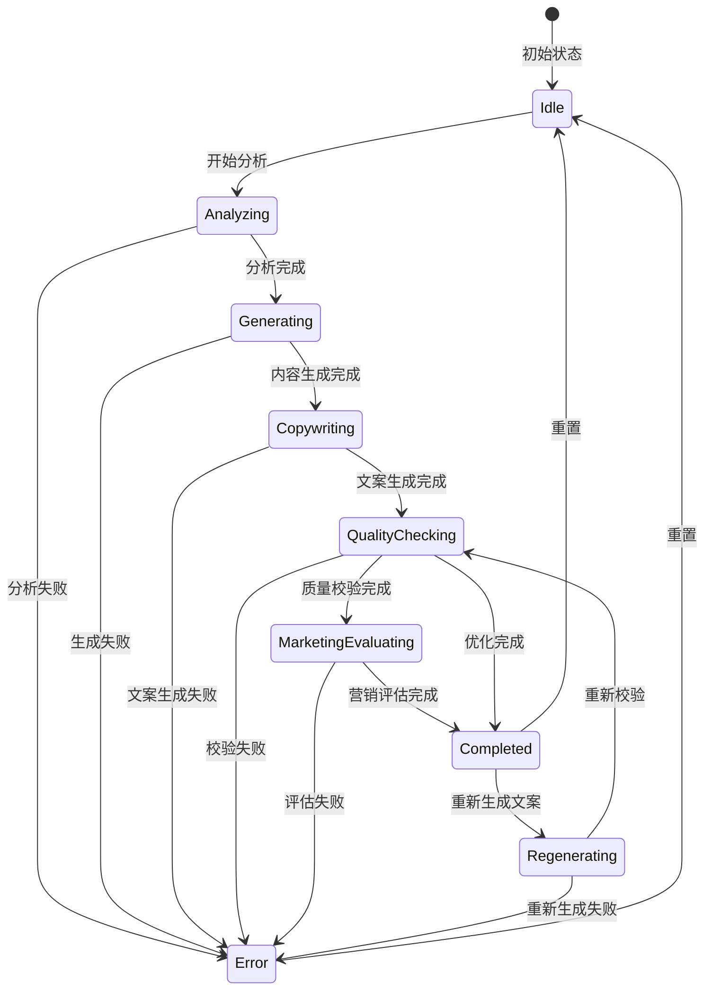

**状态图来源**
- [AICreator.tsx:72-152](file://web/client/src/pages/AICreator.tsx#L72-L152)

## 后端服务架构

### 路由设计

```mermaid
graph LR
subgraph "AI创作路由"
Analyze[/api/ai/analyze]
Generate[/api/ai/generate]
Copywriting[/api/ai/copywriting]
Create[/api/ai/create]
Publish[/api/ai/publish]
QuickCopywriting[/api/ai/quick-copywriting]
QualityCheck[/api/ai/quality-check]
TaskStatus[/api/ai/task/:taskId]
Tasks[/api/ai/tasks]
Draft[/api/ai/draft]
History[/api/ai/history]
Template[/api/ai/template]
WorkflowStart[/api/ai/workflow/start]
WorkflowStep[/api/ai/workflow/step]
NextAction[/api/ai/workflow/:taskId/next-action]
MarketingEvaluate[/api/ai/marketing-evaluate]
GenerateHooks[/api/ai/generate-hooks]
Analytics[/api/ai/analytics]
end
subgraph "业务逻辑"
Analyzer[需求分析服务]
Generator[内容生成服务]
Copywriter[文案生成服务]
Publisher[发布服务]
DraftService[草稿服务]
HistoryService[历史服务]
TemplateService[模板服务]
QualityChecker[质量校验服务]
AIService[AI发布服务]
MarketingEvaluator[营销评估服务]
HookGenerator[内容钩子生成服务]
AnalyticsService[营销分析服务]
end
Analyze --> Analyzer
Generate --> Generator
Copywriting --> Copywriter
Create --> Publisher
Publish --> Publisher
QuickCopywriting --> Copywriter
QualityCheck --> QualityChecker
TaskStatus --> AIService
Tasks --> AIService
Draft --> DraftService
History --> HistoryService
Template --> TemplateService
WorkflowStart --> AIService
WorkflowStep --> AIService
NextAction --> AIService
MarketingEvaluate --> MarketingEvaluator
GenerateHooks --> HookGenerator
Analytics --> AnalyticsService
```

**更新** 新增营销评估、钩子生成和数据分析路由

**架构图来源**
- [ai.ts:96-1321](file://web/server/src/routes/ai.ts#L96-L1321)

### 服务依赖关系

```mermaid
graph TB
subgraph "AI服务层"
DS[DeepSeekClient]
DB[DoubaoClient]
END
subgraph "业务服务层"
RA[RequirementAnalyzer]
CG[ContentGenerator]
CW[CopywritingGenerator]
AP[AI发布服务]
DS[DraftService]
HS[HistoryService]
TS[TemplateService]
QC[ContentQualityChecker]
ME[MarketingEvaluator]
HG[HookGenerator]
AS[AnalyticsService]
END
subgraph "数据模型层"
Types[类型定义]
END
RA --> DS
CG --> DB
CW --> DS
AP --> RA
AP --> CG
AP --> CW
QC --> DS
ME --> DS
HG --> DS
AS --> Types
DS --> Types
HS --> Types
TS --> Types
RA --> Types
CG --> Types
CW --> Types
QC --> Types
ME --> Types
```

**更新** 新增营销评估、钩子生成和数据分析服务

**架构图来源**
- [requirement-analyzer.ts:6-34](file://src/services/ai/requirement-analyzer.ts#L6-L34)
- [content-generator.ts:6-54](file://src/services/ai/content-generator.ts#L6-L54)
- [copywriting-generator.ts:6-47](file://src/services/ai/copywriting-generator.ts#L6-L47)
- [deepseek-client.ts:340-448](file://src/api/ai/deepseek-client.ts#L340-L448)

## AI服务集成

### DeepSeek AI集成

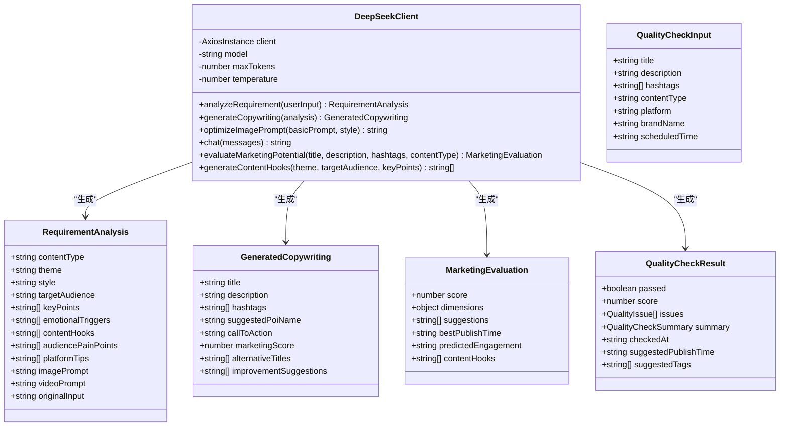

**类图来源**
- [deepseek-client.ts:55-283](file://src/api/ai/deepseek-client.ts#L55-L283)
- [deepseek-client.ts:340-448](file://src/api/ai/deepseek-client.ts#L340-L448)
- [types.ts:207-316](file://src/models/types.ts#L207-L316)
- [types.ts:623-682](file://src/models/types.ts#L623-L682)

### Doubao AI集成

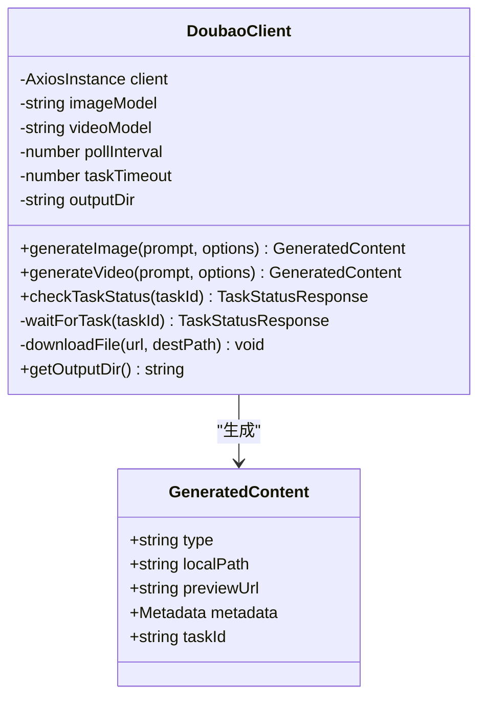

**类图来源**
- [doubao-client.ts:76-349](file://src/api/ai/doubao-client.ts#L76-L349)
- [types.ts:231-247](file://src/models/types.ts#L231-L247)

## 任务管理集成

### 统一任务数据流

**新增** 统一任务管理的数据流架构：

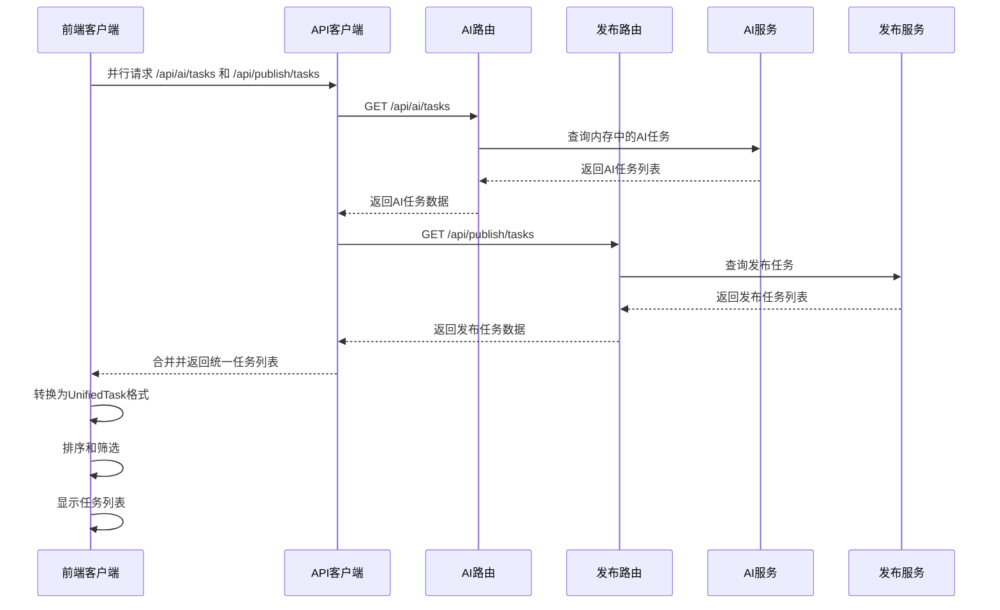

**流程图来源**
- [TaskList.tsx:193-212](file://web/client/src/pages/TaskList.tsx#L193-L212)
- [ai.ts:426-471](file://web/server/src/routes/ai.ts#L426-L471)

### AI任务状态管理

**新增** AI任务状态管理机制：

- **内存存储**: AI任务状态存储在内存中，支持实时更新
- **状态映射**: AI任务状态映射到统一的状态体系
- **进度计算**: 基于各步骤的完成度计算整体进度
- **时间戳管理**: 记录创建时间和最后更新时间
- **结果缓存**: 缓存任务执行结果供后续查询

**Section sources**
- [ai-publish-service.ts:49-73](file://src/services/ai-publish-service.ts#L49-L73)
- [ai.ts:426-471](file://web/server/src/routes/ai.ts#L426-L471)

### 任务类型识别

**新增** 统一任务类型识别机制：

- **类型字段**: 通过type字段区分AI任务和发布任务
- **内容类型**: AI任务通过contentType字段标识生成内容类型
- **状态分类**: 统一状态分类，AI任务包含特殊状态
- **错误处理**: 统一错误处理机制
- **重试机制**: 统一重试逻辑，AI任务支持智能重试

**Section sources**
- [TaskList.tsx:118-143](file://web/client/src/pages/TaskList.tsx#L118-L143)
- [TaskList.tsx:336-350](file://web/client/src/pages/TaskList.tsx#L336-L350)

### 统一任务管理界面

**新增** TaskList页面的统一任务管理界面：

- **并行获取**: 同时获取AI任务和发布任务，提高响应速度
- **智能合并**: 将内存中的实时AI任务与数据库中的历史任务合并
- **统一格式**: 所有任务转换为UnifiedTask格式，便于统一显示
- **实时刷新**: 根据任务状态动态调整刷新频率
- **状态同步**: AI任务的progress和currentStep字段用于实时进度显示

**Section sources**
- [TaskList.tsx:166-191](file://web/client/src/pages/TaskList.tsx#L166-L191)
- [TaskList.tsx:214-230](file://web/client/src/pages/TaskList.tsx#L214-L230)

### 实时进度监控

**新增** AI任务的实时进度监控功能：

- **智能刷新**: 有进行中AI任务时每5秒刷新，无AI任务时每30秒刷新
- **进度条显示**: AI任务状态为进行中时显示实时进度条
- **步骤指示**: 显示当前执行的步骤名称
- **状态颜色**: 不同状态使用不同的颜色标识

**Section sources**
- [TaskList.tsx:214-230](file://web/client/src/pages/TaskList.tsx#L214-L230)
- [TaskList.tsx:409-424](file://web/client/src/pages/TaskList.tsx#L409-L424)

### 筛选和搜索功能

**新增** TaskList页面的高级筛选功能：

- **类型筛选**: 支持按AI任务、定时发布任务或全部任务筛选
- **状态筛选**: 支持按待执行、已完成、失败、已取消等状态筛选
- **搜索功能**: 支持按任务ID精确搜索
- **组合筛选**: 支持多条件组合筛选

**Section sources**
- [TaskList.tsx:707-746](file://web/client/src/pages/TaskList.tsx#L707-L746)
- [TaskList.tsx:363-372](file://web/client/src/pages/TaskList.tsx#L363-L372)

### 批量重试功能

**新增** 批量重试功能：

- **智能检测**: 自动检测可重试的失败任务
- **确认对话框**: 批量操作前显示确认对话框
- **进度反馈**: 显示批量重试的结果统计
- **条件限制**: 仅对定时发布任务提供批量重试

**Section sources**
- [TaskList.tsx:275-314](file://web/client/src/pages/TaskList.tsx#L275-L314)

## 营销分析功能

### 营销潜力评估系统

**新增** 全面的营销潜力评估系统：

- **综合评分**: 基于0-100分的综合营销评分
- **维度分析**: 标题吸引力、情感共鸣、行动引导力、话题质量四个维度
- **预测分析**: 预测互动等级（high/medium/low）
- **智能建议**: 提供具体的改进建议和优化方向
- **时间优化**: 建议最佳发布时间段

**Section sources**
- [deepseek-client.ts:340-425](file://src/api/ai/deepseek-client.ts#L340-L425)
- [AICreator.tsx:305-318](file://web/client/src/pages/AICreator.tsx#L305-L318)

### 内容钩子生成系统

**新增** 黄金3秒内容钩子生成系统：

- **创意设计**: 基于痛点式、数字式、证明式等策略生成钩子
- **可执行性**: 提供具体可执行的开场台词或画面描述
- **多场景适配**: 支持美食、产品、活动等多种内容场景
- **一键复制**: 支持快速复制和使用生成的钩子

**Section sources**
- [deepseek-client.ts:427-448](file://src/api/ai/deepseek-client.ts#L427-L448)
- [AICreator.tsx:320-347](file://web/client/src/pages/AICreator.tsx#L320-L347)

### 营销数据分析系统

**新增** 综合营销数据分析系统：

- **内容类型分析**: 统计图片和视频内容的使用分布
- **成功率统计**: 基于历史数据计算整体成功率
- **评分趋势**: 分析营销评分的变化趋势
- **热门话题追踪**: 统计最常用话题标签的使用频率
- **创作趋势**: 展示近7天的创作活动趋势

**Section sources**
- [ai.ts:1246-1318](file://web/server/src/routes/ai.ts#L1246-L1318)

### 需求分析增强功能

**新增** 需求分析的营销增强字段：

- **营销切入角度**: 痛点式、渴望式、好奇式、社交证明式
- **情感触发词**: 3-5个能引发情感共鸣的关键词
- **目标受众痛点**: 识别和分析目标受众的核心痛点
- **平台优化建议**: 提供具体的平台发布优化建议
- **内容钩子建议**: 基于分析结果生成开场钩子建议

**Section sources**
- [types.ts:227-238](file://src/models/types.ts#L227-L238)

### 营销评分与改进建议

**新增** 营销评分与改进建议系统：

- **智能评分**: 基于AI算法的营销效果评分
- **维度评分**: 四个核心维度的详细评分
- **可执行建议**: 提供具体可行的优化建议
- **重新评估**: 支持基于建议的重新评估
- **进度追踪**: 跟踪营销优化的改进效果

**Section sources**
- [AICreator.tsx:957-1092](file://web/client/src/pages/AICreator.tsx#L957-L1092)

## 配置管理

### 环境配置

```mermaid
graph TD
subgraph "配置文件"
Config[default.ts]
END
subgraph "API配置"
BaseURL[API基础URL]
Timeout[请求超时]
END
subgraph "AI配置"
DeepSeek[DeepSeek配置]
Doubao[Doubao配置]
END
subgraph "内容配置"
MaxTitle[标题最大长度]
MaxDesc[描述最大长度]
MaxHashtag[最大标签数]
END
Config --> BaseURL
Config --> Timeout
Config --> DeepSeek
Config --> Doubao
Config --> MaxTitle
Config --> MaxDesc
Config --> MaxHashtag
```

**架构图来源**
- [default.ts:5-70](file://config/default.ts#L5-L70)

### 类型定义

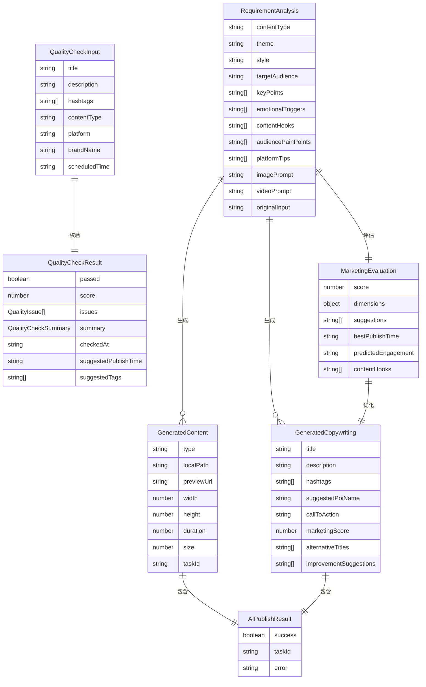

**实体关系图来源**
- [types.ts:207-316](file://src/models/types.ts#L207-L316)
- [types.ts:623-682](file://src/models/types.ts#L623-L682)

## 错误处理与重试机制

### 错误处理策略

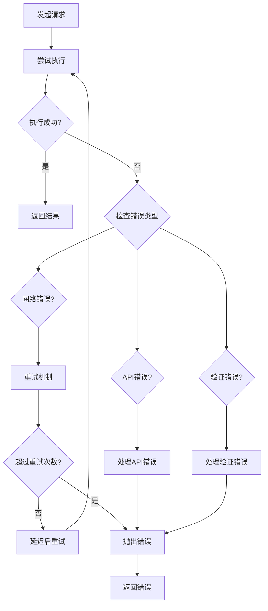

**流程图来源**
- [deepseek-client.ts:86-114](file://src/api/ai/deepseek-client.ts#L86-L114)
- [doubao-client.ts:267-292](file://src/api/ai/doubao-client.ts#L267-L292)

### 重试配置

系统实现了智能重试机制，支持指数退避算法：

- **最大重试次数**: 3次
- **基础延迟**: 1秒
- **最大延迟**: 30秒
- **超时控制**: 60秒（DeepSeek），120秒（Doubao）

## 性能优化策略

### 并行任务获取

**新增** TaskList页面的性能优化策略：

- **并行请求**: AI任务和发布任务并行获取，减少等待时间
- **智能刷新**: 根据任务状态动态调整刷新频率
- **内存缓存**: AI任务状态存储在内存中，避免重复查询
- **去重处理**: 合并内存中的实时任务和持久化的历史任务

**Section sources**
- [TaskList.tsx:198-203](file://web/client/src/pages/TaskList.tsx#L198-L203)
- [TaskList.tsx:225-230](file://web/client/src/pages/TaskList.tsx#L225-L230)

### 缓存策略

```mermaid
graph LR
subgraph "缓存层"
Memory[内存缓存]
Disk[磁盘缓存]
END
subgraph "AI服务层"
DS[DeepSeek缓存]
DB[Doubao缓存]
END
subgraph "业务逻辑层"
Analyzer[分析结果缓存]
Content[生成内容缓存]
Copywriting[文案缓存]
Draft[草稿缓存]
History[历史记录缓存]
Template[模板缓存]
Quality[质量校验缓存]
AICache[AI任务缓存]
MarketingCache[营销评估缓存]
HookCache[钩子建议缓存]
AnalyticsCache[分析数据缓存]
END
Memory --> DS
Memory --> DB
Memory --> AICache
Memory --> MarketingCache
Memory --> HookCache
Memory --> AnalyticsCache
Disk --> Analyzer
Disk --> Content
Disk --> Copywriting
Disk --> Draft
Disk --> History
Disk --> Template
Disk --> Quality
DS --> Analyzer
DB --> Content
Analyzer --> Copywriting
Draft --> History
History --> Template
Quality --> Content
AICache --> Memory
MarketingCache --> Memory
HookCache --> Memory
AnalyticsCache --> Memory
```

**更新** 新增营销评估、钩子生成和数据分析的缓存策略

### 并发控制

系统采用以下并发控制策略：
- **请求限流**: 防止AI服务过载
- **任务队列**: 异步处理耗时任务
- **资源池**: 管理AI服务连接
- **超时控制**: 防止长时间阻塞

### 预览模态框性能优化

**新增** 预览模态框的性能优化策略：

- **按需加载**: 仅在用户点击预览时加载内容
- **销毁策略**: 关闭模态框时销毁DOM节点
- **中心化**: 使用centered属性确保模态框居中显示
- **宽度自适应**: 根据内容类型自动调整模态框宽度
- **自动播放**: 视频内容自动播放，提升用户体验

**Section sources**
- [TaskList.tsx:789-815](file://web/client/src/pages/TaskList.tsx#L789-L815)

## 部署与运维

### 环境要求

- **Node.js**: 18+
- **API密钥**: DeepSeek和Doubao的API密钥
- **存储空间**: 至少1GB用于生成内容
- **网络连接**: 稳定的互联网连接

### 配置文件

```bash
# .env文件示例
DEEPSEEK_API_KEY=your_deepseek_api_key
DOUBAO_API_KEY=your_doubao_api_key
DEEPSEEK_BASE_URL=https://api.deepseek.com
DOUBAO_BASE_URL=https://ark.cn-beijing.volces.com/api/v3
DOUBAO_ENDPOINT_ID_IMAGE=image_model_id
DOUBAO_ENDPOINT_ID_VIDEO=video_model_id
```

### 监控指标

系统监控以下关键指标：
- **AI调用成功率**
- **内容生成时间**
- **API响应延迟**
- **存储使用情况**
- **用户活跃度**
- **营销评估准确率**
- **钩子生成质量**

## 总结

AI创作页面是ClawOperations系统的核心功能模块，通过深度整合AI服务和TikTok平台，为用户提供了一站式的自动化内容创作解决方案。该系统具有以下特点：

### 技术优势
- **模块化设计**: 清晰的服务分离和依赖管理
- **AI集成**: 深度集成DeepSeek和Doubao两大AI平台
- **用户体验**: 直观的界面设计和流畅的操作流程
- **扩展性**: 支持多种内容类型和发布渠道
- **统一管理**: AI任务和发布任务的统一管理架构
- **营销分析**: 全面的营销效果分析和优化能力

### 功能特色
- **智能需求分析**: 基于自然语言处理的创作需求理解
- **多样化内容生成**: 支持图片和视频的AI生成
- **专业文案创作**: 自动生成符合平台规范的推广文案
- **一键发布**: 直接发布到TikTok平台
- **质量校验**: 全面的内容质量审核和优化建议
- **自动优化**: 基于质量检查反馈的智能重新生成功能
- **实时监控**: AI任务的实时进度监控和状态更新
- **智能重试**: 统一的错误处理和重试机制
- **统一界面**: AI创作任务与传统定时发布任务的合并展示
- **预览模态框**: 集成的图片和视频预览系统
- **URL处理**: 智能的URL处理和过期问题解决
- **营销潜力评估**: 全面的营销效果分析和优化建议
- **内容钩子生成**: 基于黄金3秒法则的开场钩子设计
- **营销数据分析**: 历史数据驱动的营销洞察和趋势分析

### UI改进亮点
**更新** 新版本的重大UI改进包括：

- **预览模态框系统**: 完整的模态框预览功能，支持图片和视频的集成预览
- **增强URL处理**: 解决豆包URL过期问题，支持本地文件预览
- **改进加载状态**: 智能的加载状态管理，避免频繁的loading闪烁
- **优化后台轮询**: 根据任务状态动态调整轮询频率
- **视频预览功能**: 完整的HTML5视频播放器，支持在线和本地视频预览
- **增强媒体预览系统**: 统一的图片和视频预览界面，提供更好的用户体验
- **内容质量校验**: 详细的评分系统和问题分类，帮助用户优化内容质量
- **重新生成按钮**: 质量校验不通过时自动显示重新生成按钮，支持一键优化
- **改进的用户界面组件**: 更直观的按钮式单选组和增强的草稿管理功能
- **五步进度指示器**: 清晰的创作流程可视化，让用户了解当前所处阶段
- **统一任务列表**: AI任务和发布任务的统一显示和管理
- **实时进度条**: AI任务的实时进度监控和状态更新
- **智能刷新机制**: 根据任务状态动态调整刷新频率
- **批量重试功能**: 支持批量处理失败的定时发布任务
- **高级筛选功能**: 支持按类型、状态、搜索条件的组合筛选
- **统一任务格式**: AI任务和发布任务的统一数据格式
- **营销分析面板**: 全面的营销效果分析和优化建议展示
- **维度评分图表**: 四个核心维度的可视化评分系统
- **钩子建议系统**: 基于AI的黄金3秒钩子生成和优化
- **改进建议面板**: 具体可执行的营销优化建议

### 应用价值
该系统显著提升了内容创作效率，降低了营销成本，为小龙虾主题的TikTok营销活动提供了强有力的技术支撑。通过AI驱动的自动化流程，用户可以专注于创意构思，而将技术实现交给系统完成。

**更新** 新的营销分析功能和UI改进进一步提升了用户的创作体验，使AI创作变得更加简单、高效和直观。营销潜力评估、内容钩子生成和数据分析等功能为用户提供了从内容创作到营销效果的全链路优化指导，显著提升了内容营销的效果和ROI。

TaskList页面的AI任务集成为整个系统带来了重要的架构升级，实现了AI创作任务和传统发布任务的统一管理，为用户提供了更加便捷和高效的创作体验。通过实时进度监控、智能重试和批量操作等功能，用户可以更好地掌控整个创作流程，提升工作效率和内容质量。统一任务管理界面的引入，使得用户可以在一个界面上同时管理AI创作任务和定时发布任务，大大简化了操作流程，提高了管理效率。

新增的营销分析功能是本次更新的核心亮点，包括营销潜力评估、内容钩子生成、情感触发器分析、目标受众痛点识别等AI驱动的营销优化能力。这些功能不仅提升了内容的质量和吸引力，更重要的是为用户提供了数据驱动的营销决策支持，帮助用户制定更有效的营销策略，提升内容在平台上的表现和影响力。从外部链接预览转变为集成的模态框预览，从单一的内容生成到全链路的营销优化，AI创作页面正在成为真正意义上的智能营销助手。