# TaskList页面增强功能

<cite>
**本文档引用的文件**
- [TaskList.tsx](file://web/client/src/pages/TaskList.tsx)
- [TaskStatusCard.tsx](file://web/client/src/components/publish/TaskStatusCard.tsx)
- [useCreationWorkflow.ts](file://web/client/src/hooks/useCreationWorkflow.ts)
- [ai-publish-service.ts](file://src/services/ai-publish-service.ts)
- [types.ts](file://src/models/types.ts)
- [PublishErrorDisplay.tsx](file://web/client/src/components/publish/PublishErrorDisplay.tsx)
- [HistoryDrawer.tsx](file://web/client/src/components/ai-creator/HistoryDrawer.tsx)
- [client.ts](file://web/client/src/api/client.ts)
- [scheduler-service.ts](file://src/services/scheduler-service.ts)
- [QualityCheckResult.tsx](file://web/client/src/components/ai-creator/QualityCheckResult.tsx)
- [WorkflowSteps.tsx](file://web/client/src/components/ai-creator/WorkflowSteps.tsx)
- [error-classifier.ts](file://src/utils/error-classifier.ts)
</cite>

## 目录
1. [项目概述](#项目概述)
2. [TaskList页面架构](#tasklist页面架构)
3. [核心功能增强](#核心功能增强)
4. [任务状态管理](#任务状态管理)
5. [错误处理机制](#错误处理机制)
6. [批量操作功能](#批量操作功能)
7. [界面交互设计](#界面交互设计)
8. [性能优化策略](#性能优化策略)
9. [扩展性设计](#扩展性设计)
10. [总结](#总结)

## 项目概述

TaskList页面是ClawOperations系统中的核心任务管理界面，负责统一展示和管理AI创作任务与定时发布任务。该页面集成了多种增强功能，包括实时任务监控、智能错误处理、批量操作支持以及友好的用户交互体验。

系统采用前后端分离架构，前端使用React + Ant Design构建用户界面，后端基于Node.js提供RESTful API服务。TaskList页面作为主要的用户入口，提供了完整的任务生命周期管理功能。

## TaskList页面架构

### 页面整体结构

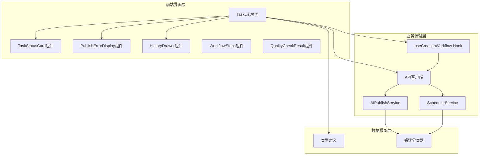

**图表来源**
- [TaskList.tsx:141-887](file://web/client/src/pages/TaskList.tsx#L141-L887)
- [TaskStatusCard.tsx:102-323](file://web/client/src/components/publish/TaskStatusCard.tsx#L102-L323)
- [useCreationWorkflow.ts:90-360](file://web/client/src/hooks/useCreationWorkflow.ts#L90-L360)

### 数据流架构

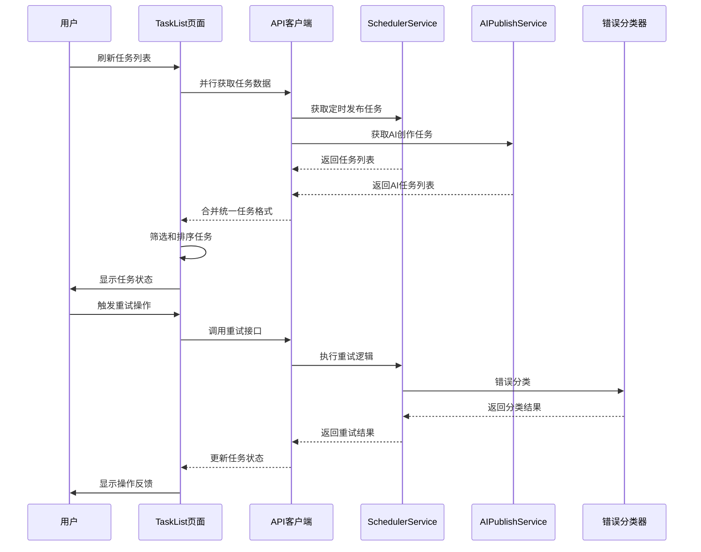

**图表来源**
- [TaskList.tsx:214-233](file://web/client/src/pages/TaskList.tsx#L214-L233)
- [client.ts:234-266](file://web/client/src/api/client.ts#L234-L266)
- [scheduler-service.ts:228-307](file://src/services/scheduler-service.ts#L228-L307)

**章节来源**
- [TaskList.tsx:141-887](file://web/client/src/pages/TaskList.tsx#L141-L887)
- [client.ts:1-515](file://web/client/src/api/client.ts#L1-L515)

## 核心功能增强

### 1. 统一任务管理

TaskList页面实现了AI创作任务与定时发布任务的统一管理，通过统一的数据结构和界面展示，提升了用户体验的一致性。

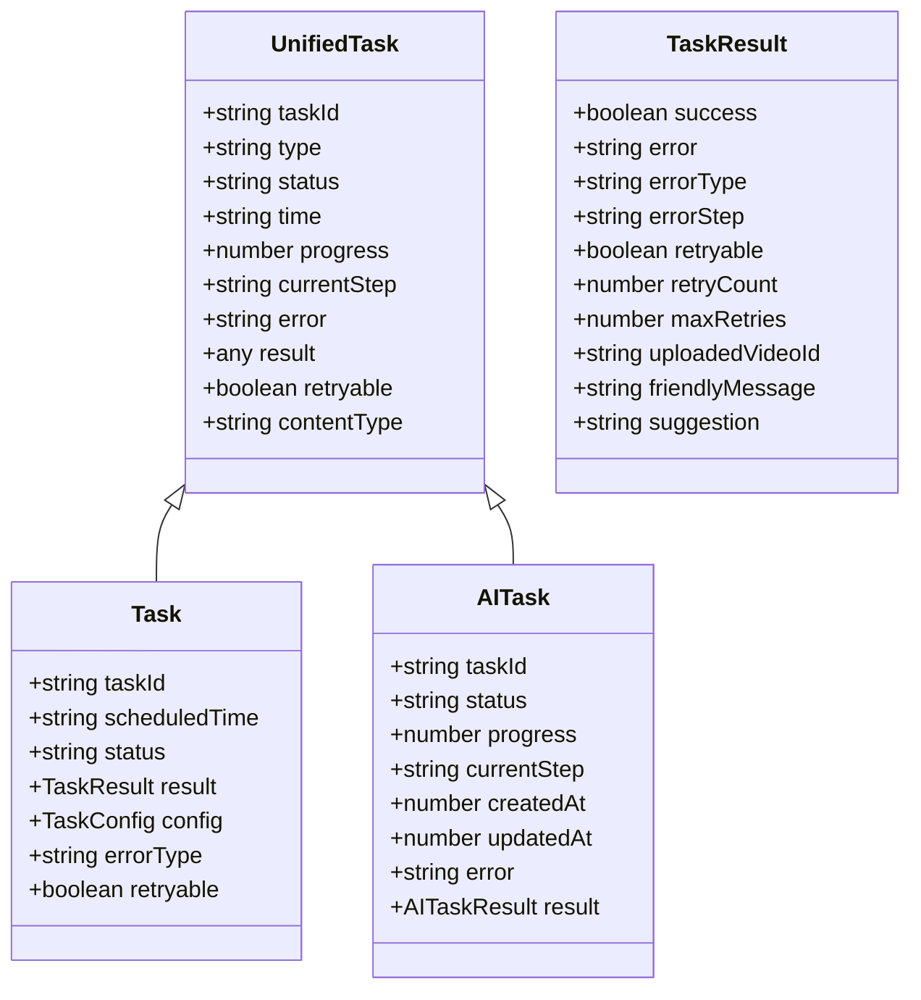

**图表来源**
- [TaskList.tsx:61-118](file://web/client/src/pages/TaskList.tsx#L61-L118)
- [TaskList.tsx:188-212](file://web/client/src/pages/TaskList.tsx#L188-L212)

### 2. 智能轮询机制

页面实现了智能的轮询策略，根据任务状态动态调整刷新频率，优化了性能表现。

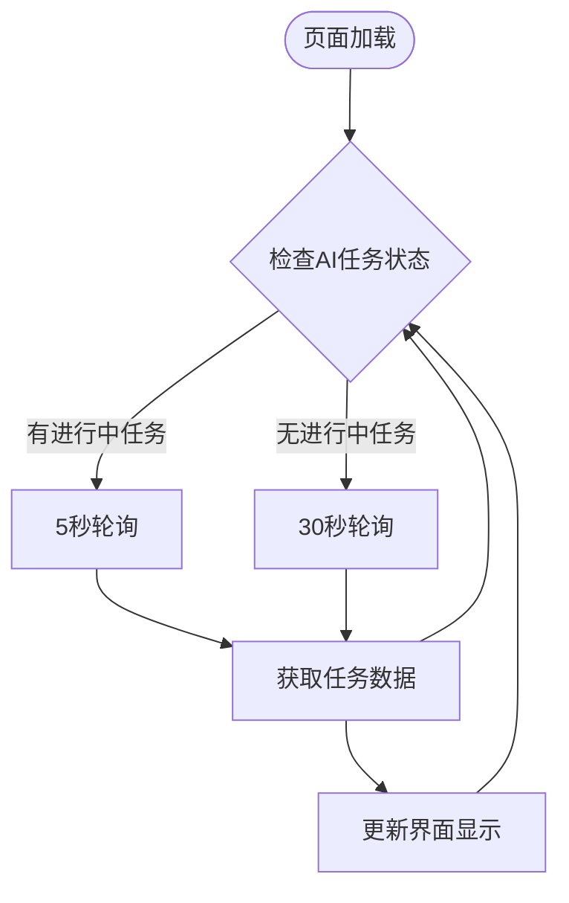

**图表来源**
- [TaskList.tsx:246-251](file://web/client/src/pages/TaskList.tsx#L246-L251)

**章节来源**
- [TaskList.tsx:188-212](file://web/client/src/pages/TaskList.tsx#L188-L212)
- [TaskList.tsx:246-251](file://web/client/src/pages/TaskList.tsx#L246-L251)

## 任务状态管理

### 状态分类体系

系统实现了完整的任务状态管理体系，涵盖定时发布任务和AI创作任务的不同状态。

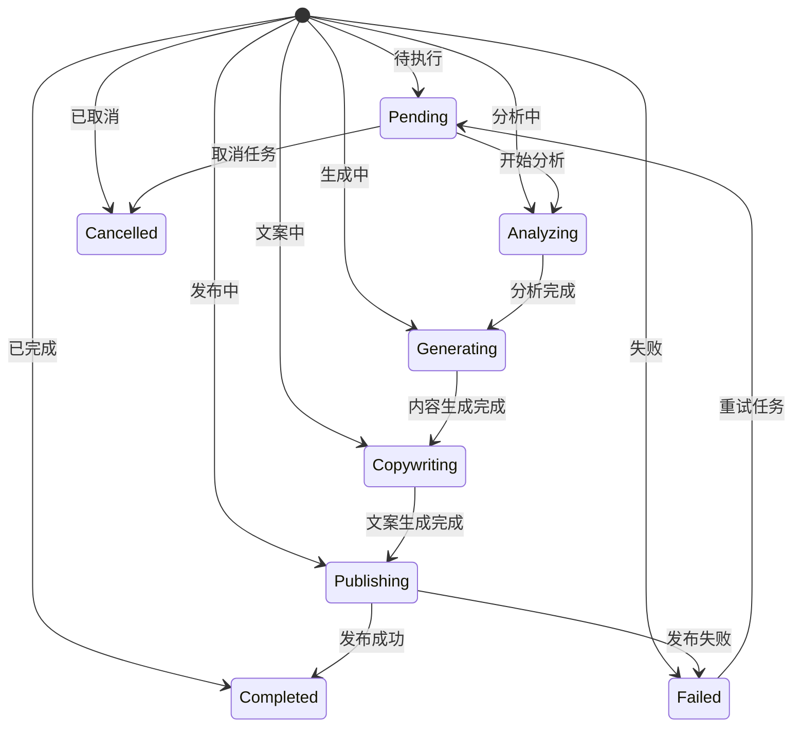

**图表来源**
- [TaskList.tsx:337-355](file://web/client/src/pages/TaskList.tsx#L337-L355)
- [types.ts:298-317](file://src/models/types.ts#L298-L317)

### 状态标签组件

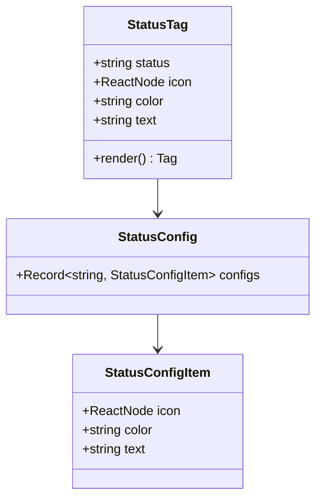

**图表来源**
- [TaskList.tsx:337-355](file://web/client/src/pages/TaskList.tsx#L337-L355)

**章节来源**
- [TaskList.tsx:337-355](file://web/client/src/pages/TaskList.tsx#L337-L355)
- [types.ts:496-525](file://src/models/types.ts#L496-L525)

## 错误处理机制

### 错误分类系统

系统实现了智能的错误分类机制，能够自动识别不同类型的错误并提供相应的处理建议。

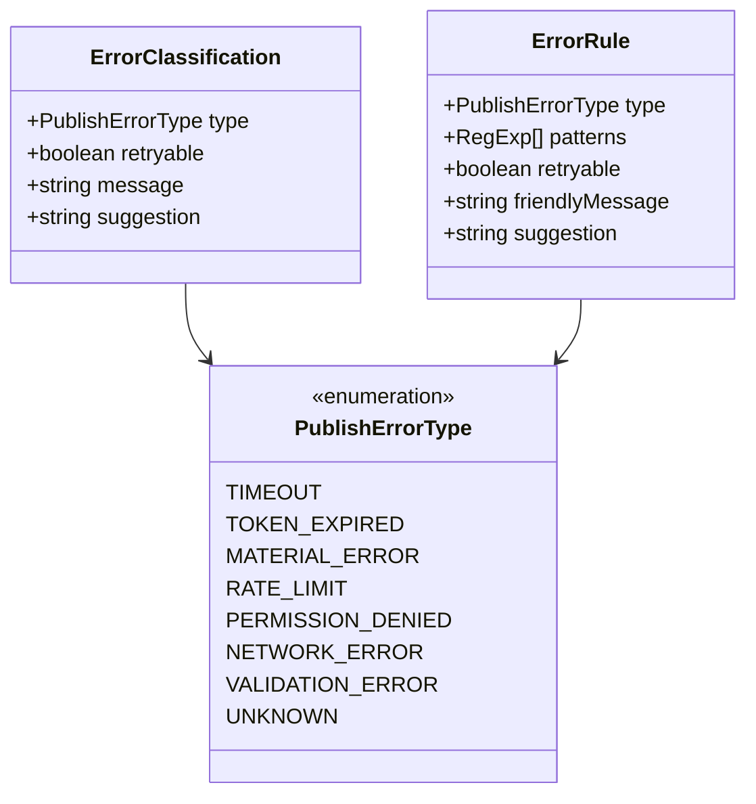

**图表来源**
- [error-classifier.ts:8-17](file://src/utils/error-classifier.ts#L8-L17)
- [types.ts:495-513](file://src/models/types.ts#L495-L513)

### 错误处理流程

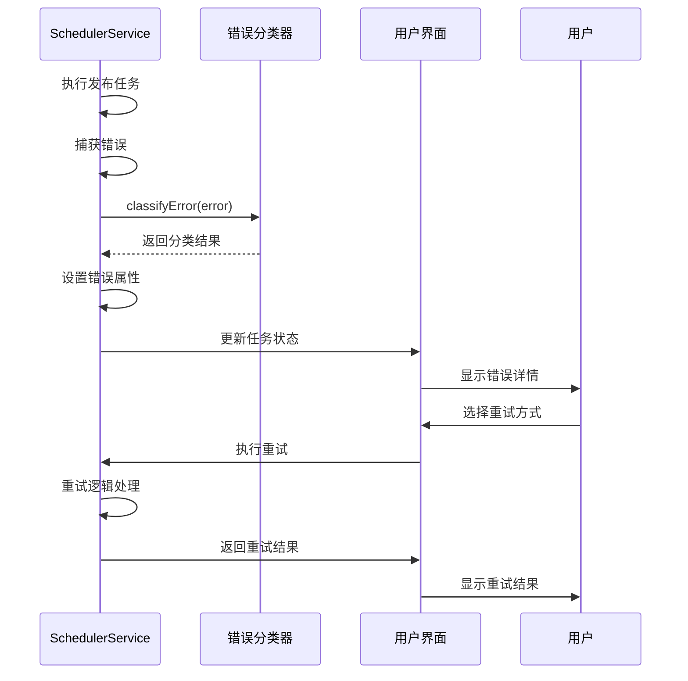

**图表来源**
- [scheduler-service.ts:203-220](file://src/services/scheduler-service.ts#L203-L220)
- [error-classifier.ts:168-193](file://src/utils/error-classifier.ts#L168-L193)

**章节来源**
- [error-classifier.ts:22-161](file://src/utils/error-classifier.ts#L22-L161)
- [scheduler-service.ts:203-307](file://src/services/scheduler-service.ts#L203-L307)

## 批量操作功能

### 批量重试机制

TaskList页面提供了强大的批量操作功能，特别是批量重试失败任务的能力。

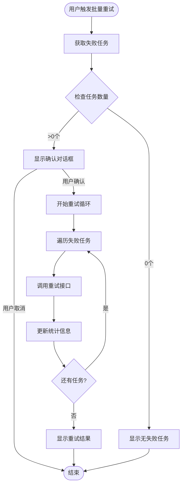

**图表来源**
- [TaskList.tsx:296-335](file://web/client/src/pages/TaskList.tsx#L296-L335)

### 统计面板设计

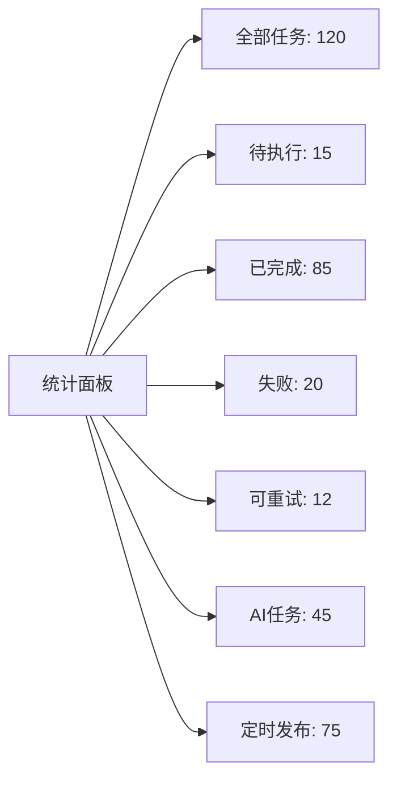

**图表来源**
- [TaskList.tsx:373-382](file://web/client/src/pages/TaskList.tsx#L373-L382)

**章节来源**
- [TaskList.tsx:296-335](file://web/client/src/pages/TaskList.tsx#L296-L335)
- [TaskList.tsx:373-382](file://web/client/src/pages/TaskList.tsx#L373-L382)

## 界面交互设计

### 组件层次结构

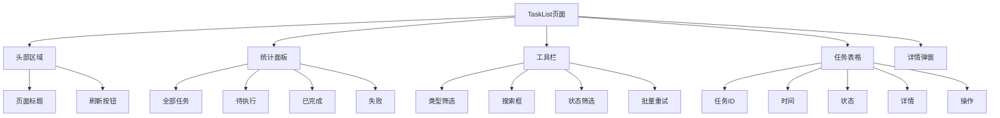

**图表来源**
- [TaskList.tsx:656-792](file://web/client/src/pages/TaskList.tsx#L656-L792)

### 操作按钮设计

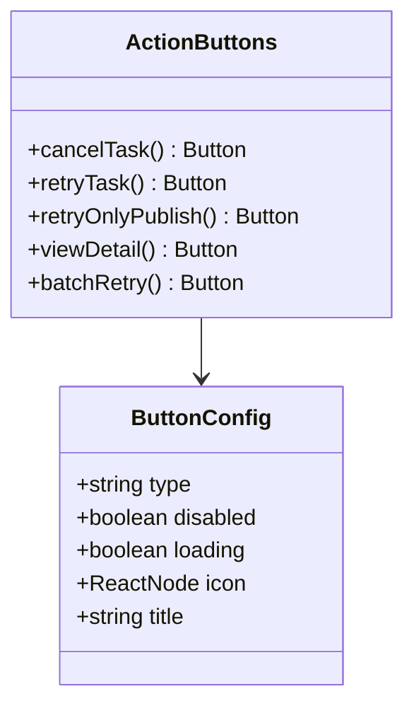

**图表来源**
- [TaskList.tsx:539-604](file://web/client/src/pages/TaskList.tsx#L539-L604)

**章节来源**
- [TaskList.tsx:656-792](file://web/client/src/pages/TaskList.tsx#L656-L792)
- [TaskList.tsx:539-604](file://web/client/src/pages/TaskList.tsx#L539-L604)

## 性能优化策略

### 智能轮询优化

系统实现了基于任务状态的智能轮询策略，有效平衡了实时性和性能消耗。

| 任务状态 | 轮询间隔 | 说明 |
|---------|---------|------|
| 有进行中AI任务 | 5秒 | 实时监控AI创作进度 |
| 无进行中任务 | 30秒 | 减少不必要的API调用 |
| 初次加载 | 立即 | 确保用户看到最新数据 |

### 并行数据获取

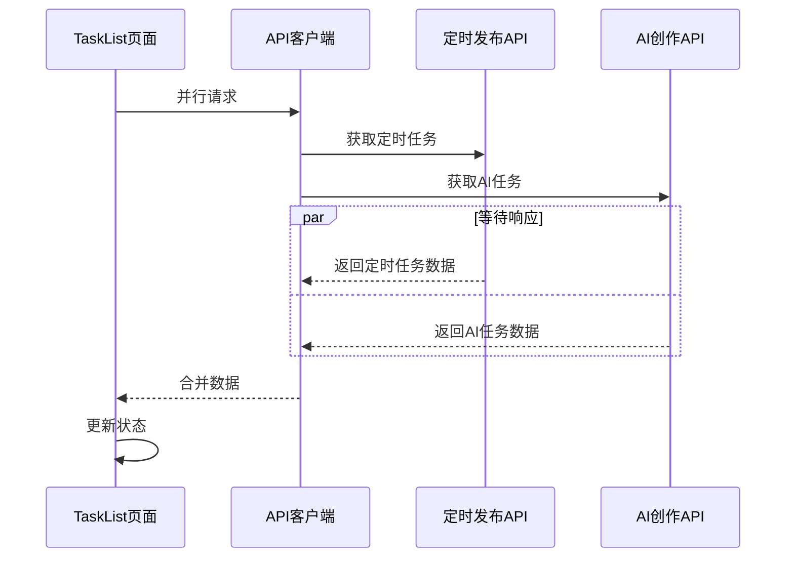

**图表来源**
- [TaskList.tsx:220-224](file://web/client/src/pages/TaskList.tsx#L220-L224)

**章节来源**
- [TaskList.tsx:220-224](file://web/client/src/pages/TaskList.tsx#L220-L224)
- [TaskList.tsx:246-251](file://web/client/src/pages/TaskList.tsx#L246-L251)

## 扩展性设计

### 插件化架构

系统采用了插件化的架构设计，便于后续功能扩展和维护。

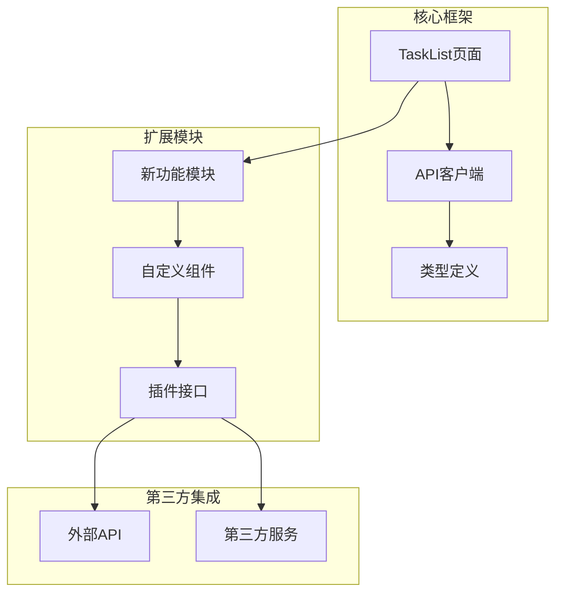

### 可配置性设计

系统提供了丰富的配置选项，支持不同场景下的定制化需求。

**章节来源**
- [types.ts:1-687](file://src/models/types.ts#L1-L687)
- [client.ts:1-515](file://web/client/src/api/client.ts#L1-L515)

## 总结

TaskList页面作为ClawOperations系统的核心界面，展现了现代Web应用的优秀实践。通过统一的任务管理、智能的错误处理、高效的批量操作和友好的用户界面，为用户提供了完整的任务管理体验。

### 主要优势

1. **统一性**: 统一管理AI创作和定时发布任务，提供一致的用户体验
2. **智能化**: 智能轮询、自动重试、错误分类等特性提升了系统的智能化水平
3. **高效性**: 并行数据获取、性能优化策略确保了良好的响应速度
4. **可扩展性**: 插件化架构和丰富的配置选项便于功能扩展
5. **可靠性**: 完善的错误处理机制和重试策略保证了系统的稳定性

### 技术亮点

- **实时监控**: 基于任务状态的智能轮询机制
- **批量操作**: 支持批量重试和批量管理
- **错误分类**: 自动识别错误类型并提供处理建议
- **状态管理**: 完整的任务状态生命周期管理
- **界面设计**: 响应式布局和友好的用户交互

TaskList页面不仅是一个功能强大的任务管理工具，更是整个ClawOperations系统设计理念和技术实现的集中体现。