# Web界面系统

<cite>
**本文档引用的文件**
- [README.md](file://README.md)
- [package.json](file://package.json)
- [src/index.ts](file://src/index.ts)
- [src/models/types.ts](file://src/models/types.ts)
- [src/api/douyin-client.ts](file://src/api/douyin-client.ts)
- [src/api/auth.ts](file://src/api/auth.ts)
- [src/services/publish-service.ts](file://src/services/publish-service.ts)
- [src/services/scheduler-service.ts](file://src/services/scheduler-service.ts)
- [web/server/src/index.ts](file://web/server/src/index.ts)
- [web/server/src/routes/auth.ts](file://web/server/src/routes/auth.ts)
- [web/server/src/routes/upload.ts](file://web/server/src/routes/upload.ts)
- [web/server/src/routes/publish.ts](file://web/server/src/routes/publish.ts)
- [web/server/src/routes/user.ts](file://web/server/src/routes/user.ts)
- [web/server/src/routes/ai.ts](file://web/server/src/routes/ai.ts)
- [web/server/src/middleware/auth.ts](file://web/server/src/middleware/auth.ts)
- [web/server/src/utils/auth.ts](file://web/server/src/utils/auth.ts)
- [web/client/package.json](file://web/client/package.json)
- [web/client/src/App.tsx](file://web/client/src/App.tsx)
- [web/client/src/pages/Login.tsx](file://web/client/src/pages/Login.tsx)
- [web/client/src/pages/Register.tsx](file://web/client/src/pages/Register.tsx)
- [web/client/src/pages/AICreator.tsx](file://web/client/src/pages/AICreator.tsx)
- [web/client/src/pages/Profile.tsx](file://web/client/src/pages/Profile.tsx)
- [web/client/src/pages/TaskList.tsx](file://web/client/src/pages/TaskList.tsx)
- [web/client/src/contexts/AuthContext.tsx](file://web/client/src/contexts/AuthContext.tsx)
- [web/client/src/api/client.ts](file://web/client/src/api/client.ts)
- [web/client/src/components/Layout.tsx](file://web/client/src/components/Layout.tsx)
- [web/client/src/components/publish/ImageTextPreview.tsx](file://web/client/src/components/publish/ImageTextPreview.tsx)
- [deploy/nginx.conf](file://deploy/nginx.conf)
- [deploy/nginx-ssl.conf](file://deploy/nginx-ssl.conf)
- [src/api/ai/doubao-client.ts](file://src/api/ai/doubao-client.ts)
- [src/services/ai/content-generator.ts](file://src/services/ai/content-generator.ts)
- [web/server/src/services/creation-task-service.ts](file://web/server/src/services/creation-task-service.ts)
- [web/client/src/hooks/useCreationWorkflow.ts](file://web/client/src/hooks/useCreationWorkflow.ts)
- [web/client/src/components/ai-creator/WorkflowSteps.tsx](file://web/client/src/components/ai-creator/WorkflowSteps.tsx)
</cite>

## 更新摘要
**变更内容**
- TaskList页面新增AI任务管理功能增强，包括统一任务显示系统
- 实现实时刷新机制，根据AI任务状态动态调整刷新频率
- 新增任务状态跟踪和进度显示功能
- 增强任务筛选和统计功能
- 优化AI创作任务的可视化展示

## 目录
1. [简介](#简介)
2. [项目结构](#项目结构)
3. [核心组件](#核心组件)
4. [架构概览](#架构概览)
5. [详细组件分析](#详细组件分析)
6. [JWT认证系统](#jwt认证系统)
7. [AI内容生成功能](#ai内容生成功能)
8. [用户管理系统](#用户管理系统)
9. [任务管理系统](#任务管理系统)
10. [本地URL系统](#本地url系统)
11. [依赖关系分析](#依赖关系分析)
12. [性能考虑](#性能考虑)
13. [故障排除指南](#故障排除指南)
14. [结论](#结论)

## 简介

ClawOperations 是一个专为抖音（TikTok）小龙虾营销账号设计的现代化自动化运营管理系统。该系统提供完整的视频发布、定时发布、内容管理和数据分析功能，现已升级为基于JWT认证的全功能Web应用。

系统采用前后端分离架构，后端使用 Node.js + Express + JWT 提供RESTful API，前端使用 React + Ant Design + Vite 构建现代化用户界面。通过与抖音官方 API 的深度集成，实现了从视频上传到发布的完整自动化流程，同时新增了AI智能内容生成功能，帮助用户高效管理抖音营销账户。

**更新** TaskList页面新增AI任务管理功能增强，提供统一的任务显示系统、实时刷新机制和状态跟踪功能。

## 项目结构

该项目采用模块化组织方式，主要分为以下几个核心部分：

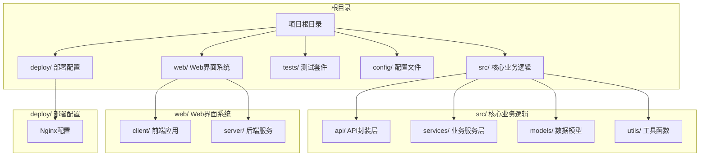

**图表来源**
- [package.json:1-38](file://package.json#L1-L38)
- [README.md:92-105](file://README.md#L92-L105)

**章节来源**
- [package.json:1-38](file://package.json#L1-L38)
- [README.md:92-105](file://README.md#L92-L105)

## 核心组件

### 主要技术栈

系统采用现代化的技术栈构建：

- **后端**: Node.js 18+, Express.js, TypeScript, JWT认证
- **前端**: React 18, Ant Design, Vite, Axios
- **数据库**: MongoDB（用户数据存储）
- **构建工具**: npm scripts, Vite, TypeScript compiler
- **部署**: Nginx反向代理，支持静态文件服务

### 核心架构模式

系统采用分层架构设计，包括：

1. **表现层**: React 前端应用，使用Ant Design组件库
2. **控制层**: Express.js API 服务，集成JWT认证中间件
3. **业务层**: 核心业务逻辑服务，包括AI内容生成和发布管理
4. **数据访问层**: 用户服务和抖音API客户端封装
5. **文件服务层**: Express静态文件服务和Nginx代理配置

**章节来源**
- [package.json:18-33](file://package.json#L18-L33)
- [web/client/package.json:12-30](file://web/client/package.json#L12-L30)

## 架构概览

系统采用微服务化的架构设计，前后端分离，通过RESTful API进行通信，并集成了JWT认证系统和本地URL系统：

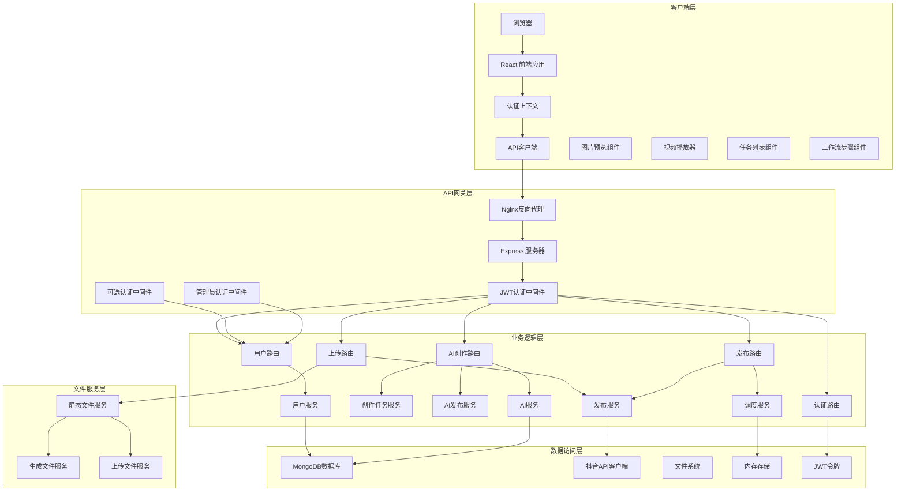

**图表来源**
- [web/server/src/index.ts:1-42](file://web/server/src/index.ts#L1-L42)
- [web/server/src/middleware/auth.ts:1-93](file://web/server/src/middleware/auth.ts#L1-L93)
- [web/server/src/routes/user.ts:1-212](file://web/server/src/routes/user.ts#L1-L212)
- [web/server/src/routes/ai.ts:1-323](file://web/server/src/routes/ai.ts#L1-L323)
- [deploy/nginx.conf:1-71](file://deploy/nginx.conf#L1-L71)

## 详细组件分析

### 核心发布系统

ClawPublisher 是系统的核心类，提供了统一的对外接口：

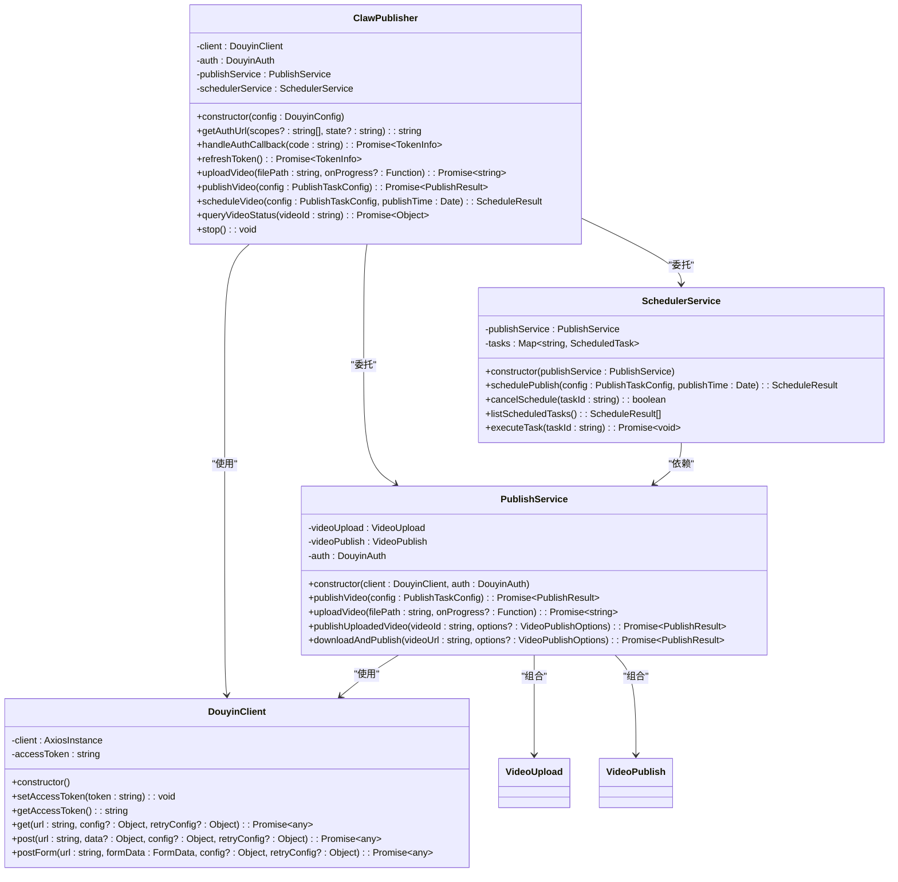

**图表来源**
- [src/index.ts:29-244](file://src/index.ts#L29-L244)
- [src/api/douyin-client.ts:13-237](file://src/api/douyin-client.ts#L13-L237)
- [src/services/publish-service.ts:22-228](file://src/services/publish-service.ts#L22-L228)
- [src/services/scheduler-service.ts:23-202](file://src/services/scheduler-service.ts#L23-L202)

**章节来源**
- [src/index.ts:29-244](file://src/index.ts#L29-L244)
- [src/api/douyin-client.ts:13-237](file://src/api/douyin-client.ts#L13-L237)
- [src/services/publish-service.ts:22-228](file://src/services/publish-service.ts#L22-L228)
- [src/services/scheduler-service.ts:23-202](file://src/services/scheduler-service.ts#L23-L202)

### 认证系统

系统实现了完整的 JWT 认证流程：

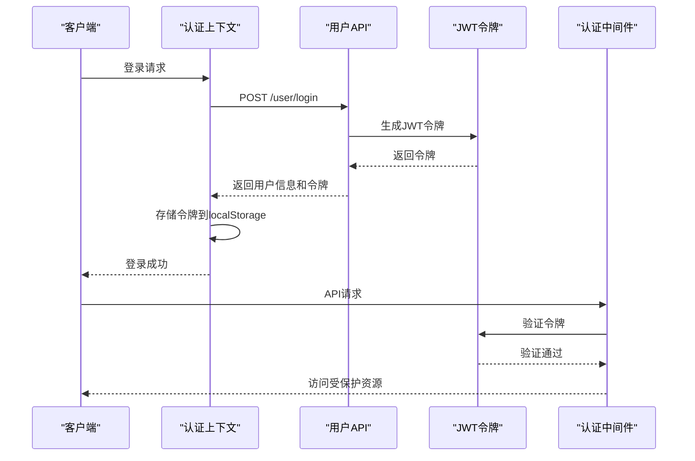

**图表来源**
- [web/client/src/contexts/AuthContext.tsx:74-109](file://web/client/src/contexts/AuthContext.tsx#L74-L109)
- [web/client/src/api/client.ts:208-213](file://web/client/src/api/client.ts#L208-L213)
- [web/server/src/middleware/auth.ts:18-54](file://web/server/src/middleware/auth.ts#L18-L54)

**章节来源**
- [web/client/src/contexts/AuthContext.tsx:74-109](file://web/client/src/contexts/AuthContext.tsx#L74-L109)
- [web/client/src/api/client.ts:208-213](file://web/client/src/api/client.ts#L208-L213)
- [web/server/src/middleware/auth.ts:18-54](file://web/server/src/middleware/auth.ts#L18-L54)

### 发布流程

视频发布流程包含上传、验证、发布等步骤：

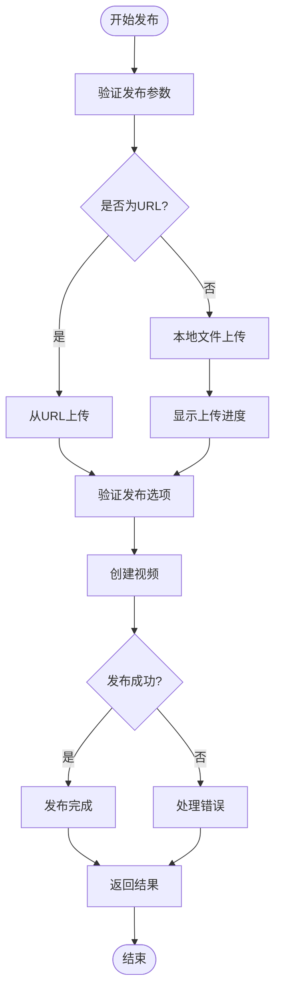

**图表来源**
- [src/services/publish-service.ts:38-80](file://src/services/publish-service.ts#L38-L80)
- [src/services/publish-service.ts:101-125](file://src/services/publish-service.ts#L101-L125)

**章节来源**
- [src/services/publish-service.ts:38-80](file://src/services/publish-service.ts#L38-L80)
- [src/services/publish-service.ts:101-125](file://src/services/publish-service.ts#L101-L125)

### 定时发布系统

系统使用 node-cron 实现定时发布功能：

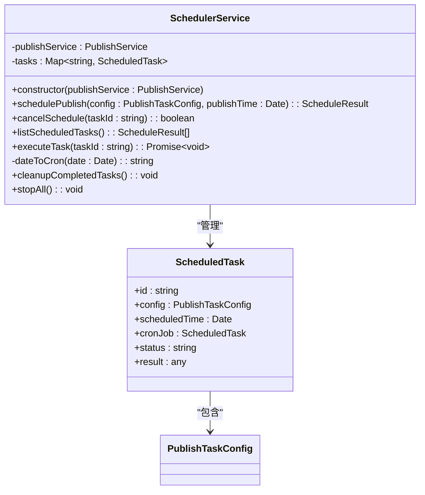

**图表来源**
- [src/services/scheduler-service.ts:23-202](file://src/services/scheduler-service.ts#L23-L202)

**章节来源**
- [src/services/scheduler-service.ts:23-202](file://src/services/scheduler-service.ts#L23-L202)

### 前端界面系统

React 前端应用提供了直观的用户界面：

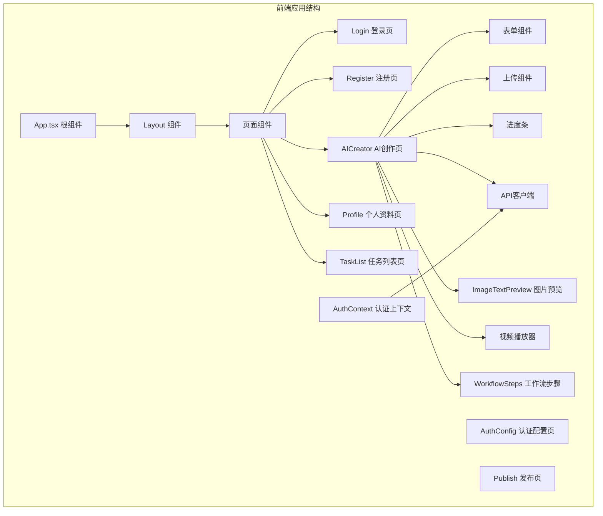

**图表来源**
- [web/client/src/App.tsx:12-35](file://web/client/src/App.tsx#L12-L35)
- [web/client/src/pages/Login.tsx:26-45](file://web/client/src/pages/Login.tsx#L26-L45)
- [web/client/src/pages/Register.tsx:27-48](file://web/client/src/pages/Register.tsx#L27-L48)
- [web/client/src/pages/AICreator.tsx:72-202](file://web/client/src/pages/AICreator.tsx#L72-L202)
- [web/client/src/pages/Profile.tsx:33-101](file://web/client/src/pages/Profile.tsx#L33-L101)
- [web/client/src/pages/TaskList.tsx:32-66](file://web/client/src/pages/TaskList.tsx#L32-L66)
- [web/client/src/components/publish/ImageTextPreview.tsx:1-259](file://web/client/src/components/publish/ImageTextPreview.tsx#L1-L259)

**章节来源**
- [web/client/src/App.tsx:12-35](file://web/client/src/App.tsx#L12-L35)
- [web/client/src/pages/Login.tsx:26-45](file://web/client/src/pages/Login.tsx#L26-L45)
- [web/client/src/pages/Register.tsx:27-48](file://web/client/src/pages/Register.tsx#L27-L48)
- [web/client/src/pages/AICreator.tsx:72-202](file://web/client/src/pages/AICreator.tsx#L72-L202)
- [web/client/src/pages/Profile.tsx:33-101](file://web/client/src/pages/Profile.tsx#L33-L101)
- [web/client/src/pages/TaskList.tsx:32-66](file://web/client/src/pages/TaskList.tsx#L32-L66)
- [web/client/src/components/publish/ImageTextPreview.tsx:1-259](file://web/client/src/components/publish/ImageTextPreview.tsx#L1-L259)

## JWT认证系统

### 认证流程

系统采用JWT（JSON Web Token）进行用户认证，提供更安全和灵活的认证机制：

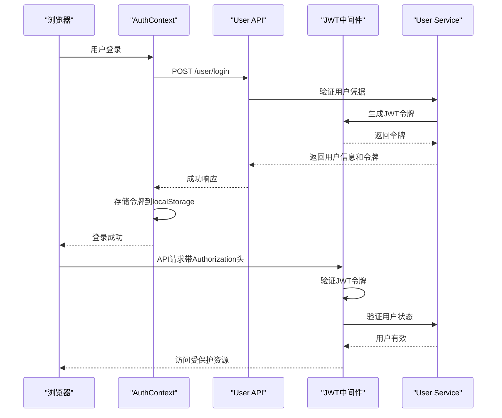

**图表来源**
- [web/client/src/contexts/AuthContext.tsx:74-109](file://web/client/src/contexts/AuthContext.tsx#L74-L109)
- [web/server/src/middleware/auth.ts:18-54](file://web/server/src/middleware/auth.ts#L18-L54)
- [web/server/src/utils/auth.ts:21-33](file://web/server/src/utils/auth.ts#L21-L33)

### 认证中间件

系统实现了多层认证中间件：

- **authMiddleware**: 必需登录的认证中间件
- **optionalAuthMiddleware**: 可选认证中间件，允许未登录用户访问
- **adminMiddleware**: 管理员认证中间件，需要管理员权限

**章节来源**
- [web/server/src/middleware/auth.ts:18-54](file://web/server/src/middleware/auth.ts#L18-L54)
- [web/server/src/middleware/auth.ts:59-75](file://web/server/src/middleware/auth.ts#L59-L75)
- [web/server/src/middleware/auth.ts:80-92](file://web/server/src/middleware/auth.ts#L80-L92)

## AI内容生成功能

### AI创作流程

系统集成了AI内容生成功能，提供从需求分析到内容生成的完整流程：

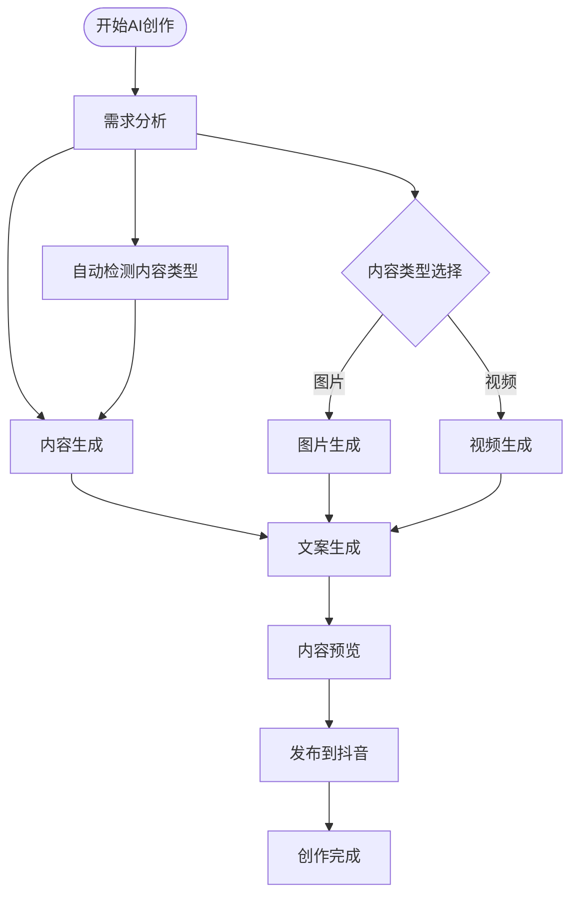

**图表来源**
- [web/client/src/pages/AICreator.tsx:81-202](file://web/client/src/pages/AICreator.tsx#L81-L202)
- [web/server/src/routes/ai.ts:63-93](file://web/server/src/routes/ai.ts#L63-L93)
- [web/server/src/routes/ai.ts:98-123](file://web/server/src/routes/ai.ts#L98-L123)
- [web/server/src/routes/ai.ts:128-153](file://web/server/src/routes/ai.ts#L128-L153)

### AI服务架构

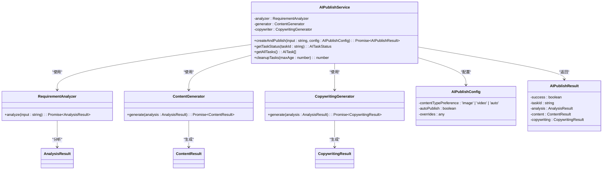

**图表来源**
- [web/server/src/routes/ai.ts:23-58](file://web/server/src/routes/ai.ts#L23-L58)
- [web/server/src/routes/ai.ts:158-191](file://web/server/src/routes/ai.ts#L158-L191)

**章节来源**
- [web/client/src/pages/AICreator.tsx:81-202](file://web/client/src/pages/AICreator.tsx#L81-L202)
- [web/server/src/routes/ai.ts:23-58](file://web/server/src/routes/ai.ts#L23-L58)
- [web/server/src/routes/ai.ts:158-191](file://web/server/src/routes/ai.ts#L158-L191)

## 用户管理系统

### 用户认证流程

系统提供了完整的用户认证和管理功能：

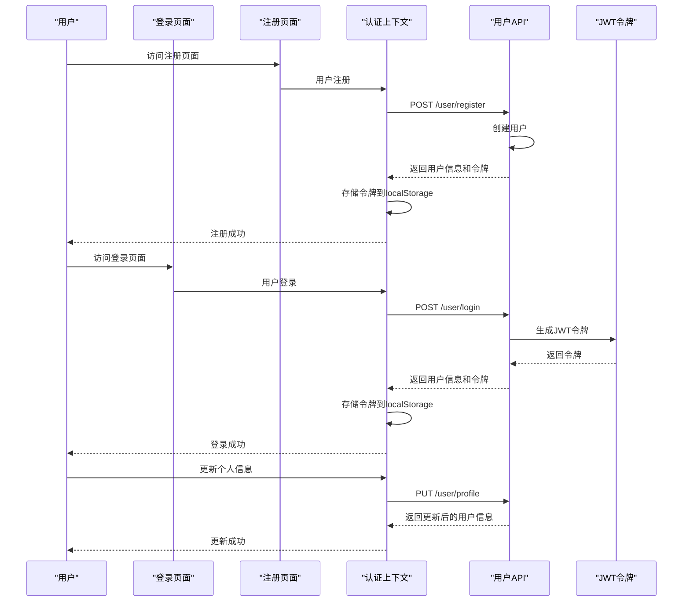

**图表来源**
- [web/client/src/pages/Login.tsx:31-45](file://web/client/src/pages/Login.tsx#L31-L45)
- [web/client/src/pages/Register.tsx:32-48](file://web/client/src/pages/Register.tsx#L32-L48)
- [web/client/src/contexts/AuthContext.tsx:87-97](file://web/client/src/contexts/AuthContext.tsx#L87-L97)
- [web/client/src/contexts/AuthContext.tsx:112-115](file://web/client/src/contexts/AuthContext.tsx#L112-L115)

### 用户权限管理

系统支持基本的用户权限管理：

- **普通用户**: 可以使用所有功能
- **管理员用户**: 可以访问管理员专用功能
- **用户状态**: 支持启用/禁用用户账户

**章节来源**
- [web/server/src/middleware/auth.ts:80-92](file://web/server/src/middleware/auth.ts#L80-L92)
- [web/server/src/routes/user.ts:62-85](file://web/server/src/routes/user.ts#L62-L85)

## 任务管理系统

### 任务管理流程

系统提供了完整的任务管理功能，支持定时发布任务和AI创作任务的统一管理：

```mermaid
flowchart TD
Start([打开任务管理]) --> Load[加载任务列表]
Load --> Merge[合并AI任务和定时任务]
Merge --> Display[显示统一任务表格]
Display --> Filter[筛选任务状态]
Filter --> Stats[显示统计信息]
Stats --> RealTime[实时刷新机制]
RealTime --> ActiveAITasks{有进行中的AI任务?}
ActiveAITasks --> |是| FastRefresh[3秒刷新]
ActiveAITasks --> |否| SlowRefresh[30秒刷新]
FastRefresh --> Load
SlowRefresh --> Load
Stats --> Pending[待执行: {count}]
Stats --> Completed[已完成: {count}]
Stats --> Failed[失败: {count}]
Stats --> Cancelled[已取消: {count}]
Stats --> AIStats[AI任务统计]
Stats --> PublishStats[定时发布统计]
```

**图表来源**
- [web/client/src/pages/TaskList.tsx:145-177](file://web/client/src/pages/TaskList.tsx#L145-L177)
- [web/client/src/pages/TaskList.tsx:310-320](file://web/client/src/pages/TaskList.tsx#L310-L320)
- [web/client/src/pages/TaskList.tsx:299-308](file://web/client/src/pages/TaskList.tsx#L299-L308)

### 统一任务显示系统

TaskList页面实现了AI任务和定时任务的统一显示系统：

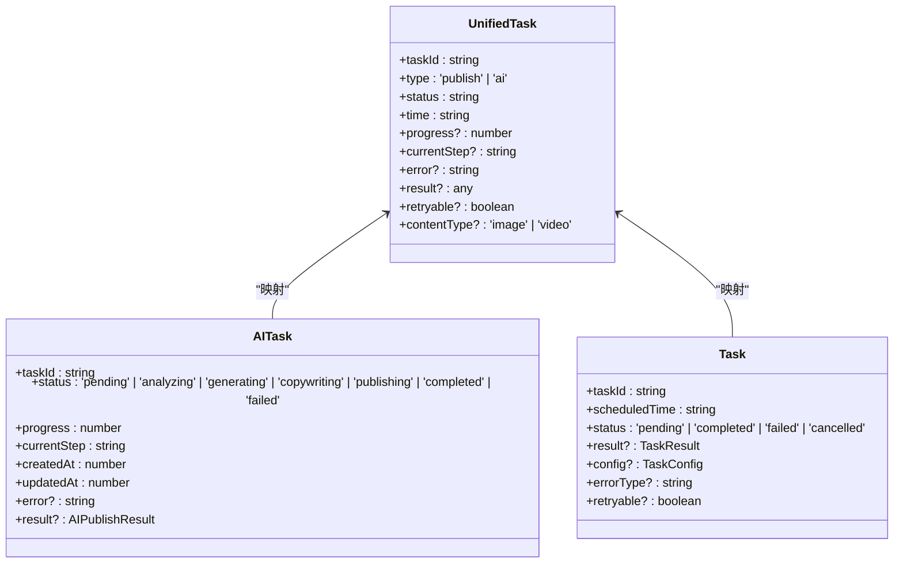

**图表来源**
- [web/client/src/pages/TaskList.tsx:95-107](file://web/client/src/pages/TaskList.tsx#L95-L107)
- [web/client/src/pages/TaskList.tsx:72-93](file://web/client/src/pages/TaskList.tsx#L72-L93)
- [web/client/src/pages/TaskList.tsx:58-70](file://web/client/src/pages/TaskList.tsx#L58-L70)

### 实时刷新机制

系统实现了智能的实时刷新机制，根据AI任务状态动态调整刷新频率：

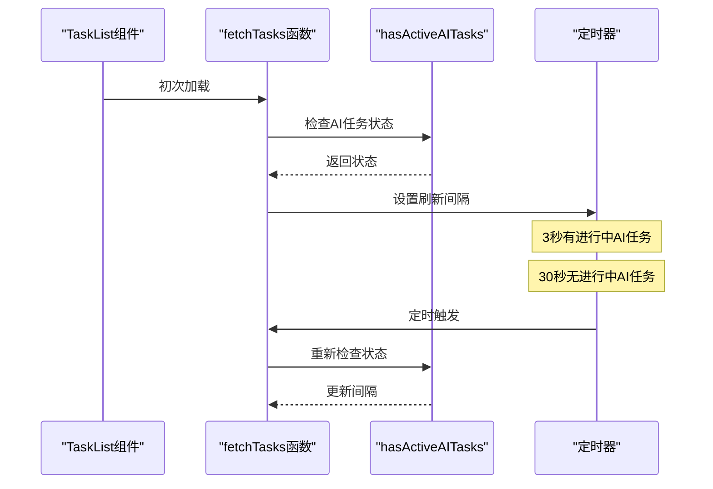

**图表来源**
- [web/client/src/pages/TaskList.tsx:162-177](file://web/client/src/pages/TaskList.tsx#L162-L177)
- [web/client/src/pages/TaskList.tsx:145-160](file://web/client/src/pages/TaskList.tsx#L145-L160)

### 任务状态跟踪

系统支持的任务状态包括：
- **定时发布任务状态**: pending, completed, failed, cancelled
- **AI创作任务状态**: pending, analyzing, generating, copywriting, publishing, completed, failed
- **统一状态映射**: pending包含所有进行中的状态

**章节来源**
- [web/client/src/pages/TaskList.tsx:68-98](file://web/client/src/pages/TaskList.tsx#L68-L98)
- [web/client/src/pages/TaskList.tsx:154-160](file://web/client/src/pages/TaskList.tsx#L154-L160)
- [web/client/src/pages/TaskList.tsx:300-308](file://web/client/src/pages/TaskList.tsx#L300-L308)

### AI任务可视化展示

AI任务在TaskList页面中提供了丰富的可视化展示：

- **进度条显示**: AI任务进行中显示进度百分比
- **当前步骤**: 显示AI任务的当前执行步骤
- **内容类型标签**: 区分图片和视频AI任务
- **预览链接**: AI任务完成后提供内容预览链接
- **详细信息**: 失败任务显示详细的错误信息和建议

**章节来源**
- [web/client/src/pages/TaskList.tsx:356-372](file://web/client/src/pages/TaskList.tsx#L356-L372)
- [web/client/src/pages/TaskList.tsx:284-297](file://web/client/src/pages/TaskList.tsx#L284-L297)
- [web/client/src/pages/TaskList.tsx:380-401](file://web/client/src/pages/TaskList.tsx#L380-L401)

## 本地URL系统

### 系统架构

本地URL系统通过Express静态文件服务和Nginx代理配置实现，提供稳定的文件访问和预览功能：

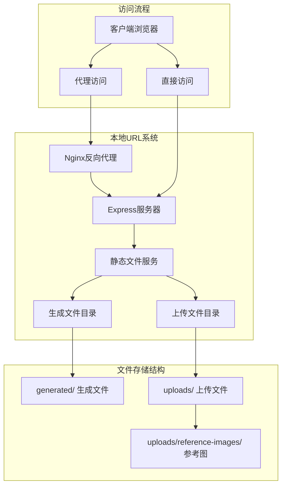

**图表来源**
- [web/server/src/index.ts:28-33](file://web/server/src/index.ts#L28-L33)
- [deploy/nginx.conf:41-56](file://deploy/nginx.conf#L41-L56)
- [src/api/ai/doubao-client.ts:172-183](file://src/api/ai/doubao-client.ts#L172-L183)

### Express静态文件服务

系统在Express服务器中配置了多个静态文件服务：

- **/generated/** 路径：服务AI生成的图片和视频文件
- **/uploads/** 路径：服务用户上传的文件和参考图
- 支持从项目根目录和服务器目录读取文件

**章节来源**
- [web/server/src/index.ts:28-33](file://web/server/src/index.ts#L28-L33)

### Nginx代理配置

Nginx配置支持对静态文件的高效代理和缓存：

- **/generated/** 路径：代理到本地生成文件目录
- **/uploads/** 路径：代理到本地上传文件目录
- 支持静态资源缓存和Gzip压缩
- 提供健康检查端点

**章节来源**
- [deploy/nginx.conf:41-56](file://deploy/nginx.conf#L41-L56)
- [deploy/nginx.conf:58-62](file://deploy/nginx.conf#L58-L62)
- [deploy/nginx.conf:64-69](file://deploy/nginx.conf#L64-L69)

### AI生成内容预览

AI生成的内容使用本地URL进行预览，避免远程URL过期问题：

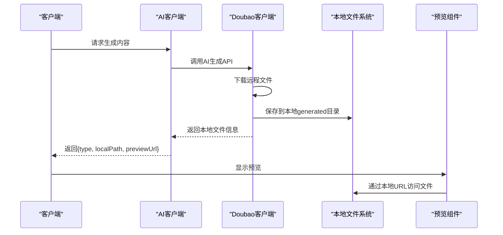

**图表来源**
- [src/api/ai/doubao-client.ts:172-183](file://src/api/ai/doubao-client.ts#L172-L183)
- [src/api/ai/doubao-client.ts:271-282](file://src/api/ai/doubao-client.ts#L271-L282)

### 文件访问流程

系统支持多种文件访问方式：

1. **直接访问**：通过本地URL直接访问生成的文件
2. **代理访问**：通过Nginx代理访问，支持缓存和负载均衡
3. **预览组件**：React组件自动处理文件URL渲染

**章节来源**
- [web/client/src/pages/AICreator.tsx:477-496](file://web/client/src/pages/AICreator.tsx#L477-L496)
- [web/client/src/components/publish/ImageTextPreview.tsx:101-109](file://web/client/src/components/publish/ImageTextPreview.tsx#L101-L109)

## 依赖关系分析

系统的主要依赖关系如下：

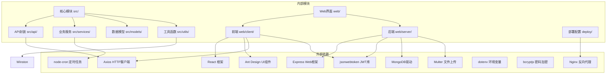

**图表来源**
- [package.json:18-33](file://package.json#L18-L33)
- [web/client/package.json:12-30](file://web/client/package.json#L12-L30)

**章节来源**
- [package.json:18-33](file://package.json#L18-L33)
- [web/client/package.json:12-30](file://web/client/package.json#L12-L30)

## 性能考虑

### 并发处理
- 使用 node-cron 实现高效的定时任务调度
- Axios 实现并发请求处理
- 内存中的任务状态管理
- JWT令牌的快速验证机制
- Nginx代理的高性能文件传输
- 智能实时刷新机制，减少不必要的API调用

### 缓存策略
- Token 信息缓存在localStorage中
- 上传进度实时反馈
- 临时文件自动清理机制
- 前端状态缓存优化
- Nginx静态资源缓存
- AI任务状态缓存和去重

### 错误处理
- 自动重试机制（指数退避）
- 限流错误处理
- 网络异常重试
- JWT令牌过期自动处理
- 文件访问错误处理
- 任务状态异常恢复

### 文件服务优化
- Express静态文件服务减少服务器负载
- Nginx代理提供更好的文件传输性能
- 本地URL避免远程文件过期问题
- 多级缓存策略提升访问速度
- 智能刷新频率调整优化性能

## 故障排除指南

### 常见问题及解决方案

1. **认证失败**
   - 检查JWT密钥配置
   - 验证令牌格式和有效期
   - 确认网络连接正常

2. **AI创作失败**
   - 检查AI服务配置
   - 验证内容分析结果
   - 查看API响应错误信息
   - 检查AI任务状态是否正确更新

3. **视频上传失败**
   - 检查文件格式和大小限制
   - 验证磁盘空间充足
   - 查看网络连接稳定性

4. **定时任务异常**
   - 检查系统时间设置
   - 验证cron表达式正确性
   - 确认任务状态管理

5. **文件访问失败**
   - 检查Express静态文件服务配置
   - 验证Nginx代理配置
   - 确认文件权限和路径正确
   - 查看文件是否存在且可访问

6. **预览URL失效**
   - 检查本地文件是否存在于generated目录
   - 验证Nginx静态文件服务是否正常
   - 确认文件URL格式正确

7. **任务列表不刷新**
   - 检查hasActiveAITasks状态判断
   - 验证定时器是否正确设置
   - 确认fetchTasks函数调用链路

8. **AI任务状态显示异常**
   - 检查AITaskStatus接口定义
   - 验证状态映射逻辑
   - 确认任务合并和排序逻辑

**章节来源**
- [web/server/src/utils/auth.ts:38-44](file://web/server/src/utils/auth.ts#L38-L44)
- [web/client/src/api/client.ts:65-77](file://web/client/src/api/client.ts#L65-L77)
- [src/api/douyin-client.ts:97-116](file://src/api/douyin-client.ts#L97-L116)
- [src/services/publish-service.ts:157-172](file://src/services/publish-service.ts#L157-L172)
- [web/server/src/index.ts:28-33](file://web/server/src/index.ts#L28-L33)
- [deploy/nginx.conf:41-56](file://deploy/nginx.conf#L41-L56)
- [web/client/src/pages/TaskList.tsx:162-177](file://web/client/src/pages/TaskList.tsx#L162-L177)

## 结论

ClawOperations 系统经过重大升级，现已发展为功能完整、架构清晰的现代化抖音营销自动化平台。通过模块化的代码设计、JWT认证系统、本地URL系统和前后端分离的架构，系统实现了以下优势：

1. **现代化认证**: 基于JWT的认证系统，比OAuth更加灵活和安全
2. **AI智能创作**: 集成AI内容生成功能，大幅提升内容创作效率
3. **统一任务管理**: TaskList页面提供AI任务和定时任务的统一管理界面
4. **智能实时刷新**: 根据AI任务状态动态调整刷新频率，优化用户体验
5. **丰富的可视化展示**: AI任务进度条、步骤状态、内容预览等功能完善
6. **完整的用户管理**: 提供注册、登录、个人资料管理等完整功能
7. **本地URL系统**: 新增静态文件服务和Nginx代理配置，提供稳定的内容预览体验
8. **高内聚低耦合**: 核心业务逻辑清晰分离
9. **易于扩展**: 插件化的服务架构支持功能扩展
10. **用户友好**: 直观的前端界面和完善的错误处理
11. **稳定可靠**: 完善的重试机制和异常处理
12. **高性能**: Nginx代理和静态文件服务提升系统性能，智能刷新机制优化资源使用

系统特别适合需要批量管理和自动化运营抖音营销账户的企业和个人用户，能够显著提升内容发布的效率和质量，同时通过AI技术和本地URL系统降低内容创作成本，提供更稳定可靠的用户体验。TaskList页面的AI任务管理功能增强进一步提升了系统的易用性和管理效率，为用户提供了更加完善的内容创作和发布管理解决方案。