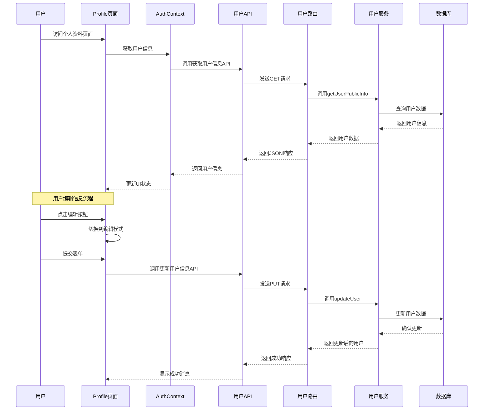
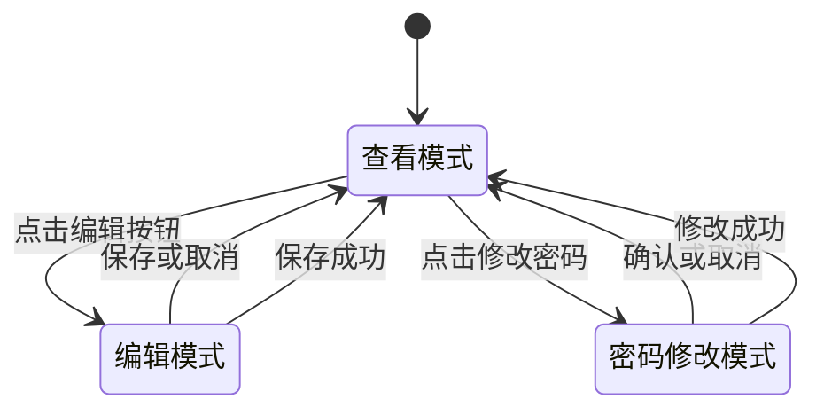
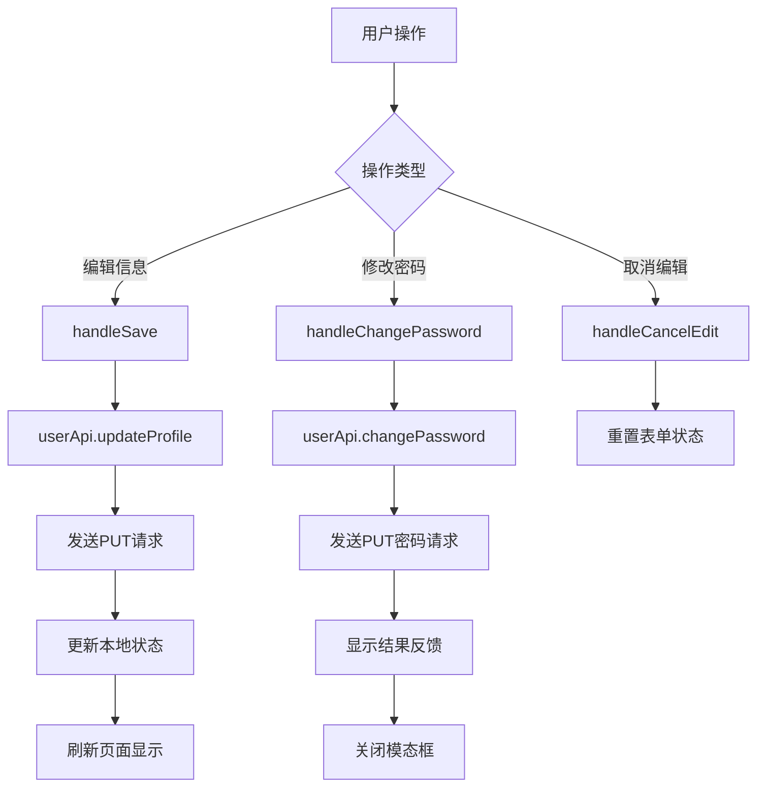
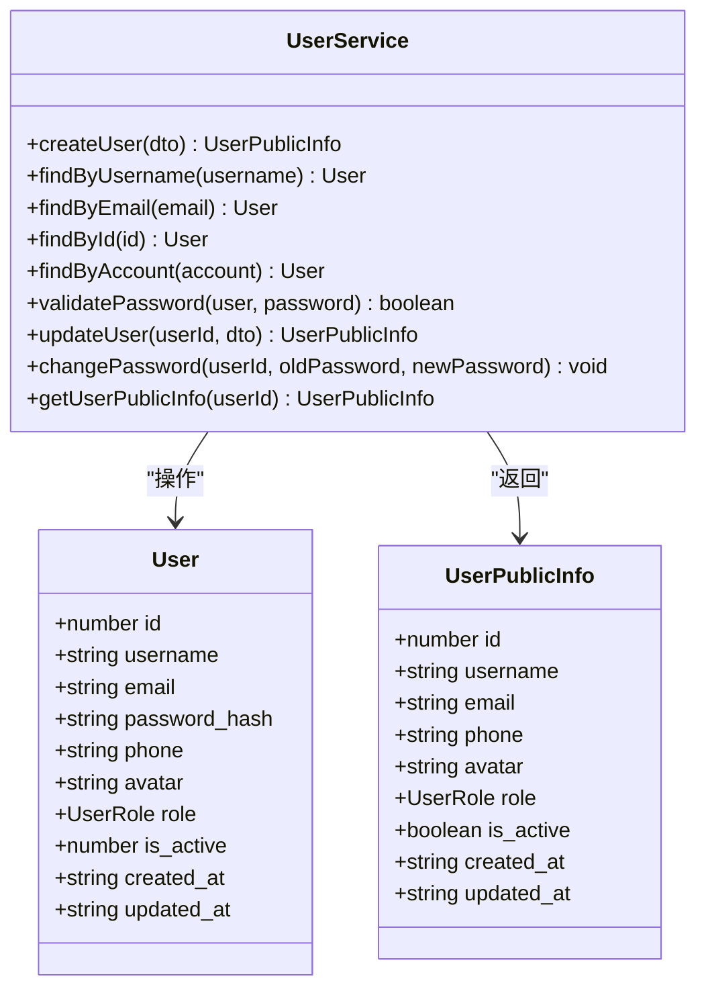
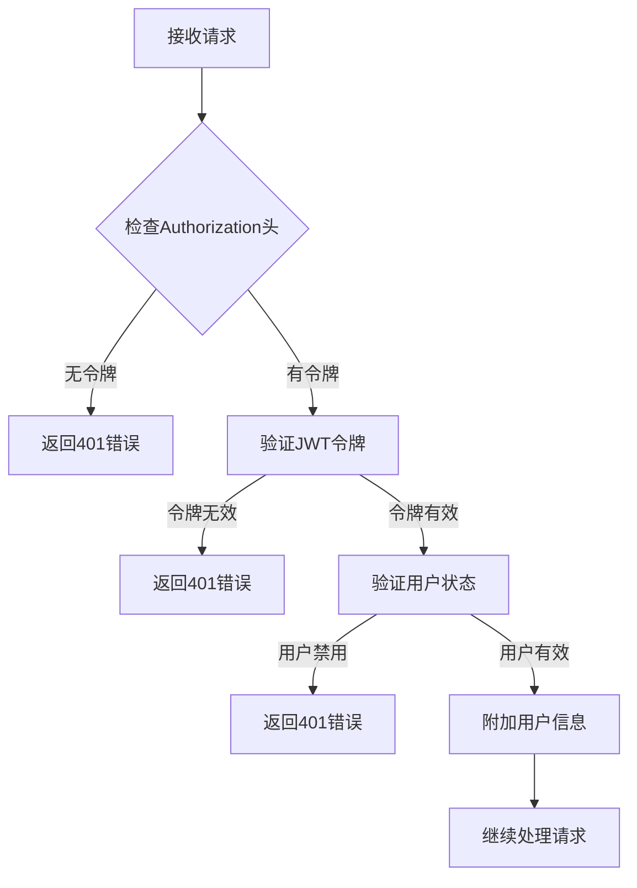
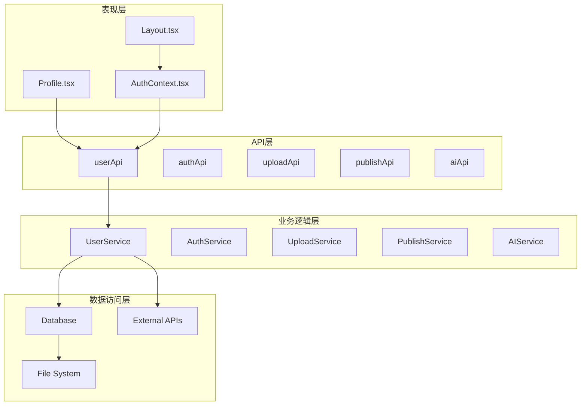

# 个人资料管理页面

<cite>
**本文档引用的文件**
- [Profile.tsx](file://web/client/src/pages/Profile.tsx)
- [user.ts](file://web/server/src/routes/user.ts)
- [user-service.ts](file://web/server/src/services/user-service.ts)
- [user.ts](file://web/server/src/models/user.ts)
- [client.ts](file://web/client/src/api/client.ts)
- [AuthContext.tsx](file://web/client/src/contexts/AuthContext.tsx)
- [auth.ts](file://web/server/src/middleware/auth.ts)
- [auth.ts](file://web/server/src/utils/auth.ts)
- [Layout.tsx](file://web/client/src/components/Layout.tsx)
- [index.ts](file://web/server/src/database/index.ts)
</cite>

## 目录
1. [简介](#简介)
2. [项目结构](#项目结构)
3. [核心组件](#核心组件)
4. [架构概览](#架构概览)
5. [详细组件分析](#详细组件分析)
6. [依赖关系分析](#依赖关系分析)
7. [性能考虑](#性能考虑)
8. [故障排除指南](#故障排除指南)
9. [结论](#结论)

## 简介

个人资料管理页面是抖音发布工具系统中的核心功能模块，为用户提供个人信息管理和安全设置的完整解决方案。该页面实现了用户信息的查看、编辑、密码修改等核心功能，采用前后端分离架构，使用React前端框架和Node.js后端服务。

系统支持多种用户角色（普通用户和管理员），提供完整的认证和授权机制，确保用户数据的安全性和完整性。页面设计采用Ant Design组件库，提供良好的用户体验和响应式布局。

## 项目结构

个人资料管理页面位于Web客户端的页面组件目录中，与服务器端的用户管理服务紧密协作。整体项目采用分层架构设计，前端负责用户界面展示，后端提供RESTful API服务。

```mermaid
graph TB
subgraph "前端客户端"
A[Profile 页面] --> B[AuthContext 上下文]
A --> C[用户API客户端]
B --> D[认证状态管理]
C --> E[Ant Design 组件]
end
subgraph "后端服务器"
F[用户路由] --> G[用户服务]
G --> H[数据库操作]
F --> I[认证中间件]
I --> J[JWT 验证]
end
A < --> F
B < --> D
C < --> I
```

**图表来源**
- [Profile.tsx:1-360](file://web/client/src/pages/Profile.tsx#L1-L360)
- [user.ts:1-212](file://web/server/src/routes/user.ts#L1-L212)

**章节来源**
- [Profile.tsx:1-360](file://web/client/src/pages/Profile.tsx#L1-L360)
- [user.ts:1-212](file://web/server/src/routes/user.ts#L1-L212)

## 核心组件

个人资料管理页面由多个核心组件构成，每个组件都有明确的职责和功能边界：

### 前端组件架构

1. **Profile 页面组件** - 主要的个人资料管理界面
2. **表单验证组件** - 处理用户输入验证和错误提示
3. **模态框组件** - 密码修改的独立对话框
4. **描述列表组件** - 展示用户基本信息的只读视图

### 后端服务架构

1. **用户路由层** - 处理HTTP请求和响应
2. **用户服务层** - 实现业务逻辑和数据处理
3. **数据库层** - 提供数据持久化服务
4. **认证中间件** - 确保API访问的安全性

**章节来源**
- [Profile.tsx:33-360](file://web/client/src/pages/Profile.tsx#L33-L360)
- [user-service.ts:16-240](file://web/server/src/services/user-service.ts#L16-L240)

## 架构概览

个人资料管理页面采用经典的MVC架构模式，前端使用React Hooks进行状态管理，后端使用Express.js构建RESTful API。



**图表来源**
- [Profile.tsx:59-79](file://web/client/src/pages/Profile.tsx#L59-L79)
- [user.ts:138-155](file://web/server/src/routes/user.ts#L138-L155)
- [user-service.ts:131-186](file://web/server/src/services/user-service.ts#L131-L186)

## 详细组件分析

### Profile 页面组件

Profile页面组件是个人资料管理的核心界面，实现了完整的CRUD操作功能。

#### 组件状态管理

组件使用React Hooks管理复杂的状态逻辑：



**图表来源**
- [Profile.tsx:37-50](file://web/client/src/pages/Profile.tsx#L37-L50)

#### 表单验证机制

系统实现了多层次的表单验证，确保数据的完整性和安全性：

1. **用户名验证**：3-20位字符，仅允许字母、数字和下划线
2. **邮箱验证**：标准邮箱格式验证
3. **手机号验证**：中国手机号格式验证
4. **密码验证**：至少8位，必须包含字母和数字

#### API集成

组件通过用户API客户端与后端服务进行通信：



**图表来源**
- [Profile.tsx:59-101](file://web/client/src/pages/Profile.tsx#L59-L101)
- [client.ts:219-230](file://web/client/src/api/client.ts#L219-L230)

**章节来源**
- [Profile.tsx:33-360](file://web/client/src/pages/Profile.tsx#L33-L360)

### 用户服务层

用户服务层是后端业务逻辑的核心，负责处理所有用户相关的操作。

#### 用户信息管理

用户服务提供了完整的用户信息管理功能：



**图表来源**
- [user-service.ts:16-240](file://web/server/src/services/user-service.ts#L16-L240)
- [user.ts:8-33](file://web/server/src/models/user.ts#L8-L33)

#### 密码安全管理

系统采用bcrypt加密算法确保密码安全：

1. **密码哈希**：使用盐值进行密码加密
2. **密码验证**：实时验证用户输入的密码
3. **密码强度**：强制要求至少8位，包含字母和数字

**章节来源**
- [user-service.ts:16-240](file://web/server/src/services/user-service.ts#L16-L240)
- [user.ts:1-104](file://web/server/src/models/user.ts#L1-L104)

### 认证中间件

认证中间件确保只有经过身份验证的用户才能访问受保护的资源。

#### JWT令牌验证

系统使用JSON Web Token进行用户身份验证：



**图表来源**
- [auth.ts:18-54](file://web/server/src/middleware/auth.ts#L18-L54)

#### 用户状态管理

认证中间件还负责管理用户的状态信息：

1. **用户信息注入**：将用户信息附加到请求对象
2. **权限检查**：验证用户的访问权限
3. **会话管理**：处理用户的登录状态

**章节来源**
- [auth.ts:1-93](file://web/server/src/middleware/auth.ts#L1-L93)
- [auth.ts:1-91](file://web/server/src/utils/auth.ts#L1-L91)

## 依赖关系分析

个人资料管理页面涉及多个层次的依赖关系，形成了清晰的分层架构。



**图表来源**
- [Profile.tsx:28-29](file://web/client/src/pages/Profile.tsx#L28-L29)
- [client.ts:199-237](file://web/client/src/api/client.ts#L199-L237)
- [user-service.ts:1-10](file://web/server/src/services/user-service.ts#L1-L10)

### 前端依赖关系

前端组件之间的依赖关系相对简单，主要通过React组件树进行组织：

1. **Profile页面**依赖AuthContext获取用户状态
2. **AuthContext**提供全局认证状态管理
3. **Layout组件**作为应用的基础布局容器

### 后端依赖关系

后端服务之间的依赖关系更加复杂，体现了清晰的分层架构：

1. **路由层**依赖服务层处理业务逻辑
2. **服务层**依赖数据访问层进行数据操作
3. **中间件**为路由层提供认证和授权服务

**章节来源**
- [Profile.tsx:28-29](file://web/client/src/pages/Profile.tsx#L28-L29)
- [user.ts:1-6](file://web/server/src/routes/user.ts#L1-L6)

## 性能考虑

个人资料管理页面在设计时充分考虑了性能优化，采用了多种策略来提升用户体验。

### 前端性能优化

1. **状态管理优化**：使用React Hooks避免不必要的重新渲染
2. **懒加载策略**：按需加载组件和数据
3. **缓存机制**：利用localStorage缓存用户信息
4. **防抖处理**：对频繁的操作进行防抖处理

### 后端性能优化

1. **数据库索引**：为常用查询字段建立索引
2. **连接池管理**：合理管理数据库连接
3. **缓存策略**：使用内存缓存减少数据库查询
4. **异步处理**：对耗时操作采用异步处理

### 网络性能优化

1. **请求合并**：将多个小请求合并为批量请求
2. **压缩传输**：启用Gzip压缩减少传输数据量
3. **CDN加速**：静态资源使用CDN加速
4. **缓存控制**：合理设置HTTP缓存头

## 故障排除指南

个人资料管理页面可能遇到的各种问题及解决方案：

### 常见问题及解决方案

#### 1. 用户信息更新失败

**问题症状**：用户信息修改后无法保存，出现错误提示

**可能原因**：
- 数据库连接异常
- 用户权限不足
- 数据格式验证失败

**解决步骤**：
1. 检查数据库连接状态
2. 验证用户是否有足够的权限
3. 确认输入数据符合验证规则
4. 查看服务器日志获取详细错误信息

#### 2. 密码修改失败

**问题症状**：密码修改操作失败，提示原密码错误

**可能原因**：
- 原密码输入错误
- 新密码不符合安全要求
- 数据库更新失败

**解决步骤**：
1. 确认原密码输入正确
2. 检查新密码强度要求
3. 验证数据库连接状态
4. 查看bcrypt加密过程是否正常

#### 3. 认证状态异常

**问题症状**：用户登录后仍然显示未登录状态

**可能原因**：
- JWT令牌过期
- 本地存储损坏
- 服务器时间不同步

**解决步骤**：
1. 检查JWT令牌的有效期
2. 清除浏览器本地存储重新登录
3. 验证服务器时间设置
4. 检查网络连接稳定性

### 调试技巧

1. **浏览器开发者工具**：使用Network标签监控API请求
2. **服务器日志**：查看详细的错误日志信息
3. **数据库监控**：检查数据库操作的执行情况
4. **性能分析**：使用性能分析工具识别瓶颈

**章节来源**
- [Profile.tsx:74-78](file://web/client/src/pages/Profile.tsx#L74-L78)
- [user-service.ts:199-203](file://web/server/src/services/user-service.ts#L199-L203)

## 结论

个人资料管理页面是一个功能完整、架构清晰的用户管理模块。它成功地实现了用户信息管理、密码修改、认证授权等核心功能，为整个抖音发布工具系统提供了重要的基础设施。

### 主要优势

1. **用户体验优秀**：采用现代化的UI设计和交互方式
2. **安全性强**：实现了多层安全防护机制
3. **扩展性强**：模块化设计便于功能扩展
4. **维护性好**：清晰的代码结构和完善的注释

### 技术亮点

1. **前后端分离**：采用现代Web开发最佳实践
2. **状态管理**：合理的状态管理策略
3. **错误处理**：完善的错误处理和用户反馈机制
4. **性能优化**：多方面的性能优化策略

### 改进建议

1. **国际化支持**：增加多语言支持功能
2. **移动端适配**：优化移动端用户体验
3. **功能扩展**：支持更多用户属性管理
4. **监控完善**：增加更详细的性能监控

个人资料管理页面为整个系统的用户管理奠定了坚实的基础，其设计理念和实现方式值得其他类似项目参考和借鉴。