# 登录注册页面

<cite>
**本文档引用的文件**
- [web/client/src/pages/Login.tsx](file://web/client/src/pages/Login.tsx)
- [web/client/src/pages/Register.tsx](file://web/client/src/pages/Register.tsx)
- [web/client/src/contexts/AuthContext.tsx](file://web/client/src/contexts/AuthContext.tsx)
- [web/client/src/api/client.ts](file://web/client/src/api/client.ts)
- [web/client/src/App.tsx](file://web/client/src/App.tsx)
- [web/client/src/components/Layout.tsx](file://web/client/src/components/Layout.tsx)
- [web/client/src/pages/AuthConfig.tsx](file://web/client/src/pages/AuthConfig.tsx)
- [web/server/src/routes/auth.ts](file://web/server/src/routes/auth.ts)
- [web/server/src/services/user-auth-config-service.ts](file://web/server/src/services/user-auth-config-service.ts)
- [tests/unit/auth.test.ts](file://tests/unit/auth.test.ts)
</cite>

## 更新摘要
**变更内容**
- 登录页面已升级为专业的两栏布局设计，包含品牌展示区和登录区
- 注册页面保持独立存在，提供完整的用户注册功能
- 增强了视觉设计，使用渐变背景、毛玻璃效果和现代化UI元素
- 优化了用户体验，增加了产品特性展示和安全提示
- 保留了开发模式功能，支持跳过登录进行调试
- 集成了抖音 OAuth 登录功能，提供更便捷的认证方式

## 目录
1. [简介](#简介)
2. [项目结构](#项目结构)
3. [核心组件](#核心组件)
4. [架构概览](#架构概览)
5. [详细组件分析](#详细组件分析)
6. [依赖关系分析](#依赖关系分析)
7. [性能考虑](#性能考虑)
8. [故障排除指南](#故障排除指南)
9. [结论](#结论)

## 简介

ClawOperations 是一个基于 React 和 Node.js 的抖音视频发布工具。本文档专注于登录注册页面的设计与实现，包括前端界面组件、认证上下文、API 交互以及后端认证服务的完整流程。

该系统采用现代化的前端技术栈，使用 Ant Design 组件库构建用户界面，结合 JWT 令牌进行用户认证，实现了完整的用户认证、会话管理和状态持久化功能。系统现已升级为专业的两栏布局设计，集成了开发模式和抖音 OAuth 登录功能，提供了更加专业和用户体验友好的界面。

## 项目结构

项目采用前后端分离的架构设计，主要分为以下模块：

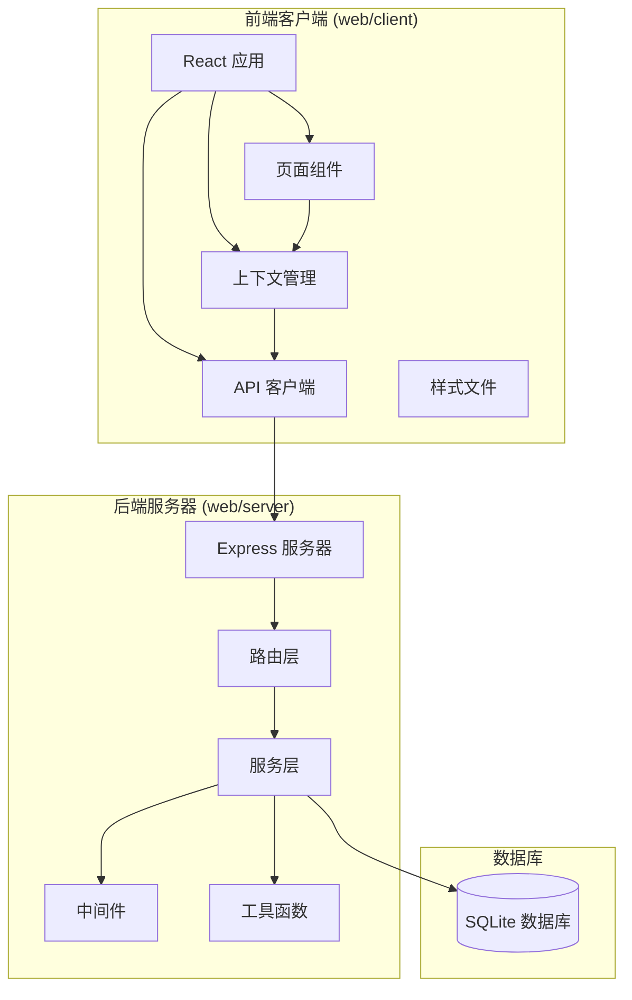

**图表来源**
- [web/client/src/App.tsx:18-70](file://web/client/src/App.tsx#L18-L70)
- [web/server/src/routes/auth.ts:1-373](file://web/server/src/routes/auth.ts#L1-L373)

**章节来源**
- [web/client/src/App.tsx:1-186](file://web/client/src/App.tsx#L1-L186)
- [web/server/src/routes/auth.ts:1-373](file://web/server/src/routes/auth.ts#L1-L373)

## 核心组件

### 登录页面组件

登录页面组件提供了专业的两栏布局设计，包含品牌展示区和登录区，提供直观的用户登录界面，包含抖音 OAuth 登录、开发模式跳过登录等功能。

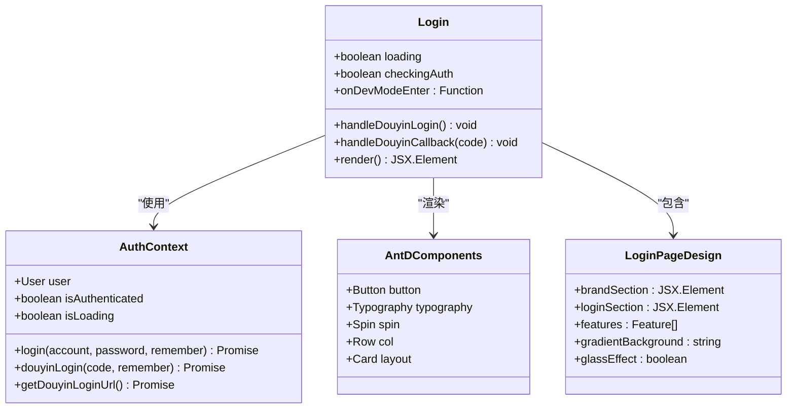

**图表来源**
- [web/client/src/pages/Login.tsx:44-102](file://web/client/src/pages/Login.tsx#L44-L102)
- [web/client/src/contexts/AuthContext.tsx:168-179](file://web/client/src/contexts/AuthContext.tsx#L168-L179)

### 注册页面组件

注册页面组件提供了完整的用户注册功能，包含表单验证、密码强度检查和用户信息收集。

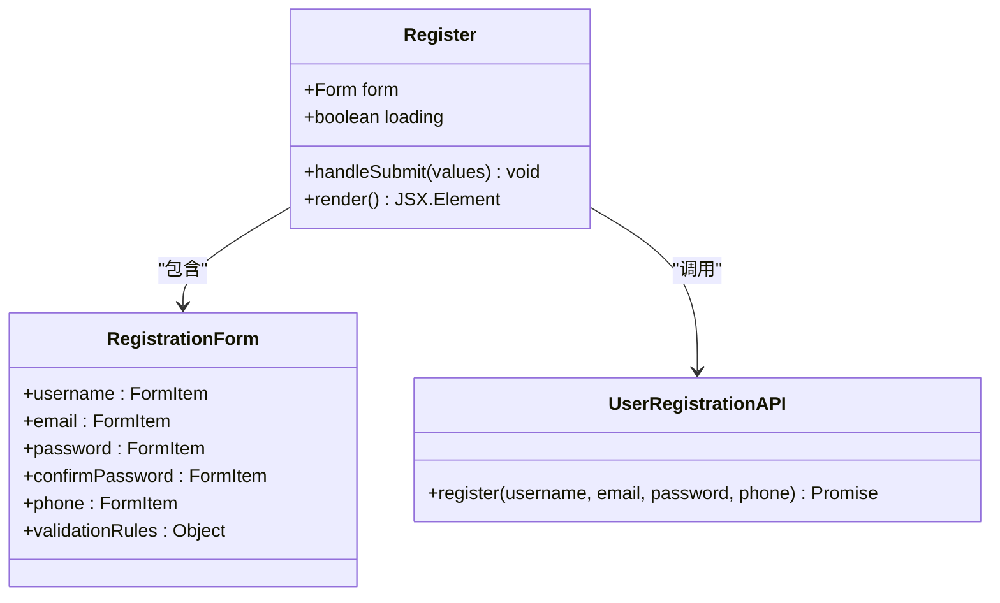

**图表来源**
- [web/client/src/pages/Register.tsx:27-48](file://web/client/src/pages/Register.tsx#L27-L48)
- [web/client/src/pages/Register.tsx:77-186](file://web/client/src/pages/Register.tsx#L77-L186)

### 认证上下文 (AuthContext)

认证上下文是整个认证系统的核心，负责管理用户状态、令牌存储和API调用，现已集成抖音 OAuth 登录功能。

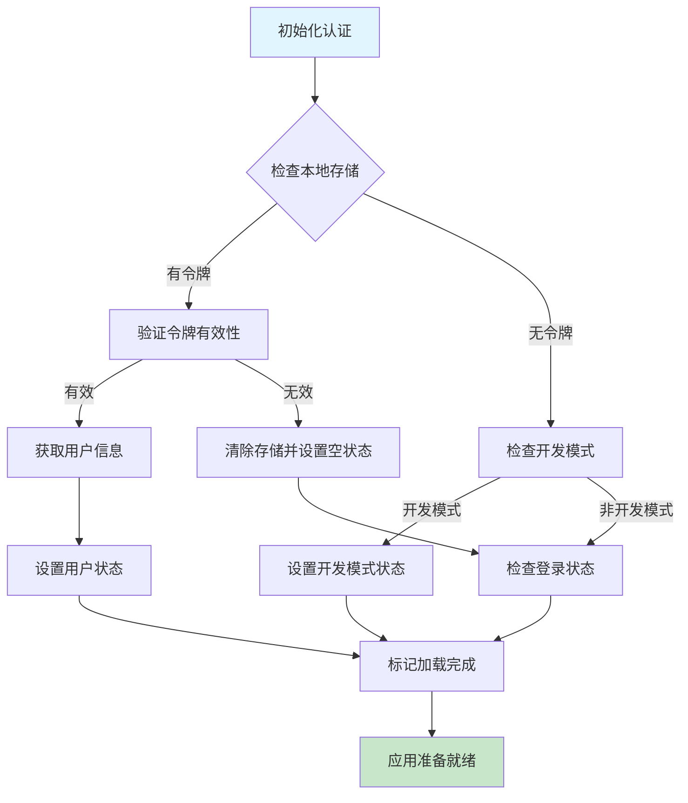

**图表来源**
- [web/client/src/contexts/AuthContext.tsx:38-77](file://web/client/src/contexts/AuthContext.tsx#L38-L77)
- [web/client/src/App.tsx:107-122](file://web/client/src/App.tsx#L107-L122)

认证上下文的主要职责包括：
- **状态管理**: 维护用户登录状态和加载状态
- **令牌存储**: 使用 localStorage 持久化认证信息
- **API 调用**: 封装用户认证相关的 API 请求
- **事件监听**: 处理 401 未授权事件
- **抖音 OAuth**: 支持抖音授权登录和令牌管理

**章节来源**
- [web/client/src/contexts/AuthContext.tsx:1-196](file://web/client/src/contexts/AuthContext.tsx#L1-L196)

### API 客户端 (client.ts)

API 客户端封装了所有 HTTP 请求，包括请求拦截器、响应拦截器和认证逻辑，现已集成抖音 OAuth 相关 API。

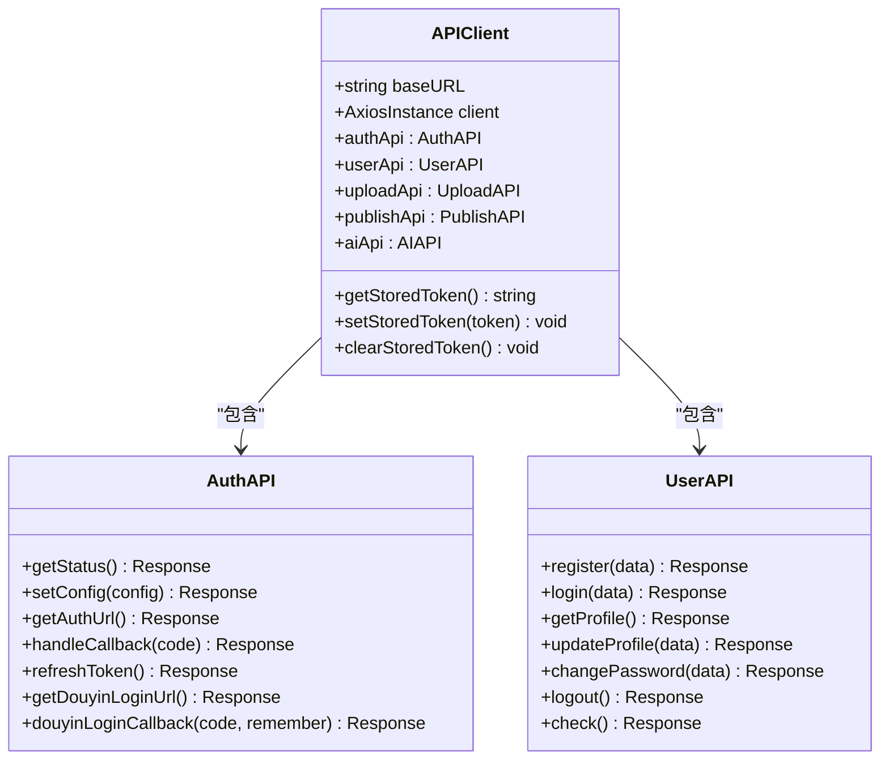

**图表来源**
- [web/client/src/api/client.ts:80-99](file://web/client/src/api/client.ts#L80-L99)
- [web/client/src/api/client.ts:284-324](file://web/client/src/api/client.ts#L284-L324)

API 客户端的关键特性：
- **请求拦截器**: 自动添加 Authorization 头部
- **响应拦截器**: 统一处理 401 未授权错误
- **令牌管理**: 提供完整的令牌存储和清除功能
- **模块化设计**: 将不同功能的 API 分组管理
- **抖音 OAuth**: 支持抖音授权登录相关 API

**章节来源**
- [web/client/src/api/client.ts:1-324](file://web/client/src/api/client.ts#L1-L324)

### 认证配置页面

认证配置页面用于管理抖音应用配置和 OAuth 授权流程。

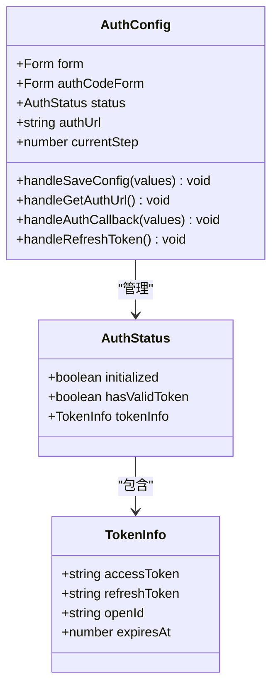

**图表来源**
- [web/client/src/pages/AuthConfig.tsx:45-135](file://web/client/src/pages/AuthConfig.tsx#L45-L135)
- [web/client/src/pages/AuthConfig.tsx:32-43](file://web/client/src/pages/AuthConfig.tsx#L32-L43)

**章节来源**
- [web/client/src/pages/AuthConfig.tsx:1-491](file://web/client/src/pages/AuthConfig.tsx#L1-L491)

## 架构概览

系统采用分层架构设计，从前端界面到后端服务形成完整的认证流程：

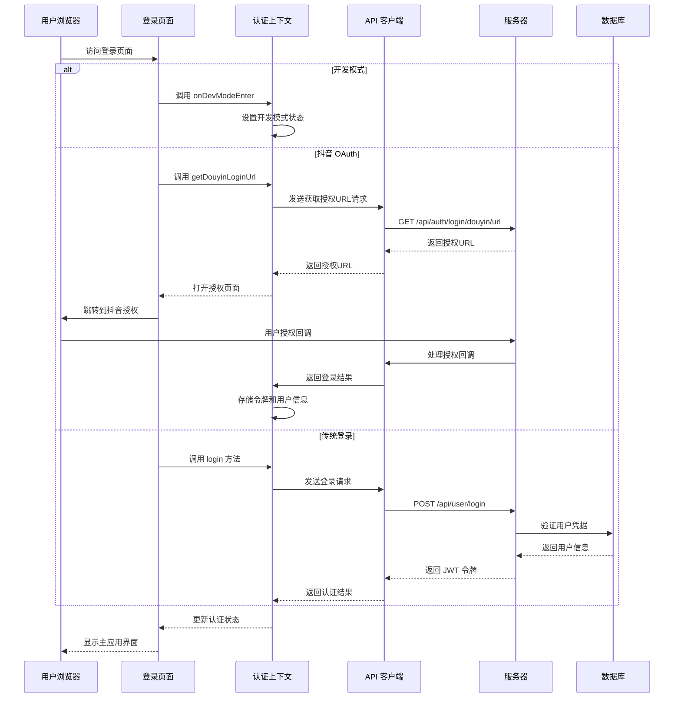

**图表来源**
- [web/client/src/pages/Login.tsx:86-102](file://web/client/src/pages/Login.tsx#L86-L102)
- [web/client/src/contexts/AuthContext.tsx:146-166](file://web/client/src/contexts/AuthContext.tsx#L146-L166)
- [web/server/src/routes/auth.ts:215-237](file://web/server/src/routes/auth.ts#L215-L237)

## 详细组件分析

### 专业登录页面设计

登录页面已升级为专业的两栏布局设计，左侧是品牌展示区，右侧是登录区，提供了现代化的用户体验：

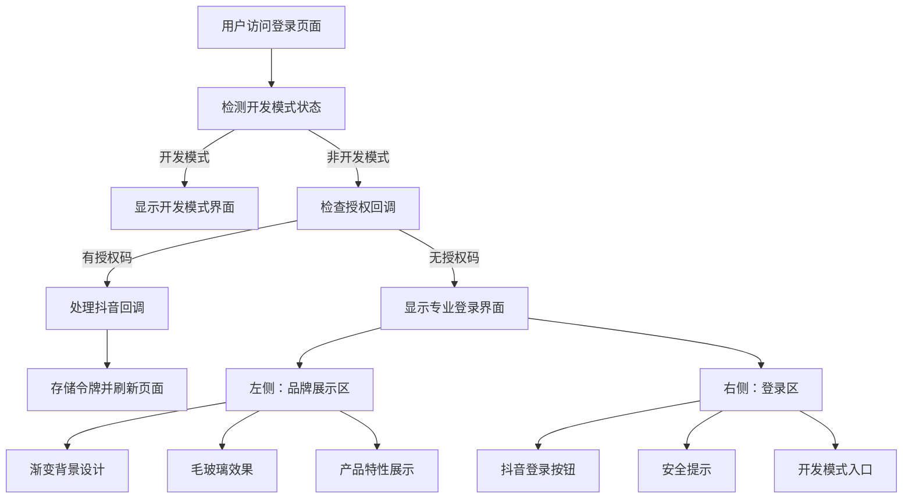

**图表来源**
- [web/client/src/pages/Login.tsx:121-327](file://web/client/src/pages/Login.tsx#L121-L327)
- [web/client/src/pages/Login.tsx:216-327](file://web/client/src/pages/Login.tsx#L216-L327)

专业设计的关键特性：
- **两栏布局**: 左侧品牌展示区，右侧登录区
- **渐变背景**: 使用蓝色渐变背景营造专业感
- **毛玻璃效果**: 使用 backdropFilter 实现毛玻璃效果
- **产品特性展示**: 展示 AI 智能创作、一键发布、定时发布、批量处理等功能
- **安全提示**: 强调使用抖音官方授权的安全性
- **响应式设计**: 适配不同屏幕尺寸

**章节来源**
- [web/client/src/pages/Login.tsx:121-327](file://web/client/src/pages/Login.tsx#L121-L327)

### 抖音 OAuth 登录流程

系统现已集成抖音 OAuth 登录功能，提供更便捷的认证方式：

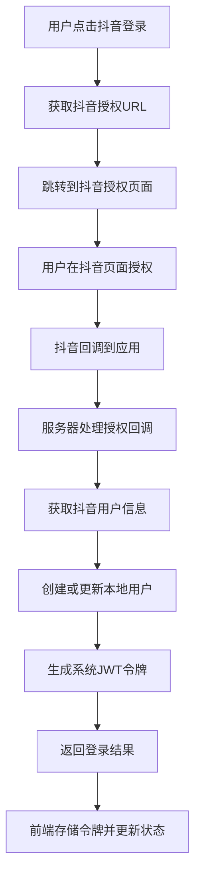

**图表来源**
- [web/client/src/pages/Login.tsx:86-102](file://web/client/src/pages/Login.tsx#L86-L102)
- [web/server/src/routes/auth.ts:243-370](file://web/server/src/routes/auth.ts#L243-L370)

抖音 OAuth 登录的关键特性：
- **授权流程**: 支持标准 OAuth 2.0 授权码流程
- **用户信息**: 自动获取抖音用户昵称和头像
- **令牌管理**: 自动管理 access_token 和 refresh_token
- **本地存储**: 将抖音用户信息与本地用户关联

**章节来源**
- [web/server/src/routes/auth.ts:215-370](file://web/server/src/routes/auth.ts#L215-L370)

### 开发模式功能

系统新增开发模式功能，允许用户跳过登录进行调试：

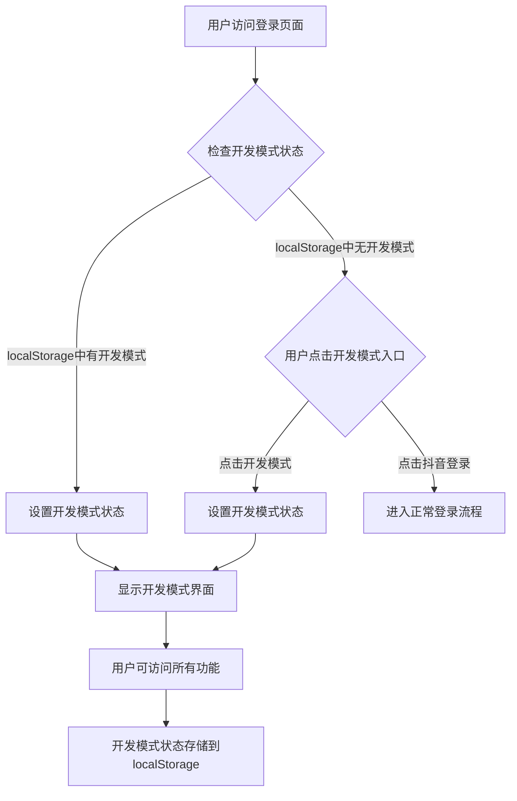

**图表来源**
- [web/client/src/App.tsx:107-122](file://web/client/src/App.tsx#L107-L122)
- [web/client/src/pages/Login.tsx:288-303](file://web/client/src/pages/Login.tsx#L288-L303)

开发模式的主要特性：
- **状态持久化**: 使用 localStorage 存储开发模式状态
- **功能限制**: 开发模式下部分功能受限
- **调试便利**: 便于开发者进行功能调试
- **安全隔离**: 与正式用户认证完全隔离

**章节来源**
- [web/client/src/App.tsx:105-122](file://web/client/src/App.tsx#L105-L122)

### 认证配置服务

后端认证配置服务管理用户的抖音认证配置：

```mermaid
flowchart TD
A[用户配置抖音应用] --> B[保存全局配置]
B --> C[保存用户特定配置]
C --> D{检查配置状态}
D --> |已配置| E[验证Token有效性]
D --> |未配置| F[提示配置应用]
E --> G{Token有效|H{Token过期}
G --> I[允许使用抖音API]
H --> J[刷新Token或重新授权]
F --> K[引导用户完成配置]
```

**图表来源**
- [web/server/src/services/user-auth-config-service.ts:12-163](file://web/server/src/services/user-auth-config-service.ts#L12-L163)

认证配置服务的验证规则：
- **配置完整性**: clientKey、clientSecret、redirectUri 必填
- **Token有效期**: 自动检查和管理 Token 过期时间
- **用户关联**: 将配置与具体用户 ID 关联
- **状态跟踪**: 跟踪配置初始化和 Token 有效性状态

**章节来源**
- [web/server/src/services/user-auth-config-service.ts:1-167](file://web/server/src/services/user-auth-config-service.ts#L1-L167)

### JWT 认证中间件

JWT 认证中间件确保只有经过身份验证的用户才能访问受保护的资源：

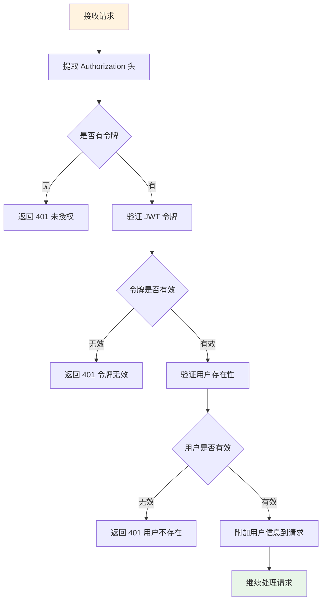

**图表来源**
- [web/server/src/middleware/auth.ts:18-54](file://web/server/src/middleware/auth.ts#L18-L54)

**章节来源**
- [web/server/src/middleware/auth.ts:1-93](file://web/server/src/middleware/auth.ts#L1-L93)

## 依赖关系分析

系统各组件之间的依赖关系如下：

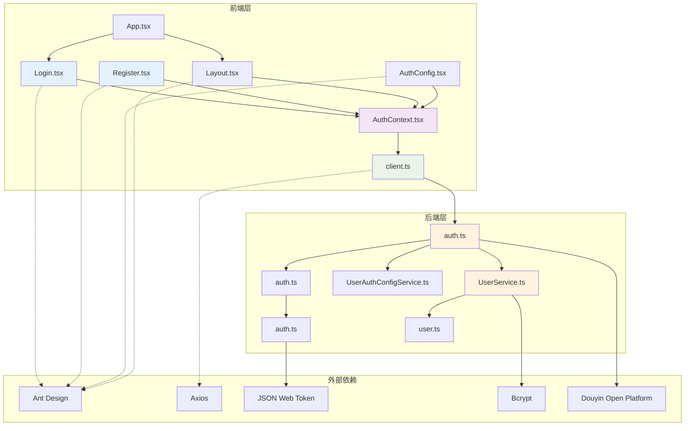

**图表来源**
- [web/client/src/pages/Login.tsx:1-331](file://web/client/src/pages/Login.tsx#L1-L331)
- [web/client/src/pages/Register.tsx:1-204](file://web/client/src/pages/Register.tsx#L1-L204)
- [web/client/src/contexts/AuthContext.tsx:1-196](file://web/client/src/contexts/AuthContext.tsx#L1-L196)
- [web/client/src/api/client.ts:1-324](file://web/client/src/api/client.ts#L1-L324)
- [web/server/src/routes/auth.ts:1-373](file://web/server/src/routes/auth.ts#L1-L373)
- [web/server/src/services/user-auth-config-service.ts:1-167](file://web/server/src/services/user-auth-config-service.ts#L1-L167)

**章节来源**
- [web/client/src/App.tsx:1-186](file://web/client/src/App.tsx#L1-L186)
- [web/client/src/components/Layout.tsx:1-302](file://web/client/src/components/Layout.tsx#L1-L302)

## 性能考虑

### 前端性能优化

1. **懒加载策略**: 登录页面仅在需要时加载
2. **状态缓存**: 使用 localStorage 缓存认证状态和开发模式状态
3. **请求去重**: 防止重复提交相同的登录请求
4. **组件优化**: 使用 React.memo 和 useCallback 优化渲染性能
5. **开发模式优化**: 开发模式下跳过完整的认证流程
6. **渐变背景优化**: 使用 CSS 渐变而非图片，减少 HTTP 请求
7. **毛玻璃效果**: 使用 backdropFilter，现代浏览器性能良好

### 后端性能优化

1. **数据库索引**: 用户名和邮箱字段建立唯一索引
2. **密码哈希**: 使用 bcrypt 进行安全的密码存储
3. **JWT 缓存**: 减少频繁的令牌验证开销
4. **连接池**: 合理管理数据库连接
5. **OAuth 缓存**: 缓存抖音 API 响应减少重复请求

## 故障排除指南

### 常见问题及解决方案

#### 抖音 OAuth 登录失败
**症状**: 用户点击抖音登录后无法完成授权
**可能原因**:
- 抖音应用配置不完整
- 授权回调地址配置错误
- 网络连接问题
- 抖音 API 临时不可用

**解决步骤**:
1. 检查抖音应用配置是否完整
2. 验证回调地址是否与抖音开放平台配置一致
3. 确认网络连接正常
4. 查看服务器日志获取详细错误信息

#### 开发模式无法进入
**症状**: 点击"跳过登录"按钮后仍显示登录页面
**可能原因**:
- localStorage 存储异常
- 浏览器隐私模式限制
- JavaScript 执行错误

**解决步骤**:
1. 检查浏览器控制台是否有错误
2. 验证 localStorage 是否可用
3. 尝试清除浏览器缓存后重试
4. 更换浏览器或禁用隐私模式

#### 认证状态异常
**症状**: 登录后状态显示异常或反复跳转
**可能原因**:
- 令牌过期或损坏
- 本地存储数据冲突
- 并发登录问题

**解决步骤**:
1. 清除浏览器本地存储
2. 检查系统时间和时区设置
3. 验证多个标签页的并发登录
4. 查看应用日志获取详细信息

#### 登录页面显示异常
**症状**: 登录页面布局错乱或样式不正确
**可能原因**:
- CSS 样式文件加载失败
- 浏览器兼容性问题
- 网络连接问题

**解决步骤**:
1. 检查浏览器开发者工具中的网络面板
2. 验证 CSS 文件是否正确加载
3. 清除浏览器缓存
4. 尝试使用不同的浏览器

**章节来源**
- [web/server/src/routes/auth.ts:215-370](file://web/server/src/routes/auth.ts#L215-L370)
- [web/client/src/App.tsx:107-122](file://web/client/src/App.tsx#L107-L122)

## 结论

ClawOperations 的登录注册页面经过重大专业化改进，实现了现代化的用户认证系统，具有以下特点：

**专业设计**: 采用专业的两栏布局设计，左侧品牌展示区，右侧登录区，提供了现代化的用户体验
**增强功能**: 保留了完整的注册功能，同时集成了开发模式和抖音 OAuth 登录功能
**用户体验**: 优化了界面设计，增加了产品特性展示和安全提示，提升了用户信任度
**开发友好**: 集成开发模式功能，支持跳过登录进行调试，提高开发效率
**安全可靠**: 支持抖音 OAuth 登录，提供企业级的安全认证体验
**性能优化**: 优化的前端性能和后端架构，确保流畅的用户体验

该系统为抖音视频发布工具提供了专业和用户友好的认证界面，用户可以通过简化的登录流程快速开始使用各项功能。通过合理的架构设计和最佳实践的应用，确保了系统的安全性、性能和可维护性。开发模式的集成使得开发者能够更高效地进行功能调试和测试，而抖音 OAuth 登录的引入则为用户提供了更便捷的认证方式。专业的界面设计和增强的功能使得整个系统更加完善和用户友好。