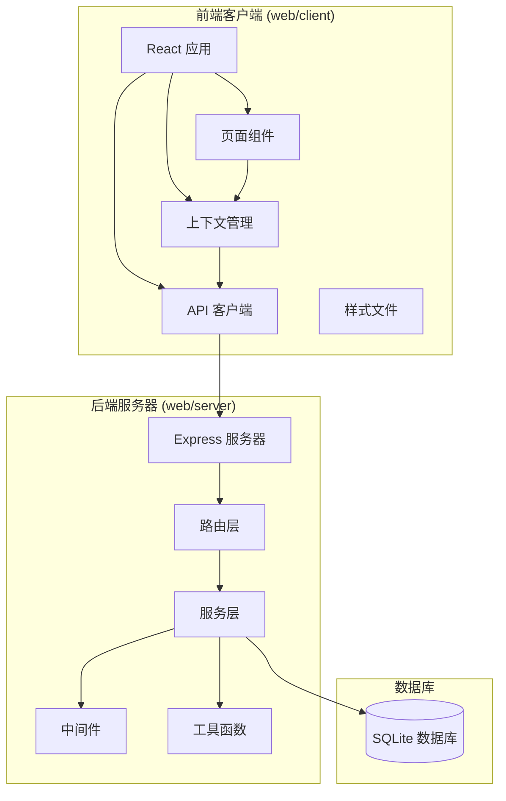
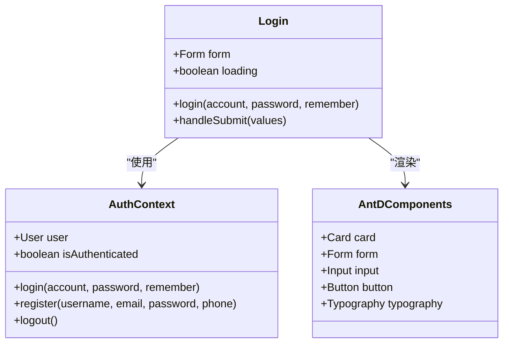
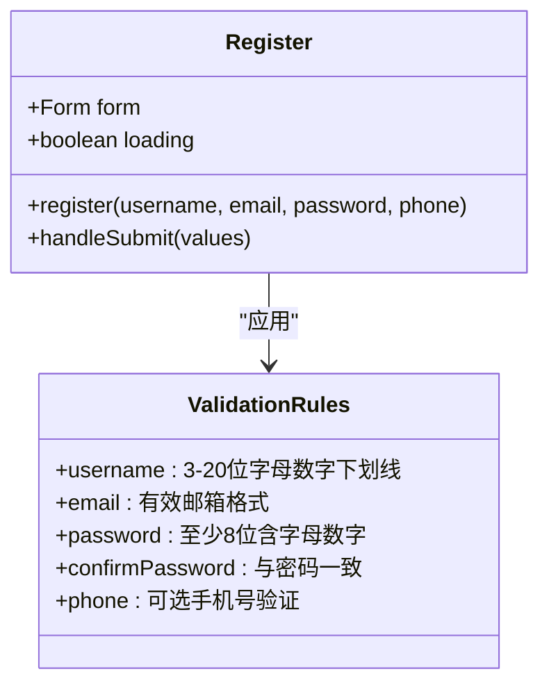
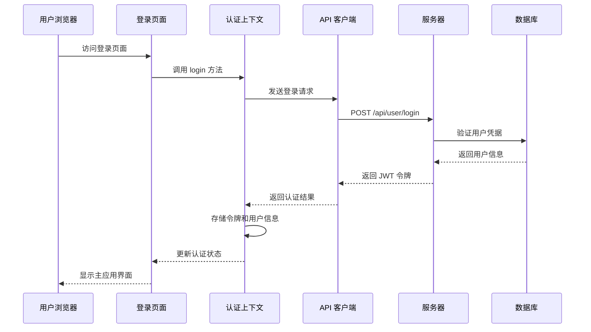
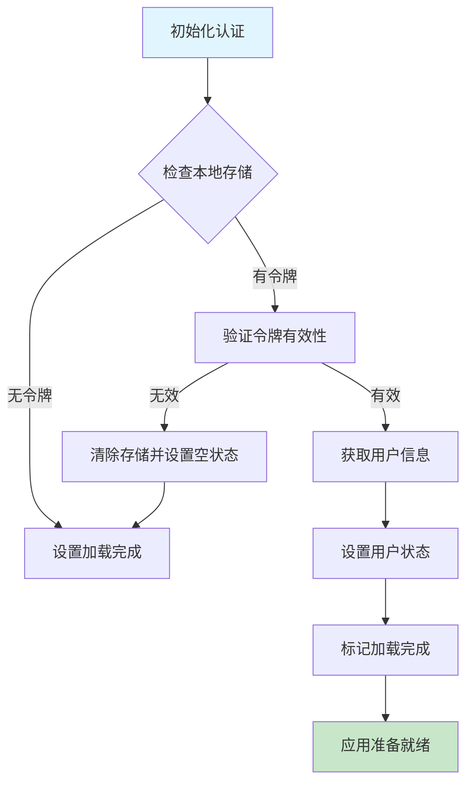
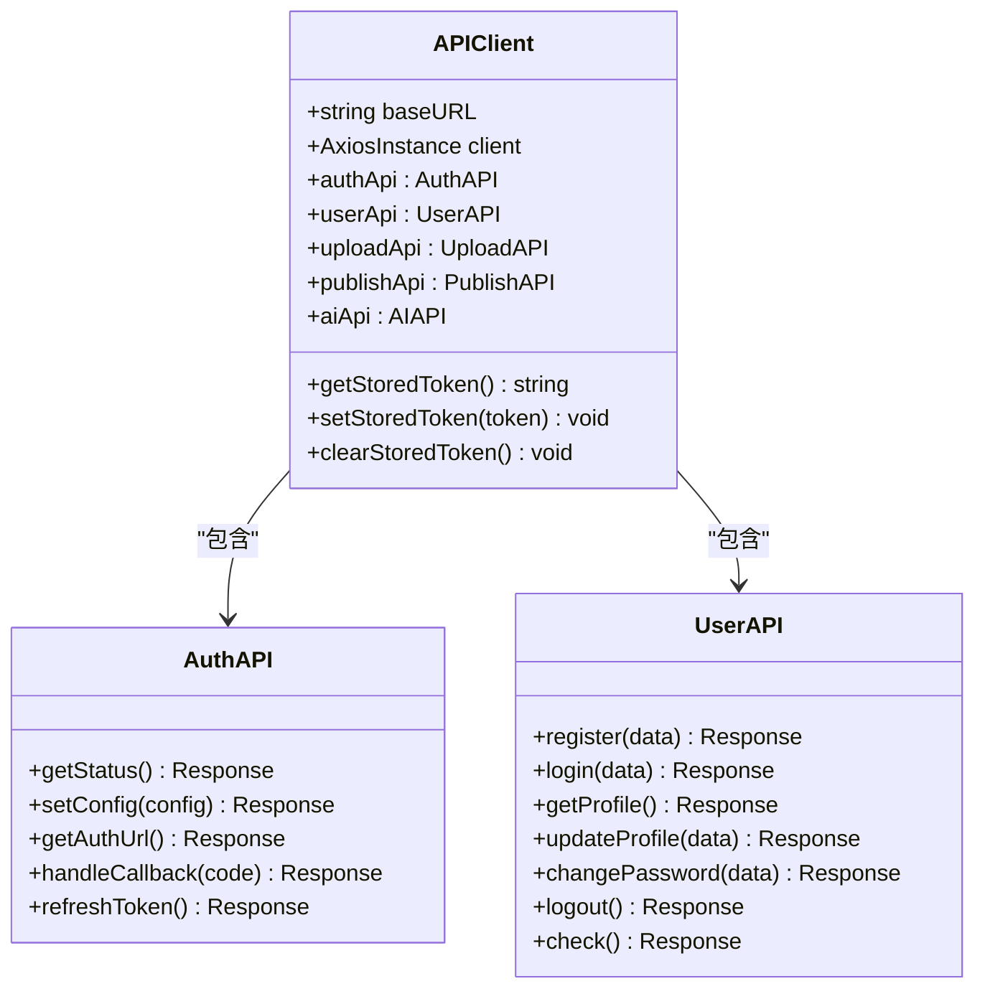
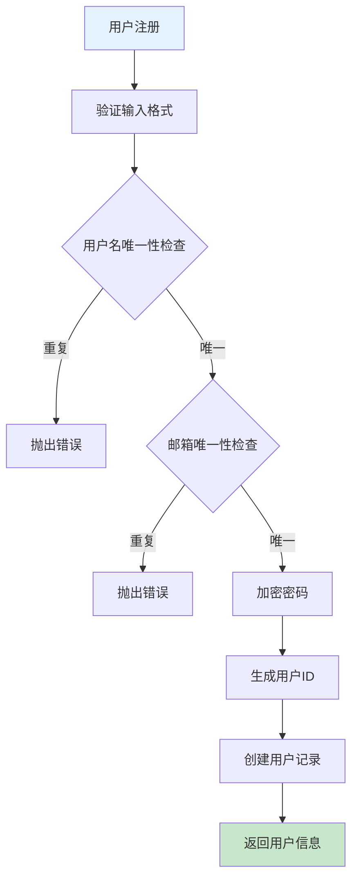
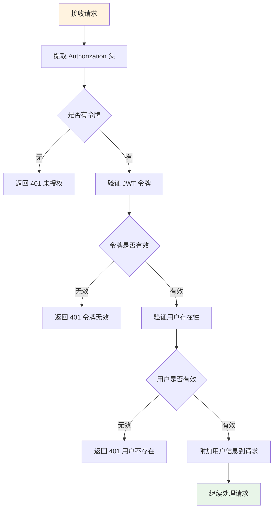
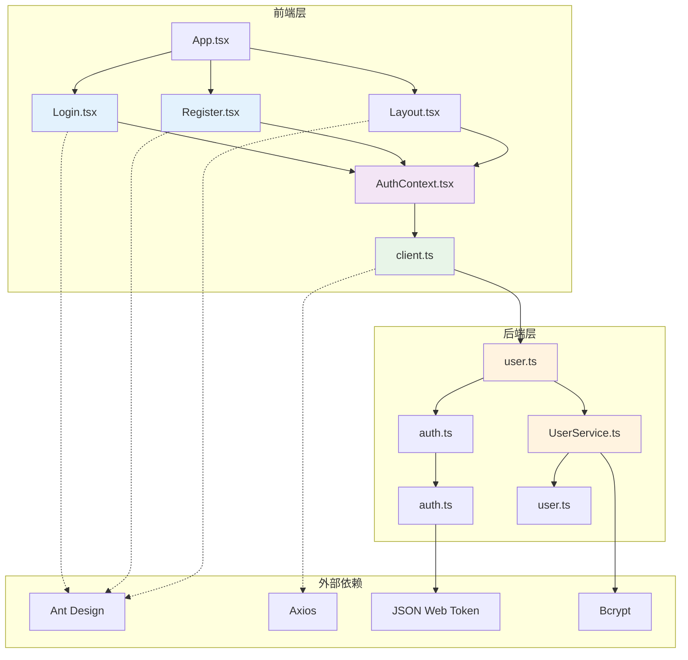

# 登录注册页面

<cite>
**本文档引用的文件**
- [web/client/src/pages/Login.tsx](file://web/client/src/pages/Login.tsx)
- [web/client/src/pages/Register.tsx](file://web/client/src/pages/Register.tsx)
- [web/client/src/contexts/AuthContext.tsx](file://web/client/src/contexts/AuthContext.tsx)
- [web/client/src/api/client.ts](file://web/client/src/api/client.ts)
- [web/client/src/App.tsx](file://web/client/src/App.tsx)
- [web/client/src/components/Layout.tsx](file://web/client/src/components/Layout.tsx)
- [web/server/src/routes/user.ts](file://web/server/src/routes/user.ts)
- [web/server/src/services/user-service.ts](file://web/server/src/services/user-service.ts)
- [web/server/src/middleware/auth.ts](file://web/server/src/middleware/auth.ts)
- [web/server/src/utils/auth.ts](file://web/server/src/utils/auth.ts)
- [web/server/src/models/user.ts](file://web/server/src/models/user.ts)
- [web/server/src/routes/auth.ts](file://web/server/src/routes/auth.ts)
- [tests/unit/auth.test.ts](file://tests/unit/auth.test.ts)
</cite>

## 目录
1. [简介](#简介)
2. [项目结构](#项目结构)
3. [核心组件](#核心组件)
4. [架构概览](#架构概览)
5. [详细组件分析](#详细组件分析)
6. [依赖关系分析](#依赖关系分析)
7. [性能考虑](#性能考虑)
8. [故障排除指南](#故障排除指南)
9. [结论](#结论)

## 简介

ClawOperations 是一个基于 React 和 Node.js 的抖音视频发布工具。本文档专注于登录注册页面的设计与实现，包括前端界面组件、认证上下文、API 交互以及后端认证服务的完整流程。

该系统采用现代化的前端技术栈，使用 Ant Design 组件库构建用户界面，结合 JWT 令牌进行用户认证，实现了完整的用户注册、登录、会话管理和状态持久化功能。

## 项目结构

项目采用前后端分离的架构设计，主要分为以下模块：

**图表来源**
- [web/client/src/App.tsx:18-70](file://web/client/src/App.tsx#L18-L70)
- [web/server/src/routes/user.ts:1-212](file://web/server/src/routes/user.ts#L1-L212)

**章节来源**
- [web/client/src/App.tsx:1-83](file://web/client/src/App.tsx#L1-L83)
- [web/server/src/routes/user.ts:1-212](file://web/server/src/routes/user.ts#L1-L212)

## 核心组件

### 登录页面组件

登录页面组件提供了直观的用户登录界面，包含表单验证、记住我功能和错误处理机制。

**图表来源**
- [web/client/src/pages/Login.tsx:26-45](file://web/client/src/pages/Login.tsx#L26-L45)
- [web/client/src/contexts/AuthContext.tsx:74-84](file://web/client/src/contexts/AuthContext.tsx#L74-L84)

### 注册页面组件

注册页面组件实现了完整的用户注册流程，包含多字段验证和密码确认功能。

**图表来源**
- [web/client/src/pages/Register.tsx:27-48](file://web/client/src/pages/Register.tsx#L27-L48)
- [web/client/src/pages/Register.tsx:83-155](file://web/client/src/pages/Register.tsx#L83-L155)

**章节来源**
- [web/client/src/pages/Login.tsx:1-145](file://web/client/src/pages/Login.tsx#L1-L145)
- [web/client/src/pages/Register.tsx:1-204](file://web/client/src/pages/Register.tsx#L1-L204)

## 架构概览

系统采用分层架构设计，从前端界面到后端服务形成完整的认证流程：

**图表来源**
- [web/client/src/pages/Login.tsx:31-45](file://web/client/src/pages/Login.tsx#L31-L45)
- [web/client/src/contexts/AuthContext.tsx:74-84](file://web/client/src/contexts/AuthContext.tsx#L74-L84)
- [web/server/src/routes/user.ts:49-106](file://web/server/src/routes/user.ts#L49-L106)

## 详细组件分析

### 认证上下文 (AuthContext)

认证上下文是整个认证系统的核心，负责管理用户状态、令牌存储和API调用。

**图表来源**
- [web/client/src/contexts/AuthContext.tsx:36-71](file://web/client/src/contexts/AuthContext.tsx#L36-L71)
- [web/client/src/contexts/AuthContext.tsx:118-137](file://web/client/src/contexts/AuthContext.tsx#L118-L137)

认证上下文的主要职责包括：
- **状态管理**: 维护用户登录状态和加载状态
- **令牌存储**: 使用 localStorage 持久化认证信息
- **API 调用**: 封装用户认证相关的 API 请求
- **事件监听**: 处理 401 未授权事件

**章节来源**
- [web/client/src/contexts/AuthContext.tsx:1-165](file://web/client/src/contexts/AuthContext.tsx#L1-L165)

### API 客户端 (client.ts)

API 客户端封装了所有 HTTP 请求，包括请求拦截器、响应拦截器和认证逻辑。

**图表来源**
- [web/client/src/api/client.ts:43-196](file://web/client/src/api/client.ts#L43-L196)
- [web/client/src/api/client.ts:199-237](file://web/client/src/api/client.ts#L199-L237)

API 客户端的关键特性：
- **请求拦截器**: 自动添加 Authorization 头部
- **响应拦截器**: 统一处理 401 未授权错误
- **令牌管理**: 提供完整的令牌存储和清除功能
- **模块化设计**: 将不同功能的 API 分组管理

**章节来源**
- [web/client/src/api/client.ts:1-238](file://web/client/src/api/client.ts#L1-L238)

### 用户服务 (user-service.ts)

后端用户服务处理用户注册、登录和密码管理等业务逻辑。

**图表来源**
- [web/server/src/services/user-service.ts:20-79](file://web/server/src/services/user-service.ts#L20-L79)

用户服务的验证规则：
- **用户名**: 3-20位字母、数字或下划线
- **邮箱**: 标准邮箱格式验证
- **密码**: 至少8位，必须包含字母和数字
- **唯一性**: 用户名和邮箱不能重复

**章节来源**
- [web/server/src/services/user-service.ts:1-240](file://web/server/src/services/user-service.ts#L1-L240)

### JWT 认证中间件

JWT 认证中间件确保只有经过身份验证的用户才能访问受保护的资源。

**图表来源**
- [web/server/src/middleware/auth.ts:18-54](file://web/server/src/middleware/auth.ts#L18-L54)

**章节来源**
- [web/server/src/middleware/auth.ts:1-93](file://web/server/src/middleware/auth.ts#L1-L93)

## 依赖关系分析

系统各组件之间的依赖关系如下：

**图表来源**
- [web/client/src/pages/Login.tsx:1-145](file://web/client/src/pages/Login.tsx#L1-L145)
- [web/client/src/pages/Register.tsx:1-204](file://web/client/src/pages/Register.tsx#L1-L204)
- [web/client/src/contexts/AuthContext.tsx:1-165](file://web/client/src/contexts/AuthContext.tsx#L1-L165)
- [web/client/src/api/client.ts:1-238](file://web/client/src/api/client.ts#L1-L238)
- [web/server/src/routes/user.ts:1-212](file://web/server/src/routes/user.ts#L1-L212)
- [web/server/src/services/user-service.ts:1-240](file://web/server/src/services/user-service.ts#L1-L240)

**章节来源**
- [web/client/src/App.tsx:1-83](file://web/client/src/App.tsx#L1-L83)
- [web/client/src/components/Layout.tsx:1-155](file://web/client/src/components/Layout.tsx#L1-L155)

## 性能考虑

### 前端性能优化

1. **懒加载策略**: 登录和注册页面仅在需要时加载
2. **状态缓存**: 使用 localStorage 缓存认证状态，避免重复验证
3. **请求去重**: 防止重复提交相同的登录请求
4. **组件优化**: 使用 React.memo 和 useCallback 优化渲染性能

### 后端性能优化

1. **数据库索引**: 用户名和邮箱字段建立唯一索引
2. **密码哈希**: 使用 bcrypt 进行安全的密码存储
3. **JWT 缓存**: 减少频繁的令牌验证开销
4. **连接池**: 合理管理数据库连接

## 故障排除指南

### 常见问题及解决方案

#### 登录失败
**症状**: 用户输入正确的凭据但仍无法登录
**可能原因**:
- 用户账户被禁用
- 密码验证失败
- 服务器内部错误

**解决步骤**:
1. 检查用户状态是否为激活状态
2. 验证密码哈希匹配
3. 查看服务器日志获取详细错误信息

#### 令牌过期
**症状**: 登录后一段时间出现 401 未授权错误
**可能原因**:
- JWT 令牌过期
- 浏览器清除本地存储
- 服务器时间不同步

**解决步骤**:
1. 检查令牌过期时间配置
2. 验证系统时间同步
3. 实现自动刷新机制

#### 注册验证失败
**症状**: 注册表单提交时报验证错误
**可能原因**:
- 输入格式不符合要求
- 用户名或邮箱已被使用
- 密码强度不足

**解决步骤**:
1. 检查前端表单验证规则
2. 验证后端业务逻辑
3. 确认数据库唯一约束

**章节来源**
- [web/server/src/services/user-service.ts:23-51](file://web/server/src/services/user-service.ts#L23-L51)
- [web/server/src/routes/user.ts:61-85](file://web/server/src/routes/user.ts#L61-L85)

## 结论

ClawOperations 的登录注册页面实现了现代化的用户认证系统，具有以下特点：

**安全性**: 采用 JWT 令牌认证、密码哈希存储和严格的输入验证
**用户体验**: 提供直观的界面、实时的表单验证和友好的错误提示
**可维护性**: 模块化的代码结构、清晰的职责分离和完善的测试覆盖
**扩展性**: 支持记住我功能、多设备登录和未来功能扩展

该系统为抖音视频发布工具提供了坚实的基础，用户可以通过简单的登录注册流程快速开始使用各项功能。通过合理的架构设计和最佳实践的应用，确保了系统的安全性、性能和可维护性。