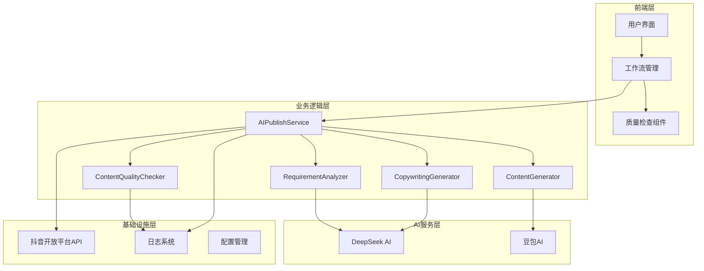
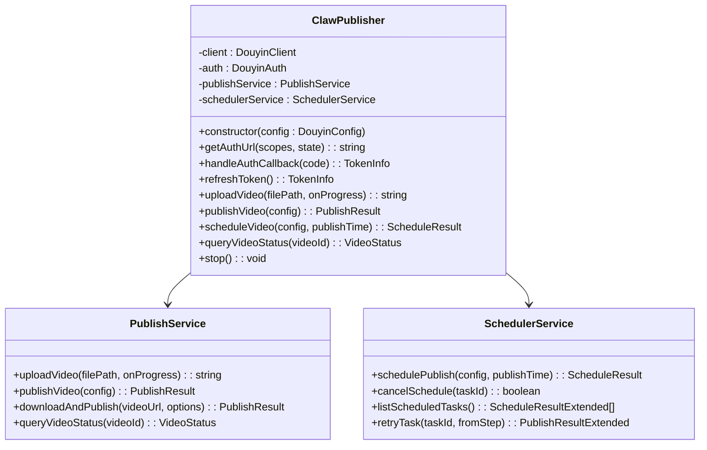
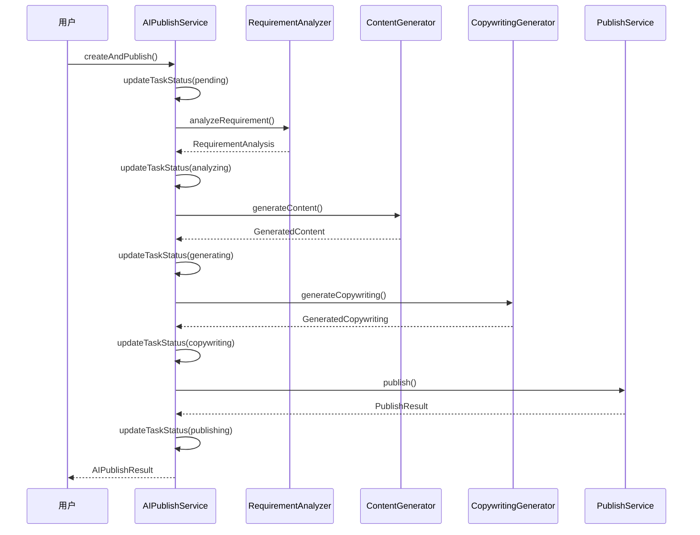
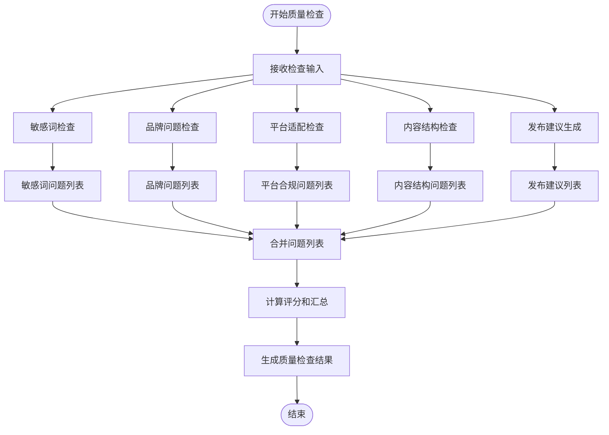
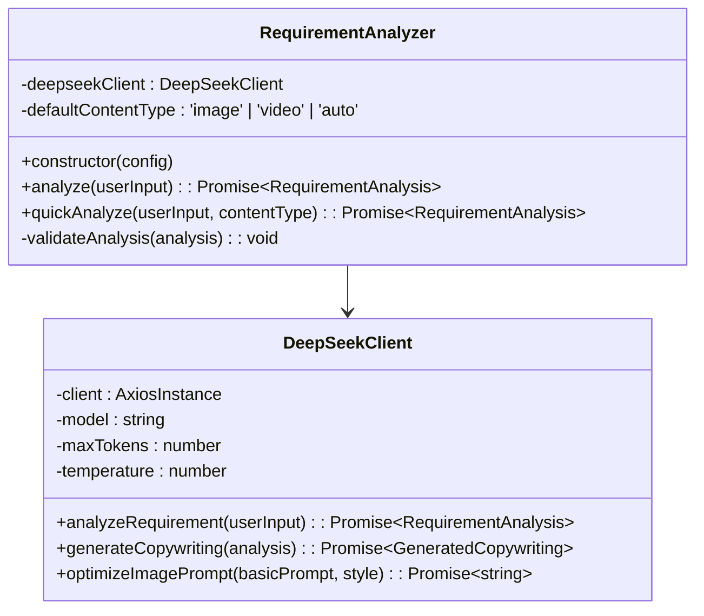
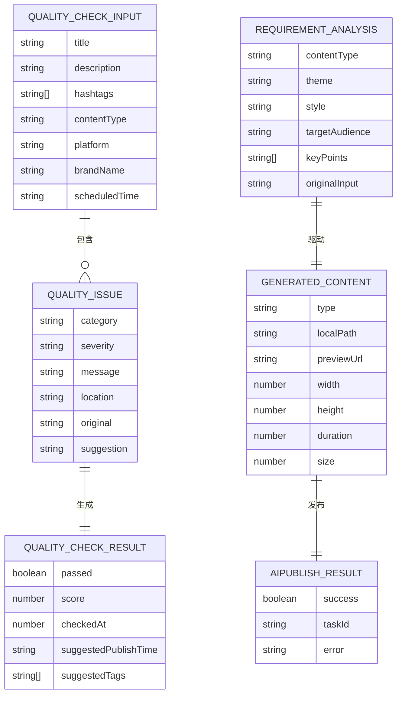
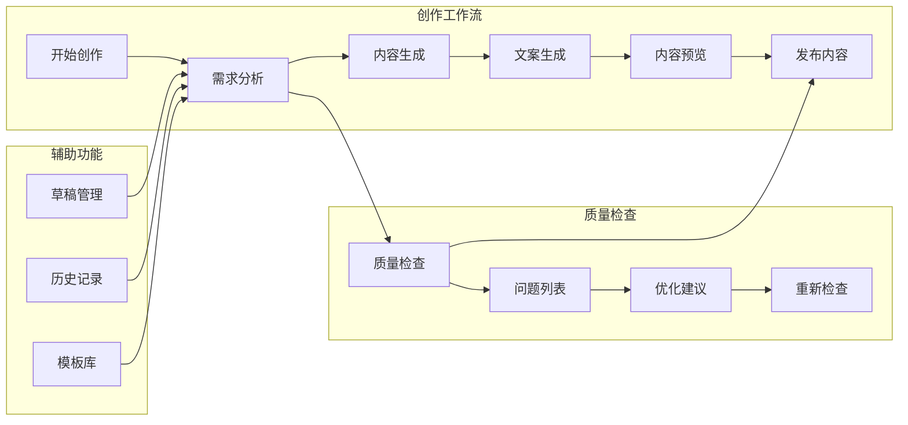

# 内容质量检查系统

<cite>
**本文档引用的文件**
- [README.md](file://README.md)
- [src/index.ts](file://src/index.ts)
- [src/models/types.ts](file://src/models/types.ts)
- [src/services/ai/content-quality-checker.ts](file://src/services/ai/content-quality-checker.ts)
- [src/services/ai/content-generator.ts](file://src/services/ai/content-generator.ts)
- [src/services/ai/requirement-analyzer.ts](file://src/services/ai/requirement-analyzer.ts)
- [src/services/ai/copywriting-generator.ts](file://src/services/ai/copywriting-generator.ts)
- [src/services/ai-publish-service.ts](file://src/services/ai-publish-service.ts)
- [src/api/ai/deepseek-client.ts](file://src/api/ai/deepseek-client.ts)
- [src/api/ai/doubao-client.ts](file://src/api/ai/doubao-client.ts)
- [config/default.ts](file://config/default.ts)
- [src/utils/logger.ts](file://src/utils/logger.ts)
- [web/client/src/pages/AICreator.tsx](file://web/client/src/pages/AICreator.tsx)
- [web/client/src/components/ai-creator/QualityCheckResult.tsx](file://web/client/src/components/ai-creator/QualityCheckResult.tsx)
- [web/client/src/hooks/useCreationWorkflow.ts](file://web/client/src/hooks/useCreationWorkflow.ts)
</cite>

## 目录
1. [项目概述](#项目概述)
2. [系统架构](#系统架构)
3. [核心组件](#核心组件)
4. [内容质量检查机制](#内容质量检查机制)
5. [AI创作工作流](#ai创作工作流)
6. [数据模型设计](#数据模型设计)
7. [前端集成方案](#前端集成方案)
8. [性能优化策略](#性能优化策略)
9. [故障排查指南](#故障排查指南)
10. [总结](#总结)

## 项目概述

内容质量检查系统是一个基于AI技术的智能内容创作与审核平台，专为抖音/快手等短视频平台设计。该系统集成了需求分析、内容生成、文案创作、质量检查等多个核心功能模块，为用户提供从创意到发布的完整解决方案。

### 系统特性

- **多模态内容生成**：支持图片和视频的AI自动生成
- **智能质量检查**：全面的内容合规性与质量评估
- **自动化发布流程**：无缝对接抖音开放平台API
- **可视化工作流**：直观的创作过程管理界面
- **模板化管理**：支持草稿、历史记录和模板库

## 系统架构

**图表来源**
- [src/services/ai-publish-service.ts:43-73](file://src/services/ai-publish-service.ts#L43-L73)
- [src/services/ai/content-quality-checker.ts:117-121](file://src/services/ai/content-quality-checker.ts#L117-L121)
- [src/api/ai/deepseek-client.ts:55-81](file://src/api/ai/deepseek-client.ts#L55-L81)

## 核心组件

### 主控制器 - ClawPublisher

ClawPublisher作为系统的主控制器，提供了统一的对外接口，整合了认证、视频上传、发布管理和定时任务等功能。

**图表来源**
- [src/index.ts:32-70](file://src/index.ts#L32-L70)
- [src/index.ts:156-184](file://src/index.ts#L156-L184)

**章节来源**
- [src/index.ts:32-270](file://src/index.ts#L32-L270)

### AI创作服务

AIPublishService作为AI创作流程的编排中心，协调各个AI服务模块的工作。

**图表来源**
- [src/services/ai-publish-service.ts:90-213](file://src/services/ai-publish-service.ts#L90-L213)
- [src/services/ai-publish-service.ts:254-283](file://src/services/ai-publish-service.ts#L254-L283)

**章节来源**
- [src/services/ai-publish-service.ts:43-358](file://src/services/ai-publish-service.ts#L43-L358)

## 内容质量检查机制

### 质量检查服务架构

ContentQualityChecker是系统的核心质量保证模块，提供了多层次的内容质量评估功能。

**图表来源**
- [src/services/ai/content-quality-checker.ts:126-167](file://src/services/ai/content-quality-checker.ts#L126-L167)

### 质量检查规则体系

系统内置了完善的质量检查规则，涵盖敏感词、品牌合规、平台适配等多个维度：

| 检查类别 | 规则类型 | 严重程度 | 示例规则 |
|---------|---------|---------|----------|
| 敏感词风险 | 绝对化表述 | 错误 | "最便宜"、"全国第一" |
| 敏感词风险 | 夸张宣传 | 错误 | "100%有效"、"顶级品质" |
| 敏感词风险 | 诱导消费 | 警告 | "限时"、"即将售罄" |
| 品牌问题 | 品牌缺失 | 警告 | 缺少品牌名称 |
| 品牌问题 | 拼写错误 | 警告 | "星巴克"拼写错误 |
| 平台适配 | 标题长度 | 错误 | 超过平台限制字数 |
| 平台适配 | 标签数量 | 警告 | 标签过多或过少 |
| 平台适配 | 导流词 | 错误 | 包含微信、QQ等导流词 |
| 内容结构 | 标题质量 | 错误 | 标题过短或缺失 |
| 内容结构 | 描述质量 | 警告 | 描述内容过短 |
| 内容结构 | CTA缺失 | 信息 | 缺少行动引导语 |

**章节来源**
- [src/services/ai/content-quality-checker.ts:17-555](file://src/services/ai/content-quality-checker.ts#L17-L555)

## AI创作工作流

### 需求分析模块

RequirementAnalyzer负责深入理解用户需求，提取关键信息并生成相应的创作指导。

**图表来源**
- [src/services/ai/requirement-analyzer.ts:25-34](file://src/services/ai/requirement-analyzer.ts#L25-L34)
- [src/api/ai/deepseek-client.ts:55-81](file://src/api/ai/deepseek-client.ts#L55-L81)

### 内容生成模块

ContentGenerator支持图片和视频的AI生成，提供灵活的配置选项。

**章节来源**
- [src/services/ai/requirement-analyzer.ts:25-128](file://src/services/ai/requirement-analyzer.ts#L25-L128)
- [src/services/ai/content-generator.ts:38-229](file://src/services/ai/content-generator.ts#L38-L229)

## 数据模型设计

### 核心数据结构

系统采用强类型设计，确保数据的一致性和可维护性。

**图表来源**
- [src/models/types.ts:666-682](file://src/models/types.ts#L666-L682)
- [src/models/types.ts:642-661](file://src/models/types.ts#L642-L661)
- [src/models/types.ts:208-225](file://src/models/types.ts#L208-L225)

### 错误处理机制

系统建立了完善的错误分类和处理机制：

| 错误类型 | 说明 | 可重试性 | 处理建议 |
|---------|------|---------|---------|
| TIMEOUT | 接口超时 | 是 | 增加重试次数，调整超时时间 |
| TOKEN_EXPIRED | Token过期 | 是 | 自动刷新Token后重试 |
| MATERIAL_ERROR | 素材异常 | 否 | 检查素材格式和内容 |
| RATE_LIMIT | 平台限流 | 是 | 等待后重试，降低频率 |
| PERMISSION_DENIED | 权限不足 | 否 | 检查API权限配置 |
| NETWORK_ERROR | 网络错误 | 是 | 检查网络连接，重试请求 |
| VALIDATION_ERROR | 参数验证错误 | 否 | 修正输入参数 |
| UNKNOWN | 未知错误 | 视情况而定 | 记录日志，人工干预 |

**章节来源**
- [src/models/types.ts:491-558](file://src/models/types.ts#L491-L558)

## 前端集成方案

### AI创作页面

AICreator页面提供了完整的创作工作流界面，集成了质量检查功能。

**图表来源**
- [web/client/src/pages/AICreator.tsx:68-681](file://web/client/src/pages/AICreator.tsx#L68-L681)

### 质量检查组件

QualityCheckResult组件提供了直观的质量检查结果展示。

**章节来源**
- [web/client/src/pages/AICreator.tsx:176-210](file://web/client/src/pages/AICreator.tsx#L176-L210)
- [web/client/src/components/ai-creator/QualityCheckResult.tsx:281-407](file://web/client/src/components/ai-creator/QualityCheckResult.tsx#L281-L407)

## 性能优化策略

### 缓存策略

系统采用了多层次的缓存机制来提升性能：

1. **AI响应缓存**：对相似的AI请求结果进行缓存
2. **配置缓存**：静态配置信息的内存缓存
3. **任务状态缓存**：创作任务状态的临时存储

### 异步处理

- **分片上传**：支持大文件的分片上传，提升上传效率
- **并发控制**：限制同时进行的AI生成任务数量
- **进度回调**：实时反馈任务执行进度

### 资源管理

- **连接池管理**：复用HTTP连接，减少连接开销
- **内存监控**：监控内存使用情况，及时释放资源
- **超时控制**：设置合理的超时时间，避免资源泄露

## 故障排查指南

### 常见问题诊断

1. **AI服务不可用**
   - 检查API密钥配置
   - 验证网络连接状态
   - 查看服务端日志

2. **内容质量检查失败**
   - 确认输入内容格式正确
   - 检查敏感词过滤规则
   - 验证平台适配配置

3. **发布流程异常**
   - 检查抖音API权限
   - 验证Token有效性
   - 查看发布状态日志

### 日志分析

系统采用结构化日志记录，便于问题追踪：

- **错误级别**：记录详细的错误信息和堆栈
- **调试级别**：记录关键流程的执行状态
- **访问级别**：记录API调用和响应信息

**章节来源**
- [src/utils/logger.ts:31-55](file://src/utils/logger.ts#L31-L55)

## 总结

内容质量检查系统通过集成AI技术和严格的质量控制机制，为用户提供了一套完整的智能内容创作解决方案。系统具有以下优势：

1. **技术先进性**：采用最新的AI技术，提供高质量的内容生成能力
2. **质量保障**：多层次的质量检查机制，确保内容合规性
3. **用户体验**：直观的界面设计和流畅的操作流程
4. **扩展性强**：模块化设计便于功能扩展和维护
5. **稳定性高**：完善的错误处理和监控机制

该系统特别适用于需要大量内容创作和发布的业务场景，能够显著提升内容质量和发布效率，降低人工成本。