# 创作工作流钩子

<cite>
**本文档引用的文件**
- [README.md](file://README.md)
- [package.json](file://package.json)
- [src/index.ts](file://src/index.ts)
- [src/models/types.ts](file://src/models/types.ts)
- [src/services/publish-service.ts](file://src/services/publish-service.ts)
- [src/services/scheduler-service.ts](file://src/services/scheduler-service.ts)
- [src/api/douyin-client.ts](file://src/api/douyin-client.ts)
- [config/default.ts](file://config/default.ts)
- [src/utils/retry.ts](file://src/utils/retry.ts)
- [src/utils/error-classifier.ts](file://src/utils/error-classifier.ts)
- [web/server/src/index.ts](file://web/server/src/index.ts)
- [web/server/src/routes/publish.ts](file://web/server/src/routes/publish.ts)
- [web/server/src/services/publisher.ts](file://web/server/src/services/publisher.ts)
- [mcp-server/src/index.ts](file://mcp-server/src/index.ts)
- [web/client/src/hooks/useCreationWorkflow.ts](file://web/client/src/hooks/useCreationWorkflow.ts)
</cite>

## 目录
1. [简介](#简介)
2. [项目结构](#项目结构)
3. [核心组件](#核心组件)
4. [架构概览](#架构概览)
5. [详细组件分析](#详细组件分析)
6. [依赖关系分析](#依赖关系分析)
7. [性能考虑](#性能考虑)
8. [故障排除指南](#故障排除指南)
9. [结论](#结论)

## 简介

ClawOperations 是一个专为抖音小龙虾营销账户设计的自动化运营系统。该项目提供了全面的工具和工作流程，以简化内容创作、调度、分析跟踪和观众互动等专业抖音营销活动的管理。

该项目的核心特色包括：
- **官方 API 集成**：与抖音开放平台 API 的安全集成
- **内容发布**：自动化的视频上传和调度功能
- **创作工作流**：AI 驱动的内容创作和发布流程
- **定时发布**：基于 Cron 的任务调度系统
- **错误处理**：智能的错误分类和自动重试机制

## 项目结构

项目采用模块化架构设计，主要分为以下几个核心部分：

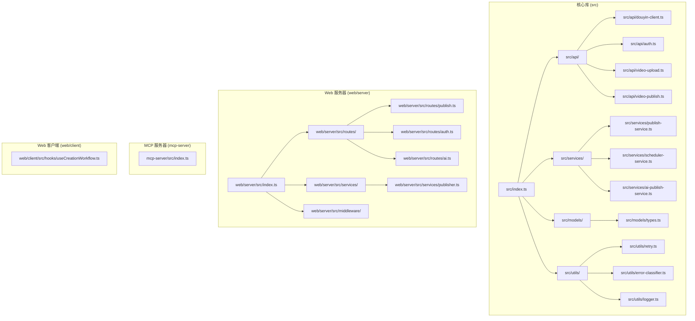

**图表来源**
- [src/index.ts:1-270](file://src/index.ts#L1-L270)
- [web/server/src/index.ts:1-72](file://web/server/src/index.ts#L1-L72)
- [mcp-server/src/index.ts:1-358](file://mcp-server/src/index.ts#L1-L358)

**章节来源**
- [README.md:92-105](file://README.md#L92-L105)
- [package.json:1-39](file://package.json#L1-L39)

## 核心组件

### 主要类和接口

项目的核心围绕以下几个主要组件构建：

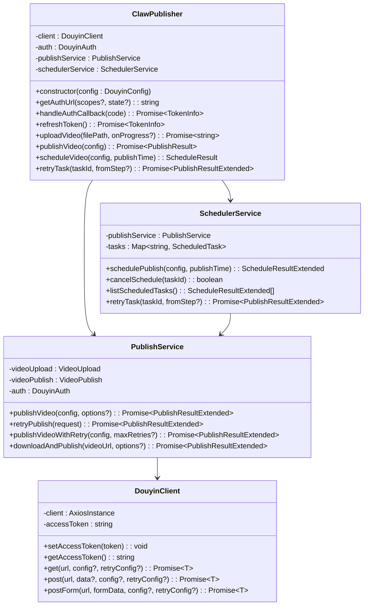

**图表来源**
- [src/index.ts:32-266](file://src/index.ts#L32-L266)
- [src/services/publish-service.ts:31-413](file://src/services/publish-service.ts#L31-L413)
- [src/services/scheduler-service.ts:39-347](file://src/services/scheduler-service.ts#L39-L347)
- [src/api/douyin-client.ts:13-237](file://src/api/douyin-client.ts#L13-L237)

### 数据模型

项目使用 TypeScript 接口来定义强类型的数据结构：

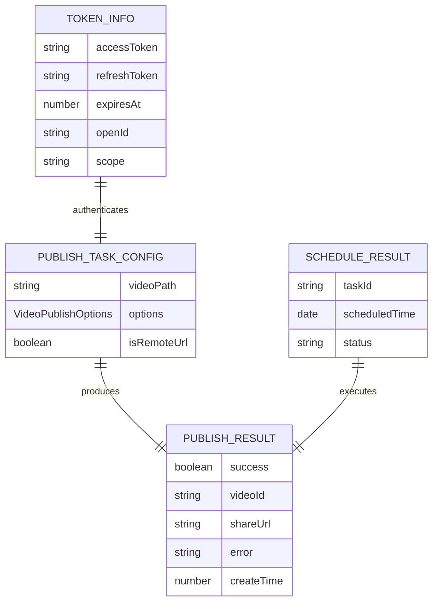

**图表来源**
- [src/models/types.ts:161-189](file://src/models/types.ts#L161-L189)
- [src/models/types.ts:173-179](file://src/models/types.ts#L173-L179)
- [src/models/types.ts:184-188](file://src/models/types.ts#L184-L188)
- [src/models/types.ts:40-46](file://src/models/types.ts#L40-L46)

**章节来源**
- [src/models/types.ts:1-682](file://src/models/types.ts#L1-L682)

## 架构概览

项目采用分层架构设计，实现了清晰的关注点分离：

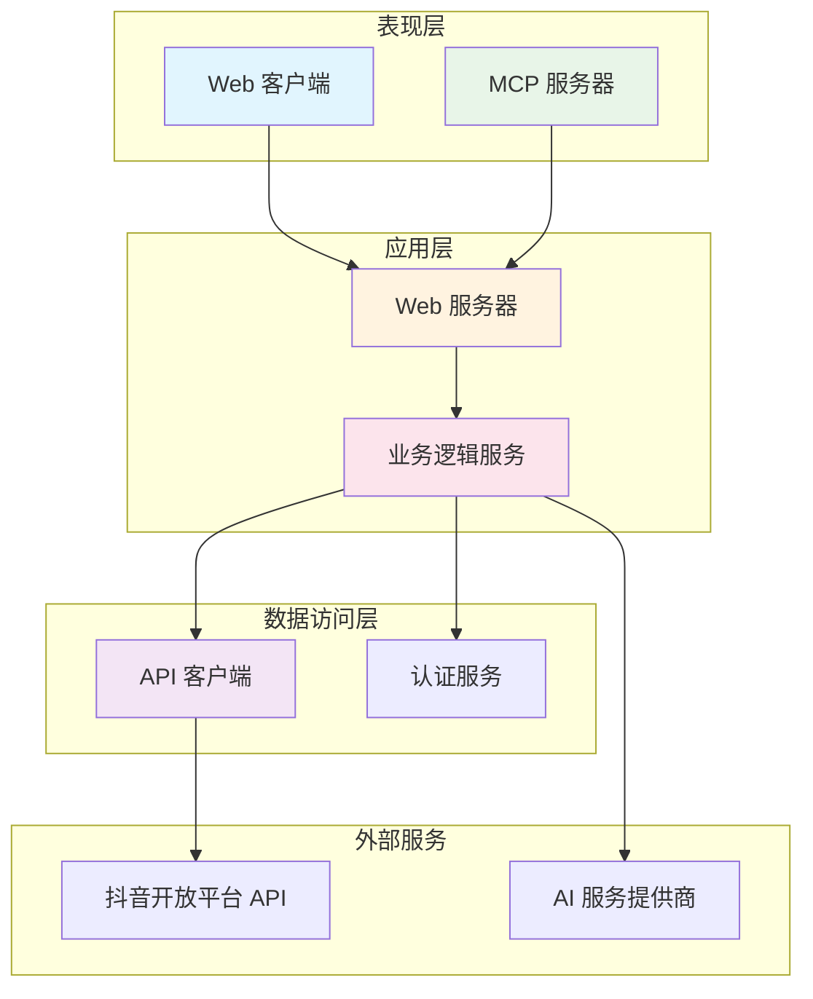

**图表来源**
- [web/server/src/index.ts:20-72](file://web/server/src/index.ts#L20-L72)
- [mcp-server/src/index.ts:11-358](file://mcp-server/src/index.ts#L11-L358)
- [src/api/douyin-client.ts:13-237](file://src/api/douyin-client.ts#L13-L237)

### 发布流程序列图

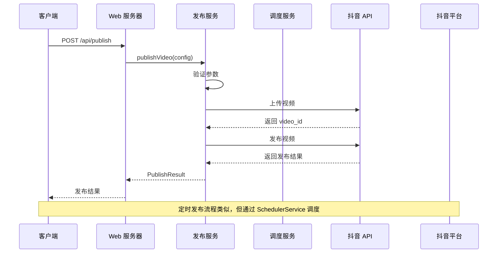

**图表来源**
- [src/services/publish-service.ts:48-181](file://src/services/publish-service.ts#L48-L181)
- [src/services/scheduler-service.ts:53-90](file://src/services/scheduler-service.ts#L53-L90)
- [web/server/src/routes/publish.ts:36-60](file://web/server/src/routes/publish.ts#L36-L60)

## 详细组件分析

### 发布服务 (PublishService)

发布服务是整个系统的核心业务编排层，负责协调视频上传和发布的完整流程：

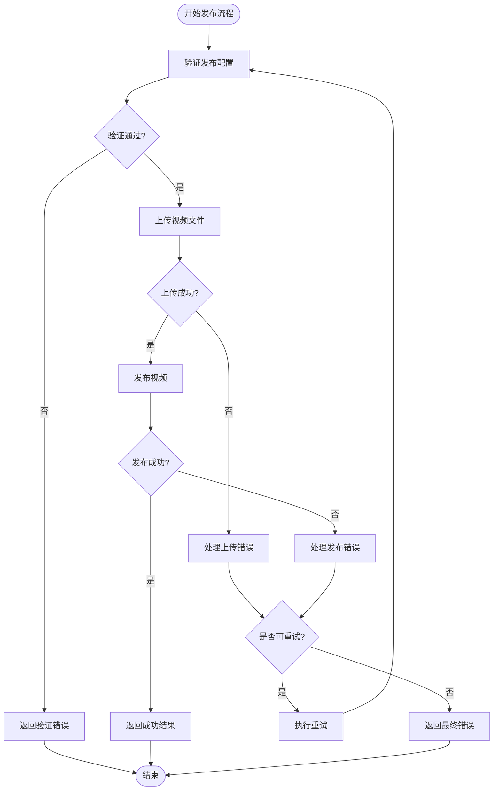

**图表来源**
- [src/services/publish-service.ts:48-181](file://src/services/publish-service.ts#L48-L181)
- [src/utils/error-classifier.ts:168-193](file://src/utils/error-classifier.ts#L168-L193)

发布服务的关键特性包括：

1. **分步骤执行**：将发布流程分解为验证、上传、发布三个独立步骤
2. **进度回调**：支持每个步骤的进度通知
3. **错误分类**：自动识别和分类各种错误类型
4. **重试机制**：智能的自动重试策略

**章节来源**
- [src/services/publish-service.ts:1-413](file://src/services/publish-service.ts#L1-L413)

### 调度服务 (SchedulerService)

调度服务基于 node-cron 实现了强大的定时发布功能：

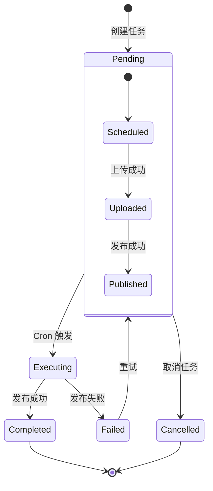

**图表来源**
- [src/services/scheduler-service.ts:19-34](file://src/services/scheduler-service.ts#L19-L34)
- [src/services/scheduler-service.ts:175-220](file://src/services/scheduler-service.ts#L175-L220)

调度服务的主要功能：

1. **Cron 表达式生成**：将日期转换为标准的 Cron 表达式
2. **任务生命周期管理**：跟踪任务的状态变化
3. **自动重试**：对失败的任务进行智能重试
4. **任务取消**：支持取消待执行的任务

**章节来源**
- [src/services/scheduler-service.ts:1-347](file://src/services/scheduler-service.ts#L1-L347)

### API 客户端 (DouyinClient)

API 客户端封装了与抖音开放平台的所有交互：

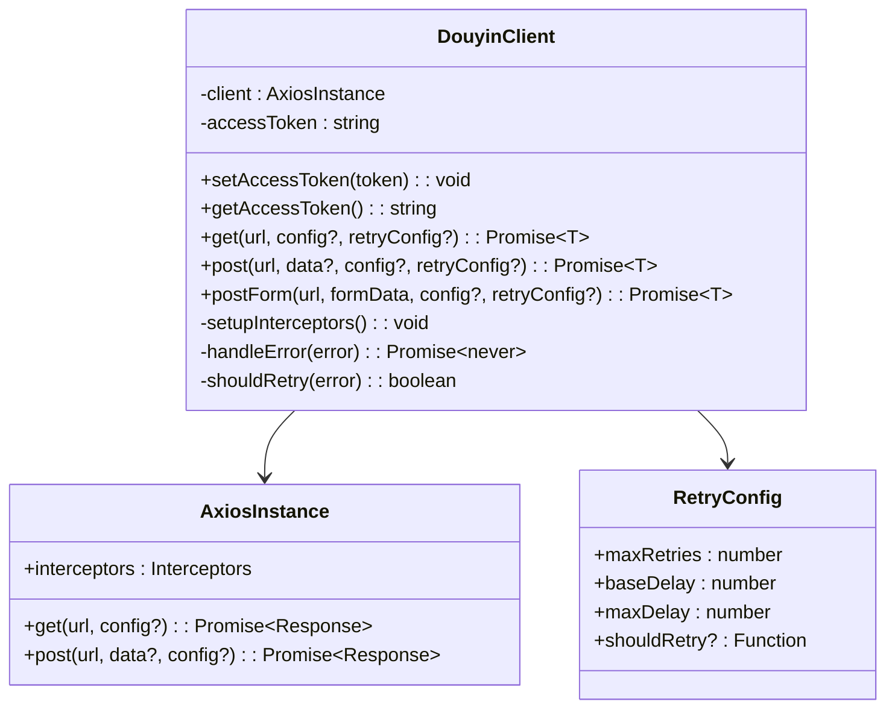

**图表来源**
- [src/api/douyin-client.ts:13-237](file://src/api/douyin-client.ts#L13-L237)

API 客户端的核心特性：

1. **自动重试**：基于指数退避的智能重试机制
2. **请求拦截器**：自动注入 access_token 和日志记录
3. **错误处理**：统一的错误处理和分类
4. **表单上传**：支持 multipart/form-data 的文件上传

**章节来源**
- [src/api/douyin-client.ts:1-237](file://src/api/douyin-client.ts#L1-L237)

### Web 服务器

Web 服务器提供了 RESTful API 接口，作为系统的入口点：

```mermaid
graph LR
subgraph "路由层"
A[/api/publish] --> B[发布路由]
C[/api/auth] --> D[认证路由]
E[/api/ai] --> F[AI 路由]
G[/api/upload] --> H[上传路由]
end
subgraph "服务层"
B --> I[Publish Service]
D --> J[Auth Service]
F --> K[AI Service]
H --> L[Upload Service]
end
subgraph "数据层"
I --> M[Publish Service]
J --> N[Auth Service]
K --> O[AI Service]
L --> P[Upload Service]
end
```

**图表来源**
- [web/server/src/index.ts:32-36](file://web/server/src/index.ts#L32-L36)
- [web/server/src/routes/publish.ts:36-253](file://web/server/src/routes/publish.ts#L36-L253)

**章节来源**
- [web/server/src/index.ts:1-72](file://web/server/src/index.ts#L1-L72)
- [web/server/src/routes/publish.ts:1-464](file://web/server/src/routes/publish.ts#L1-L464)

### MCP 服务器

MCP (Model Context Protocol) 服务器提供了与 AI 模型的集成能力：

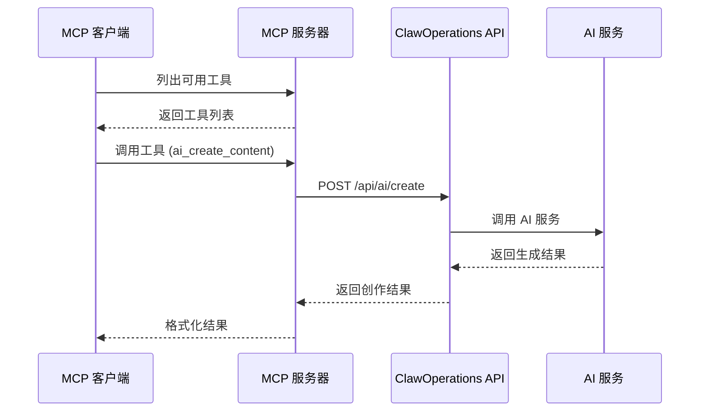

**图表来源**
- [mcp-server/src/index.ts:24-173](file://mcp-server/src/index.ts#L24-L173)
- [mcp-server/src/index.ts:176-315](file://mcp-server/src/index.ts#L176-L315)

**章节来源**
- [mcp-server/src/index.ts:1-358](file://mcp-server/src/index.ts#L1-L358)

### 创作工作流钩子

Web 客户端提供了完整的创作工作流状态管理：

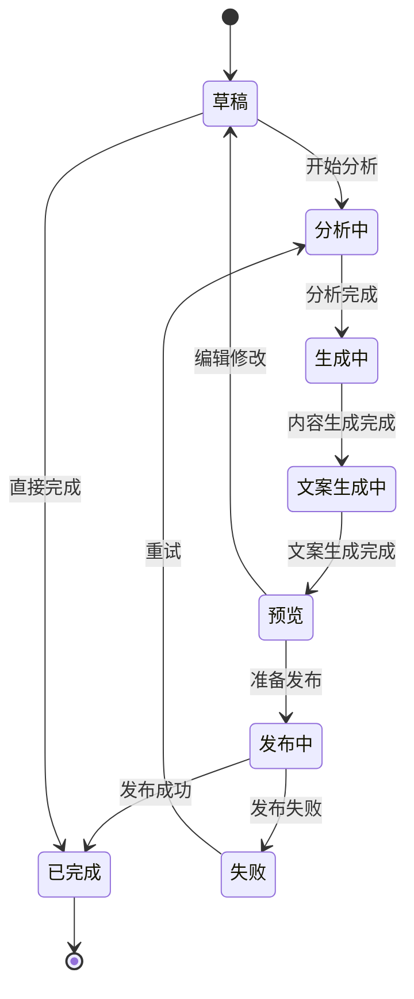

**图表来源**
- [web/client/src/hooks/useCreationWorkflow.ts:11-47](file://web/client/src/hooks/useCreationWorkflow.ts#L11-L47)
- [web/client/src/hooks/useCreationWorkflow.ts:196-245](file://web/client/src/hooks/useCreationWorkflow.ts#L196-L245)

**章节来源**
- [web/client/src/hooks/useCreationWorkflow.ts:1-360](file://web/client/src/hooks/useCreationWorkflow.ts#L1-L360)

## 依赖关系分析

项目使用了多种关键依赖来实现其功能：

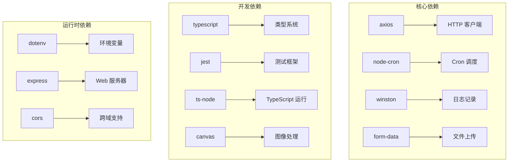

**图表来源**
- [package.json:18-34](file://package.json#L18-L34)

### 错误处理和重试机制

项目实现了多层次的错误处理和重试机制：

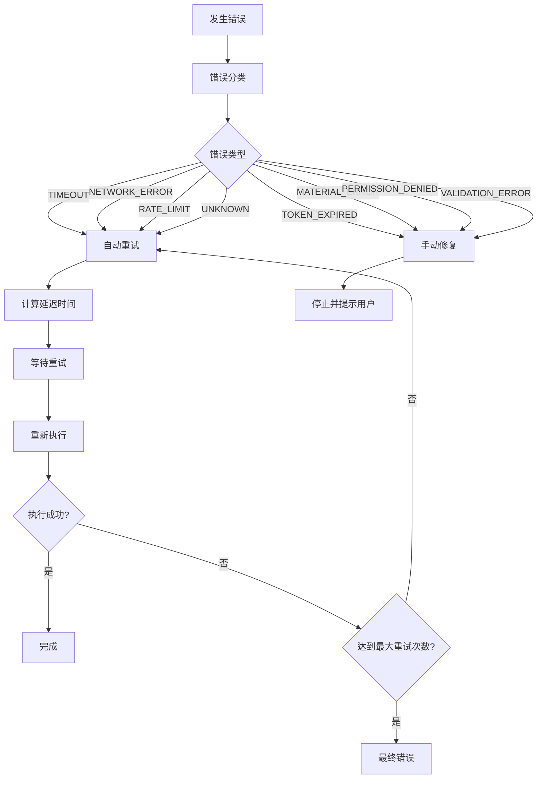

**图表来源**
- [src/utils/error-classifier.ts:22-161](file://src/utils/error-classifier.ts#L22-L161)
- [src/utils/retry.ts:41-81](file://src/utils/retry.ts#L41-L81)

**章节来源**
- [src/utils/error-classifier.ts:1-296](file://src/utils/error-classifier.ts#L1-L296)
- [src/utils/retry.ts:1-84](file://src/utils/retry.ts#L1-L84)

## 性能考虑

### 上传优化

项目实现了智能的分片上传机制：

1. **分片阈值**：超过 128MB 的文件自动启用分片上传
2. **并发控制**：合理的并发度避免资源争用
3. **断点续传**：支持上传中断后的续传
4. **进度反馈**：实时的上传进度监控

### 缓存策略

- **Token 缓存**：OAuth Token 的本地缓存减少重复认证
- **配置缓存**：全局配置的内存缓存提高访问速度
- **任务状态缓存**：定时任务状态的内存存储

### 错误恢复

- **指数退避**：重试延迟按 2^n 增长，避免雪崩效应
- **最大重试次数**：防止无限重试导致资源浪费
- **错误分类**：不同类型错误采用不同处理策略

## 故障排除指南

### 常见问题诊断

| 问题类型 | 可能原因 | 解决方案 |
|---------|---------|---------|
| 认证失败 | Token 过期或无效 | 调用 refreshToken() 方法刷新 Token |
| 上传失败 | 文件格式不支持或过大 | 检查文件格式和大小限制 |
| 发布失败 | 平台限流或权限不足 | 等待后重试或检查应用权限 |
| 网络超时 | 网络连接不稳定 | 检查网络状况或增加重试次数 |

### 调试技巧

1. **启用详细日志**：使用 Winston 日志记录器查看详细执行过程
2. **检查 API 响应**：分析抖音 API 的返回数据
3. **验证配置**：确认所有环境变量和配置参数正确
4. **监控资源使用**：观察内存和 CPU 使用情况

**章节来源**
- [src/utils/error-classifier.ts:168-296](file://src/utils/error-classifier.ts#L168-L296)

## 结论

ClawOperations 项目展现了现代 Node.js 应用的最佳实践，通过清晰的架构设计和完善的错误处理机制，为抖音营销自动化提供了可靠的解决方案。

项目的主要优势包括：

1. **模块化设计**：清晰的职责分离使得代码易于维护和扩展
2. **强类型支持**：完整的 TypeScript 类型定义提高了代码质量和开发体验
3. **智能重试**：基于错误分类的智能重试机制提高了系统的可靠性
4. **完整的工作流**：从内容创作到发布的完整自动化流程
5. **多平台支持**：同时支持 Web 界面、MCP 协议和直接 API 调用

通过合理的设计和实现，该项目为抖音营销自动化提供了一个强大而灵活的基础设施，能够满足专业营销团队的各种需求。