# 发布服务模块

<cite>
**本文档引用的文件**
- [publish-service.ts](file://src/services/publish-service.ts)
- [scheduler-service.ts](file://src/services/scheduler-service.ts)
- [video-publish.ts](file://src/api/video-publish.ts)
- [video-upload.ts](file://src/api/video-upload.ts)
- [retry.ts](file://src/utils/retry.ts)
- [types.ts](file://src/models/types.ts)
- [logger.ts](file://src/utils/logger.ts)
- [validator.ts](file://src/utils/validator.ts)
- [default.ts](file://config/default.ts)
- [index.ts](file://src/index.ts)
- [video-publish.test.ts](file://tests/unit/video-publish.test.ts)
- [mock-responses.ts](file://tests/fixtures/mock-responses.ts)
- [package.json](file://package.json)
</cite>

## 目录
1. [简介](#简介)
2. [项目结构](#项目结构)
3. [核心组件](#核心组件)
4. [架构概览](#架构概览)
5. [详细组件分析](#详细组件分析)
6. [依赖关系分析](#依赖关系分析)
7. [性能考虑](#性能考虑)
8. [故障排除指南](#故障排除指南)
9. [结论](#结论)
10. [附录](#附录)

## 简介

发布服务模块是基于抖音开放平台的视频发布自动化系统，专为营销账号设计。该模块提供了完整的视频发布流水线，包括视频上传、内容发布、状态查询、定时调度等功能，并实现了完善的错误处理和监控机制。

系统采用模块化设计，通过清晰的职责分离实现了高内聚低耦合的架构。发布服务作为业务编排层，协调多个子模块完成复杂的发布流程，同时提供了灵活的扩展点以适应不同的业务需求。

## 项目结构

该项目采用功能驱动的模块化组织方式，主要分为以下几个层次：

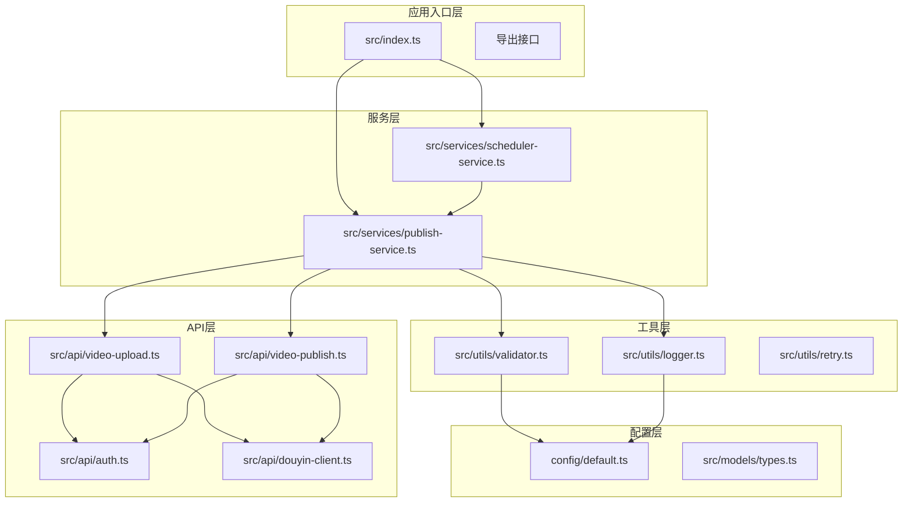

**图表来源**
- [index.ts:1-248](file://src/index.ts#L1-L248)
- [publish-service.ts:1-228](file://src/services/publish-service.ts#L1-L228)
- [scheduler-service.ts:1-202](file://src/services/scheduler-service.ts#L1-L202)

**章节来源**
- [index.ts:1-248](file://src/index.ts#L1-L248)
- [package.json:1-34](file://package.json#L1-L34)

## 核心组件

发布服务模块的核心由四个主要组件构成，每个组件都有明确的职责分工：

### 发布服务 (PublishService)
作为业务编排层，负责协调视频上传和发布的完整流程，提供统一的发布接口。

### 定时调度服务 (SchedulerService)
基于 node-cron 实现的定时任务管理器，支持任务注册、执行、取消和状态跟踪。

### 视频上传模块 (VideoUpload)
处理视频文件的上传逻辑，支持直接上传和分片上传两种模式。

### 视频发布模块 (VideoPublish)
负责将上传的视频正式发布到抖音平台，支持多种发布选项和参数配置。

**章节来源**
- [publish-service.ts:22-31](file://src/services/publish-service.ts#L22-L31)
- [scheduler-service.ts:23-29](file://src/services/scheduler-service.ts#L23-L29)
- [video-upload.ts:20-27](file://src/api/video-upload.ts#L20-L27)
- [video-publish.ts:15-22](file://src/api/video-publish.ts#L15-L22)

## 架构概览

系统采用分层架构设计，通过清晰的职责分离实现了高度模块化的结构：

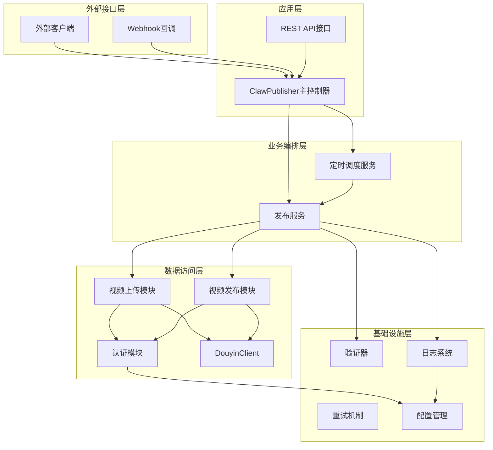

**图表来源**
- [index.ts:29-67](file://src/index.ts#L29-L67)
- [publish-service.ts:22-31](file://src/services/publish-service.ts#L22-L31)
- [scheduler-service.ts:23-29](file://src/services/scheduler-service.ts#L23-L29)

该架构实现了以下关键特性：
- **解耦性**: 各层之间通过明确定义的接口通信
- **可扩展性**: 新功能可通过添加新的模块轻松集成
- **可测试性**: 每个组件都可以独立测试和验证
- **可观测性**: 完善的日志和监控机制

## 详细组件分析

### 发布服务编排逻辑

发布服务是整个系统的核心编排器，负责协调视频上传和发布的完整流程：

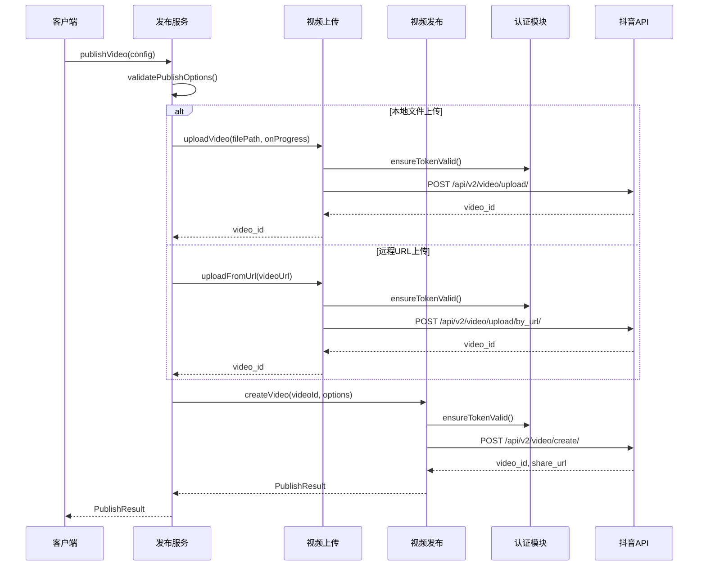

**图表来源**
- [publish-service.ts:38-80](file://src/services/publish-service.ts#L38-L80)
- [video-upload.ts:35-54](file://src/api/video-upload.ts#L35-L54)
- [video-publish.ts:30-54](file://src/api/video-publish.ts#L30-L54)

#### 上传流程控制

系统根据文件大小智能选择上传策略：

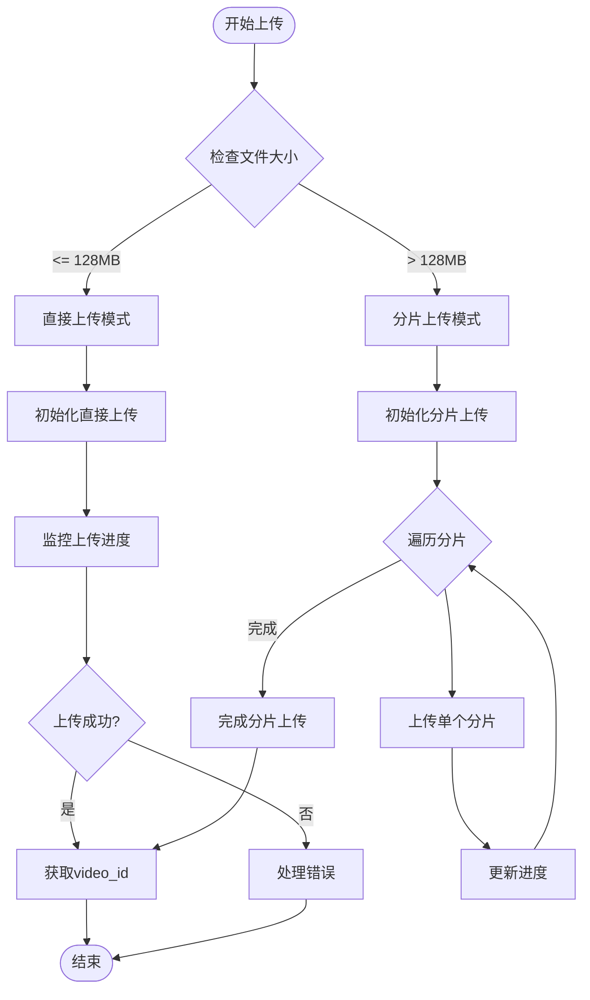

**图表来源**
- [video-upload.ts:48-54](file://src/api/video-upload.ts#L48-L54)
- [video-upload.ts:104-152](file://src/api/video-upload.ts#L104-L152)

#### 发布选项验证机制

发布服务实现了严格的参数验证，确保发布内容符合平台要求：

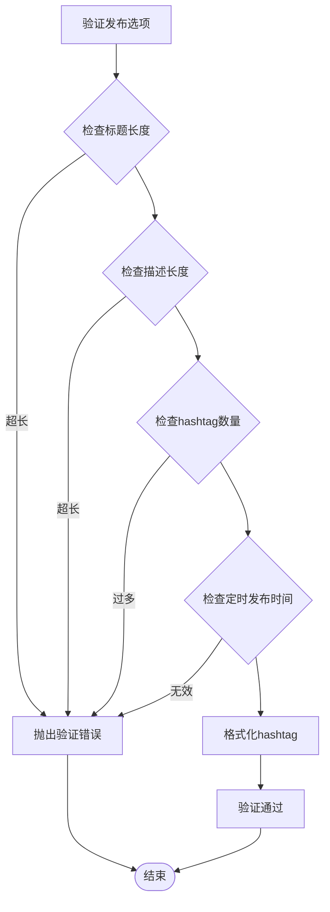

**图表来源**
- [validator.ts:45-86](file://src/utils/validator.ts#L45-L86)
- [video-publish.ts:62-125](file://src/api/video-publish.ts#L62-L125)

**章节来源**
- [publish-service.ts:38-80](file://src/services/publish-service.ts#L38-L80)
- [video-upload.ts:35-152](file://src/api/video-upload.ts#L35-L152)
- [validator.ts:45-86](file://src/utils/validator.ts#L45-L86)

### 定时调度服务

定时调度服务基于 node-cron 实现了完整的任务生命周期管理：

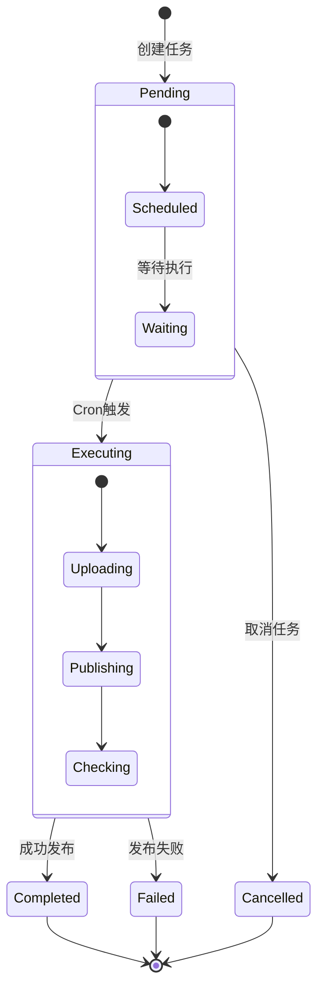

**图表来源**
- [scheduler-service.ts:11-18](file://src/services/scheduler-service.ts#L11-L18)
- [scheduler-service.ts:140-162](file://src/services/scheduler-service.ts#L140-L162)

#### 任务管理功能

定时调度服务提供了完整的任务管理能力：

| 功能 | 方法 | 描述 |
|------|------|------|
| 任务注册 | `schedulePublish()` | 注册新的定时发布任务 |
| 任务取消 | `cancelSchedule()` | 取消待执行的任务 |
| 任务查询 | `listScheduledTasks()` | 获取所有待发布任务列表 |
| 任务详情 | `getTask()` | 获取特定任务的详细信息 |
| 清理任务 | `cleanupCompletedTasks()` | 清理已完成或取消的任务 |

**章节来源**
- [scheduler-service.ts:37-134](file://src/services/scheduler-service.ts#L37-L134)
- [scheduler-service.ts:181-198](file://src/services/scheduler-service.ts#L181-L198)

### 错误处理和异常恢复机制

系统实现了多层次的错误处理和异常恢复机制：

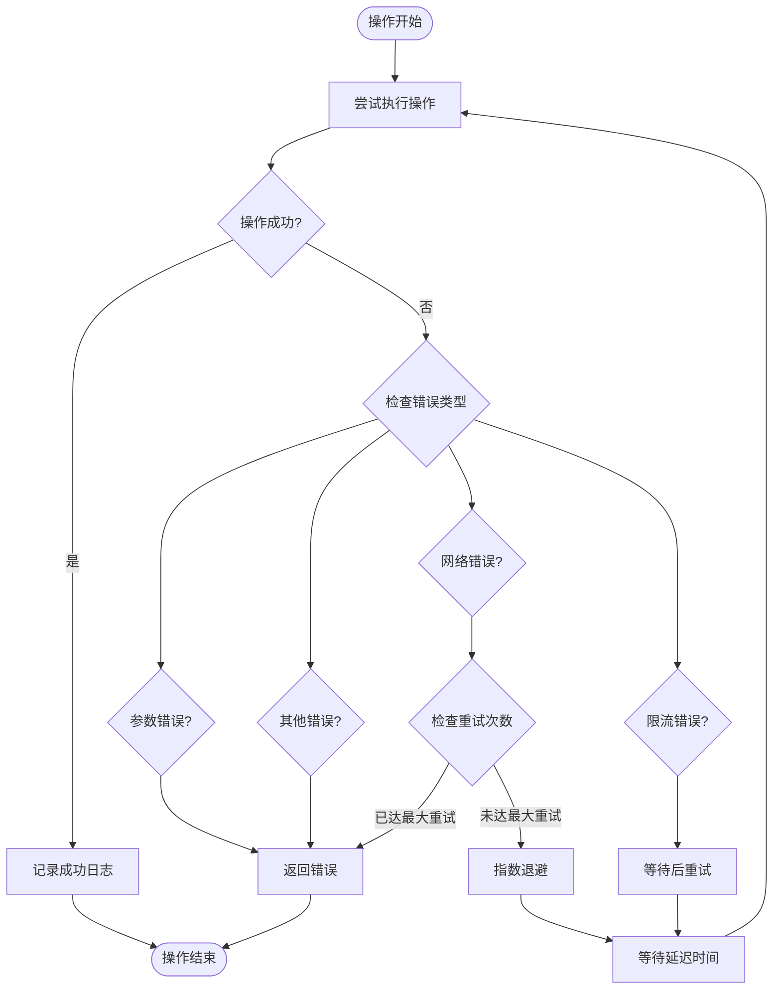

**图表来源**
- [retry.ts:41-81](file://src/utils/retry.ts#L41-L81)
- [publish-service.ts:71-79](file://src/services/publish-service.ts#L71-L79)

#### 重试策略配置

系统提供了灵活的重试配置机制：

| 配置项 | 默认值 | 描述 |
|--------|--------|------|
| maxRetries | 3次 | 最大重试次数 |
| baseDelay | 1000ms | 基础延迟时间 |
| maxDelay | 30000ms | 最大延迟时间 |
| shouldRetry | 自定义函数 | 自定义重试条件 |

**章节来源**
- [retry.ts:9-13](file://src/utils/retry.ts#L9-L13)
- [retry.ts:41-81](file://src/utils/retry.ts#L41-L81)

### 并发任务管理和资源控制

系统通过多种机制实现并发任务的管理和资源控制：

#### 内存管理策略

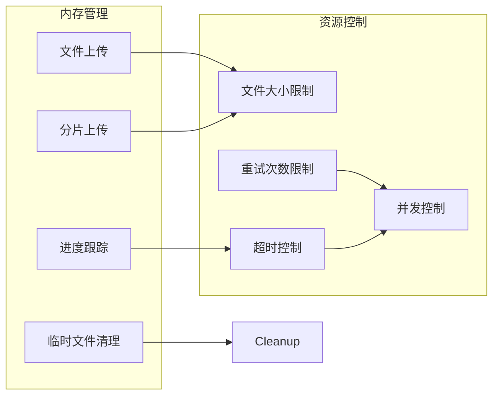

**图表来源**
- [default.ts:10-15](file://config/default.ts#L10-L15)
- [default.ts:26-31](file://config/default.ts#L26-L31)

#### 进度监控和通知

系统实现了完整的进度监控机制：

| 监控指标 | 数据类型 | 更新频率 | 用途 |
|----------|----------|----------|------|
| 上传进度 | 百分比 | 实时 | 用户界面显示 |
| 已上传字节 | 数值 | 实时 | 进度条计算 |
| 总字节 | 数值 | 实时 | 进度条计算 |
| 上传速度 | 数值 | 定期 | 性能监控 |
| 剩余时间 | 数值 | 定期 | 预计完成时间 |

**章节来源**
- [video-upload.ts:72-82](file://src/api/video-upload.ts#L72-L82)
- [video-upload.ts:136-142](file://src/api/video-upload.ts#L136-L142)

### 业务流程示例

#### 复杂发布场景：带定时发布的视频发布

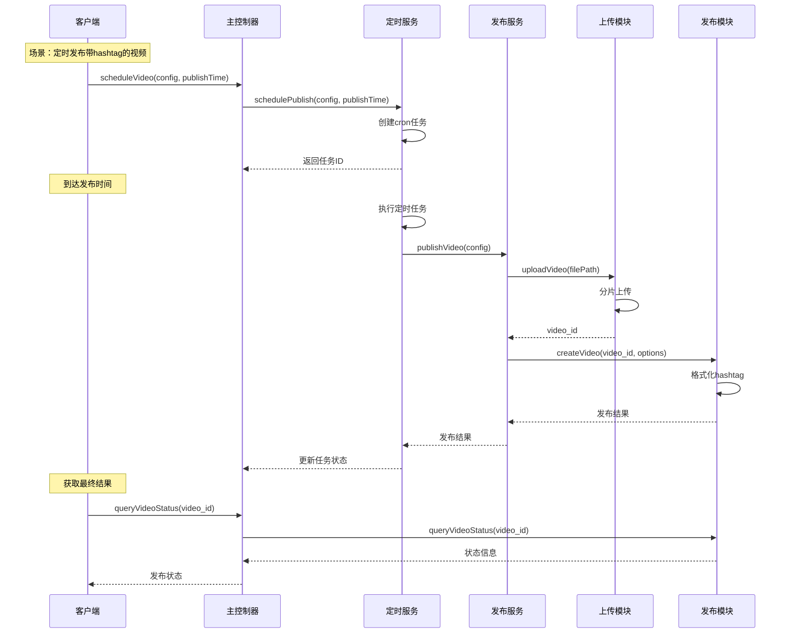

**图表来源**
- [index.ts:191-193](file://src/index.ts#L191-L193)
- [scheduler-service.ts:140-162](file://src/services/scheduler-service.ts#L140-L162)
- [publish-service.ts:38-80](file://src/services/publish-service.ts#L38-L80)

#### 多媒体内容发布流程

系统支持多种内容类型的发布：

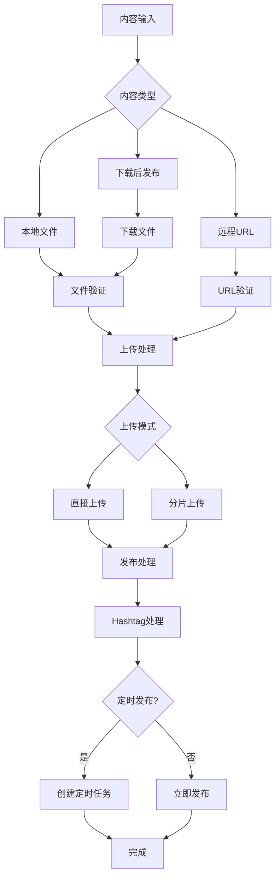

**图表来源**
- [publish-service.ts:133-172](file://src/services/publish-service.ts#L133-L172)
- [video-upload.ts:219-237](file://src/api/video-upload.ts#L219-L237)

**章节来源**
- [index.ts:176-181](file://src/index.ts#L176-L181)
- [publish-service.ts:133-172](file://src/services/publish-service.ts#L133-L172)

## 依赖关系分析

系统采用了清晰的依赖注入和模块化设计：

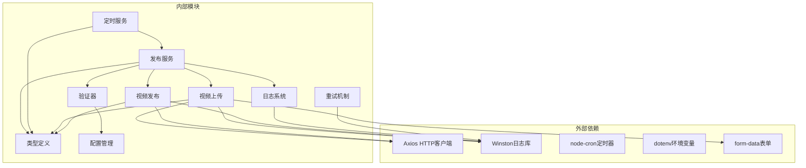

**图表来源**
- [package.json:14-19](file://package.json#L14-L19)
- [publish-service.ts:1-17](file://src/services/publish-service.ts#L1-L17)
- [scheduler-service.ts:1-6](file://src/services/scheduler-service.ts#L1-L6)

### 关键依赖特性

| 依赖库 | 版本 | 用途 | 关键特性 |
|--------|------|------|----------|
| axios | ^1.6.0 | HTTP客户端 | Promise支持、拦截器、自动JSON解析 |
| winston | ^3.11.0 | 日志系统 | 多传输器、格式化、级别控制 |
| node-cron | ^3.0.3 | 定时任务 | Cron表达式、时区支持、任务管理 |
| dotenv | ^16.3.0 | 环境变量 | .env文件加载、变量替换 |
| form-data | ^4.0.0 | 表单数据 | Multipart表单构建、文件上传 |

**章节来源**
- [package.json:14-19](file://package.json#L14-L19)
- [publish-service.ts:1-17](file://src/services/publish-service.ts#L1-L17)

## 性能考虑

系统在设计时充分考虑了性能优化和资源管理：

### 上传性能优化

1. **智能上传策略**: 根据文件大小自动选择最优上传方式
2. **分片上传**: 大文件采用分片上传，支持断点续传
3. **进度监控**: 实时进度反馈，避免长时间无响应
4. **内存管理**: 分片上传使用流式处理，减少内存占用

### 并发控制策略

### 缓存和重用机制

系统实现了多层缓存策略：

| 缓存层级 | 缓存内容 | 生命周期 | 用途 |
|----------|----------|----------|------|
| 内存缓存 | Token信息 | 应用进程周期 | 减少认证开销 |
| 文件缓存 | 临时文件 | 会话周期 | 断点续传支持 |
| 进度缓存 | 上传进度 | 上传过程 | 进度恢复 |
| 配置缓存 | 系统配置 | 应用启动 | 配置读取优化 |

**章节来源**
- [video-upload.ts:104-152](file://src/api/video-upload.ts#L104-L152)
- [default.ts:10-15](file://config/default.ts#L10-L15)

## 故障排除指南

### 常见问题诊断

#### 上传失败排查

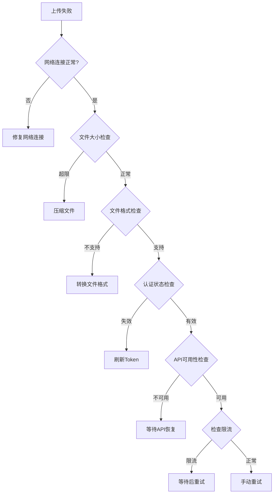

#### 定时任务异常处理

定时任务的异常处理机制：

| 异常类型 | 处理策略 | 重试机制 | 通知方式 |
|----------|----------|----------|----------|
| 网络异常 | 自动重试 | 指数退避 | 邮件通知 |
| 参数错误 | 直接失败 | 不重试 | 控制台警告 |
| 资源不足 | 延迟执行 | 等待资源 | 日志记录 |
| 系统错误 | 停止任务 | 手动干预 | 管理员通知 |

**章节来源**
- [retry.ts:41-81](file://src/utils/retry.ts#L41-L81)
- [scheduler-service.ts:140-162](file://src/services/scheduler-service.ts#L140-L162)

### 日志记录和监控

系统实现了全面的日志记录机制：

#### 日志级别和分类

| 日志级别 | 使用场景 | 示例消息 |
|----------|----------|----------|
| DEBUG | 详细调试信息 | "分片上传完成，part_number=5" |
| INFO | 重要业务事件 | "发布流程完成，video_id: xxx" |
| WARN | 警告信息 | "第2次尝试失败: 网络超时" |
| ERROR | 错误信息 | "发布流程失败: 参数验证失败" |

#### 性能监控指标

系统监控的关键性能指标：

| 指标类型 | 监控内容 | 阈值设置 | 报警机制 |
|----------|----------|----------|----------|
| 上传速度 | MB/s | < 1MB/s | 邮件报警 |
| 响应时间 | ms | > 5000ms | Slack通知 |
| 错误率 | % | > 5% | 管理员邮件 |
| 任务成功率 | % | < 95% | 自动重试 |

**章节来源**
- [logger.ts:31-55](file://src/utils/logger.ts#L31-L55)
- [publish-service.ts:41-79](file://src/services/publish-service.ts#L41-L79)

## 结论

发布服务模块通过精心设计的架构和完善的机制，为抖音视频发布提供了强大而可靠的自动化解决方案。系统的主要优势包括：

### 核心优势

1. **模块化设计**: 清晰的职责分离和接口定义
2. **健壮的错误处理**: 多层次的异常恢复机制
3. **灵活的配置管理**: 支持动态配置和环境适配
4. **完善的监控体系**: 全面的日志记录和性能监控
5. **可扩展的架构**: 易于添加新功能和集成新服务

### 技术特色

- **智能上传策略**: 根据文件大小自动选择最优上传方式
- **实时进度监控**: 完整的上传进度反馈机制
- **定时发布功能**: 基于cron的精确时间控制
- **参数验证机制**: 严格的内容发布验证
- **资源管理优化**: 有效的内存和网络资源控制

### 应用价值

该模块为营销账号运营提供了以下价值：
- **提高效率**: 自动化发布流程，减少人工干预
- **保证质量**: 严格的参数验证和错误处理
- **增强可靠性**: 完善的异常恢复和监控机制
- **支持扩展**: 灵活的架构设计支持业务发展

## 附录

### API参考

#### 发布服务接口

| 方法 | 参数 | 返回值 | 描述 |
|------|------|--------|------|
| publishVideo | PublishTaskConfig | Promise<PublishResult> | 完整发布流程（上传+发布） |
| uploadVideo | string, onProgress? | Promise<string> | 仅上传视频 |
| publishUploadedVideo | string, options? | Promise<PublishResult> | 发布已上传视频 |
| downloadAndPublish | string, options? | Promise<PublishResult> | 下载后发布 |
| queryVideoStatus | string | Promise<VideoStatus> | 查询视频状态 |
| deleteVideo | string | Promise<void> | 删除视频 |

#### 定时服务接口

| 方法 | 参数 | 返回值 | 描述 |
|------|------|--------|------|
| schedulePublish | PublishTaskConfig, Date | ScheduleResult | 注册定时任务 |
| cancelSchedule | string | boolean | 取消定时任务 |
| listScheduledTasks | void | ScheduleResult[] | 获取任务列表 |
| getTask | string | ScheduleResult \| null | 获取任务详情 |
| cleanupCompletedTasks | void | void | 清理已完成任务 |
| stopAll | void | void | 停止所有任务 |

### 配置参考

#### 系统配置

| 配置项 | 类型 | 默认值 | 描述 |
|--------|------|--------|------|
| CHUNK_UPLOAD_THRESHOLD | number | 128MB | 分片上传阈值 |
| DEFAULT_CHUNK_SIZE | number | 5MB | 默认分片大小 |
| MAX_RETRIES | number | 3次 | 最大重试次数 |
| BASE_DELAY | number | 1000ms | 基础延迟时间 |
| MAX_DELAY | number | 30000ms | 最大延迟时间 |
| SUPPORTED_FORMATS | string[] | ['mp4','mov','avi'] | 支持的视频格式 |
| MAX_SIZE | number | 4GB | 最大文件大小 |
| MAX_TITLE_LENGTH | number | 55字符 | 标题最大长度 |
| MAX_DESCRIPTION_LENGTH | number | 300字符 | 描述最大长度 |
| MAX_HASHTAG_COUNT | number | 5个 | hashtag最大数量 |

### 开发指南

#### 添加新功能

1. 在相应模块中添加新功能
2. 更新类型定义文件
3. 添加单元测试
4. 更新文档和示例代码
5. 进行集成测试

#### 调试技巧

- 使用DEBUG级别日志进行详细追踪
- 利用测试固件模拟各种场景
- 监控性能指标识别瓶颈
- 使用浏览器开发者工具调试前端集成