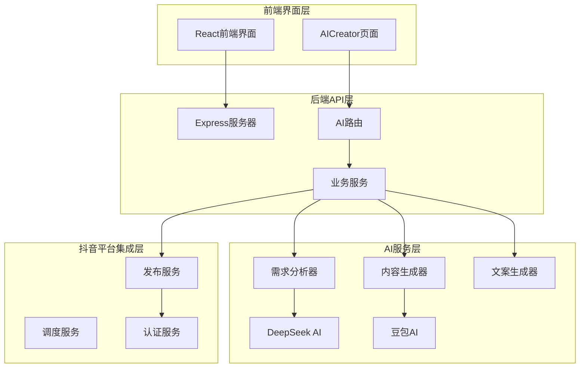
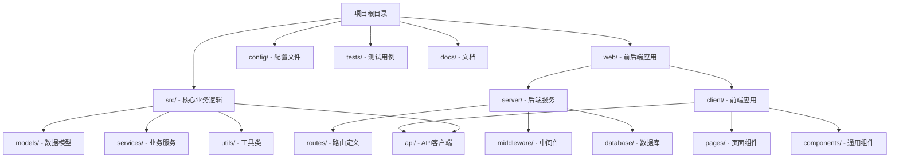
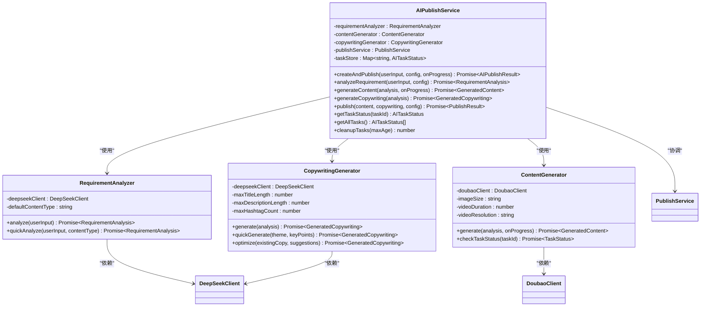
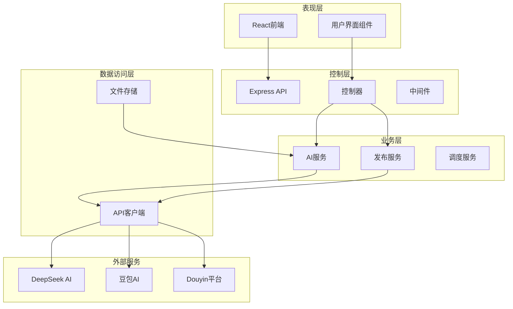
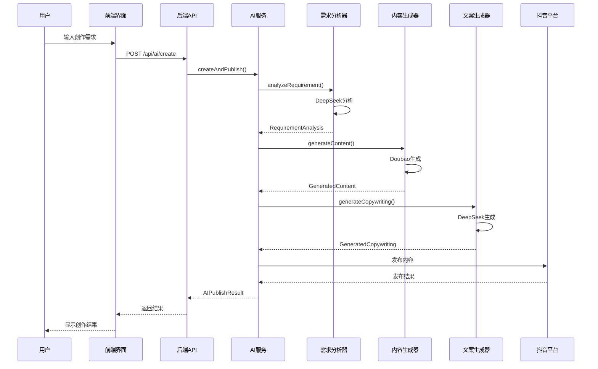
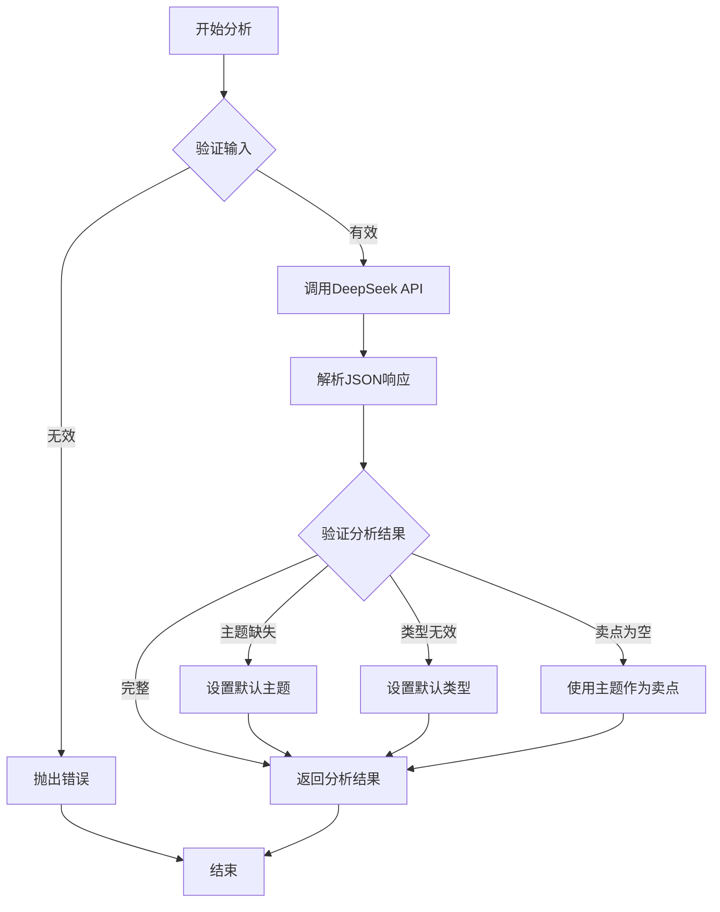
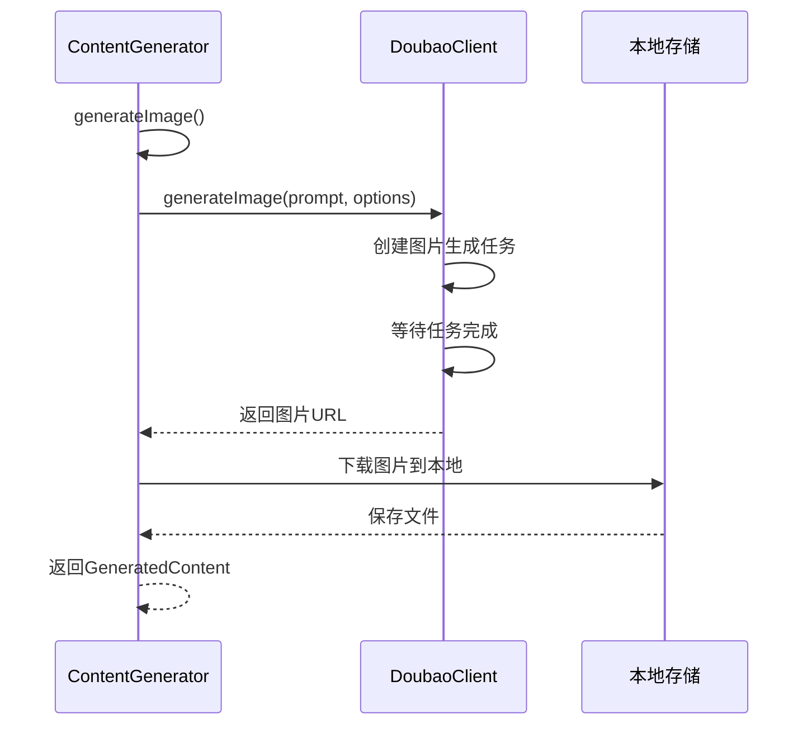
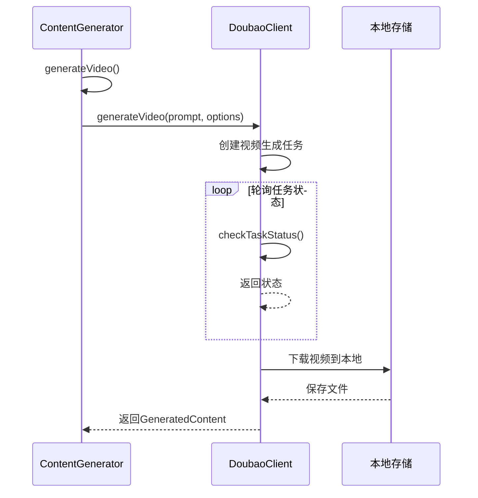
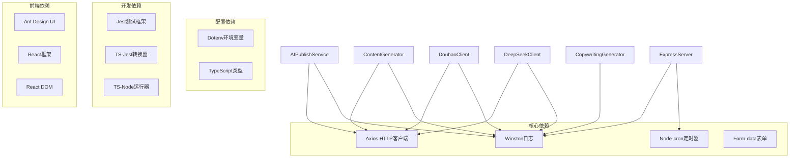

# AI发布服务

<cite>
**本文档引用的文件**
- [README.md](file://README.md)
- [package.json](file://package.json)
- [src/index.ts](file://src/index.ts)
- [config/default.ts](file://config/default.ts)
- [src/models/types.ts](file://src/models/types.ts)
- [src/services/ai-publish-service.ts](file://src/services/ai-publish-service.ts)
- [src/services/ai/requirement-analyzer.ts](file://src/services/ai/requirement-analyzer.ts)
- [src/services/ai/content-generator.ts](file://src/services/ai/content-generator.ts)
- [src/services/ai/copywriting-generator.ts](file://src/services/ai/copywriting-generator.ts)
- [src/api/ai/deepseek-client.ts](file://src/api/ai/deepseek-client.ts)
- [src/api/ai/doubao-client.ts](file://src/api/ai/doubao-client.ts)
- [src/api/ai/index.ts](file://src/api/ai/index.ts)
- [web/server/src/index.ts](file://web/server/src/index.ts)
- [web/server/src/routes/ai.ts](file://web/server/src/routes/ai.ts)
- [web/client/src/pages/AICreator.tsx](file://web/client/src/pages/AICreator.tsx)
</cite>

## 目录
1. [简介](#简介)
2. [项目结构](#项目结构)
3. [核心组件](#核心组件)
4. [架构概览](#架构概览)
5. [详细组件分析](#详细组件分析)
6. [依赖关系分析](#依赖关系分析)
7. [性能考虑](#性能考虑)
8. [故障排除指南](#故障排除指南)
9. [结论](#结论)

## 简介

AI发布服务是一个基于人工智能技术的抖音视频内容创作和发布系统。该系统集成了DeepSeek和豆包AI两大AI服务提供商，为用户提供从内容需求分析、AI内容生成到自动发布的完整解决方案。

### 主要功能特性

- **智能需求分析**：通过AI分析用户输入，提取内容主题、风格、目标受众等关键信息
- **AI内容生成**：支持图片和视频的AI自动生成，包括美食、生活方式等多种内容类型
- **智能文案生成**：为生成的内容自动创作符合平台规范的推广文案
- **一键发布功能**：支持直接将生成的内容发布到抖音平台
- **定时发布**：提供灵活的定时发布时间设置
- **任务状态跟踪**：完整的任务进度监控和状态管理

### 技术架构

系统采用模块化设计，分为前端界面层、后端API层、AI服务层和抖音平台集成层四个主要层次：

**图表来源**
- [web/client/src/pages/AICreator.tsx:1-513](file://web/client/src/pages/AICreator.tsx#L1-L513)
- [web/server/src/routes/ai.ts:1-323](file://web/server/src/routes/ai.ts#L1-L323)
- [src/services/ai-publish-service.ts:1-358](file://src/services/ai-publish-service.ts#L1-L358)

## 项目结构

项目采用前后端分离的架构设计，主要目录结构如下：

**图表来源**
- [README.md:92-105](file://README.md#L92-L105)
- [package.json:1-38](file://package.json#L1-L38)

### 核心模块说明

- **src/**: 包含所有核心业务逻辑，包括AI服务、发布服务、认证服务等
- **web/server/**: Express后端服务，提供RESTful API接口
- **web/client/**: React前端应用，提供用户交互界面
- **config/**: 系统配置文件，包含API配置、重试配置等
- **tests/**: 单元测试和集成测试用例

**章节来源**
- [README.md:92-105](file://README.md#L92-L105)
- [package.json:1-38](file://package.json#L1-L38)

## 核心组件

### AI发布编排服务

AI发布编排服务是整个系统的核心协调器，负责统一管理需求分析、内容生成、文案生成和发布流程。

**图表来源**
- [src/services/ai-publish-service.ts:43-358](file://src/services/ai-publish-service.ts#L43-L358)
- [src/services/ai/requirement-analyzer.ts:25-128](file://src/services/ai/requirement-analyzer.ts#L25-L128)
- [src/services/ai/content-generator.ts:38-229](file://src/services/ai/content-generator.ts#L38-L229)
- [src/services/ai/copywriting-generator.ts:30-194](file://src/services/ai/copywriting-generator.ts#L30-L194)

### AI服务客户端

系统集成了两个主要的AI服务提供商：

#### DeepSeek AI客户端
DeepSeek AI客户端专注于需求分析和文案生成，支持复杂的对话式AI交互。

#### 豆包AI客户端  
豆包AI客户端专注于图片和视频的生成，支持异步任务管理和文件下载。

**章节来源**
- [src/services/ai-publish-service.ts:43-358](file://src/services/ai-publish-service.ts#L43-L358)
- [src/api/ai/deepseek-client.ts:55-283](file://src/api/ai/deepseek-client.ts#L55-L283)
- [src/api/ai/doubao-client.ts:76-349](file://src/api/ai/doubao-client.ts#L76-L349)

## 架构概览

系统采用分层架构设计，确保各层之间的职责清晰分离：

**图表来源**
- [web/server/src/index.ts:1-55](file://web/server/src/index.ts#L1-L55)
- [web/server/src/routes/ai.ts:1-323](file://web/server/src/routes/ai.ts#L1-L323)
- [src/index.ts:29-248](file://src/index.ts#L29-L248)

### 数据流设计

系统采用事件驱动的数据流设计，确保各个组件之间的松耦合：

**图表来源**
- [web/server/src/routes/ai.ts:158-229](file://web/server/src/routes/ai.ts#L158-L229)
- [src/services/ai-publish-service.ts:90-213](file://src/services/ai-publish-service.ts#L90-L213)

## 详细组件分析

### 需求分析服务

需求分析服务是AI创作流程的第一步，负责从用户输入中提取关键信息并生成标准化的需求分析结果。

#### 核心功能

- **内容类型识别**：自动判断用户需要图片还是视频
- **主题提取**：识别内容的核心主题和关键信息
- **风格分析**：分析内容应该采用的风格和调性
- **目标受众定位**：确定内容的目标观众群体
- **关键卖点提取**：识别产品的核心优势和特色

#### 实现原理

**图表来源**
- [src/services/ai/requirement-analyzer.ts:41-98](file://src/services/ai/requirement-analyzer.ts#L41-L98)

**章节来源**
- [src/services/ai/requirement-analyzer.ts:25-128](file://src/services/ai/requirement-analyzer.ts#L25-L128)
- [src/api/ai/deepseek-client.ts:121-173](file://src/api/ai/deepseek-client.ts#L121-L173)

### 内容生成服务

内容生成服务负责根据需求分析结果生成具体的图片或视频内容。

#### 图片生成流程

**图表来源**
- [src/services/ai/content-generator.ts:107-132](file://src/services/ai/content-generator.ts#L107-L132)
- [src/api/ai/doubao-client.ts:122-175](file://src/api/ai/doubao-client.ts#L122-L175)

#### 视频生成流程

**图表来源**
- [src/services/ai/content-generator.ts:137-163](file://src/services/ai/content-generator.ts#L137-L163)
- [src/api/ai/doubao-client.ts:183-243](file://src/api/ai/doubao-client.ts#L183-L243)

**章节来源**
- [src/services/ai/content-generator.ts:38-229](file://src/services/ai/content-generator.ts#L38-L229)
- [src/api/ai/doubao-client.ts:76-349](file://src/api/ai/doubao-client.ts#L76-L349)

### 文案生成服务

文案生成服务专门负责为生成的内容创作符合抖音平台规范的推广文案。

#### 文案生成规则

- **标题限制**：最多55个字符，具有吸引力和情感共鸣
- **描述限制**：最多300个字符，包含关键信息和互动引导
- **标签管理**：最多5个话题标签，自动清理格式问题
- **风格适配**：根据不同内容类型调整文案风格

**章节来源**
- [src/services/ai/copywriting-generator.ts:30-194](file://src/services/ai/copywriting-generator.ts#L30-L194)
- [src/api/ai/deepseek-client.ts:180-244](file://src/api/ai/deepseek-client.ts#L180-L244)

### 发布服务集成

系统提供了完整的发布服务集成，支持直接将AI生成的内容发布到抖音平台。

#### 发布配置选项

- **基础发布**：直接发布到抖音账号
- **定时发布**：设置未来的发布时间
- **内容定制**：自定义标题、描述、标签等
- **地理位置**：添加POI位置信息
- **商业挂载**：支持小程序和商品链接

**章节来源**
- [src/index.ts:153-181](file://src/index.ts#L153-L181)
- [src/models/types.ts:101-124](file://src/models/types.ts#L101-L124)

## 依赖关系分析

系统采用模块化的依赖设计，确保各组件之间的低耦合高内聚。

**图表来源**
- [package.json:18-37](file://package.json#L18-L37)

### 外部API集成

系统集成了多个外部API服务：

- **DeepSeek API**：用于需求分析和文案生成
- **豆包AI API**：用于图片和视频生成
- **抖音开放平台**：用于内容发布和管理

**章节来源**
- [config/default.ts:42-60](file://config/default.ts#L42-L60)
- [src/api/ai/deepseek-client.ts:61-81](file://src/api/ai/deepseek-client.ts#L61-L81)
- [src/api/ai/doubao-client.ts:84-114](file://src/api/ai/doubao-client.ts#L84-L114)

## 性能考虑

### 并发处理

系统采用异步非阻塞的设计模式，能够有效处理多个并发的AI生成任务：

- **任务队列管理**：使用Map结构存储任务状态
- **内存优化**：及时清理过期任务，避免内存泄漏
- **超时控制**：为长时间运行的任务设置合理的超时机制

### 缓存策略

- **配置缓存**：AI客户端配置在初始化时缓存
- **任务状态缓存**：近期任务状态存储在内存中
- **文件缓存**：生成的内容文件存储在本地临时目录

### 错误恢复

- **重试机制**：网络请求具备自动重试能力
- **降级策略**：当AI服务不可用时提供基本功能
- **状态监控**：实时监控各组件的健康状态

## 故障排除指南

### 常见问题及解决方案

#### AI服务配置问题

**问题**：DeepSeek API Key未配置
**解决方案**：设置DEEPSEEK_API_KEY环境变量

**问题**：豆包API Key未配置  
**解决方案**：设置DOUBAO_API_KEY环境变量

**问题**：抖音认证失败
**解决方案**：检查clientKey、clientSecret和redirectUri配置

#### 任务执行问题

**问题**：内容生成超时
**解决方案**：检查网络连接，适当增加超时时间

**问题**：任务状态查询失败
**解决方案**：确认任务ID正确性和服务可用性

#### 文件处理问题

**问题**：生成文件无法下载
**解决方案**：检查输出目录权限和磁盘空间

**问题**：文件格式不支持
**解决方案**：确认文件扩展名在支持列表中

**章节来源**
- [src/api/ai/deepseek-client.ts:61-81](file://src/api/ai/deepseek-client.ts#L61-L81)
- [src/api/ai/doubao-client.ts:84-114](file://src/api/ai/doubao-client.ts#L84-L114)
- [config/default.ts:17-24](file://config/default.ts#L17-L24)

## 结论

AI发布服务是一个功能完整、架构清晰的人工智能内容创作和发布系统。通过集成多个AI服务提供商，系统能够为用户提供从需求分析到内容生成再到自动发布的完整解决方案。

### 主要优势

- **技术先进性**：集成了最新的AI技术和抖音平台API
- **用户体验友好**：提供直观的图形界面和流畅的操作体验
- **功能完整性**：覆盖内容创作的全流程需求
- **可扩展性强**：模块化设计便于功能扩展和维护

### 发展方向

- **AI能力增强**：持续优化AI生成质量和效率
- **平台扩展**：支持更多社交媒体平台的内容发布
- **智能化程度提升**：增加更多智能化的内容推荐和优化功能
- **性能优化**：进一步提升系统的响应速度和稳定性

该系统为内容创作者提供了强大的技术支持，能够显著提高内容创作的效率和质量，是现代数字营销的重要工具。