# 发布服务协调器

<cite>
**本文档引用的文件**
- [src/index.ts](file://src/index.ts)
- [src/services/publish-service.ts](file://src/services/publish-service.ts)
- [src/services/scheduler-service.ts](file://src/services/scheduler-service.ts)
- [src/api/video-publish.ts](file://src/api/video-publish.ts)
- [src/api/video-upload.ts](file://src/api/video-upload.ts)
- [src/api/auth.ts](file://src/api/auth.ts)
- [src/api/douyin-client.ts](file://src/api/douyin-client.ts)
- [src/models/types.ts](file://src/models/types.ts)
- [config/default.ts](file://config/default.ts)
- [src/utils/validator.ts](file://src/utils/validator.ts)
- [example.ts](file://example.ts)
- [tests/unit/video-publish.test.ts](file://tests/unit/video-publish.test.ts)
- [web/client/src/pages/Publish.tsx](file://web/client/src/pages/Publish.tsx)
- [package.json](file://package.json)
</cite>

## 目录
1. [简介](#简介)
2. [项目结构](#项目结构)
3. [核心组件](#核心组件)
4. [架构概览](#架构概览)
5. [详细组件分析](#详细组件分析)
6. [依赖关系分析](#依赖关系分析)
7. [性能考虑](#性能考虑)
8. [故障排除指南](#故障排除指南)
9. [结论](#结论)

## 简介

发布服务协调器是一个基于 TypeScript 的抖音视频发布自动化系统，专为营销账号运营设计。该系统提供了完整的视频上传、发布、管理和定时发布功能，支持多种发布场景和高级配置选项。

系统采用模块化架构设计，包含认证管理、视频上传、视频发布、定时调度等核心功能模块，为 ClawBot 等上层应用提供统一的接口。

## 项目结构

项目采用清晰的分层架构，主要分为以下几个层次：

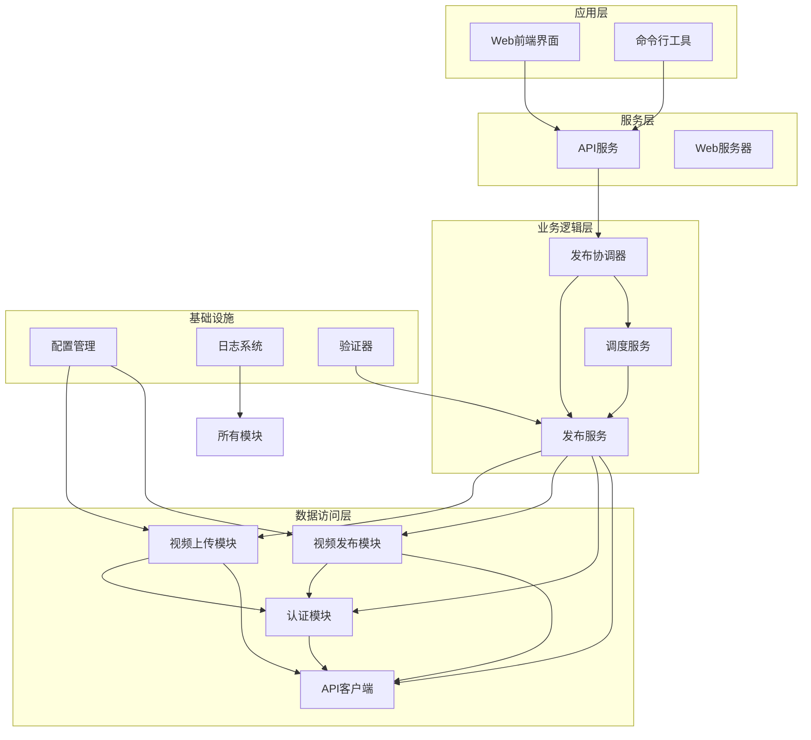

**图表来源**
- [src/index.ts:1-248](file://src/index.ts#L1-L248)
- [src/services/publish-service.ts:1-228](file://src/services/publish-service.ts#L1-L228)
- [src/services/scheduler-service.ts:1-202](file://src/services/scheduler-service.ts#L1-L202)

**章节来源**
- [src/index.ts:1-248](file://src/index.ts#L1-L248)
- [package.json:1-38](file://package.json#L1-L38)

## 核心组件

### 主要组件概述

系统的核心由以下主要组件构成：

1. **ClawPublisher** - 主协调器，提供统一的对外接口
2. **PublishService** - 发布业务编排层
3. **SchedulerService** - 定时发布调度服务
4. **DouyinClient** - 抖音 API 客户端封装
5. **DouyinAuth** - OAuth 认证管理
6. **VideoUpload** - 视频上传模块
7. **VideoPublish** - 视频发布模块

### 组件关系图

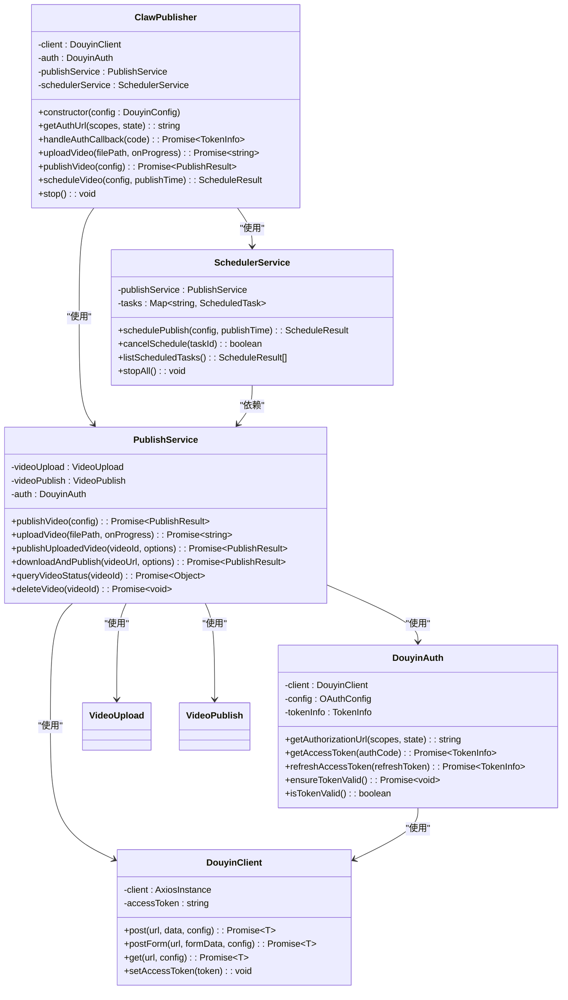

**图表来源**
- [src/index.ts:29-244](file://src/index.ts#L29-L244)
- [src/services/publish-service.ts:22-31](file://src/services/publish-service.ts#L22-L31)
- [src/services/scheduler-service.ts:23-29](file://src/services/scheduler-service.ts#L23-L29)
- [src/api/douyin-client.ts:13-43](file://src/api/douyin-client.ts#L13-L43)
- [src/api/auth.ts:29-37](file://src/api/auth.ts#L29-L37)

**章节来源**
- [src/index.ts:29-244](file://src/index.ts#L29-L244)
- [src/services/publish-service.ts:22-31](file://src/services/publish-service.ts#L22-L31)
- [src/services/scheduler-service.ts:23-29](file://src/services/scheduler-service.ts#L23-L29)

## 架构概览

系统采用分层架构设计，确保各层职责明确，便于维护和扩展。

### 整体架构图

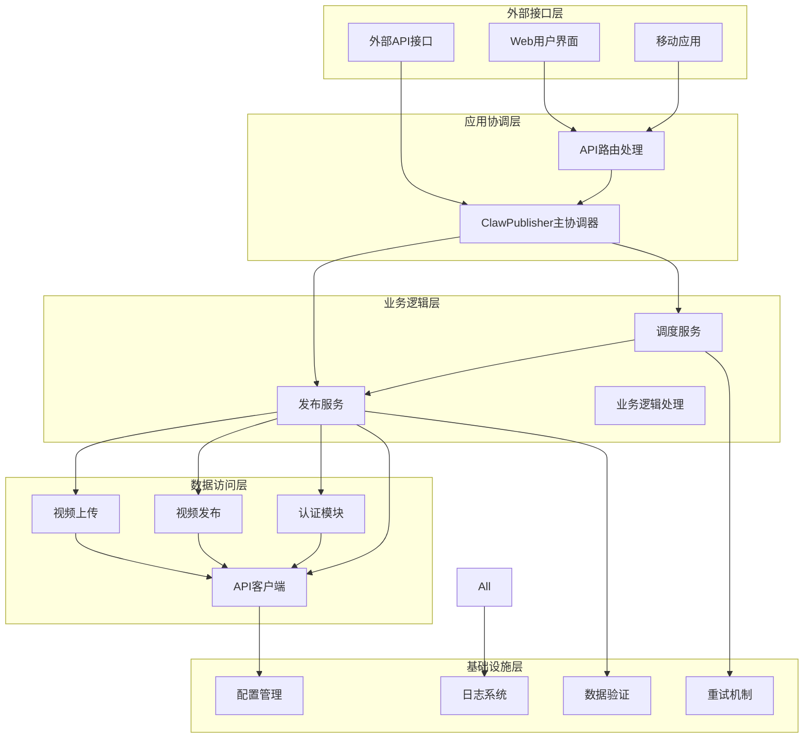

**图表来源**
- [src/index.ts:1-248](file://src/index.ts#L1-L248)
- [src/services/publish-service.ts:1-228](file://src/services/publish-service.ts#L1-L228)
- [src/services/scheduler-service.ts:1-202](file://src/services/scheduler-service.ts#L1-L202)

### 数据流图

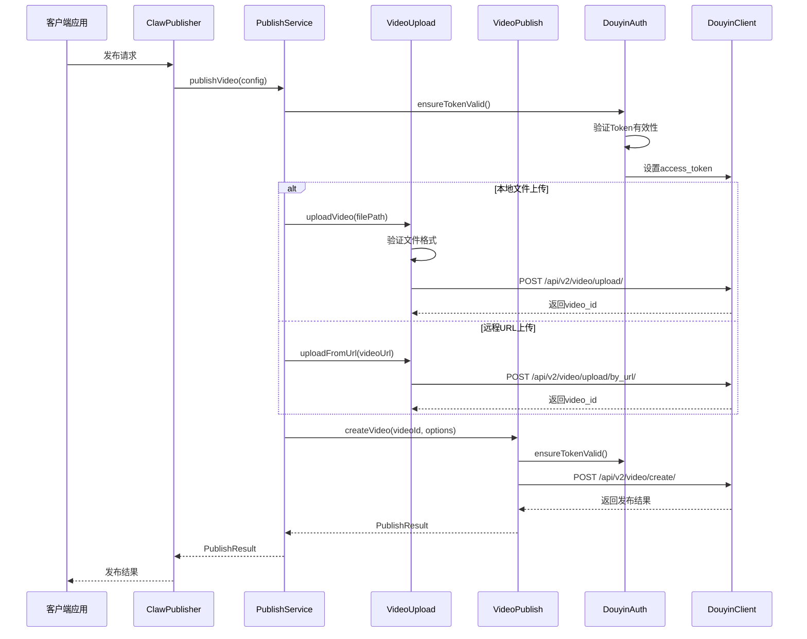

**图表来源**
- [src/index.ts:153-155](file://src/index.ts#L153-L155)
- [src/services/publish-service.ts:38-80](file://src/services/publish-service.ts#L38-L80)
- [src/api/video-upload.ts:35-54](file://src/api/video-upload.ts#L35-L54)
- [src/api/video-publish.ts:30-54](file://src/api/video-publish.ts#L30-L54)

**章节来源**
- [src/index.ts:153-155](file://src/index.ts#L153-L155)
- [src/services/publish-service.ts:38-80](file://src/services/publish-service.ts#L38-L80)

## 详细组件分析

### ClawPublisher 主协调器

ClawPublisher 是整个系统的核心协调器，负责管理各个子服务并提供统一的对外接口。

#### 核心功能特性

1. **认证管理** - 处理 OAuth 授权流程
2. **视频上传** - 支持本地文件和远程URL上传
3. **视频发布** - 完整的一站式发布流程
4. **定时发布** - 基于 cron 的定时任务管理
5. **视频管理** - 状态查询和删除操作

#### 关键方法分析

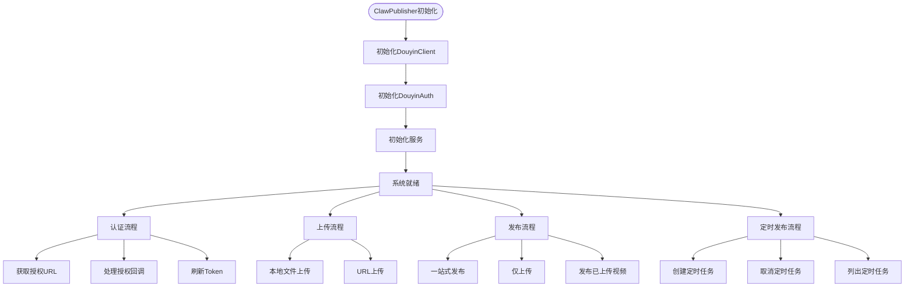

**图表来源**
- [src/index.ts:39-67](file://src/index.ts#L39-L67)
- [src/index.ts:77-112](file://src/index.ts#L77-L112)
- [src/index.ts:122-181](file://src/index.ts#L122-L181)
- [src/index.ts:191-210](file://src/index.ts#L191-L210)

**章节来源**
- [src/index.ts:29-244](file://src/index.ts#L29-L244)

### PublishService 发布服务

PublishService 作为业务编排层，负责协调视频上传和发布的完整流程。

#### 发布流程设计

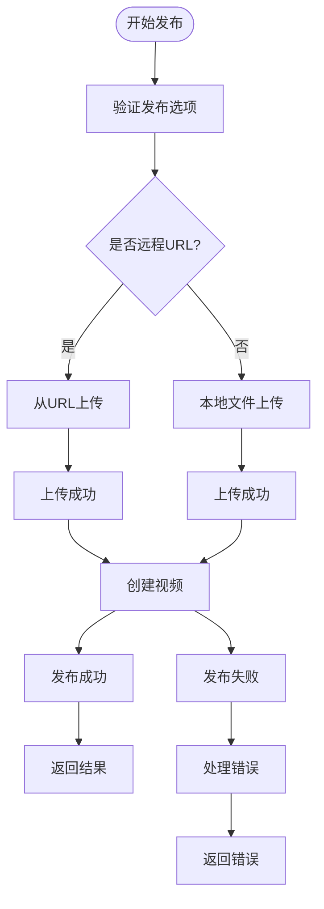

**图表来源**
- [src/services/publish-service.ts:38-80](file://src/services/publish-service.ts#L38-L80)
- [src/services/publish-service.ts:133-172](file://src/services/publish-service.ts#L133-L172)

#### 支持的发布选项

| 选项 | 类型 | 描述 | 限制 |
|------|------|------|------|
| title | string | 视频标题 | 最多55字符 |
| description | string | 视频描述 | 最多300字符 |
| hashtags | string[] | 话题标签 | 最多5个 |
| atUsers | string[] | @提及用户 | OpenID数组 |
| poiId | string | 地理位置ID | POI标识 |
| poiName | string | 地理位置名称 | 位置名称 |
| microAppId | string | 小程序ID | 商业挂载 |
| microAppTitle | string | 小程序标题 | 标题文本 |
| microAppUrl | string | 小程序链接 | URL地址 |
| articleId | string | 商品ID | 商品标识 |
| schedulePublishTime | number | 定时发布时间 | Unix时间戳 |

**章节来源**
- [src/services/publish-service.ts:38-80](file://src/services/publish-service.ts#L38-L80)
- [src/models/types.ts:101-124](file://src/models/types.ts#L101-L124)

### SchedulerService 定时发布服务

SchedulerService 基于 node-cron 实现定时发布功能，支持任务的创建、取消和查询。

#### 定时任务生命周期

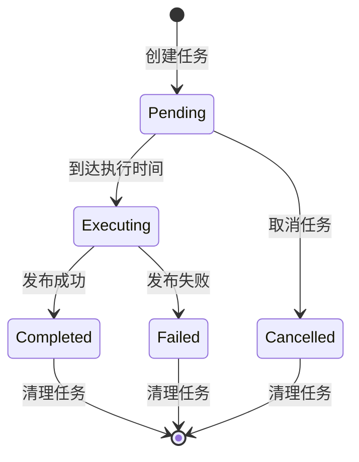

**图表来源**
- [src/services/scheduler-service.ts:11-18](file://src/services/scheduler-service.ts#L11-L18)
- [src/services/scheduler-service.ts:140-162](file://src/services/scheduler-service.ts#L140-L162)

#### 任务状态管理

| 状态 | 描述 | 处理方式 |
|------|------|----------|
| pending | 待执行 | 等待cron触发 |
| executing | 执行中 | 正在发布视频 |
| completed | 执行完成 | 发布成功 |
| failed | 执行失败 | 发布异常 |
| cancelled | 已取消 | 任务被取消 |

**章节来源**
- [src/services/scheduler-service.ts:37-72](file://src/services/scheduler-service.ts#L37-L72)
- [src/services/scheduler-service.ts:140-162](file://src/services/scheduler-service.ts#L140-L162)

### DouyinClient API客户端

DouyinClient 基于 axios 封装，提供统一的 API 调用接口和错误处理机制。

#### 请求拦截器设计

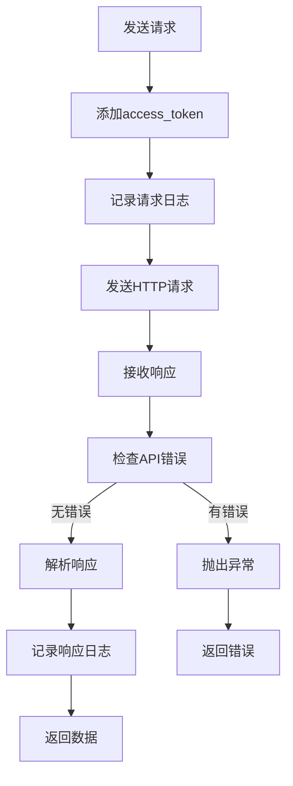

**图表来源**
- [src/api/douyin-client.ts:48-91](file://src/api/douyin-client.ts#L48-L91)
- [src/api/douyin-client.ts:124-166](file://src/api/douyin-client.ts#L124-L166)

#### 错误处理策略

| 错误类型 | 错误码 | 处理方式 |
|----------|--------|----------|
| 网络错误 | ECONNRESET, timeout | 自动重试 |
| 限流错误 | 429, 10001, 10002 | 指数退避重试 |
| 参数错误 | 其他API错误码 | 直接抛出异常 |
| 网络超时 | 超时错误 | 重试机制 |

**章节来源**
- [src/api/douyin-client.ts:97-116](file://src/api/douyin-client.ts#L97-L116)
- [src/api/douyin-client.ts:204-220](file://src/api/douyin-client.ts#L204-L220)

### DouyinAuth 认证模块

DouyinAuth 实现完整的 OAuth 2.0 流程，包括授权、Token 刷新和有效期管理。

#### OAuth 授权流程

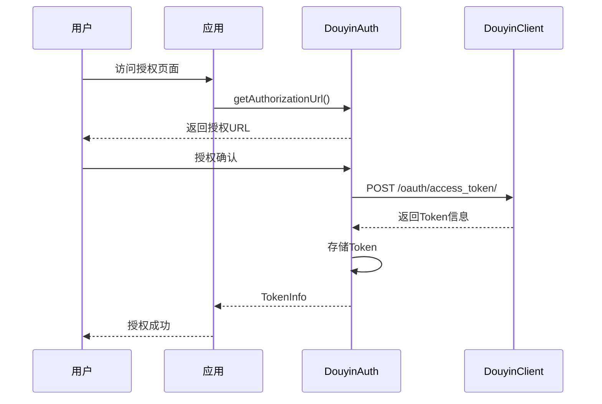

**图表来源**
- [src/api/auth.ts:45-60](file://src/api/auth.ts#L45-L60)
- [src/api/auth.ts:67-91](file://src/api/auth.ts#L67-L91)

#### Token 管理机制

| 功能 | 实现方式 | 有效期 |
|------|----------|--------|
| Token验证 | 检查expiresAt时间 | 提前5分钟过期 |
| 自动刷新 | refreshAccessToken() | 7天有效期 |
| 缓存管理 | 内存缓存 | 进程生命周期 |
| 安全存储 | setTokenInfo() | 持久化存储 |

**章节来源**
- [src/api/auth.ts:133-151](file://src/api/auth.ts#L133-L151)
- [src/api/auth.ts:165-169](file://src/api/auth.ts#L165-L169)

## 依赖关系分析

系统采用模块化设计，各组件之间的依赖关系清晰明确。

### 依赖关系图

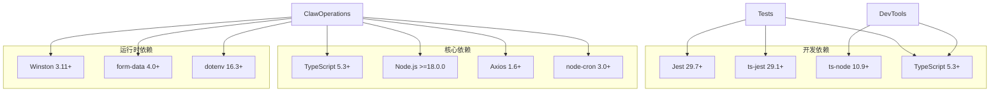

**图表来源**
- [package.json:18-33](file://package.json#L18-L33)

### 组件间耦合度分析

| 组件 | 内聚性 | 耦合度 | 设计质量 |
|------|--------|--------|----------|
| ClawPublisher | 高 | 低 | 优秀 |
| PublishService | 高 | 中 | 良好 |
| SchedulerService | 中 | 低 | 良好 |
| VideoUpload | 高 | 高 | 优秀 |
| VideoPublish | 高 | 高 | 优秀 |
| DouyinAuth | 高 | 高 | 优秀 |
| DouyinClient | 高 | 高 | 优秀 |

**章节来源**
- [package.json:18-33](file://package.json#L18-L33)

## 性能考虑

系统在设计时充分考虑了性能优化和资源管理。

### 性能优化策略

1. **分片上传优化**
   - 大文件自动分片上传（默认5MB分片）
   - 支持自定义分片大小
   - 断点续传支持

2. **并发控制**
   - 上传进度异步处理
   - 定时任务并发执行
   - API请求重试机制

3. **内存管理**
   - 临时文件自动清理
   - 进度回调避免内存泄漏
   - 任务状态压缩存储

### 性能指标

| 操作类型 | 最大文件大小 | 上传速度 | 响应时间 |
|----------|-------------|----------|----------|
| 直接上传 | 128MB | 高速 | <5s |
| 分片上传 | 4GB | 可变 | <10s |
| 定时发布 | 无限制 | 异步 | 触发时 |
| Token刷新 | 无限制 | 快速 | <2s |

**章节来源**
- [config/default.ts:10-15](file://config/default.ts#L10-L15)
- [src/api/video-upload.ts:104-152](file://src/api/video-upload.ts#L104-L152)

## 故障排除指南

### 常见问题及解决方案

#### 认证相关问题

| 问题 | 症状 | 解决方案 |
|------|------|----------|
| Token过期 | 发布失败，返回401 | 调用refreshToken() |
| 授权失败 | 无法获取授权码 | 检查redirectUri配置 |
| 作用域不足 | 权限受限 | 更新OAUTH_SCOPES |
| 网络超时 | 请求超时 | 检查网络连接 |

#### 上传相关问题

| 问题 | 症状 | 解决方案 |
|------|------|----------|
| 文件过大 | 上传失败 | 使用分片上传 |
| 格式不支持 | 验证失败 | 检查文件格式 |
| 网络中断 | 上传中断 | 检查网络稳定性 |
| 空间不足 | 服务器错误 | 清理存储空间 |

#### 发布相关问题

| 问题 | 症状 | 解决方案 |
|------|------|----------|
| 内容违规 | 发布被拒 | 检查内容合规性 |
| 标题过长 | 参数错误 | 缩短标题长度 |
| Hashtag过多 | 参数错误 | 减少标签数量 |
| 定时时间无效 | 时间错误 | 检查时间范围 |

### 调试和监控

系统提供了完善的日志记录和错误追踪机制：

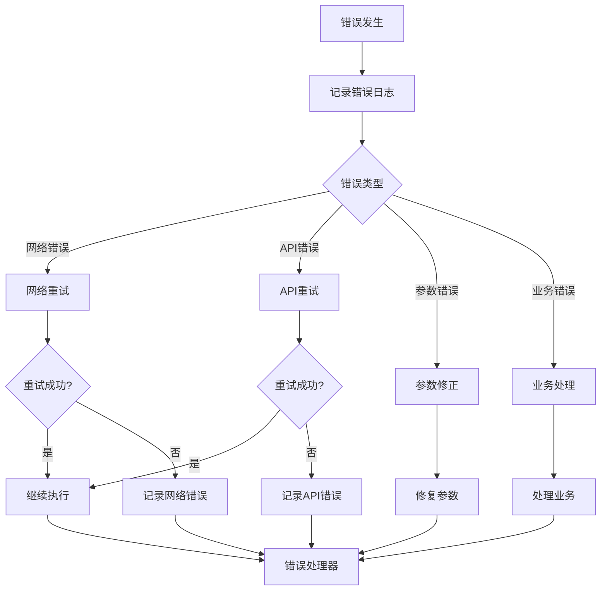

**图表来源**
- [src/api/douyin-client.ts:97-116](file://src/api/douyin-client.ts#L97-L116)
- [src/utils/validator.ts:17-39](file://src/utils/validator.ts#L17-L39)

**章节来源**
- [src/api/douyin-client.ts:97-116](file://src/api/douyin-client.ts#L97-L116)
- [src/utils/validator.ts:17-86](file://src/utils/validator.ts#L17-L86)

## 结论

发布服务协调器是一个设计精良、功能完整的抖音视频发布自动化系统。系统采用模块化架构，具有以下显著特点：

### 技术优势

1. **架构清晰** - 分层设计明确，职责分离合理
2. **功能完整** - 支持从上传到发布的完整流程
3. **扩展性强** - 模块化设计便于功能扩展
4. **可靠性高** - 完善的错误处理和重试机制
5. **易用性好** - 统一的API接口和丰富的配置选项

### 应用价值

该系统特别适用于营销账号运营场景，能够：
- 自动化视频发布流程
- 支持批量内容管理
- 提供定时发布功能
- 降低人工操作成本
- 提高内容发布的效率和一致性

### 发展建议

1. **监控增强** - 添加更详细的性能监控指标
2. **配置管理** - 实现动态配置热更新
3. **安全加固** - 加强Token和敏感信息保护
4. **国际化** - 支持多语言和多地区适配
5. **扩展接口** - 提供更多第三方集成接口

系统整体设计体现了良好的软件工程实践，为抖音内容运营提供了可靠的技术支撑。