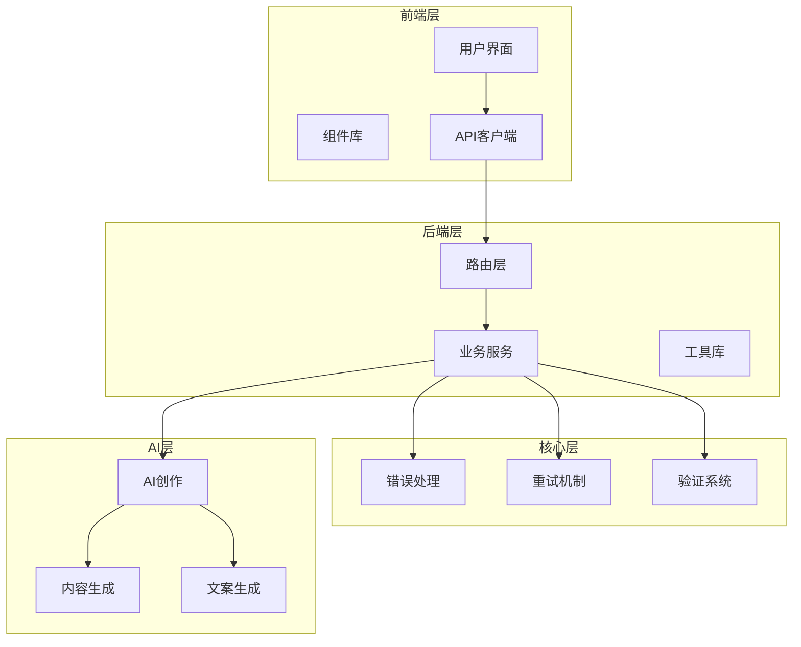
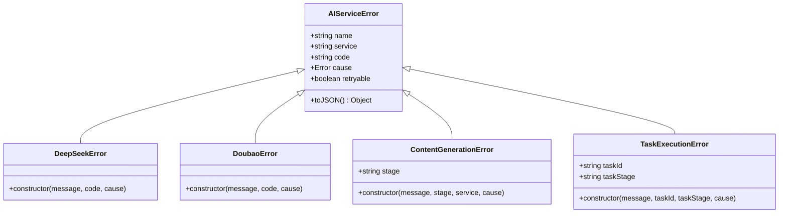
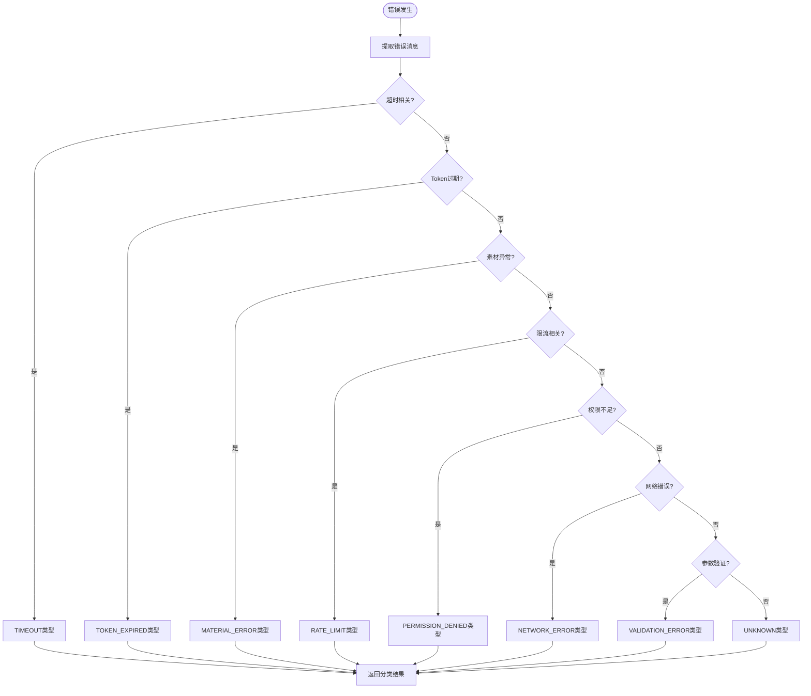
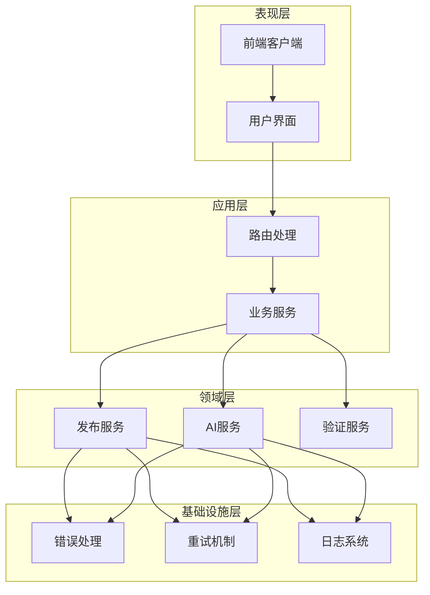
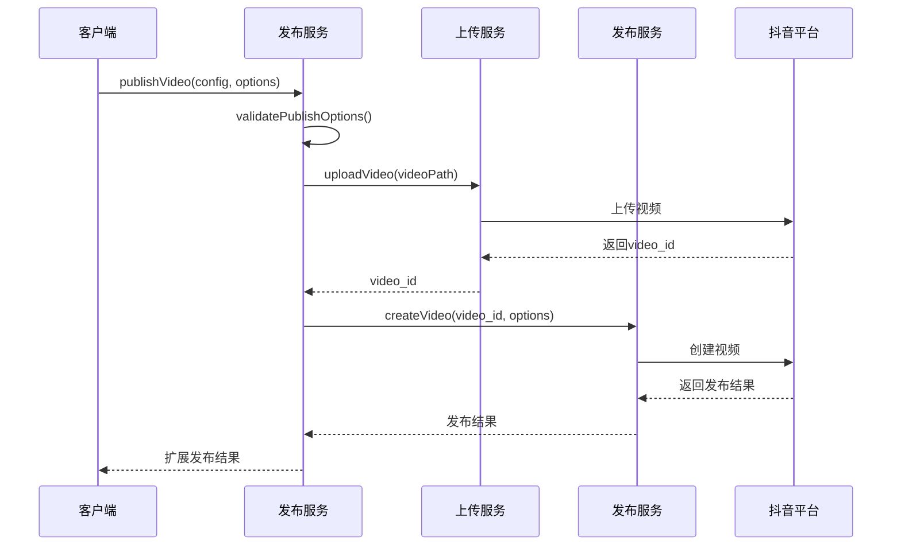
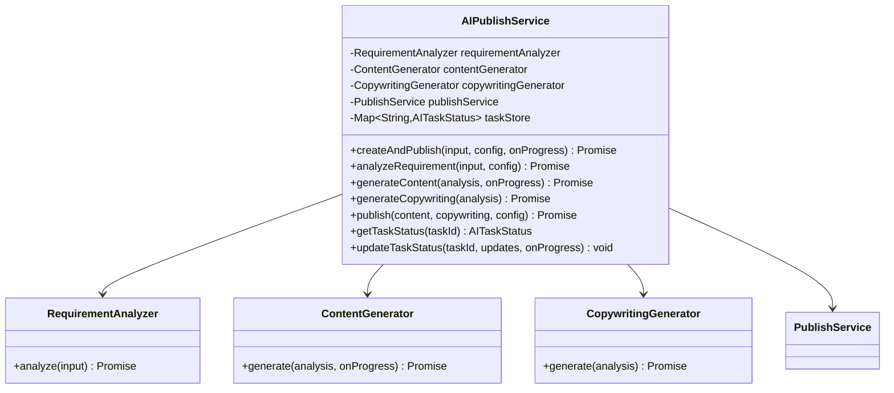
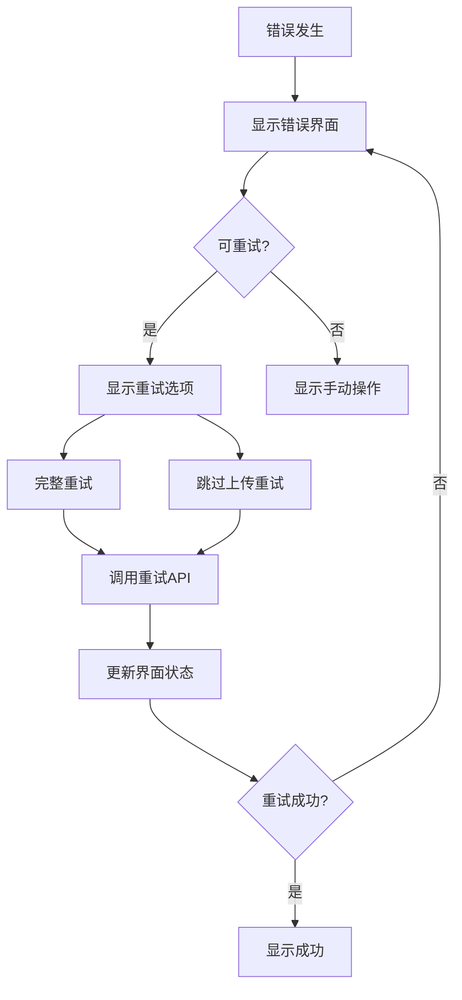
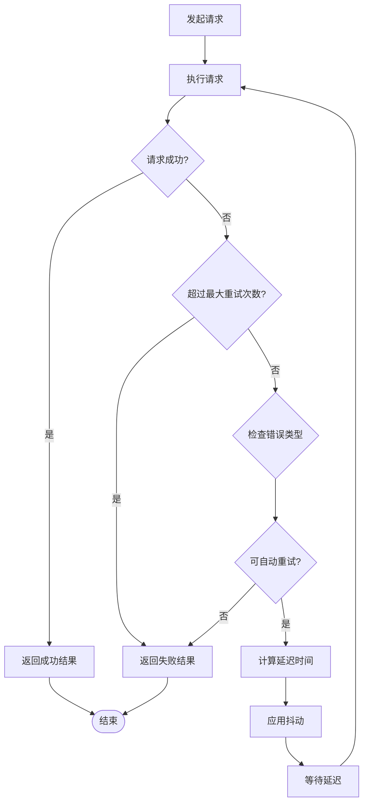
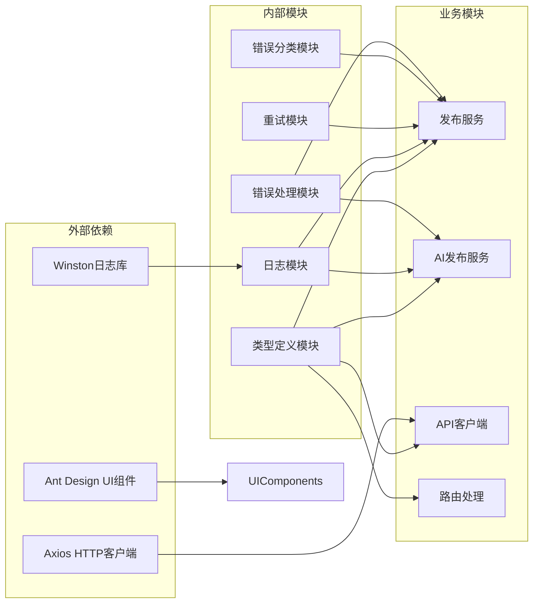

# 发布错误处理系统

<cite>
**本文档引用的文件**
- [errors.ts](file://src/utils/errors.ts)
- [error-classifier.ts](file://src/utils/error-classifier.ts)
- [publish-service.ts](file://src/services/publish-service.ts)
- [ai-publish-service.ts](file://src/services/ai-publish-service.ts)
- [types.ts](file://src/models/types.ts)
- [retry.ts](file://src/utils/retry.ts)
- [logger.ts](file://src/utils/logger.ts)
- [PublishErrorDisplay.tsx](file://web/client/src/components/publish/PublishErrorDisplay.tsx)
- [Publish.tsx](file://web/client/src/pages/Publish.tsx)
- [publish.ts](file://web/server/src/routes/publish.ts)
- [client.ts](file://web/client/src/api/client.ts)
- [video-publish.test.ts](file://tests/unit/video-publish.test.ts)
</cite>

## 目录
1. [简介](#简介)
2. [项目结构](#项目结构)
3. [核心组件](#核心组件)
4. [架构概览](#架构概览)
5. [详细组件分析](#详细组件分析)
6. [依赖关系分析](#依赖关系分析)
7. [性能考虑](#性能考虑)
8. [故障排除指南](#故障排除指南)
9. [结论](#结论)

## 简介

发布错误处理系统是一个完整的视频发布平台，专注于抖音平台的内容发布自动化。该系统提供了智能的错误分类、自动重试机制、友好的用户界面以及完善的错误处理策略。系统采用模块化设计，支持视频和图文两种发布类型，并集成了AI创作功能。

## 项目结构

该项目采用前后端分离的架构设计，主要分为以下层次：

**图表来源**
- [Publish.tsx:1-800](file://web/client/src/pages/Publish.tsx#L1-L800)
- [publish.ts:1-464](file://web/server/src/routes/publish.ts#L1-L464)
- [publish-service.ts:1-413](file://src/services/publish-service.ts#L1-L413)

**章节来源**
- [Publish.tsx:1-800](file://web/client/src/pages/Publish.tsx#L1-L800)
- [publish.ts:1-464](file://web/server/src/routes/publish.ts#L1-L464)
- [types.ts:1-682](file://src/models/types.ts#L1-L682)

## 核心组件

### 错误处理体系

系统建立了完整的错误处理体系，包括基础错误类、AI服务错误和发布错误分类：

**图表来源**
- [errors.ts:8-87](file://src/utils/errors.ts#L8-L87)

### 错误分类系统

系统实现了智能的错误分类机制，能够根据错误信息自动识别错误类型并提供相应的处理建议：

**图表来源**
- [error-classifier.ts:168-193](file://src/utils/error-classifier.ts#L168-L193)

**章节来源**
- [errors.ts:1-212](file://src/utils/errors.ts#L1-L212)
- [error-classifier.ts:1-296](file://src/utils/error-classifier.ts#L1-L296)

## 架构概览

系统采用分层架构设计，确保各层职责清晰、耦合度低：

**图表来源**
- [publish-service.ts:31-413](file://src/services/publish-service.ts#L31-L413)
- [ai-publish-service.ts:43-358](file://src/services/ai-publish-service.ts#L43-L358)

## 详细组件分析

### 发布服务组件

发布服务是系统的核心组件，负责协调整个发布流程：

**图表来源**
- [publish-service.ts:48-181](file://src/services/publish-service.ts#L48-L181)

发布服务的主要特性包括：

1. **分步骤执行**：支持从任意步骤开始执行，包括验证、上传和发布
2. **错误分类**：自动识别错误类型并提供友好的错误消息
3. **重试机制**：支持自动重试和手动重试
4. **进度跟踪**：实时跟踪每个步骤的执行进度

**章节来源**
- [publish-service.ts:1-413](file://src/services/publish-service.ts#L1-L413)

### AI发布服务组件

AI发布服务集成了需求分析、内容生成、文案生成和发布功能：

**图表来源**
- [ai-publish-service.ts:43-358](file://src/services/ai-publish-service.ts#L43-L358)

**章节来源**
- [ai-publish-service.ts:1-358](file://src/services/ai-publish-service.ts#L1-L358)

### 错误处理组件

前端错误处理组件提供了直观的错误展示和重试功能：

**图表来源**
- [PublishErrorDisplay.tsx:141-294](file://web/client/src/components/publish/PublishErrorDisplay.tsx#L141-L294)

**章节来源**
- [PublishErrorDisplay.tsx:1-297](file://web/client/src/components/publish/PublishErrorDisplay.tsx#L1-L297)

### 重试机制组件

系统实现了智能的重试机制，支持指数退避算法：

**图表来源**
- [error-classifier.ts:250-286](file://src/utils/error-classifier.ts#L250-L286)

**章节来源**
- [retry.ts:1-84](file://src/utils/retry.ts#L1-L84)
- [error-classifier.ts:250-286](file://src/utils/error-classifier.ts#L250-L286)

## 依赖关系分析

系统采用了清晰的依赖关系设计，确保模块间的松耦合：

**图表来源**
- [client.ts:1-474](file://web/client/src/api/client.ts#L1-L474)
- [logger.ts:1-61](file://src/utils/logger.ts#L1-L61)

**章节来源**
- [client.ts:1-474](file://web/client/src/api/client.ts#L1-L474)
- [logger.ts:1-61](file://src/utils/logger.ts#L1-L61)

## 性能考虑

系统在设计时充分考虑了性能优化：

1. **指数退避算法**：避免对平台造成过大压力
2. **智能重试判断**：只对可重试的错误进行重试
3. **进度缓存**：避免重复执行已完成的步骤
4. **并发控制**：合理控制同时进行的任务数量
5. **资源清理**：及时清理临时文件和内存资源

## 故障排除指南

### 常见错误类型及解决方案

| 错误类型 | 可重试 | 建议操作 | 处理方式 |
|---------|--------|----------|----------|
| 超时 | 是 | 检查网络连接，稍后重试 | 系统自动重试 |
| Token过期 | 是 | 重新授权抖音账号 | 引导用户重新授权 |
| 素材异常 | 否 | 检查文件格式、大小和完整性 | 手动修复后重试 |
| 平台限流 | 是 | 等待几分钟后再试 | 系统自动重试 |
| 权限不足 | 否 | 检查抖音开放平台权限配置 | 手动配置权限 |
| 网络错误 | 是 | 检查网络连接后重试 | 系统自动重试 |
| 参数验证错误 | 否 | 检查并修正输入参数 | 手动修正后重试 |

### 调试和监控

系统提供了完善的调试和监控功能：

1. **日志记录**：详细的执行日志和错误日志
2. **进度跟踪**：实时显示每个步骤的执行进度
3. **错误分类**：自动识别错误类型并提供处理建议
4. **重试统计**：记录每次重试的结果和原因

**章节来源**
- [Publish.tsx:346-397](file://web/client/src/pages/Publish.tsx#L346-L397)
- [logger.ts:31-55](file://src/utils/logger.ts#L31-L55)

## 结论

发布错误处理系统是一个设计精良、功能完整的视频发布平台。系统通过以下关键特性确保了高可靠性和良好的用户体验：

1. **智能错误分类**：基于正则表达式的错误识别机制
2. **灵活的重试策略**：指数退避算法和智能重试判断
3. **完整的错误处理**：从底层错误到用户界面的全链路处理
4. **友好的用户界面**：直观的错误展示和操作引导
5. **完善的监控机制**：详细的日志记录和进度跟踪

该系统为视频内容发布提供了可靠的基础设施，能够有效处理各种网络和平台相关的错误，确保发布流程的稳定性和成功率。