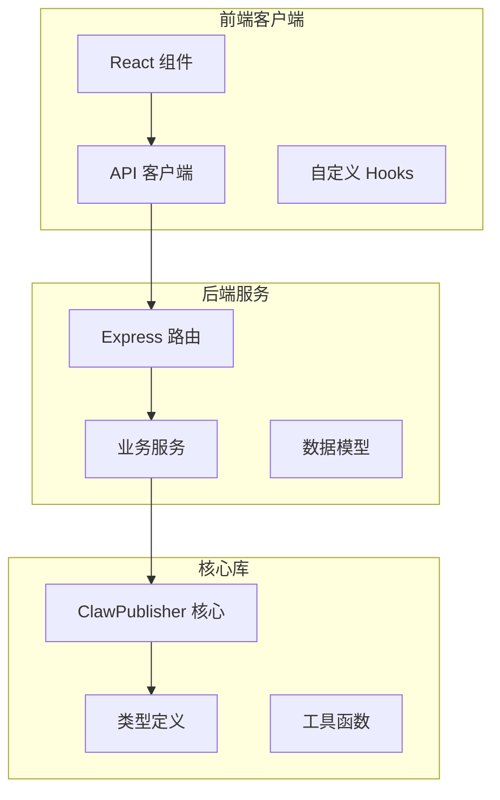
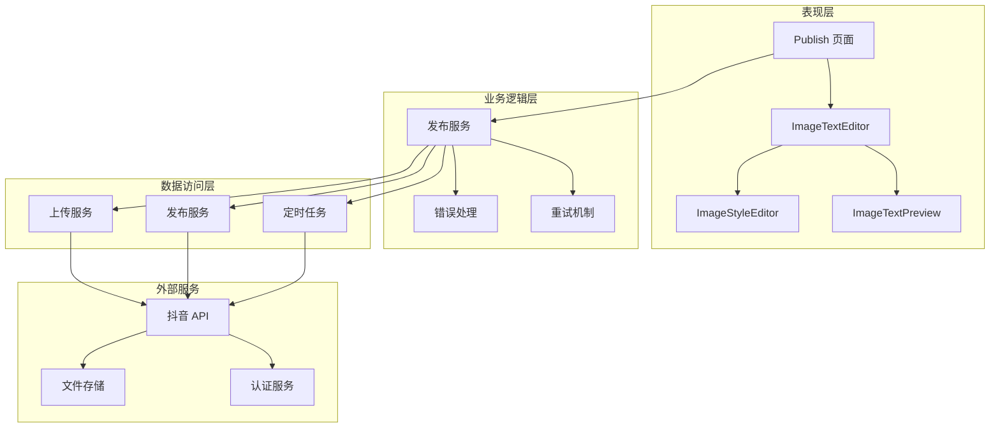
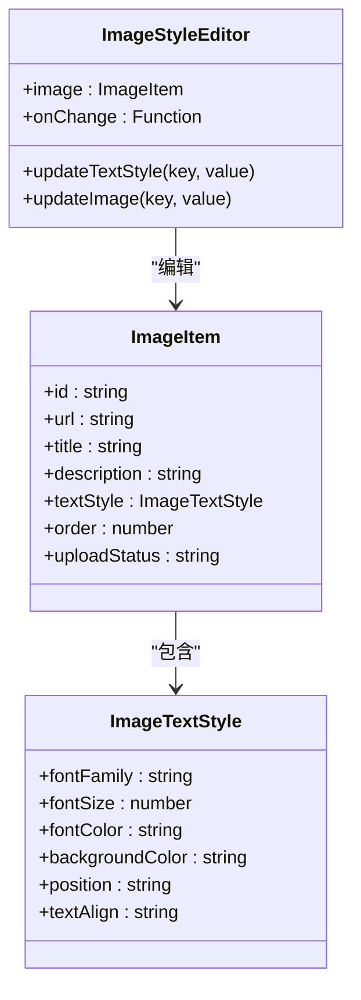
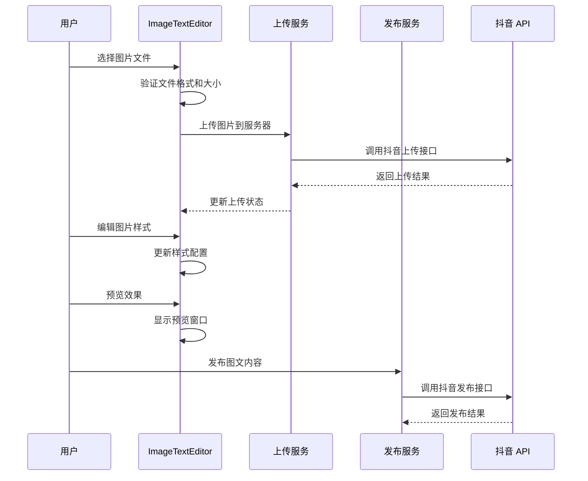
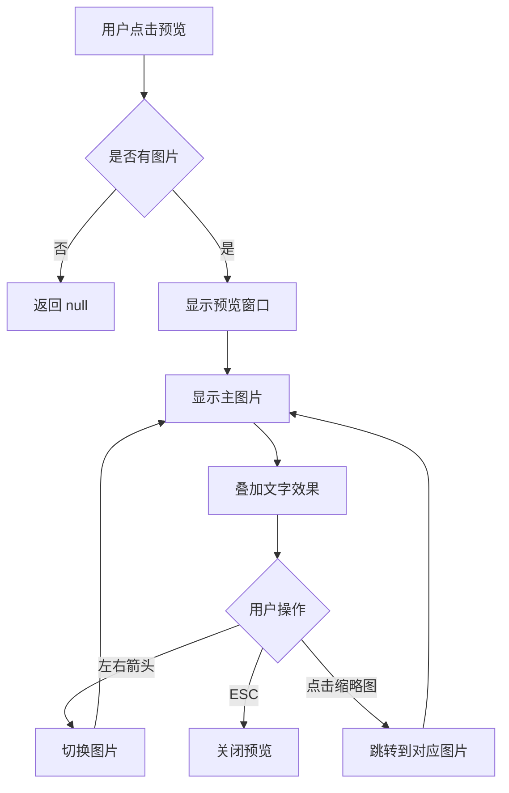
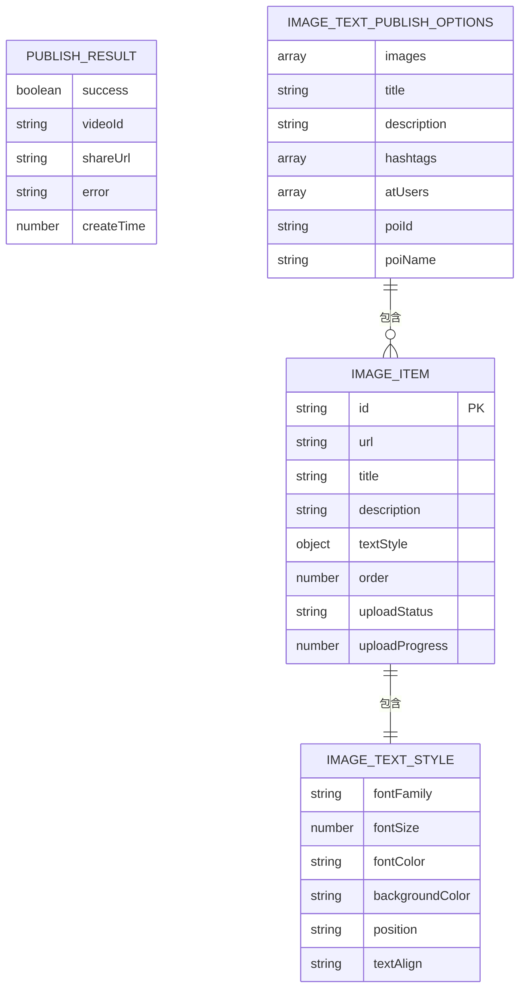
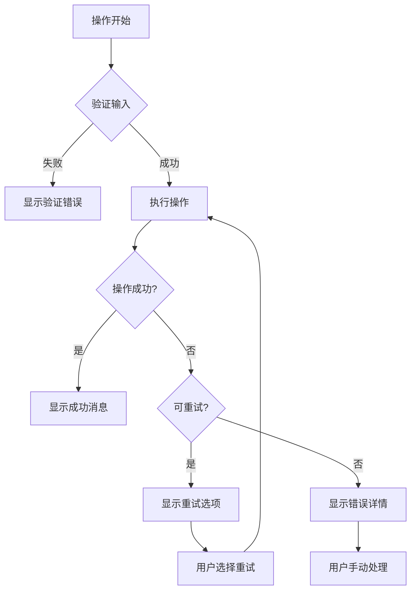

# 图像编辑组件

<cite>
**本文档引用的文件**
- [ImageStyleEditor.tsx](file://web/client/src/components/publish/ImageStyleEditor.tsx)
- [ImageTextEditor.tsx](file://web/client/src/components/publish/ImageTextEditor.tsx)
- [ImageTextPreview.tsx](file://web/client/src/components/publish/ImageTextPreview.tsx)
- [Publish.tsx](file://web/client/src/pages/Publish.tsx)
- [types.ts](file://src/models/types.ts)
- [client.ts](file://web/client/src/api/client.ts)
- [publish.ts](file://web/server/src/routes/publish.ts)
- [publisher.ts](file://web/server/src/services/publisher.ts)
- [publish-service.ts](file://src/services/publish-service.ts)
- [index.ts](file://src/index.ts)
- [PublishErrorDisplay.tsx](file://web/client/src/components/publish/PublishErrorDisplay.tsx)
- [useCreationWorkflow.ts](file://web/client/src/hooks/useCreationWorkflow.ts)
</cite>

## 目录
1. [简介](#简介)
2. [项目结构](#项目结构)
3. [核心组件](#核心组件)
4. [架构概览](#架构概览)
5. [详细组件分析](#详细组件分析)
6. [依赖关系分析](#依赖关系分析)
7. [性能考虑](#性能考虑)
8. [故障排除指南](#故障排除指南)
9. [结论](#结论)

## 简介

图像编辑组件是基于 React 和 Ant Design 构建的现代化图片编辑工具，专为抖音内容创作者设计。该组件提供了直观的图片上传、样式编辑、预览和发布功能，支持多图片批量处理和实时预览效果。

组件采用分层架构设计，包括前端界面层、API 通信层、业务逻辑层和后端服务层，确保了良好的可维护性和扩展性。

## 项目结构

该项目采用前后端分离的架构，主要分为以下层次：



**图表来源**
- [ImageTextEditor.tsx:1-490](file://web/client/src/components/publish/ImageTextEditor.tsx#L1-L490)
- [publish.ts:1-464](file://web/server/src/routes/publish.ts#L1-L464)
- [index.ts:1-270](file://src/index.ts#L1-L270)

**章节来源**
- [ImageTextEditor.tsx:1-490](file://web/client/src/components/publish/ImageTextEditor.tsx#L1-L490)
- [types.ts:1-682](file://src/models/types.ts#L1-L682)

## 核心组件

图像编辑组件的核心功能围绕三个主要组件构建：

### 1. 图片样式编辑器
提供丰富的图片样式定制功能，包括字体、字号、颜色、位置和对齐方式的实时预览。

### 2. 图片文本编辑器
支持多图片上传、拖拽排序、批量编辑和实时预览的综合编辑界面。

### 3. 图片文本预览器
提供全屏预览模式，支持键盘快捷键操作和缩略图导航。

**章节来源**
- [ImageStyleEditor.tsx:25-295](file://web/client/src/components/publish/ImageStyleEditor.tsx#L25-L295)
- [ImageTextEditor.tsx:48-490](file://web/client/src/components/publish/ImageTextEditor.tsx#L48-L490)
- [ImageTextPreview.tsx:12-259](file://web/client/src/components/publish/ImageTextPreview.tsx#L12-L259)

## 架构概览

整个图像编辑系统采用分层架构，确保各层职责清晰分离：



**图表来源**
- [Publish.tsx:58-973](file://web/client/src/pages/Publish.tsx#L58-L973)
- [publish-service.ts:31-413](file://src/services/publish-service.ts#L31-L413)
- [publisher.ts:117-214](file://web/server/src/services/publisher.ts#L117-L214)

## 详细组件分析

### ImageStyleEditor 组件分析

ImageStyleEditor 是图像编辑的核心组件，提供了完整的样式编辑功能：



**图表来源**
- [ImageStyleEditor.tsx:25-295](file://web/client/src/components/publish/ImageStyleEditor.tsx#L25-L295)
- [types.ts:418-460](file://src/models/types.ts#L418-L460)

#### 核心功能特性

1. **实时预览系统**：编辑器提供实时预览功能，用户可以即时看到样式变化效果
2. **多种字体支持**：内置多种字体选项，包括中文字体和英文字体
3. **颜色选择器**：集成 Ant Design 的 ColorPicker 组件，支持 RGBA 颜色选择
4. **位置控制**：支持顶部、居中、底部三种文字位置布局
5. **对齐方式**：提供左对齐、居中、右对齐三种对齐方式

**章节来源**
- [ImageStyleEditor.tsx:49-295](file://web/client/src/components/publish/ImageStyleEditor.tsx#L49-L295)

### ImageTextEditor 组件分析

ImageTextEditor 是多图片编辑的综合界面，集成了上传、排序、编辑、预览等功能：



**图表来源**
- [ImageTextEditor.tsx:219-490](file://web/client/src/components/publish/ImageTextEditor.tsx#L219-L490)
- [client.ts:101-161](file://web/client/src/api/client.ts#L101-L161)

#### 主要功能模块

1. **文件上传处理**：支持多格式图片上传，包含文件验证和进度跟踪
2. **拖拽排序**：基于 @dnd-kit 的拖拽排序功能
3. **批量编辑**：支持多图片同时编辑和样式统一设置
4. **实时预览**：提供全屏预览模式，支持键盘快捷键操作

**章节来源**
- [ImageTextEditor.tsx:219-490](file://web/client/src/components/publish/ImageTextEditor.tsx#L219-L490)

### ImageTextPreview 组件分析

ImageTextPreview 提供了完整的图片预览功能，支持多种交互方式：



**图表来源**
- [ImageTextPreview.tsx:20-259](file://web/client/src/components/publish/ImageTextPreview.tsx#L20-L259)

#### 预览功能特性

1. **全屏显示**：支持全屏模式展示图片内容
2. **键盘导航**：支持左右箭头键和 ESC 键操作
3. **缩略图导航**：底部提供缩略图快速切换
4. **文字叠加**：支持在预览图片上叠加编辑的文字效果

**章节来源**
- [ImageTextPreview.tsx:20-259](file://web/client/src/components/publish/ImageTextPreview.tsx#L20-L259)

### 数据模型和类型定义

系统使用 TypeScript 类型定义确保数据结构的一致性和安全性：



**图表来源**
- [types.ts:418-484](file://src/models/types.ts#L418-L484)

**章节来源**
- [types.ts:418-484](file://src/models/types.ts#L418-L484)

## 依赖关系分析

图像编辑组件的依赖关系体现了清晰的分层架构：

```mermaid
graph LR
subgraph "前端依赖"
A[React]
B[Ant Design]
C[@dnd-kit/core]
D[axios]
end
subgraph "后端依赖"
E[Express]
F[ClawPublisher]
G[Node FS]
H[HTTPS]
end
subgraph "类型定义"
I[TypeScript Types]
J[接口契约]
end
A --> B
A --> C
A --> D
E --> F
F --> G
F --> H
I --> J
D --> E
B --> I
C --> I
```

**图表来源**
- [client.ts:1-474](file://web/client/src/api/client.ts#L1-L474)
- [index.ts:1-270](file://src/index.ts#L1-L270)

### 核心依赖关系

1. **前端框架依赖**：React + Ant Design 提供基础 UI 组件
2. **拖拽功能依赖**：@dnd-kit 提供现代化的拖拽体验
3. **HTTP 通信依赖**：Axios 处理前后端通信
4. **后端服务依赖**：ClawPublisher 核心库提供业务逻辑

**章节来源**
- [client.ts:1-474](file://web/client/src/api/client.ts#L1-L474)
- [index.ts:1-270](file://src/index.ts#L1-L270)

## 性能考虑

图像编辑组件在设计时充分考虑了性能优化：

### 1. 文件上传优化
- **分块上传**：支持大文件分块上传，提高上传稳定性
- **进度反馈**：实时显示上传进度，提升用户体验
- **并发控制**：限制同时上传的文件数量，避免资源竞争

### 2. 内存管理
- **对象 URL**：使用 URL.createObjectURL 创建临时预览链接
- **及时清理**：上传完成后及时释放内存资源
- **虚拟滚动**：大量图片时使用虚拟滚动减少 DOM 节点

### 3. 渲染优化
- **状态分离**：将编辑状态和预览状态分离，避免不必要的重渲染
- **防抖处理**：对频繁触发的操作使用防抖优化
- **懒加载**：图片预览采用懒加载策略

## 故障排除指南

### 常见问题及解决方案

#### 1. 图片上传失败
**症状**：图片上传进度卡住或显示错误
**原因**：
- 网络连接不稳定
- 文件格式不支持
- 文件大小超出限制

**解决方法**：
- 检查网络连接状态
- 确认文件格式为 JPG/PNG/GIF/WebP
- 确认文件大小不超过 20MB

#### 2. 样式编辑不生效
**症状**：修改样式后预览无变化
**原因**：
- 状态更新未正确触发
- 样式计算逻辑错误

**解决方法**：
- 检查 onChange 回调函数
- 验证样式计算逻辑
- 刷新页面重新加载

#### 3. 预览功能异常
**症状**：预览窗口无法正常显示
**原因**：
- 事件监听器未正确绑定
- DOM 元素未正确渲染

**解决方法**：
- 检查事件绑定代码
- 验证 DOM 结构完整性
- 确认样式计算正确

**章节来源**
- [PublishErrorDisplay.tsx:141-297](file://web/client/src/components/publish/PublishErrorDisplay.tsx#L141-L297)

### 错误处理机制

系统实现了完善的错误处理机制：



**图表来源**
- [PublishErrorDisplay.tsx:141-297](file://web/client/src/components/publish/PublishErrorDisplay.tsx#L141-L297)

## 结论

图像编辑组件是一个功能完整、架构清晰的现代化图片编辑工具。通过合理的分层设计和丰富的功能特性，为用户提供了优秀的图片编辑体验。

### 主要优势

1. **用户体验优秀**：直观的界面设计和流畅的交互体验
2. **功能丰富完整**：支持多图片编辑、样式定制、实时预览等核心功能
3. **架构设计合理**：清晰的分层架构确保了良好的可维护性
4. **性能优化到位**：多项性能优化措施提升了整体运行效率

### 技术亮点

1. **现代化技术栈**：基于 React 18 和 TypeScript 的现代开发实践
2. **组件化设计**：高度模块化的组件设计便于复用和维护
3. **完善的错误处理**：全面的错误处理和重试机制提升系统稳定性
4. **类型安全保证**：完整的 TypeScript 类型定义确保代码质量

该组件为抖音内容创作者提供了强大的图片编辑工具，通过持续的功能优化和技术升级，将继续为用户提供更好的服务体验。