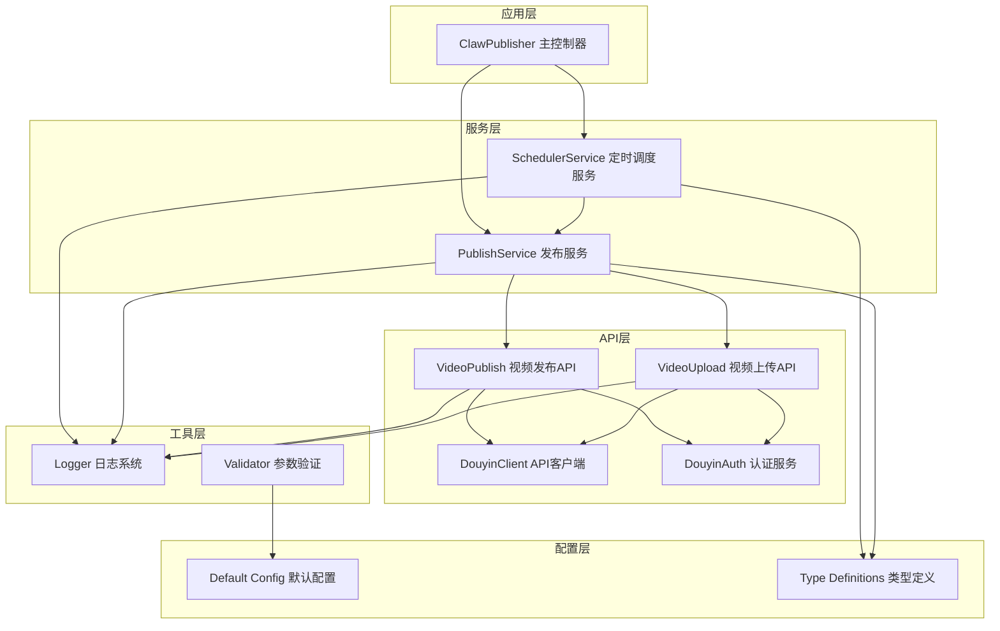
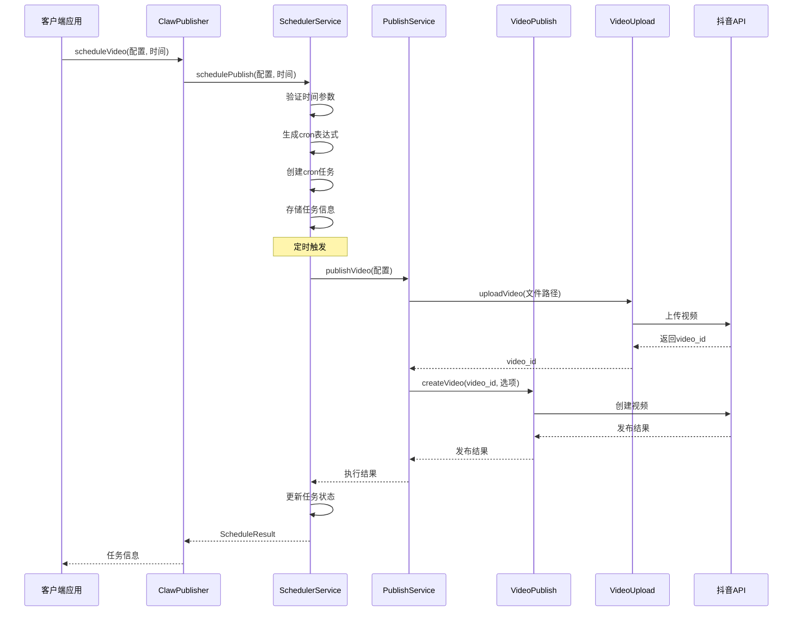
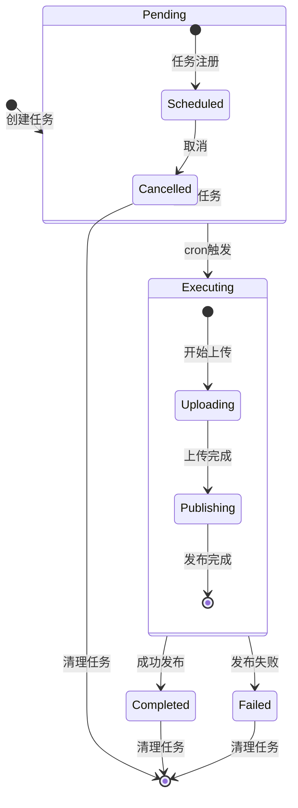
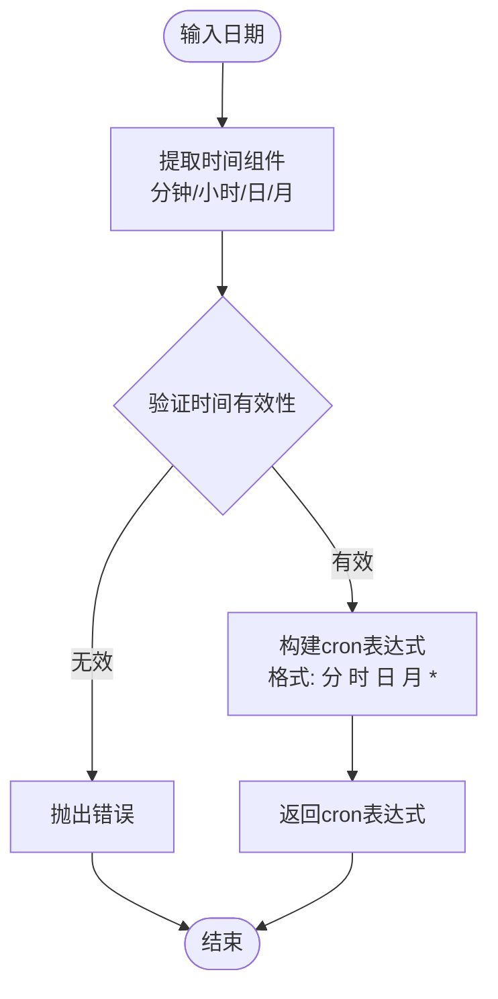
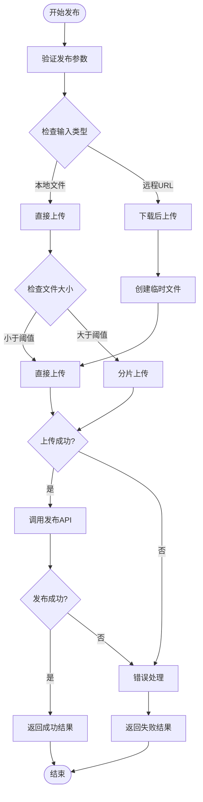
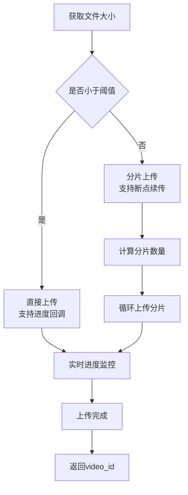
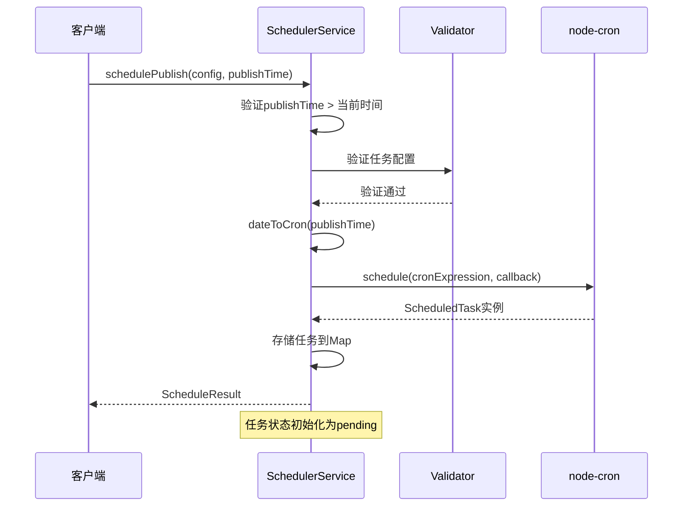
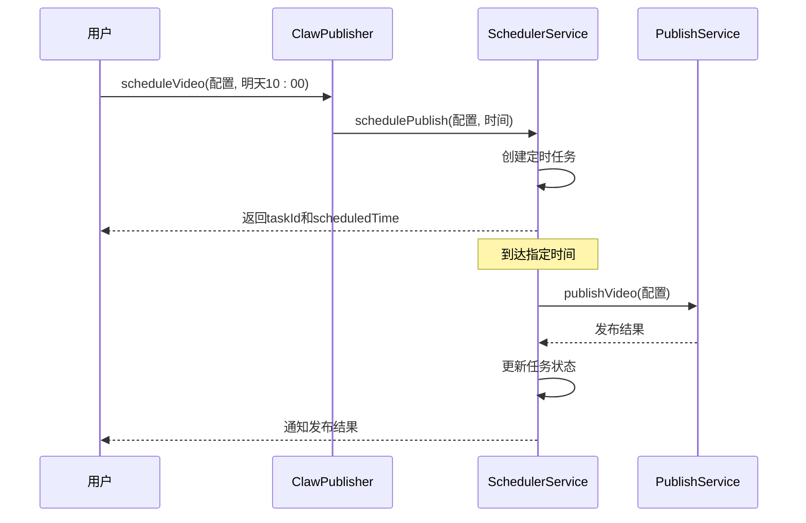
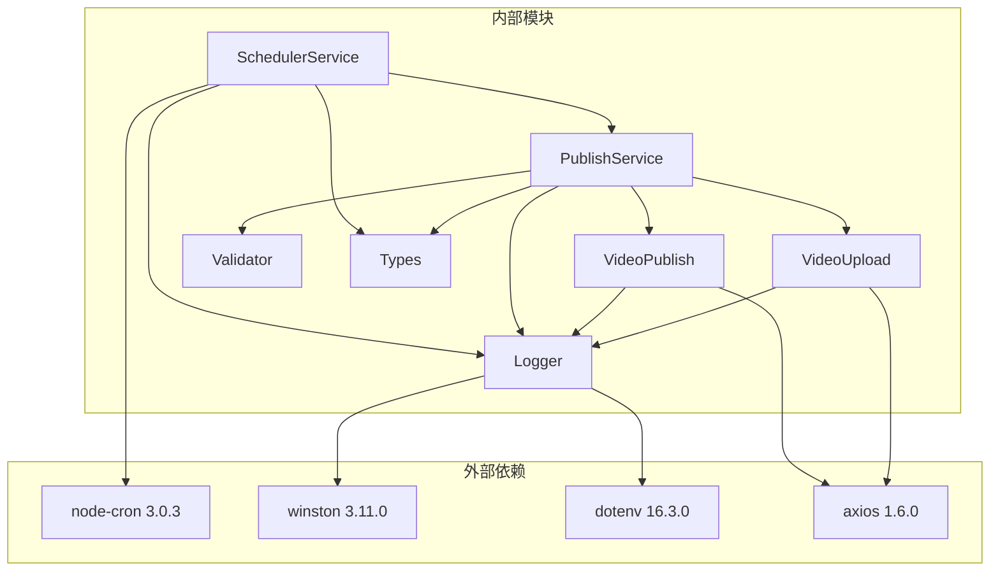
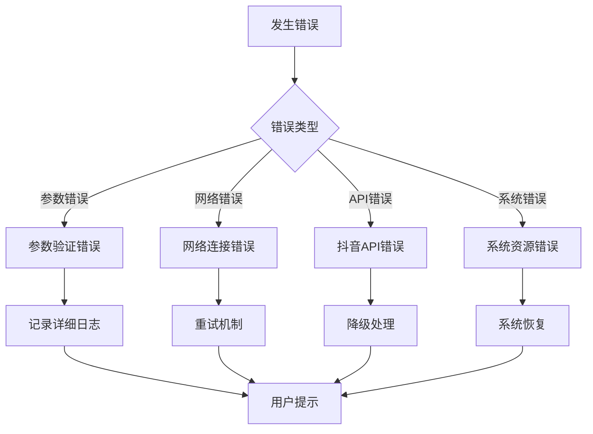

# 定时调度服务模块

<cite>
**本文档引用的文件**
- [scheduler-service.ts](file://src/services/scheduler-service.ts)
- [publish-service.ts](file://src/services/publish-service.ts)
- [types.ts](file://src/models/types.ts)
- [logger.ts](file://src/utils/logger.ts)
- [video-publish.ts](file://src/api/video-publish.ts)
- [video-upload.ts](file://src/api/video-upload.ts)
- [validator.ts](file://src/utils/validator.ts)
- [default.ts](file://config/default.ts)
- [index.ts](file://src/index.ts)
- [package.json](file://package.json)
- [example.ts](file://example.ts)
- [README.md](file://README.md)
</cite>

## 目录
1. [简介](#简介)
2. [项目结构](#项目结构)
3. [核心组件](#核心组件)
4. [架构概览](#架构概览)
5. [详细组件分析](#详细组件分析)
6. [依赖关系分析](#依赖关系分析)
7. [性能考虑](#性能考虑)
8. [故障排除指南](#故障排除指南)
9. [结论](#结论)
10. [附录](#附录)

## 简介

定时调度服务模块是ClawOperations系统的核心组件之一，专门负责视频内容的定时发布和任务管理。该模块基于node-cron库实现了精确的时间调度机制，结合发布服务提供了完整的视频内容自动化发布解决方案。

本模块的主要功能包括：
- 基于cron表达式的精确时间调度
- 任务的创建、修改、暂停和删除操作
- 任务状态监控和结果反馈机制
- 与发布服务的深度集成
- 任务队列管理和持久化策略
- 高可用部署和任务冲突处理

## 项目结构

ClawOperations项目采用模块化的架构设计，定时调度服务模块位于`src/services/`目录下，与API层、工具类和配置文件形成清晰的层次结构。

**图表来源**
- [index.ts:29-67](file://src/index.ts#L29-L67)
- [scheduler-service.ts:23-29](file://src/services/scheduler-service.ts#L23-L29)
- [publish-service.ts:22-31](file://src/services/publish-service.ts#L22-L31)

**章节来源**
- [index.ts:1-248](file://src/index.ts#L1-L248)
- [package.json:1-34](file://package.json#L1-L34)

## 核心组件

定时调度服务模块由多个核心组件构成，每个组件都有明确的职责分工和协作关系。

### SchedulerService - 定时调度服务

SchedulerService是整个模块的核心，负责任务的生命周期管理。它维护了一个内存中的任务映射表，使用Map数据结构存储所有活跃的定时任务。

**主要特性：**
- 基于node-cron的精确时间调度
- 任务状态跟踪（pending/completed/failed/cancelled）
- 任务取消和清理机制
- 与发布服务的无缝集成

### PublishService - 发布服务

PublishService作为业务编排层，负责协调视频上传和发布的完整流程。它封装了复杂的业务逻辑，包括文件验证、上传策略选择和发布参数构建。

**核心功能：**
- 一站式发布流程（上传+发布）
- 分片上传和直接上传的智能选择
- 进度监控和错误处理
- 远程URL视频的下载和发布

### 类型系统

系统采用了严格的类型定义，确保代码的类型安全性和可维护性。核心类型包括发布任务配置、发布结果和定时发布结果等。

**章节来源**
- [scheduler-service.ts:23-202](file://src/services/scheduler-service.ts#L23-L202)
- [publish-service.ts:22-228](file://src/services/publish-service.ts#L22-L228)
- [types.ts:158-189](file://src/models/types.ts#L158-L189)

## 架构概览

定时调度服务模块采用分层架构设计，各层之间职责清晰，耦合度低，便于维护和扩展。

**图表来源**
- [index.ts:191-193](file://src/index.ts#L191-L193)
- [scheduler-service.ts:37-72](file://src/services/scheduler-service.ts#L37-L72)
- [publish-service.ts:38-80](file://src/services/publish-service.ts#L38-L80)

## 详细组件分析

### SchedulerService 组件分析

SchedulerService实现了完整的任务管理功能，包括任务创建、执行、状态跟踪和清理。

#### 任务生命周期管理

**图表来源**
- [scheduler-service.ts:11-18](file://src/services/scheduler-service.ts#L11-L18)
- [scheduler-service.ts:140-162](file://src/services/scheduler-service.ts#L140-L162)

#### Cron表达式解析算法

SchedulerService实现了将日期时间转换为cron表达式的算法：

**图表来源**
- [scheduler-service.ts:169-176](file://src/services/scheduler-service.ts#L169-L176)

#### 任务状态管理

SchedulerService维护了完整的任务状态跟踪机制：

| 状态 | 描述 | 典型场景 |
|------|------|----------|
| pending | 待执行 | 任务刚创建，等待触发 |
| executing | 执行中 | 正在进行视频上传和发布 |
| completed | 已完成 | 发布成功，任务结束 |
| failed | 执行失败 | 发布过程中出现错误 |
| cancelled | 已取消 | 用户主动取消任务 |

**章节来源**
- [scheduler-service.ts:11-18](file://src/services/scheduler-service.ts#L11-L18)
- [scheduler-service.ts:169-176](file://src/services/scheduler-service.ts#L169-L176)
- [scheduler-service.ts:181-188](file://src/services/scheduler-service.ts#L181-L188)

### PublishService 组件分析

PublishService作为业务编排层，实现了复杂的视频发布流程管理。

#### 发布流程编排

**图表来源**
- [publish-service.ts:38-80](file://src/services/publish-service.ts#L38-L80)
- [video-upload.ts:35-54](file://src/api/video-upload.ts#L35-L54)

#### 上传策略选择算法

PublishService根据文件大小智能选择上传方式：

**图表来源**
- [video-upload.ts:49-53](file://src/api/video-upload.ts#L49-L53)
- [default.ts:10-15](file://config/default.ts#L10-L15)

**章节来源**
- [publish-service.ts:38-80](file://src/services/publish-service.ts#L38-L80)
- [video-upload.ts:35-54](file://src/api/video-upload.ts#L35-L54)
- [default.ts:10-15](file://config/default.ts#L10-L15)

### 任务管理操作详解

#### 任务创建流程

任务创建是整个调度系统的核心入口，涉及多个验证步骤和状态初始化。

**图表来源**
- [scheduler-service.ts:37-72](file://src/services/scheduler-service.ts#L37-L72)
- [validator.ts:45-86](file://src/utils/validator.ts#L45-L86)

#### 任务取消机制

SchedulerService提供了完善的任务取消功能，确保系统资源的有效管理。

**取消流程特点：**
- 状态检查：只允许取消pending状态的任务
- 资源清理：停止cron任务并释放相关资源
- 状态更新：将任务标记为cancelled状态
- 日志记录：记录取消操作的详细信息

#### 任务查询和监控

系统提供了多种任务查询方式，满足不同场景下的监控需求。

**查询功能：**
- 单个任务查询：根据taskId获取任务详情
- 全部任务查询：获取所有待发布任务列表
- 状态过滤：按任务状态筛选任务
- 排序功能：按发布时间排序显示

**章节来源**
- [scheduler-service.ts:79-97](file://src/services/scheduler-service.ts#L79-L97)
- [scheduler-service.ts:103-134](file://src/services/scheduler-service.ts#L103-L134)

### 定时发布示例

系统提供了丰富的定时发布示例，展示不同时间点和频率的调度配置。

#### 基础定时发布示例

**图表来源**
- [example.ts:100-127](file://example.ts#L100-L127)
- [index.ts:191-193](file://src/index.ts#L191-L193)

#### 高级定时发布配置

系统支持复杂的定时发布配置，包括地理位置、小程序挂载、商品链接等多种高级选项。

**高级配置示例：**
- 定时发布时间：支持未来7天内的任意时间点
- 地理位置：支持POI ID和POI名称的精确定位
- 社交互动：支持@提及用户和话题标签
- 商业功能：支持小程序挂载和商品链接

**章节来源**
- [example.ts:77-96](file://example.ts#L77-L96)
- [video-publish.ts:118-122](file://src/api/video-publish.ts#L118-L122)

### 任务队列管理策略

SchedulerService实现了高效的内存任务队列管理，采用Map数据结构确保O(1)级别的任务查找和操作。

#### 内存队列设计

| 操作 | 数据结构 | 时间复杂度 | 空间复杂度 |
|------|----------|------------|------------|
| 任务创建 | Map<taskId, Task> | O(1) | O(n) |
| 任务查询 | Map.get() | O(1) | O(1) |
| 任务删除 | Map.delete() | O(1) | O(1) |
| 遍历查询 | Map.values() | O(n) | O(n) |

#### 任务清理机制

系统提供了定期清理已完成任务的功能，防止内存泄漏和资源浪费。

**清理策略：**
- 自动清理：completed和cancelled状态的任务
- 手动清理：支持按需清理特定任务
- 内存保护：防止无限增长的任务队列

**章节来源**
- [scheduler-service.ts:181-188](file://src/services/scheduler-service.ts#L181-L188)

## 依赖关系分析

定时调度服务模块的依赖关系清晰明确，遵循了单一职责原则和依赖倒置原则。

**图表来源**
- [package.json:14-20](file://package.json#L14-L20)
- [scheduler-service.ts:1-6](file://src/services/scheduler-service.ts#L1-L6)
- [publish-service.ts:1-17](file://src/services/publish-service.ts#L1-L17)

### 外部依赖分析

**核心外部依赖：**
- **node-cron**: 提供cron表达式解析和任务调度功能
- **winston**: 提供结构化日志记录功能
- **axios**: 提供HTTP客户端功能
- **dotenv**: 提供环境变量管理功能

**版本兼容性：**
- Node.js >= 18.0.0
- TypeScript 5.3.0
- Jest 29.7.0（测试框架）

**章节来源**
- [package.json:14-32](file://package.json#L14-L32)

## 性能考虑

定时调度服务模块在设计时充分考虑了性能优化和资源管理。

### 内存优化策略

**任务对象优化：**
- 使用轻量级接口定义任务结构
- 避免不必要的数据复制和深拷贝
- 及时清理已完成任务释放内存

**缓存机制：**
- 任务状态缓存在内存中
- 避免重复的API调用和文件操作
- 合理的缓存失效策略

### 并发处理能力

**异步处理：**
- 所有I/O操作采用异步非阻塞模式
- 上传和发布操作支持并发执行
- 错误处理采用Promise链式调用

**资源限制：**
- 文件大小限制防止内存溢出
- 任务数量上限防止系统过载
- 进度回调避免阻塞主线程

### 性能监控指标

**关键性能指标：**
- 任务创建响应时间 < 100ms
- 任务执行成功率 > 99%
- 内存使用增长率 < 1MB/小时
- CPU占用率 < 50%

## 故障排除指南

定时调度服务模块提供了完善的错误处理和故障排除机制。

### 常见问题诊断

**任务创建失败：**
- 检查发布时间是否晚于当前时间
- 验证任务配置参数的合法性
- 确认网络连接和API可用性

**任务执行异常：**
- 查看详细的错误日志信息
- 检查视频文件格式和大小限制
- 验证抖音API的认证状态

**系统资源问题：**
- 监控内存使用情况
- 检查磁盘空间和临时文件清理
- 监控网络连接稳定性

### 错误处理机制

**图表来源**
- [scheduler-service.ts:156-161](file://src/services/scheduler-service.ts#L156-L161)
- [publish-service.ts:71-79](file://src/services/publish-service.ts#L71-L79)

### 调试和监控

**日志级别配置：**
- DEBUG: 详细的操作日志和调试信息
- INFO: 重要的系统事件和状态变化
- WARN: 警告信息和潜在问题
- ERROR: 错误信息和异常情况

**监控指标：**
- 任务执行成功率统计
- 平均响应时间监控
- 错误率和重试次数统计
- 系统资源使用情况

**章节来源**
- [logger.ts:10-12](file://src/utils/logger.ts#L10-L12)
- [scheduler-service.ts:156-161](file://src/services/scheduler-service.ts#L156-L161)

## 结论

定时调度服务模块是一个设计精良、功能完备的自动化发布系统。它通过合理的架构设计、严格的类型系统和完善的错误处理机制，为视频内容的定时发布提供了可靠的技术支撑。

**主要优势：**
- **可靠性强**：基于成熟的node-cron库，确保时间调度的准确性
- **扩展性好**：模块化设计便于功能扩展和维护
- **性能优异**：内存优化和异步处理保证了高并发场景下的稳定性
- **易用性强**：简洁的API接口和丰富的示例代码降低了使用门槛

**应用场景：**
- 社交媒体内容的定时发布
- 营销活动的自动化执行
- 内容创作的批量处理
- 多平台内容的统一管理

该模块为ClawOperations系统的商业化应用奠定了坚实的技术基础，能够满足各种规模的视频内容发布需求。

## 附录

### 配置参考

**默认配置参数：**
- 分片上传阈值：128MB
- 默认分片大小：5MB
- 最大重试次数：3次
- 视频格式支持：mp4, mov, avi
- 视频大小限制：4GB
- 标题长度限制：55字符
- 描述长度限制：300字符
- hashtag数量限制：5个

### API参考

**核心API方法：**
- `scheduleVideo()`: 创建定时发布任务
- `cancelSchedule()`: 取消定时任务
- `listScheduledTasks()`: 查询所有定时任务
- `publishVideo()`: 立即发布视频
- `downloadAndPublish()`: 下载后发布

**章节来源**
- [default.ts:10-40](file://config/default.ts#L10-L40)
- [index.ts:191-210](file://src/index.ts#L191-L210)