# 调度服务系统

<cite>
**本文档引用的文件**
- [src/index.ts](file://src/index.ts)
- [src/services/scheduler-service.ts](file://src/services/scheduler-service.ts)
- [src/services/publish-service.ts](file://src/services/publish-service.ts)
- [src/api/douyin-client.ts](file://src/api/douyin-client.ts)
- [src/api/auth.ts](file://src/api/auth.ts)
- [src/models/types.ts](file://src/models/types.ts)
- [src/utils/logger.ts](file://src/utils/logger.ts)
- [src/utils/retry.ts](file://src/utils/retry.ts)
- [config/default.ts](file://config/default.ts)
- [web/server/src/index.ts](file://web/server/src/index.ts)
- [web/server/src/routes/publish.ts](file://web/server/src/routes/publish.ts)
- [web/server/src/services/publisher.ts](file://web/server/src/services/publisher.ts)
- [web/client/src/App.tsx](file://web/client/src/App.tsx)
- [web/client/src/pages/Publish.tsx](file://web/client/src/pages/Publish.tsx)
- [package.json](file://package.json)
- [mcp-server/src/index.ts](file://mcp-server/src/index.ts)
- [mcp-server/package.json](file://mcp-server/package.json)
- [deploy/nginx.conf](file://deploy/nginx.conf)
- [deploy/nginx-ssl.conf](file://deploy/nginx-ssl.conf)
- [src/api/ai/doubao-client.ts](file://src/api/ai/doubao-client.ts)
- [src/services/ai/content-generator.ts](file://src/services/ai/content-generator.ts)
- [src/api/ai/deepseek-client.ts](file://src/api/ai/deepseek-client.ts)
</cite>

## 更新摘要
**变更内容**
- 更新AI视频生成超时配置部分，反映MCP服务器axios超时从120秒增加到600秒
- 新增Nginx代理超时配置说明，从300秒调整到600秒
- 增强AI视频生成性能考虑章节，包含超时处理和错误恢复机制
- 更新故障排除指南，添加AI视频生成超时相关问题的解决方案

## 目录
1. [简介](#简介)
2. [项目结构](#项目结构)
3. [核心组件](#核心组件)
4. [架构概览](#架构概览)
5. [详细组件分析](#详细组件分析)
6. [依赖关系分析](#依赖关系分析)
7. [性能考虑](#性能考虑)
8. [故障排除指南](#故障排除指南)
9. [结论](#结论)

## 简介

调度服务系统是一个基于 Node.js 的抖音视频发布自动化平台，专为营销账号运营设计。该系统提供了完整的视频发布解决方案，包括实时发布、定时发布、视频管理和认证授权等功能。

系统采用模块化架构设计，通过统一的 API 接口提供服务，支持多种发布场景和业务需求。核心功能包括：

- **认证授权**：OAuth 2.0 流程，支持多种权限范围
- **视频上传**：支持本地文件和远程 URL 两种上传方式
- **视频发布**：一站式发布流程，包含上传和发布两个阶段
- **定时调度**：基于 cron 表达式的精确时间调度
- **任务管理**：完整的任务生命周期管理
- **错误处理**：智能重试机制和异常处理
- **AI视频生成**：支持3-5分钟的视频生成任务，具备完善的超时处理机制

## 项目结构

项目采用清晰的分层架构，主要分为以下几个层次：

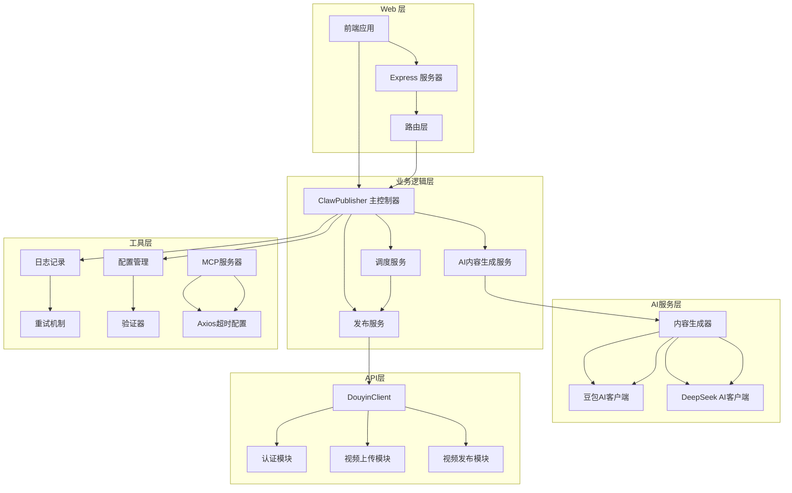

**图表来源**
- [src/index.ts:29-67](file://src/index.ts#L29-L67)
- [web/server/src/index.ts:1-42](file://web/server/src/index.ts#L1-L42)
- [src/services/ai/content-generator.ts:48-120](file://src/services/ai/content-generator.ts#L48-L120)
- [mcp-server/src/index.ts:152-194](file://mcp-server/src/index.ts#L152-L194)

**章节来源**
- [src/index.ts:1-248](file://src/index.ts#L1-L248)
- [web/server/src/index.ts:1-42](file://web/server/src/index.ts#L1-L42)
- [package.json:1-38](file://package.json#L1-L38)

## 核心组件

### ClawPublisher 主控制器

ClawPublisher 是整个系统的核心控制器，负责协调各个子服务的工作。它提供了统一的 API 接口，简化了外部系统的集成。

主要职责：
- **认证管理**：处理 OAuth 授权流程
- **发布编排**：协调上传和发布流程
- **调度控制**：管理定时任务
- **资源管理**：统一的生命周期管理
- **AI内容生成**：协调AI视频和图片生成任务

### 发布服务 (PublishService)

发布服务是业务编排层，负责处理完整的视频发布流程：

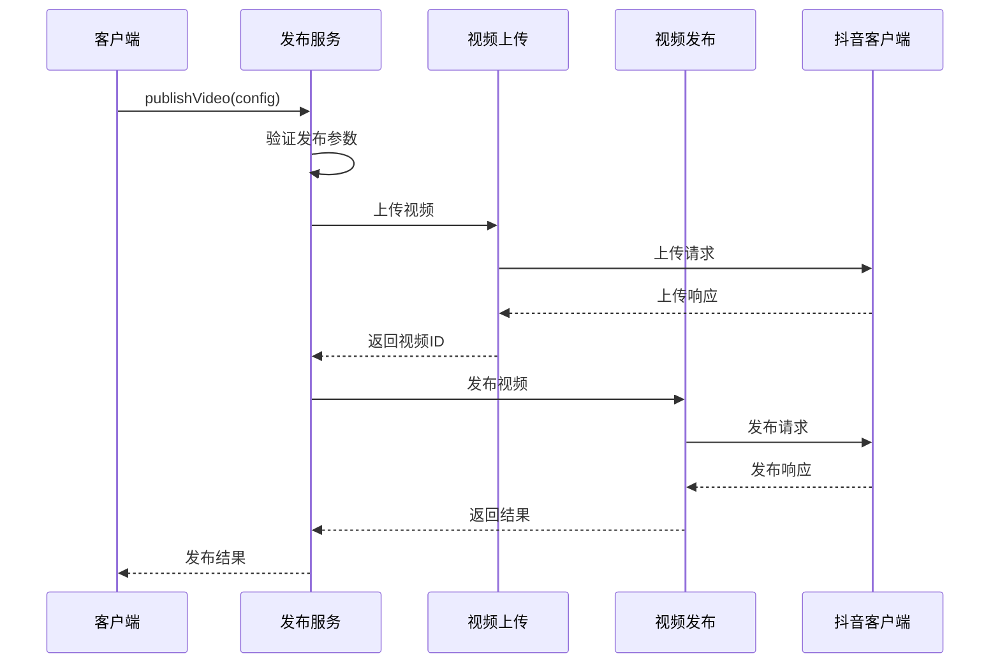

**图表来源**
- [src/services/publish-service.ts:38-80](file://src/services/publish-service.ts#L38-L80)
- [src/api/douyin-client.ts:124-166](file://src/api/douyin-client.ts#L124-L166)

### 调度服务 (SchedulerService)

调度服务基于 node-cron 实现，提供精确的时间调度功能：

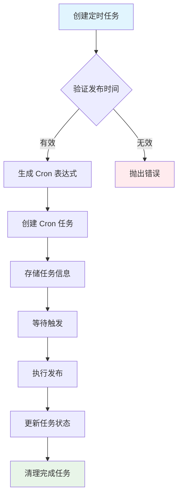

**图表来源**
- [src/services/scheduler-service.ts:37-72](file://src/services/scheduler-service.ts#L37-L72)
- [src/services/scheduler-service.ts:140-162](file://src/services/scheduler-service.ts#L140-L162)

### AI内容生成服务

AI内容生成服务是系统的重要组成部分，专门处理AI视频和图片生成任务：

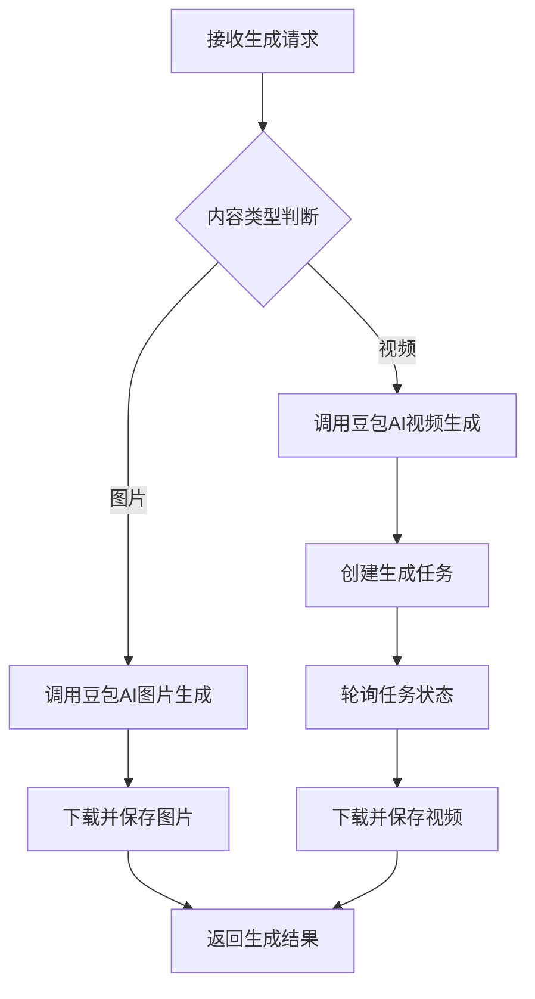

**图表来源**
- [src/services/ai/content-generator.ts:72-120](file://src/services/ai/content-generator.ts#L72-L120)
- [src/api/ai/doubao-client.ts:210-301](file://src/api/ai/doubao-client.ts#L210-L301)

**章节来源**
- [src/index.ts:29-244](file://src/index.ts#L29-L244)
- [src/services/publish-service.ts:22-224](file://src/services/publish-service.ts#L22-L224)
- [src/services/scheduler-service.ts:23-199](file://src/services/scheduler-service.ts#L23-L199)
- [src/services/ai/content-generator.ts:48-253](file://src/services/ai/content-generator.ts#L48-L253)

## 架构概览

系统采用分层架构设计，确保各层之间的职责分离和松耦合：

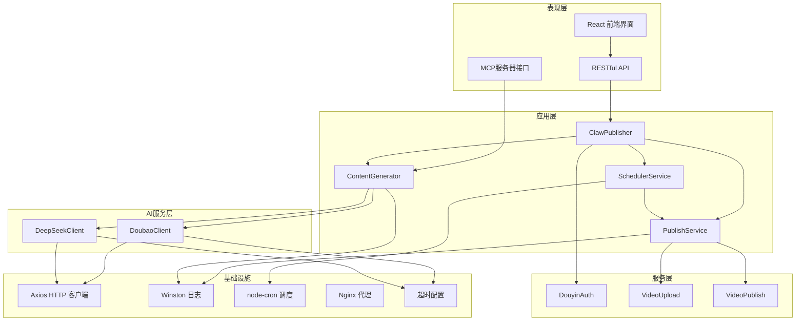

**图表来源**
- [src/index.ts:1-20](file://src/index.ts#L1-L20)
- [src/api/douyin-client.ts:13-27](file://src/api/douyin-client.ts#L13-L27)
- [src/api/auth.ts:29-37](file://src/api/auth.ts#L29-L37)
- [mcp-server/src/index.ts:152-194](file://mcp-server/src/index.ts#L152-L194)
- [deploy/nginx.conf:33-35](file://deploy/nginx.conf#L33-L35)

**章节来源**
- [src/models/types.ts:1-201](file://src/models/types.ts#L1-L201)
- [config/default.ts:1-49](file://config/default.ts#L1-L49)

## 详细组件分析

### 认证模块 (DouyinAuth)

认证模块实现了完整的 OAuth 2.0 流程，支持多种授权模式：

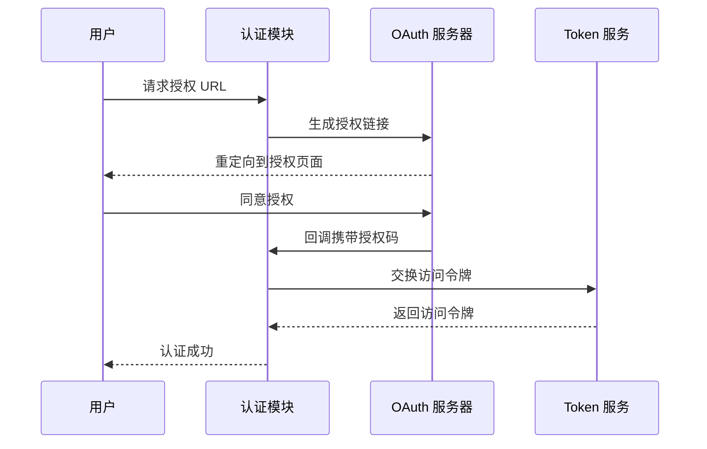

**图表来源**
- [src/api/auth.ts:45-60](file://src/api/auth.ts#L45-L60)
- [src/api/auth.ts:67-91](file://src/api/auth.ts#L67-L91)

关键特性：
- **多作用域支持**：支持视频创建、上传、数据查询等权限
- **自动刷新**：过期前自动刷新访问令牌
- **安全验证**：支持 state 参数防止 CSRF 攻击

**章节来源**
- [src/api/auth.ts:29-187](file://src/api/auth.ts#L29-L187)

### 视频上传模块

视频上传模块支持多种上传方式，具备智能重试和进度监控功能：

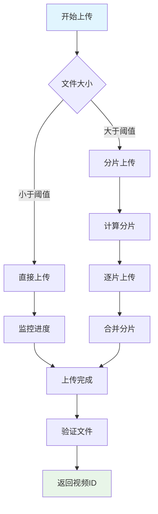

**图表来源**
- [src/services/publish-service.ts:88-93](file://src/services/publish-service.ts#L88-L93)
- [config/default.ts:10-15](file://config/default.ts#L10-L15)

**章节来源**
- [src/services/publish-service.ts:88-172](file://src/services/publish-service.ts#L88-L172)
- [config/default.ts:10-15](file://config/default.ts#L10-L15)

### 调度系统

调度系统基于 node-cron 实现，提供精确的时间控制：

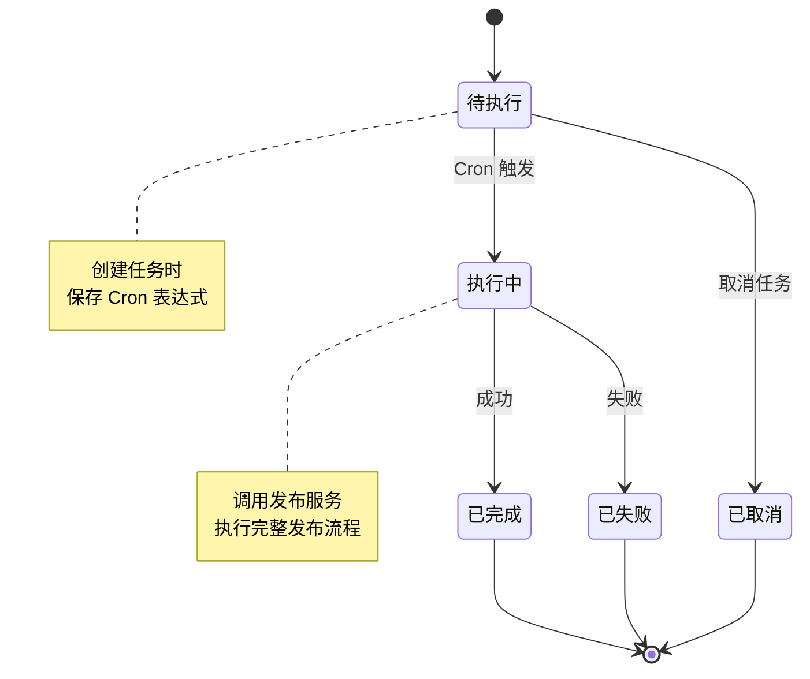

**图表来源**
- [src/services/scheduler-service.ts:11-18](file://src/services/scheduler-service.ts#L11-L18)
- [src/services/scheduler-service.ts:140-162](file://src/services/scheduler-service.ts#L140-L162)

**章节来源**
- [src/services/scheduler-service.ts:23-199](file://src/services/scheduler-service.ts#L23-L199)

### AI视频生成系统

AI视频生成系统是系统的核心AI能力，支持高质量的视频和图片生成：

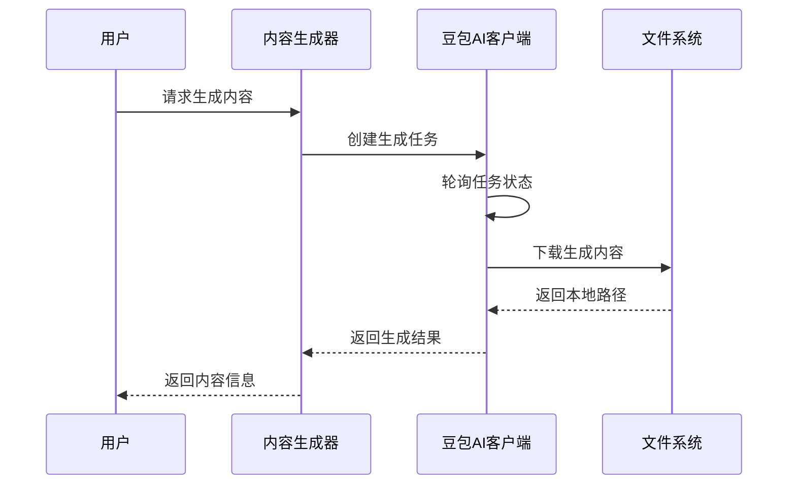

**图表来源**
- [src/services/ai/content-generator.ts:72-120](file://src/services/ai/content-generator.ts#L72-L120)
- [src/api/ai/doubao-client.ts:210-301](file://src/api/ai/doubao-client.ts#L210-L301)

**更新** AI视频生成系统现已优化超时配置，支持3-5分钟的视频生成任务，具备完善的超时处理和错误恢复机制。

**章节来源**
- [src/services/ai/content-generator.ts:48-253](file://src/services/ai/content-generator.ts#L48-L253)
- [src/api/ai/doubao-client.ts:94-406](file://src/api/ai/doubao-client.ts#L94-L406)

### Web 服务器

Web 服务器提供 RESTful API 接口，支持前后端分离架构：

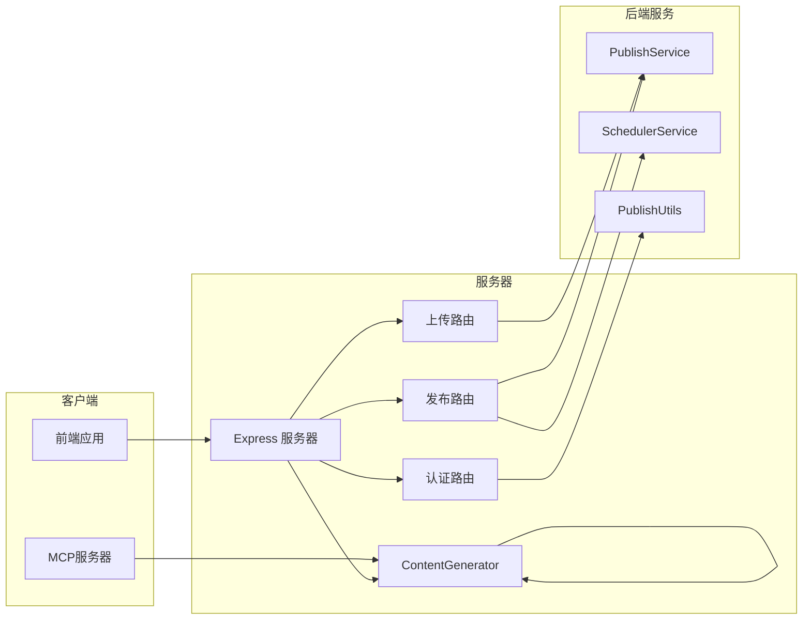

**图表来源**
- [web/server/src/index.ts:1-42](file://web/server/src/index.ts#L1-L42)
- [web/server/src/routes/publish.ts:1-123](file://web/server/src/routes/publish.ts#L1-L123)
- [mcp-server/src/index.ts:152-194](file://mcp-server/src/index.ts#L152-L194)

**章节来源**
- [web/server/src/index.ts:1-42](file://web/server/src/index.ts#L1-L42)
- [web/server/src/routes/publish.ts:1-123](file://web/server/src/routes/publish.ts#L1-L123)

## 依赖关系分析

系统依赖关系清晰，各模块职责明确：

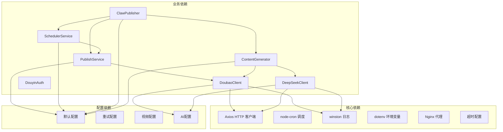

**图表来源**
- [package.json:18-33](file://package.json#L18-L33)
- [src/index.ts:1-20](file://src/index.ts#L1-L20)
- [config/default.ts:42-60](file://config/default.ts#L42-L60)

**章节来源**
- [package.json:1-38](file://package.json#L1-L38)
- [src/models/types.ts:1-201](file://src/models/types.ts#L1-L201)

## 性能考虑

系统在设计时充分考虑了性能优化，特别是在AI视频生成方面：

### 超时配置优化

**MCP服务器超时配置**
- **axios超时**：从120秒增加到600秒（10分钟）
- **Nginx代理超时**：从300秒调整到600秒（10分钟）
- **AI任务超时**：配置了5分钟的任务超时时间

**更新** 系统现已针对AI视频生成进行专门的超时优化，确保3-5分钟的视频生成任务能够顺利完成。

### 重试机制
- **指数退避算法**：避免雪崩效应
- **自适应重试**：根据错误类型决定是否重试
- **最大重试次数**：防止无限重试

### 并发控制
- **任务队列管理**：避免同时执行过多任务
- **资源限制**：控制内存和 CPU 使用
- **超时处理**：防止长时间阻塞

### 缓存策略
- **Token 缓存**：减少重复认证开销
- **配置缓存**：避免重复读取配置文件
- **日志缓存**：减少磁盘 I/O 操作

### AI视频生成性能优化

**任务管理**
- **异步任务处理**：视频生成任务在后台执行
- **进度监控**：实时显示生成进度
- **状态轮询**：定期检查任务状态

**资源管理**
- **文件下载优化**：支持断点续传和进度显示
- **内存使用控制**：避免大文件导致内存溢出
- **并发限制**：控制同时进行的AI生成任务数量

**错误恢复**
- **任务重试机制**：网络波动时自动重试
- **超时处理**：超过时限时提供友好提示
- **状态回滚**：失败时清理临时文件

**章节来源**
- [mcp-server/src/index.ts:15-21](file://mcp-server/src/index.ts#L15-L21)
- [deploy/nginx.conf:33-35](file://deploy/nginx.conf#L33-L35)
- [src/api/ai/doubao-client.ts:108-120](file://src/api/ai/doubao-client.ts#L108-L120)
- [config/default.ts:57-58](file://config/default.ts#L57-L58)

## 故障排除指南

### 常见问题及解决方案

**认证失败**
- 检查客户端密钥和重定向 URI 配置
- 验证授权码的有效性和时效性
- 确认网络连接正常

**上传失败**
- 检查文件格式和大小限制
- 验证网络连接稳定性
- 查看重试日志了解具体原因

**定时任务异常**
- 检查系统时间和时区设置
- 验证 Cron 表达式的正确性
- 查看任务状态和执行日志

**AI视频生成超时**
- **MCP服务器超时**：确认axios超时设置为600秒
- **Nginx代理超时**：检查proxy_read_timeout和proxy_send_timeout配置
- **AI任务超时**：验证豆包AI客户端的任务超时设置
- **网络连接**：检查与AI服务提供商的网络连接稳定性

**性能问题**
- 监控系统资源使用情况
- 优化并发数量和重试策略
- 考虑使用集群部署

**更新** 新增AI视频生成超时相关故障排除指南，帮助用户诊断和解决视频生成过程中的超时问题。

**章节来源**
- [src/utils/retry.ts:41-81](file://src/utils/retry.ts#L41-L81)
- [src/utils/logger.ts:31-55](file://src/utils/logger.ts#L31-L55)
- [mcp-server/src/index.ts:15-21](file://mcp-server/src/index.ts#L15-L21)
- [deploy/nginx.conf:33-35](file://deploy/nginx.conf#L33-L35)

## 结论

调度服务系统是一个功能完整、架构清晰的抖音视频发布自动化平台。系统的主要优势包括：

**技术优势**
- **模块化设计**：各组件职责明确，易于维护和扩展
- **完善的错误处理**：智能重试和异常恢复机制
- **灵活的配置**：支持多种部署和运行模式
- **AI能力集成**：支持高质量的视频和图片生成
- **超时优化**：专门针对AI视频生成的超时配置

**业务价值**
- **自动化程度高**：减少人工操作，提高效率
- **功能丰富**：支持多种发布场景和业务需求
- **易于集成**：提供标准化的 API 接口
- **AI驱动**：通过AI技术提升内容质量和生产效率

**未来发展**
- 可以考虑添加更多社交媒体平台支持
- 增强数据分析和报告功能
- 优化移动端用户体验
- 扩展AI生成能力，支持更多内容类型

**更新** 系统现已针对AI视频生成进行专门优化，超时配置从120秒提升到600秒，能够稳定支持3-5分钟的视频生成任务，显著提升了AI视频生成功能的可靠性和用户体验。

该系统为营销账号运营提供了强有力的技术支撑，能够有效提升内容发布的效率和质量。