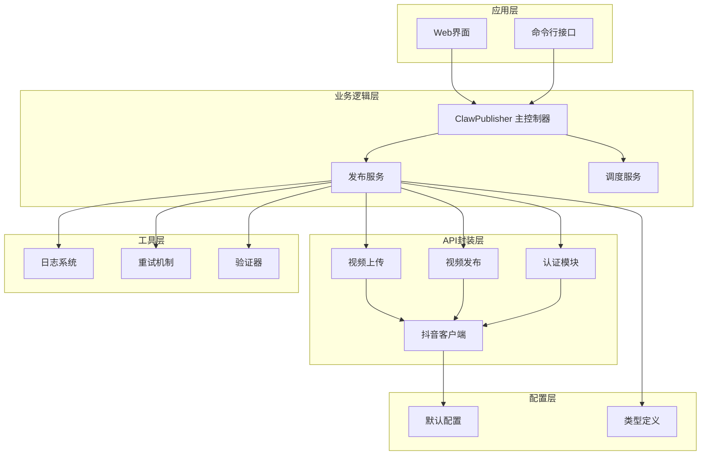
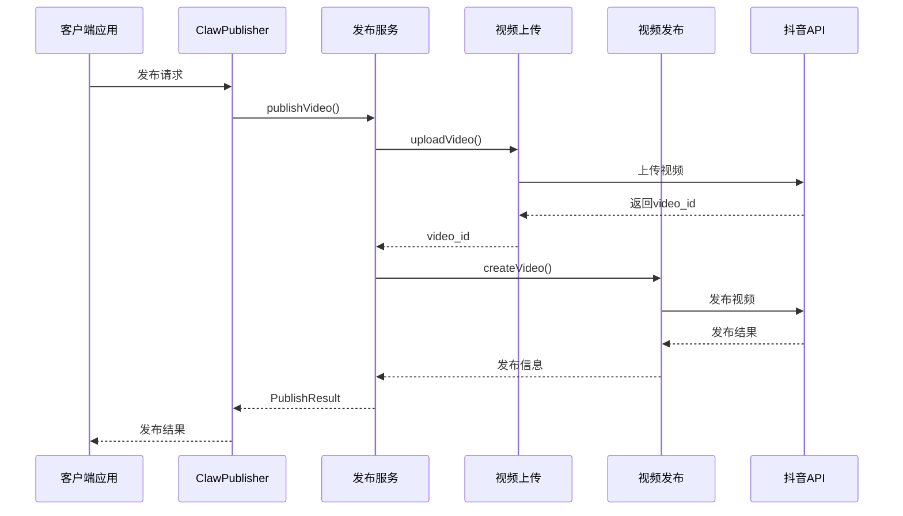
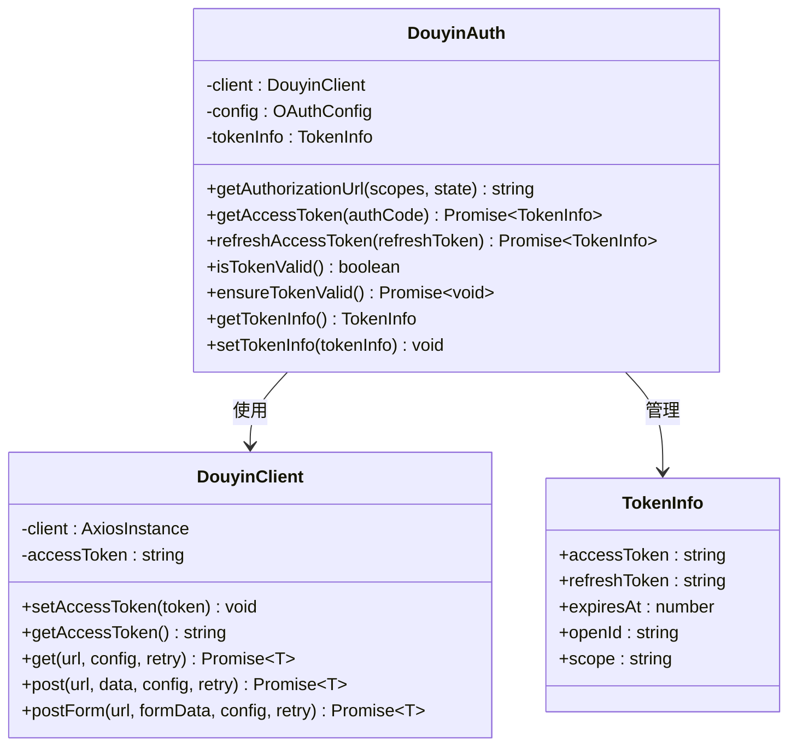
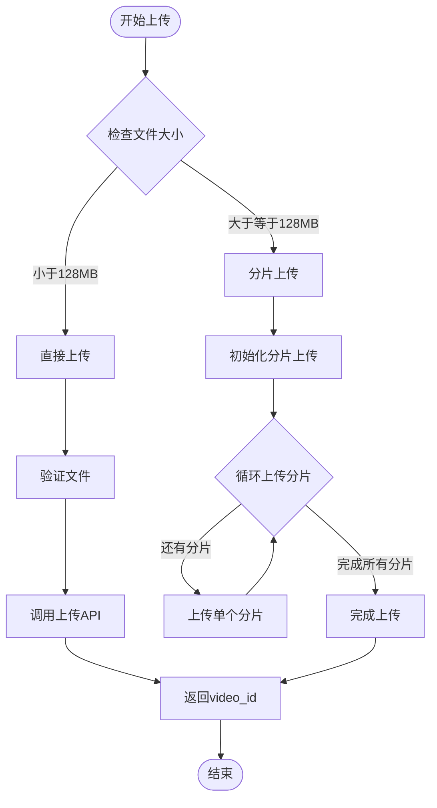
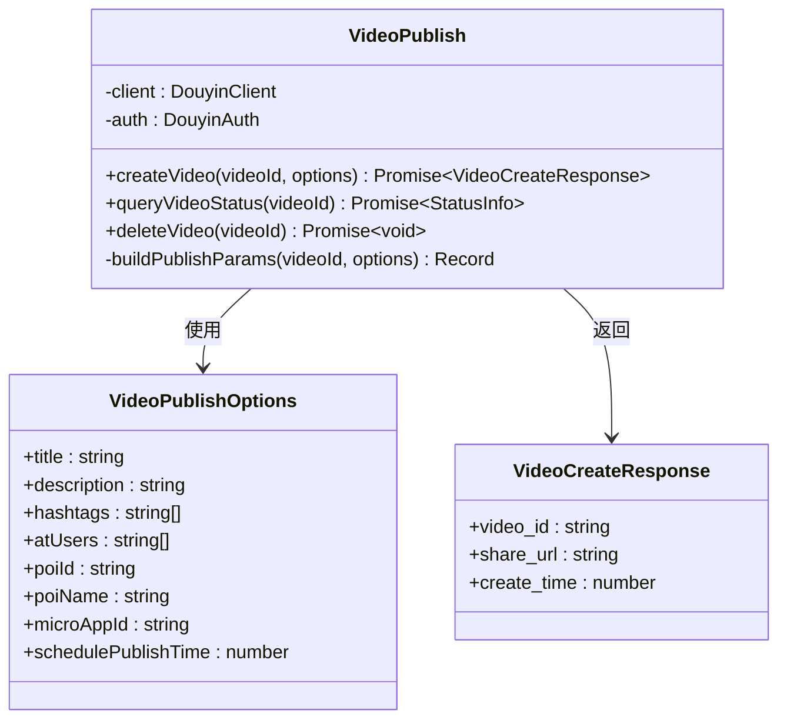
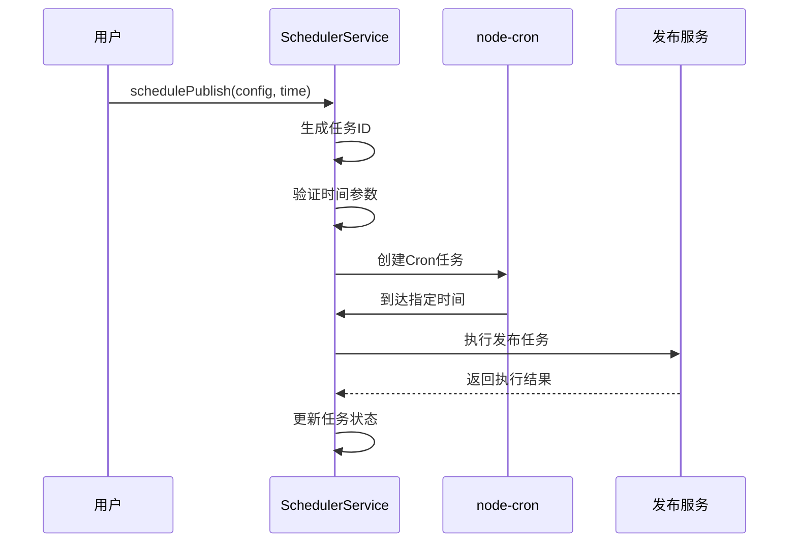
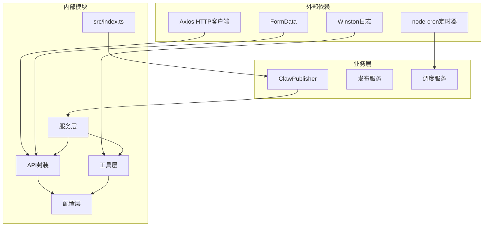

# 抖音开放平台自动发布功能

<cite>
**本文档引用的文件**
- [README.md](file://README.md)
- [package.json](file://package.json)
- [src/index.ts](file://src/index.ts)
- [config/default.ts](file://config/default.ts)
- [src/api/douyin-client.ts](file://src/api/douyin-client.ts)
- [src/api/auth.ts](file://src/api/auth.ts)
- [src/services/publish-service.ts](file://src/services/publish-service.ts)
- [src/services/scheduler-service.ts](file://src/services/scheduler-service.ts)
- [src/models/types.ts](file://src/models/types.ts)
- [src/api/video-upload.ts](file://src/api/video-upload.ts)
- [src/api/video-publish.ts](file://src/api/video-publish.ts)
- [src/utils/logger.ts](file://src/utils/logger.ts)
- [src/utils/retry.ts](file://src/utils/retry.ts)
- [src/utils/validator.ts](file://src/utils/validator.ts)
- [web/server/src/index.ts](file://web/server/src/index.ts)
</cite>

## 目录
1. [简介](#简介)
2. [项目结构](#项目结构)
3. [核心组件](#核心组件)
4. [架构概览](#架构概览)
5. [详细组件分析](#详细组件分析)
6. [依赖关系分析](#依赖关系分析)
7. [性能考虑](#性能考虑)
8. [故障排除指南](#故障排除指南)
9. [结论](#结论)

## 简介

抖音开放平台自动发布功能是一个专为抖音（TikTok）营销账户设计的自动化运营系统。该系统提供了完整的视频内容管理、自动发布、定时调度和数据分析功能，特别适用于小龙虾主题的营销推广。

本系统的核心目标是简化抖音内容运营流程，通过自动化工具减少人工操作，提高内容发布的效率和一致性。系统支持多种发布模式，包括即时发布、定时发布、批量发布等，同时提供完善的错误处理和重试机制。

## 项目结构

该项目采用模块化的架构设计，主要分为以下几个核心层次：

**图表来源**
- [src/index.ts:29-248](file://src/index.ts#L29-L248)
- [src/services/publish-service.ts:22-31](file://src/services/publish-service.ts#L22-L31)
- [src/services/scheduler-service.ts:23-29](file://src/services/scheduler-service.ts#L23-L29)

**章节来源**
- [README.md:92-105](file://README.md#L92-L105)
- [package.json:1-38](file://package.json#L1-L38)

## 核心组件

### ClawPublisher 主控制器

ClawPublisher 是整个系统的入口控制器，负责协调各个子模块的工作。它提供了统一的API接口，支持OAuth认证、视频上传、发布管理、定时调度等功能。

主要功能特性：
- OAuth认证流程管理
- 视频上传和发布一体化
- 定时任务调度
- 任务状态监控
- 错误处理和重试机制

### 发布服务 PublishService

发布服务作为业务编排层，负责协调视频上传和发布的完整流程。它实现了"上传-发布"的一站式服务，支持本地文件和远程URL两种上传方式。

核心流程：
1. 参数验证
2. 视频文件上传
3. 视频内容发布
4. 结果反馈和错误处理

### 调度服务 SchedulerService

调度服务基于node-cron实现，提供了灵活的定时发布功能。支持任务注册、取消、查询和状态管理。

关键特性：
- Cron表达式支持
- 任务状态跟踪
- 自动执行机制
- 任务清理功能

**章节来源**
- [src/index.ts:29-248](file://src/index.ts#L29-L248)
- [src/services/publish-service.ts:22-80](file://src/services/publish-service.ts#L22-L80)
- [src/services/scheduler-service.ts:23-72](file://src/services/scheduler-service.ts#L23-L72)

## 架构概览

系统采用分层架构设计，确保了良好的可维护性和扩展性：

**图表来源**
- [src/index.ts:153-155](file://src/index.ts#L153-L155)
- [src/services/publish-service.ts:38-80](file://src/services/publish-service.ts#L38-L80)
- [src/api/video-upload.ts:35-54](file://src/api/video-upload.ts#L35-L54)
- [src/api/video-publish.ts:30-54](file://src/api/video-publish.ts#L30-L54)

## 详细组件分析

### 认证模块分析

认证模块实现了完整的OAuth 2.0流程，支持授权码获取、Token刷新和有效期检查。

**图表来源**
- [src/api/auth.ts:29-187](file://src/api/auth.ts#L29-L187)
- [src/api/douyin-client.ts:13-43](file://src/api/douyin-client.ts#L13-L43)
- [src/models/types.ts:40-46](file://src/models/types.ts#L40-L46)

认证流程的关键步骤：
1. 生成授权URL
2. 用户授权确认
3. 交换access_token
4. Token有效期检查
5. 自动刷新机制

**章节来源**
- [src/api/auth.ts:45-91](file://src/api/auth.ts#L45-L91)
- [src/api/auth.ts:98-127](file://src/api/auth.ts#L98-L127)

### 视频上传模块分析

视频上传模块支持两种上传方式：直接上传和分片上传，自动根据文件大小选择最优方案。

**图表来源**
- [src/api/video-upload.ts:35-54](file://src/api/video-upload.ts#L35-L54)
- [src/api/video-upload.ts:104-152](file://src/api/video-upload.ts#L104-L152)

上传流程的优化策略：
- 智能文件大小检测
- 断点续传支持
- 进度监控
- 错误重试机制

**章节来源**
- [src/api/video-upload.ts:104-152](file://src/api/video-upload.ts#L104-L152)
- [config/default.ts:10-15](file://config/default.ts#L10-L15)

### 视频发布模块分析

视频发布模块负责将上传的视频内容正式发布到抖音平台，支持丰富的发布选项。

**图表来源**
- [src/api/video-publish.ts:15-54](file://src/api/video-publish.ts#L15-L54)
- [src/models/types.ts:101-124](file://src/models/types.ts#L101-L124)
- [src/models/types.ts:129-135](file://src/models/types.ts#L129-L135)

发布选项的验证规则：
- 标题长度限制（55字符）
- 描述长度限制（300字符）
- Hashtag数量限制（5个）
- 定时发布时间范围（当前时间至7天后）

**章节来源**
- [src/api/video-publish.ts:62-125](file://src/api/video-publish.ts#L62-L125)
- [src/utils/validator.ts:45-86](file://src/utils/validator.ts#L45-L86)

### 定时调度模块分析

定时调度模块基于node-cron实现，提供了灵活的任务调度功能。

**图表来源**
- [src/services/scheduler-service.ts:37-72](file://src/services/scheduler-service.ts#L37-L72)
- [src/services/scheduler-service.ts:140-162](file://src/services/scheduler-service.ts#L140-L162)

调度功能的特点：
- 支持任意时间点的定时发布
- 任务状态实时跟踪
- 自动清理已完成任务
- 支持任务取消和查询

**章节来源**
- [src/services/scheduler-service.ts:169-176](file://src/services/scheduler-service.ts#L169-L176)
- [src/services/scheduler-service.ts:181-188](file://src/services/scheduler-service.ts#L181-L188)

## 依赖关系分析

系统采用清晰的依赖层次结构，确保模块间的松耦合：

**图表来源**
- [package.json:18-24](file://package.json#L18-L24)
- [src/index.ts:1-20](file://src/index.ts#L1-L20)
- [src/services/publish-service.ts:1-15](file://src/services/publish-service.ts#L1-L15)

**章节来源**
- [package.json:18-36](file://package.json#L18-L36)
- [src/index.ts:1-20](file://src/index.ts#L1-L20)

## 性能考虑

系统在设计时充分考虑了性能优化和可靠性保障：

### 重试机制
- 指数退避算法，最大重试3次
- 支持网络错误和API限流重试
- 可自定义重试条件

### 并发控制
- 分片上传支持多线程并发
- 进度监控避免阻塞
- 内存使用优化

### 缓存策略
- Token自动刷新机制
- 上传ID缓存
- 任务状态持久化

## 故障排除指南

### 常见问题及解决方案

**认证相关问题**
- 确认OAuth配置正确
- 检查Token有效期
- 验证授权作用域

**上传失败**
- 检查文件格式和大小限制
- 确认网络连接稳定
- 查看分片上传状态

**发布异常**
- 验证发布选项格式
- 检查定时发布时间
- 确认账号权限

**章节来源**
- [src/utils/retry.ts:41-81](file://src/utils/retry.ts#L41-L81)
- [src/utils/validator.ts:17-39](file://src/utils/validator.ts#L17-L39)

## 结论

抖音开放平台自动发布功能是一个功能完善、架构清晰的自动化运营系统。通过模块化的设计理念和完善的错误处理机制，该系统能够有效提升内容运营效率，降低人工成本。

系统的主要优势包括：
- 完整的OAuth认证流程
- 智能的上传策略选择
- 灵活的定时发布功能
- 详细的日志记录和监控
- 可扩展的架构设计

未来可以考虑的功能增强：
- 批量操作支持
- 更丰富的数据分析
- 多账号管理
- 自动化内容推荐