# 核心模块详解

<cite>
**本文档引用的文件**
- [src/index.ts](file://src/index.ts)
- [src/api/douyin-client.ts](file://src/api/douyin-client.ts)
- [src/api/auth.ts](file://src/api/auth.ts)
- [src/api/video-upload.ts](file://src/api/video-upload.ts)
- [src/api/video-publish.ts](file://src/api/video-publish.ts)
- [src/services/publish-service.ts](file://src/services/publish-service.ts)
- [src/services/scheduler-service.ts](file://src/services/scheduler-service.ts)
- [src/utils/retry.ts](file://src/utils/retry.ts)
- [src/utils/validator.ts](file://src/utils/validator.ts)
- [src/models/types.ts](file://src/models/types.ts)
- [config/default.ts](file://config/default.ts)
- [example.ts](file://example.ts)
- [web/server/src/database/index.ts](file://web/server/src/database/index.ts)
- [web/server/src/database/schema.sql](file://web/server/src/database/schema.sql)
- [web/server/src/database/migrate-from-lowdb.ts](file://web/server/src/database/migrate-from-lowdb.ts)
- [web/server/src/services/user-auth-config-service.ts](file://web/server/src/services/user-auth-config-service.ts)
- [web/server/src/services/creation-task-service.ts](file://web/server/src/services/creation-task-service.ts)
- [web/server/src/services/system-config-service.ts](file://web/server/src/services/system-config-service.ts)
- [web/server/src/services/app-config-service.ts](file://web/server/src/services/app-config-service.ts)
- [web/server/src/services/user-service.ts](file://web/server/src/services/user-service.ts)
- [web/server/src/models/user.ts](file://web/server/src/models/user.ts)
- [web/server/src/index.ts](file://web/server/src/index.ts)
</cite>

## 目录
1. [简介](#简介)
2. [项目结构](#项目结构)
3. [核心组件](#核心组件)
4. [架构概览](#架构概览)
5. [详细组件分析](#详细组件分析)
6. [数据库架构变更](#数据库架构变更)
7. [依赖关系分析](#依赖关系分析)
8. [性能考虑](#性能考虑)
9. [故障排除指南](#故障排除指南)
10. [结论](#结论)

## 简介

ClawOperations 是一个专为抖音营销账户设计的自动化管理系统，提供了完整的视频内容发布、上传、调度和管理功能。该系统采用模块化架构设计，通过清晰的职责分离实现了高内聚、低耦合的代码结构。

**重要更新**：系统已完全迁移到基于 MySQL 的数据库架构，移除了原有的文件存储相关实现，采用现代化的数据库驱动设计。

本项目的核心目标是为营销团队提供一套完整的抖音内容管理解决方案，包括：
- 自动化的视频上传和发布流程
- 智能的定时发布调度
- 完善的错误处理和重试机制
- 严格的参数验证和数据校验
- 基于 MySQL 的持久化存储
- Redis 缓存加速的配置管理

## 项目结构

项目采用基于功能域的模块化组织方式，主要分为以下几个层次：

```mermaid
graph TB
subgraph "应用入口层"
Index[src/index.ts<br/>ClawPublisher 主类"]
WebIndex[web/server/src/index.ts<br/>Web 服务器入口"]
end
subgraph "API 层"
Auth[src/api/auth.ts<br/>OAuth 认证]
Client[src/api/douyin-client.ts<br/>HTTP 客户端]
Upload[src/api/video-upload.ts<br/>视频上传]
Publish[src/api/video-publish.ts<br/>视频发布]
end
subgraph "服务层"
PubService[src/services/publish-service.ts<br/>发布服务]
Scheduler[src/services/scheduler-service.ts<br/>调度服务]
UserService[web/server/src/services/user-service.ts<br/>用户服务]
UserAuthConfigService[web/server/src/services/user-auth-config-service.ts<br/>用户认证配置服务]
CreationTaskService[web/server/src/services/creation-task-service.ts<br/>创作任务服务]
SystemConfigService[web/server/src/services/system-config-service.ts<br/>系统配置服务]
AppConfigService[web/server/src/services/app-config-service.ts<br/>应用配置服务]
end
subgraph "数据库层"
DBIndex[web/server/src/database/index.ts<br/>数据库连接层]
Schema[web/server/src/database/schema.sql<br/>数据库模式]
Migrate[web/server/src/database/migrate-from-lowdb.ts<br/>数据迁移脚本]
end
subgraph "工具层"
Retry[src/utils/retry.ts<br/>重试机制]
Validator[src/utils/validator.ts<br/>参数验证]
Logger[src/utils/logger.ts<br/>日志记录]
end
subgraph "配置层"
Config[config/default.ts<br/>默认配置]
Types[src/models/types.ts<br/>类型定义]
UserModels[web/server/src/models/user.ts<br/>用户模型]
end
Index --> PubService
Index --> Scheduler
PubService --> Upload
PubService --> Publish
Upload --> Client
Publish --> Client
Auth --> Client
WebIndex --> DBIndex
WebIndex --> UserService
WebIndex --> UserAuthConfigService
WebIndex --> CreationTaskService
WebIndex --> SystemConfigService
WebIndex --> AppConfigService
DBIndex --> Schema
DBIndex --> Migrate
UserService --> DBIndex
UserAuthConfigService --> DBIndex
CreationTaskService --> DBIndex
SystemConfigService --> DBIndex
AppConfigService --> DBIndex
PubService --> Validator
Upload --> Validator
Publish --> Validator
PubService --> Config
Upload --> Config
Publish --> Config
```

**图表来源**
- [src/index.ts:1-248](file://src/index.ts#L1-L248)
- [web/server/src/index.ts:1-93](file://web/server/src/index.ts#L1-L93)
- [web/server/src/database/index.ts:1-164](file://web/server/src/database/index.ts#L1-L164)

**章节来源**
- [src/index.ts:1-248](file://src/index.ts#L1-L248)
- [config/default.ts:1-49](file://config/default.ts#L1-L49)
- [web/server/src/index.ts:1-93](file://web/server/src/index.ts#L1-L93)

## 核心组件

### ClawPublisher 主控制器

ClawPublisher 作为系统的统一入口，负责协调各个子模块的工作。它提供了完整的对外接口，包括认证、视频上传、发布、调度等功能。

主要职责：
- 初始化和配置各个子模块
- 提供统一的 API 接口
- 管理模块间的依赖关系
- 处理异常和错误传播

### Web 服务器入口

web/server/src/index.ts 作为 Web 服务器的统一入口，负责：
- 初始化数据库连接（MySQL + Redis）
- 加载系统配置到环境变量
- 设置静态文件服务
- 注册所有 API 路由
- 提供健康检查接口

### DouyinClient HTTP 客户端

基于 Axios 的 HTTP 客户端封装，提供了统一的 API 调用接口和错误处理机制。

核心特性：
- 自动注入访问令牌
- 统一的响应拦截和错误处理
- 内置的重试机制
- 完整的日志记录

### PublishService 业务编排层

作为业务逻辑的核心编排者，负责协调上传和发布的完整流程。

关键功能：
- 一站式发布流程（上传 + 发布）
- 条件分支处理（本地文件 vs 远程 URL）
- 进度监控和状态管理
- 异常处理和结果包装

**章节来源**
- [src/index.ts:29-244](file://src/index.ts#L29-L244)
- [src/api/douyin-client.ts:13-237](file://src/api/douyin-client.ts#L13-L237)
- [src/services/publish-service.ts:22-228](file://src/services/publish-service.ts#L22-L228)
- [web/server/src/index.ts:69-93](file://web/server/src/index.ts#L69-L93)

## 架构概览

系统采用分层架构设计，从上到下分别为应用入口层、API 层、服务层、数据库层、工具层和配置层。这种设计确保了各层之间的职责清晰分离，便于维护和扩展。

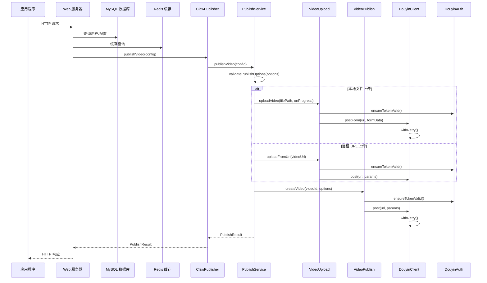

**图表来源**
- [src/index.ts:153-155](file://src/index.ts#L153-L155)
- [src/services/publish-service.ts:38-80](file://src/services/publish-service.ts#L38-L80)
- [src/api/video-upload.ts:35-54](file://src/api/video-upload.ts#L35-L54)
- [src/api/video-publish.ts:30-54](file://src/api/video-publish.ts#L30-L54)
- [web/server/src/index.ts:69-93](file://web/server/src/index.ts#L69-L93)

## 详细组件分析

### DouyinClient API 客户端

DouyinClient 是整个系统的基础通信层，提供了对抖音开放平台 API 的统一访问接口。

#### HTTP 请求封装

客户端基于 Axios 构建，实现了以下核心功能：

1. **基础配置**：设置 API 基础 URL、超时时间和默认请求头
2. **访问令牌管理**：自动在请求参数中注入 access_token
3. **统一响应处理**：解析 API 响应数据，提取实际内容
4. **错误处理机制**：区分不同类型的错误并提供相应的处理策略

#### 认证处理机制

客户端通过请求拦截器自动处理访问令牌的注入，确保每次 API 调用都包含有效的认证信息。

#### 错误重试机制

集成了智能的重试策略，能够自动处理网络错误、超时和限流等临时性问题。

**章节来源**
- [src/api/douyin-client.ts:13-237](file://src/api/douyin-client.ts#L13-L237)

### VideoUpload 视频上传模块

VideoUpload 模块实现了完整的视频上传功能，支持多种上传策略以适应不同的使用场景。

#### 上传策略选择

系统根据文件大小自动选择最适合的上传方式：


**图表来源**
- [src/api/video-upload.ts:35-54](file://src/api/video-upload.ts#L35-L54)
- [src/api/video-upload.ts:104-152](file://src/api/video-upload.ts#L104-L152)

#### 直接上传实现

适用于小文件（小于 128MB）的快速上传方式：

1. **文件验证**：检查文件格式和大小限制
2. **进度监控**：实时监听文件流传输进度
3. **表单构建**：使用 FormData 格式化上传数据
4. **API 调用**：调用 `/api/v2/video/upload/` 接口

#### 分片上传实现

针对大文件的高效上传策略：

1. **分片计算**：根据配置确定分片大小和数量
2. **初始化**：调用初始化接口获取 upload_id
3. **顺序上传**：按序号上传每个分片
4. **进度跟踪**：累计计算整体上传进度
5. **完成确认**：调用完成接口合并分片

#### 进度监控机制

系统提供了完善的进度监控功能，通过事件监听机制实时获取上传进度信息。

**章节来源**
- [src/api/video-upload.ts:20-241](file://src/api/video-upload.ts#L20-L241)
- [config/default.ts:10-15](file://config/default.ts#L10-L15)

### VideoPublish 视频发布模块

VideoPublish 模块负责视频的创建和发布操作，提供了丰富的发布选项和参数配置。

#### 参数验证和构建

发布模块实现了严格的参数验证机制：

1. **标题长度验证**：不超过 55 个字符
2. **描述长度验证**：不超过 300 个字符  
3. **Hashtag 数量限制**：最多 5 个
4. **定时发布时间验证**：必须在未来且不超过 7 天后

#### 发布参数构建

系统会根据传入的选项动态构建 API 请求参数：

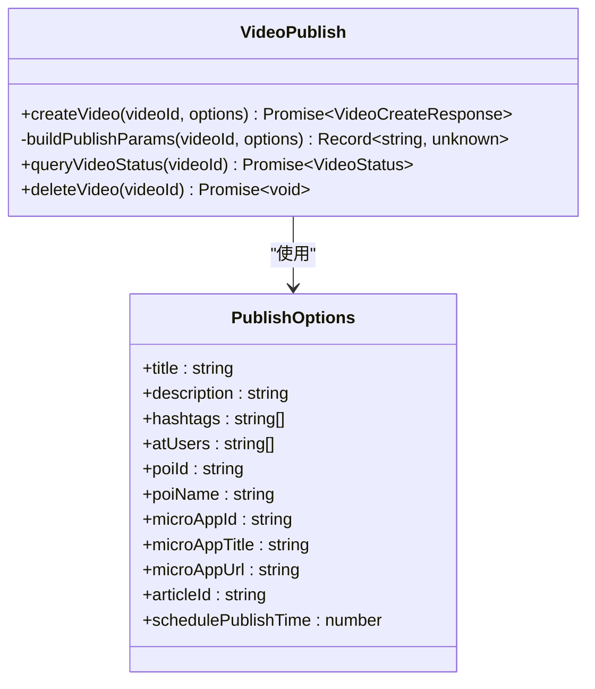

**图表来源**
- [src/api/video-publish.ts:15-174](file://src/api/video-publish.ts#L15-L174)
- [src/utils/validator.ts:45-86](file://src/utils/validator.ts#L45-L86)

#### 发布选项详解

系统支持多种高级发布选项：

- **地理位置**：支持 POI ID 和名称的精确绑定
- **@提及用户**：支持多个用户的精准提及
- **小程序挂载**：支持商业推广的小程序链接
- **商品链接**：支持电商场景的商品关联
- **定时发布**：支持未来时间的精确调度

**章节来源**
- [src/api/video-publish.ts:15-174](file://src/api/video-publish.ts#L15-L174)
- [src/utils/validator.ts:17-116](file://src/utils/validator.ts#L17-L116)

### PublishService 业务编排模块

PublishService 作为业务逻辑的核心编排者，负责协调上传和发布的完整流程。

#### 一站式发布流程

系统提供了完整的发布工作流，包括参数验证、文件上传、内容发布等步骤：

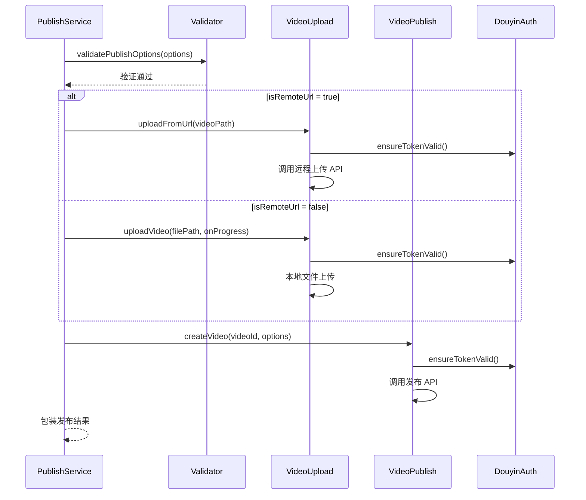

**图表来源**
- [src/services/publish-service.ts:38-80](file://src/services/publish-service.ts#L38-L80)
- [src/services/publish-service.ts:133-172](file://src/services/publish-service.ts#L133-L172)

#### 多种发布模式

系统支持三种不同的发布模式：

1. **一站式发布**：同时处理上传和发布两个步骤
2. **仅上传模式**：只进行视频上传，不进行发布
3. **已上传发布**：对已经上传的视频进行发布

#### 下载并发布功能

提供了从远程 URL 下载视频并发布的便捷功能，适用于需要从外部源获取内容的场景。

**章节来源**
- [src/services/publish-service.ts:22-228](file://src/services/publish-service.ts#L22-L228)

### SchedulerService 定时调度模块

SchedulerService 实现了基于 cron 表达式的定时发布功能，提供了完整的任务生命周期管理。

#### 任务管理机制

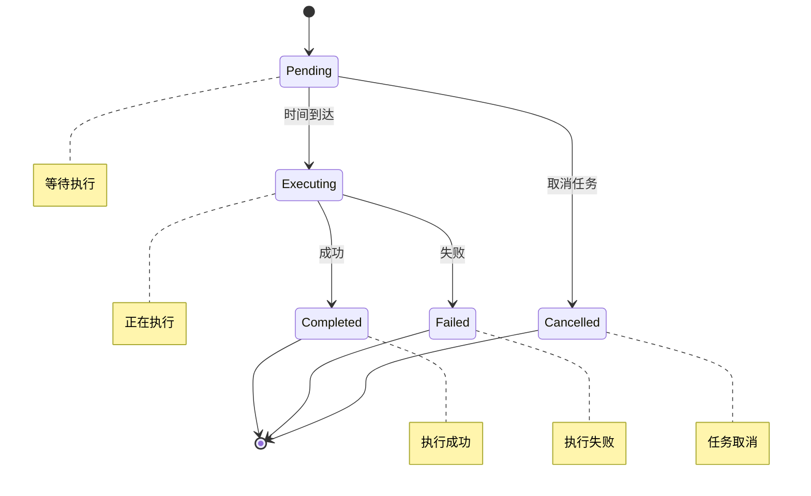

**图表来源**
- [src/services/scheduler-service.ts:11-18](file://src/services/scheduler-service.ts#L11-L18)

#### 任务调度实现

系统使用 node-cron 库实现精确的时间调度：

1. **时间计算**：将目标时间转换为 cron 表达式
2. **任务注册**：创建并启动定时任务
3. **状态管理**：跟踪任务的执行状态
4. **结果记录**：保存任务执行的结果

#### 任务生命周期

每个定时任务都有完整的生命周期管理：

- **创建阶段**：验证时间有效性并创建 cron 任务
- **执行阶段**：在指定时间自动触发发布流程
- **状态更新**：根据执行结果更新任务状态
- **清理阶段**：自动清理已完成的任务

**章节来源**
- [src/services/scheduler-service.ts:23-202](file://src/services/scheduler-service.ts#L23-L202)

### 认证模块 (DouyinAuth)

DouyinAuth 模块提供了完整的 OAuth 2.0 认证流程，支持授权码模式和刷新令牌模式。

#### 授权流程


**图表来源**
- [src/api/auth.ts:45-91](file://src/api/auth.ts#L45-L91)
- [src/api/auth.ts:98-127](file://src/api/auth.ts#L98-L127)

#### 令牌管理

系统实现了智能的令牌管理机制：

1. **令牌验证**：定期检查令牌的有效性和过期时间
2. **自动刷新**：在令牌即将过期时自动刷新
3. **安全存储**：安全地存储和管理访问令牌和刷新令牌
4. **客户端同步**：自动将令牌信息同步到 HTTP 客户端

**章节来源**
- [src/api/auth.ts:29-190](file://src/api/auth.ts#L29-L190)

## 数据库架构变更

**重要更新**：系统已完全迁移到基于 MySQL 的数据库架构，移除了原有的文件存储相关实现。

### 数据库连接层

web/server/src/database/index.ts 提供了完整的数据库连接管理：

#### MySQL 连接池配置

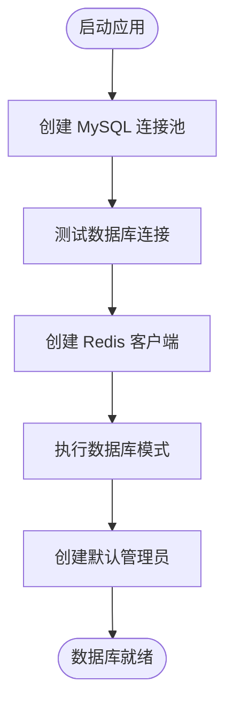

**图表来源**
- [web/server/src/database/index.ts:95-134](file://web/server/src/database/index.ts#L95-L134)

#### Redis 缓存集成

系统集成了 Redis 作为缓存层，提供：
- Token 缓存（加速 hasValidToken 检查）
- 配置缓存（系统配置的内存缓存）
- 自动重连和错误处理

#### 数据库模式设计

web/server/src/database/schema.sql 定义了完整的数据库结构：

**用户表 (users)**
- 基本用户信息：用户名、邮箱、密码哈希
- 抖音 OAuth 集成：OpenID、昵称、头像
- 角色权限：用户/管理员
- 时间戳：创建和更新时间

**用户认证配置表 (user_auth_configs)**
- 抖音应用配置：client_key、client_secret、redirect_uri
- 访问令牌：access_token、refresh_token、expires_at
- 外键约束：与 users 表关联

**创作任务表 (creation_tasks)**
- 任务状态：草稿/历史
- 内容数据：需求、分析、内容、文案
- 进度跟踪：进度、步骤、错误信息
- 时间戳：创建、更新、完成时间

**创作模板表 (creation_templates)**
- 模板元数据：名称、描述、标签
- 内容偏好：图片/视频/自动
- 使用统计：usage_count
- 关联引用：reference_image_url

**应用配置表 (app_config)**
- 配置键值：ai_config、douyin_config
- JSON 存储：复杂配置对象
- 更新时间：updated_at

**章节来源**
- [web/server/src/database/index.ts:1-164](file://web/server/src/database/index.ts#L1-L164)
- [web/server/src/database/schema.sql:1-79](file://web/server/src/database/schema.sql#L1-L79)

### 数据迁移脚本

web/server/src/database/migrate-from-lowdb.ts 提供了从旧版本到新数据库的完整迁移：

#### 迁移流程

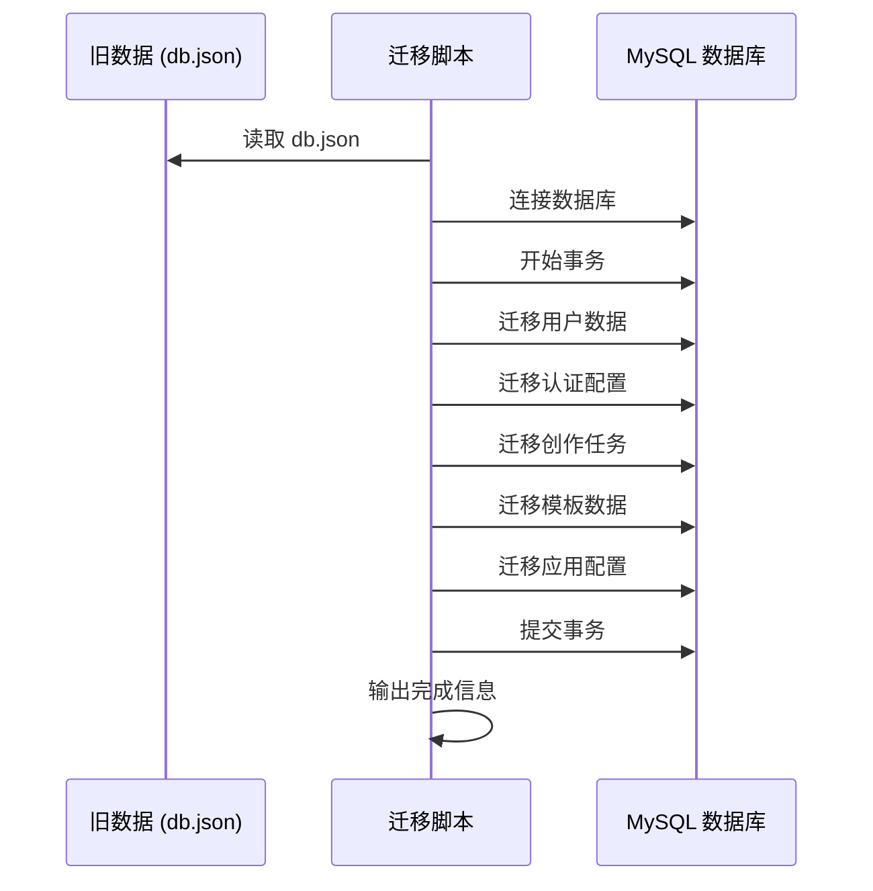

**图表来源**
- [web/server/src/database/migrate-from-lowdb.ts:138-310](file://web/server/src/database/migrate-from-lowdb.ts#L138-L310)

#### 迁移特性

1. **事务保证**：使用数据库事务确保数据一致性
2. **冲突处理**：使用 ON DUPLICATE KEY UPDATE 处理重复数据
3. **类型转换**：自动处理日期格式和数据类型转换
4. **索引重建**：迁移后自动维护数据库索引

**章节来源**
- [web/server/src/database/migrate-from-lowdb.ts:1-368](file://web/server/src/database/migrate-from-lowdb.ts#L1-L368)

### 用户认证配置服务

web/server/src/services/user-auth-config-service.ts 提供了基于 MySQL 的用户认证配置管理：

#### Token 缓存策略

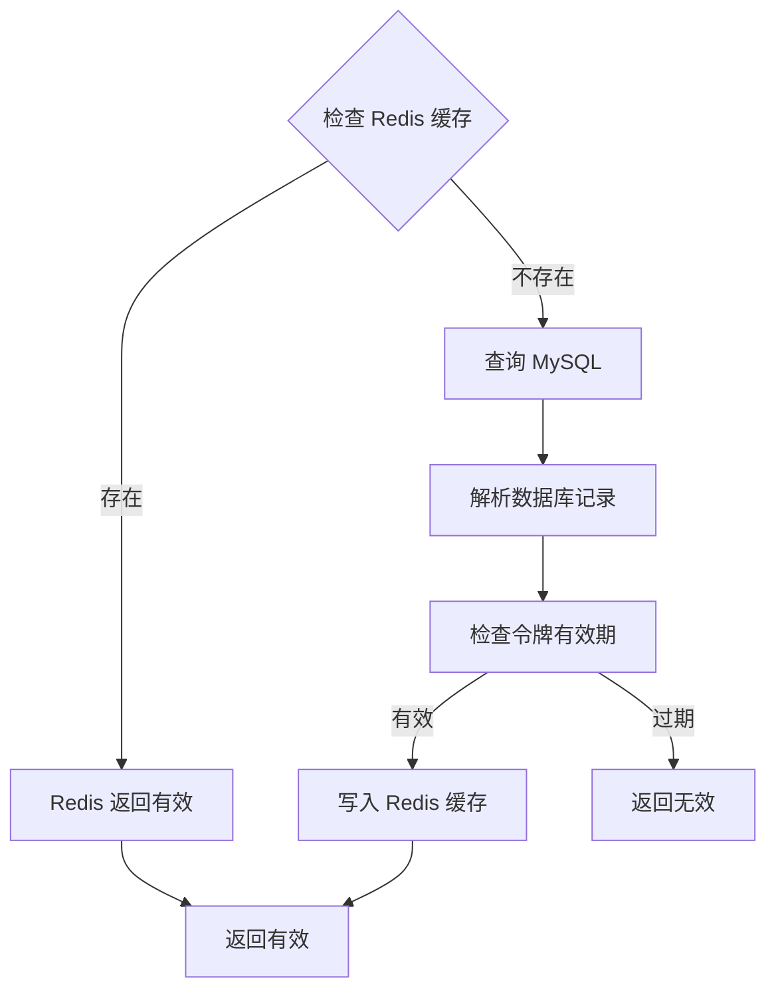

**图表来源**
- [web/server/src/services/user-auth-config-service.ts:138-150](file://web/server/src/services/user-auth-config-service.ts#L138-L150)

#### 功能特性

1. **双层缓存**：Redis + MySQL 的混合缓存策略
2. **自动降级**：Redis 不可用时自动回退到 MySQL
3. **TTL 管理**：基于 expires_at 自动设置缓存过期时间
4. **原子操作**：使用事务确保配置更新的一致性

**章节来源**
- [web/server/src/services/user-auth-config-service.ts:1-200](file://web/server/src/services/user-auth-config-service.ts#L1-L200)

### 创作任务服务

web/server/src/services/creation-task-service.ts 提供了完整的创作任务生命周期管理：

#### 任务状态管理

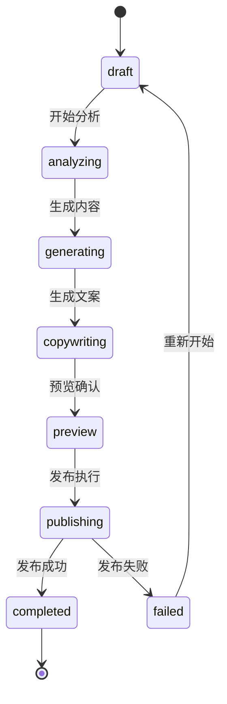

**图表来源**
- [web/server/src/services/creation-task-service.ts:328-371](file://web/server/src/services/creation-task-service.ts#L328-L371)

#### 数据持久化

1. **草稿管理**：支持草稿的创建、更新、删除、恢复
2. **历史记录**：自动保存已完成的任务到历史表
3. **模板系统**：支持模板的创建、使用、管理
4. **进度跟踪**：实时更新任务进度和状态

**章节来源**
- [web/server/src/services/creation-task-service.ts:1-386](file://web/server/src/services/creation-task-service.ts#L1-L386)

### 系统配置服务

web/server/src/services/system-config-service.ts 提供了基于内存缓存的配置管理：

#### 配置缓存架构

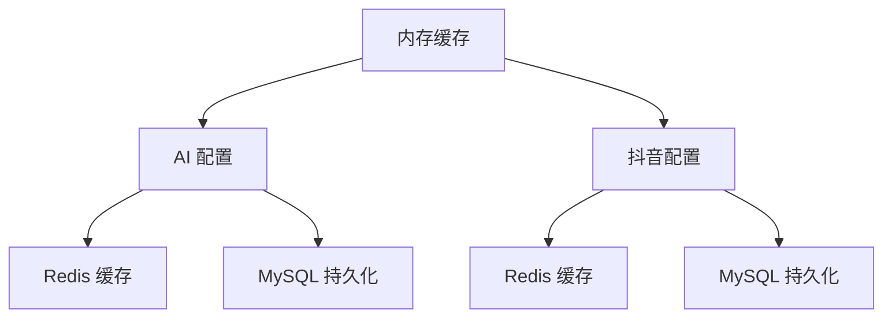

**图表来源**
- [web/server/src/services/system-config-service.ts:134-157](file://web/server/src/services/system-config-service.ts#L134-L157)

#### 缓存策略

1. **内存缓存**：提供快速的配置读取
2. **Redis 缓存**：跨进程共享配置数据
3. **MySQL 持久化**：确保配置的长期存储
4. **自动同步**：配置更新时自动同步到所有层

**章节来源**
- [web/server/src/services/system-config-service.ts:1-280](file://web/server/src/services/system-config-service.ts#L1-L280)

### 应用配置服务

web/server/src/services/app-config-service.ts 提供了简化的应用配置接口：

#### 配置代理模式

```mermaid
classDiagram
class AppConfigService {
+getDouyinConfig() : DouyinConfig
+setDouyinConfig(config) : Promise~DouyinConfig~
+getAIConfig() : AIConfig
+setAIConfig(config) : Promise~AIConfig~
+getAIStatus() : { deepseekConfigured : boolean }
}
class SystemConfigService {
+getDouyinConfig() : DouyinConfig
+updateDouyinConfig(dto) : Promise~DouyinConfig~
+getAIConfig() : AIConfig
+updateAIConfig(dto) : Promise~AIConfig~
}
AppConfigService --> SystemConfigService : "代理调用"
```

**图表来源**
- [web/server/src/services/app-config-service.ts:13-87](file://web/server/src/services/app-config-service.ts#L13-L87)

#### 接口简化

1. **统一接口**：提供简化的配置访问接口
2. **类型映射**：自动处理数据类型转换
3. **异步写入**：后台异步持久化配置
4. **状态查询**：提供配置状态的快速查询

**章节来源**
- [web/server/src/services/app-config-service.ts:1-87](file://web/server/src/services/app-config-service.ts#L1-L87)

### 用户服务

web/server/src/services/user-service.ts 提供了完整的用户管理功能：

#### 用户认证流程

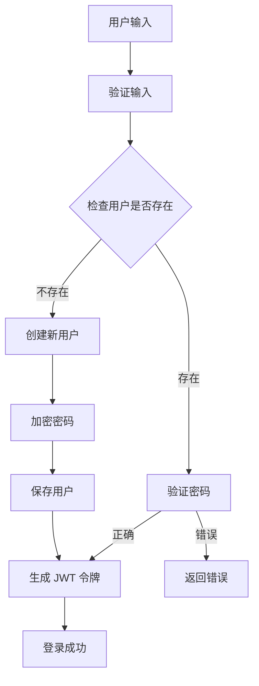

**图表来源**
- [web/server/src/services/user-service.ts:43-75](file://web/server/src/services/user-service.ts#L43-L75)

#### 功能特性

1. **密码加密**：使用 bcrypt 进行密码哈希
2. **OAuth 集成**：支持抖音 OAuth 登录
3. **用户验证**：提供完整的用户认证功能
4. **信息管理**：支持用户信息的增删改查

**章节来源**
- [web/server/src/services/user-service.ts:1-264](file://web/server/src/services/user-service.ts#L1-L264)

## 依赖关系分析

系统采用了清晰的依赖关系设计，确保模块间的松耦合和高内聚。

```mermaid
graph TB
subgraph "外部依赖"
Axios[Axios HTTP 客户端]
Cron[node-cron 定时任务]
MySQL[mysql2/promise MySQL]
Redis[ioredis Redis]
Bcrypt[bcryptjs 密码加密]
UUID[uuid 唯一标识]
Multer[Multer 文件上传]
Dotenv[dotenv 环境变量]
Express[Express Web 框架]
Cors[CORS 跨域]
JWT[jsonwebtoken JWT 令牌]
end
subgraph "内部模块"
Index[ClawPublisher]
PubService[PublishService]
Scheduler[SchedulerService]
Upload[VideoUpload]
Publish[VideoPublish]
Client[DouyinClient]
Auth[DouyinAuth]
Retry[Retry Utils]
Validator[Validator Utils]
UserService[User Service]
UserAuthConfigService[User Auth Config Service]
CreationTaskService[Creation Task Service]
SystemConfigService[System Config Service]
AppConfigService[App Config Service]
DBIndex[Database Index]
Schema[Database Schema]
Migrate[Migrate Script]
end
Index --> PubService
Index --> Scheduler
PubService --> Upload
PubService --> Publish
Upload --> Client
Publish --> Client
Auth --> Client
WebIndex --> DBIndex
WebIndex --> UserService
WebIndex --> UserAuthConfigService
WebIndex --> CreationTaskService
WebIndex --> SystemConfigService
WebIndex --> AppConfigService
DBIndex --> Schema
DBIndex --> Migrate
UserService --> DBIndex
UserAuthConfigService --> DBIndex
CreationTaskService --> DBIndex
SystemConfigService --> DBIndex
AppConfigService --> DBIndex
PubService --> Validator
Upload --> Validator
Publish --> Validator
Client --> Retry
UserService --> Bcrypt
UserAuthConfigService --> Redis
CreationTaskService --> UUID
SystemConfigService --> Redis
AppConfigService --> SystemConfigService
```

**图表来源**
- [src/index.ts:1-20](file://src/index.ts#L1-L20)
- [web/server/src/index.ts:1-37](file://web/server/src/index.ts#L1-L37)

### 关键依赖关系

1. **API 层依赖**：所有 API 模块都依赖于 DouyinClient 进行 HTTP 通信
2. **服务层依赖**：服务层模块依赖于数据库层提供的持久化能力
3. **Web 层依赖**：Web 服务器依赖于数据库连接层和缓存层
4. **工具层依赖**：所有模块都依赖于工具层提供的通用功能
5. **配置层依赖**：所有模块都依赖于配置层提供的常量和配置

### 循环依赖检测

经过分析，系统没有发现循环依赖关系，各模块的依赖方向都是单向的，符合良好的软件工程实践。

**章节来源**
- [src/index.ts:1-248](file://src/index.ts#L1-L248)
- [web/server/src/index.ts:1-93](file://web/server/src/index.ts#L1-L93)

## 性能考虑

### 数据库性能优化

1. **连接池管理**：MySQL 连接池自动管理连接复用
2. **缓存策略**：Redis 缓存加速常用数据访问
3. **索引优化**：为常用查询字段建立合适的索引
4. **事务处理**：使用事务保证数据一致性

### 上传性能优化

1. **分片上传策略**：大文件自动采用分片上传，避免单次传输过大导致的失败
2. **进度监控**：实时监控上传进度，提供用户体验反馈
3. **并发控制**：合理控制分片上传的并发数量，平衡速度和稳定性

### 内存管理

1. **流式处理**：使用文件流进行大文件处理，避免内存溢出
2. **及时清理**：下载的临时文件在使用后及时清理
3. **资源释放**：确保文件句柄和网络连接的正确释放

### 网络性能

1. **连接复用**：基于 Axios 的连接池管理
2. **超时控制**：合理的超时设置避免长时间阻塞
3. **重试策略**：智能的指数退避重试机制

## 故障排除指南

### 数据库相关问题

#### 连接问题

**问题**：MySQL 连接失败
**解决方案**：检查数据库配置参数（主机、端口、用户名、密码）

**问题**：Redis 连接失败
**解决方案**：检查 Redis 服务器状态和网络连接

#### 数据迁移问题

**问题**：数据迁移失败
**解决方案**：检查 db.json 文件格式和数据库权限

#### 缓存问题

**问题**：配置缓存失效
**解决方案**：检查 Redis 服务器状态，必要时重启应用

### 常见问题及解决方案

#### 认证相关问题

**问题**：Token 过期导致 API 调用失败
**解决方案**：系统会自动检测 Token 有效期并在过期前自动刷新

**问题**：授权 URL 生成失败
**解决方案**：检查 OAuth 配置参数的正确性

#### 上传相关问题

**问题**：大文件上传失败
**解决方案**：检查网络连接稳定性，适当调整分片大小

**问题**：上传进度不准确
**解决方案**：确认文件流监听器正常工作

#### 发布相关问题

**问题**：发布参数验证失败
**解决方案**：检查参数长度限制和格式要求

**问题**：定时任务未执行
**解决方案**：确认系统时间和时区设置

### 日志分析

系统提供了详细的日志记录功能，可以通过日志分析定位问题：

1. **请求日志**：记录所有 API 请求的详细信息
2. **错误日志**：记录详细的错误信息和堆栈跟踪
3. **进度日志**：记录上传和发布过程中的关键节点
4. **数据库日志**：记录数据库操作的详细信息

**章节来源**
- [src/utils/retry.ts:41-81](file://src/utils/retry.ts#L41-L81)
- [src/utils/validator.ts:10-15](file://src/utils/validator.ts#L10-L15)
- [web/server/src/database/index.ts:111-134](file://web/server/src/database/index.ts#L111-L134)

## 结论

ClawOperations 项目展现了优秀的软件架构设计和实现质量。通过模块化的设计理念，系统实现了高度的可维护性和可扩展性。

**重大更新**：系统已成功迁移到基于 MySQL 的现代化数据库架构，移除了原有的文件存储相关实现，采用更加可靠和高性能的数据库驱动设计。

### 主要优势

1. **清晰的架构层次**：从应用入口到工具层的清晰分层设计
2. **完善的错误处理**：多层次的错误捕获和处理机制
3. **现代化数据库**：基于 MySQL 的可靠数据持久化
4. **智能缓存系统**：Redis 缓存加速提升系统性能
5. **灵活的配置管理**：集中式的配置管理和环境适配
6. **丰富的功能特性**：覆盖了抖音内容管理的各个方面

### 技术亮点

1. **智能的上传策略**：根据文件大小自动选择最优的上传方式
2. **强大的定时调度**：基于 cron 的精确时间调度机制
3. **严格的参数验证**：多层次的输入验证确保数据完整性
4. **优雅的错误重试**：智能的重试策略提高系统可靠性
5. **双层缓存架构**：内存 + Redis 的混合缓存策略
6. **事务数据迁移**：保证数据迁移的完整性和一致性

### 改进建议

1. **监控和指标**：可以增加更详细的性能监控和指标收集
2. **缓存机制**：对于频繁访问的数据可以考虑添加缓存层
3. **批量操作**：可以扩展批量上传和发布的功能
4. **国际化支持**：可以考虑添加多语言支持
5. **数据库优化**：可以进一步优化数据库查询和索引设计

该项目为抖音内容管理提供了一个完整、可靠的解决方案，具有良好的扩展性和维护性，适合在生产环境中使用。新的数据库架构为系统的长期发展奠定了坚实的基础。