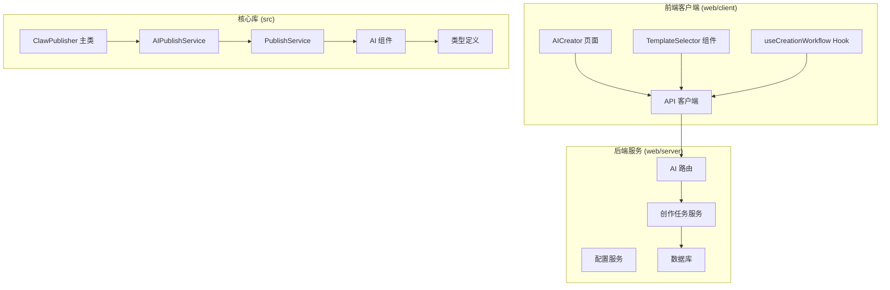
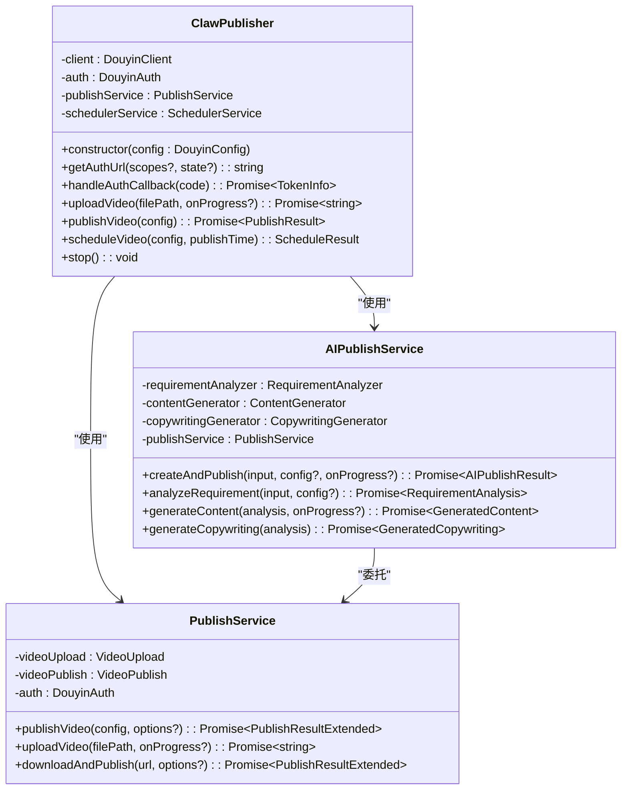
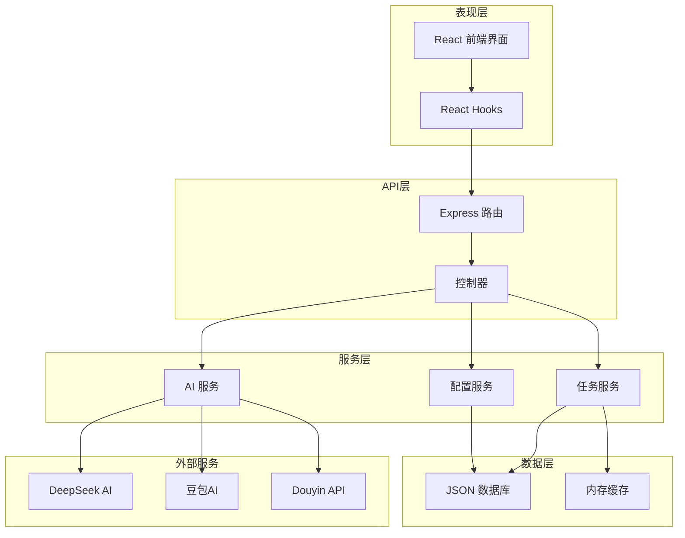
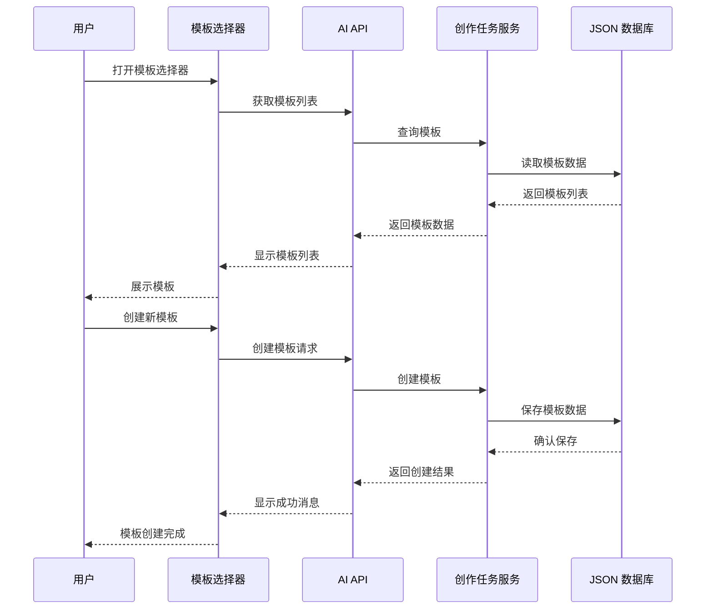
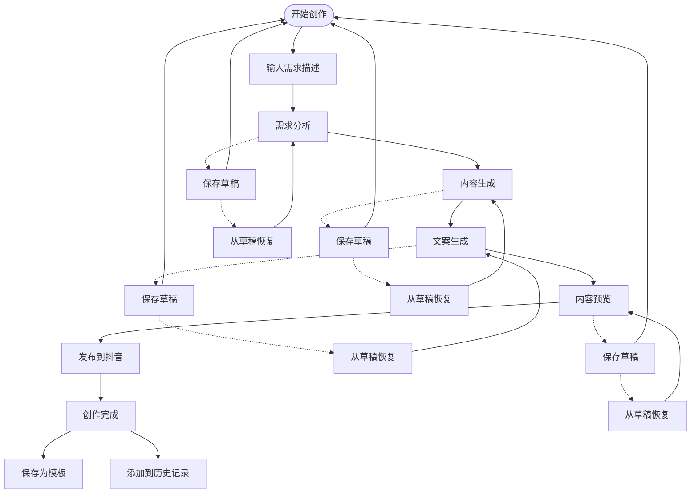
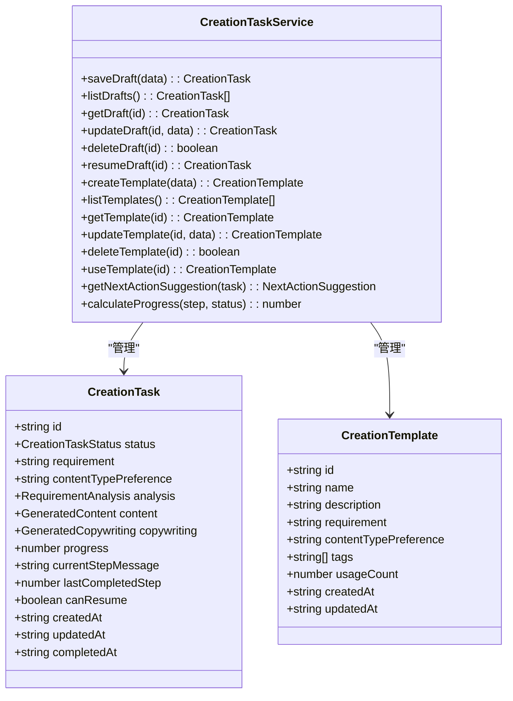
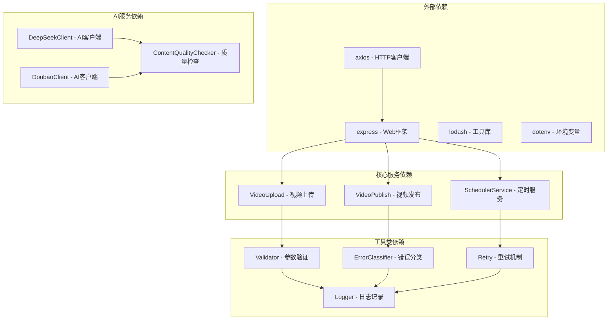

# 模板化创作功能

<cite>
**本文档引用的文件**
- [src/index.ts](file://src/index.ts)
- [src/services/ai-publish-service.ts](file://src/services/ai-publish-service.ts)
- [src/services/publish-service.ts](file://src/services/publish-service.ts)
- [src/models/types.ts](file://src/models/types.ts)
- [src/services/ai/content-generator.ts](file://src/services/ai/content-generator.ts)
- [src/services/ai/copywriting-generator.ts](file://src/services/ai/copywriting-generator.ts)
- [src/services/ai/requirement-analyzer.ts](file://src/services/ai/requirement-analyzer.ts)
- [web/client/src/pages/AICreator.tsx](file://web/client/src/pages/AICreator.tsx)
- [web/client/src/components/ai-creator/TemplateSelector.tsx](file://web/client/src/components/ai-creator/TemplateSelector.tsx)
- [web/client/src/hooks/useCreationWorkflow.ts](file://web/client/src/hooks/useCreationWorkflow.ts)
- [web/server/src/routes/ai.ts](file://web/server/src/routes/ai.ts)
- [web/server/src/services/creation-task-service.ts](file://web/server/src/services/creation-task-service.ts)
- [config/default.ts](file://config/default.ts)
- [web/client/src/api/client.ts](file://web/client/src/api/client.ts)
</cite>

## 目录
1. [简介](#简介)
2. [项目结构](#项目结构)
3. [核心组件](#核心组件)
4. [架构概览](#架构概览)
5. [详细组件分析](#详细组件分析)
6. [依赖关系分析](#依赖关系分析)
7. [性能考虑](#性能考虑)
8. [故障排除指南](#故障排除指南)
9. [结论](#结论)

## 简介

模板化创作功能是一个基于人工智能的视频内容创作和发布的完整解决方案。该系统集成了需求分析、内容生成、文案创作和自动发布功能，支持模板化的工作流程管理和历史记录追踪。

系统采用前后端分离架构，前端使用React + Ant Design构建用户界面，后端基于Node.js和Express提供RESTful API服务。核心功能包括：

- **AI驱动的内容创作**：通过DeepSeek和豆包AI实现智能化的内容生成
- **模板化工作流程**：支持创建、管理和使用创作模板
- **多步骤创作管理**：从需求分析到最终发布的完整工作流
- **草稿和历史管理**：完善的进度保存和历史追踪机制
- **质量校验系统**：内置内容质量检查和优化建议

## 项目结构

该项目采用模块化的组织方式，主要分为以下几个核心部分：

**图表来源**
- [src/index.ts:1-270](file://src/index.ts#L1-L270)
- [web/server/src/routes/ai.ts:1-1050](file://web/server/src/routes/ai.ts#L1-L1050)

**章节来源**
- [src/index.ts:1-270](file://src/index.ts#L1-L270)
- [web/server/src/routes/ai.ts:1-1050](file://web/server/src/routes/ai.ts#L1-L1050)

## 核心组件

### ClawPublisher 主类

ClawPublisher是整个系统的入口点，提供了统一的对外接口。它整合了抖音视频发布的所有功能，包括认证、视频上传、发布和定时发布等。

**图表来源**
- [src/index.ts:32-266](file://src/index.ts#L32-L266)
- [src/services/publish-service.ts:31-413](file://src/services/publish-service.ts#L31-L413)
- [src/services/ai-publish-service.ts:43-358](file://src/services/ai-publish-service.ts#L43-L358)

### AI创作服务

AI创作服务是系统的核心智能组件，负责处理完整的AI创作流程：

1. **需求分析**：使用DeepSeek AI分析用户输入
2. **内容生成**：通过豆包AI生成图片或视频内容
3. **文案创作**：基于分析结果生成推广文案
4. **自动发布**：可选的自动发布到抖音平台

**章节来源**
- [src/services/ai-publish-service.ts:43-358](file://src/services/ai-publish-service.ts#L43-L358)
- [src/services/ai/requirement-analyzer.ts:25-128](file://src/services/ai/requirement-analyzer.ts#L25-L128)
- [src/services/ai/content-generator.ts:38-229](file://src/services/ai/content-generator.ts#L38-L229)
- [src/services/ai/copywriting-generator.ts:30-194](file://src/services/ai/copywriting-generator.ts#L30-L194)

## 架构概览

系统采用分层架构设计，确保各组件职责清晰、耦合度低：

**图表来源**
- [web/server/src/routes/ai.ts:1-1050](file://web/server/src/routes/ai.ts#L1-L1050)
- [web/server/src/services/creation-task-service.ts:31-387](file://web/server/src/services/creation-task-service.ts#L31-L387)

## 详细组件分析

### 模板管理系统

模板管理系统是模板化创作功能的核心，提供了完整的模板生命周期管理：

**图表来源**
- [web/client/src/components/ai-creator/TemplateSelector.tsx:62-370](file://web/client/src/components/ai-creator/TemplateSelector.tsx#L62-L370)
- [web/server/src/routes/ai.ts:648-787](file://web/server/src/routes/ai.ts#L648-L787)
- [web/server/src/services/creation-task-service.ts:202-289](file://web/server/src/services/creation-task-service.ts#L202-L289)

### 工作流管理组件

工作流管理组件实现了完整的创作流程控制，支持逐步执行和状态追踪：

**图表来源**
- [web/client/src/pages/AICreator.tsx:68-681](file://web/client/src/pages/AICreator.tsx#L68-L681)
- [web/client/src/hooks/useCreationWorkflow.ts:90-360](file://web/client/src/hooks/useCreationWorkflow.ts#L90-L360)

**章节来源**
- [web/client/src/pages/AICreator.tsx:68-681](file://web/client/src/pages/AICreator.tsx#L68-L681)
- [web/client/src/hooks/useCreationWorkflow.ts:90-360](file://web/client/src/hooks/useCreationWorkflow.ts#L90-L360)

### 草稿管理系统

草稿管理系统提供了完整的进度保存和恢复机制：

**图表来源**
- [src/models/types.ts:336-393](file://src/models/types.ts#L336-L393)
- [web/server/src/services/creation-task-service.ts:31-387](file://web/server/src/services/creation-task-service.ts#L31-L387)

**章节来源**
- [src/models/types.ts:336-393](file://src/models/types.ts#L336-L393)
- [web/server/src/services/creation-task-service.ts:31-387](file://web/server/src/services/creation-task-service.ts#L31-L387)

## 依赖关系分析

系统采用了清晰的依赖层次结构，确保模块间的松耦合：

**图表来源**
- [web/client/src/api/client.ts:1-474](file://web/client/src/api/client.ts#L1-L474)
- [web/server/src/routes/ai.ts:1-1050](file://web/server/src/routes/ai.ts#L1-L1050)

**章节来源**
- [web/client/src/api/client.ts:1-474](file://web/client/src/api/client.ts#L1-L474)
- [web/server/src/routes/ai.ts:1-1050](file://web/server/src/routes/ai.ts#L1-L1050)

## 性能考虑

系统在设计时充分考虑了性能优化：

### 缓存策略
- **AI服务缓存**：懒加载和缓存AI服务实例，避免重复初始化
- **模板缓存**：内存中缓存常用模板，减少数据库查询
- **任务状态缓存**：使用Map存储AI任务状态，支持快速查询

### 异步处理
- **分步执行**：每个创作步骤都是异步的，用户可以随时保存草稿
- **进度回调**：实时反馈创作进度，提升用户体验
- **并发控制**：合理控制AI生成任务的并发数量

### 资源管理
- **文件清理**：自动清理临时生成的媒体文件
- **内存优化**：及时释放不再使用的资源
- **网络优化**：合理的超时设置和重试机制

## 故障排除指南

### 常见问题及解决方案

#### AI服务配置问题
**问题**：AI服务无法正常工作
**原因**：API密钥配置错误或网络连接问题
**解决方案**：
1. 检查DeepSeek API密钥配置
2. 验证网络连接状态
3. 查看服务日志获取详细错误信息

#### 模板管理问题
**问题**：模板无法保存或加载
**原因**：数据库权限问题或模板数据格式错误
**解决方案**：
1. 检查数据库文件权限
2. 验证模板数据格式
3. 重启服务尝试恢复

#### 创作流程中断
**问题**：创作流程在某个步骤中断
**原因**：AI生成超时或外部服务不可用
**解决方案**：
1. 检查AI服务状态
2. 查看任务状态并重试
3. 从草稿恢复继续创作

**章节来源**
- [web/server/src/routes/ai.ts:135-162](file://web/server/src/routes/ai.ts#L135-L162)
- [web/server/src/services/creation-task-service.ts:37-74](file://web/server/src/services/creation-task-service.ts#L37-L74)

## 结论

模板化创作功能是一个功能完整、架构清晰的AI内容创作平台。系统的主要优势包括：

1. **完整的AI集成**：深度集成了DeepSeek和豆包AI服务
2. **灵活的工作流**：支持模板化和渐进式创作模式
3. **强大的管理功能**：完善的草稿、历史和模板管理系统
4. **良好的扩展性**：模块化设计便于功能扩展和维护
5. **优秀的用户体验**：直观的界面和实时的状态反馈

该系统为内容创作者提供了从需求分析到最终发布的完整解决方案，特别适合需要批量生产和标准化内容的企业用户。通过模板化的设计，用户可以快速复用成功的创作模式，提高内容生产的效率和一致性。

未来可以考虑的功能增强包括：
- 更丰富的模板类型和自定义选项
- 多平台内容同步发布
- AI生成内容的质量评估和优化
- 团队协作和权限管理功能
- 更详细的分析报告和效果追踪