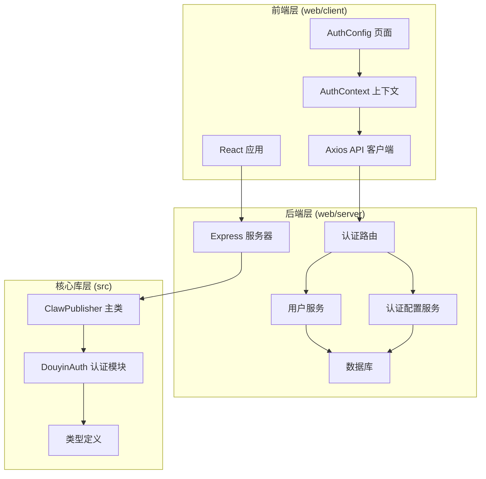
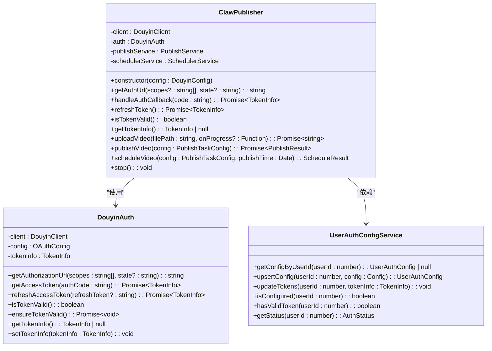
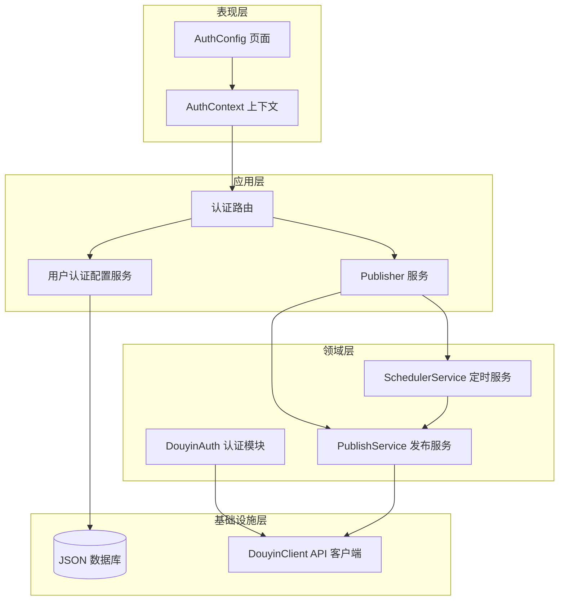
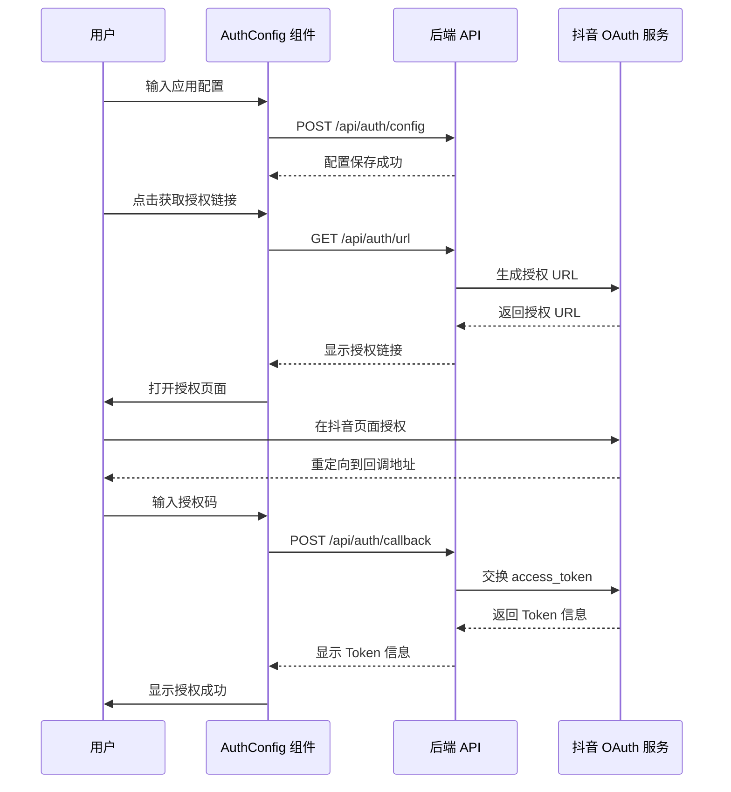
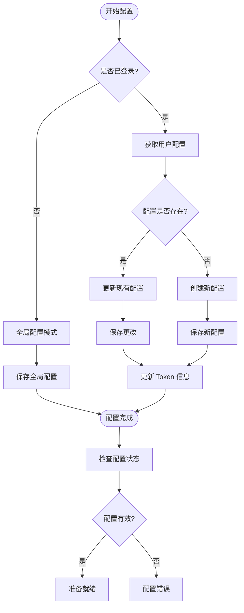
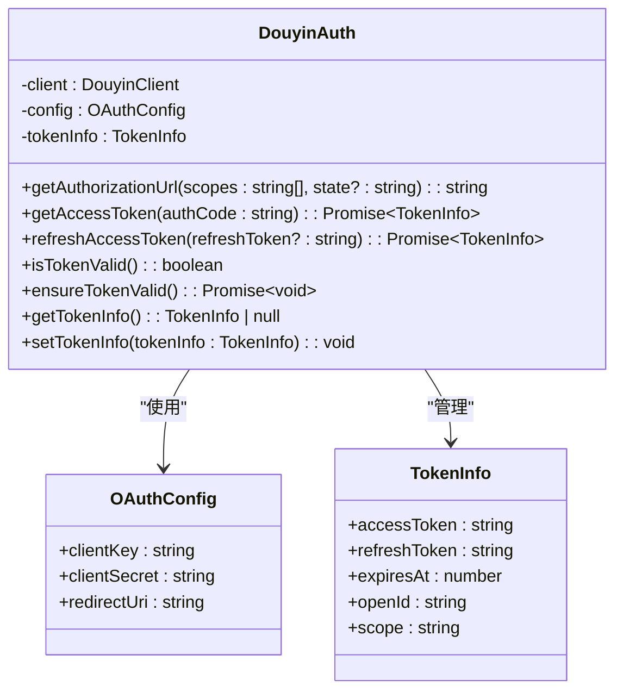
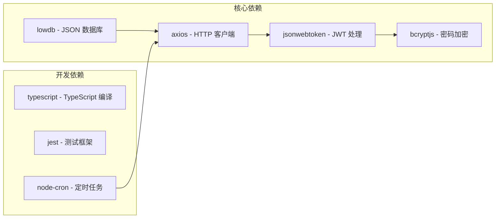
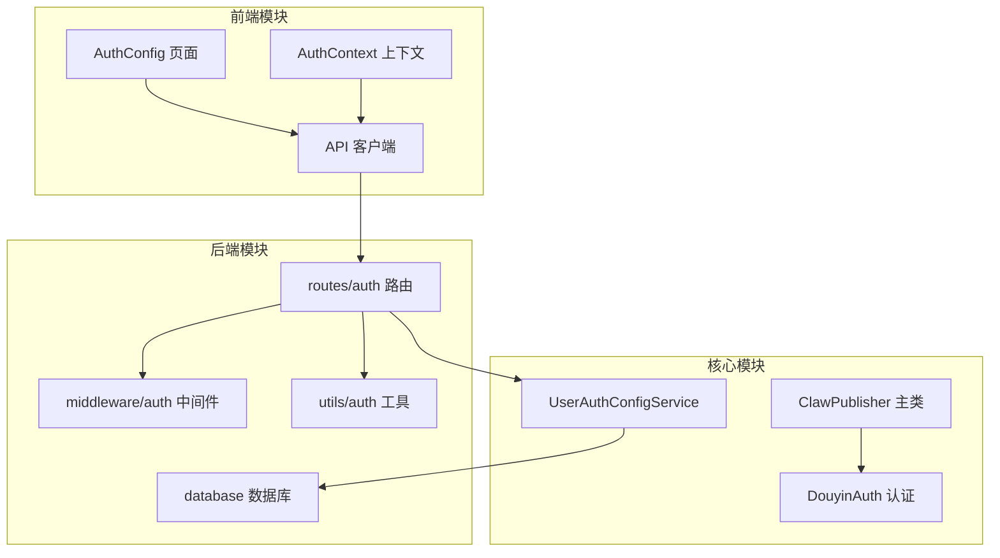

# 用户认证配置服务

<cite>
**本文档引用的文件**
- [src/index.ts](file://src/index.ts)
- [src/api/auth.ts](file://src/api/auth.ts)
- [src/models/types.ts](file://src/models/types.ts)
- [web/server/src/services/user-auth-config-service.ts](file://web/server/src/services/user-auth-config-service.ts)
- [web/server/src/routers/auth.ts](file://web/server/src/routers/auth.ts)
- [web/server/src/middleware/auth.ts](file://web/server/src/middleware/auth.ts)
- [web/server/src/utils/auth.ts](file://web/server/src/utils/auth.ts)
- [web/server/src/database/index.ts](file://web/server/src/database/index.ts)
- [web/server/src/models/user.ts](file://web/server/src/models/user.ts)
- [web/server/src/services/publisher.ts](file://web/server/src/services/publisher.ts)
- [web/client/src/pages/AuthConfig.tsx](file://web/client/src/pages/AuthConfig.tsx)
- [web/client/src/api/client.ts](file://web/client/src/api/client.ts)
- [web/client/src/contexts/AuthContext.tsx](file://web/client/src/contexts/AuthContext.tsx)
- [tests/unit/auth.test.ts](file://tests/unit/auth.test.ts)
- [config/default.ts](file://config/default.ts)
- [package.json](file://package.json)
</cite>

## 目录
1. [简介](#简介)
2. [项目结构](#项目结构)
3. [核心组件](#核心组件)
4. [架构概览](#架构概览)
5. [详细组件分析](#详细组件分析)
6. [依赖关系分析](#依赖关系分析)
7. [性能考虑](#性能考虑)
8. [故障排除指南](#故障排除指南)
9. [结论](#结论)

## 简介

用户认证配置服务是 ClawOperations 系统中的核心模块，负责管理抖音开放平台的 OAuth 认证配置和用户身份验证。该服务提供了完整的认证生命周期管理，包括应用配置、用户授权、Token 管理、以及前后端的认证集成。

系统采用前后端分离架构，前端使用 React + Ant Design 构建用户友好的配置界面，后端基于 Node.js 和 Express 提供 RESTful API 服务。认证配置服务支持两种模式：全局配置模式和用户专属配置模式，确保不同用户可以独立管理自己的抖音认证信息。

## 项目结构

ClawOperations 项目采用模块化设计，主要分为以下层次：

**图表来源**
- [src/index.ts:1-248](file://src/index.ts#L1-L248)
- [web/server/src/routers/auth.ts:1-167](file://web/server/src/routers/auth.ts#L1-L167)
- [web/server/src/services/user-auth-config-service.ts:1-167](file://web/server/src/services/user-auth-config-service.ts#L1-L167)

**章节来源**
- [src/index.ts:1-248](file://src/index.ts#L1-L248)
- [web/server/src/routers/auth.ts:1-167](file://web/server/src/routers/auth.ts#L1-L167)
- [web/server/src/services/user-auth-config-service.ts:1-167](file://web/server/src/services/user-auth-config-service.ts#L1-L167)

## 核心组件

### 1. ClawPublisher 主控制器

ClawPublisher 是系统的核心类，负责协调整个抖音视频发布流程。它封装了认证、上传、发布等所有功能，并提供了统一的对外接口。

**图表来源**
- [src/index.ts:29-244](file://src/index.ts#L29-L244)
- [src/api/auth.ts:29-189](file://src/api/auth.ts#L29-L189)
- [web/server/src/services/user-auth-config-service.ts:8-164](file://web/server/src/services/user-auth-config-service.ts#L8-L164)

### 2. 认证配置管理

系统实现了灵活的认证配置管理机制，支持全局配置和用户专属配置的双重模式。

**章节来源**
- [src/index.ts:39-67](file://src/index.ts#L39-L67)
- [src/api/auth.ts:29-189](file://src/api/auth.ts#L29-L189)
- [web/server/src/services/user-auth-config-service.ts:12-163](file://web/server/src/services/user-auth-config-service.ts#L12-L163)

## 架构概览

用户认证配置服务采用分层架构设计，确保各层职责清晰、耦合度低：

**图表来源**
- [web/client/src/pages/AuthConfig.tsx:45-491](file://web/client/src/pages/AuthConfig.tsx#L45-L491)
- [web/server/src/routers/auth.ts:14-164](file://web/server/src/routers/auth.ts#L14-L164)
- [web/server/src/services/user-auth-config-service.ts:8-164](file://web/server/src/services/user-auth-config-service.ts#L8-L164)

## 详细组件分析

### 1. 前端认证配置界面

AuthConfig 页面提供了完整的 OAuth 授权配置流程，包含四个主要步骤：

#### 授权流程步骤

**图表来源**
- [web/client/src/pages/AuthConfig.tsx:55-135](file://web/client/src/pages/AuthConfig.tsx#L55-L135)
- [web/client/src/api/client.ts:80-93](file://web/client/src/api/client.ts#L80-L93)
- [web/server/src/routers/auth.ts:14-134](file://web/server/src/routers/auth.ts#L14-L134)

#### 状态管理机制

前端使用 React Hooks 和 Context API 实现状态管理：

**章节来源**
- [web/client/src/pages/AuthConfig.tsx:45-491](file://web/client/src/pages/AuthConfig.tsx#L45-L491)
- [web/client/src/contexts/AuthContext.tsx:32-165](file://web/client/src/contexts/AuthContext.tsx#L32-L165)

### 2. 后端认证服务

#### 认证配置服务

UserAuthConfigService 提供了完整的用户认证配置管理功能：

**图表来源**
- [web/server/src/services/user-auth-config-service.ts:12-163](file://web/server/src/services/user-auth-config-service.ts#L12-L163)

#### 认证中间件

系统实现了多层认证保护机制：

**章节来源**
- [web/server/src/services/user-auth-config-service.ts:12-163](file://web/server/src/services/user-auth-config-service.ts#L12-L163)
- [web/server/src/middleware/auth.ts:18-92](file://web/server/src/middleware/auth.ts#L18-L92)
- [web/server/src/utils/auth.ts:21-91](file://web/server/src/utils/auth.ts#L21-L91)

### 3. 核心认证模块

#### DouyinAuth 认证类

DouyinAuth 类实现了完整的 OAuth 2.0 认证流程：

**图表来源**
- [src/api/auth.ts:29-189](file://src/api/auth.ts#L29-L189)
- [src/models/types.ts:20-46](file://src/models/types.ts#L20-L46)

**章节来源**
- [src/api/auth.ts:45-189](file://src/api/auth.ts#L45-L189)
- [src/models/types.ts:193-200](file://src/models/types.ts#L193-L200)

### 4. 数据持久化

#### 数据库设计

系统使用 lowdb 实现轻量级的数据持久化：

**章节来源**
- [web/server/src/database/index.ts:8-86](file://web/server/src/database/index.ts#L8-L86)
- [web/server/src/models/user.ts:74-86](file://web/server/src/models/user.ts#L74-L86)

## 依赖关系分析

### 1. 外部依赖

系统的主要外部依赖包括：

**图表来源**
- [package.json:18-37](file://package.json#L18-L37)

### 2. 内部模块依赖

**图表来源**
- [web/client/src/pages/AuthConfig.tsx:1-491](file://web/client/src/pages/AuthConfig.tsx#L1-L491)
- [web/server/src/routers/auth.ts:1-167](file://web/server/src/routers/auth.ts#L1-L167)
- [src/index.ts:1-248](file://src/index.ts#L1-L248)

**章节来源**
- [package.json:18-37](file://package.json#L18-L37)
- [web/server/src/routers/auth.ts:1-167](file://web/server/src/routers/auth.ts#L1-L167)

## 性能考虑

### 1. Token 管理优化

系统实现了智能的 Token 管理策略：

- **提前刷新机制**：在 Token 即将过期前 5 分钟自动刷新
- **缓存策略**：避免频繁的网络请求
- **错误处理**：优雅处理 Token 过期和刷新失败的情况

### 2. 数据库性能

- **内存缓存**：lowdb 在内存中维护数据，减少磁盘 I/O
- **批量操作**：支持批量更新和查询操作
- **索引优化**：针对常用查询字段建立索引

### 3. 前端性能

- **状态缓存**：使用 localStorage 缓存认证状态
- **懒加载**：按需加载组件和资源
- **防抖处理**：避免频繁的状态查询

## 故障排除指南

### 1. 常见问题及解决方案

#### OAuth 授权失败

**症状**：授权回调时出现错误

**可能原因**：
- Client Key/Secret 配置错误
- Redirect URI 与抖音平台配置不一致
- 网络连接问题

**解决步骤**：
1. 验证抖音开放平台的应用配置
2. 检查 Redirect URI 的一致性
3. 确认网络连接正常
4. 查看后端日志获取详细错误信息

#### Token 刷新失败

**症状**：Token 过期但刷新失败

**可能原因**：
- Refresh Token 已过期
- 网络请求超时
- 服务器端异常

**解决步骤**：
1. 重新进行 OAuth 授权流程
2. 检查网络连接和服务器状态
3. 验证 Token 信息的有效性

#### 数据库连接问题

**症状**：认证配置无法保存

**可能原因**：
- 数据库文件权限问题
- 磁盘空间不足
- 文件被其他进程占用

**解决步骤**：
1. 检查数据库文件权限
2. 确认磁盘空间充足
3. 关闭可能占用文件的进程
4. 重启应用服务

**章节来源**
- [tests/unit/auth.test.ts:17-232](file://tests/unit/auth.test.ts#L17-L232)
- [web/server/src/services/user-auth-config-service.ts:98-132](file://web/server/src/services/user-auth-config-service.ts#L98-L132)

### 2. 调试工具

系统提供了完善的调试和监控功能：

- **日志记录**：详细的操作日志和错误日志
- **状态检查**：实时查看认证状态和配置信息
- **错误报告**：友好的错误提示和解决方案建议

## 结论

用户认证配置服务是 ClawOperations 系统的重要组成部分，它提供了完整的 OAuth 认证解决方案，支持多用户环境下的独立配置管理。系统采用现代化的技术栈和架构设计，具有以下特点：

### 主要优势

1. **模块化设计**：清晰的分层架构，便于维护和扩展
2. **用户友好**：直观的配置界面和完整的授权流程
3. **安全性高**：多重认证保护和安全的 Token 管理
4. **性能优秀**：智能缓存和优化的网络请求策略
5. **易于集成**：标准化的 API 接口和配置管理

### 技术亮点

- **前后端分离**：采用现代 Web 开发模式
- **类型安全**：完整的 TypeScript 类型定义
- **测试覆盖**：全面的单元测试和集成测试
- **文档完善**：详细的 API 文档和使用指南

### 未来发展方向

1. **增强安全性**：实现更严格的访问控制和安全审计
2. **扩展支持**：支持更多的第三方平台认证
3. **性能优化**：进一步优化数据库查询和网络请求
4. **用户体验**：持续改进用户界面和交互体验

该认证配置服务为整个 ClawOperations 系统奠定了坚实的基础，为抖音营销账号的自动化运营提供了可靠的技术保障。