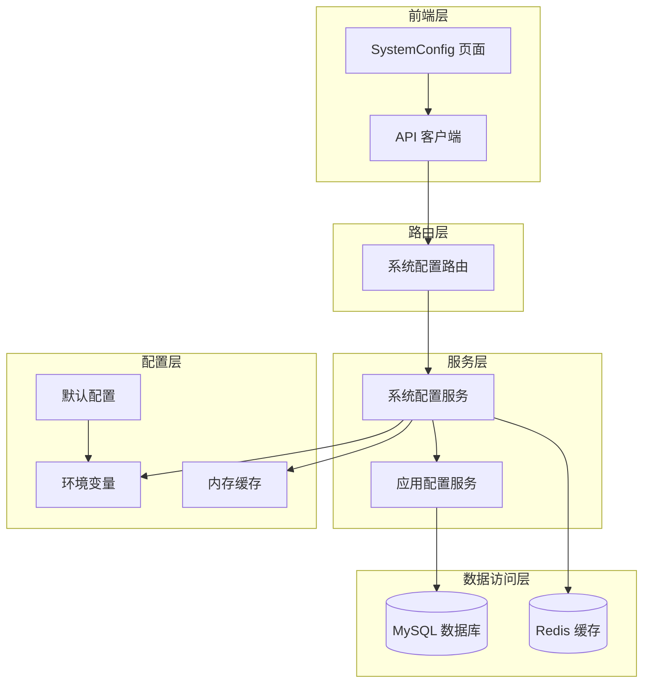
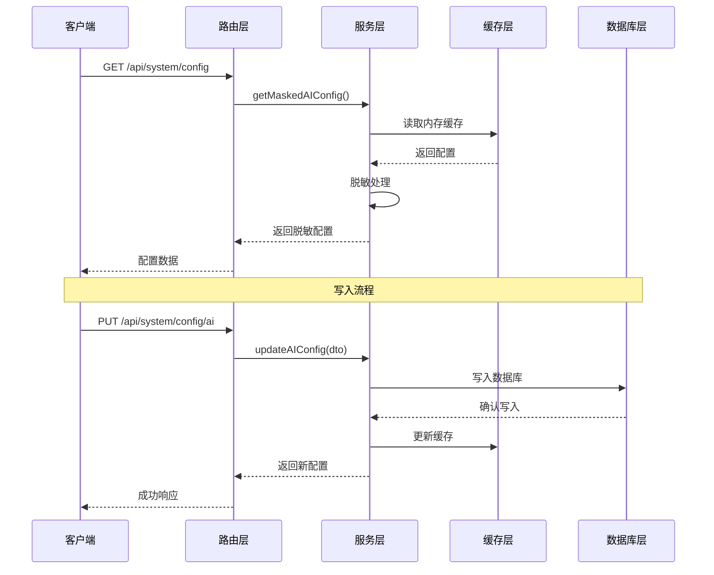
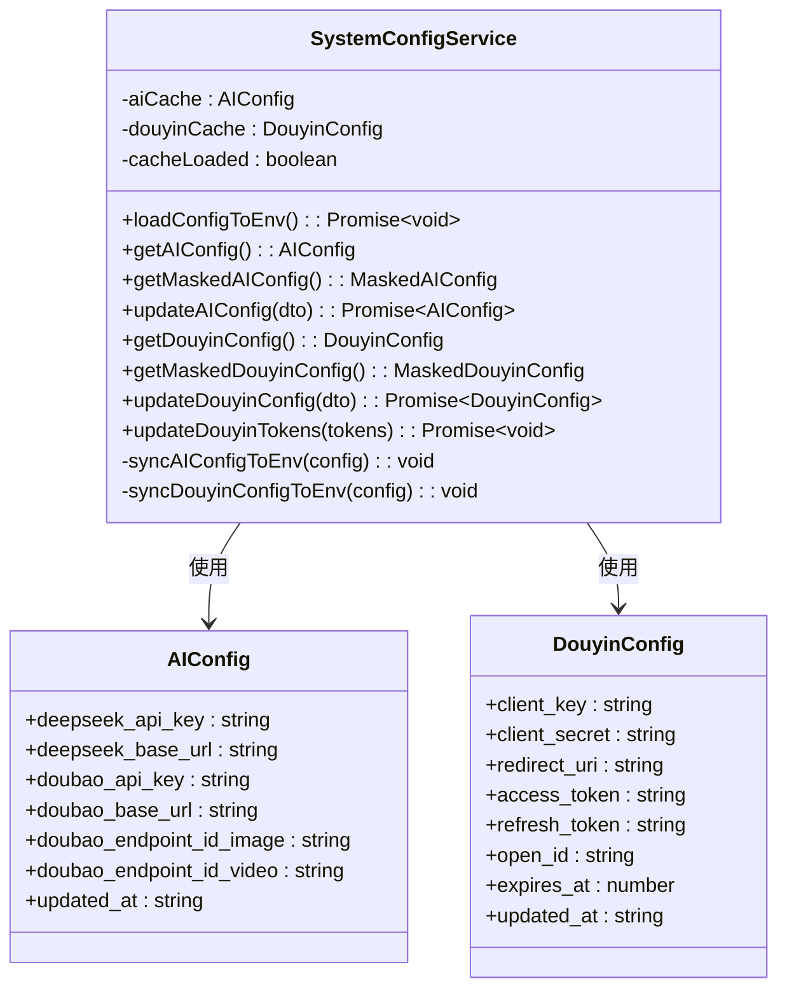
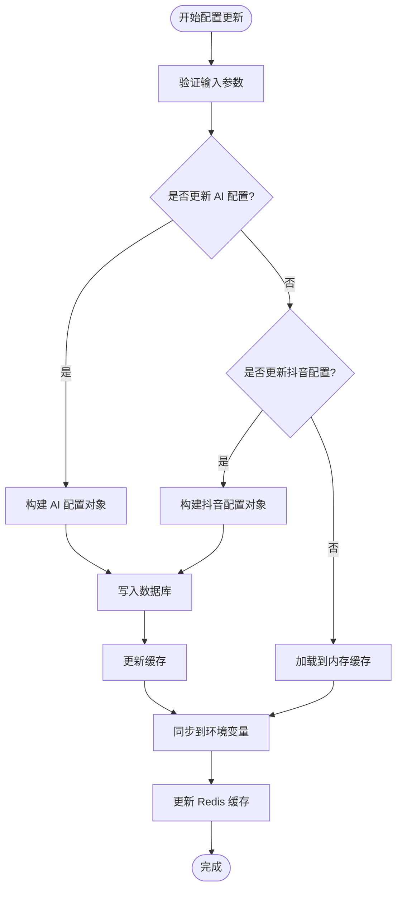
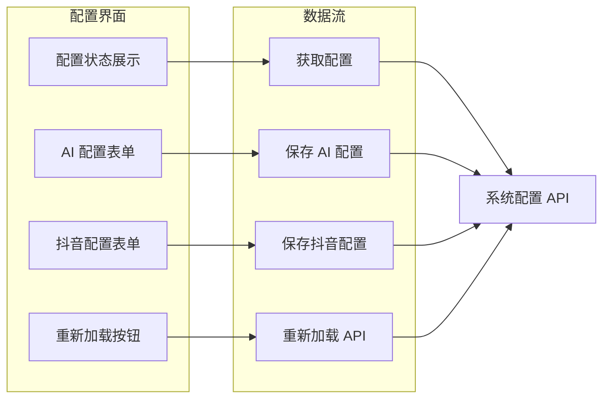
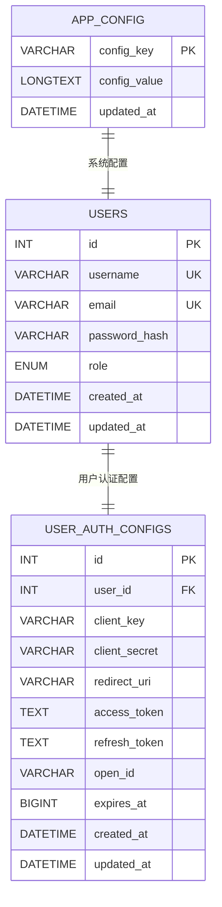
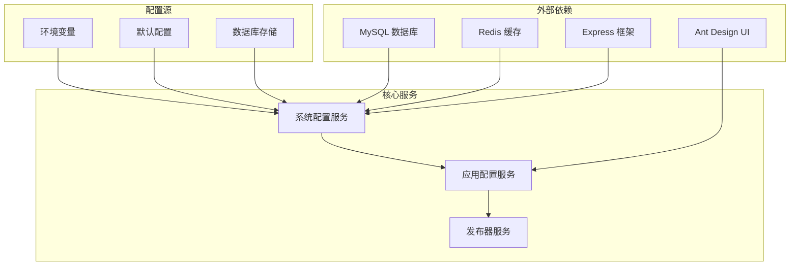

# 系统配置管理

<cite>
**本文档引用的文件**
- [config/default.ts](file://config/default.ts)
- [web/server/src/services/system-config-service.ts](file://web/server/src/services/system-config-service.ts)
- [web/server/src/routes/system.ts](file://web/server/src/routes/system.ts)
- [web/client/src/pages/SystemConfig.tsx](file://web/client/src/pages/SystemConfig.tsx)
- [web/server/src/database/schema.sql](file://web/server/src/database/schema.sql)
- [web/server/src/index.ts](file://web/server/src/index.ts)
- [web/server/src/database/index.ts](file://web/server/src/database/index.ts)
- [web/server/src/services/publisher.ts](file://web/server/src/services/publisher.ts)
- [web/server/src/services/app-config-service.ts](file://web/server/src/services/app-config-service.ts)
- [web/server/package.json](file://web/server/package.json)
</cite>

## 目录
1. [简介](#简介)
2. [项目结构](#项目结构)
3. [核心组件](#核心组件)
4. [架构概览](#架构概览)
5. [详细组件分析](#详细组件分析)
6. [依赖关系分析](#依赖关系分析)
7. [性能考虑](#性能考虑)
8. [故障排除指南](#故障排除指南)
9. [结论](#结论)

## 简介

系统配置管理系统是 ClawOperations 平台的核心基础设施，负责管理所有系统级配置参数，包括 AI 服务配置、抖音应用配置以及各种业务参数。该系统采用多层架构设计，结合 MySQL 数据库存储、Redis 缓存和内存缓存，确保配置的高可用性和实时性。

系统配置管理支持以下主要功能：
- AI 服务配置管理（DeepSeek、豆包 AI）
- 抖音应用配置管理
- 配置的持久化存储
- 实时配置同步
- 安全的敏感信息处理
- 管理员权限控制

## 项目结构

系统配置管理涉及多个层次的组件协作：

**图表来源**
- [web/client/src/pages/SystemConfig.tsx:1-358](file://web/client/src/pages/SystemConfig.tsx#L1-L358)
- [web/server/src/routes/system.ts:1-188](file://web/server/src/routes/system.ts#L1-L188)
- [web/server/src/services/system-config-service.ts:1-280](file://web/server/src/services/system-config-service.ts#L1-L280)

**章节来源**
- [web/server/src/index.ts:1-93](file://web/server/src/index.ts#L1-L93)
- [config/default.ts:1-70](file://config/default.ts#L1-L70)

## 核心组件

### 配置存储结构

系统配置采用 JSON 格式存储在 MySQL 数据库中，支持以下配置类型：

| 配置类型 | 存储键 | 描述 |
|---------|--------|------|
| AI 配置 | `ai_config` | DeepSeek 和豆包 AI 的 API 密钥和基础 URL |
| 抖音配置 | `douyin_config` | 抖音应用的客户端密钥和令牌信息 |

### 缓存策略

系统采用三层缓存架构：

1. **内存缓存**：进程内缓存，提供最快的读取速度
2. **Redis 缓存**：分布式缓存，支持 TTL 过期机制
3. **数据库缓存**：持久化存储，确保数据安全

**章节来源**
- [web/server/src/services/system-config-service.ts:93-96](file://web/server/src/services/system-config-service.ts#L93-L96)
- [web/server/src/database/schema.sql:74-79](file://web/server/src/database/schema.sql#L74-L79)

## 架构概览

系统配置管理的整体架构采用分层设计，确保配置的高可用性和安全性：

**图表来源**
- [web/server/src/routes/system.ts:17-36](file://web/server/src/routes/system.ts#L17-L36)
- [web/server/src/services/system-config-service.ts:180-201](file://web/server/src/services/system-config-service.ts#L180-L201)

## 详细组件分析

### 系统配置服务

系统配置服务是整个配置管理的核心组件，负责处理所有配置相关的操作：

**图表来源**
- [web/server/src/services/system-config-service.ts:133-277](file://web/server/src/services/system-config-service.ts#L133-L277)

#### 配置更新流程

系统配置服务提供了完整的配置更新流程，确保数据的一致性和完整性：

**图表来源**
- [web/server/src/services/system-config-service.ts:180-201](file://web/server/src/services/system-config-service.ts#L180-L201)
- [web/server/src/services/system-config-service.ts:222-241](file://web/server/src/services/system-config-service.ts#L222-L241)

**章节来源**
- [web/server/src/services/system-config-service.ts:133-277](file://web/server/src/services/system-config-service.ts#L133-L277)

### 前端配置界面

前端系统配置页面提供了直观的用户界面来管理所有系统配置：

**图表来源**
- [web/client/src/pages/SystemConfig.tsx:55-358](file://web/client/src/pages/SystemConfig.tsx#L55-L358)

#### 配置状态展示

前端界面提供了详细的配置状态展示，包括：

- **AI 配置状态**：DeepSeek 和豆包 AI 的配置状态
- **抖音配置状态**：客户端密钥、令牌等信息
- **敏感信息脱敏**：API Key 等敏感信息的安全显示
- **更新时间追踪**：配置最后更新的时间戳

**章节来源**
- [web/client/src/pages/SystemConfig.tsx:174-350](file://web/client/src/pages/SystemConfig.tsx#L174-L350)

### 数据库架构

系统配置使用专门的数据库表来存储配置信息：

**图表来源**
- [web/server/src/database/schema.sql:74-79](file://web/server/src/database/schema.sql#L74-L79)
- [web/server/src/database/schema.sql:23-37](file://web/server/src/database/schema.sql#L23-L37)

**章节来源**
- [web/server/src/database/schema.sql:1-79](file://web/server/src/database/schema.sql#L1-L79)

## 依赖关系分析

系统配置管理涉及多个组件之间的复杂依赖关系：

**图表来源**
- [web/server/package.json:13-23](file://web/server/package.json#L13-L23)
- [web/server/src/services/system-config-service.ts:1-280](file://web/server/src/services/system-config-service.ts#L1-L280)

### 组件耦合度分析

系统配置管理展现了良好的模块化设计：

- **低耦合**：各组件职责明确，相互独立
- **高内聚**：相同功能的代码集中在一个模块中
- **依赖注入**：通过构造函数传递依赖，便于测试
- **接口抽象**：定义清晰的接口契约

**章节来源**
- [web/server/src/services/system-config-service.ts:1-280](file://web/server/src/services/system-config-service.ts#L1-L280)
- [web/server/src/services/app-config-service.ts:1-87](file://web/server/src/services/app-config-service.ts#L1-L87)

## 性能考虑

系统配置管理在设计时充分考虑了性能优化：

### 缓存策略优化

1. **内存缓存优先**：提供最快的读取速度
2. **Redis 缓存降级**：在网络异常时提供缓存功能
3. **TTL 过期机制**：避免缓存数据过期
4. **批量更新**：减少数据库写入次数

### 数据库优化

1. **连接池管理**：复用数据库连接
2. **索引优化**：为常用查询字段建立索引
3. **事务处理**：确保配置更新的原子性
4. **异步写入**：避免阻塞主线程

### 安全性考虑

1. **敏感信息脱敏**：前端只显示部分敏感信息
2. **管理员权限控制**：所有配置操作都需要管理员权限
3. **输入验证**：严格的参数验证和类型检查
4. **日志记录**：完整的操作审计日志

## 故障排除指南

### 常见问题及解决方案

#### 配置加载失败

**问题描述**：系统启动时无法加载配置到环境变量

**可能原因**：
- 数据库连接失败
- Redis 连接异常
- 配置表不存在或为空

**解决步骤**：
1. 检查数据库连接配置
2. 验证 Redis 服务状态
3. 确认 app_config 表存在且有数据

#### 权限不足

**问题描述**：普通用户尝试访问配置管理页面

**解决步骤**：
1. 确保用户具有管理员角色
2. 检查 JWT 令牌的有效性
3. 验证用户权限配置

#### 配置更新失败

**问题描述**：配置更新后无法生效

**解决步骤**：
1. 检查数据库写入是否成功
2. 验证缓存更新状态
3. 确认环境变量同步完成

**章节来源**
- [web/server/src/routes/system.ts:17-36](file://web/server/src/routes/system.ts#L17-L36)
- [web/server/src/services/system-config-service.ts:142-157](file://web/server/src/services/system-config-service.ts#L142-L157)

### 调试工具

系统提供了多种调试和监控工具：

1. **日志输出**：详细的系统运行日志
2. **健康检查**：数据库和 Redis 连接状态检查
3. **配置验证**：配置参数的完整性和有效性检查
4. **性能监控**：缓存命中率和数据库查询性能

## 结论

系统配置管理系统展现了现代 Web 应用的优秀实践，通过合理的架构设计和实现策略，实现了配置管理的高可用性、安全性和可维护性。

### 主要优势

1. **多层缓存架构**：确保配置访问的高性能
2. **安全的敏感信息处理**：保护 API 密钥等敏感数据
3. **完整的权限控制**：防止未授权的配置修改
4. **优雅的错误处理**：提供良好的用户体验和系统稳定性
5. **清晰的代码结构**：便于维护和扩展

### 改进建议

1. **配置版本管理**：添加配置历史版本跟踪
2. **配置模板系统**：提供预设的配置模板
3. **配置导入导出**：支持配置的批量导入导出
4. **配置验证规则**：更严格的配置参数验证
5. **监控告警系统**：配置变更的实时告警通知

该系统配置管理方案为类似的企业级应用提供了优秀的参考模板，其设计理念和实现方式值得在其他项目中借鉴和应用。