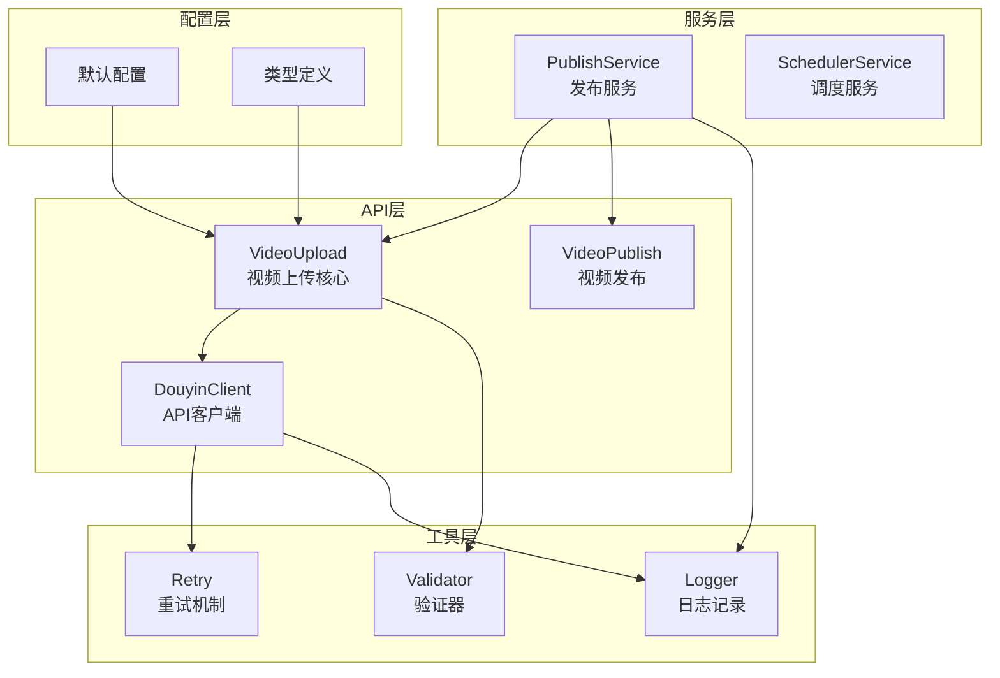
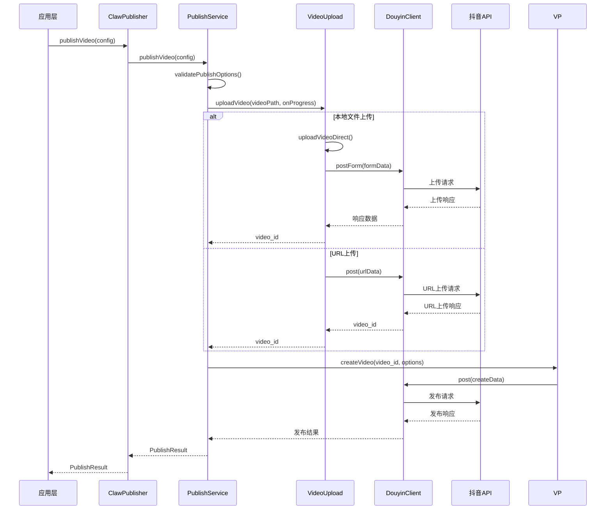
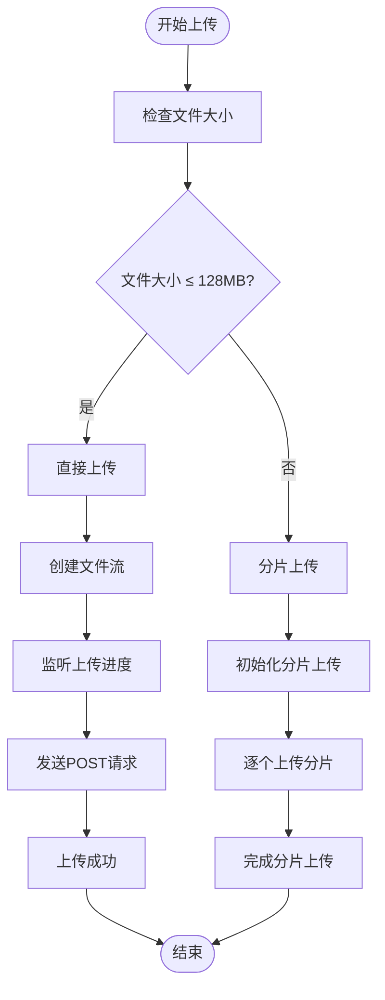
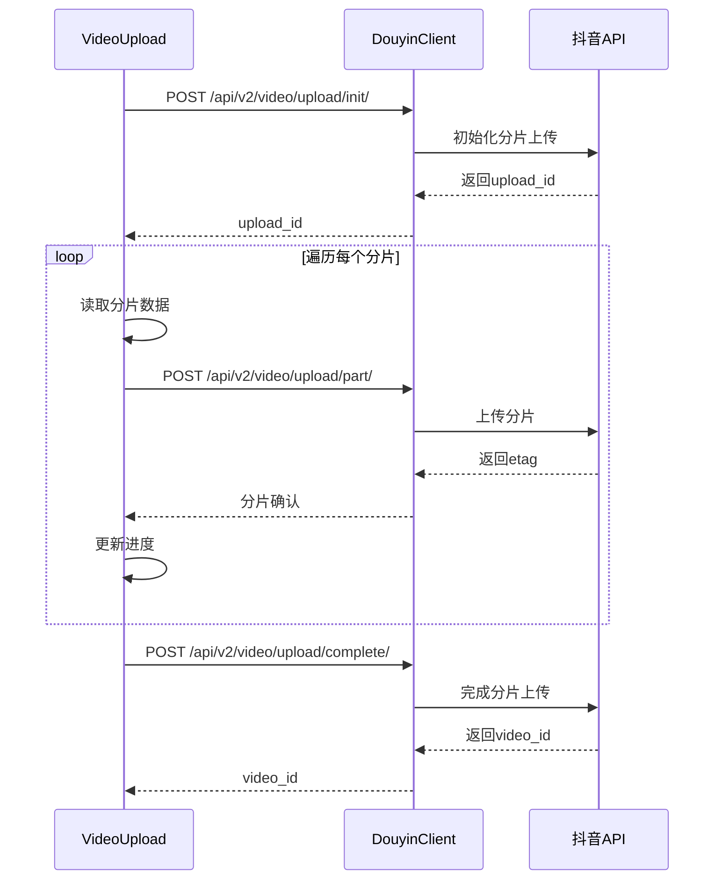
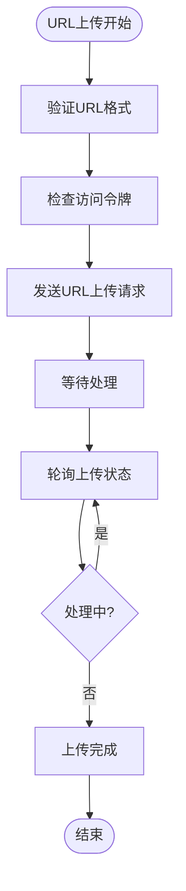
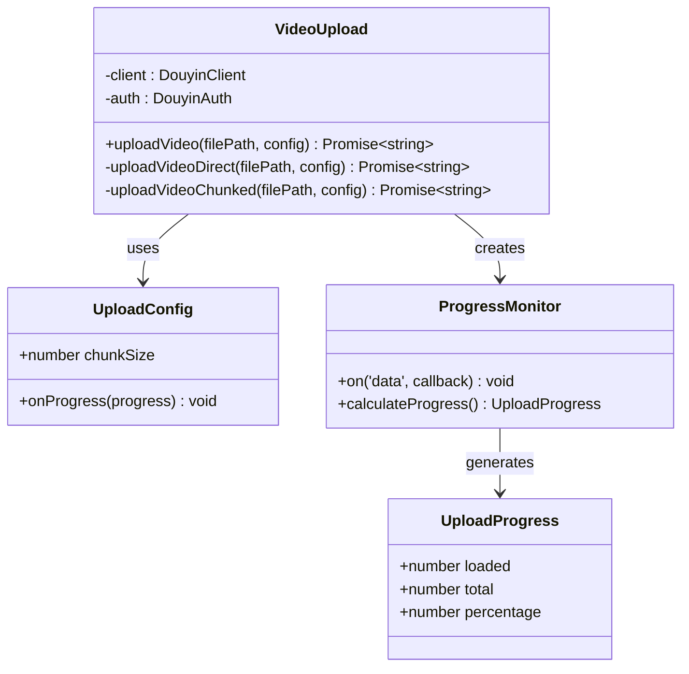
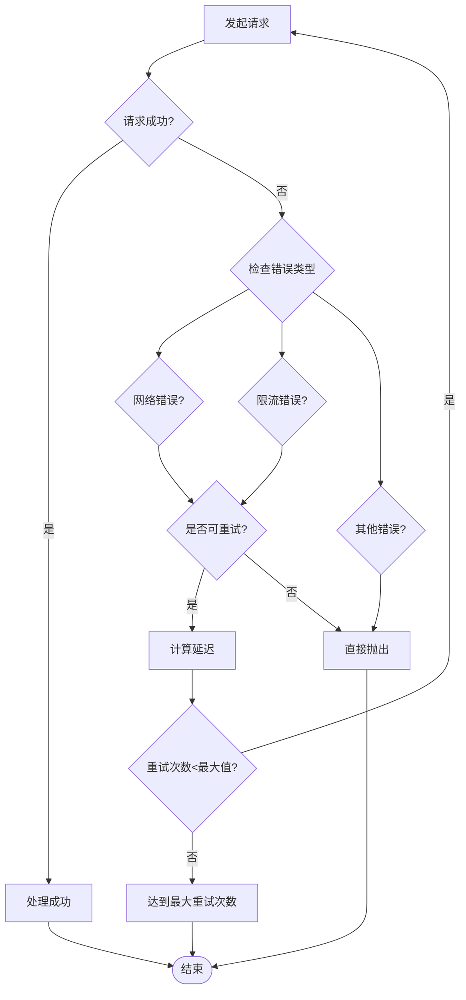
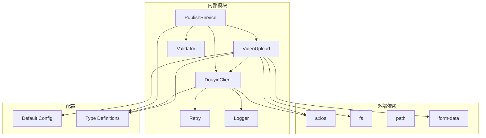
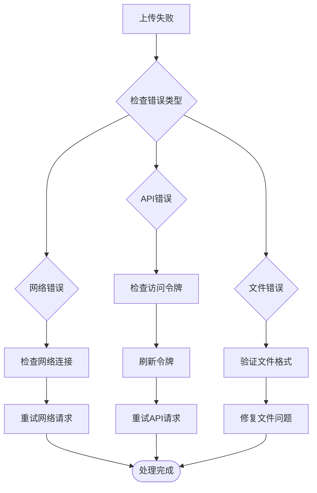

# 视频上传模块

<cite>
**本文档引用的文件**
- [src/api/video-upload.ts](file://src/api/video-upload.ts)
- [src/api/douyin-client.ts](file://src/api/douyin-client.ts)
- [src/services/publish-service.ts](file://src/services/publish-service.ts)
- [src/models/types.ts](file://src/models/types.ts)
- [src/utils/retry.ts](file://src/utils/retry.ts)
- [config/default.ts](file://config/default.ts)
- [src/utils/validator.ts](file://src/utils/validator.ts)
- [src/api/video-publish.ts](file://src/api/video-publish.ts)
- [src/index.ts](file://src/index.ts)
- [example.ts](file://example.ts)
</cite>

## 目录
1. [简介](#简介)
2. [项目结构](#项目结构)
3. [核心组件](#核心组件)
4. [架构概览](#架构概览)
5. [详细组件分析](#详细组件分析)
6. [依赖关系分析](#依赖关系分析)
7. [性能考虑](#性能考虑)
8. [故障排除指南](#故障排除指南)
9. [结论](#结论)
10. [附录](#附录)

## 简介

视频上传模块是抖音开放平台集成系统的核心组件，提供了完整的视频上传解决方案。该模块支持三种主要上传策略：本地文件直传、远程URL直传和分片上传，并集成了完善的进度监控、错误处理和重试机制。

本模块采用现代化的TypeScript架构设计，遵循单一职责原则，通过清晰的接口分离关注点，为上层应用提供简洁易用的API接口。

## 项目结构

视频上传模块位于`src/api`目录下，采用按功能模块划分的组织方式：

**图表来源**
- [src/api/video-upload.ts:1-241](file://src/api/video-upload.ts#L1-L241)
- [src/api/douyin-client.ts:1-237](file://src/api/douyin-client.ts#L1-L237)
- [src/services/publish-service.ts:1-228](file://src/services/publish-service.ts#L1-L228)

**章节来源**
- [src/api/video-upload.ts:1-241](file://src/api/video-upload.ts#L1-L241)
- [src/services/publish-service.ts:1-228](file://src/services/publish-service.ts#L1-L228)

## 核心组件

### 视频上传核心类

VideoUpload类是上传模块的核心，负责处理所有上传逻辑：

- **自动上传策略选择**：根据文件大小自动选择合适的上传方式
- **多上传模式支持**：本地直传、远程URL直传、分片上传
- **进度监控**：实时上传进度反馈
- **错误处理**：完善的异常捕获和处理机制

### API客户端

DouyinClient提供统一的API访问接口：

- **请求拦截器**：自动注入访问令牌
- **响应拦截器**：统一错误处理和响应解析
- **重试机制**：基于指数退避的智能重试
- **类型安全**：完整的TypeScript类型定义

### 发布服务

PublishService作为业务编排层：

- **一站式发布**：上传+发布的完整流程
- **参数验证**：严格的输入参数验证
- **状态管理**：视频状态查询和管理
- **错误恢复**：失败后的错误处理和恢复

**章节来源**
- [src/api/video-upload.ts:20-27](file://src/api/video-upload.ts#L20-L27)
- [src/api/douyin-client.ts:13-27](file://src/api/douyin-client.ts#L13-L27)
- [src/services/publish-service.ts:22-31](file://src/services/publish-service.ts#L22-L31)

## 架构概览

视频上传系统采用分层架构设计，各层职责明确，耦合度低：

**图表来源**
- [src/index.ts:153-155](file://src/index.ts#L153-L155)
- [src/services/publish-service.ts:38-80](file://src/services/publish-service.ts#L38-L80)
- [src/api/video-upload.ts:35-54](file://src/api/video-upload.ts#L35-L54)

## 详细组件分析

### 上传策略实现

#### 本地文件直传策略

本地文件直传适用于小文件（小于128MB）的快速上传场景：

**图表来源**
- [src/api/video-upload.ts:35-54](file://src/api/video-upload.ts#L35-L54)
- [src/api/video-upload.ts:62-96](file://src/api/video-upload.ts#L62-L96)

#### 分片上传策略

分片上传适用于大文件（大于128MB）的稳定上传场景：

**图表来源**
- [src/api/video-upload.ts:104-152](file://src/api/video-upload.ts#L104-L152)
- [src/api/video-upload.ts:160-213](file://src/api/video-upload.ts#L160-L213)

#### 远程URL上传策略

远程URL上传允许直接从网络地址上传视频：

**图表来源**
- [src/api/video-upload.ts:220-237](file://src/api/video-upload.ts#L220-L237)

**章节来源**
- [src/api/video-upload.ts:29-54](file://src/api/video-upload.ts#L29-L54)
- [src/api/video-upload.ts:104-152](file://src/api/video-upload.ts#L104-L152)
- [src/api/video-upload.ts:220-237](file://src/api/video-upload.ts#L220-L237)

### 进度监控机制

上传进度监控通过事件驱动的方式实现：

**图表来源**
- [src/api/video-upload.ts:53-65](file://src/api/video-upload.ts#L53-L65)
- [src/models/types.ts:59-65](file://src/models/types.ts#L59-L65)

**章节来源**
- [src/api/video-upload.ts:71-82](file://src/api/video-upload.ts#L71-L82)
- [src/models/types.ts:59-65](file://src/models/types.ts#L59-L65)

### 错误处理和重试机制

系统实现了多层次的错误处理和重试机制：

**图表来源**
- [src/utils/retry.ts:41-81](file://src/utils/retry.ts#L41-L81)
- [src/api/douyin-client.ts:204-220](file://src/api/douyin-client.ts#L204-L220)

**章节来源**
- [src/utils/retry.ts:1-84](file://src/utils/retry.ts#L1-L84)
- [src/api/douyin-client.ts:97-116](file://src/api/douyin-client.ts#L97-L116)

### 内存管理和大文件处理

针对大文件上传，系统采用了多项内存优化策略：

1. **流式读取**：避免一次性加载整个文件到内存
2. **分片缓冲**：控制分片大小，平衡内存使用和并发效率
3. **及时释放**：使用同步文件操作确保资源及时释放
4. **进度监控**：实时监控内存使用情况

**章节来源**
- [src/api/video-upload.ts:124-129](file://src/api/video-upload.ts#L124-L129)
- [config/default.ts:10-15](file://config/default.ts#L10-L15)

## 依赖关系分析

视频上传模块的依赖关系清晰明确：

**图表来源**
- [src/api/video-upload.ts:1-13](file://src/api/video-upload.ts#L1-L13)
- [src/api/douyin-client.ts:1-6](file://src/api/douyin-client.ts#L1-L6)

**章节来源**
- [src/api/video-upload.ts:1-13](file://src/api/video-upload.ts#L1-L13)
- [src/api/douyin-client.ts:1-6](file://src/api/douyin-client.ts#L1-L6)

## 性能考虑

### 上传策略性能对比

| 上传方式 | 适用场景 | 优点 | 缺点 | 性能特点 |
|---------|----------|------|------|----------|
| 直接上传 | 小文件 (<128MB) | 简单快速，延迟低 | 不支持超大文件 | 高效，无分片开销 |
| 分片上传 | 大文件 (>128MB) | 稳定可靠，支持断点续传 | 复杂度高，有分片开销 | 高吞吐，可扩展 |
| URL上传 | 远程资源 | 无需本地存储 | 受网络带宽限制 | 依赖源服务器性能 |

### 内存使用优化

1. **流式处理**：使用`fs.createReadStream`避免内存峰值
2. **分片控制**：默认5MB分片大小，平衡内存和性能
3. **及时释放**：使用同步文件操作确保资源及时回收
4. **进度监控**：实时监控内存使用情况

### 网络性能优化

1. **连接复用**：基于axios的连接池管理
2. **超时控制**：合理的请求超时设置
3. **重试策略**：智能的指数退避重试
4. **并发控制**：分片上传的并发优化

## 故障排除指南

### 常见问题及解决方案

#### 上传失败处理

#### 重试策略配置

系统提供了灵活的重试配置选项：

- **最大重试次数**：默认3次
- **基础延迟**：1秒
- **最大延迟**：30秒
- **自定义重试条件**：支持业务特定的重试逻辑

**章节来源**
- [src/utils/retry.ts:9-13](file://src/utils/retry.ts#L9-L13)
- [src/api/douyin-client.ts:204-220](file://src/api/douyin-client.ts#L204-L220)

### 调试和监控

系统提供了完整的调试和监控能力：

1. **日志记录**：详细的上传过程日志
2. **进度监控**：实时上传进度反馈
3. **错误追踪**：完整的错误堆栈信息
4. **性能指标**：上传速度和成功率统计

## 结论

视频上传模块通过精心设计的架构和实现，为抖音开放平台提供了强大而可靠的视频上传能力。模块具有以下突出特点：

1. **多策略支持**：适应不同场景的上传需求
2. **高性能设计**：优化的内存和网络使用
3. **健壮性保障**：完善的错误处理和重试机制
4. **易用性**：简洁的API接口和丰富的配置选项

该模块为上层应用提供了稳定可靠的视频上传基础设施，支持从小规模个人应用到大规模企业级应用的各种需求。

## 附录

### 配置参数说明

| 参数名称 | 默认值 | 说明 |
|---------|--------|------|
| CHUNK_UPLOAD_THRESHOLD | 128MB | 分片上传阈值 |
| DEFAULT_CHUNK_SIZE | 5MB | 分片大小 |
| MAX_RETRIES | 3次 | 最大重试次数 |
| BASE_DELAY | 1000ms | 基础延迟时间 |
| MAX_DELAY | 30000ms | 最大延迟时间 |

### 使用示例

完整的上传流程示例可在以下文件中找到：
- [example.ts](file://example.ts) - 完整的使用示例
- [src/index.ts](file://src/index.ts) - 主要API接口
- [src/services/publish-service.ts](file://src/services/publish-service.ts) - 业务编排示例