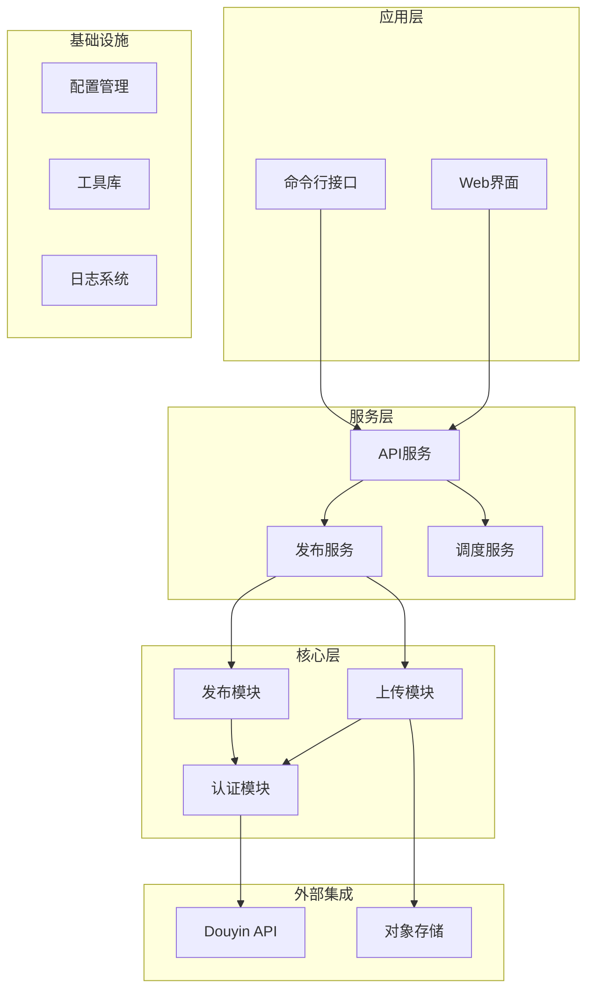
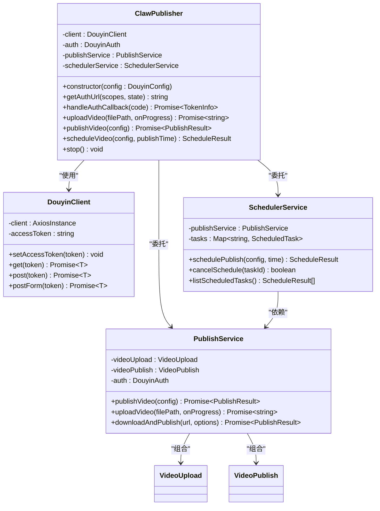
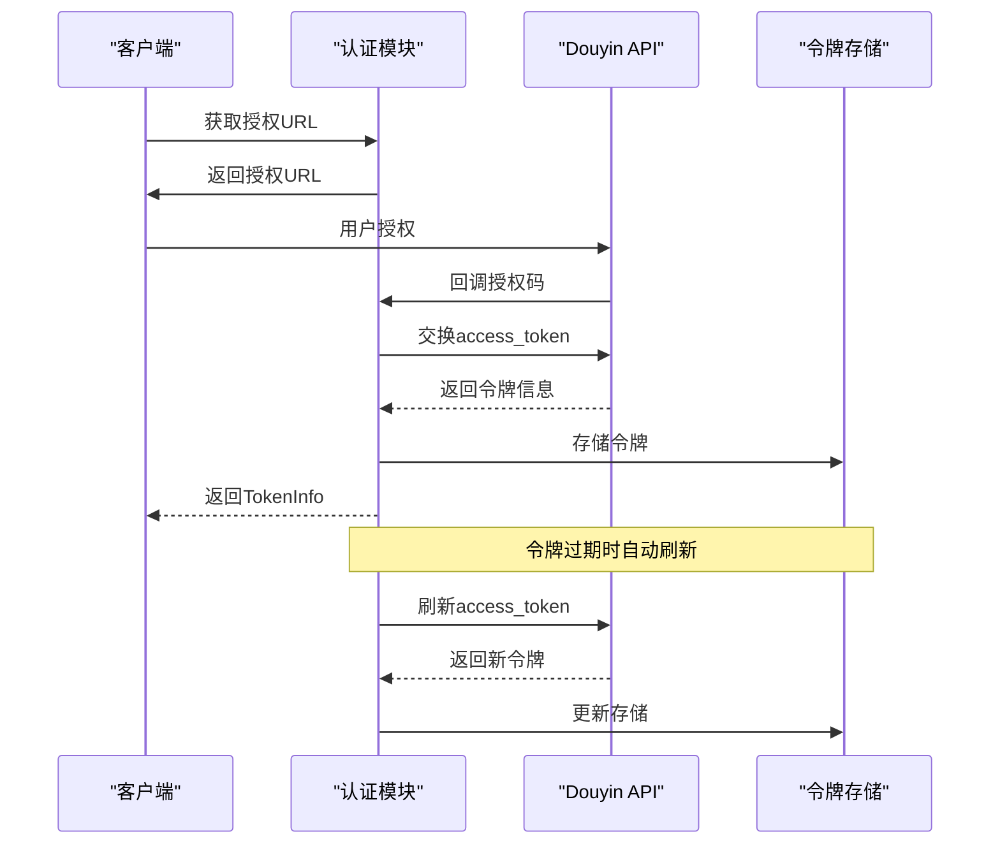
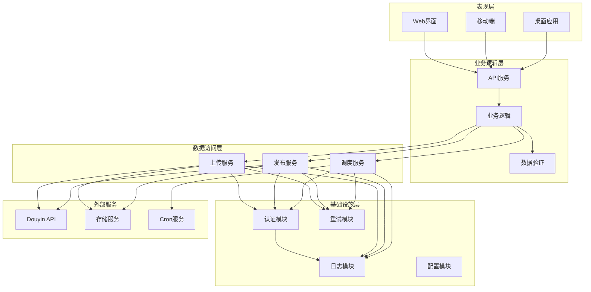
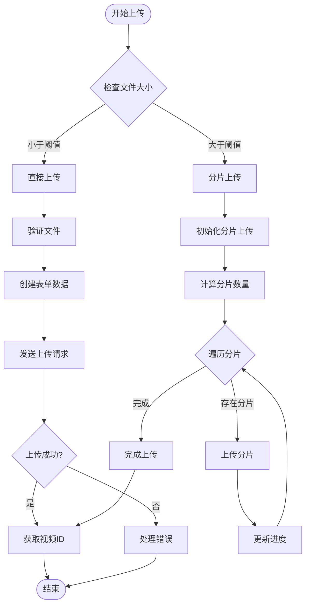
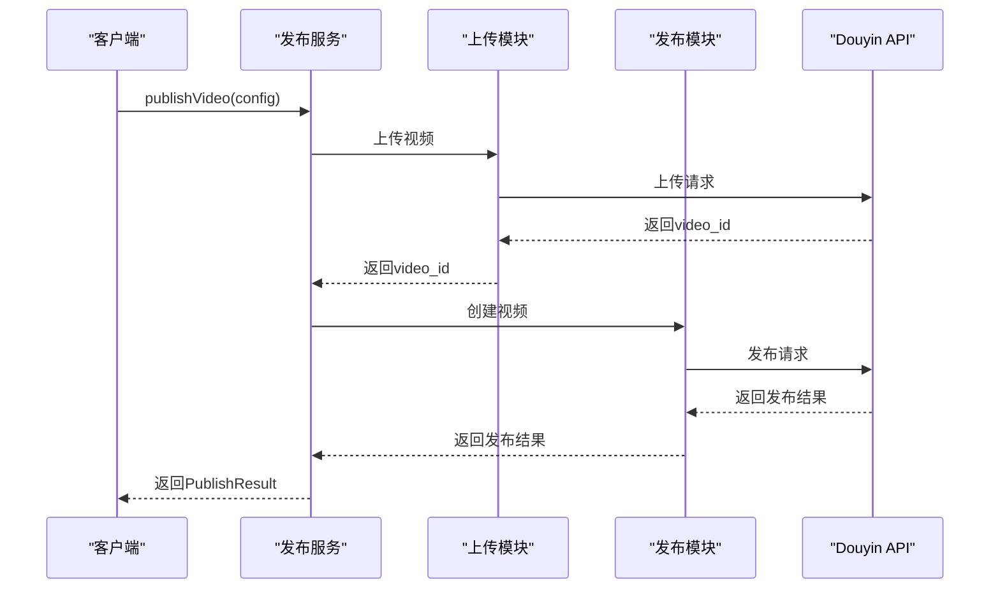
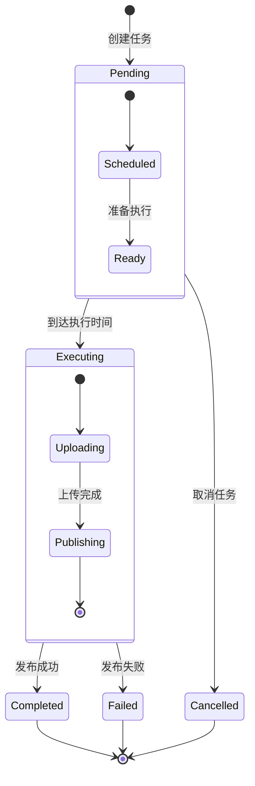
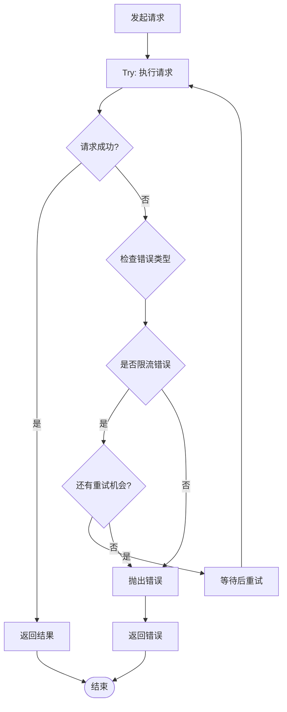
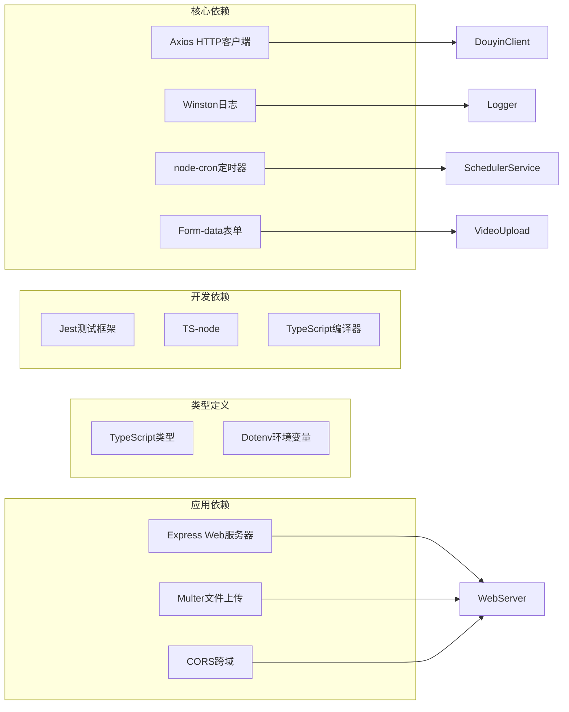

# 视频上传系统

<cite>
**本文档引用的文件**
- [README.md](file://README.md)
- [package.json](file://package.json)
- [src/index.ts](file://src/index.ts)
- [src/api/douyin-client.ts](file://src/api/douyin-client.ts)
- [src/api/auth.ts](file://src/api/auth.ts)
- [src/api/video-upload.ts](file://src/api/video-upload.ts)
- [src/api/video-publish.ts](file://src/api/video-publish.ts)
- [src/services/publish-service.ts](file://src/services/publish-service.ts)
- [src/services/scheduler-service.ts](file://src/services/scheduler-service.ts)
- [src/models/types.ts](file://src/models/types.ts)
- [src/utils/logger.ts](file://src/utils/logger.ts)
- [src/utils/retry.ts](file://src/utils/retry.ts)
- [config/default.ts](file://config/default.ts)
- [web/server/src/index.ts](file://web/server/src/index.ts)
- [web/server/package.json](file://web/server/package.json)
</cite>

## 目录
1. [简介](#简介)
2. [项目结构](#项目结构)
3. [核心组件](#核心组件)
4. [架构概览](#架构概览)
5. [详细组件分析](#详细组件分析)
6. [依赖关系分析](#依赖关系分析)
7. [性能考虑](#性能考虑)
8. [故障排除指南](#故障排除指南)
9. [结论](#结论)

## 简介

ClawOperations 是一个专门设计用于抖音（TikTok）官方 API 集成的自动化运营系统，专注于小龙虾主题的营销账号管理。该系统提供了完整的视频上传、发布、调度和管理功能，支持本地文件上传、远程 URL 上传、分片上传、定时发布等高级特性。

系统采用模块化设计，包含认证管理、视频上传、视频发布、任务调度等多个核心服务，为小龙虾品牌的抖音营销活动提供全面的技术支持。

## 项目结构

该项目采用清晰的分层架构，主要分为以下层次：

**图表来源**
- [src/index.ts:29-67](file://src/index.ts#L29-L67)
- [src/services/publish-service.ts:22-31](file://src/services/publish-service.ts#L22-L31)
- [src/services/scheduler-service.ts:23-29](file://src/services/scheduler-service.ts#L23-L29)

**章节来源**
- [README.md:92-105](file://README.md#L92-L105)
- [package.json:1-38](file://package.json#L1-L38)

## 核心组件

### 主控制器 - ClawPublisher

ClawPublisher 是系统的核心入口类，提供统一的对外接口，负责协调各个子服务的工作。

**图表来源**
- [src/index.ts:29-67](file://src/index.ts#L29-L67)
- [src/api/douyin-client.ts:13-43](file://src/api/douyin-client.ts#L13-L43)
- [src/services/publish-service.ts:22-31](file://src/services/publish-service.ts#L22-L31)
- [src/services/scheduler-service.ts:23-29](file://src/services/scheduler-service.ts#L23-L29)

### 认证管理模块

系统实现了完整的 OAuth 2.0 认证流程，支持授权码模式和刷新令牌机制。

**图表来源**
- [src/api/auth.ts:45-91](file://src/api/auth.ts#L45-L91)
- [src/api/auth.ts:98-127](file://src/api/auth.ts#L98-L127)

**章节来源**
- [src/api/auth.ts:29-187](file://src/api/auth.ts#L29-L187)
- [src/models/types.ts:18-46](file://src/models/types.ts#L18-L46)

## 架构概览

系统采用分层架构设计，确保了良好的可维护性和扩展性：

**图表来源**
- [src/index.ts:1-248](file://src/index.ts#L1-L248)
- [src/services/publish-service.ts:1-228](file://src/services/publish-service.ts#L1-L228)
- [src/services/scheduler-service.ts:1-202](file://src/services/scheduler-service.ts#L1-L202)

## 详细组件分析

### 视频上传模块

视频上传模块支持多种上传方式，包括直接上传和分片上传，以适应不同大小的视频文件。

**图表来源**
- [src/api/video-upload.ts:35-54](file://src/api/video-upload.ts#L35-L54)
- [src/api/video-upload.ts:104-152](file://src/api/video-upload.ts#L104-L152)

#### 上传策略实现

系统根据文件大小自动选择最优的上传策略：

- **直接上传**：适用于小于 128MB 的小文件
- **分片上传**：适用于大于等于 128MB 的大文件
- **URL 上传**：支持直接从远程 URL 上传视频

**章节来源**
- [src/api/video-upload.ts:20-241](file://src/api/video-upload.ts#L20-L241)
- [config/default.ts:10-15](file://config/default.ts#L10-L15)

### 视频发布模块

视频发布模块负责将上传的视频正式发布到抖音平台，并支持丰富的发布选项。

**图表来源**
- [src/services/publish-service.ts:38-80](file://src/services/publish-service.ts#L38-L80)
- [src/api/video-publish.ts:30-54](file://src/api/video-publish.ts#L30-L54)

#### 发布选项配置

发布模块支持多种自定义选项：

- **基础信息**：标题、描述、标签
- **社交功能**：@提及用户、地理位置
- **商业功能**：小程序挂载、商品链接
- **时间控制**：定时发布时间

**章节来源**
- [src/api/video-publish.ts:15-174](file://src/api/video-publish.ts#L15-L174)
- [src/models/types.ts:99-124](file://src/models/types.ts#L99-L124)

### 任务调度模块

调度模块基于 node-cron 实现定时发布功能，支持任务的创建、取消、查询等操作。

**图表来源**
- [src/services/scheduler-service.ts:11-18](file://src/services/scheduler-service.ts#L11-L18)
- [src/services/scheduler-service.ts:140-162](file://src/services/scheduler-service.ts#L140-L162)

#### 调度策略

系统采用 cron 表达式进行精确的时间控制：

- **分钟级精度**：支持到分钟级别的定时发布
- **任务管理**：完整的任务生命周期管理
- **状态跟踪**：实时监控任务执行状态

**章节来源**
- [src/services/scheduler-service.ts:23-202](file://src/services/scheduler-service.ts#L23-L202)

### 错误处理与重试机制

系统实现了完善的错误处理和重试机制，确保在各种异常情况下都能稳定运行。

**图表来源**
- [src/api/douyin-client.ts:204-220](file://src/api/douyin-client.ts#L204-L220)
- [src/utils/retry.ts:41-81](file://src/utils/retry.ts#L41-L81)

**章节来源**
- [src/api/douyin-client.ts:97-116](file://src/api/douyin-client.ts#L97-L116)
- [src/utils/retry.ts:1-84](file://src/utils/retry.ts#L1-L84)

## 依赖关系分析

系统采用模块化的依赖设计，各模块之间保持松耦合：

**图表来源**
- [package.json:18-24](file://package.json#L18-L24)
- [web/server/package.json:12-16](file://web/server/package.json#L12-L16)

### 外部API集成

系统通过 DouyinClient 统一管理与抖音开放平台的交互：

- **API基地址**：`https://open.douyin.com`
- **认证方式**：OAuth 2.0
- **请求格式**：JSON + multipart/form-data
- **错误处理**：统一的异常处理机制

**章节来源**
- [config/default.ts:5-8](file://config/default.ts#L5-L8)
- [src/api/douyin-client.ts:17-27](file://src/api/douyin-client.ts#L17-L27)

## 性能考虑

### 上传性能优化

系统针对不同场景进行了性能优化：

- **分片上传**：大文件采用分片上传，支持断点续传
- **并发控制**：合理控制上传并发数，避免资源竞争
- **内存管理**：大文件上传时优化内存使用
- **进度反馈**：实时显示上传进度，提升用户体验

### 缓存策略

- **令牌缓存**：OAuth 令牌本地缓存，减少重复认证
- **配置缓存**：配置信息内存缓存，提高访问速度
- **日志缓存**：异步日志写入，减少阻塞

### 错误恢复

- **指数退避**：网络错误采用指数退避重试
- **限流处理**：智能识别和处理API限流
- **超时控制**：合理的请求超时设置
- **资源清理**：异常情况下的资源自动清理

## 故障排除指南

### 常见问题及解决方案

#### 认证相关问题

**问题**：获取访问令牌失败
- **原因**：授权码无效或已过期
- **解决**：重新获取授权码，检查回调URL配置

**问题**：令牌刷新失败
- **原因**：refresh_token 不存在或已失效
- **解决**：重新进行完整授权流程

#### 上传相关问题

**问题**：分片上传中断
- **原因**：网络不稳定或服务器错误
- **解决**：检查网络连接，重新发起上传

**问题**：文件大小限制
- **原因**：超过平台文件大小限制
- **解决**：压缩视频文件或分割内容

#### 发布相关问题

**问题**：视频发布失败
- **原因**：内容违规或格式不支持
- **解决**：检查视频内容和格式要求

#### 调度相关问题

**问题**：定时任务未执行
- **原因**：系统时间不正确或任务被取消
- **解决**：检查系统时间和任务状态

### 日志分析

系统提供详细的日志记录，便于问题诊断：

- **调试日志**：详细的操作流程记录
- **错误日志**：异常情况的完整堆栈信息
- **性能日志**：关键操作的耗时统计
- **审计日志**：重要的业务操作记录

**章节来源**
- [src/utils/logger.ts:31-55](file://src/utils/logger.ts#L31-L55)
- [src/api/douyin-client.ts:97-116](file://src/api/douyin-client.ts#L97-L116)

## 结论

ClawOperations 视频上传系统是一个功能完善、架构清晰的自动化运营平台。系统的主要优势包括：

### 技术优势

- **模块化设计**：清晰的分层架构，便于维护和扩展
- **完善的错误处理**：多层次的异常处理和重试机制
- **高性能实现**：针对大文件上传的优化策略
- **灵活的配置**：可定制的上传参数和发布选项

### 功能特色

- **多上传方式**：支持直接上传、分片上传、URL上传
- **智能调度**：精确的定时发布功能
- **丰富配置**：全面的视频发布选项
- **安全可靠**：完整的OAuth认证和令牌管理

### 应用价值

该系统特别适合小龙虾主题的抖音营销活动，能够帮助品牌：

- **提升效率**：自动化处理视频上传和发布流程
- **保证质量**：严格的文件验证和错误处理
- **扩大影响**：精准的定时发布和内容管理
- **降低风险**：完善的日志记录和错误恢复

通过合理配置和使用，ClawOperations 能够显著提升小龙虾品牌的抖音营销效果，为业务增长提供强有力的技术支撑。