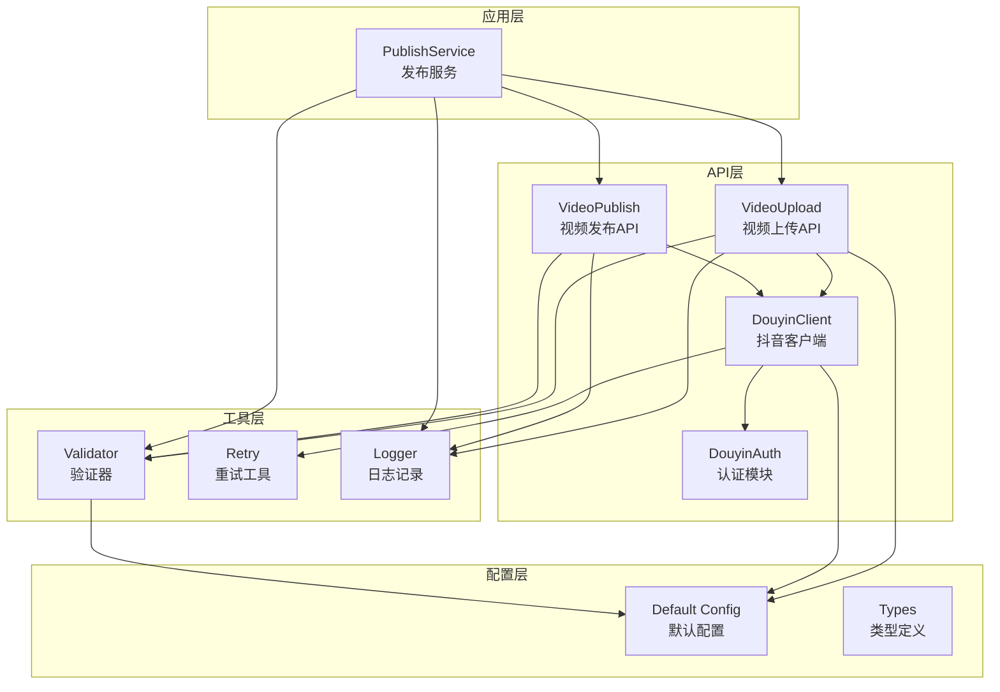
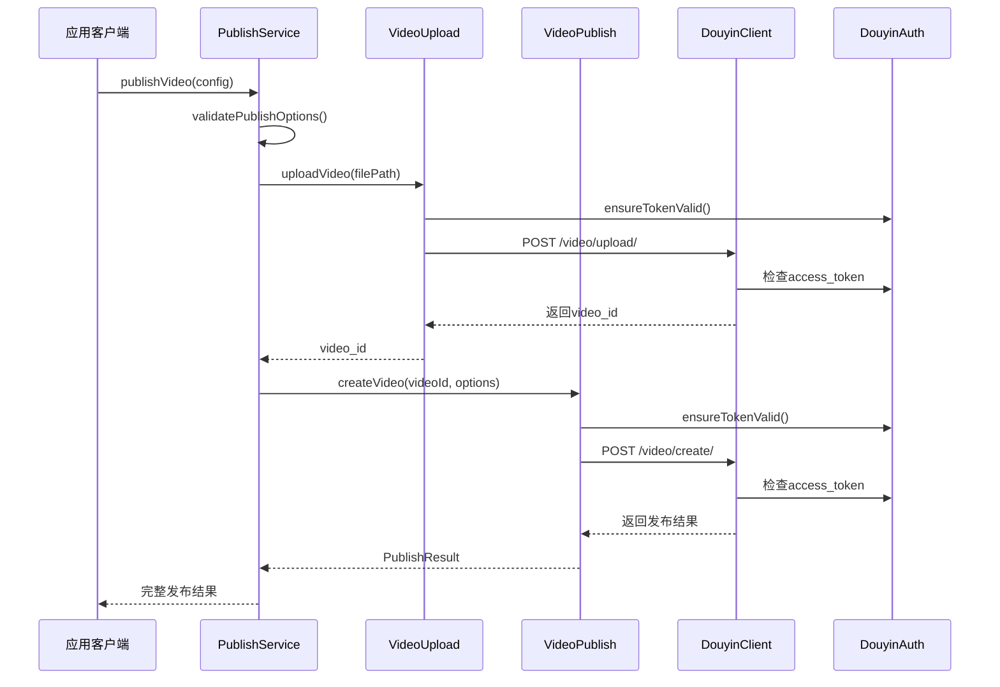
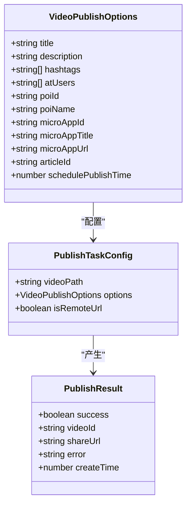
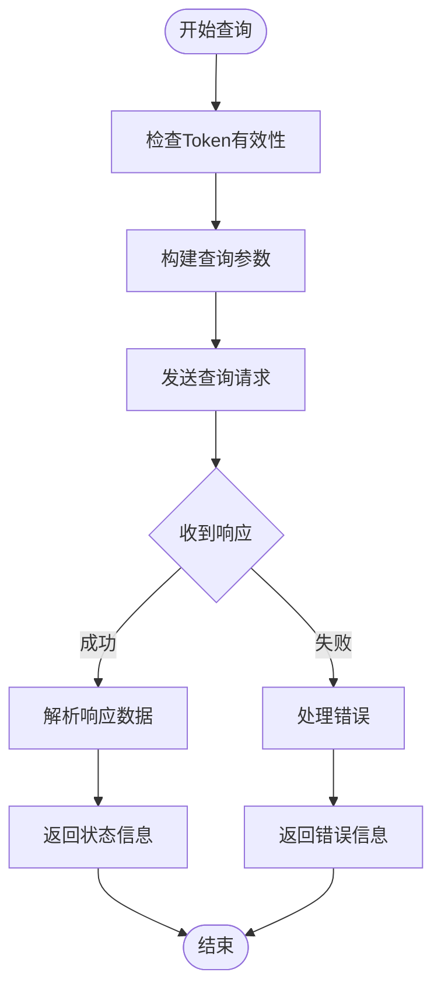
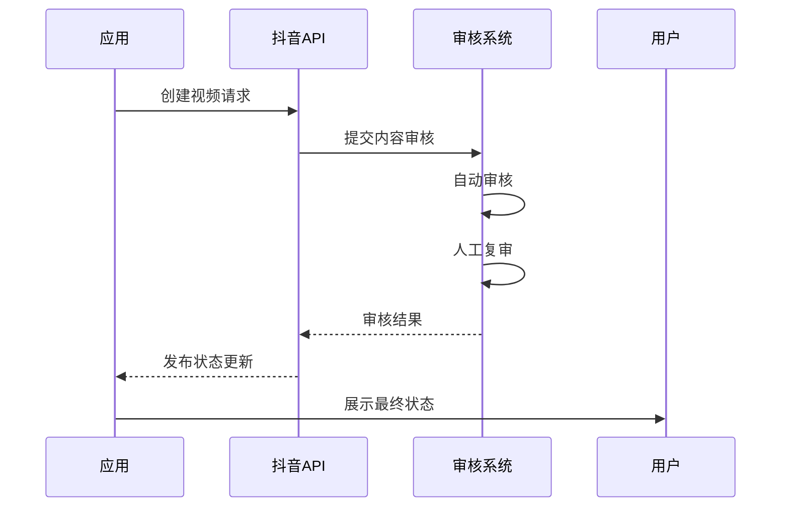
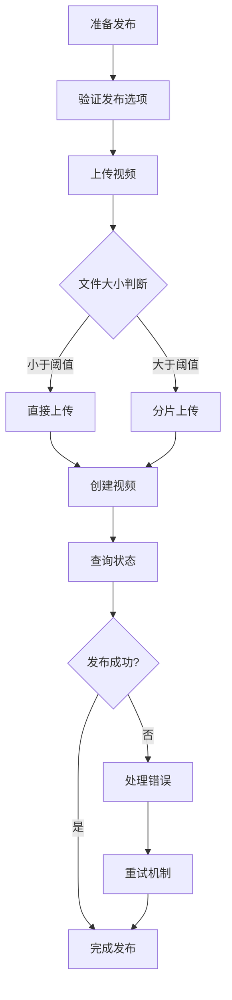
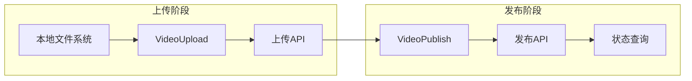
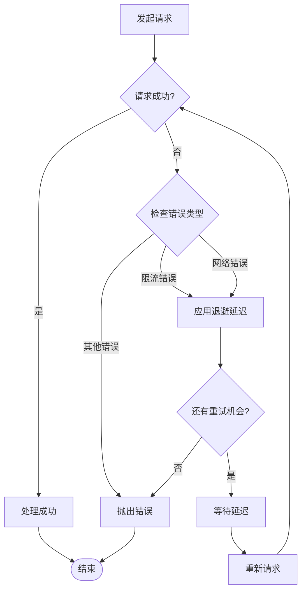
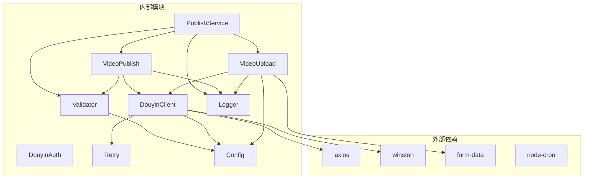

# 视频发布模块

<cite>
**本文档引用的文件**
- [video-publish.ts](file://src/api/video-publish.ts)
- [publish-service.ts](file://src/services/publish-service.ts)
- [types.ts](file://src/models/types.ts)
- [validator.ts](file://src/utils/validator.ts)
- [retry.ts](file://src/utils/retry.ts)
- [video-upload.ts](file://src/api/video-upload.ts)
- [douyin-client.ts](file://src/api/douyin-client.ts)
- [auth.ts](file://src/api/auth.ts)
- [default.ts](file://config/default.ts)
- [logger.ts](file://src/utils/logger.ts)
- [video-publish.test.ts](file://tests/unit/video-publish.test.ts)
- [mock-responses.ts](file://tests/fixtures/mock-responses.ts)
- [README.md](file://README.md)
- [package.json](file://package.json)
</cite>

## 目录
1. [简介](#简介)
2. [项目结构](#项目结构)
3. [核心组件](#核心组件)
4. [架构概览](#架构概览)
5. [详细组件分析](#详细组件分析)
6. [依赖分析](#依赖分析)
7. [性能考虑](#性能考虑)
8. [故障排除指南](#故障排除指南)
9. [结论](#结论)
10. [附录](#附录)

## 简介
视频发布模块是抖音（TikTok）营销自动化系统的核心功能组件，负责将视频内容从上传到发布的完整流程管理。该模块提供了完整的视频发布参数配置、验证机制、状态管理、审核流程集成以及错误处理和重试机制。

本模块特别针对小龙虾主题营销账号设计，支持自动化的视频内容发布、定时发布、地理位置标记、话题标签管理等功能，为专业的社交媒体营销提供技术支持。

## 项目结构
视频发布模块采用清晰的分层架构设计，主要包含以下层次：

**图表来源**
- [publish-service.ts:1-228](file://src/services/publish-service.ts#L1-L228)
- [video-publish.ts:1-174](file://src/api/video-publish.ts#L1-L174)
- [video-upload.ts:1-241](file://src/api/video-upload.ts#L1-L241)
- [douyin-client.ts:1-237](file://src/api/douyin-client.ts#L1-L237)

**章节来源**
- [publish-service.ts:1-228](file://src/services/publish-service.ts#L1-L228)
- [video-publish.ts:1-174](file://src/api/video-publish.ts#L1-L174)
- [video-upload.ts:1-241](file://src/api/video-upload.ts#L1-L241)

## 核心组件
视频发布模块由多个核心组件协同工作，每个组件都有明确的职责分工：

### 发布服务（PublishService）
作为业务编排层，负责协调视频上传和发布的完整流程，提供多种发布模式：
- 一站式发布：自动完成上传和发布
- 仅上传模式：只进行视频上传
- 仅发布模式：发布已上传的视频
- 下载并发布：从远程URL下载后发布

### 视频发布API（VideoPublish）
专门处理视频发布相关的API调用，包括：
- 视频创建和发布
- 视频状态查询
- 视频删除操作
- 参数构建和验证

### 视频上传API（VideoUpload）
处理视频文件的上传逻辑，支持：
- 直接上传（小文件）
- 分片上传（大文件）
- URL直传
- 进度监控

### 认证模块（DouyinAuth）
管理OAuth认证流程：
- 授权URL生成
- Token获取和刷新
- 自动Token有效性检查

**章节来源**
- [publish-service.ts:22-31](file://src/services/publish-service.ts#L22-L31)
- [video-publish.ts:15-22](file://src/api/video-publish.ts#L15-L22)
- [video-upload.ts:20-27](file://src/api/video-upload.ts#L20-L27)
- [auth.ts:29-37](file://src/api/auth.ts#L29-L37)

## 架构概览
视频发布模块采用事件驱动的异步架构，通过Promise和async/await实现非阻塞操作：

**图表来源**
- [publish-service.ts:38-80](file://src/services/publish-service.ts#L38-L80)
- [video-upload.ts:35-54](file://src/api/video-upload.ts#L35-L54)
- [video-publish.ts:30-54](file://src/api/video-publish.ts#L30-L54)
- [douyin-client.ts:124-166](file://src/api/douyin-client.ts#L124-L166)

## 详细组件分析

### 发布参数配置和验证机制

#### 参数类型定义
发布参数通过严格的类型定义确保数据完整性：

**图表来源**
- [types.ts:101-124](file://src/models/types.ts#L101-L124)
- [types.ts:159-168](file://src/models/types.ts#L159-L168)
- [types.ts:173-179](file://src/models/types.ts#L173-L179)

#### 内容验证规则
系统实现了多层次的验证机制：

1. **标题验证**：限制最大55字符
2. **描述验证**：限制最大300字符  
3. **话题标签验证**：最多5个标签
4. **定时发布验证**：必须在未来7天内

**章节来源**
- [validator.ts:45-86](file://src/utils/validator.ts#L45-L86)
- [types.ts:34-39](file://src/models/types.ts#L34-L39)

### 发布状态管理和查询机制

#### 状态查询流程
视频发布状态查询提供了完整的生命周期管理：

**图表来源**
- [video-publish.ts:132-154](file://src/api/video-publish.ts#L132-L154)

#### 状态信息包含
- 发布状态（如：published、processing、failed）
- 分享链接
- 创建时间

**章节来源**
- [video-publish.ts:132-154](file://src/api/video-publish.ts#L132-L154)

### 内容审核流程和发布时间控制

#### 审核流程集成
系统通过抖音官方API集成内容审核机制：

#### 时间控制机制
定时发布功能支持精确的时间控制：

- **最小间隔**：当前时间之后
- **最大间隔**：7天之内
- **时间精度**：Unix时间戳（秒）

**章节来源**
- [validator.ts:71-83](file://src/utils/validator.ts#L71-L83)
- [video-publish.ts:118-122](file://src/api/video-publish.ts#L118-L122)

### 发布流程完整示例

#### 一站式发布流程
以下展示了从准备到发布的完整流程：

**图表来源**
- [publish-service.ts:38-80](file://src/services/publish-service.ts#L38-L80)
- [video-upload.ts:48-54](file://src/api/video-upload.ts#L48-L54)

#### 具体实现步骤
1. **参数验证**：检查标题、描述、标签等限制
2. **文件上传**：根据文件大小选择上传方式
3. **视频创建**：调用抖音API创建视频
4. **状态监控**：轮询检查发布状态
5. **结果处理**：返回最终发布结果

**章节来源**
- [publish-service.ts:38-80](file://src/services/publish-service.ts#L38-L80)

### 与视频上传模块的协作关系

#### 数据流转过程
视频发布模块与上传模块之间存在紧密的数据关联：

**图表来源**
- [video-upload.ts:35-54](file://src/api/video-upload.ts#L35-L54)
- [video-publish.ts:30-54](file://src/api/video-publish.ts#L30-L54)

#### 协作特点
- **视频ID传递**：上传完成后返回video_id供发布使用
- **统一认证**：两个模块共享相同的认证上下文
- **进度同步**：上传进度可以反馈给发布服务

**章节来源**
- [publish-service.ts:48-61](file://src/services/publish-service.ts#L48-L61)
- [video-upload.ts:9-13](file://src/api/video-upload.ts#L9-L13)

### 错误处理和重试机制

#### 重试策略
系统实现了智能的指数退避重试机制：

**图表来源**
- [retry.ts:41-81](file://src/utils/retry.ts#L41-L81)

#### 重试条件
- **限流错误**：HTTP 429、错误码10001、10002
- **网络异常**：连接超时、ECONNRESET等
- **自定义条件**：可通过shouldRetry函数自定义

**章节来源**
- [retry.ts:15-81](file://src/utils/retry.ts#L15-L81)
- [douyin-client.ts:204-220](file://src/api/douyin-client.ts#L204-L220)

### 批量发布的实现方式和性能优化

#### 批量发布策略
系统支持多种批量发布场景：

1. **顺序发布**：按队列顺序依次发布
2. **并发发布**：多任务并行处理（需注意API限制）
3. **定时批量**：统一时间窗口发布

#### 性能优化策略
- **分片上传**：大文件自动分片，提高上传稳定性
- **进度监控**：实时反馈上传进度
- **缓存机制**：Token自动刷新和缓存
- **连接池**：复用HTTP连接减少开销

**章节来源**
- [video-upload.ts:104-152](file://src/api/video-upload.ts#L104-L152)
- [douyin-client.ts:18-27](file://src/api/douyin-client.ts#L18-L27)

## 依赖分析

### 组件耦合关系
视频发布模块的依赖关系呈现清晰的分层结构：

**图表来源**
- [package.json:14-29](file://package.json#L14-L29)
- [publish-service.ts:1-17](file://src/services/publish-service.ts#L1-L17)

### 关键依赖特性
- **axios**：提供HTTP客户端功能
- **winston**：强大的日志记录系统
- **form-data**：支持multipart/form-data上传
- **node-cron**：定时任务调度（备用）

**章节来源**
- [package.json:14-29](file://package.json#L14-L29)

## 性能考虑
视频发布模块在设计时充分考虑了性能优化：

### 上传性能优化
- **智能分片**：默认5MB分片大小，平衡速度和稳定性
- **阈值判断**：128MB阈值自动选择最优上传方式
- **进度反馈**：实时上传进度监控

### 并发控制
- **API限制**：遵循抖音API速率限制
- **重试退避**：避免过度重试造成系统压力
- **连接复用**：HTTP连接池优化

### 内存管理
- **流式处理**：大文件采用流式读取
- **分片缓存**：避免重复内存分配
- **及时清理**：临时文件自动清理

## 故障排除指南

### 常见错误类型
1. **认证错误**：Token过期或无效
2. **参数错误**：标题、描述超出限制
3. **文件错误**：格式不支持或大小超限
4. **网络错误**：连接超时或DNS解析失败
5. **API错误**：抖音API返回的业务错误

### 排错步骤
1. **检查Token状态**：确认access_token有效
2. **验证输入参数**：检查所有必填字段
3. **监控网络连接**：确保网络稳定
4. **查看日志输出**：分析详细的错误信息
5. **重试机制**：利用内置重试功能

**章节来源**
- [auth.ts:146-151](file://src/api/auth.ts#L146-L151)
- [validator.ts:22-39](file://src/utils/validator.ts#L22-L39)
- [douyin-client.ts:97-116](file://src/api/douyin-client.ts#L97-L116)

## 结论
视频发布模块是一个功能完整、架构清晰的抖音内容发布解决方案。通过合理的分层设计、完善的错误处理机制和性能优化策略，该模块能够满足专业营销账号的各种发布需求。

模块的主要优势包括：
- **完整的发布流程**：从上传到发布的全链路支持
- **灵活的配置选项**：丰富的发布参数和自定义能力
- **稳健的错误处理**：智能重试和故障恢复机制
- **良好的扩展性**：清晰的接口设计便于功能扩展

对于小龙虾主题营销账号而言，该模块提供了专业的技术支持，能够帮助用户高效地管理内容发布、提升运营效率。

## 附录

### 配置参考
系统支持多种配置方式，包括默认配置和运行时配置。

### API使用示例
模块提供了完整的API接口，支持各种使用场景的集成。

### 测试覆盖
单元测试覆盖了主要功能模块，确保代码质量和稳定性。