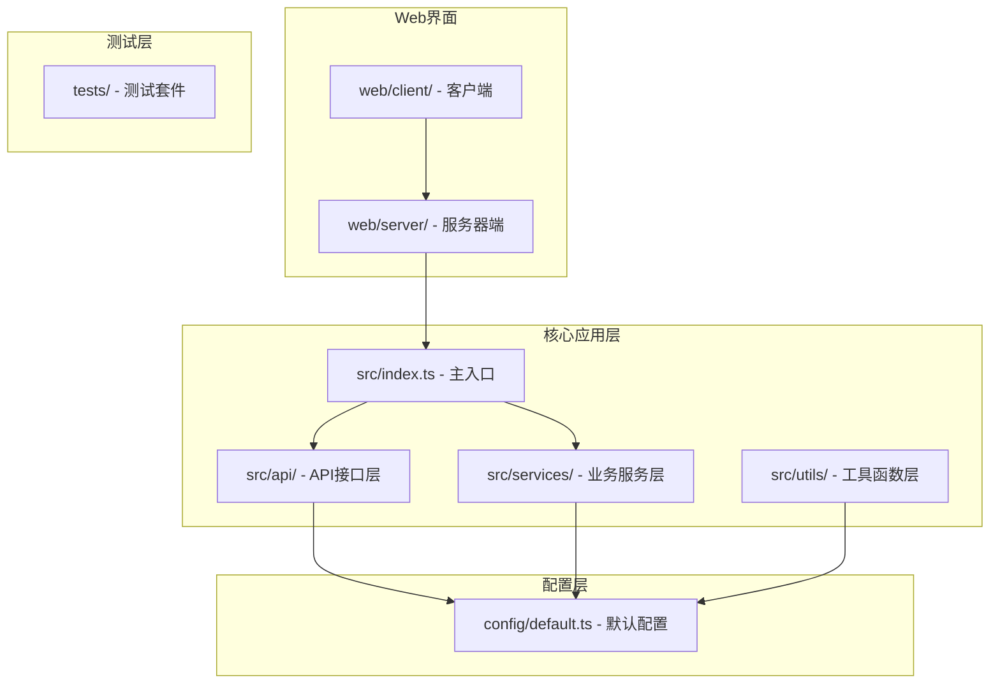
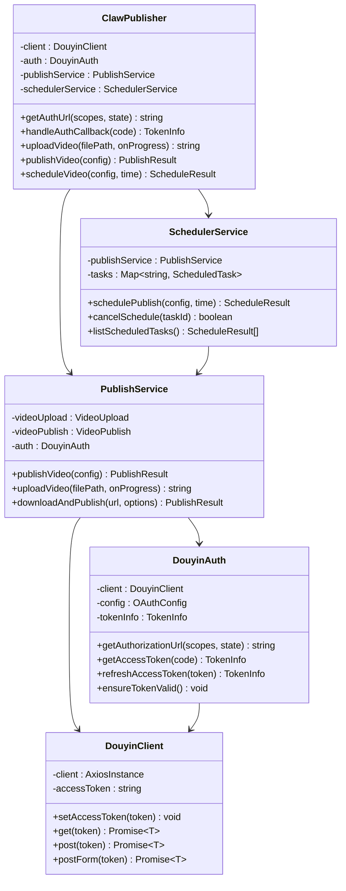
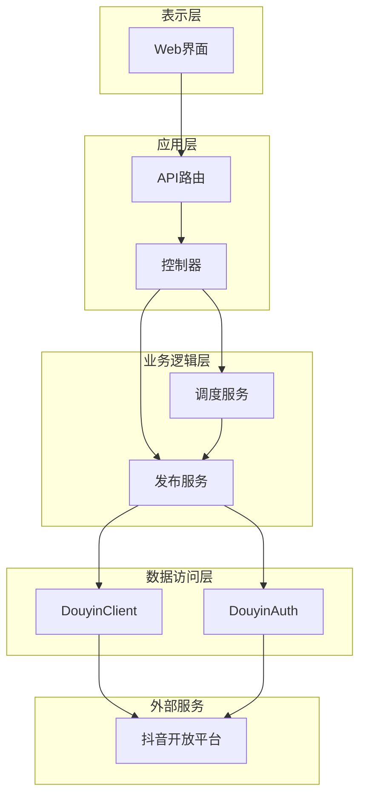
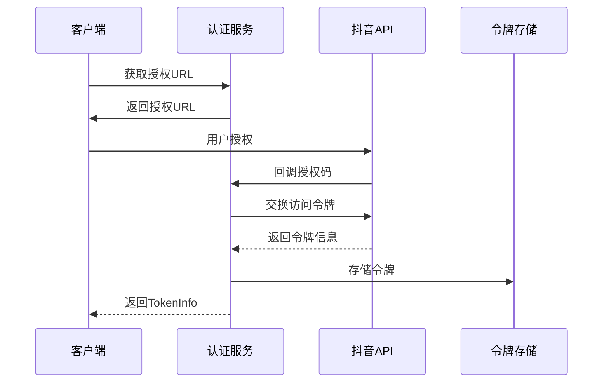
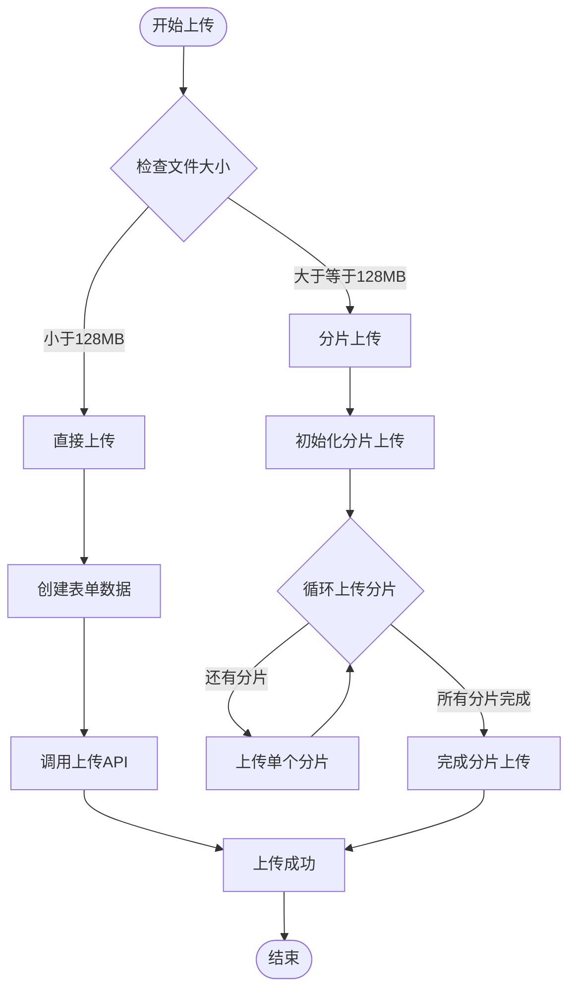
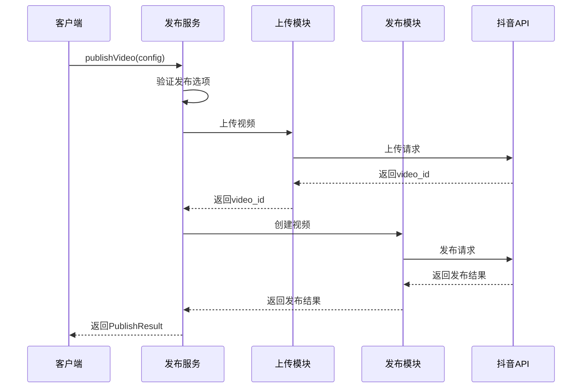
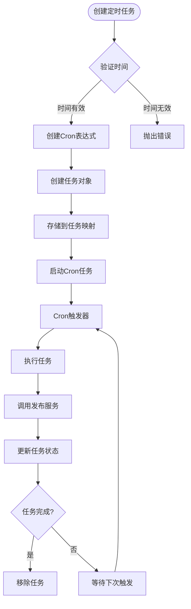
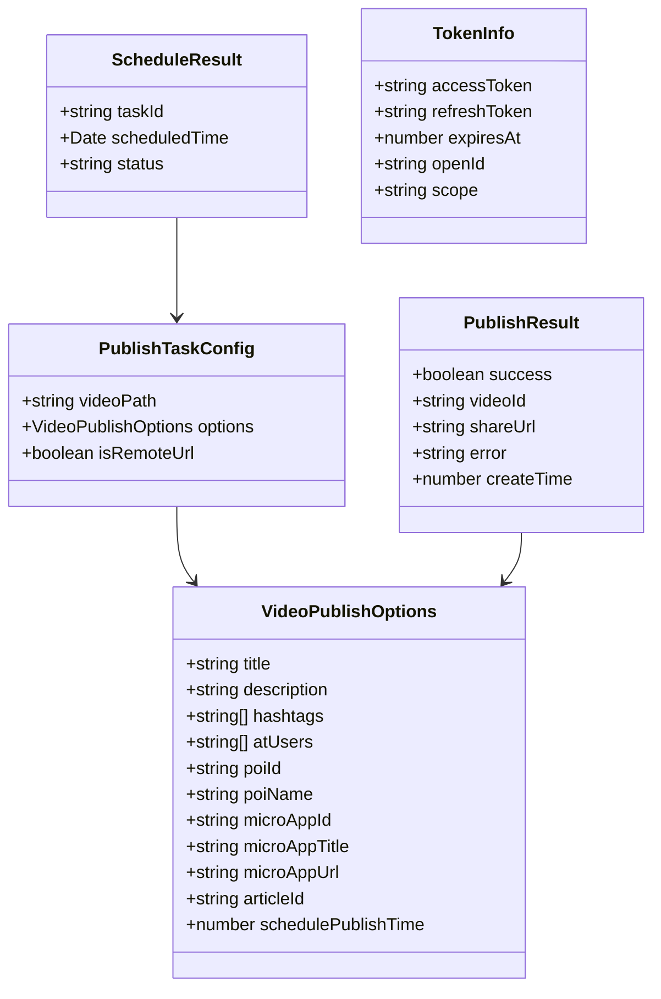
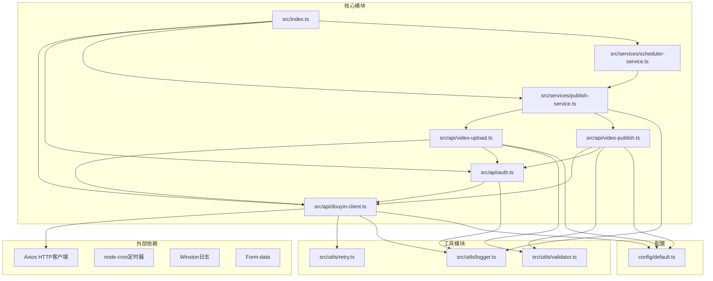

# 视频发布系统

<cite>
**本文档引用的文件**
- [README.md](file://README.md)
- [package.json](file://package.json)
- [src/index.ts](file://src/index.ts)
- [src/api/douyin-client.ts](file://src/api/douyin-client.ts)
- [src/api/auth.ts](file://src/api/auth.ts)
- [src/api/video-upload.ts](file://src/api/video-upload.ts)
- [src/api/video-publish.ts](file://src/api/video-publish.ts)
- [src/services/publish-service.ts](file://src/services/publish-service.ts)
- [src/services/scheduler-service.ts](file://src/services/scheduler-service.ts)
- [src/models/types.ts](file://src/models/types.ts)
- [src/utils/logger.ts](file://src/utils/logger.ts)
- [src/utils/retry.ts](file://src/utils/retry.ts)
- [config/default.ts](file://config/default.ts)
- [web/server/src/index.ts](file://web/server/src/index.ts)
- [web/client/package.json](file://web/client/package.json)
</cite>

## 目录
1. [简介](#简介)
2. [项目结构](#项目结构)
3. [核心组件](#核心组件)
4. [架构概览](#架构概览)
5. [详细组件分析](#详细组件分析)
6. [依赖关系分析](#依赖关系分析)
7. [性能考虑](#性能考虑)
8. [故障排除指南](#故障排除指南)
9. [结论](#结论)

## 简介

ClawOperations 是一个专门设计用于抖音（TikTok）官方 API 集成的自动化运营和管理系统。该系统专为小龙虾主题的抖音营销账户而构建，提供全面的工具和工作流程来简化内容创作、调度、分析跟踪和观众互动。

该项目是运营专业小龙虾主题抖音营销活动的技术基础设施，支持餐厅、产品线或美食娱乐品牌的规模化抖音存在。

## 项目结构

项目采用模块化架构设计，主要分为以下几个核心部分：

**图表来源**
- [src/index.ts:1-248](file://src/index.ts#L1-L248)
- [config/default.ts:1-49](file://config/default.ts#L1-L49)

**章节来源**
- [README.md:92-105](file://README.md#L92-L105)
- [package.json:1-38](file://package.json#L1-L38)

## 核心组件

### 主要功能特性

系统提供以下核心功能：

1. **抖音 API 集成**
   - 官方 API 连接
   - 自动化视频上传和调度
   - 实时指标跟踪
   - 自动化评论管理

2. **账户管理**
   - 内容日历调度
   - AI 驱动的标签优化
   - 趋势监控
   - 人口统计分析

3. **小龙虾特定功能**
   - 季节性活动管理
   - 预设内容模板
   - 多地区支持
   - 品牌声音一致性

**章节来源**
- [README.md:11-29](file://README.md#L11-L29)

### 核心架构组件

**图表来源**
- [src/index.ts:29-244](file://src/index.ts#L29-L244)
- [src/services/publish-service.ts:22-31](file://src/services/publish-service.ts#L22-L31)
- [src/services/scheduler-service.ts:23-29](file://src/services/scheduler-service.ts#L23-L29)
- [src/api/douyin-client.ts:13-43](file://src/api/douyin-client.ts#L13-L43)
- [src/api/auth.ts:29-37](file://src/api/auth.ts#L29-L37)

**章节来源**
- [src/index.ts:29-244](file://src/index.ts#L29-L244)

## 架构概览

系统采用分层架构设计，确保关注点分离和模块化：

**图表来源**
- [web/server/src/index.ts:1-42](file://web/server/src/index.ts#L1-L42)
- [src/index.ts:1-248](file://src/index.ts#L1-L248)

## 详细组件分析

### 认证系统

认证系统实现了完整的 OAuth 2.0 流程，支持多种授权模式：

**图表来源**
- [src/api/auth.ts:45-91](file://src/api/auth.ts#L45-L91)
- [src/api/auth.ts:98-127](file://src/api/auth.ts#L98-L127)

认证系统支持：
- 授权码流程
- 刷新令牌机制
- 自动令牌续期
- 令牌状态验证

**章节来源**
- [src/api/auth.ts:29-190](file://src/api/auth.ts#L29-L190)

### 视频上传系统

视频上传系统支持两种上传模式：直接上传和分片上传：

**图表来源**
- [src/api/video-upload.ts:35-54](file://src/api/video-upload.ts#L35-L54)
- [src/api/video-upload.ts:104-152](file://src/api/video-upload.ts#L104-L152)

上传系统特性：
- 自动文件大小检测
- 智能上传策略选择
- 进度回调通知
- 断点续传支持

**章节来源**
- [src/api/video-upload.ts:20-241](file://src/api/video-upload.ts#L20-L241)

### 发布服务

发布服务作为业务编排层，协调上传和发布的完整流程：

**图表来源**
- [src/services/publish-service.ts:38-80](file://src/services/publish-service.ts#L38-L80)
- [src/services/publish-service.ts:101-125](file://src/services/publish-service.ts#L101-L125)

**章节来源**
- [src/services/publish-service.ts:22-228](file://src/services/publish-service.ts#L22-L228)

### 定时调度系统

定时调度系统基于 node-cron 实现精确的时间控制：

**图表来源**
- [src/services/scheduler-service.ts:37-72](file://src/services/scheduler-service.ts#L37-L72)
- [src/services/scheduler-service.ts:140-162](file://src/services/scheduler-service.ts#L140-L162)

**章节来源**
- [src/services/scheduler-service.ts:23-202](file://src/services/scheduler-service.ts#L23-L202)

### 数据模型

系统定义了完整的类型系统来确保类型安全：

**图表来源**
- [src/models/types.ts:159-188](file://src/models/types.ts#L159-L188)
- [src/models/types.ts:98-124](file://src/models/types.ts#L98-L124)
- [src/models/types.ts:37-46](file://src/models/types.ts#L37-L46)

**章节来源**
- [src/models/types.ts:1-201](file://src/models/types.ts#L1-L201)

## 依赖关系分析

系统依赖关系清晰，遵循单一职责原则：

**图表来源**
- [package.json:18-24](file://package.json#L18-L24)
- [src/index.ts:1-21](file://src/index.ts#L1-L21)

**章节来源**
- [package.json:1-38](file://package.json#L1-L38)

## 性能考虑

系统在多个层面考虑了性能优化：

### 重试机制
- 指数退避算法减少服务器压力
- 可配置的最大重试次数
- 智能错误分类判断

### 上传优化
- 大文件自动分片上传
- 128MB 阈值智能切换
- 并发分片上传支持

### 缓存策略
- 令牌自动续期避免频繁请求
- 进度回调减少内存占用
- 临时文件自动清理

## 故障排除指南

### 常见问题诊断

1. **认证失败**
   - 检查客户端凭据配置
   - 验证重定向URI设置
   - 确认授权作用域权限

2. **上传失败**
   - 检查文件格式和大小限制
   - 验证网络连接稳定性
   - 查看分片上传状态

3. **定时任务异常**
   - 确认系统时区设置
   - 检查cron表达式格式
   - 验证任务状态管理

### 日志分析

系统提供多级日志记录：
- 调试级别：详细的操作流程
- 信息级别：关键操作确认
- 错误级别：异常情况记录

**章节来源**
- [src/utils/logger.ts:31-55](file://src/utils/logger.ts#L31-L55)

## 结论

ClawOperations 视频发布系统是一个功能完整、架构清晰的自动化运营平台。系统通过模块化设计实现了高度的可维护性和扩展性，同时提供了完善的错误处理和性能优化机制。

主要优势包括：
- 完整的抖音 API 集成
- 灵活的上传策略
- 精确的定时调度
- 丰富的配置选项
- 完善的日志系统

该系统特别适合需要大规模内容运营的小龙虾品牌，能够有效提升内容发布的效率和质量。