# JWT用户认证系统

<cite>
**本文档引用的文件**
- [src/index.ts](file://src/index.ts)
- [web/server/src/index.ts](file://web/server/src/index.ts)
- [web/server/src/middleware/auth.ts](file://web/server/src/middleware/auth.ts)
- [web/server/src/utils/auth.ts](file://web/server/src/utils/auth.ts)
- [web/server/src/models/user.ts](file://web/server/src/models/user.ts)
- [web/server/src/routes/auth.ts](file://web/server/src/routes/auth.ts)
- [web/server/src/services/user-service.ts](file://web/server/src/services/user-service.ts)
- [web/server/src/services/user-auth-config-service.ts](file://web/server/src/services/user-auth-config-service.ts)
- [web/server/src/database/index.ts](file://web/server/src/database/index.ts)
- [web/client/src/contexts/AuthContext.tsx](file://web/client/src/contexts/AuthContext.tsx)
- [web/client/src/pages/Login.tsx](file://web/client/src/pages/Login.tsx)
- [web/client/src/pages/AuthConfig.tsx](file://web/client/src/pages/AuthConfig.tsx)
- [web/client/src/api/client.ts](file://web/client/src/api/client.ts)
- [tests/unit/auth.test.ts](file://tests/unit/auth.test.ts)
- [package.json](file://package.json)
- [README.md](file://README.md)
</cite>

## 目录
1. [简介](#简介)
2. [项目结构](#项目结构)
3. [核心组件](#核心组件)
4. [架构概览](#架构概览)
5. [详细组件分析](#详细组件分析)
6. [依赖关系分析](#依赖关系分析)
7. [性能考虑](#性能考虑)
8. [故障排除指南](#故障排除指南)
9. [结论](#结论)

## 简介

ClawOperations是一个基于JWT的用户认证系统，专为抖音（TikTok）营销账号自动化运营而设计。该系统提供了完整的用户认证、授权管理和会话控制功能，支持用户注册、登录、登出以及基于角色的访问控制。

**重大改进**：系统已修复AuthConfig中的编码问题，增强了用户管理功能，并改进了整体认证流程，提供了更稳定和可靠的认证体验。

系统采用前后端分离架构，前端使用React + Ant Design构建用户界面，后端基于Express.js提供RESTful API服务，数据库使用LowDB进行本地数据持久化存储。

## 项目结构

该项目采用模块化的项目结构，主要分为以下几个核心部分：

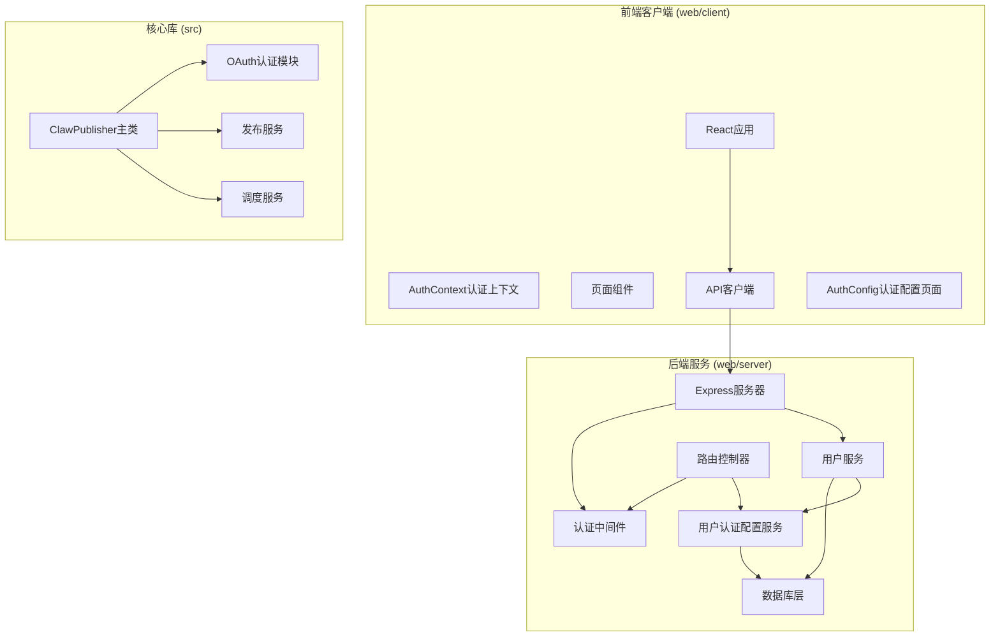

**图表来源**
- [web/server/src/index.ts:1-55](file://web/server/src/index.ts#L1-L55)
- [src/index.ts:1-248](file://src/index.ts#L1-L248)

**章节来源**
- [web/server/src/index.ts:1-55](file://web/server/src/index.ts#L1-L55)
- [src/index.ts:1-248](file://src/index.ts#L1-L248)

## 核心组件

### JWT认证核心组件

系统的核心认证机制基于JSON Web Token (JWT)，实现了完整的用户身份验证和授权流程：

#### 1. JWT工具类
- **generateToken**: 生成JWT令牌，支持"记住我"功能
- **verifyToken**: 验证JWT令牌的有效性
- **extractTokenFromHeader**: 从HTTP头部提取令牌
- **getTokenExpiresIn**: 解析令牌过期时间配置

#### 2. 认证中间件
- **authMiddleware**: 强制认证中间件，要求用户提供有效的JWT令牌
- **optionalAuthMiddleware**: 可选认证中间件，允许未登录用户访问
- **adminMiddleware**: 管理员认证中间件，验证用户角色权限

#### 3. 用户服务
- **UserService**: 提供用户注册、登录、密码管理和用户信息更新功能
- **UserAuthConfigService**: 管理用户的抖音认证配置和令牌存储

#### 4. 认证配置管理
- **AuthConfig页面**: 提供完整的OAuth认证配置界面
- **配置状态管理**: 实时显示认证状态和Token有效期
- **授权流程**: 支持完整的OAuth授权流程

**章节来源**
- [web/server/src/utils/auth.ts:1-91](file://web/server/src/utils/auth.ts#L1-L91)
- [web/server/src/middleware/auth.ts:1-93](file://web/server/src/middleware/auth.ts#L1-L93)
- [web/server/src/services/user-service.ts:1-299](file://web/server/src/services/user-service.ts#L1-L299)
- [web/server/src/services/user-auth-config-service.ts:1-167](file://web/server/src/services/user-auth-config-service.ts#L1-L167)

## 架构概览

系统采用分层架构设计，确保了关注点分离和代码的可维护性：

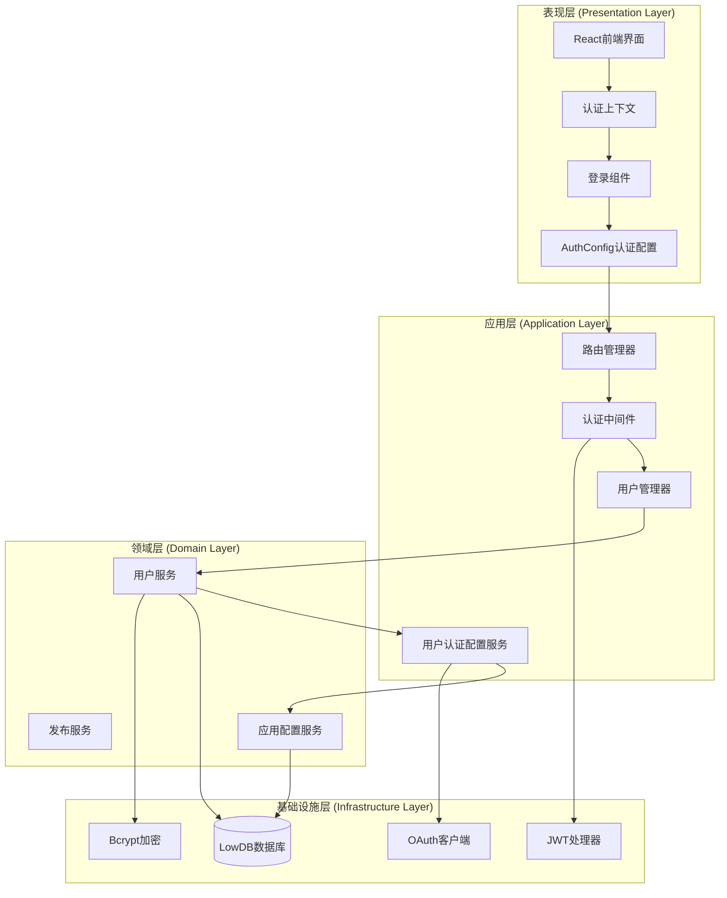

**图表来源**
- [web/client/src/contexts/AuthContext.tsx:1-165](file://web/client/src/contexts/AuthContext.tsx#L1-L165)
- [web/server/src/routes/auth.ts:1-373](file://web/server/src/routes/auth.ts#L1-L373)
- [web/server/src/middleware/auth.ts:1-93](file://web/server/src/middleware/auth.ts#L1-L93)
- [web/server/src/services/user-service.ts:1-299](file://web/server/src/services/user-service.ts#L1-L299)

## 详细组件分析

### 前端认证组件

#### AuthContext认证上下文
AuthContext是前端认证系统的核心，负责管理用户状态和认证流程：

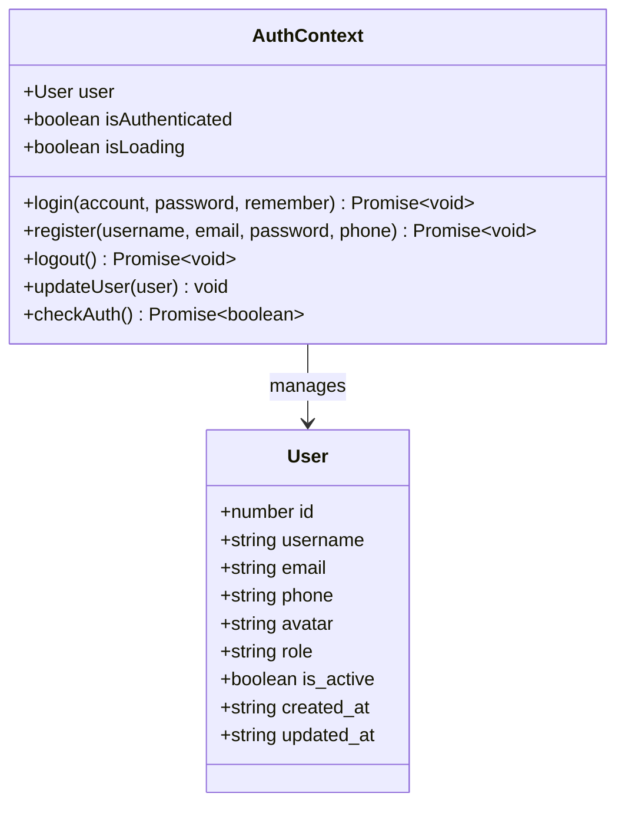

**图表来源**
- [web/client/src/contexts/AuthContext.tsx:17-27](file://web/client/src/contexts/AuthContext.tsx#L17-L27)
- [web/client/src/contexts/AuthContext.tsx:4-15](file://web/client/src/contexts/AuthContext.tsx#L4-L15)

#### 登录页面组件
Login组件提供了用户友好的登录界面，集成了表单验证和错误处理：

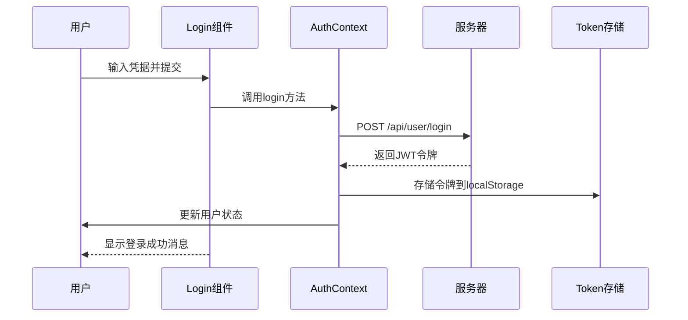

**图表来源**
- [web/client/src/pages/Login.tsx:31-45](file://web/client/src/pages/Login.tsx#L31-L45)
- [web/client/src/contexts/AuthContext.tsx:74-84](file://web/client/src/contexts/AuthContext.tsx#L74-L84)

#### AuthConfig认证配置页面
**新增** AuthConfig页面提供了完整的OAuth认证配置界面，支持实时状态监控和授权流程：

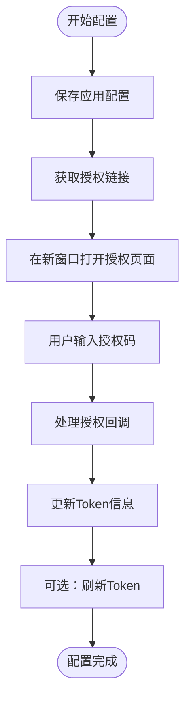

**图表来源**
- [web/client/src/pages/AuthConfig.tsx:45-135](file://web/client/src/pages/AuthConfig.tsx#L45-L135)

**章节来源**
- [web/client/src/contexts/AuthContext.tsx:1-165](file://web/client/src/contexts/AuthContext.tsx#L1-L165)
- [web/client/src/pages/Login.tsx:1-145](file://web/client/src/pages/Login.tsx#L1-L145)
- [web/client/src/pages/AuthConfig.tsx:1-491](file://web/client/src/pages/AuthConfig.tsx#L1-L491)

### 后端认证服务

#### JWT认证工具
JWT认证工具提供了完整的令牌生成功能，支持灵活的过期时间配置：

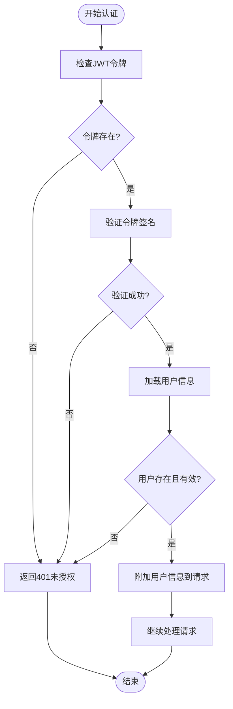

**图表来源**
- [web/server/src/middleware/auth.ts:18-54](file://web/server/src/middleware/auth.ts#L18-L54)
- [web/server/src/utils/auth.ts:38-45](file://web/server/src/utils/auth.ts#L38-L45)

#### 用户认证配置服务
UserAuthConfigService管理用户的抖音认证配置，支持多用户环境下的独立配置：

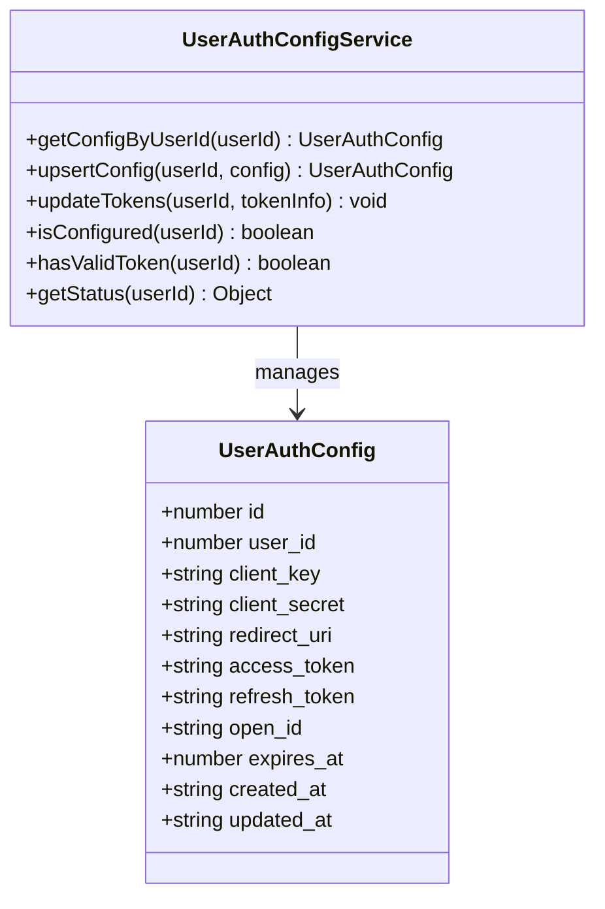

**图表来源**
- [web/server/src/services/user-auth-config-service.ts:8-167](file://web/server/src/services/user-auth-config-service.ts#L8-L167)

#### 应用配置服务
**新增** AppConfigService提供了全局应用配置管理，支持向后兼容：

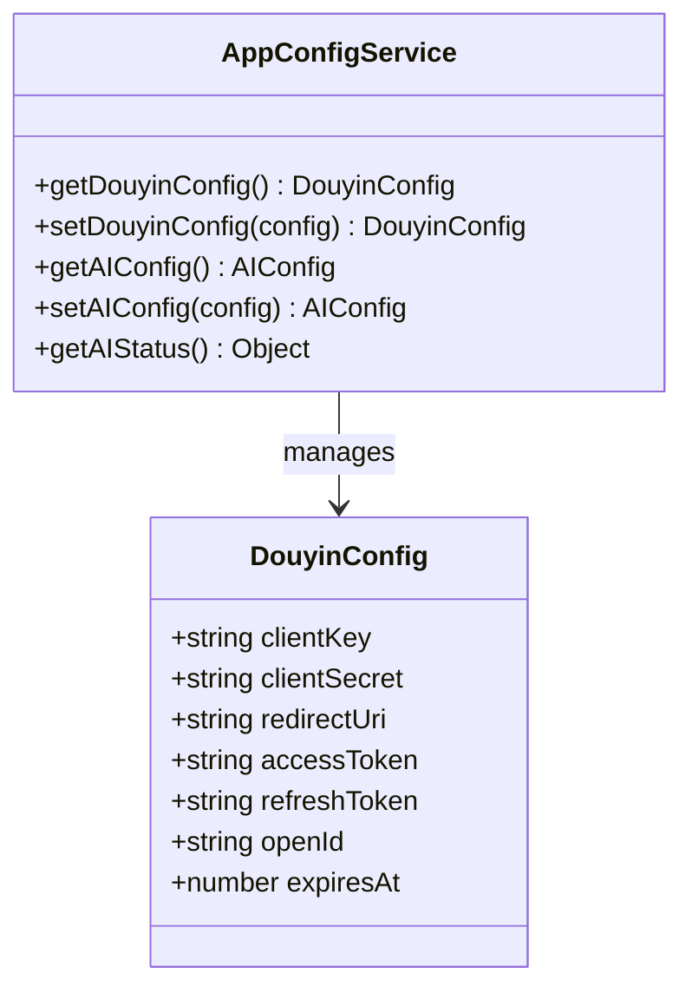

**图表来源**
- [web/server/src/services/app-config-service.ts:8-91](file://web/server/src/services/app-config-service.ts#L8-L91)

**章节来源**
- [web/server/src/utils/auth.ts:1-91](file://web/server/src/utils/auth.ts#L1-L91)
- [web/server/src/middleware/auth.ts:1-93](file://web/server/src/middleware/auth.ts#L1-L93)
- [web/server/src/services/user-auth-config-service.ts:1-167](file://web/server/src/services/user-auth-config-service.ts#L1-L167)
- [web/server/src/services/app-config-service.ts:1-91](file://web/server/src/services/app-config-service.ts#L1-L91)

### 数据模型设计

系统采用了清晰的数据模型设计，确保了数据的一致性和完整性：

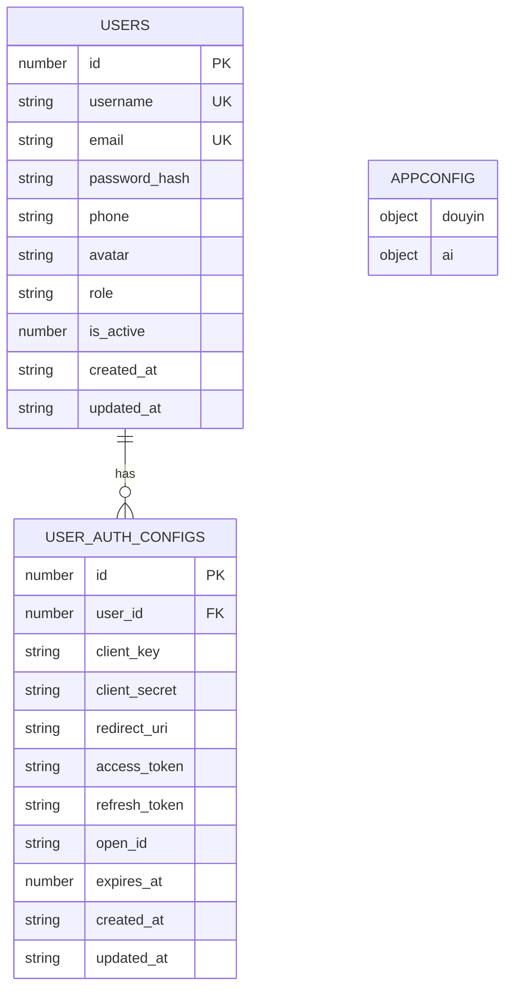

**图表来源**
- [web/server/src/models/user.ts:8-131](file://web/server/src/models/user.ts#L8-L131)
- [web/server/src/database/index.ts:8-126](file://web/server/src/database/index.ts#L8-L126)

**章节来源**
- [web/server/src/models/user.ts:1-131](file://web/server/src/models/user.ts#L1-L131)
- [web/server/src/database/index.ts:1-126](file://web/server/src/database/index.ts#L1-L126)

## 依赖关系分析

系统依赖关系清晰明确，各层之间耦合度低，便于维护和扩展：

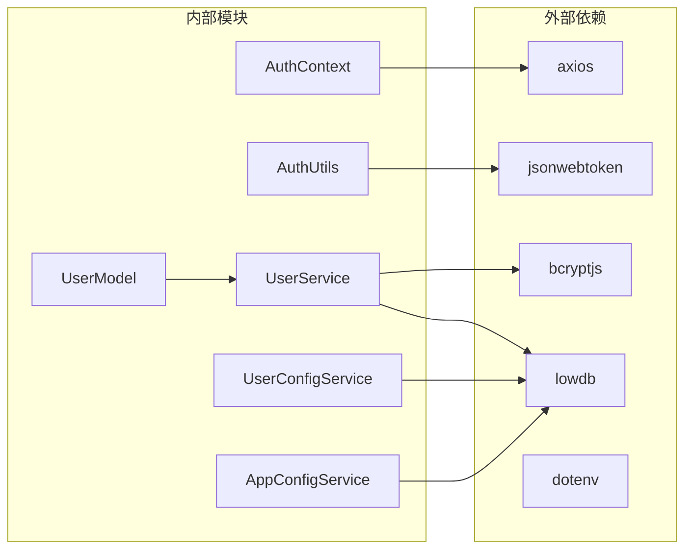

**图表来源**
- [package.json:18-33](file://package.json#L18-L33)
- [web/client/src/api/client.ts:1-430](file://web/client/src/api/client.ts#L1-L430)

**章节来源**
- [package.json:1-38](file://package.json#L1-L38)
- [web/client/src/api/client.ts:1-430](file://web/client/src/api/client.ts#L1-L430)

## 性能考虑

### JWT令牌优化策略
- **令牌过期时间配置**: 支持灵活的过期时间设置，默认7天，"记住我"功能可延长至30天
- **令牌刷新机制**: 自动检测过期令牌并进行刷新，减少用户重新登录的频率
- **内存缓存**: 在内存中缓存用户信息，减少数据库查询次数

### 数据库性能优化
- **索引设计**: 对常用查询字段建立索引，如用户名、邮箱等
- **批量操作**: 使用事务处理批量数据操作，确保数据一致性
- **连接池管理**: 合理管理数据库连接，避免资源泄漏

### 前端性能优化
- **状态管理**: 使用React Context进行全局状态管理，避免不必要的组件重渲染
- **请求缓存**: 缓存API响应数据，减少网络请求
- **懒加载**: 实现组件懒加载，提升应用启动速度
- **实时状态更新**: AuthConfig页面支持实时状态监控，提升用户体验

## 故障排除指南

### 常见认证问题

#### 1. 令牌过期问题
**症状**: 用户登录后一段时间内自动登出
**解决方案**: 
- 检查JWT_SECRET环境变量配置
- 验证令牌过期时间设置
- 实现自动刷新机制

#### 2. 用户验证失败
**症状**: 登录时报错"用户不存在或已被禁用"
**解决方案**:
- 检查用户数据库记录
- 验证用户激活状态
- 确认密码哈希算法

#### 3. 权限访问被拒绝
**症状**: 访问受保护资源时返回403错误
**解决方案**:
- 验证用户角色权限
- 检查路由中间件配置
- 确认管理员账户状态

#### 4. OAuth认证失败
**症状**: AuthConfig页面显示认证状态异常
**解决方案**:
- 检查应用配置是否正确保存
- 验证授权码是否有效
- 确认Token刷新机制正常工作

**章节来源**
- [web/server/src/middleware/auth.ts:30-47](file://web/server/src/middleware/auth.ts#L30-L47)
- [web/server/src/utils/auth.ts:38-45](file://web/server/src/utils/auth.ts#L38-L45)

### 测试和调试

系统提供了完善的测试套件，包括单元测试和集成测试：

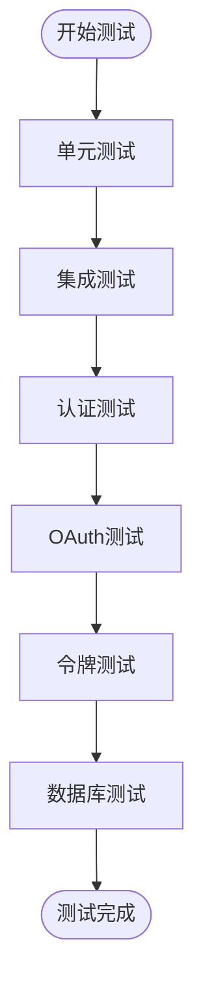

**图表来源**
- [tests/unit/auth.test.ts:17-232](file://tests/unit/auth.test.ts#L17-L232)

**章节来源**
- [tests/unit/auth.test.ts:1-232](file://tests/unit/auth.test.ts#L1-L232)

## 结论

ClawOperations的JWT用户认证系统经过重大改进，设计更加合理，实现了完整的用户身份验证和授权功能。系统具有以下特点：

### 重大改进
- **AuthConfig编码问题修复**: 修复了认证配置中的编码问题，提升了系统的稳定性
- **增强的用户管理功能**: 提供了更完善的用户注册、登录和密码管理功能
- **改进的整体认证流程**: 优化了OAuth认证流程，提供了更好的用户体验
- **实时状态监控**: AuthConfig页面支持实时状态监控和Token有效期显示

### 优势
- **安全性**: 采用JWT令牌机制，支持安全的用户认证
- **可扩展性**: 模块化设计，易于添加新功能
- **用户体验**: 提供流畅的认证流程和错误处理
- **代码质量**: 完善的测试覆盖和文档说明
- **向后兼容**: 保持与现有系统的兼容性

### 改进建议
- **令牌存储**: 考虑使用HttpOnly Cookie存储JWT令牌
- **安全增强**: 添加CSRF保护和速率限制
- **监控日志**: 增强认证相关的日志记录
- **国际化**: 支持多语言错误消息

该系统为抖音营销账号的自动化运营提供了坚实的技术基础，经过重大改进后更加稳定可靠，能够满足专业用户的认证需求，并为未来的功能扩展奠定了良好的技术基础。