# 抖音OAuth集成

<cite>
**本文档引用的文件**
- [douyin-client.ts](file://src/api/douyin-client.ts)
- [auth.ts](file://src/api/auth.ts)
- [auth.ts](file://web/server/src/routes/auth.ts)
- [Login.tsx](file://web/client/src/pages/Login.tsx)
- [AuthContext.tsx](file://web/client/src/contexts/AuthContext.tsx)
- [client.ts](file://web/client/src/api/client.ts)
- [types.ts](file://src/models/types.ts)
- [default.ts](file://config/default.ts)
- [publisher.ts](file://web/server/src/services/publisher.ts)
- [auth.ts](file://web/server/src/middleware/auth.ts)
</cite>

## 目录
1. [简介](#简介)
2. [项目结构](#项目结构)
3. [核心组件](#核心组件)
4. [架构概览](#架构概览)
5. [详细组件分析](#详细组件分析)
6. [OAuth集成流程](#oauth集成流程)
7. [安全机制](#安全机制)
8. [配置管理](#配置管理)
9. [故障排除指南](#故障排除指南)
10. [总结](#总结)

## 简介

ClawOperations是一个专业的抖音营销账号自动化运营系统，专门设计用于集成抖音的官方API来管理营销活动。本系统提供了完整的OAuth 2.0认证集成，使用户能够通过抖音官方授权流程安全地访问其抖音账号权限。

该系统的核心功能包括：
- **OAuth 2.0认证集成**：完整的抖音授权流程实现
- **视频内容管理**：上传、发布和调度视频内容
- **AI智能创作**：基于需求分析的内容生成
- **定时发布系统**：自动化的视频发布时间管理
- **多用户支持**：独立的用户认证和权限管理

## 项目结构

系统采用前后端分离的架构设计，主要分为以下层次：

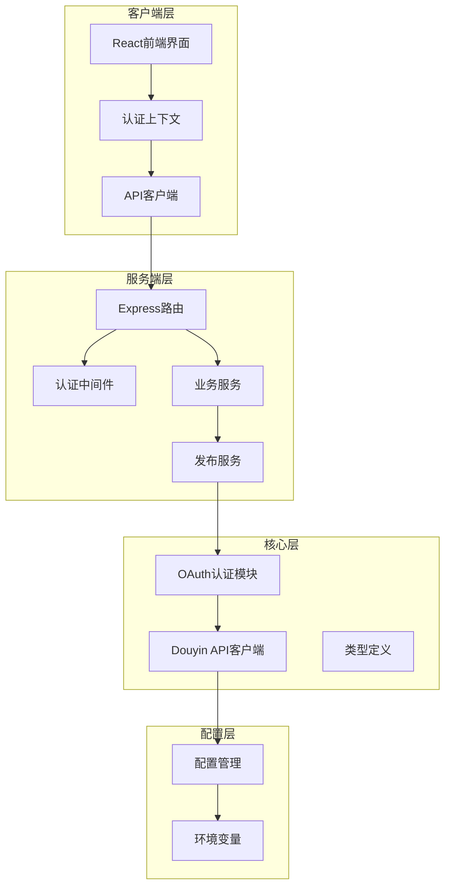

**图表来源**
- [Login.tsx:1-331](file://web/client/src/pages/Login.tsx#L1-331)
- [AuthContext.tsx:1-196](file://web/client/src/contexts/AuthContext.tsx#L1-196)
- [auth.ts:1-373](file://web/server/src/routes/auth.ts#L1-373)

**章节来源**
- [Login.tsx:1-331](file://web/client/src/pages/Login.tsx#L1-331)
- [AuthContext.tsx:1-196](file://web/client/src/contexts/AuthContext.tsx#L1-196)
- [auth.ts:1-373](file://web/server/src/routes/auth.ts#L1-373)

## 核心组件

### OAuth认证模块

OAuth认证模块是整个系统的安全基石，负责处理抖音的授权流程和令牌管理。

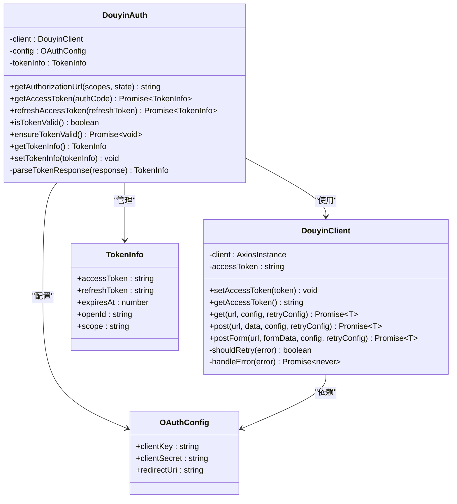

**图表来源**
- [auth.ts:28-189](file://src/api/auth.ts#L28-189)
- [douyin-client.ts:13-237](file://src/api/douyin-client.ts#L13-237)
- [types.ts:18-46](file://src/models/types.ts#L18-46)

### 前端认证组件

前端提供了完整的用户界面和状态管理，实现了流畅的OAuth认证体验。

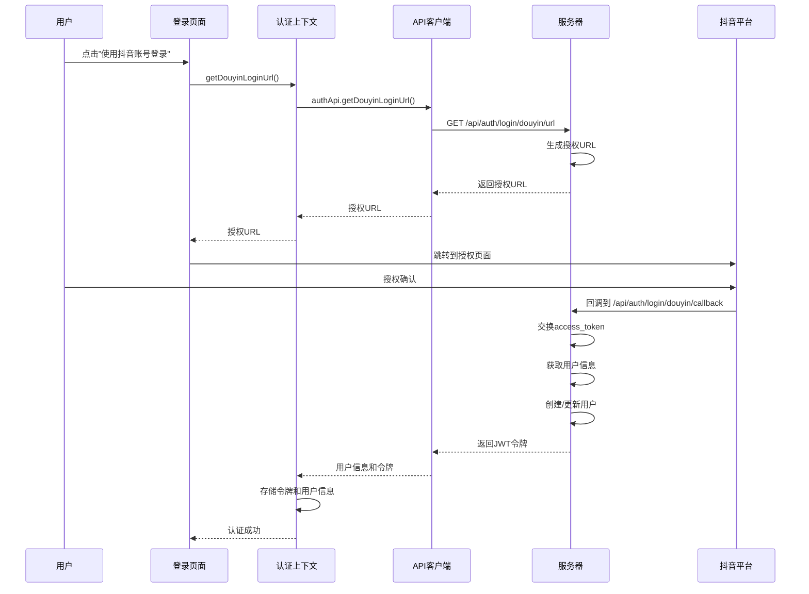

**图表来源**
- [Login.tsx:85-102](file://web/client/src/pages/Login.tsx#L85-102)
- [AuthContext.tsx:145-166](file://web/client/src/contexts/AuthContext.tsx#L145-166)
- [auth.ts:243-370](file://web/server/src/routes/auth.ts#L243-370)

**章节来源**
- [auth.ts:28-189](file://src/api/auth.ts#L28-189)
- [douyin-client.ts:13-237](file://src/api/douyin-client.ts#L13-237)
- [Login.tsx:1-331](file://web/client/src/pages/Login.tsx#L1-331)
- [AuthContext.tsx:1-196](file://web/client/src/contexts/AuthContext.tsx#L1-196)

## 架构概览

系统采用现代化的微服务架构，前后端分离的设计确保了良好的可维护性和扩展性。

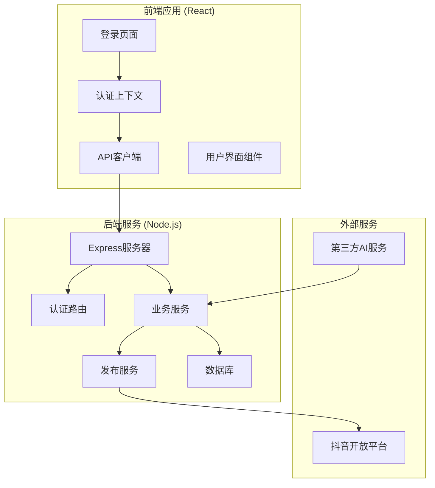

**图表来源**
- [auth.ts:1-373](file://web/server/src/routes/auth.ts#L1-373)
- [publisher.ts:1-195](file://web/server/src/services/publisher.ts#L1-195)

## 详细组件分析

### OAuth认证流程实现

OAuth认证流程严格按照抖音官方规范实现，确保了最高的安全标准和用户体验。

#### 授权码交换流程

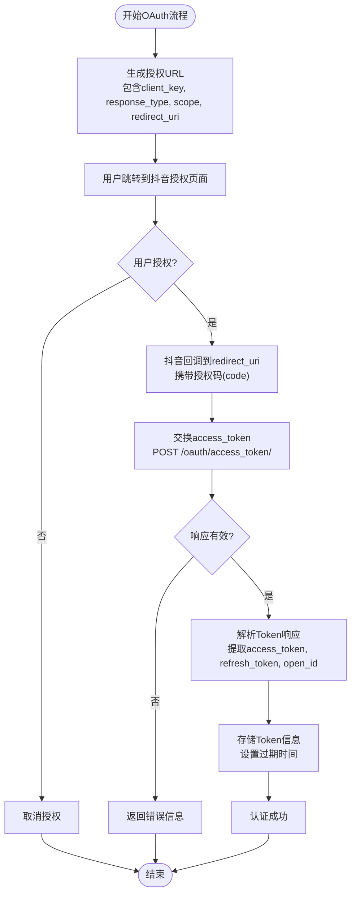

**图表来源**
- [auth.ts:66-90](file://src/api/auth.ts#L66-90)
- [auth.ts:263-280](file://web/server/src/routes/auth.ts#L263-280)

#### Token刷新机制

系统实现了智能的Token刷新机制，确保长时间运行的会话不会中断。

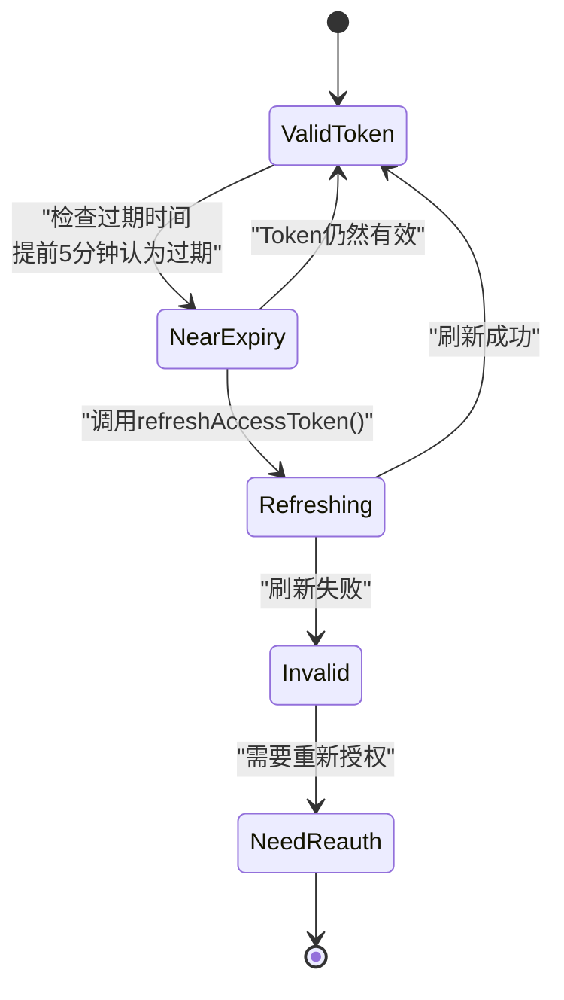

**图表来源**
- [auth.ts:145-150](file://src/api/auth.ts#L145-150)
- [auth.ts:97-126](file://src/api/auth.ts#L97-126)

**章节来源**
- [auth.ts:66-150](file://src/api/auth.ts#L66-150)
- [auth.ts:263-370](file://web/server/src/routes/auth.ts#L263-370)

### 前端认证状态管理

前端使用React Context模式管理认证状态，提供了统一的状态管理和事件处理机制。

#### 认证上下文架构

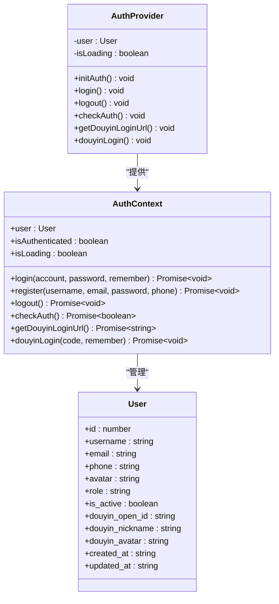

**图表来源**
- [AuthContext.tsx:20-33](file://web/client/src/contexts/AuthContext.tsx#L20-33)
- [AuthContext.tsx:37-186](file://web/client/src/contexts/AuthContext.tsx#L37-186)

#### 前端API客户端

前端API客户端封装了所有与后端的通信逻辑，提供了简洁的接口供组件使用。

**章节来源**
- [AuthContext.tsx:1-196](file://web/client/src/contexts/AuthContext.tsx#L1-196)
- [client.ts:80-99](file://web/client/src/api/client.ts#L80-99)

### 后端服务架构

后端服务实现了完整的OAuth认证处理逻辑，包括Token管理、用户创建和权限控制。

#### 服务器端OAuth处理

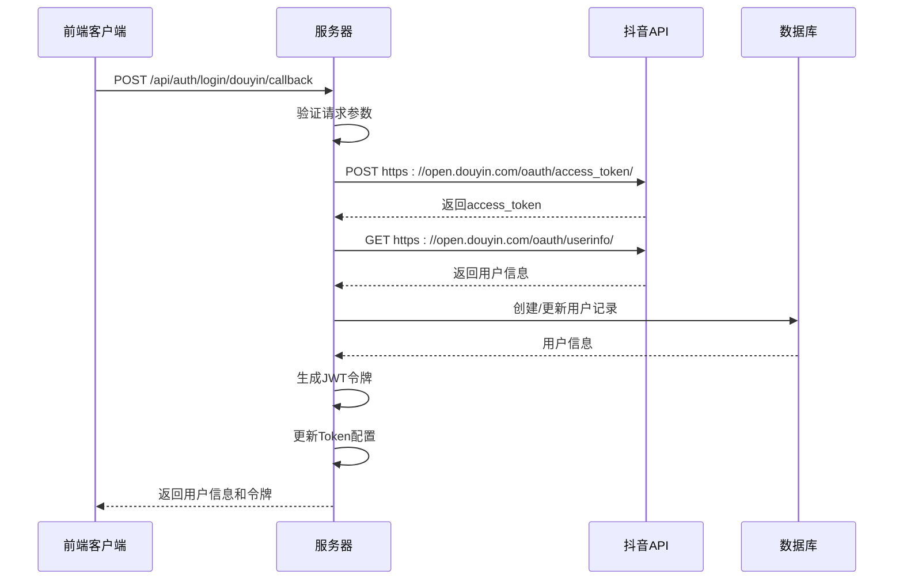

**图表来源**
- [auth.ts:243-370](file://web/server/src/routes/auth.ts#L243-370)
- [publisher.ts:14-46](file://web/server/src/services/publisher.ts#L14-46)

**章节来源**
- [auth.ts:243-370](file://web/server/src/routes/auth.ts#L243-370)
- [publisher.ts:1-195](file://web/server/src/services/publisher.ts#L1-195)

## OAuth集成流程

### 完整的OAuth认证流程

系统实现了完整的OAuth 2.0认证流程，从用户授权到令牌管理的每个环节都有完善的错误处理和安全保障。

#### 第一阶段：授权请求

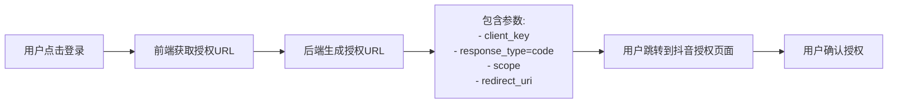

**图表来源**
- [auth.ts:44-58](file://src/api/auth.ts#L44-58)
- [Login.tsx:85-102](file://web/client/src/pages/Login.tsx#L85-102)

#### 第二阶段：令牌交换

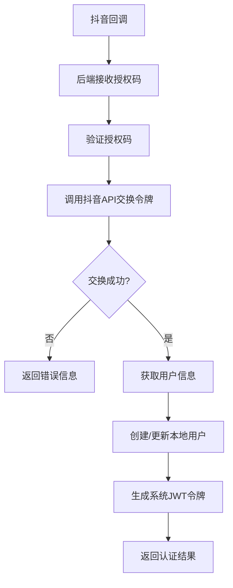

**图表来源**
- [auth.ts:263-349](file://web/server/src/routes/auth.ts#L263-349)

#### 第三阶段：会话管理

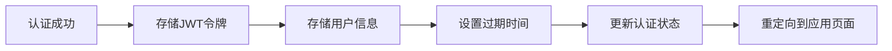

**图表来源**
- [AuthContext.tsx:155-166](file://web/client/src/contexts/AuthContext.tsx#L155-166)
- [client.ts:15-24](file://web/client/src/api/client.ts#L15-24)

**章节来源**
- [auth.ts:44-150](file://src/api/auth.ts#L44-150)
- [auth.ts:243-349](file://web/server/src/routes/auth.ts#L243-349)
- [Login.tsx:48-83](file://web/client/src/pages/Login.tsx#L48-83)

## 安全机制

系统实现了多层次的安全保护机制，确保用户数据和API凭证的安全。

### 认证中间件

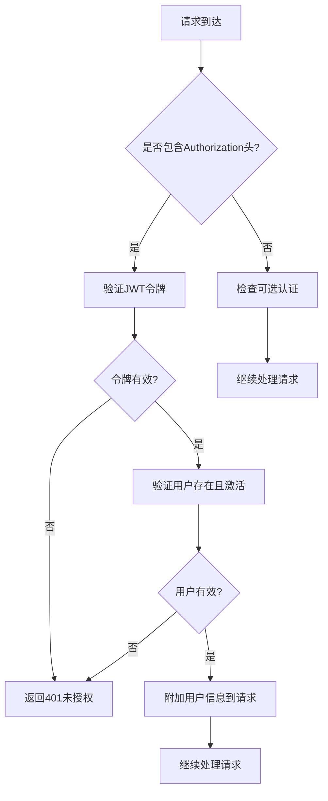

**图表来源**
- [auth.ts:18-75](file://web/server/src/middleware/auth.ts#L18-75)

### 令牌管理

系统实现了安全的令牌存储和管理机制：

1. **前端存储**：使用localStorage安全存储JWT令牌
2. **后端验证**：每次请求都验证令牌的有效性
3. **自动刷新**：智能检测令牌过期并自动刷新
4. **错误处理**：401错误时自动清理本地存储

**章节来源**
- [auth.ts:18-75](file://web/server/src/middleware/auth.ts#L18-75)
- [client.ts:52-78](file://web/client/src/api/client.ts#L52-78)

## 配置管理

系统提供了灵活的配置管理机制，支持多种部署场景。

### 环境配置

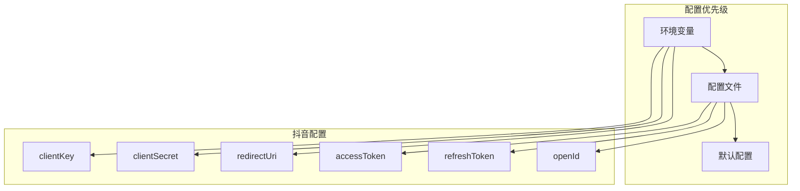

**图表来源**
- [default.ts:5-8](file://config/default.ts#L5-8)
- [publisher.ts:14-46](file://web/server/src/services/publisher.ts#L14-46)

### 配置验证

系统提供了完整的配置验证机制：

1. **启动时验证**：检查必需的配置项
2. **运行时验证**：动态验证配置的有效性
3. **回退机制**：配置缺失时使用默认值或报错

**章节来源**
- [default.ts:1-70](file://config/default.ts#L1-70)
- [publisher.ts:14-92](file://web/server/src/services/publisher.ts#L14-92)

## 故障排除指南

### 常见问题及解决方案

#### OAuth授权失败

**问题症状**：用户授权后无法获得访问令牌

**可能原因**：
1. 授权码已过期（10分钟有效期）
2. client_key或client_secret错误
3. redirect_uri不匹配
4. 网络连接问题

**解决步骤**：
1. 检查授权码是否在有效期内
2. 验证抖音应用配置
3. 确认redirect_uri完全匹配
4. 检查网络连接和防火墙设置

#### Token刷新失败

**问题症状**：系统尝试刷新令牌但失败

**可能原因**：
1. refresh_token已过期
2. 网络连接问题
3. 抖音API服务异常

**解决步骤**：
1. 检查refresh_token的有效性
2. 重新进行OAuth授权流程
3. 稍后重试或联系技术支持

#### 前端认证状态异常

**问题症状**：用户已登录但界面显示未登录

**可能原因**：
1. 本地存储被清空
2. JWT令牌过期
3. 401错误未正确处理

**解决步骤**：
1. 检查浏览器localStorage
2. 查看浏览器开发者工具的Network面板
3. 重新登录系统

**章节来源**
- [auth.ts:97-126](file://src/api/auth.ts#L97-126)
- [client.ts:66-78](file://web/client/src/api/client.ts#L66-78)

## 总结

ClawOperations的抖音OAuth集成为现代Web应用提供了完整的认证解决方案。系统通过以下关键特性确保了高质量的用户体验和安全性：

### 核心优势

1. **完整的OAuth 2.0实现**：严格遵循抖音官方规范
2. **智能令牌管理**：自动刷新和错误处理
3. **前后端分离架构**：清晰的职责划分和良好的可维护性
4. **安全的认证机制**：多层安全保护和错误处理
5. **灵活的配置管理**：支持多种部署场景

### 技术特色

- **TypeScript强类型支持**：提供完整的类型安全
- **现代化前端框架**：React + Ant Design提供优秀的用户体验
- **RESTful API设计**：清晰的接口规范和错误处理
- **模块化架构**：易于扩展和维护的代码结构

### 适用场景

该OAuth集成方案特别适用于：
- 抖音营销自动化平台
- 社交媒体内容管理系统
- 多账号管理工具
- 内容创作辅助工具

通过这套完整的OAuth集成解决方案，开发者可以快速构建安全、可靠的抖音平台集成应用，为用户提供无缝的授权和使用体验。