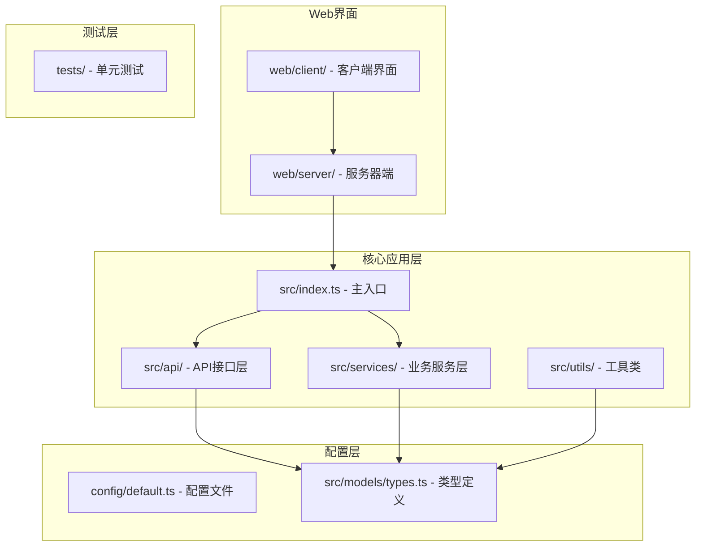
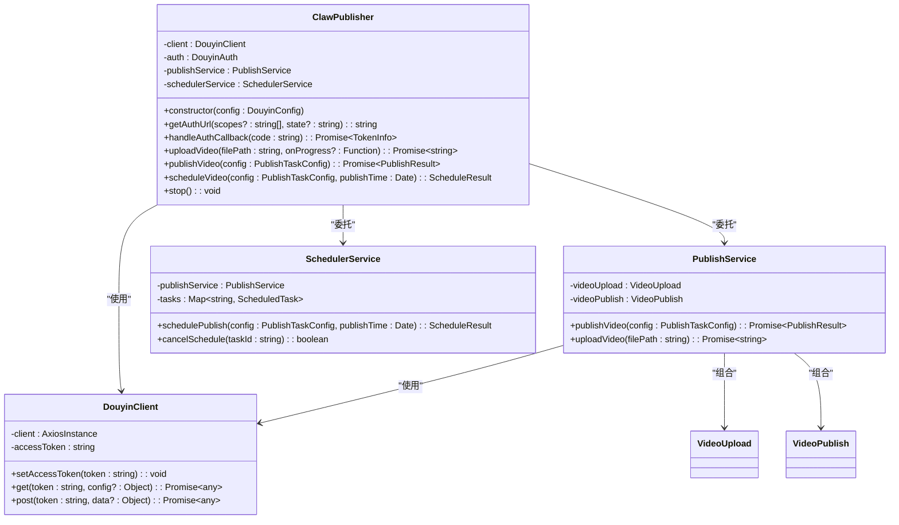
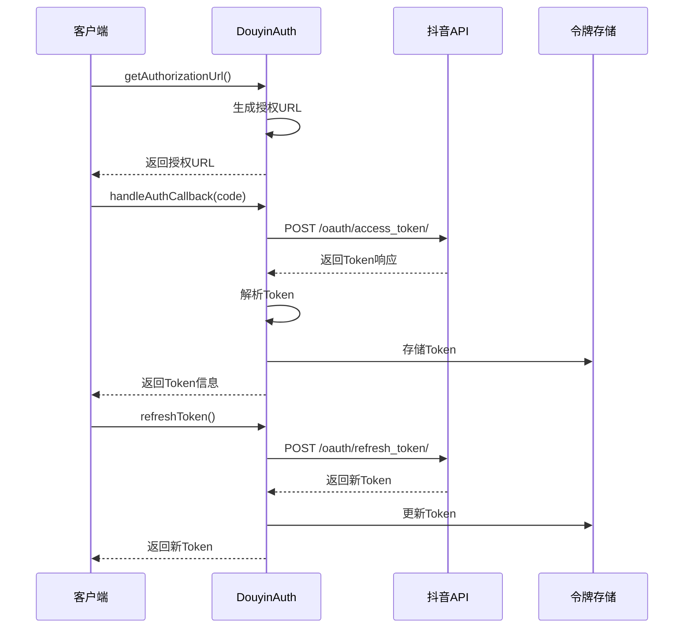
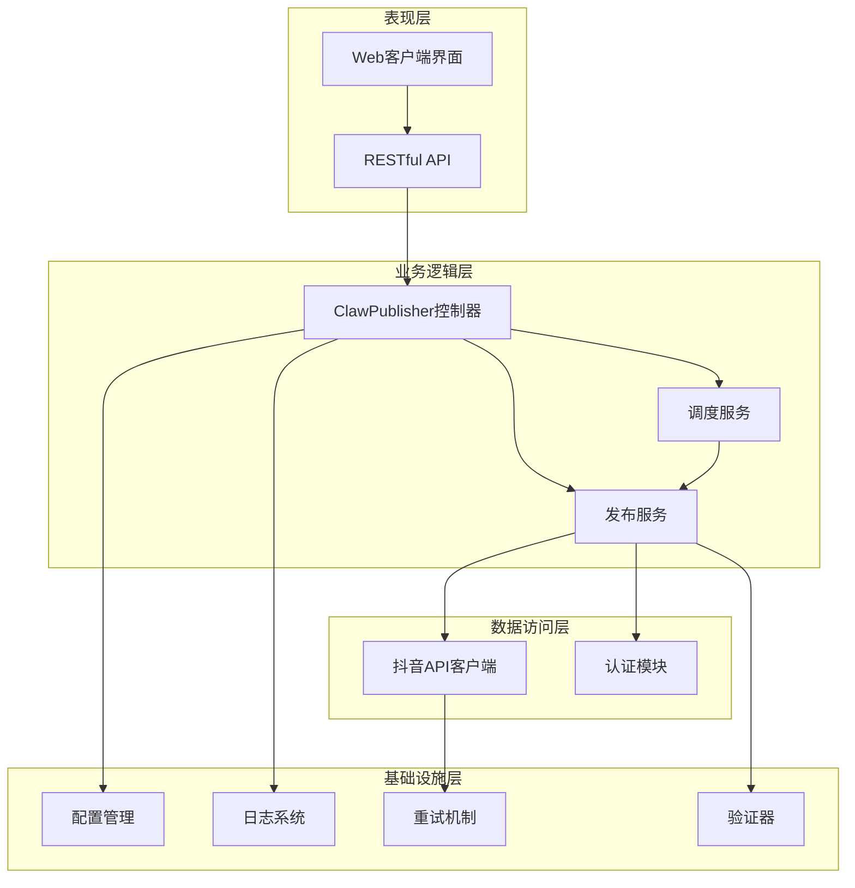
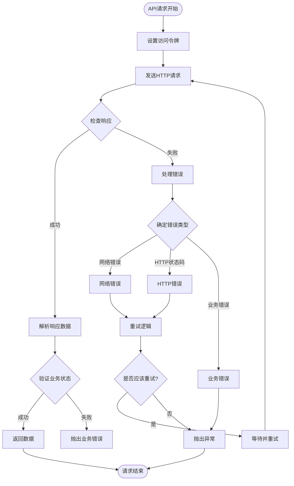
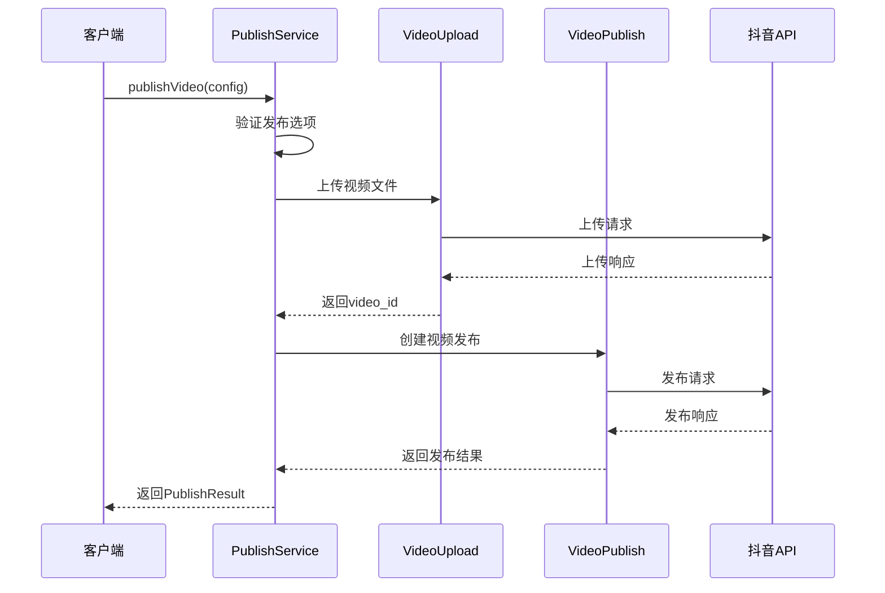
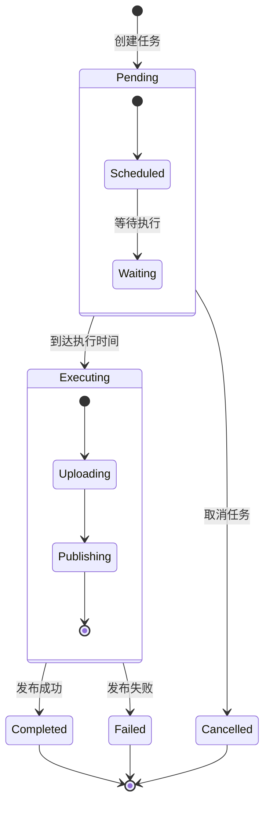
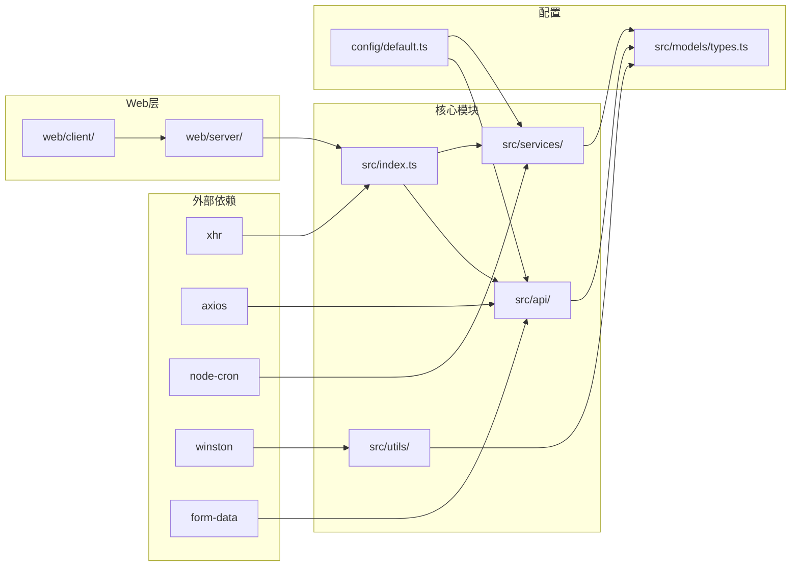

# 抖音认证系统

<cite>
**本文档引用的文件**
- [README.md](file://README.md)
- [package.json](file://package.json)
- [src/index.ts](file://src/index.ts)
- [src/api/douyin-client.ts](file://src/api/douyin-client.ts)
- [src/api/auth.ts](file://src/api/auth.ts)
- [src/services/publish-service.ts](file://src/services/publish-service.ts)
- [src/services/scheduler-service.ts](file://src/services/scheduler-service.ts)
- [src/models/types.ts](file://src/models/types.ts)
- [src/utils/retry.ts](file://src/utils/retry.ts)
- [src/utils/validator.ts](file://src/utils/validator.ts)
- [src/utils/logger.ts](file://src/utils/logger.ts)
- [config/default.ts](file://config/default.ts)
- [web/server/src/index.ts](file://web/server/src/index.ts)
- [web/server/src/routes/auth.ts](file://web/server/src/routes/auth.ts)
- [web/client/package.json](file://web/client/package.json)
</cite>

## 目录
1. [项目概述](#项目概述)
2. [项目结构](#项目结构)
3. [核心组件](#核心组件)
4. [架构概览](#架构概览)
5. [详细组件分析](#详细组件分析)
6. [依赖关系分析](#依赖关系分析)
7. [性能考虑](#性能考虑)
8. [故障排除指南](#故障排除指南)
9. [结论](#结论)

## 项目概述

抖音认证系统是一个专门设计用于与抖音开放平台API集成的自动化运营管理系统。该系统提供了完整的OAuth认证流程、视频上传发布、定时任务调度等功能，专为营销账号运营而设计。

### 主要特性

- **OAuth认证集成**：完整的抖音OAuth2.0认证流程，支持授权码模式和令牌刷新
- **视频发布管理**：支持本地文件上传和远程URL直接发布
- **定时任务调度**：基于cron表达式的智能内容发布时间管理
- **错误重试机制**：智能指数退避重试策略，提高API调用成功率
- **内容验证**：严格的视频文件格式和内容长度验证
- **日志监控**：完整的操作日志记录和错误追踪

## 项目结构

**图表来源**
- [src/index.ts:1-248](file://src/index.ts#L1-L248)
- [config/default.ts:1-49](file://config/default.ts#L1-L49)
- [web/server/src/index.ts:1-42](file://web/server/src/index.ts#L1-L42)

**章节来源**
- [README.md:92-105](file://README.md#L92-L105)
- [package.json:1-38](file://package.json#L1-L38)

## 核心组件

### 主控制器 - ClawPublisher

ClawPublisher是系统的核心控制器，提供统一的对外接口，整合了认证、视频发布、定时任务等所有功能。

**图表来源**
- [src/index.ts:29-244](file://src/index.ts#L29-L244)
- [src/api/douyin-client.ts:13-237](file://src/api/douyin-client.ts#L13-L237)
- [src/services/publish-service.ts:22-228](file://src/services/publish-service.ts#L22-L228)
- [src/services/scheduler-service.ts:23-202](file://src/services/scheduler-service.ts#L23-L202)

### 认证模块 - DouyinAuth

负责处理OAuth认证流程，包括授权URL生成、令牌获取和刷新。

**图表来源**
- [src/api/auth.ts:45-127](file://src/api/auth.ts#L45-L127)
- [src/api/douyin-client.ts:124-166](file://src/api/douyin-client.ts#L124-L166)

**章节来源**
- [src/index.ts:69-112](file://src/index.ts#L69-L112)
- [src/api/auth.ts:29-189](file://src/api/auth.ts#L29-L189)

## 架构概览

系统采用分层架构设计，清晰分离了表现层、业务逻辑层、数据访问层和基础设施层。

**图表来源**
- [src/index.ts:1-248](file://src/index.ts#L1-L248)
- [src/services/publish-service.ts:1-228](file://src/services/publish-service.ts#L1-L228)
- [src/services/scheduler-service.ts:1-202](file://src/services/scheduler-service.ts#L1-L202)

## 详细组件分析

### API客户端 - DouyinClient

DouyinClient封装了与抖音开放平台的所有API交互，提供了统一的请求接口和错误处理机制。

#### 核心功能特性

- **自动令牌注入**：在每个请求中自动添加access_token参数
- **智能错误处理**：区分HTTP错误和业务逻辑错误
- **请求拦截器**：统一的日志记录和错误处理
- **响应拦截器**：自动解析API响应和错误码

**图表来源**
- [src/api/douyin-client.ts:48-116](file://src/api/douyin-client.ts#L48-L116)
- [src/api/douyin-client.ts:204-220](file://src/api/douyin-client.ts#L204-L220)

**章节来源**
- [src/api/douyin-client.ts:13-237](file://src/api/douyin-client.ts#L13-L237)

### 发布服务 - PublishService

PublishService作为业务编排层，协调视频上传和发布的完整流程。

#### 发布流程

**图表来源**
- [src/services/publish-service.ts:38-80](file://src/services/publish-service.ts#L38-L80)

**章节来源**
- [src/services/publish-service.ts:22-228](file://src/services/publish-service.ts#L22-L228)

### 定时调度服务 - SchedulerService

SchedulerService基于node-cron实现智能的定时任务管理。

#### 任务生命周期

**图表来源**
- [src/services/scheduler-service.ts:11-18](file://src/services/scheduler-service.ts#L11-L18)
- [src/services/scheduler-service.ts:140-162](file://src/services/scheduler-service.ts#L140-L162)

**章节来源**
- [src/services/scheduler-service.ts:23-202](file://src/services/scheduler-service.ts#L23-L202)

### 工具类组件

#### 重试机制 - withRetry

实现了智能的指数退避重试策略，支持自定义重试条件。

#### 数据验证 - Validator

提供严格的输入验证，确保发布内容符合抖音平台要求。

#### 日志系统 - Logger

基于winston的日志系统，支持控制台和文件输出。

**章节来源**
- [src/utils/retry.ts:41-81](file://src/utils/retry.ts#L41-L81)
- [src/utils/validator.ts:22-86](file://src/utils/validator.ts#L22-L86)
- [src/utils/logger.ts:31-55](file://src/utils/logger.ts#L31-L55)

## 依赖关系分析

**图表来源**
- [package.json:18-33](file://package.json#L18-L33)
- [src/index.ts:1-248](file://src/index.ts#L1-L248)

**章节来源**
- [package.json:1-38](file://package.json#L1-L38)
- [web/client/package.json:1-32](file://web/client/package.json#L1-L32)

## 性能考虑

### 并发处理
- 使用Promise.all进行并发API调用
- 合理的重试间隔避免过度请求
- 进度回调机制支持大文件上传

### 内存管理
- 临时文件自动清理机制
- 流式文件处理减少内存占用
- 定时任务内存泄漏防护

### 网络优化
- 智能重试策略避免无效请求
- 连接池复用提升性能
- 超时控制防止资源占用

## 故障排除指南

### 常见问题及解决方案

#### 认证相关问题
- **授权失败**：检查clientKey、clientSecret配置
- **令牌过期**：实现自动刷新机制
- **权限不足**：确认OAuth作用域配置

#### 上传相关问题
- **文件过大**：检查VIDEO_CONFIG.MAX_SIZE限制
- **格式不支持**：确认文件扩展名在SUPPORTED_FORMATS中
- **网络中断**：利用内置重试机制

#### 发布相关问题
- **发布时间无效**：检查schedulePublishTime范围
- **内容审核失败**：验证内容合规性
- **API限流**：实现指数退避重试

**章节来源**
- [src/utils/validator.ts:22-86](file://src/utils/validator.ts#L22-L86)
- [src/api/douyin-client.ts:204-220](file://src/api/douyin-client.ts#L204-L220)

## 结论

抖音认证系统是一个功能完整、架构清晰的自动化运营平台。通过模块化的组件设计和完善的错误处理机制，系统能够稳定地处理复杂的视频发布和内容管理任务。

### 系统优势
- **模块化设计**：清晰的职责分离便于维护和扩展
- **健壮性**：完善的错误处理和重试机制
- **可扩展性**：插件化的架构支持功能扩展
- **易用性**：简洁的API接口降低使用门槛

### 技术亮点
- 基于TypeScript的强类型支持
- 完整的单元测试覆盖
- 企业级的日志和监控
- 符合抖音平台规范的实现

该系统为抖音营销账号运营提供了强有力的技术支撑，能够有效提升内容发布的效率和质量。