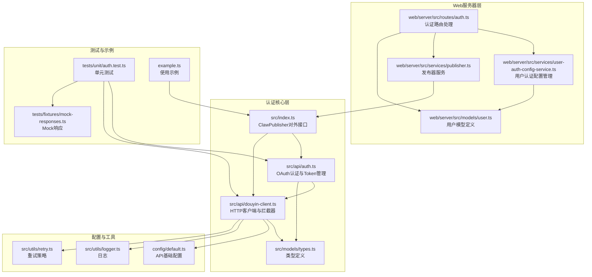
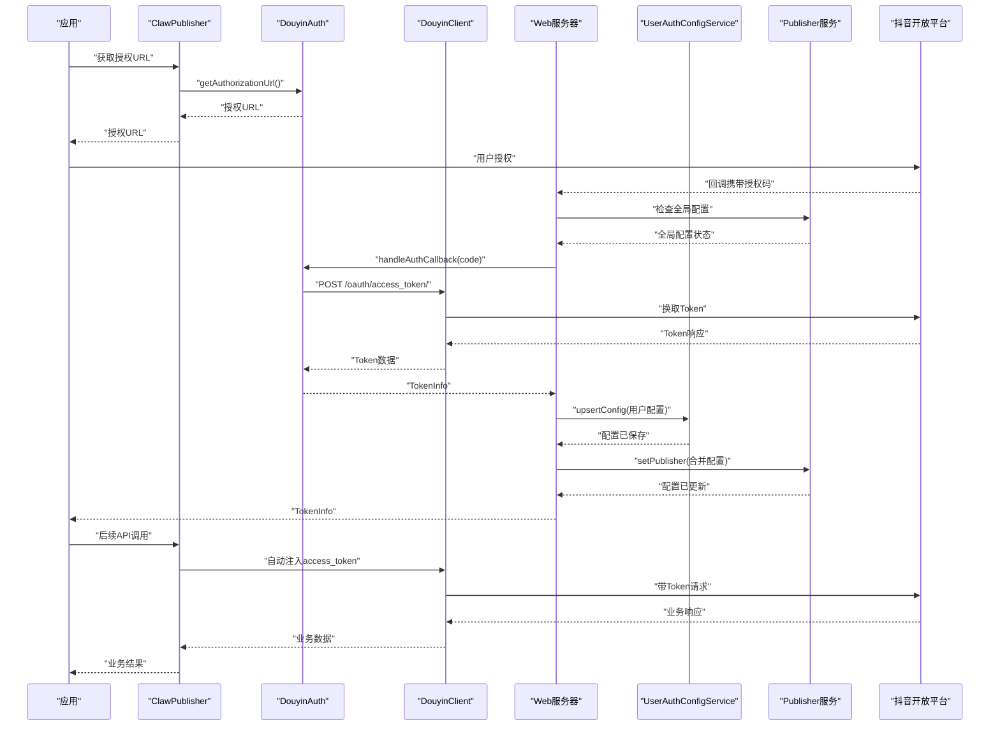
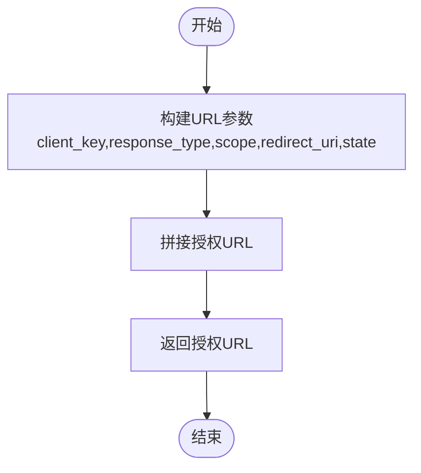
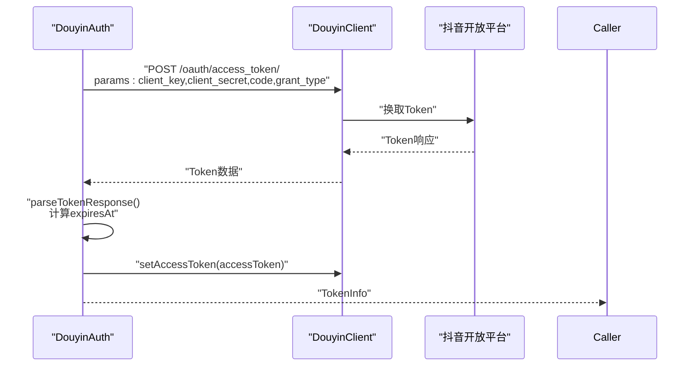
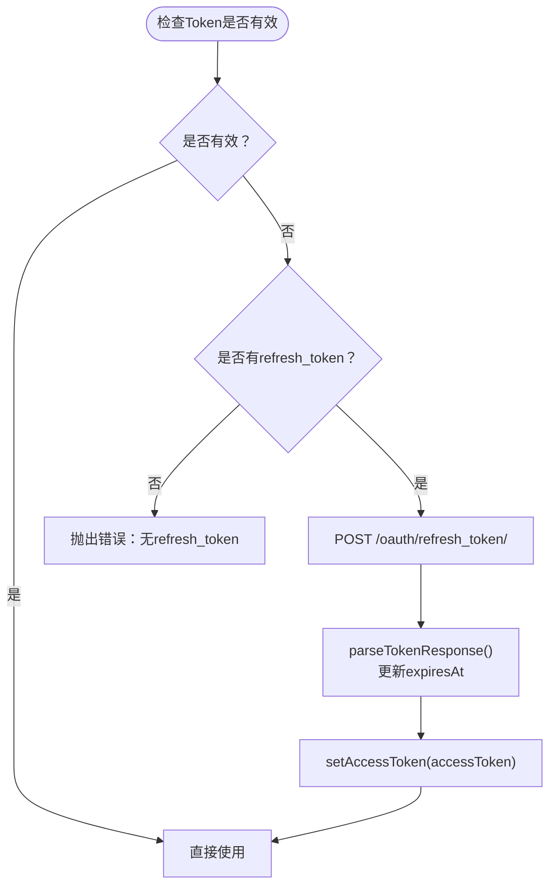
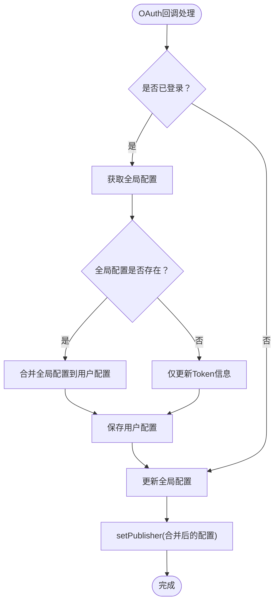
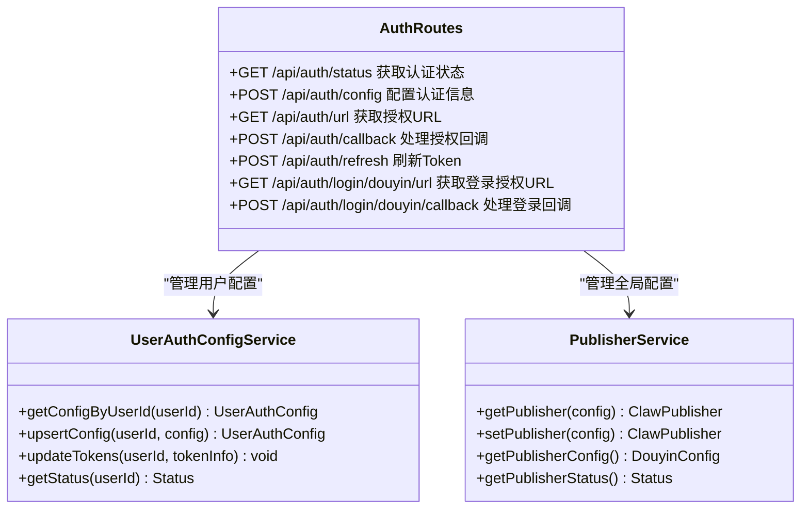
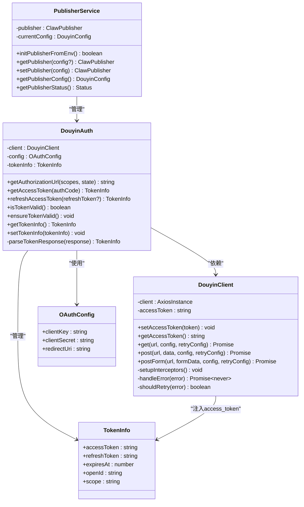
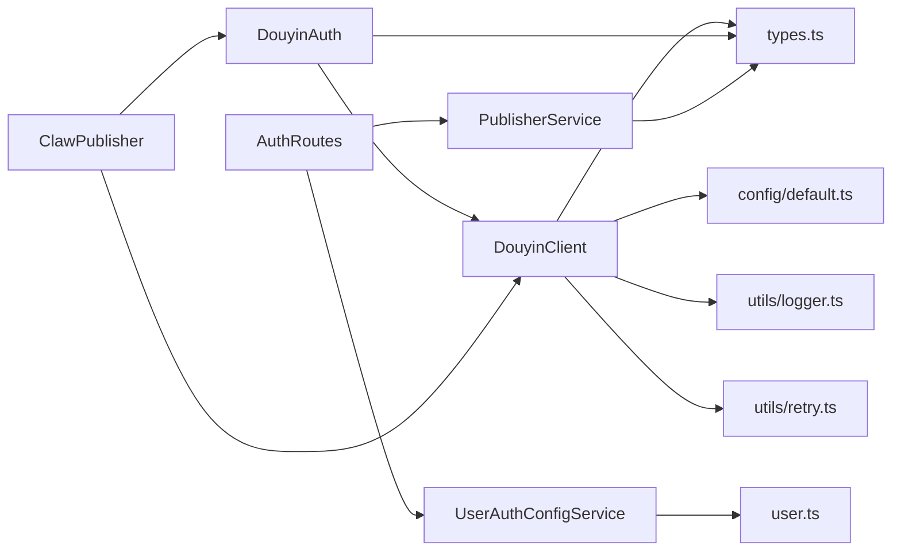

# 认证模块

<cite>
**本文引用的文件**
- [src/api/auth.ts](file://src/api/auth.ts)
- [src/api/douyin-client.ts](file://src/api/douyin-client.ts)
- [src/models/types.ts](file://src/models/types.ts)
- [src/index.ts](file://src/index.ts)
- [web/server/src/routes/auth.ts](file://web/server/src/routes/auth.ts)
- [web/server/src/services/user-auth-config-service.ts](file://web/server/src/services/user-auth-config-service.ts)
- [web/server/src/services/publisher.ts](file://web/server/src/services/publisher.ts)
- [web/server/src/models/user.ts](file://web/server/src/models/user.ts)
- [config/default.ts](file://config/default.ts)
- [src/utils/logger.ts](file://src/utils/logger.ts)
- [src/utils/retry.ts](file://src/utils/retry.ts)
- [tests/unit/auth.test.ts](file://tests/unit/auth.test.ts)
- [tests/fixtures/mock-responses.ts](file://tests/fixtures/mock-responses.ts)
- [example.ts](file://example.ts)
</cite>

## 更新摘要
**变更内容**
- 改进了OAuth回调处理流程，增加了全局配置检查和令牌配置合并逻辑
- 增强了用户认证配置的完整性管理
- 完善了用户认证状态的维护机制
- 新增了用户特定配置与全局配置的双向同步功能

## 目录
1. [简介](#简介)
2. [项目结构](#项目结构)
3. [核心组件](#核心组件)
4. [架构总览](#架构总览)
5. [详细组件分析](#详细组件分析)
6. [依赖关系分析](#依赖关系分析)
7. [性能考量](#性能考量)
8. [故障排查指南](#故障排查指南)
9. [结论](#结论)
10. [附录](#附录)

## 简介
本文件全面解析认证模块的OAuth认证流程与Token管理机制，涵盖授权URL生成、授权码获取、Token交换、访问令牌存储与刷新、过期处理、权限与作用域控制，并给出与DouyinClient的集成方式及认证状态维护策略。特别关注最新的增强功能：改进的OAuth回调处理流程、全局配置检查机制、令牌配置合并逻辑，以及用户认证配置的完整性管理。同时提供完整的认证流程示例代码路径与常见问题排查方案，帮助开发者快速集成并稳定运行。

## 项目结构
认证模块位于src/api目录下，核心文件包括：
- 认证模块：src/api/auth.ts
- 抖音客户端封装：src/api/douyin-client.ts
- 类型定义：src/models/types.ts
- 主入口与对外接口：src/index.ts
- Web服务器认证路由：web/server/src/routes/auth.ts
- 用户认证配置服务：web/server/src/services/user-auth-config-service.ts
- 发布器服务：web/server/src/services/publisher.ts
- 用户模型定义：web/server/src/models/user.ts
- 默认配置：config/default.ts
- 日志与重试工具：src/utils/logger.ts、src/utils/retry.ts
- 单元测试与Mock数据：tests/unit/auth.test.ts、tests/fixtures/mock-responses.ts
- 使用示例：example.ts

**图表来源**
- [src/api/auth.ts:1-194](file://src/api/auth.ts#L1-L194)
- [src/api/douyin-client.ts:1-237](file://src/api/douyin-client.ts#L1-L237)
- [src/models/types.ts:1-687](file://src/models/types.ts#L1-L687)
- [src/index.ts:1-270](file://src/index.ts#L1-L270)
- [web/server/src/routes/auth.ts:1-396](file://web/server/src/routes/auth.ts#L1-L396)
- [web/server/src/services/user-auth-config-service.ts:1-167](file://web/server/src/services/user-auth-config-service.ts#L1-L167)
- [web/server/src/services/publisher.ts:1-214](file://web/server/src/services/publisher.ts#L1-L214)
- [web/server/src/models/user.ts:1-131](file://web/server/src/models/user.ts#L1-L131)

**章节来源**
- [src/api/auth.ts:1-194](file://src/api/auth.ts#L1-L194)
- [src/api/douyin-client.ts:1-237](file://src/api/douyin-client.ts#L1-L237)
- [src/models/types.ts:1-687](file://src/models/types.ts#L1-L687)
- [src/index.ts:1-270](file://src/index.ts#L1-L270)
- [web/server/src/routes/auth.ts:1-396](file://web/server/src/routes/auth.ts#L1-L396)
- [web/server/src/services/user-auth-config-service.ts:1-167](file://web/server/src/services/user-auth-config-service.ts#L1-L167)
- [web/server/src/services/publisher.ts:1-214](file://web/server/src/services/publisher.ts#L1-L214)
- [web/server/src/models/user.ts:1-131](file://web/server/src/models/user.ts#L1-L131)

## 核心组件
- OAuth作用域常量：定义视频创作、上传、数据查询、用户信息等作用域，便于统一管理与校验。
- DouyinAuth：负责OAuth授权流程与Token生命周期管理，包括授权URL生成、授权码换取Token、Token刷新、有效性检查与自动刷新、Token信息持久化与恢复。
- DouyinClient：基于Axios的HTTP客户端，内置请求/响应拦截器，自动注入access_token，统一错误处理与指数退避重试。
- 类型系统：OAuthConfig、TokenResponse、TokenInfo等，确保配置与数据结构一致。
- ClawPublisher：对外统一入口，组合认证与发布能力，提供便捷的授权URL生成、回调处理、Token刷新与有效性检查等接口。
- **新增** UserAuthConfigService：管理用户的抖音认证配置，支持用户特定配置与全局配置的双向同步。
- **新增** Web认证路由：提供完整的OAuth回调处理、配置管理、状态检查等功能。
- **新增** Publisher服务：管理全局认证配置，支持环境变量初始化和配置状态检查。

**章节来源**
- [src/api/auth.ts:7-194](file://src/api/auth.ts#L7-L194)
- [src/api/douyin-client.ts:10-237](file://src/api/douyin-client.ts#L10-L237)
- [src/models/types.ts:15-47](file://src/models/types.ts#L15-L47)
- [src/index.ts:24-112](file://src/index.ts#L24-L112)
- [web/server/src/services/user-auth-config-service.ts:8-167](file://web/server/src/services/user-auth-config-service.ts#L8-L167)
- [web/server/src/routes/auth.ts:14-396](file://web/server/src/routes/auth.ts#L14-L396)
- [web/server/src/services/publisher.ts:5-214](file://web/server/src/services/publisher.ts#L5-L214)

## 架构总览
认证模块采用"客户端-认证-服务-路由"四层协作架构：
- 外部系统通过ClawPublisher发起授权流程，生成授权URL并处理回调。
- Web服务器路由层接收OAuth回调，进行全局配置检查和令牌配置合并。
- DouyinAuth负责OAuth协议细节，与DouyinClient交互完成Token获取与刷新。
- UserAuthConfigService管理用户特定认证配置，实现用户配置与全局配置的双向同步。
- Publisher服务管理全局认证状态，支持环境变量初始化和配置恢复。
- DouyinClient统一注入access_token并处理错误与重试，保障API调用稳定性。
- 类型系统贯穿始终，确保配置与数据结构正确性。

**图表来源**
- [src/index.ts:71-88](file://src/index.ts#L71-L88)
- [src/api/auth.ts:45-91](file://src/api/auth.ts#L45-L91)
- [src/api/douyin-client.ts:48-91](file://src/api/douyin-client.ts#L48-L91)
- [web/server/src/routes/auth.ts:113-177](file://web/server/src/routes/auth.ts#L113-L177)
- [web/server/src/services/user-auth-config-service.ts:21-93](file://web/server/src/services/user-auth-config-service.ts#L21-L93)
- [web/server/src/services/publisher.ts:64-68](file://web/server/src/services/publisher.ts#L64-L68)

## 详细组件分析

### OAuth授权流程与作用域管理
- 授权URL生成：根据clientKey、response_type=code、scope、redirectUri以及可选state拼接授权URL，便于引导用户完成授权。
- 默认作用域：VIDEO_CREATE、VIDEO_UPLOAD、VIDEO_DATA，满足常见视频创作与上传场景。
- 自定义作用域：支持传入自定义scope数组，按逗号拼接传递给抖音开放平台。
- 状态参数：可选state参数用于CSRF防护与回调校验。

**图表来源**
- [src/api/auth.ts:45-60](file://src/api/auth.ts#L45-L60)

**章节来源**
- [src/api/auth.ts:7-25](file://src/api/auth.ts#L7-L25)
- [src/api/auth.ts:45-60](file://src/api/auth.ts#L45-L60)

### 授权码换取Token与Token解析
- Token交换：向/oauth/access_token/发送授权码换取access_token、refresh_token、expires_in、open_id、scope。
- Token解析：计算expiresAt（当前时间+expires_in），封装为TokenInfo并注入到DouyinClient。
- 错误处理：捕获异常并记录日志，向上抛出，便于上层统一处理。

**图表来源**
- [src/api/auth.ts:67-91](file://src/api/auth.ts#L67-L91)
- [src/api/auth.ts:176-186](file://src/api/auth.ts#L176-L186)
- [src/api/douyin-client.ts:33-43](file://src/api/douyin-client.ts#L33-L43)

**章节来源**
- [src/api/auth.ts:67-91](file://src/api/auth.ts#L67-L91)
- [src/api/auth.ts:176-186](file://src/api/auth.ts#L176-L186)
- [src/api/douyin-client.ts:33-43](file://src/api/douyin-client.ts#L33-L43)

### Token刷新与过期处理
- 刷新逻辑：当无传入refreshToken时，优先使用内部存储的refreshToken；若两者均不可用则抛错。
- 刷新接口：调用/oauth/refresh_token/，返回新Token并更新客户端access_token。
- 过期判断：以当前时间与expiresAt比较，预留5分钟缓冲，避免临界点失效。
- 自动刷新：ensureTokenValid在调用API前检查并自动刷新，保证请求稳定性。

**图表来源**
- [src/api/auth.ts:98-127](file://src/api/auth.ts#L98-L127)
- [src/api/auth.ts:133-151](file://src/api/auth.ts#L133-L151)
- [src/api/auth.ts:176-186](file://src/api/auth.ts#L176-L186)
- [src/api/douyin-client.ts:33-43](file://src/api/douyin-client.ts#L33-L43)

**章节来源**
- [src/api/auth.ts:98-151](file://src/api/auth.ts#L98-L151)
- [src/api/auth.ts:176-186](file://src/api/auth.ts#L176-L186)
- [src/api/douyin-client.ts:33-43](file://src/api/douyin-client.ts#L33-L43)

### 权限与作用域控制
- 作用域常量：VIDEO_CREATE、VIDEO_UPLOAD、VIDEO_DATA、USER_INFO，统一管理授权范围。
- 默认作用域：初始化时使用VIDEO_CREATE、VIDEO_UPLOAD、VIDEO_DATA作为默认授权范围。
- 自定义作用域：支持传入自定义scope数组，按需申请最小权限集合。
- 作用域校验：在业务层（如发布服务）可根据scope决定是否允许某些操作（例如仅具备VIDEO_UPLOAD时不能进行VIDEO_DATA查询）。

**章节来源**
- [src/api/auth.ts:7-25](file://src/api/auth.ts#L7-L25)
- [src/api/auth.ts:20-24](file://src/api/auth.ts#L20-L24)

### 用户认证配置管理与全局配置检查
**新增** 用户认证配置服务提供了完整的用户认证配置管理功能：
- 用户特定配置：每个用户拥有独立的抖音认证配置，包括clientKey、clientSecret、redirectUri、accessToken、refreshToken、openId等。
- 配置合并逻辑：在OAuth回调处理时，会检查全局配置并将其与用户配置进行合并，确保用户配置的完整性。
- 双向同步：支持用户配置与全局配置的双向同步，既可以在用户层面独立管理，也可以继承全局配置。
- 配置状态检查：提供配置状态检查功能，判断用户是否已完成抖音认证配置以及Token是否有效。

**图表来源**
- [web/server/src/routes/auth.ts:127-165](file://web/server/src/routes/auth.ts#L127-L165)
- [web/server/src/services/user-auth-config-service.ts:21-93](file://web/server/src/services/user-auth-config-service.ts#L21-L93)

**章节来源**
- [web/server/src/services/user-auth-config-service.ts:8-167](file://web/server/src/services/user-auth-config-service.ts#L8-L167)
- [web/server/src/routes/auth.ts:113-177](file://web/server/src/routes/auth.ts#L113-L177)

### Web认证路由与状态管理
**新增** Web服务器提供了完整的认证路由处理：
- 认证状态检查：支持获取用户特定配置状态或全局状态。
- 配置管理：支持用户配置和全局配置的双向保存，确保配置完整性。
- OAuth回调处理：完整的授权码处理流程，包括Token获取、配置保存、状态更新。
- 登录流程：提供独立的抖音OAuth登录流程，支持记住登录状态等功能。

**图表来源**
- [web/server/src/routes/auth.ts:14-396](file://web/server/src/routes/auth.ts#L14-L396)
- [web/server/src/services/user-auth-config-service.ts:8-167](file://web/server/src/services/user-auth-config-service.ts#L8-L167)
- [web/server/src/services/publisher.ts:5-214](file://web/server/src/services/publisher.ts#L5-L214)

**章节来源**
- [web/server/src/routes/auth.ts:14-396](file://web/server/src/routes/auth.ts#L14-L396)
- [web/server/src/services/publisher.ts:5-214](file://web/server/src/services/publisher.ts#L5-L214)

### 与DouyinClient的集成与认证状态维护
- 认证状态：DouyinAuth内部维护tokenInfo（包含accessToken、refreshToken、expiresAt、openId、scope），并通过setTokenInfo恢复状态。
- 客户端集成：DouyinClient在请求拦截器中自动注入access_token，响应拦截器统一处理错误与限流。
- 重试机制：基于指数退避的withRetry，针对限流与网络错误自动重试，提升稳定性。
- 日志记录：模块内广泛使用日志记录关键事件，便于调试与审计。
- **新增** Publisher服务：管理全局认证配置，支持环境变量初始化和配置状态检查。

**图表来源**
- [src/api/auth.ts:29-186](file://src/api/auth.ts#L29-L186)
- [src/api/douyin-client.ts:13-221](file://src/api/douyin-client.ts#L13-L221)
- [src/models/types.ts:18-46](file://src/models/types.ts#L18-L46)
- [web/server/src/services/publisher.ts:5-214](file://web/server/src/services/publisher.ts#L5-L214)

**章节来源**
- [src/api/auth.ts:29-186](file://src/api/auth.ts#L29-L186)
- [src/api/douyin-client.ts:13-221](file://src/api/douyin-client.ts#L13-L221)
- [src/models/types.ts:18-46](file://src/models/types.ts#L18-L46)
- [web/server/src/services/publisher.ts:5-214](file://web/server/src/services/publisher.ts#L5-L214)

### 完整认证流程示例（代码路径）
- 初始化ClawPublisher并传入clientKey、clientSecret、redirectUri，以及可选的预置Token（accessToken、refreshToken、openId）。
- 生成授权URL并引导用户访问。
- 用户授权后回调携带授权码，调用handleAuthCallback(code)换取Token。
- **新增** Web服务器路由层会检查全局配置并进行配置合并，然后保存到用户配置。
- 后续API调用前可调用isTokenValid()或ensureTokenValid()确保Token有效。
- 若Token过期，调用refreshToken()刷新并重新注入到客户端。

**章节来源**
- [src/index.ts:39-67](file://src/index.ts#L39-L67)
- [src/index.ts:77-112](file://src/index.ts#L77-L112)
- [example.ts:11-37](file://example.ts#L11-L37)
- [example.ts:159-193](file://example.ts#L159-L193)
- [web/server/src/routes/auth.ts:113-177](file://web/server/src/routes/auth.ts#L113-L177)

## 依赖关系分析
- 组件耦合：DouyinAuth强依赖DouyinClient用于HTTP请求；ClawPublisher聚合二者，提供统一对外接口。
- **新增** Web服务器层：AuthRoutes依赖UserAuthConfigService和PublisherService，实现完整的认证流程。
- 外部依赖：Axios（HTTP）、node-cron（定时任务）、winston（日志）、dotenv（环境变量）。
- 配置依赖：API_BASE_URL来自config/default.ts，影响DouyinClient的请求基址。
- 类型依赖：types.ts定义OAuthConfig、TokenResponse、TokenInfo等，贯穿认证与业务层。
- **新增** 数据库依赖：UserAuthConfigService依赖本地数据库存储用户认证配置。

**图表来源**
- [src/api/auth.ts:1-5](file://src/api/auth.ts#L1-L5)
- [src/api/douyin-client.ts:1-6](file://src/api/douyin-client.ts#L1-L6)
- [src/index.ts:1-14](file://src/index.ts#L1-L14)
- [web/server/src/routes/auth.ts:1-11](file://web/server/src/routes/auth.ts#L1-L11)
- [web/server/src/services/user-auth-config-service.ts:1-3](file://web/server/src/services/user-auth-config-service.ts#L1-L3)
- [web/server/src/services/publisher.ts:1-4](file://web/server/src/services/publisher.ts#L1-L4)
- [config/default.ts:5-8](file://config/default.ts#L5-L8)
- [src/utils/logger.ts:1-6](file://src/utils/logger.ts#L1-L6)
- [src/utils/retry.ts:1-4](file://src/utils/retry.ts#L1-L4)

**章节来源**
- [src/api/auth.ts:1-5](file://src/api/auth.ts#L1-L5)
- [src/api/douyin-client.ts:1-6](file://src/api/douyin-client.ts#L1-L6)
- [src/index.ts:1-14](file://src/index.ts#L1-L14)
- [web/server/src/routes/auth.ts:1-11](file://web/server/src/routes/auth.ts#L1-L11)
- [web/server/src/services/user-auth-config-service.ts:1-3](file://web/server/src/services/user-auth-config-service.ts#L1-L3)
- [web/server/src/services/publisher.ts:1-4](file://web/server/src/services/publisher.ts#L1-L4)
- [config/default.ts:5-8](file://config/default.ts#L5-L8)
- [src/utils/logger.ts:1-6](file://src/utils/logger.ts#L1-L6)
- [src/utils/retry.ts:1-4](file://src/utils/retry.ts#L1-L4)

## 性能考量
- 指数退避重试：默认最多3次重试，基础延迟1秒，最大延迟30秒，避免对抖音API造成过大压力。
- 请求拦截器注入：在请求阶段统一注入access_token，减少重复参数传递。
- 过期缓冲：Token有效期预留5分钟缓冲，降低临界点失败概率。
- 限流识别：针对特定限流错误码（如429、10001、10002）自动重试，提高成功率。
- **新增** 配置缓存：Publisher服务维护全局配置缓存，避免重复初始化开销。
- **新增** 异步处理：Web服务器路由采用异步处理模式，提高并发处理能力。

**章节来源**
- [src/utils/retry.ts:9-13](file://src/utils/retry.ts#L9-L13)
- [src/api/douyin-client.ts:204-220](file://src/api/douyin-client.ts#L204-L220)
- [src/api/auth.ts:138-141](file://src/api/auth.ts#L138-L141)
- [web/server/src/services/publisher.ts:64-68](file://web/server/src/services/publisher.ts#L64-L68)

## 故障排查指南
- 授权URL生成异常
  - 检查clientKey、redirectUri是否正确配置。
  - 确认scope数组合法且与抖音开放平台一致。
- 授权码换取Token失败
  - 核对clientSecret是否正确。
  - 检查授权码是否过期或已被使用。
  - 关注日志中的错误信息，定位具体原因。
- Token刷新失败
  - 确认refreshToken存在且未过期。
  - 检查网络与抖音开放平台状态。
- Token无效或即将过期
  - 使用isTokenValid()检查状态。
  - 在调用API前调用ensureTokenValid()自动刷新。
- 业务接口报错
  - 检查响应拦截器中的错误码映射，区分HTTP错误与抖音API错误。
  - 对限流错误启用重试策略，避免重复触发。
- **新增** OAuth回调处理失败
  - 检查回调URL配置是否正确。
  - 确认全局配置是否完整，特别是clientKey、clientSecret、redirectUri。
  - 验证用户认证配置是否正确保存。
- **新增** 用户配置不完整
  - 检查UserAuthConfigService的状态检查功能。
  - 确认配置合并逻辑是否正常执行。
  - 验证数据库连接和配置存储是否正常。

**章节来源**
- [tests/unit/auth.test.ts:32-64](file://tests/unit/auth.test.ts#L32-L64)
- [tests/unit/auth.test.ts:66-98](file://tests/unit/auth.test.ts#L66-L98)
- [tests/unit/auth.test.ts:100-133](file://tests/unit/auth.test.ts#L100-L133)
- [tests/unit/auth.test.ts:135-175](file://tests/unit/auth.test.ts#L135-L175)
- [tests/unit/auth.test.ts:177-221](file://tests/unit/auth.test.ts#L177-L221)
- [src/api/douyin-client.ts:97-116](file://src/api/douyin-client.ts#L97-L116)
- [src/api/douyin-client.ts:204-220](file://src/api/douyin-client.ts#L204-L220)
- [web/server/src/routes/auth.ts:113-177](file://web/server/src/routes/auth.ts#L113-L177)
- [web/server/src/services/user-auth-config-service.ts:118-132](file://web/server/src/services/user-auth-config-service.ts#L118-L132)

## 结论
认证模块通过清晰的职责划分与完善的错误处理机制，实现了从授权URL生成到Token获取、刷新与过期管理的全链路闭环。最新的增强功能包括改进的OAuth回调处理流程、全局配置检查机制、令牌配置合并逻辑，以及用户认证配置的完整性管理。这些改进显著提升了系统的稳定性和用户体验。结合DouyinClient的统一拦截与重试策略，以及Web服务器层的完整认证路由处理，显著提升了API调用的稳定性与可靠性。建议在生产环境中：
- 明确作用域范围，遵循最小权限原则。
- 在应用启动时加载持久化的Token信息，减少用户交互成本。
- 利用新增的配置合并功能，确保用户配置的完整性。
- 对关键流程增加日志与监控，便于问题定位与优化。

## 附录
- 示例代码路径
  - 初始化与授权流程：[example.ts:11-37](file://example.ts#L11-L37)
  - 完整工作流示例：[example.ts:159-193](file://example.ts#L159-L193)
  - **新增** Web服务器认证路由：[web/server/src/routes/auth.ts:113-177](file://web/server/src/routes/auth.ts#L113-L177)
  - **新增** 用户认证配置服务：[web/server/src/services/user-auth-config-service.ts:21-93](file://web/server/src/services/user-auth-config-service.ts#L21-L93)
  - 单元测试覆盖：[tests/unit/auth.test.ts:1-232](file://tests/unit/auth.test.ts#L1-L232)
  - Mock响应数据：[tests/fixtures/mock-responses.ts:1-91](file://tests/fixtures/mock-responses.ts#L1-L91)