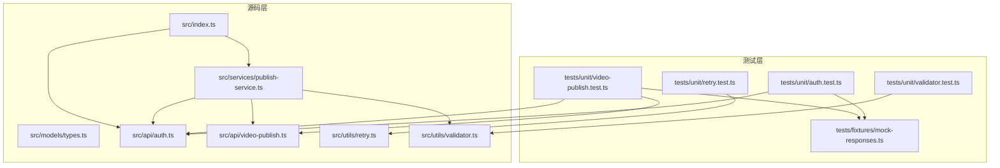
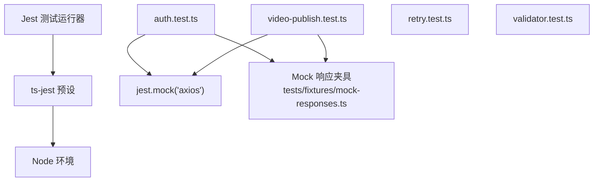
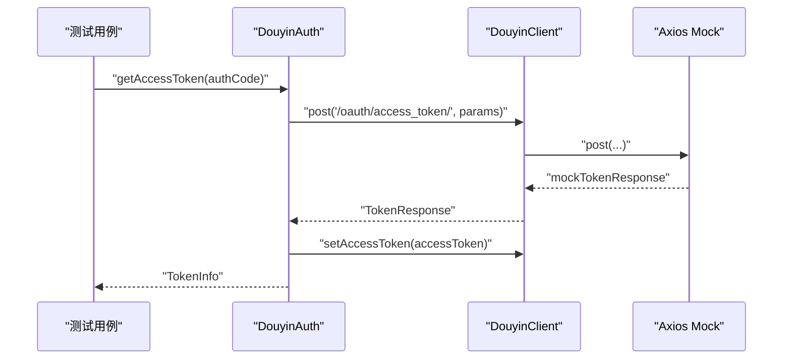
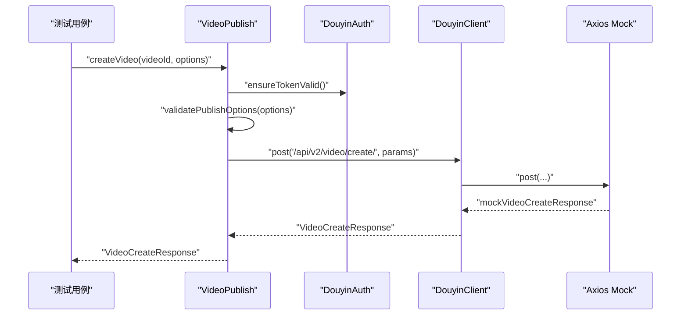
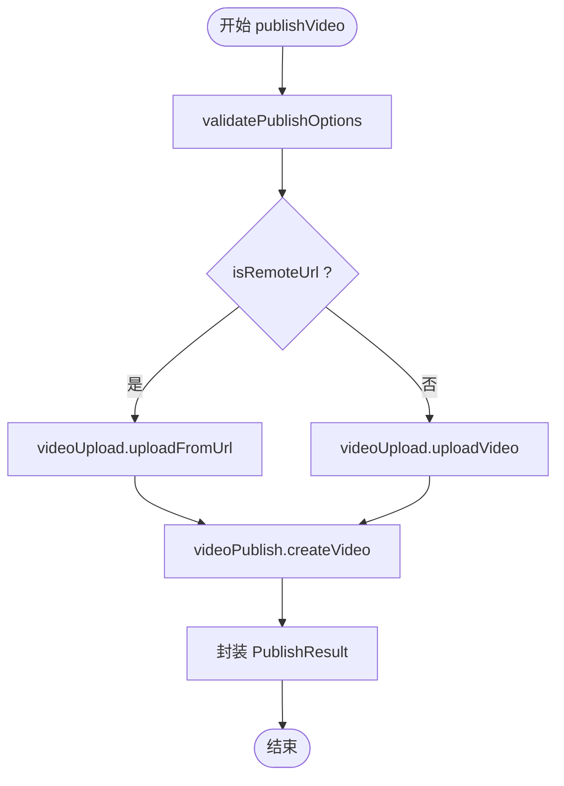
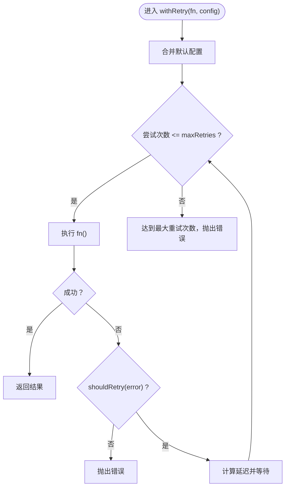
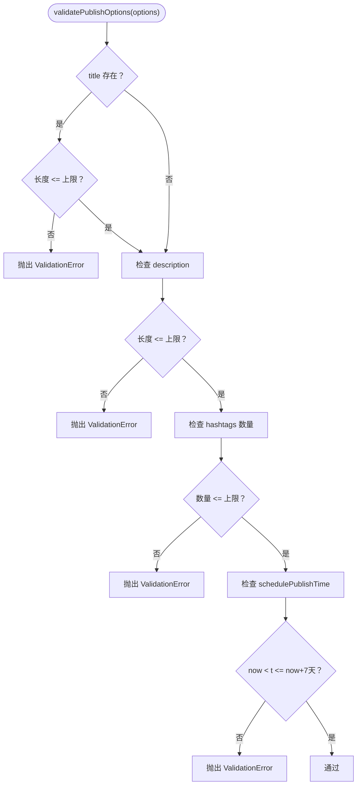
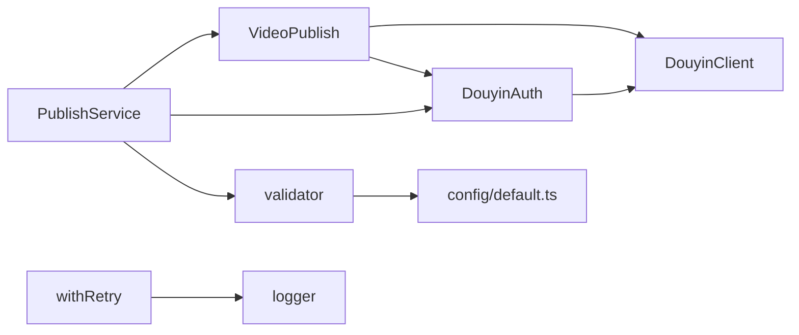

# 测试指南

<cite>
**本文引用的文件**
- [package.json](file://package.json)
- [jest.config.js](file://jest.config.js)
- [README.md](file://README.md)
- [src/index.ts](file://src/index.ts)
- [src/models/types.ts](file://src/models/types.ts)
- [src/api/auth.ts](file://src/api/auth.ts)
- [src/api/video-publish.ts](file://src/api/video-publish.ts)
- [src/services/publish-service.ts](file://src/services/publish-service.ts)
- [src/utils/retry.ts](file://src/utils/retry.ts)
- [src/utils/validator.ts](file://src/utils/validator.ts)
- [tests/fixtures/mock-responses.ts](file://tests/fixtures/mock-responses.ts)
- [tests/unit/auth.test.ts](file://tests/unit/auth.test.ts)
- [tests/unit/retry.test.ts](file://tests/unit/retry.test.ts)
- [tests/unit/validator.test.ts](file://tests/unit/validator.test.ts)
- [tests/unit/video-publish.test.ts](file://tests/unit/video-publish.test.ts)
</cite>

## 目录
1. [简介](#简介)
2. [项目结构](#项目结构)
3. [核心组件](#核心组件)
4. [架构总览](#架构总览)
5. [详细组件分析](#详细组件分析)
6. [依赖分析](#依赖分析)
7. [性能考虑](#性能考虑)
8. [故障排查指南](#故障排查指南)
9. [结论](#结论)
10. [附录](#附录)

## 简介
本测试指南面向ClawOperations项目的测试体系，围绕单元测试与集成测试的组织结构、策略与最佳实践展开，覆盖认证、视频发布、重试机制与校验器等模块。文档提供Jest配置说明、Mock响应数据与测试夹具的使用方法、测试用例设计原则、测试覆盖率与质量指标、持续集成与自动化测试建议，以及调试技巧与常见问题解决方案。

## 项目结构
测试目录采用按功能分层的组织方式：tests/unit下为各模块的单元测试；tests/fixtures提供统一的Mock响应数据。核心源码位于src目录，按职责划分为API层、服务层、工具层与模型层。

图表来源
- [tests/unit/auth.test.ts:1-232](file://tests/unit/auth.test.ts#L1-L232)
- [tests/unit/video-publish.test.ts:1-220](file://tests/unit/video-publish.test.ts#L1-L220)
- [tests/unit/retry.test.ts:1-106](file://tests/unit/retry.test.ts#L1-L106)
- [tests/unit/validator.test.ts:1-200](file://tests/unit/validator.test.ts#L1-L200)
- [tests/fixtures/mock-responses.ts:1-91](file://tests/fixtures/mock-responses.ts#L1-L91)
- [src/api/auth.ts:1-190](file://src/api/auth.ts#L1-L190)
- [src/api/video-publish.ts:1-174](file://src/api/video-publish.ts#L1-L174)
- [src/services/publish-service.ts:1-228](file://src/services/publish-service.ts#L1-L228)
- [src/utils/retry.ts:1-84](file://src/utils/retry.ts#L1-L84)
- [src/utils/validator.ts:1-116](file://src/utils/validator.ts#L1-L116)
- [src/models/types.ts:1-201](file://src/models/types.ts#L1-L201)
- [src/index.ts:1-248](file://src/index.ts#L1-L248)

章节来源
- [README.md:92-105](file://README.md#L92-L105)
- [package.json:7-12](file://package.json#L7-L12)

## 核心组件
- 认证模块（DouyinAuth）：负责OAuth授权URL生成、授权码换Token、刷新Token、Token有效性检查与自动刷新。
- 视频发布模块（VideoPublish）：封装视频创建、状态查询、删除等API调用，并在内部进行参数构建与校验。
- 发布服务（PublishService）：业务编排层，串联上传与发布流程，处理下载远程视频、清理临时文件等。
- 重试工具（withRetry）：提供指数退避的重试策略，支持自定义重试条件与延迟上限。
- 校验器（validator）：对视频文件格式/大小与发布选项（标题、描述、hashtag数量、定时发布时间等）进行校验，并提供hashtag格式化与清理能力。
- 类型定义（models/types）：统一定义重试配置、认证与发布相关的数据结构与接口。

章节来源
- [src/api/auth.ts:29-190](file://src/api/auth.ts#L29-L190)
- [src/api/video-publish.ts:15-174](file://src/api/video-publish.ts#L15-L174)
- [src/services/publish-service.ts:22-228](file://src/services/publish-service.ts#L22-L228)
- [src/utils/retry.ts:41-84](file://src/utils/retry.ts#L41-L84)
- [src/utils/validator.ts:17-116](file://src/utils/validator.ts#L17-L116)
- [src/models/types.ts:4-201](file://src/models/types.ts#L4-L201)

## 架构总览
测试架构以Jest为核心，通过ts-jest预设在Node环境中运行TypeScript测试。测试用例通过jest.mock对HTTP客户端进行隔离，使用tests/fixtures中的Mock响应数据模拟真实API行为，确保测试稳定且可重复。

图表来源
- [jest.config.js:1-9](file://jest.config.js#L1-L9)
- [tests/unit/auth.test.ts:5-16](file://tests/unit/auth.test.ts#L5-L16)
- [tests/unit/video-publish.test.ts:6-16](file://tests/unit/video-publish.test.ts#L6-L16)
- [tests/fixtures/mock-responses.ts:1-91](file://tests/fixtures/mock-responses.ts#L1-L91)

## 详细组件分析

### 认证模块测试（DouyinAuth）
- 测试目标
  - 授权URL生成：校验默认作用域、自定义作用域、state参数拼接正确性。
  - Token获取：校验请求参数、设置访问令牌、返回Token信息。
  - Token刷新：无refresh_token时抛错；有refresh_token时正确刷新并更新客户端令牌。
  - Token有效性：未过期、已过期、即将过期（含缓冲）场景。
  - 自动刷新：ensureTokenValid在过期时触发刷新。
  - 作用域常量：OAUTH_SCOPES枚举值正确。
- Mock策略
  - 使用jest.mock('axios')创建mock客户端，spyOn client.post与setAccessToken以断言调用与副作用。
- 用例设计要点
  - 参数边界：空/undefined、默认值、自定义值。
  - 异常路径：缺少refresh_token、网络错误、解析异常。
  - 行为验证：日志记录、状态变更、返回值结构。

图表来源
- [tests/unit/auth.test.ts:66-98](file://tests/unit/auth.test.ts#L66-L98)
- [src/api/auth.ts:67-91](file://src/api/auth.ts#L67-L91)

章节来源
- [tests/unit/auth.test.ts:17-231](file://tests/unit/auth.test.ts#L17-L231)
- [src/api/auth.ts:29-190](file://src/api/auth.ts#L29-L190)

### 视频发布模块测试（VideoPublish）
- 测试目标
  - createVideo：构建参数（标题、描述+hashtag、@用户、POI、小程序、商品链接、定时发布）、调用API、返回结构。
  - queryVideoStatus：调用API并返回状态、分享链接、创建时间。
  - deleteVideo：调用API删除视频。
- Mock策略
  - 同样使用jest.mock('axios')，spyOn client.post断言请求体字段。
  - 依赖DouyinAuth，先设置TokenInfo以避免鉴权失败。
- 用例设计要点
  - 参数组合：空选项、部分选项、全部选项。
  - 组合逻辑：hashtag格式化、描述拼接。
  - 边界与异常：定时发布时间合法性、参数校验失败。

图表来源
- [tests/unit/video-publish.test.ts:46-183](file://tests/unit/video-publish.test.ts#L46-L183)
- [src/api/video-publish.ts:30-54](file://src/api/video-publish.ts#L30-L54)

章节来源
- [tests/unit/video-publish.test.ts:18-220](file://tests/unit/video-publish.test.ts#L18-L220)
- [src/api/video-publish.ts:15-174](file://src/api/video-publish.ts#L15-L174)

### 发布服务测试（PublishService）
- 测试目标
  - publishVideo：参数校验、上传（本地/URL）、发布、结果封装。
  - publishUploadedVideo：仅发布已上传视频。
  - downloadAndPublish：下载远程视频、校验、发布、清理临时文件。
  - queryVideoStatus / deleteVideo：委托VideoPublish。
- Mock策略
  - 对VideoUpload与VideoPublish进行依赖注入，通过jest.spyOn验证调用链。
  - 使用tests/fixtures中的Mock响应数据。
- 用例设计要点
  - 成功路径：完整流程、部分流程。
  - 异常路径：上传失败、发布失败、下载失败、文件清理。
  - 回调与日志：上传进度回调、错误日志。

图表来源
- [tests/unit/video-publish.test.ts:38-80](file://tests/unit/video-publish.test.ts#L38-L80)
- [src/services/publish-service.ts:38-80](file://src/services/publish-service.ts#L38-L80)

章节来源
- [src/services/publish-service.ts:22-228](file://src/services/publish-service.ts#L22-L228)

### 重试工具测试（withRetry）
- 测试目标
  - 成功执行：一次性成功不重试。
  - 失败重试：指数退避、最大重试次数、自定义shouldRetry。
  - 最大延迟限制：maxDelay生效。
  - 默认配置：未传入配置时使用默认值。
- Mock策略
  - 使用jest.fn().mockRejectedValueOnce(...).mockResolvedValue(...)模拟多次失败后成功。
- 用例设计要点
  - 时间测量：验证累计等待时间符合指数退避。
  - 配置合并：只覆盖部分配置时其余使用默认。

图表来源
- [tests/unit/retry.test.ts:4-105](file://tests/unit/retry.test.ts#L4-L105)
- [src/utils/retry.ts:41-84](file://src/utils/retry.ts#L41-L84)

章节来源
- [tests/unit/retry.test.ts:1-106](file://tests/unit/retry.test.ts#L1-L106)
- [src/utils/retry.ts:1-84](file://src/utils/retry.ts#L1-L84)

### 校验器测试（validator）
- 测试目标
  - validateVideoFile：支持格式、文件大小上限。
  - validatePublishOptions：标题/描述长度、hashtag数量、定时发布时间范围。
  - cleanHashtag / formatHashtags：hashtag清理与格式化。
- Mock策略
  - 依赖config/default.ts中的内容配置（在测试中由jest.mock或夹具替代）。
- 用例设计要点
  - 边界值：长度上限、数量上限、时间边界。
  - 异常路径：抛出ValidationError。

图表来源
- [tests/unit/validator.test.ts:10-154](file://tests/unit/validator.test.ts#L10-L154)
- [src/utils/validator.ts:45-86](file://src/utils/validator.ts#L45-L86)

章节来源
- [tests/unit/validator.test.ts:1-200](file://tests/unit/validator.test.ts#L1-L200)
- [src/utils/validator.ts:1-116](file://src/utils/validator.ts#L1-L116)

## 依赖分析
- 测试耦合与内聚
  - 单元测试聚焦单一模块，通过jest.mock降低外部依赖耦合。
  - 测试夹具集中管理Mock响应，提升复用性与一致性。
- 直接与间接依赖
  - 认证与视频发布模块直接依赖HTTP客户端；发布服务作为编排层依赖认证与发布模块。
- 外部依赖与集成点
  - Axios用于HTTP请求；Node内置模块（fs、path、https）用于文件与下载逻辑。
- 接口契约
  - 所有模块均通过明确的类型接口交互，便于测试替换与断言。

图表来源
- [src/api/auth.ts:1-190](file://src/api/auth.ts#L1-L190)
- [src/api/video-publish.ts:1-174](file://src/api/video-publish.ts#L1-L174)
- [src/services/publish-service.ts:1-228](file://src/services/publish-service.ts#L1-L228)
- [src/utils/retry.ts:1-84](file://src/utils/retry.ts#L1-L84)
- [src/utils/validator.ts:1-116](file://src/utils/validator.ts#L1-L116)

章节来源
- [src/services/publish-service.ts:22-31](file://src/services/publish-service.ts#L22-L31)
- [src/api/video-publish.ts:15-22](file://src/api/video-publish.ts#L15-L22)

## 性能考虑
- 测试执行效率
  - 使用Jest并发运行测试，避免不必要的I/O与网络请求。
  - 对HTTP请求进行Mock，减少真实API调用带来的时延与不确定性。
- 重试策略
  - withRetry的指数退避与最大延迟限制有助于在不稳定环境下平衡可靠性与性能。
- 日志与可观测性
  - 在测试中关注关键日志输出，定位耗时环节与异常路径。

## 故障排查指南
- 常见问题
  - Token缺失或过期：检查DouyinAuth.setTokenInfo与isTokenValid逻辑，确保在调用前已设置有效Token。
  - Mock未生效：确认jest.mock('axios')在被导入模块之前执行，或使用__mocks__/axios替代。
  - 参数断言失败：核对请求参数构建逻辑（如VideoPublish.buildPublishParams），确保字段命名与类型一致。
  - 定时发布时间异常：校验validatePublishOptions的时间范围与单位（秒）。
- 调试技巧
  - 使用jest.spyOn监控方法调用次数与参数。
  - 在测试中打印关键变量（如请求体、响应体）辅助定位。
  - 逐步缩小问题范围：先验证单个模块，再验证模块间协作。

章节来源
- [tests/unit/auth.test.ts:135-175](file://tests/unit/auth.test.ts#L135-L175)
- [tests/unit/video-publish.test.ts:176-183](file://tests/unit/video-publish.test.ts#L176-L183)
- [src/utils/validator.ts:71-83](file://src/utils/validator.ts#L71-L83)

## 结论
本测试指南提供了针对ClawOperations项目的系统化测试方案：清晰的测试组织结构、完善的Mock策略、覆盖关键模块的测试用例设计、基于Jest的配置与运行方式，以及可操作的调试与故障排查建议。通过遵循本文档，团队可以建立高质量、可维护、可扩展的测试体系，保障业务逻辑的稳定性与可演进性。

## 附录

### Jest配置与使用
- 预设与环境
  - ts-jest预设、Node环境、测试文件匹配规则、覆盖率收集范围。
- 命令脚本
  - 通过package.json中的test脚本运行Jest测试。

章节来源
- [jest.config.js:1-9](file://jest.config.js#L1-L9)
- [package.json:7-12](file://package.json#L7-L12)

### Mock响应数据与测试夹具
- 夹具位置与用途
  - tests/fixtures/mock-responses.ts提供OAuth、上传、发布、错误等Mock响应。
- 使用方法
  - 在测试文件中引入并作为client.post的返回值，或作为断言期望值。

章节来源
- [tests/fixtures/mock-responses.ts:1-91](file://tests/fixtures/mock-responses.ts#L1-L91)
- [tests/unit/auth.test.ts:3-3](file://tests/unit/auth.test.ts#L3-L3)
- [tests/unit/video-publish.test.ts:4-4](file://tests/unit/video-publish.test.ts#L4-L4)

### 测试用例设计最佳实践
- 单一职责：每个describe聚焦一个功能点。
- 参数化：覆盖正常、边界与异常三类输入。
- 行为驱动：断言方法调用、副作用与返回值。
- 可读性：使用语义化的测试名称与注释。

### 测试覆盖率与质量指标
- 覆盖率配置
  - collectCoverageFrom指定src/**/*.ts（排除入口index.ts）。
- 建议指标
  - 语句覆盖率、分支覆盖率、函数覆盖率、行覆盖率均达到较高水平（如≥80%）。
  - 关键路径（上传、发布、重试、校验）覆盖率优先保证。

章节来源
- [jest.config.js:7-7](file://jest.config.js#L7-L7)

### 持续集成与自动化测试
- CI建议
  - 在CI流水线中执行npm test，结合覆盖率报告与静态检查。
  - 将测试结果与覆盖率指标纳入质量门禁。
- 自动化
  - 通过Git Hooks在提交前运行测试，确保代码质量。

章节来源
- [package.json:7-12](file://package.json#L7-L12)