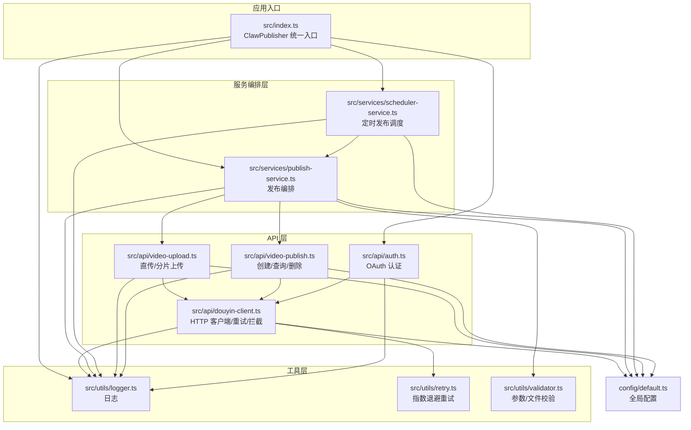
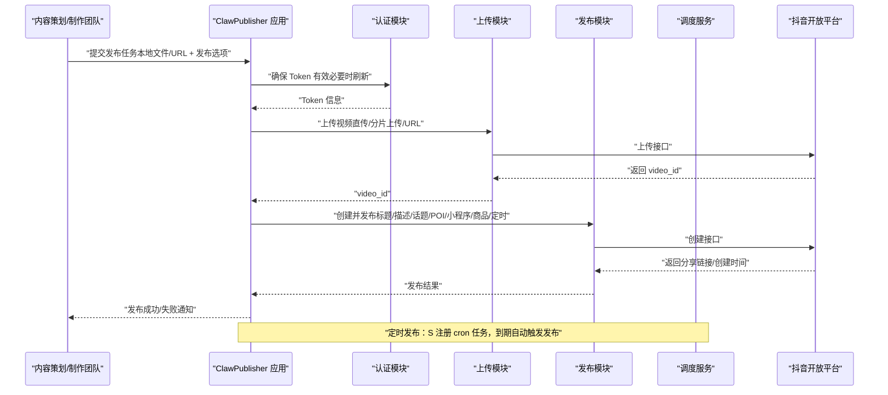
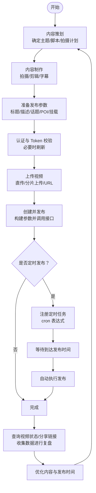
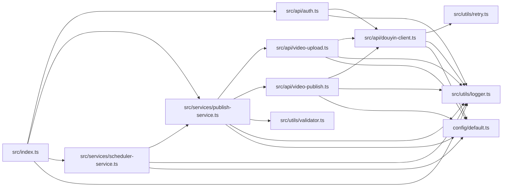

# 应用场景与案例

<cite>
**本文引用的文件**
- [README.md](file://README.md)
- [package.json](file://package.json)
- [example.ts](file://example.ts)
- [src/index.ts](file://src/index.ts)
- [src/models/types.ts](file://src/models/types.ts)
- [src/api/douyin-client.ts](file://src/api/douyin-client.ts)
- [src/api/auth.ts](file://src/api/auth.ts)
- [src/api/video-upload.ts](file://src/api/video-upload.ts)
- [src/api/video-publish.ts](file://src/api/video-publish.ts)
- [src/services/publish-service.ts](file://src/services/publish-service.ts)
- [src/services/scheduler-service.ts](file://src/services/scheduler-service.ts)
- [src/utils/logger.ts](file://src/utils/logger.ts)
- [src/utils/retry.ts](file://src/utils/retry.ts)
- [src/utils/validator.ts](file://src/utils/validator.ts)
- [config/default.ts](file://config/default.ts)
</cite>

## 目录
1. [简介](#简介)
2. [项目结构](#项目结构)
3. [核心组件](#核心组件)
4. [架构总览](#架构总览)
5. [详细组件分析](#详细组件分析)
6. [依赖关系分析](#依赖关系分析)
7. [性能考量](#性能考量)
8. [故障排查指南](#故障排查指南)
9. [结论](#结论)
10. [附录](#附录)

## 简介
本文件围绕 ClawOperations 系统在抖音（TikTok）生态中的应用，结合系统提供的认证、视频上传、视频发布、定时发布与日志/重试/校验等能力，面向海鲜餐厅、食品品牌、美食博主、MCN 机构等典型用户群体，构建可落地的应用场景与案例分析。文档从“内容策划—制作—发布—监控”的全链路视角出发，给出实施策略、成本效益与ROI分析建议，并提供最佳实践与常见问题解决方案，帮助决策者评估投资回报与竞争优势。

## 项目结构
ClawOperations 采用模块化分层设计：对外通过统一入口类提供认证、上传、发布、定时发布等能力；内部以 API 层（认证、上传、发布）、服务编排层（发布服务、调度服务）与工具层（日志、重试、校验）协同工作；配置集中于 config/default.ts，便于统一治理。

图表来源
- [src/index.ts:1-248](file://src/index.ts#L1-L248)
- [src/api/auth.ts:1-190](file://src/api/auth.ts#L1-L190)
- [src/api/douyin-client.ts:1-237](file://src/api/douyin-client.ts#L1-L237)
- [src/api/video-upload.ts:1-241](file://src/api/video-upload.ts#L1-L241)
- [src/api/video-publish.ts:1-174](file://src/api/video-publish.ts#L1-L174)
- [src/services/publish-service.ts:1-228](file://src/services/publish-service.ts#L1-L228)
- [src/services/scheduler-service.ts:1-202](file://src/services/scheduler-service.ts#L1-L202)
- [src/utils/logger.ts:1-61](file://src/utils/logger.ts#L1-L61)
- [src/utils/retry.ts:1-84](file://src/utils/retry.ts#L1-L84)
- [src/utils/validator.ts:1-116](file://src/utils/validator.ts#L1-L116)
- [config/default.ts:1-49](file://config/default.ts#L1-L49)

章节来源
- [README.md:92-105](file://README.md#L92-L105)
- [package.json:1-34](file://package.json#L1-L34)

## 核心组件
- 统一入口类：ClawPublisher 提供认证、上传、发布、定时发布、视频状态查询与删除等对外接口，封装底层复杂流程。
- 认证模块：基于抖音开放平台 OAuth 流程，支持授权 URL 生成、授权码换 Token、刷新 Token、Token 有效期检查与自动刷新。
- 上传模块：根据文件大小自动选择直传或分片上传，支持进度回调与 URL 直接上传。
- 发布模块：负责构建发布参数（标题、描述、话题、POI、小程序挂载、商品挂载、定时发布等），并调用创建接口。
- 发布服务：业务编排层，串联上传与发布，支持下载远程视频后发布、查询/删除视频状态。
- 调度服务：基于 node-cron 的定时发布，支持任务注册、取消、查询与清理。
- 工具组件：日志（winston）、重试（指数退避）、参数/文件校验（标题/描述/话题长度、文件格式/大小、定时发布时间范围）。

章节来源
- [src/index.ts:29-244](file://src/index.ts#L29-L244)
- [src/api/auth.ts:29-189](file://src/api/auth.ts#L29-L189)
- [src/api/video-upload.ts:20-241](file://src/api/video-upload.ts#L20-L241)
- [src/api/video-publish.ts:15-174](file://src/api/video-publish.ts#L15-L174)
- [src/services/publish-service.ts:22-228](file://src/services/publish-service.ts#L22-L228)
- [src/services/scheduler-service.ts:23-202](file://src/services/scheduler-service.ts#L23-L202)
- [src/utils/logger.ts:31-61](file://src/utils/logger.ts#L31-L61)
- [src/utils/retry.ts:41-84](file://src/utils/retry.ts#L41-L84)
- [src/utils/validator.ts:22-116](file://src/utils/validator.ts#L22-L116)

## 架构总览
下图展示从内容策划到发布的端到端流程，以及与抖音开放平台 API 的对接关系。

图表来源
- [src/index.ts:114-210](file://src/index.ts#L114-L210)
- [src/api/auth.ts:67-127](file://src/api/auth.ts#L67-L127)
- [src/api/video-upload.ts:35-152](file://src/api/video-upload.ts#L35-L152)
- [src/api/video-publish.ts:30-125](file://src/api/video-publish.ts#L30-L125)
- [src/services/scheduler-service.ts:37-72](file://src/services/scheduler-service.ts#L37-L72)

## 详细组件分析

### 典型用户场景与业务案例

#### 海鲜餐厅（连锁/单店）
- 场景目标：提升线上曝光、引流到店、强化品牌记忆点（如“麻辣小龙虾”“潜江小龙虾”）。
- 内容策略：周主题（如“工作日特惠”“周末大餐”），配合节日/季节性活动（如“小龙虾季”）。
- 发布节奏：每日 1-2 条，固定时段（午餐/晚餐高峰）发布，其余时间做预告与互动。
- 关键动作：
  - 上传与发布：使用一站式发布接口，自动处理上传与创建。
  - 定时发布：提前规划“周末特惠”“限时套餐”等视频，避免人工值守。
  - 地理位置：绑定门店 POI，提升本地搜索与到店转化。
  - 话题与标签：围绕“#小龙虾 #美食教程 #本地推荐”等组合，扩大发现。
- 成本与收益：
  - 人力节省：减少重复上传与发布时间安排的人工操作。
  - 效果提升：统一发布时间与话题策略，提高互动与转化。
  - ROI：以“到店转化率/客单价提升×发布频次”衡量，建议首月对比基线评估。

章节来源
- [example.ts:55-96](file://example.ts#L55-L96)
- [src/api/video-publish.ts:62-125](file://src/api/video-publish.ts#L62-L125)
- [src/services/scheduler-service.ts:37-72](file://src/services/scheduler-service.ts#L37-L72)

#### 食品品牌（预制菜/调料包）
- 场景目标：通过短视频展示产品使用场景与效果，促进电商转化。
- 内容策略：场景化内容（家庭聚餐、快手做法、对比评测），搭配品牌故事。
- 关键动作：
  - 商品挂载：在发布选项中挂载商品 ID，实现“观看即购买”闭环。
  - 小程序挂载：引导至配方页/购买页，提升转化路径一致性。
  - 定时发布：新品上市、促销节点前预热，节点当天集中爆发。
- 成本与收益：
  - 降低获客成本：通过精准话题与场景化内容，提高点击与转化。
  - 数据驱动：通过视频状态查询与分享链接追踪效果，持续优化。

章节来源
- [src/api/video-publish.ts:102-121](file://src/api/video-publish.ts#L102-L121)
- [src/services/publish-service.ts:101-125](file://src/services/publish-service.ts#L101-L125)

#### 美食博主（个人/小团队）
- 场景目标：建立个人风格与粉丝粘性，拓展商业合作与带货。
- 内容策略：系列化内容（如“一周五味”“家常菜进阶”），结合热点挑战。
- 关键动作：
  - 上传与发布：快速上传本地素材，一键发布并带话题。
  - 定时发布：利用空闲时间批量规划，保证稳定更新频率。
  - 互动管理：通过分享链接与状态查询，及时跟进评论与反馈。
- 成本与收益：
  - 时间价值：将重复劳动自动化，释放更多创作时间。
  - 影响力：稳定的发布时间与高质量内容有助于粉丝增长与合作议价。

章节来源
- [example.ts:100-127](file://example.ts#L100-L127)
- [src/services/publish-service.ts:179-185](file://src/services/publish-service.ts#L179-L185)

#### MCN 机构（多账号矩阵）
- 场景目标：规模化运营多个账号，统一内容策略与发布节奏。
- 内容策略：账号定位差异化（如“探店”“教程”“测评”），矩阵联动。
- 关键动作：
  - 多账号 Token 管理：通过预置 Token 与刷新机制保障稳定性。
  - 批量定时发布：集中规划与执行，降低运营成本。
  - 数据监控：统一查询视频状态与分享链接，形成报表与复盘。
- 成本与收益：
  - 规模效应：统一工具链与流程，显著降低人效成本。
  - 竞争优势：更高效的内容产出与投放节奏，抢占流量先机。

章节来源
- [src/api/auth.ts:98-127](file://src/api/auth.ts#L98-L127)
- [src/services/scheduler-service.ts:37-72](file://src/services/scheduler-service.ts#L37-L72)

### 典型业务案例：从策划到发布的完整工作流

图表来源
- [example.ts:159-193](file://example.ts#L159-L193)
- [src/services/publish-service.ts:38-80](file://src/services/publish-service.ts#L38-L80)
- [src/services/scheduler-service.ts:37-72](file://src/services/scheduler-service.ts#L37-L72)
- [src/api/video-publish.ts:132-154](file://src/api/video-publish.ts#L132-L154)

章节来源
- [example.ts:159-193](file://example.ts#L159-L193)
- [src/services/publish-service.ts:38-80](file://src/services/publish-service.ts#L38-L80)

### 不同规模企业的实施策略与成本效益分析

- 小型企业/个人博主
  - 策略：以“定时发布 + 基础话题策略”为主，降低运营门槛。
  - 成本：一次性开发/部署成本 + 服务器/域名费用；收益体现在粉丝增长与带货转化。
  - ROI 建议：以“粉丝增长率×转化率×客单价”衡量，建议首季度设定 KPI 并持续迭代。
- 中型企业/MCN
  - 策略：多账号矩阵 + 批量定时发布 + 数据看板，提升整体效率。
  - 成本：工具链搭建 + 运维/监控成本；收益来自规模化产出与投放节奏优化。
  - ROI 建议：对比“人效成本下降 vs 平台流量增长”，建议按月评估并动态调整预算。

章节来源
- [src/services/scheduler-service.ts:37-72](file://src/services/scheduler-service.ts#L37-L72)
- [src/utils/validator.ts:45-86](file://src/utils/validator.ts#L45-L86)

### 如何帮助提升效率、优化时间、增强互动与扩大影响力
- 提升效率：统一入口与编排，减少重复操作；分片上传与进度回调提升大文件体验。
- 优化时间：定时发布减少人工值守；统一 Token 管理与自动刷新保障连续性。
- 增强互动：统一话题策略与 POI 绑定，提升发现与到店转化；通过状态查询与分享链接追踪效果。
- 扩大影响力：规模化矩阵运营与数据驱动优化，形成正向循环。

章节来源
- [src/api/video-upload.ts:49-54](file://src/api/video-upload.ts#L49-L54)
- [src/services/scheduler-service.ts:37-72](file://src/services/scheduler-service.ts#L37-L72)
- [src/api/video-publish.ts:62-125](file://src/api/video-publish.ts#L62-L125)

### 成功案例的数据指标与ROI分析（示例维度）
- 关键指标：发布频次、平均完播率、互动率、到店转化率、带货转化率、粉丝增长率。
- ROI 计算思路：（新增收入 - 运营成本）/ 运营成本 × 100%。运营成本包含人力、工具、服务器与推广费用。
- 建议：以月为周期对比基线，结合内容主题与发布时间进行归因分析，持续优化。

[本节为概念性指导，无需文件引用]

## 依赖关系分析

图表来源
- [src/index.ts:1-248](file://src/index.ts#L1-L248)
- [src/api/auth.ts:1-190](file://src/api/auth.ts#L1-L190)
- [src/api/douyin-client.ts:1-237](file://src/api/douyin-client.ts#L1-L237)
- [src/api/video-upload.ts:1-241](file://src/api/video-upload.ts#L1-L241)
- [src/api/video-publish.ts:1-174](file://src/api/video-publish.ts#L1-L174)
- [src/services/publish-service.ts:1-228](file://src/services/publish-service.ts#L1-L228)
- [src/services/scheduler-service.ts:1-202](file://src/services/scheduler-service.ts#L1-L202)
- [src/utils/logger.ts:1-61](file://src/utils/logger.ts#L1-L61)
- [src/utils/retry.ts:1-84](file://src/utils/retry.ts#L1-L84)
- [src/utils/validator.ts:1-116](file://src/utils/validator.ts#L1-L116)
- [config/default.ts:1-49](file://config/default.ts#L1-L49)

章节来源
- [package.json:14-29](file://package.json#L14-L29)

## 性能考量
- 上传性能
  - 小文件直传：适合快速上传与低延迟场景。
  - 大文件分片：提升稳定性与断点续传能力，建议合理设置分片大小。
- 网络与限流
  - 客户端内置重试（指数退避）与拦截器，自动处理限流与网络异常。
- 日志与可观测性
  - 统一日志格式与级别，便于问题定位与审计。
- 定时任务
  - 基于 cron 的任务管理，支持取消、查询与清理，避免资源泄漏。

章节来源
- [src/api/video-upload.ts:49-54](file://src/api/video-upload.ts#L49-L54)
- [src/api/douyin-client.ts:124-198](file://src/api/douyin-client.ts#L124-L198)
- [src/utils/retry.ts:22-76](file://src/utils/retry.ts#L22-L76)
- [src/utils/logger.ts:31-55](file://src/utils/logger.ts#L31-L55)
- [src/services/scheduler-service.ts:37-72](file://src/services/scheduler-service.ts#L37-L72)

## 故障排查指南
- 认证失败/过期
  - 现象：接口报错或 Token 无效。
  - 处理：检查 Token 有效期与刷新逻辑，必要时重新授权并保存 Token。
- 上传失败
  - 现象：直传/分片上传中断或超时。
  - 处理：确认网络与文件大小限制，启用重试与进度回调，必要时切换分片大小。
- 参数校验失败
  - 现象：标题/描述过长、话题过多、定时时间非法。
  - 处理：依据校验规则调整内容长度与发布时间窗口。
- 定时任务异常
  - 现象：任务未执行或状态异常。
  - 处理：检查任务状态、取消条件与 cron 表达式，必要时清理已完成任务。

章节来源
- [src/api/auth.ts:133-151](file://src/api/auth.ts#L133-L151)
- [src/api/douyin-client.ts:97-116](file://src/api/douyin-client.ts#L97-L116)
- [src/utils/validator.ts:45-86](file://src/utils/validator.ts#L45-L86)
- [src/services/scheduler-service.ts:79-97](file://src/services/scheduler-service.ts#L79-L97)

## 结论
ClawOperations 通过统一入口与模块化设计，将抖音生态的认证、上传、发布与定时发布能力整合为可复用的自动化流程，适用于海鲜餐厅、食品品牌、美食博主与 MCN 机构等多类用户。结合规模化运营与数据驱动优化，可在降低人效成本的同时提升内容效率与影响力，具备明确的 ROI 与竞争优势。建议按月评估关键指标并持续迭代策略。

[本节为总结性内容，无需文件引用]

## 附录

### API 与类型参考（摘要）
- 认证与 Token
  - 授权 URL 生成、授权码换 Token、刷新 Token、Token 校验与自动刷新。
- 上传与发布
  - 直传/分片上传、URL 上传、下载后发布、创建并发布、查询/删除视频。
- 定时发布
  - 任务注册、取消、查询、清理与停止。
- 类型与配置
  - 发布任务配置、发布结果、定时结果、上传进度、重试配置、视频/内容/上传配置等。

章节来源
- [src/models/types.ts:17-201](file://src/models/types.ts#L17-L201)
- [config/default.ts:5-49](file://config/default.ts#L5-L49)