# 技术架构

<cite>
**本文引用的文件**
- [README.md](file://README.md)
- [package.json](file://package.json)
- [tsconfig.json](file://tsconfig.json)
- [src/index.ts](file://src/index.ts)
- [config/default.ts](file://config/default.ts)
- [src/models/types.ts](file://src/models/types.ts)
- [src/api/douyin-client.ts](file://src/api/douyin-client.ts)
- [src/api/auth.ts](file://src/api/auth.ts)
- [src/api/video-upload.ts](file://src/api/video-upload.ts)
- [src/api/video-publish.ts](file://src/api/video-publish.ts)
- [src/services/publish-service.ts](file://src/services/publish-service.ts)
- [src/services/scheduler-service.ts](file://src/services/scheduler-service.ts)
- [src/utils/logger.ts](file://src/utils/logger.ts)
- [src/utils/retry.ts](file://src/utils/retry.ts)
- [src/utils/validator.ts](file://src/utils/validator.ts)
- [web/client/package.json](file://web/client/package.json)
- [web/server/package.json](file://web/server/package.json)
- [web/client/src/App.tsx](file://web/client/src/App.tsx)
- [web/client/src/pages/AuthConfig.tsx](file://web/client/src/pages/AuthConfig.tsx)
- [web/client/src/pages/Publish.tsx](file://web/client/src/pages/Publish.tsx)
- [web/client/src/pages/TaskList.tsx](file://web/client/src/pages/TaskList.tsx)
- [web/client/src/api/client.ts](file://web/client/src/api/client.ts)
- [web/server/src/index.ts](file://web/server/src/index.ts)
- [web/server/src/routes/auth.ts](file://web/server/src/routes/auth.ts)
- [web/server/src/routes/upload.ts](file://web/server/src/routes/upload.ts)
- [web/server/src/routes/publish.ts](file://web/server/src/routes/publish.ts)
- [web/server/src/services/publisher.ts](file://web/server/src/services/publisher.ts)
- [web/client/vite.config.ts](file://web/client/vite.config.ts)
- [web/server/src/database/index.ts](file://web/server/src/database/index.ts)
- [web/server/src/database/schema.sql](file://web/server/src/database/schema.sql)
- [web/server/src/database/migrate-from-lowdb.ts](file://web/server/src/database/migrate-from-lowdb.ts)
- [web/server/src/models/user.ts](file://web/server/src/models/user.ts)
- [web/server/src/services/user-service.ts](file://web/server/src/services/user-service.ts)
- [web/server/src/services/user-auth-config-service.ts](file://web/server/src/services/user-auth-config-service.ts)
- [web/server/src/services/system-config-service.ts](file://web/server/src/services/system-config-service.ts)
- [web/server/src/services/app-config-service.ts](file://web/server/src/services/app-config-service.ts)
- [web/server/src/services/creation-task-service.ts](file://web/server/src/services/creation-task-service.ts)
</cite>

## 更新摘要
**所做更改**
- 新增数据库架构章节，详细说明MySQL + Redis双存储架构设计
- 更新数据持久化层设计，移除文件存储相关描述
- 新增数据库迁移脚本和表结构说明
- 更新Web界面系统架构，增加数据库连接和缓存层
- 新增Redis缓存策略和Token管理机制
- 更新部署架构，包含数据库和缓存服务配置

## 目录
1. [简介](#简介)
2. [项目结构](#项目结构)
3. [核心组件](#核心组件)
4. [架构总览](#架构总览)
5. [数据库架构](#数据库架构)
6. [Web界面系统](#web界面系统)
7. [详细组件分析](#详细组件分析)
8. [Web界面详细组件分析](#web界面详细组件分析)
9. [依赖分析](#依赖分析)
10. [性能考虑](#性能考虑)
11. [故障排查指南](#故障排查指南)
12. [结论](#结论)
13. [附录](#附录)

## 简介
ClawOperations 是一个面向抖音（TikTok）开放平台的营销账号自动化与内容发布系统。其目标是通过标准化的 API 客户端、认证模块、上传与发布服务以及定时调度能力，实现视频内容的上传、发布、状态查询与删除，并支持定时发布与扩展的业务编排。

**更新** 系统现已集成完整的Web界面系统，包括基于React的前端应用和基于Express的后端服务，提供直观的图形化界面用于认证配置、视频发布和任务管理。**数据库架构变更** 系统采用MySQL + Redis双存储架构，替代原有的文件存储方案，提供更可靠的数据持久化和缓存支持。

本系统采用分层架构与模块化设计，围绕 ClawPublisher 主控制器对外暴露统一接口，内部通过 API 层、服务层、工具层与数据库层协同工作，确保高内聚、低耦合与良好的可测试性与可维护性。

## 项目结构
项目采用按"功能域"划分的模块化组织方式，主要目录与职责如下：
- config：集中存放默认配置常量（API 基址、上传阈值、重试策略、内容与视频规格等）
- src/api：与抖音开放平台交互的 API 客户端与业务模块（认证、上传、发布）
- src/services：业务服务层（发布服务、定时调度服务），负责流程编排与跨模块协调
- src/utils：通用工具（日志、重试、校验）
- src/models：类型定义与接口契约
- tests：单元测试与夹具
- web：Web界面系统，包含前端React应用和后端Express服务
  - web/client：React前端应用，提供认证配置、视频发布、任务管理界面
  - web/server：Express后端服务，提供RESTful API接口和业务逻辑处理
  - web/server/src/database：MySQL + Redis数据库连接层和表结构定义
  - web/server/src/services：数据库服务层，包含用户、认证、配置、任务等服务
  - web/server/src/models：数据库模型定义
- 根目录：构建脚本、依赖声明、TS 编译配置与示例入口

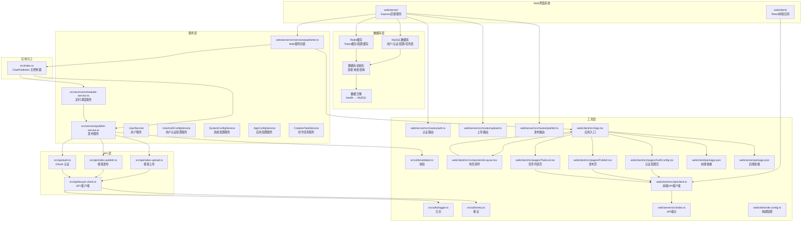

**图表来源**
- [src/index.ts:1-248](file://src/index.ts#L1-L248)
- [web/client/src/App.tsx:1-38](file://web/client/src/App.tsx#L1-L38)
- [web/server/src/index.ts:1-42](file://web/server/src/index.ts#L1-L42)
- [web/server/src/services/publisher.ts:1-136](file://web/server/src/services/publisher.ts#L1-L136)
- [web/client/src/api/client.ts:1-92](file://web/client/src/api/client.ts#L1-L92)
- [web/server/src/routes/auth.ts:1-119](file://web/server/src/routes/auth.ts#L1-L119)
- [web/server/src/routes/upload.ts:1-106](file://web/server/src/routes/upload.ts#L1-L106)
- [web/server/src/routes/publish.ts:1-123](file://web/server/src/routes/publish.ts#L1-L123)
- [web/server/src/database/index.ts:1-164](file://web/server/src/database/index.ts#L1-L164)
- [web/server/src/database/schema.sql:1-79](file://web/server/src/database/schema.sql#L1-L79)
- [web/server/src/database/migrate-from-lowdb.ts:1-368](file://web/server/src/database/migrate-from-lowdb.ts#L1-L368)

**章节来源**
- [README.md:92-105](file://README.md#L92-L105)
- [tsconfig.json:1-20](file://tsconfig.json#L1-L20)
- [web/client/package.json:1-32](file://web/client/package.json#L1-L32)
- [web/server/package.json:1-37](file://web/server/package.json#L1-L37)

## 核心组件
- ClawPublisher（主控制器）
  - 职责：对外提供统一 API；聚合认证、上传、发布与定时调度能力；封装业务流程；提供生命周期控制（停止）
  - 关键接口：授权、上传、发布、定时发布、状态查询、删除、停止
- **Web服务器（新增）**
  - 职责：作为API网关，提供RESTful接口；封装ClawPublisher功能；处理文件上传和定时任务管理
  - 关键接口：认证配置、视频上传、视频发布、任务管理、健康检查
- **Web前端应用（新增）**
  - 职责：提供图形化界面；管理用户交互；调用Web服务器API；展示认证状态和发布结果
  - 关键功能：认证配置、视频发布、任务管理、实时进度显示
- **数据库连接层（新增）**
  - 职责：管理MySQL连接池和Redis客户端；提供统一的数据访问接口；支持数据迁移
  - 关键功能：连接池管理、表结构初始化、默认数据创建、优雅关闭
- **UserService（新增）**
  - 职责：用户账户管理；密码哈希；用户信息查询与更新
  - 关键功能：用户创建、登录验证、信息更新、OAuth用户处理
- **UserAuthConfigService（新增）**
  - 职责：用户抖音认证配置管理；Token缓存；有效性检查
  - 关键功能：配置CRUD、Token缓存、Redis集成、有效性检查
- **SystemConfigService（新增）**
  - 职责：系统配置管理；内存缓存；Redis缓存；环境变量同步
  - 关键功能：配置读写、缓存同步、脱敏显示、TTL管理
- **DouyinClient（API 客户端）**
  - 职责：基于 axios 的 HTTP 客户端，统一封装请求/响应拦截、错误处理、重试机制与 access_token 注入
- **DouyinAuth（认证模块）**
  - 职责：OAuth 授权 URL 生成、授权码换 Token、刷新 Token、Token 有效性检查与自动刷新
- **PublishService（发布服务）**
  - 职责：业务编排层，负责参数校验、上传与发布的串联、远程下载发布、状态查询与删除
- **SchedulerService（定时调度服务）**
  - 职责：基于 node-cron 的定时任务注册、执行、取消、查询与清理
- **工具模块**
  - 日志：基于 winston 的结构化日志输出
  - 重试：指数退避重试策略
  - 校验：视频文件格式/大小与发布选项（标题、描述、hashtag、定时发布时间）校验

**章节来源**
- [src/index.ts:29-244](file://src/index.ts#L29-L244)
- [web/server/src/services/publisher.ts:1-136](file://web/server/src/services/publisher.ts#L1-L136)
- [web/client/src/App.tsx:1-38](file://web/client/src/App.tsx#L1-L38)
- [web/server/src/database/index.ts:1-164](file://web/server/src/database/index.ts#L1-L164)
- [web/server/src/services/user-service.ts:1-264](file://web/server/src/services/user-service.ts#L1-L264)
- [web/server/src/services/user-auth-config-service.ts:1-200](file://web/server/src/services/user-auth-config-service.ts#L1-L200)
- [web/server/src/services/system-config-service.ts:1-280](file://web/server/src/services/system-config-service.ts#L1-L280)
- [src/api/douyin-client.ts:13-237](file://src/api/douyin-client.ts#L13-L237)
- [src/api/auth.ts:29-190](file://src/api/auth.ts#L29-L190)
- [src/services/publish-service.ts:22-228](file://src/services/publish-service.ts#L22-L228)
- [src/services/scheduler-service.ts:23-202](file://src/services/scheduler-service.ts#L23-L202)
- [src/utils/logger.ts:31-61](file://src/utils/logger.ts#L31-L61)
- [src/utils/retry.ts:41-84](file://src/utils/retry.ts#L41-L84)
- [src/utils/validator.ts:22-116](file://src/utils/validator.ts#L22-L116)

## 架构总览
系统采用"主控制器 + 分层 API + 服务编排 + 工具支撑 + Web界面 + 数据库层"的架构模式，强调：
- 分层解耦：API 层只做 HTTP 通信与错误处理；服务层负责业务流程；工具层提供横切关注点；数据库层提供数据持久化
- 模块内聚：每个模块聚焦单一职责，接口清晰
- 可扩展性：新增业务可通过服务层编排，无需侵入 API 层
- 可观测性：统一日志与错误类型，便于定位问题
- 可靠性：内置重试与限流判断，提升对外部 API 的鲁棒性
- **数据库集成**：MySQL提供结构化数据存储，Redis提供高性能缓存，支持Token和配置的快速访问
- **Web集成**：前端React应用通过Express后端服务访问核心业务功能，提供完整的图形化界面

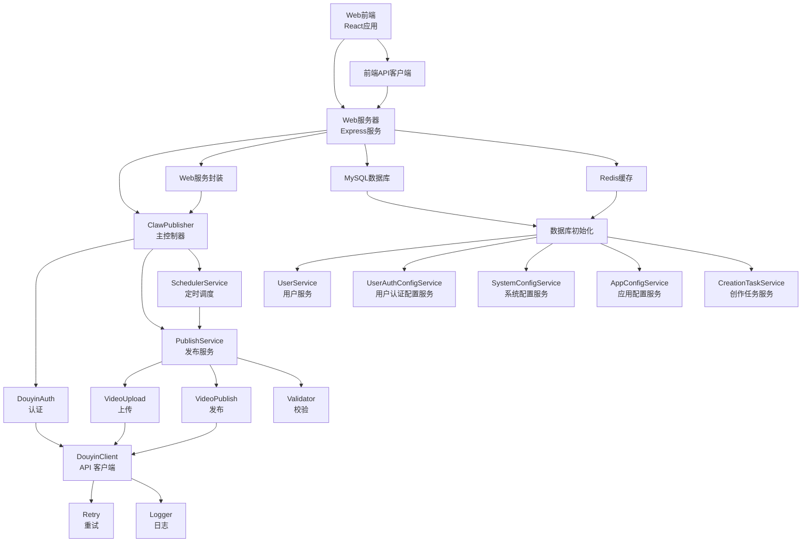

**图表来源**
- [src/index.ts:29-244](file://src/index.ts#L29-L244)
- [web/server/src/services/publisher.ts:1-136](file://web/server/src/services/publisher.ts#L1-L136)
- [web/client/src/api/client.ts:1-92](file://web/client/src/api/client.ts#L1-L92)
- [web/server/src/index.ts:1-42](file://web/server/src/index.ts#L1-L42)
- [web/server/src/database/index.ts:1-164](file://web/server/src/database/index.ts#L1-L164)

## 数据库架构

**更新** 系统采用MySQL + Redis双存储架构，替代原有的文件存储方案，提供更可靠的数据持久化和缓存支持。

### MySQL数据库设计
系统使用MySQL作为主要数据存储，采用utf8mb4字符集，支持完整的emoji表情和多字节字符。

#### 核心表结构
- **users表**：用户账户信息，支持用户名、邮箱、密码哈希、角色权限等
- **user_auth_configs表**：用户抖音认证配置，存储Client Key、Secret、Token等
- **creation_tasks表**：创作任务草稿和历史记录，支持JSON格式的内容存储
- **creation_templates表**：内容模板管理，支持标签和使用统计
- **app_config表**：系统配置信息，采用键值对存储JSON配置

#### 数据库连接与初始化
- **连接池管理**：使用mysql2/promise的连接池，支持并发连接和自动重连
- **连接配置**：支持环境变量配置，包括主机、端口、用户名、密码、数据库名
- **表结构初始化**：启动时自动执行schema.sql创建表结构
- **默认数据**：首次启动自动创建管理员账户

### Redis缓存策略
系统使用Redis提供高性能缓存，主要用于Token和配置信息的快速访问。

#### 缓存键设计
- **用户Token缓存**：`token:user:{userId}`，TTL由Token过期时间决定
- **系统配置缓存**：`config:ai`、`config:douyin`，TTL 5分钟
- **缓存失效**：基于Token过期时间和配置更新时间自动失效

#### 缓存策略
- **读写分离**：Redis作为缓存层，MySQL作为持久化层
- **降级处理**：Redis不可用时自动降级到MySQL
- **一致性保证**：写操作同时更新MySQL和Redis，确保数据一致性

### 数据迁移
系统提供从lowdb到MySQL的完整数据迁移脚本，支持一键迁移现有数据。

#### 迁移流程
- **数据读取**：从db.json读取现有数据
- **连接建立**：建立MySQL连接并开始事务
- **表结构**：执行schema.sql创建表结构
- **数据迁移**：逐条迁移用户、认证配置、创作任务、模板和配置
- **事务提交**：成功后提交事务，失败自动回滚

**章节来源**
- [web/server/src/database/index.ts:1-164](file://web/server/src/database/index.ts#L1-L164)
- [web/server/src/database/schema.sql:1-79](file://web/server/src/database/schema.sql#L1-L79)
- [web/server/src/database/migrate-from-lowdb.ts:1-368](file://web/server/src/database/migrate-from-lowdb.ts#L1-L368)

## Web界面系统
**新增** Web界面系统提供完整的图形化操作界面，包含三个核心功能模块：

### 前端架构
- **React应用**：基于Vite构建，使用Ant Design组件库
- **路由管理**：单页应用（SPA），支持页面切换
- **状态管理**：React Hooks管理组件状态
- **API通信**：Axios客户端封装RESTful API调用
- **UI组件**：Ant Design提供丰富的UI组件和样式

### 后端架构
- **Express服务**：提供RESTful API接口
- **中间件**：CORS跨域支持、JSON解析、静态文件服务
- **文件上传**：Multer处理multipart/form-data
- **路由分层**：认证路由、上传路由、发布路由
- **服务封装**：将ClawPublisher功能封装为Web服务
- **数据库集成**：MySQL + Redis双存储架构

### 部署架构
- **前端部署**：构建后的静态文件部署到Nginx或其他Web服务器
- **后端部署**：Express服务独立运行，监听3001端口
- **数据库部署**：MySQL和Redis服务独立部署，支持集群模式
- **环境配置**：通过.env文件配置数据库连接和Redis连接

**章节来源**
- [web/client/src/App.tsx:1-38](file://web/client/src/App.tsx#L1-L38)
- [web/server/src/index.ts:1-42](file://web/server/src/index.ts#L1-L42)
- [web/client/package.json:1-32](file://web/client/package.json#L1-L32)
- [web/server/package.json:1-37](file://web/server/package.json#L1-L37)

## 详细组件分析

### 组件一：ClawPublisher 主控制器
- 设计要点
  - 组合依赖：持有 DouyinClient、DouyinAuth、PublishService、SchedulerService
  - 生命周期：构造时初始化，stop() 停止所有定时任务
  - 接口分层：认证、上传、发布、定时发布、状态查询、删除、停止
- 数据与控制流
  - 外部调用通过主控制器进入，主控制器再委派给具体服务或模块
  - 认证信息可预置，支持后续刷新与有效性检查
- 扩展建议
  - 可增加事件总线或中间件钩子，便于接入审计、监控与链路追踪

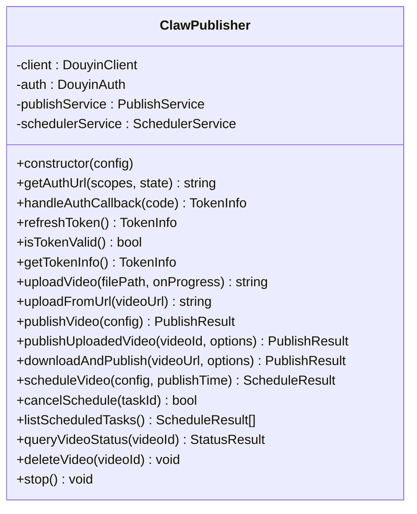

**图表来源**
- [src/index.ts:29-244](file://src/index.ts#L29-L244)

**章节来源**
- [src/index.ts:29-244](file://src/index.ts#L29-L244)

### 组件二：DouyinClient API 客户端
- 设计要点
  - 基于 axios 创建实例，统一设置基础 URL、超时与 Content-Type
  - 请求拦截：自动注入 access_token
  - 响应拦截：解析抖音 API 错误码并抛出自定义异常
  - 重试策略：结合 withRetry 与 shouldRetry（针对限流与网络错误）
- 关键接口
  - get/post/postForm：封装不同场景的请求方法
  - shouldRetry：识别限流与网络错误进行指数退避重试
- 错误处理
  - 抖音 API 错误与 HTTP 错误分别处理，抛出 DouyinApiException

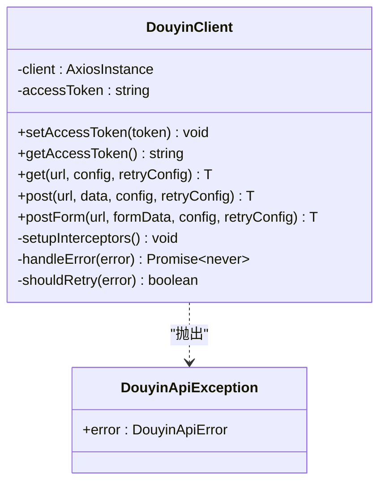

**图表来源**
- [src/api/douyin-client.ts:13-237](file://src/api/douyin-client.ts#L13-L237)

**章节来源**
- [src/api/douyin-client.ts:13-237](file://src/api/douyin-client.ts#L13-L237)

### 组件三：DouyinAuth 认证模块
- 设计要点
  - OAuth 授权 URL 生成，支持自定义 scopes 与 state
  - 授权码换 Token、刷新 Token、Token 有效期检查与自动刷新
  - Token 信息持久化与恢复（setTokenInfo）
- 关键接口
  - getAuthorizationUrl、getAccessToken、refreshAccessToken、ensureTokenValid、isTokenValid
- 安全与可靠性
  - Token 过期缓冲时间、错误日志记录、失败重试由上层重试机制兜底

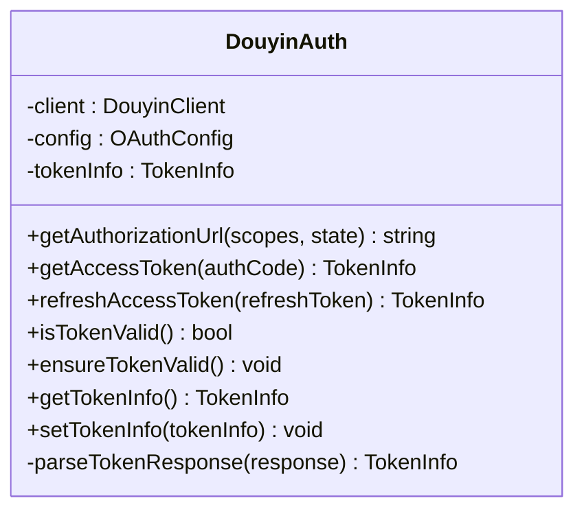

**图表来源**
- [src/api/auth.ts:29-190](file://src/api/auth.ts#L29-L190)

**章节来源**
- [src/api/auth.ts:29-190](file://src/api/auth.ts#L29-L190)

### 组件四：PublishService 发布服务
- 设计要点
  - 业务编排：参数校验 -> 上传（本地/URL）-> 发布 -> 结果封装
  - 支持下载远程视频后发布（含临时文件清理）
  - 状态查询与删除
- 关键流程
  - publishVideo：一站式发布（上传+发布）
  - publishUploadedVideo：对已上传视频进行发布
  - downloadAndPublish：下载->校验->发布
- 与工具层协作
  - 校验器：validateVideoFile、validatePublishOptions
  - 日志：结构化日志输出
  - 重试：由底层 API 客户端统一处理

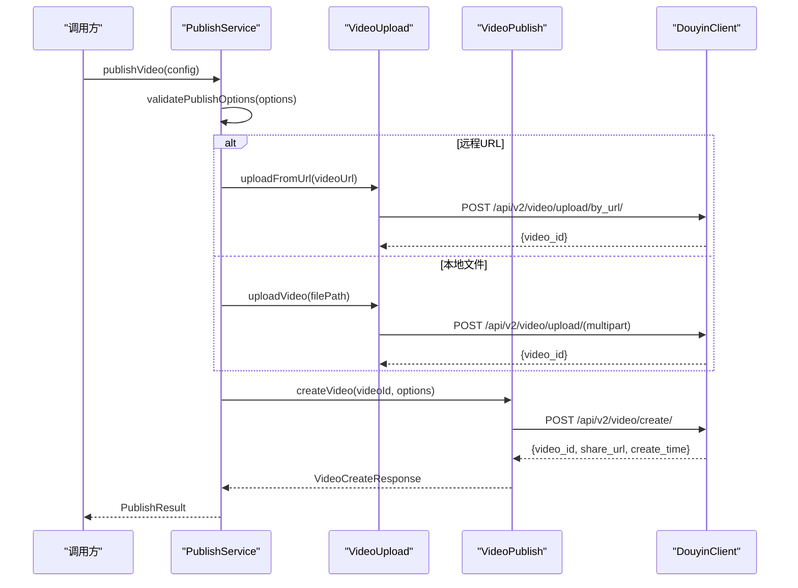

**图表来源**
- [src/services/publish-service.ts:38-80](file://src/services/publish-service.ts#L38-L80)
- [src/api/video-upload.ts:220-237](file://src/api/video-upload.ts#L220-L237)
- [src/api/video-publish.ts:30-54](file://src/api/video-publish.ts#L30-L54)
- [src/api/douyin-client.ts:149-166](file://src/api/douyin-client.ts#L149-L166)

**章节来源**
- [src/services/publish-service.ts:22-228](file://src/services/publish-service.ts#L22-L228)
- [src/api/video-upload.ts:20-241](file://src/api/video-upload.ts#L20-L241)
- [src/api/video-publish.ts:15-174](file://src/api/video-publish.ts#L15-L174)

### 组件五：SchedulerService 定时调度服务
- 设计要点
  - 基于 node-cron 的任务注册与执行
  - 任务状态管理：pending/completed/failed/cancelled
  - 任务清理：完成后自动清理
- 关键接口
  - schedulePublish、cancelSchedule、listScheduledTasks、getTask、stopAll
- 时间策略
  - 将 Date 转换为 cron 表达式（分钟/小时/日/月）

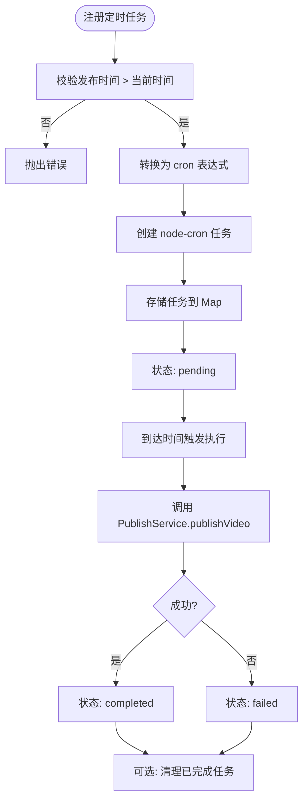

**图表来源**
- [src/services/scheduler-service.ts:37-72](file://src/services/scheduler-service.ts#L37-L72)
- [src/services/scheduler-service.ts:140-162](file://src/services/scheduler-service.ts#L140-L162)
- [src/services/scheduler-service.ts:169-176](file://src/services/scheduler-service.ts#L169-L176)

**章节来源**
- [src/services/scheduler-service.ts:23-202](file://src/services/scheduler-service.ts#L23-L202)

### 组件六：工具层（日志、重试、校验）
- 日志：winston 结构化日志，支持控制台与文件输出，可配置日志级别
- 重试：指数退避延迟、最大重试次数、自定义 shouldRetry 条件
- 校验：视频格式/大小、标题/描述长度、hashtag 数量、定时发布时间范围

**章节来源**
- [src/utils/logger.ts:31-61](file://src/utils/logger.ts#L31-L61)
- [src/utils/retry.ts:41-84](file://src/utils/retry.ts#L41-L84)
- [src/utils/validator.ts:22-116](file://src/utils/validator.ts#L22-L116)

### 组件七：UserService 用户服务（新增）
- 设计要点
  - **用户管理**：用户创建、查询、更新、密码验证
  - **密码安全**：bcrypt哈希加密，防止明文存储
  - **账户验证**：用户名、邮箱唯一性检查
  - **OAuth集成**：支持抖音OAuth登录和用户信息同步
- 关键功能
  - **用户创建**：验证输入格式，生成随机用户名和密码
  - **登录验证**：用户名或邮箱登录，密码验证
  - **信息更新**：动态更新用户信息，支持唯一性约束
  - **OAuth处理**：根据抖音用户信息创建或更新本地用户

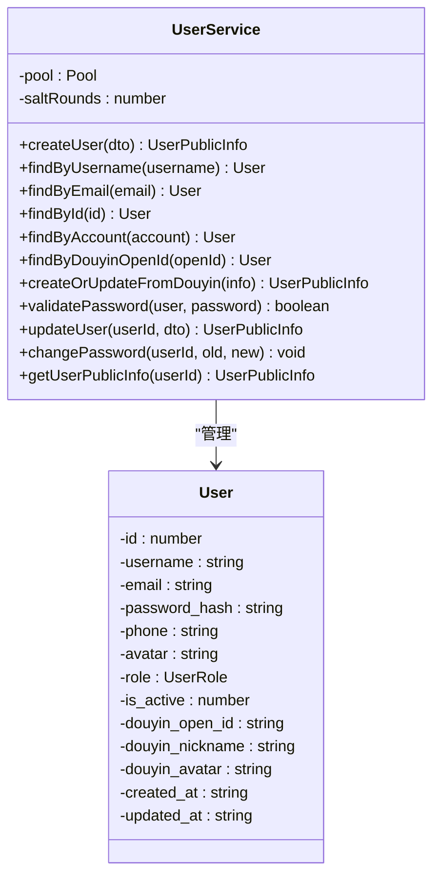

**图表来源**
- [web/server/src/services/user-service.ts:1-264](file://web/server/src/services/user-service.ts#L1-L264)
- [web/server/src/models/user.ts:1-131](file://web/server/src/models/user.ts#L1-L131)

**章节来源**
- [web/server/src/services/user-service.ts:1-264](file://web/server/src/services/user-service.ts#L1-L264)
- [web/server/src/models/user.ts:1-131](file://web/server/src/models/user.ts#L1-L131)

### 组件八：UserAuthConfigService 用户认证配置服务（新增）
- 设计要点
  - **配置管理**：用户抖音认证配置的CRUD操作
  - **Redis缓存**：Token信息缓存，提高有效性检查性能
  - **降级处理**：Redis不可用时自动降级到MySQL
  - **TTL管理**：基于Token过期时间设置缓存过期
- 关键功能
  - **配置CRUD**：创建、更新、查询用户认证配置
  - **Token缓存**：将有效Token写入Redis，设置合适TTL
  - **有效性检查**：优先检查Redis缓存，然后MySQL
  - **状态查询**：返回认证配置状态和Token信息

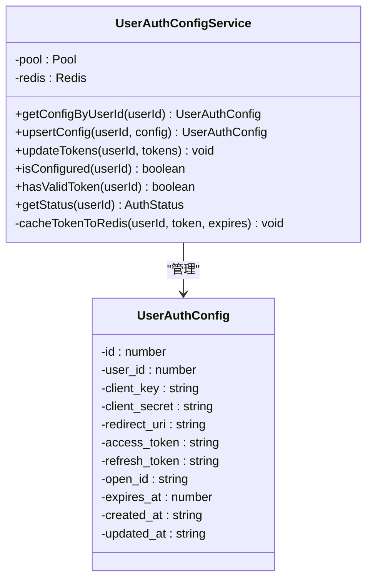

**图表来源**
- [web/server/src/services/user-auth-config-service.ts:1-200](file://web/server/src/services/user-auth-config-service.ts#L1-L200)

**章节来源**
- [web/server/src/services/user-auth-config-service.ts:1-200](file://web/server/src/services/user-auth-config-service.ts#L1-L200)

### 组件九：SystemConfigService 系统配置服务（新增）
- 设计要点
  - **内存缓存**：配置信息存储在内存中，提供快速读取
  - **Redis缓存**：配置信息同时缓存到Redis，支持分布式共享
  - **脱敏显示**：敏感信息在前端显示时进行脱敏处理
  - **环境变量同步**：配置更新时同步到进程环境变量
- 关键功能
  - **配置读写**：提供同步读取和异步写入接口
  - **缓存同步**：MySQL和Redis双向同步
  - **TTL管理**：配置缓存设置5分钟TTL
  - **脱敏接口**：提供前端友好的脱敏配置信息

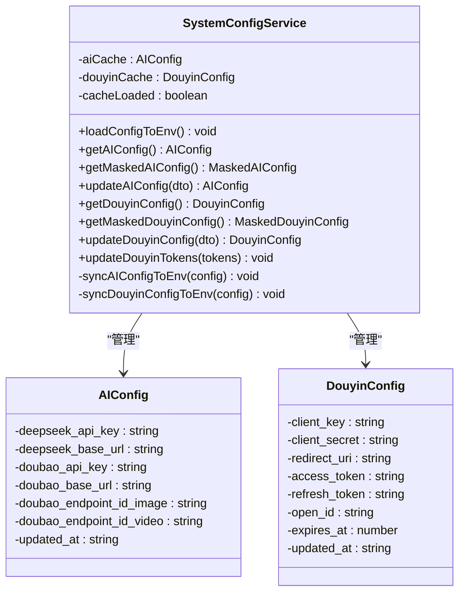

**图表来源**
- [web/server/src/services/system-config-service.ts:1-280](file://web/server/src/services/system-config-service.ts#L1-L280)

**章节来源**
- [web/server/src/services/system-config-service.ts:1-280](file://web/server/src/services/system-config-service.ts#L1-L280)

## Web界面详细组件分析

### 组件十：Web服务器（新增）
- 设计要点
  - **Express应用**：基于Express框架，提供RESTful API服务
  - **中间件集成**：CORS跨域、JSON解析、静态文件服务
  - **路由分层**：认证路由、上传路由、发布路由清晰分离
  - **服务封装**：将ClawPublisher功能封装为Web服务接口
  - **数据库集成**：集成MySQL + Redis数据库连接层
- 关键接口
  - **认证接口**：状态查询、配置保存、授权URL获取、回调处理、Token刷新
  - **上传接口**：文件上传、URL上传
  - **发布接口**：立即发布、定时发布、任务管理
  - **健康检查**：系统状态监控
- 错误处理
  - 统一错误处理中间件，标准化错误响应格式

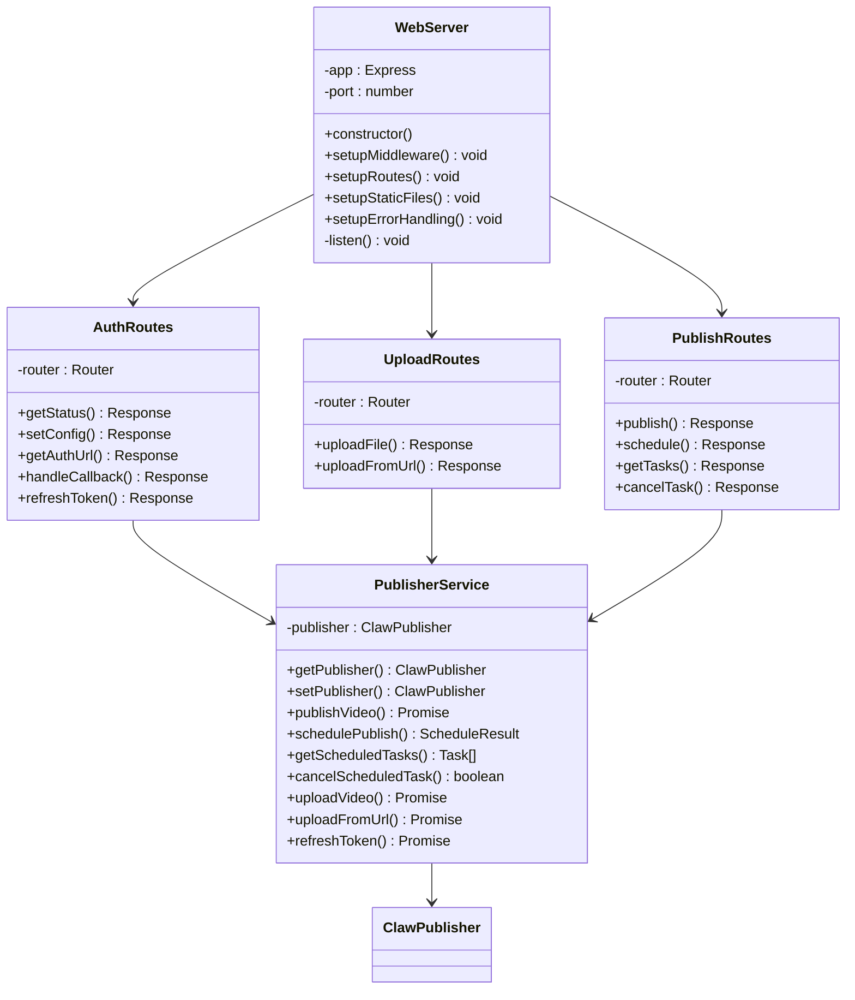

**图表来源**
- [web/server/src/index.ts:1-42](file://web/server/src/index.ts#L1-L42)
- [web/server/src/routes/auth.ts:1-119](file://web/server/src/routes/auth.ts#L1-L119)
- [web/server/src/routes/upload.ts:1-106](file://web/server/src/routes/upload.ts#L1-L106)
- [web/server/src/routes/publish.ts:1-123](file://web/server/src/routes/publish.ts#L1-L123)
- [web/server/src/services/publisher.ts:1-136](file://web/server/src/services/publisher.ts#L1-L136)

**章节来源**
- [web/server/src/index.ts:1-42](file://web/server/src/index.ts#L1-L42)
- [web/server/src/routes/auth.ts:1-119](file://web/server/src/routes/auth.ts#L1-L119)
- [web/server/src/routes/upload.ts:1-106](file://web/server/src/routes/upload.ts#L1-L106)
- [web/server/src/routes/publish.ts:1-123](file://web/server/src/routes/publish.ts#L1-L123)
- [web/server/src/services/publisher.ts:1-136](file://web/server/src/services/publisher.ts#L1-L136)

### 组件十一：前端API客户端（新增）
- 设计要点
  - **Axios封装**：统一的API客户端，设置基础URL和超时
  - **认证API**：状态查询、配置保存、授权URL获取、回调处理、Token刷新
  - **上传API**：文件上传、URL上传
  - **发布API**：立即发布、定时发布、任务管理
  - **进度回调**：支持上传进度实时反馈
- 关键功能
  - **认证管理**：OAuth授权流程的前端实现
  - **文件上传**：支持拖拽上传和进度显示
  - **发布管理**：标题、描述、标签、位置信息等发布选项
  - **任务监控**：定时任务状态实时更新

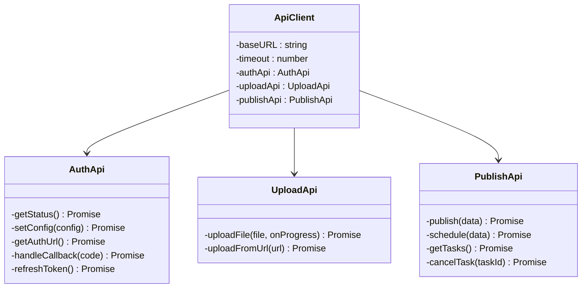

**图表来源**
- [web/client/src/api/client.ts:1-92](file://web/client/src/api/client.ts#L1-L92)

**章节来源**
- [web/client/src/api/client.ts:1-92](file://web/client/src/api/client.ts#L1-L92)

### 组件十二：认证配置页面（新增）
- 设计要点
  - **状态展示**：实时显示认证状态和Token信息
  - **配置表单**：Client Key、Client Secret、Redirect URI等配置项
  - **OAuth流程**：授权链接生成、授权码输入、Token刷新
  - **表单验证**：必填字段验证和格式检查
- 关键功能
  - **状态监控**：初始化状态、Token有效性检查
  - **配置管理**：保存配置信息，支持Token预填
  - **授权流程**：完整的OAuth 2.0授权流程实现
  - **用户体验**：友好的错误提示和成功反馈

**章节来源**
- [web/client/src/pages/AuthConfig.tsx:1-277](file://web/client/src/pages/AuthConfig.tsx#L1-L277)

### 组件十三：视频发布页面（新增）
- 设计要点
  - **文件上传**：拖拽上传、进度显示、格式限制
  - **URL上传**：支持远程视频URL直接发布
  - **发布选项**：标题、描述、话题标签、@提及用户
  - **位置信息**：POI ID和位置名称配置
  - **商业挂载**：小程序和商品链接配置
  - **发布设置**：立即发布和定时发布模式切换
- 关键功能
  - **多模式上传**：本地文件和远程URL两种上传方式
  - **标签管理**：最多5个话题标签，支持添加和删除
  - **定时发布**：日期时间选择器，支持未来时间发布
  - **结果展示**：发布成功后的视频ID和分享链接
  - **进度反馈**：上传进度实时显示

**章节来源**
- [web/client/src/pages/Publish.tsx:1-368](file://web/client/src/pages/Publish.tsx#L1-L368)

### 组件十四：任务管理页面（新增）
- 设计要点
  - **任务列表**：表格形式展示所有定时任务
  - **状态统计**：各状态任务数量的徽章显示
  - **自动刷新**：每30秒自动更新任务状态
  - **操作功能**：取消任务、刷新列表
  - **筛选排序**：支持按状态筛选和时间排序
- 关键功能
  - **状态管理**：待执行、已完成、失败、已取消四种状态
  - **实时监控**：WebSocket连接实现实时状态更新
  - **批量操作**：一键刷新任务列表
  - **可视化展示**：状态标签和图标增强可读性

**章节来源**
- [web/client/src/pages/TaskList.tsx:1-225](file://web/client/src/pages/TaskList.tsx#L1-L225)

## 依赖分析
- 外部依赖
  - axios：HTTP 客户端，统一请求/响应处理与重试
  - node-cron：定时任务调度
  - winston：结构化日志
  - form-data：multipart/form-data 上传
  - dotenv：环境变量加载
  - **数据库依赖**：mysql2（MySQL驱动）、ioredis（Redis客户端）
  - **Web前端依赖**：React、Ant Design、Day.js、Axios
  - **Web后端依赖**：Express、Multer、CORS
- 内部依赖
  - API 层依赖配置与工具层
  - 服务层依赖 API 层与工具层
  - 主控制器聚合服务层与工具层
  - **Web服务**：Express路由依赖ClawPublisher服务
  - **数据库服务**：UserService、UserAuthConfigService、SystemConfigService等

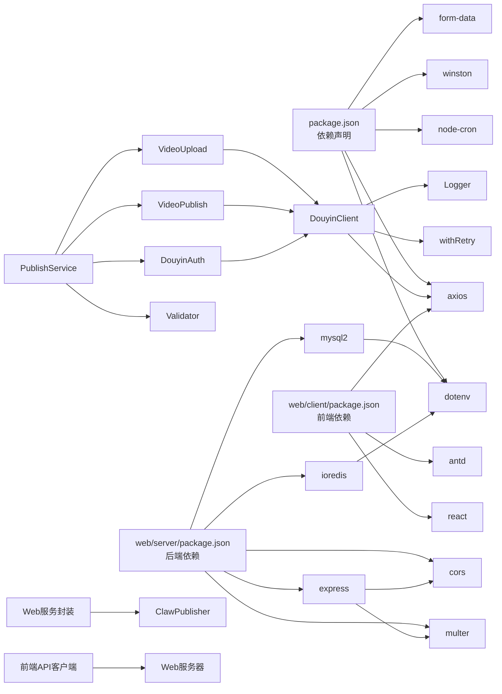

**图表来源**
- [package.json:14-29](file://package.json#L14-L29)
- [web/client/package.json:12-30](file://web/client/package.json#L12-L30)
- [web/server/package.json:12-37](file://web/server/package.json#L12-L37)
- [src/api/douyin-client.ts:1-7](file://src/api/douyin-client.ts#L1-L7)
- [src/services/publish-service.ts:1-12](file://src/services/publish-service.ts#L1-L12)

**章节来源**
- [package.json:14-29](file://package.json#L14-L29)
- [web/client/package.json:12-30](file://web/client/package.json#L12-L30)
- [web/server/package.json:12-37](file://web/server/package.json#L12-L37)

## 性能考虑
- 上传策略
  - 小于阈值（128MB）走直传，减少复杂度
  - 大于阈值走分片上传，支持断点续传与进度回调
- 重试与限流
  - 针对限流与网络错误进行指数退避重试，避免雪崩
- 并发与资源
  - 分片上传按顺序逐片提交，避免并发竞争；如需提升吞吐可在更高层引入并发队列
- I/O 优化
  - 上传进度回调与日志输出需避免阻塞主线程
- 定时任务
  - cron 表达式与时区固定，避免跨时区误差；任务清理降低内存占用
- **数据库性能**
  - **MySQL连接池**：10个连接限制，支持并发查询和自动重连
  - **Redis缓存**：Token和配置缓存，TTL管理，降级处理
  - **索引优化**：users表唯一索引，creation_tasks表复合索引
  - **查询优化**：分页查询、条件过滤、批量操作
- **Web界面性能**
  - **前端优化**：React组件懒加载、虚拟滚动、图片压缩
  - **后端优化**：Multer文件上传限制、CORS配置优化、静态文件缓存
  - **数据库优化**：连接池管理、缓存策略、查询优化
  - **网络优化**：CDN加速静态资源、gzip压缩、HTTP/2支持

## 故障排查指南
- 常见问题与定位
  - 认证失败：检查 clientKey/clientSecret/redirectUri 与 Token 有效性；确认 isTokenValid 与 ensureTokenValid 的调用
  - 上传失败：查看分片上传初始化、分片提交与完成阶段的日志；核对文件大小/格式与配置阈值
  - 发布失败：检查发布选项长度与 hashtag 数量；核对定时发布时间范围
  - 定时任务未执行：确认 cron 表达式与时间戳转换；检查任务状态与清理逻辑
  - **数据库连接失败**：检查MySQL和Redis连接配置，确认服务正常运行
  - **缓存失效**：检查Redis连接状态，确认Token和配置缓存正常
  - **Web界面问题**：检查前后端通信、CORS配置、静态文件服务
- 日志与错误
  - 使用统一日志模块输出结构化日志，结合 LOG_LEVEL 控制输出级别
  - API 客户端抛出 DouyinApiException，包含抖音错误码与消息
  - **数据库错误**：MySQL连接错误、Redis连接错误、SQL执行错误
  - **Web服务器**：Express错误处理中间件统一处理异常
- 重试与退避
  - 若仍失败，检查 shouldRetry 条件与最大重试次数；必要时调整基础延迟与最大延迟
- **数据库调试**
  - **MySQL调试**：检查连接池状态、表结构完整性、索引使用情况
  - **Redis调试**：检查连接状态、缓存键值、TTL设置、内存使用
  - **迁移调试**：检查数据迁移脚本执行状态、事务回滚、错误日志
- **Web界面调试**
  - **前端调试**：React DevTools检查组件状态、Network面板查看API调用
  - **后端调试**：Express日志查看请求处理、Multer文件上传日志
  - **数据库调试**：检查用户认证状态、Token缓存、配置同步

**章节来源**
- [src/api/douyin-client.ts:97-116](file://src/api/douyin-client.ts#L97-L116)
- [src/utils/logger.ts:31-61](file://src/utils/logger.ts#L31-L61)
- [src/utils/retry.ts:41-84](file://src/utils/retry.ts#L41-L84)
- [src/utils/validator.ts:45-86](file://src/utils/validator.ts#L45-L86)
- [web/server/src/index.ts:29-36](file://web/server/src/index.ts#L29-L36)
- [web/server/src/database/index.ts:139-161](file://web/server/src/database/index.ts#L139-L161)

## 结论
ClawOperations 通过清晰的分层与模块化设计，实现了从认证、上传、发布到定时调度的完整闭环。**更新** 新增的Web界面系统进一步提升了用户体验，提供了完整的图形化操作界面。**数据库架构变更** 采用MySQL + Redis双存储架构，替代原有的文件存储方案，提供更可靠的数据持久化和缓存支持。系统具备良好的扩展性与可维护性，适合在企业级营销场景中规模化落地。

**未来演进方向**：
- **Web界面增强**：支持WebSocket实现实时状态更新、任务监控
- **部署优化**：Docker容器化部署、Kubernetes集群管理
- **监控告警**：集成Prometheus指标监控、日志聚合分析
- **安全加固**：OAuth 2.0安全认证、API限流防护、数据加密传输
- **功能扩展**：多账号管理、批量发布、数据分析报表
- **数据库优化**：支持MySQL集群、Redis哨兵模式、读写分离
- **缓存策略**：多级缓存、缓存预热、缓存一致性保证

## 附录
- **技术栈选择说明**
  - TypeScript：强类型保障与更好的 IDE 支持，便于大型项目维护
  - Node.js：适合 I/O 密集型任务（HTTP、文件上传、定时任务）
  - axios：成熟稳定的 HTTP 客户端，易于扩展拦截器与重试
  - winston：结构化日志，便于生产环境问题定位
  - node-cron：轻量定时任务调度，满足日常发布节奏
  - form-data：原生 multipart/form-data 支持，适配抖音上传接口
  - **React**：现代前端框架，提供优秀的用户体验和组件化开发
  - **Express**：轻量级Web应用框架，适合快速开发RESTful API
  - **Ant Design**：企业级UI设计语言，提供丰富的组件库
  - **Vite**：现代化构建工具，提供快速的开发体验
  - **MySQL**：关系型数据库，提供ACID事务和数据一致性
  - **Redis**：高性能缓存数据库，支持多种数据结构和持久化
  - **bcryptjs**：密码哈希算法，提供安全的密码存储
  - **ioredis**：Redis客户端，支持Promise和连接池
  - **mysql2**：MySQL驱动，支持Promise和连接池
- **部署与运行**
  - **核心系统**：使用 tsc 生成 dist，npm run start 启动
  - **Web前端**：npm run build 构建静态文件，部署到Web服务器
  - **Web后端**：npm run build 构建，npm run start 启动服务
  - **数据库部署**：MySQL和Redis独立部署，支持集群模式
  - **开发环境**：前端 npm run dev，后端 npm run dev
  - **测试**：使用 jest 进行单元测试
  - **数据迁移**：npm run migrate 执行从lowdb到MySQL的数据迁移
- **开发与调试**
  - 使用 ts-node 在开发环境下直接运行源码
  - 通过 LOG_LEVEL 调整日志级别
  - 在 CI 中使用 lint 与 test 脚本保证质量
  - **Web开发**：Vite热重载开发模式，支持TypeScript和React开发
  - **数据库开发**：支持MySQL和Redis本地开发环境
  - **调试工具**：React DevTools、Express调试器、浏览器开发者工具、数据库客户端
- **数据库配置**
  - **MySQL配置**：DB_HOST、DB_PORT、DB_USER、DB_PASS、DB_NAME
  - **Redis配置**：REDIS_URL
  - **连接池**：MySQL连接池大小10，Redis连接延迟重试
  - **字符集**：MySQL utf8mb4，支持完整emoji和多字节字符

**章节来源**
- [package.json:7-12](file://package.json#L7-L12)
- [tsconfig.json:1-20](file://tsconfig.json#L1-L20)
- [README.md:31-63](file://README.md#L31-L63)
- [web/client/package.json:12-30](file://web/client/package.json#L12-L30)
- [web/server/package.json:12-37](file://web/server/package.json#L12-L37)
- [web/client/vite.config.ts:1-8](file://web/client/vite.config.ts#L1-L8)
- [web/server/src/database/index.ts:95-134](file://web/server/src/database/index.ts#L95-L134)