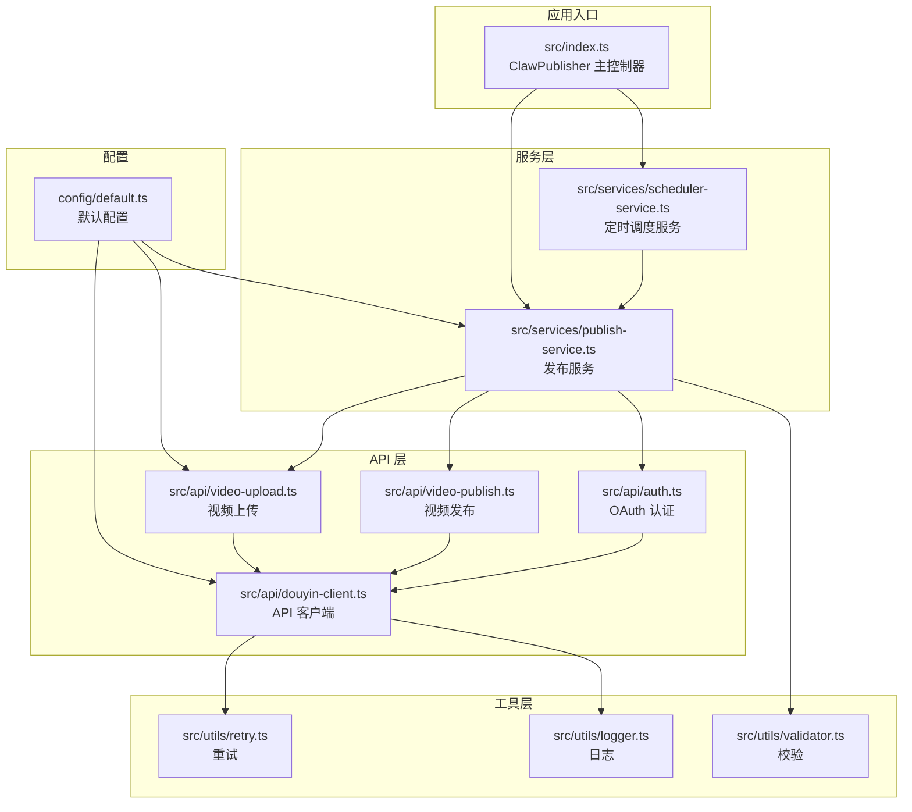
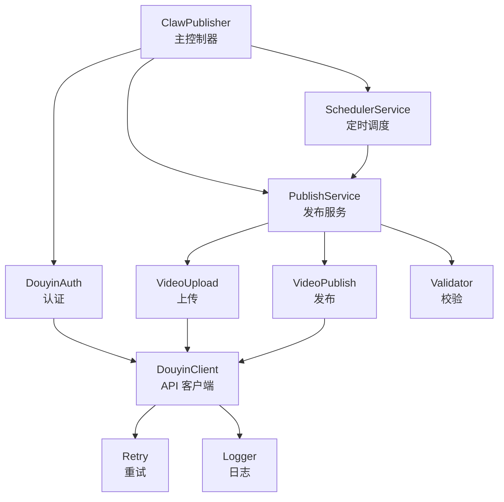
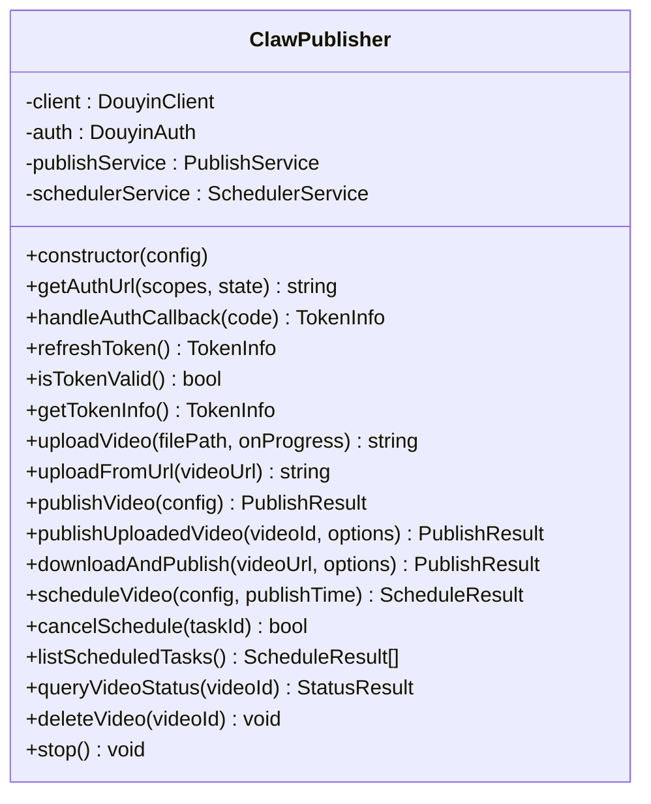
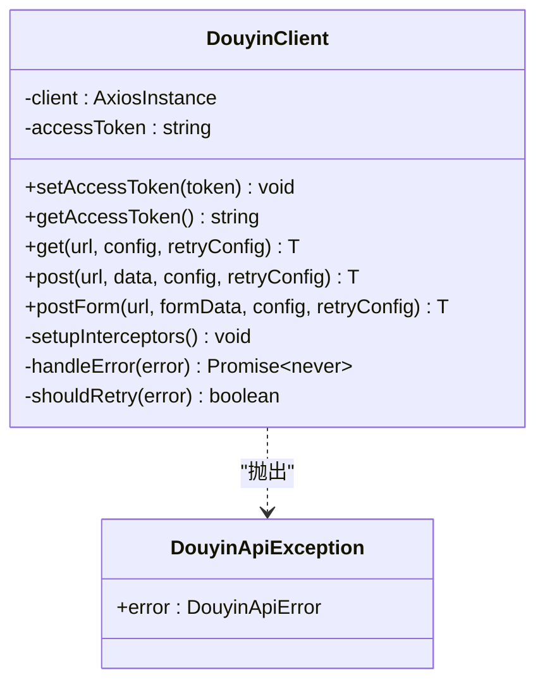
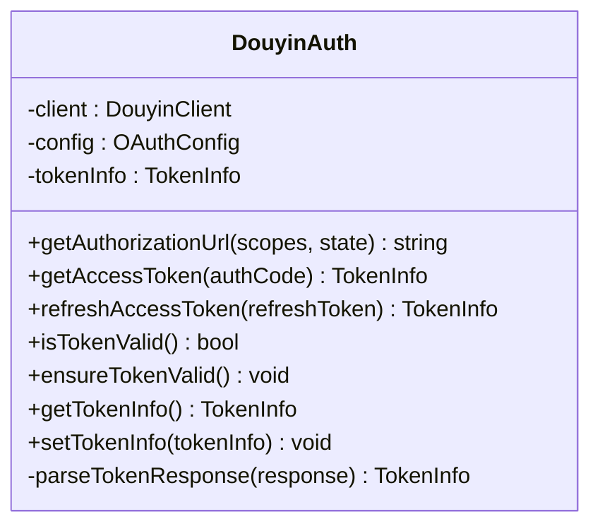
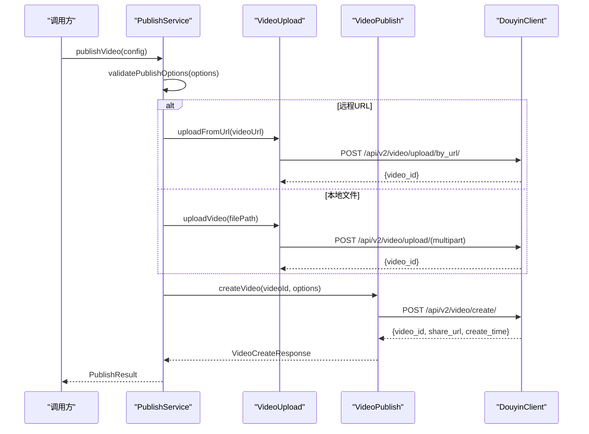
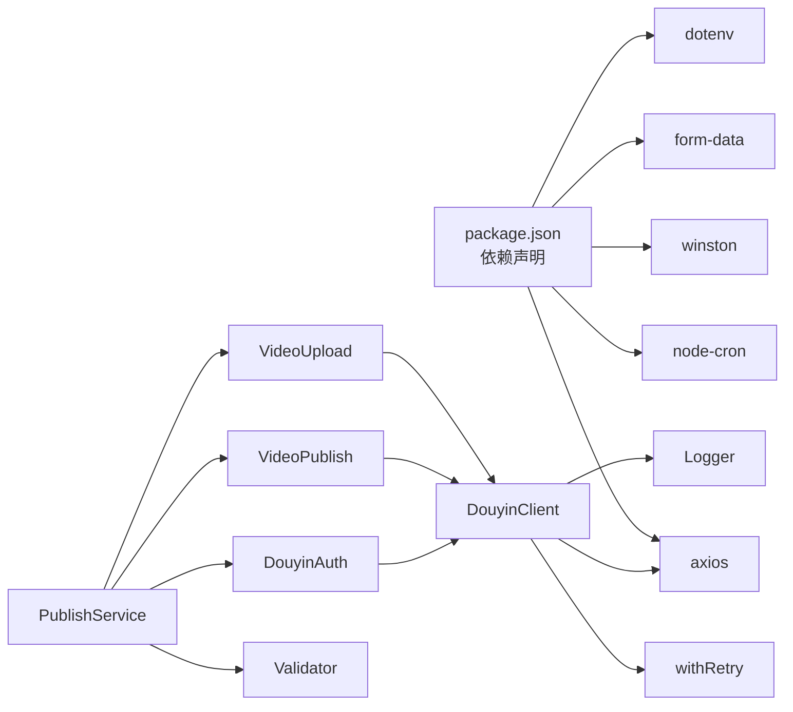

# 技术架构

<cite>
**本文引用的文件**
- [README.md](file://README.md)
- [package.json](file://package.json)
- [tsconfig.json](file://tsconfig.json)
- [src/index.ts](file://src/index.ts)
- [config/default.ts](file://config/default.ts)
- [src/models/types.ts](file://src/models/types.ts)
- [src/api/douyin-client.ts](file://src/api/douyin-client.ts)
- [src/api/auth.ts](file://src/api/auth.ts)
- [src/api/video-upload.ts](file://src/api/video-upload.ts)
- [src/api/video-publish.ts](file://src/api/video-publish.ts)
- [src/services/publish-service.ts](file://src/services/publish-service.ts)
- [src/services/scheduler-service.ts](file://src/services/scheduler-service.ts)
- [src/utils/logger.ts](file://src/utils/logger.ts)
- [src/utils/retry.ts](file://src/utils/retry.ts)
- [src/utils/validator.ts](file://src/utils/validator.ts)
</cite>

## 目录
1. [简介](#简介)
2. [项目结构](#项目结构)
3. [核心组件](#核心组件)
4. [架构总览](#架构总览)
5. [详细组件分析](#详细组件分析)
6. [依赖分析](#依赖分析)
7. [性能考虑](#性能考虑)
8. [故障排查指南](#故障排查指南)
9. [结论](#结论)
10. [附录](#附录)

## 简介
ClawOperations 是一个面向抖音（TikTok）开放平台的营销账号自动化与内容发布系统。其目标是通过标准化的 API 客户端、认证模块、上传与发布服务以及定时调度能力，实现视频内容的上传、发布、状态查询与删除，并支持定时发布与扩展的业务编排。

本系统采用分层架构与模块化设计，围绕 ClowPublisher 主控制器对外暴露统一接口，内部通过 API 层、服务层与工具层协同工作，确保高内聚、低耦合与良好的可测试性与可维护性。

## 项目结构
项目采用按“功能域”划分的模块化组织方式，主要目录与职责如下：
- config：集中存放默认配置常量（API 基址、上传阈值、重试策略、内容与视频规格等）
- src/api：与抖音开放平台交互的 API 客户端与业务模块（认证、上传、发布）
- src/services：业务服务层（发布服务、定时调度服务），负责流程编排与跨模块协调
- src/utils：通用工具（日志、重试、校验）
- src/models：类型定义与接口契约
- tests：单元测试与夹具
- 根目录：构建脚本、依赖声明、TS 编译配置与示例入口

图表来源
- [src/index.ts:1-248](file://src/index.ts#L1-L248)
- [src/api/douyin-client.ts:1-237](file://src/api/douyin-client.ts#L1-L237)
- [src/api/auth.ts:1-190](file://src/api/auth.ts#L1-L190)
- [src/api/video-upload.ts:1-241](file://src/api/video-upload.ts#L1-L241)
- [src/api/video-publish.ts:1-174](file://src/api/video-publish.ts#L1-L174)
- [src/services/publish-service.ts:1-228](file://src/services/publish-service.ts#L1-L228)
- [src/services/scheduler-service.ts:1-202](file://src/services/scheduler-service.ts#L1-L202)
- [src/utils/logger.ts:1-61](file://src/utils/logger.ts#L1-L61)
- [src/utils/retry.ts:1-84](file://src/utils/retry.ts#L1-L84)
- [src/utils/validator.ts:1-116](file://src/utils/validator.ts#L1-L116)
- [config/default.ts:1-49](file://config/default.ts#L1-L49)

章节来源
- [README.md:92-105](file://README.md#L92-L105)
- [tsconfig.json:1-20](file://tsconfig.json#L1-L20)

## 核心组件
- ClawPublisher（主控制器）
  - 职责：对外提供统一 API；聚合认证、上传、发布与定时调度能力；封装业务流程；提供生命周期控制（停止）
  - 关键接口：授权、上传、发布、定时发布、状态查询、删除、停止
- DouyinClient（API 客户端）
  - 职责：基于 axios 的 HTTP 客户端，统一封装请求/响应拦截、错误处理、重试机制与 access_token 注入
- DouyinAuth（认证模块）
  - 职责：OAuth 授权 URL 生成、授权码换 Token、刷新 Token、Token 有效性检查与自动刷新
- PublishService（发布服务）
  - 职责：业务编排层，负责参数校验、上传与发布的串联、远程下载发布、状态查询与删除
- SchedulerService（定时调度服务）
  - 职责：基于 node-cron 的定时任务注册、执行、取消、查询与清理
- 工具模块
  - 日志：基于 winston 的结构化日志输出
  - 重试：指数退避重试策略
  - 校验：视频文件格式/大小与发布选项（标题、描述、hashtag、定时发布时间）校验

章节来源
- [src/index.ts:29-244](file://src/index.ts#L29-L244)
- [src/api/douyin-client.ts:13-237](file://src/api/douyin-client.ts#L13-L237)
- [src/api/auth.ts:29-190](file://src/api/auth.ts#L29-L190)
- [src/services/publish-service.ts:22-228](file://src/services/publish-service.ts#L22-L228)
- [src/services/scheduler-service.ts:23-202](file://src/services/scheduler-service.ts#L23-L202)
- [src/utils/logger.ts:31-61](file://src/utils/logger.ts#L31-L61)
- [src/utils/retry.ts:41-84](file://src/utils/retry.ts#L41-L84)
- [src/utils/validator.ts:22-116](file://src/utils/validator.ts#L22-L116)

## 架构总览
系统采用“主控制器 + 分层 API + 服务编排 + 工具支撑”的架构模式，强调：
- 分层解耦：API 层只做 HTTP 通信与错误处理；服务层负责业务流程；工具层提供横切关注点
- 模块内聚：每个模块聚焦单一职责，接口清晰
- 可扩展性：新增业务可通过服务层编排，无需侵入 API 层
- 可观测性：统一日志与错误类型，便于定位问题
- 可靠性：内置重试与限流判断，提升对外部 API 的鲁棒性

图表来源
- [src/index.ts:29-244](file://src/index.ts#L29-L244)
- [src/api/douyin-client.ts:13-237](file://src/api/douyin-client.ts#L13-L237)
- [src/api/auth.ts:29-190](file://src/api/auth.ts#L29-L190)
- [src/api/video-upload.ts:20-241](file://src/api/video-upload.ts#L20-L241)
- [src/api/video-publish.ts:15-174](file://src/api/video-publish.ts#L15-L174)
- [src/services/publish-service.ts:22-228](file://src/services/publish-service.ts#L22-L228)
- [src/services/scheduler-service.ts:23-202](file://src/services/scheduler-service.ts#L23-L202)
- [src/utils/logger.ts:31-61](file://src/utils/logger.ts#L31-L61)
- [src/utils/retry.ts:41-84](file://src/utils/retry.ts#L41-L84)

## 详细组件分析

### 组件一：ClawPublisher 主控制器
- 设计要点
  - 组合依赖：持有 DouyinClient、DouyinAuth、PublishService、SchedulerService
  - 生命周期：构造时初始化，stop() 停止所有定时任务
  - 接口分层：认证、上传、发布、定时发布、状态查询、删除、停止
- 数据与控制流
  - 外部调用通过主控制器进入，主控制器再委派给具体服务或模块
  - 认证信息可预置，支持后续刷新与有效性检查
- 扩展建议
  - 可增加事件总线或中间件钩子，便于接入审计、监控与链路追踪

图表来源
- [src/index.ts:29-244](file://src/index.ts#L29-L244)

章节来源
- [src/index.ts:29-244](file://src/index.ts#L29-L244)

### 组件二：DouyinClient API 客户端
- 设计要点
  - 基于 axios 创建实例，统一设置基础 URL、超时与 Content-Type
  - 请求拦截：自动注入 access_token
  - 响应拦截：解析抖音 API 错误码并抛出自定义异常
  - 重试策略：结合 withRetry 与 shouldRetry（针对限流与网络错误）
- 关键接口
  - get/post/postForm：封装不同场景的请求方法
  - shouldRetry：识别限流与网络错误进行指数退避重试
- 错误处理
  - 抖音 API 错误与 HTTP 错误分别处理，抛出 DouyinApiException

图表来源
- [src/api/douyin-client.ts:13-237](file://src/api/douyin-client.ts#L13-L237)

章节来源
- [src/api/douyin-client.ts:13-237](file://src/api/douyin-client.ts#L13-L237)

### 组件三：DouyinAuth 认证模块
- 设计要点
  - OAuth 授权 URL 生成，支持自定义 scopes 与 state
  - 授权码换 Token、刷新 Token、Token 有效期检查与自动刷新
  - Token 信息持久化与恢复（setTokenInfo）
- 关键接口
  - getAuthorizationUrl、getAccessToken、refreshAccessToken、ensureTokenValid、isTokenValid
- 安全与可靠性
  - Token 过期缓冲时间、错误日志记录、失败重试由上层重试机制兜底

图表来源
- [src/api/auth.ts:29-190](file://src/api/auth.ts#L29-L190)

章节来源
- [src/api/auth.ts:29-190](file://src/api/auth.ts#L29-L190)

### 组件四：PublishService 发布服务
- 设计要点
  - 业务编排：参数校验 -> 上传（本地/URL）-> 发布 -> 结果封装
  - 支持下载远程视频后发布（含临时文件清理）
  - 状态查询与删除
- 关键流程
  - publishVideo：一站式发布（上传+发布）
  - publishUploadedVideo：对已上传视频进行发布
  - downloadAndPublish：下载->校验->发布
- 与工具层协作
  - 校验器：validateVideoFile、validatePublishOptions
  - 日志：结构化日志输出
  - 重试：由底层 API 客户端统一处理

图表来源
- [src/services/publish-service.ts:38-80](file://src/services/publish-service.ts#L38-L80)
- [src/api/video-upload.ts:220-237](file://src/api/video-upload.ts#L220-L237)
- [src/api/video-publish.ts:30-54](file://src/api/video-publish.ts#L30-L54)
- [src/api/douyin-client.ts:149-166](file://src/api/douyin-client.ts#L149-L166)

章节来源
- [src/services/publish-service.ts:22-228](file://src/services/publish-service.ts#L22-L228)
- [src/api/video-upload.ts:20-241](file://src/api/video-upload.ts#L20-L241)
- [src/api/video-publish.ts:15-174](file://src/api/video-publish.ts#L15-L174)

### 组件五：SchedulerService 定时调度服务
- 设计要点
  - 基于 node-cron 的任务注册与执行
  - 任务状态管理：pending/completed/failed/cancelled
  - 任务清理：完成后自动清理
- 关键接口
  - schedulePublish、cancelSchedule、listScheduledTasks、getTask、stopAll
- 时间策略
  - 将 Date 转换为 cron 表达式（分钟/小时/日/月）

图表来源
- [src/services/scheduler-service.ts:37-72](file://src/services/scheduler-service.ts#L37-L72)
- [src/services/scheduler-service.ts:140-162](file://src/services/scheduler-service.ts#L140-L162)
- [src/services/scheduler-service.ts:169-176](file://src/services/scheduler-service.ts#L169-L176)

章节来源
- [src/services/scheduler-service.ts:23-202](file://src/services/scheduler-service.ts#L23-L202)

### 组件六：工具层（日志、重试、校验）
- 日志：winston 结构化日志，支持控制台与文件输出，可配置日志级别
- 重试：指数退避延迟、最大重试次数、自定义 shouldRetry 条件
- 校验：视频格式/大小、标题/描述长度、hashtag 数量、定时发布时间范围

章节来源
- [src/utils/logger.ts:31-61](file://src/utils/logger.ts#L31-L61)
- [src/utils/retry.ts:41-84](file://src/utils/retry.ts#L41-L84)
- [src/utils/validator.ts:22-116](file://src/utils/validator.ts#L22-L116)

## 依赖分析
- 外部依赖
  - axios：HTTP 客户端，统一请求/响应处理与重试
  - node-cron：定时任务调度
  - winston：结构化日志
  - form-data：multipart/form-data 上传
  - dotenv：环境变量加载
- 内部依赖
  - API 层依赖配置与工具层
  - 服务层依赖 API 层与工具层
  - 主控制器聚合服务层与工具层

图表来源
- [package.json:14-29](file://package.json#L14-L29)
- [src/api/douyin-client.ts:1-7](file://src/api/douyin-client.ts#L1-L7)
- [src/services/publish-service.ts:1-12](file://src/services/publish-service.ts#L1-L12)

章节来源
- [package.json:14-29](file://package.json#L14-L29)

## 性能考虑
- 上传策略
  - 小于阈值（128MB）走直传，减少复杂度
  - 大于阈值走分片上传，支持断点续传与进度回调
- 重试与限流
  - 针对限流与网络错误进行指数退避重试，避免雪崩
- 并发与资源
  - 分片上传按顺序逐片提交，避免并发竞争；如需提升吞吐可在更高层引入并发队列
- I/O 优化
  - 上传进度回调与日志输出需避免阻塞主线程
- 定时任务
  - cron 表达式与时区固定，避免跨时区误差；任务清理降低内存占用

## 故障排查指南
- 常见问题与定位
  - 认证失败：检查 clientKey/clientSecret/redirectUri 与 Token 有效性；确认 isTokenValid 与 ensureTokenValid 的调用
  - 上传失败：查看分片上传初始化、分片提交与完成阶段的日志；核对文件大小/格式与配置阈值
  - 发布失败：检查发布选项长度与 hashtag 数量；核对定时发布时间范围
  - 定时任务未执行：确认 cron 表达式与时间戳转换；检查任务状态与清理逻辑
- 日志与错误
  - 使用统一日志模块输出结构化日志，结合 LOG_LEVEL 控制输出级别
  - API 客户端抛出 DouyinApiException，包含抖音错误码与消息
- 重试与退避
  - 若仍失败，检查 shouldRetry 条件与最大重试次数；必要时调整基础延迟与最大延迟

章节来源
- [src/api/douyin-client.ts:97-116](file://src/api/douyin-client.ts#L97-L116)
- [src/utils/logger.ts:31-61](file://src/utils/logger.ts#L31-L61)
- [src/utils/retry.ts:41-84](file://src/utils/retry.ts#L41-L84)
- [src/utils/validator.ts:45-86](file://src/utils/validator.ts#L45-L86)

## 结论
ClawOperations 通过清晰的分层与模块化设计，实现了从认证、上传、发布到定时调度的完整闭环。系统具备良好的扩展性与可维护性，适合在企业级营销场景中规模化落地。建议后续引入可观测性体系（指标、链路追踪）、配置中心与更细粒度的并发控制，以进一步提升稳定性与性能。

## 附录
- 技术栈选择说明
  - TypeScript：强类型保障与更好的 IDE 支持，便于大型项目维护
  - Node.js：适合 I/O 密集型任务（HTTP、文件上传、定时任务）
  - axios：成熟稳定的 HTTP 客户端，易于扩展拦截器与重试
  - winston：结构化日志，便于生产环境问题定位
  - node-cron：轻量定时任务调度，满足日常发布节奏
  - form-data：原生 multipart/form-data 支持，适配抖音上传接口
- 部署与运行
  - 构建：使用 tsc 生成 dist
  - 启动：使用 npm run start 或 ts-node dev
  - 测试：使用 jest
- 开发与调试
  - 使用 ts-node 在开发环境下直接运行源码
  - 通过 LOG_LEVEL 调整日志级别
  - 在 CI 中使用 lint 与 test 脚本保证质量

章节来源
- [package.json:7-12](file://package.json#L7-L12)
- [tsconfig.json:1-20](file://tsconfig.json#L1-L20)
- [README.md:31-63](file://README.md#L31-L63)