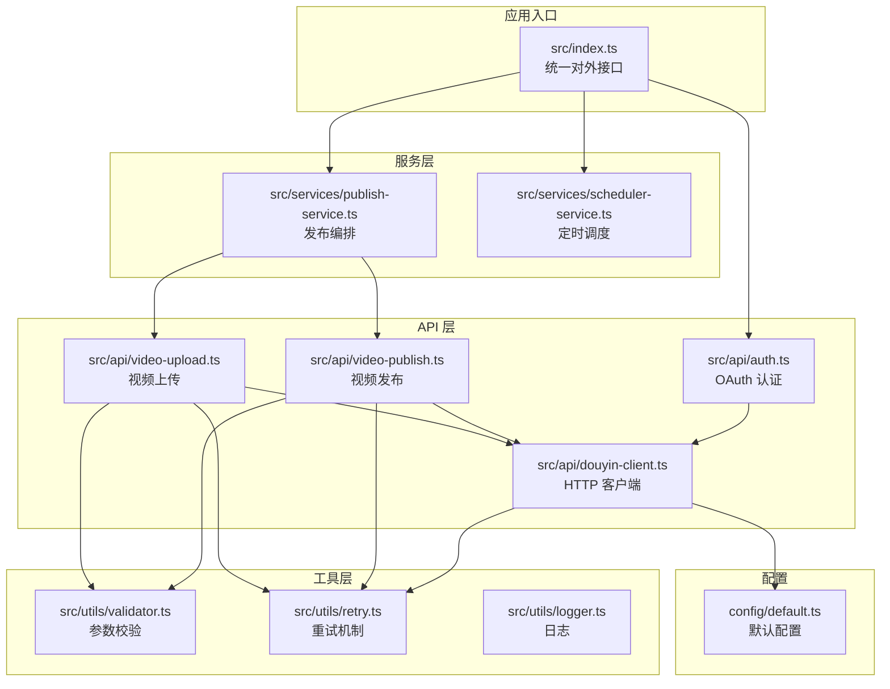
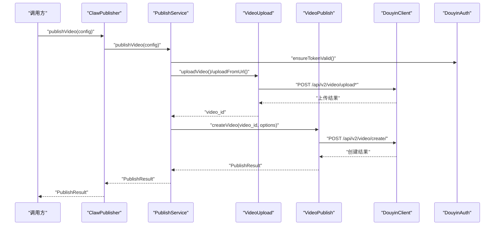
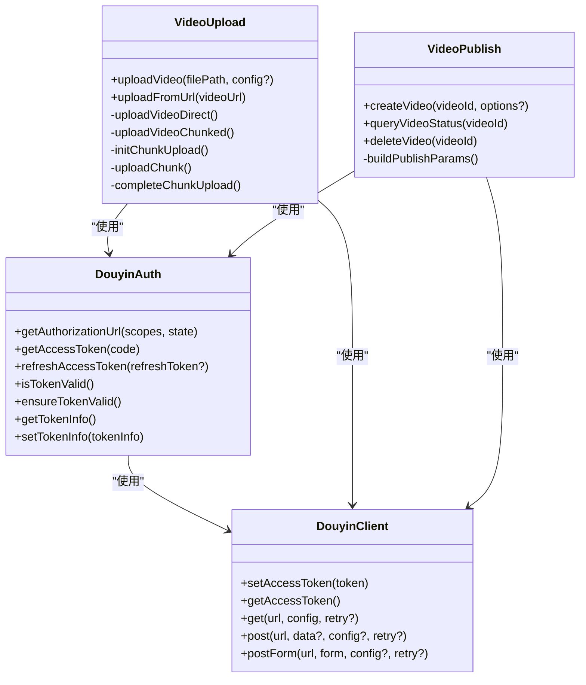
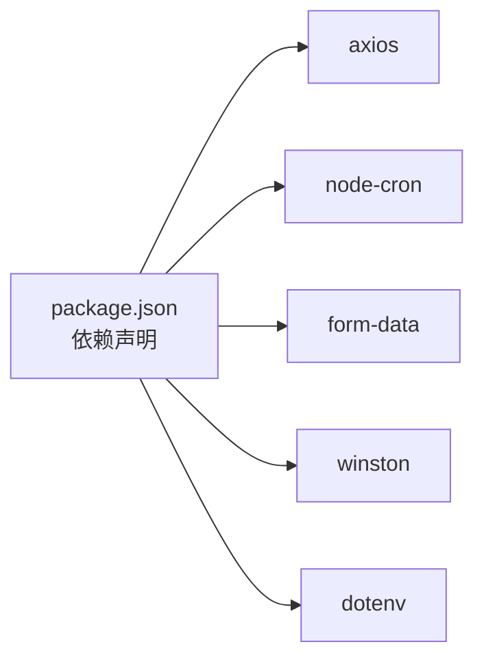

# 核心功能特性

<cite>
**本文引用的文件**
- [README.md](file://README.md)
- [package.json](file://package.json)
- [config/default.ts](file://config/default.ts)
- [src/index.ts](file://src/index.ts)
- [src/models/types.ts](file://src/models/types.ts)
- [src/api/douyin-client.ts](file://src/api/douyin-client.ts)
- [src/api/auth.ts](file://src/api/auth.ts)
- [src/api/video-upload.ts](file://src/api/video-upload.ts)
- [src/api/video-publish.ts](file://src/api/video-publish.ts)
- [src/services/publish-service.ts](file://src/services/publish-service.ts)
- [src/services/scheduler-service.ts](file://src/services/scheduler-service.ts)
- [src/utils/validator.ts](file://src/utils/validator.ts)
- [src/utils/retry.ts](file://src/utils/retry.ts)
</cite>

## 目录
1. [简介](#简介)
2. [项目结构](#项目结构)
3. [核心组件](#核心组件)
4. [架构总览](#架构总览)
5. [详细组件分析](#详细组件分析)
6. [依赖关系分析](#依赖关系分析)
7. [性能与可靠性](#性能与可靠性)
8. [故障排查指南](#故障排查指南)
9. [结论](#结论)
10. [附录](#附录)

## 简介
ClawOperations 是一个专为抖音（TikTok）生态设计的营销账号自动化运营系统，围绕“小龙虾”主题品牌打造。系统提供三大核心能力：
- TikTok API 集成：官方 API 的安全连接、视频上传与发布、数据分析查询、评论管理等
- 账户管理：内容日历、话题标签优化、趋势监控、受众洞察
- 特色功能：季节性活动管理、食谱内容模板、多地区本地化支持

系统以模块化架构组织，采用统一入口类对外提供能力，并通过服务编排层实现上传、发布、定时调度等功能的组合使用。同时内置严格的参数校验、重试机制与日志体系，确保在高并发与不稳定网络环境下的稳定性。

## 项目结构
项目采用按职责分层的组织方式：
- config：默认配置常量（API 基址、上传策略、重试策略、内容与视频限制）
- src/api：与抖音开放平台交互的 API 层（认证、上传、发布）
- src/services：业务编排层（发布服务、定时调度服务）
- src/utils：工具模块（日志、重试、参数校验）
- tests：单元测试与夹具
- 示例与文档：README、示例脚本、Jest 配置

图表来源
- [src/index.ts:1-248](file://src/index.ts#L1-L248)
- [src/api/auth.ts:1-190](file://src/api/auth.ts#L1-L190)
- [src/api/douyin-client.ts:1-237](file://src/api/douyin-client.ts#L1-L237)
- [src/api/video-upload.ts:1-241](file://src/api/video-upload.ts#L1-L241)
- [src/api/video-publish.ts:1-174](file://src/api/video-publish.ts#L1-L174)
- [src/services/publish-service.ts:1-228](file://src/services/publish-service.ts#L1-L228)
- [src/services/scheduler-service.ts:1-202](file://src/services/scheduler-service.ts#L1-L202)
- [src/utils/validator.ts:1-116](file://src/utils/validator.ts#L1-L116)
- [src/utils/retry.ts:1-84](file://src/utils/retry.ts#L1-L84)
- [config/default.ts:1-49](file://config/default.ts#L1-L49)

章节来源
- [README.md:92-105](file://README.md#L92-L105)
- [package.json:1-34](file://package.json#L1-L34)

## 核心组件
- 统一入口类：ClawPublisher，负责对外暴露认证、上传、发布、定时调度、视频状态查询与删除等能力
- 认证模块：DouyinAuth，支持授权 URL 生成、授权码换 Token、刷新 Token、Token 有效性检查与自动刷新
- 上传模块：VideoUpload，支持直传与分片上传两种模式，自动选择阈值、进度回调、URL 直接上传
- 发布模块：VideoPublish，封装视频创建、状态查询、删除等操作
- 发布服务：PublishService，编排上传与发布流程，支持下载远程视频后发布、清理临时文件
- 定时服务：SchedulerService，基于 node-cron 的定时任务注册、取消、查询与执行
- 参数校验：validator，严格校验视频格式/大小、标题/描述/话题标签长度、定时发布时间范围
- 重试机制：withRetry，指数退避重试，结合 API 层拦截器处理限流与网络异常
- 日志与配置：logger、default.ts，统一日志输出与默认配置常量

章节来源
- [src/index.ts:29-244](file://src/index.ts#L29-L244)
- [src/api/auth.ts:29-187](file://src/api/auth.ts#L29-L187)
- [src/api/video-upload.ts:20-238](file://src/api/video-upload.ts#L20-L238)
- [src/api/video-publish.ts:15-171](file://src/api/video-publish.ts#L15-L171)
- [src/services/publish-service.ts:22-224](file://src/services/publish-service.ts#L22-L224)
- [src/services/scheduler-service.ts:23-199](file://src/services/scheduler-service.ts#L23-L199)
- [src/utils/validator.ts:17-115](file://src/utils/validator.ts#L17-L115)
- [src/utils/retry.ts:41-81](file://src/utils/retry.ts#L41-L81)
- [config/default.ts:5-48](file://config/default.ts#L5-L48)

## 架构总览
系统采用“入口类 + API 层 + 服务层 + 工具层”的分层架构，统一入口类作为对外 API，内部通过服务编排层协调上传与发布流程；API 层负责与抖音开放平台交互，内置重试与错误处理；工具层提供参数校验、重试与日志能力；配置层集中管理常量。

图表来源
- [src/index.ts:153-155](file://src/index.ts#L153-L155)
- [src/services/publish-service.ts:38-80](file://src/services/publish-service.ts#L38-L80)
- [src/api/video-upload.ts:35-54](file://src/api/video-upload.ts#L35-L54)
- [src/api/video-publish.ts:30-54](file://src/api/video-publish.ts#L30-L54)
- [src/api/douyin-client.ts:124-166](file://src/api/douyin-client.ts#L124-L166)
- [src/api/auth.ts:146-151](file://src/api/auth.ts#L146-L151)

## 详细组件分析

### TikTok API 集成
- 官方 API 连接：通过 DouyinClient 封装 axios，自动注入 access_token，统一处理响应与错误，内置重试策略
- 内容发布：VideoUpload 支持直传（<128MB）与分片上传（≥128MB），自动计算分片数量与进度；VideoPublish 负责视频创建、状态查询与删除
- 数据分析与评论管理：README 中列出视频列表、用户信息、评论列表等端点，系统具备扩展空间

图表来源
- [src/api/douyin-client.ts:13-237](file://src/api/douyin-client.ts#L13-L237)
- [src/api/auth.ts:29-187](file://src/api/auth.ts#L29-L187)
- [src/api/video-upload.ts:20-238](file://src/api/video-upload.ts#L20-L238)
- [src/api/video-publish.ts:15-171](file://src/api/video-publish.ts#L15-L171)

章节来源
- [src/api/douyin-client.ts:13-237](file://src/api/douyin-client.ts#L13-L237)
- [src/api/auth.ts:29-187](file://src/api/auth.ts#L29-L187)
- [src/api/video-upload.ts:20-238](file://src/api/video-upload.ts#L20-L238)
- [src/api/video-publish.ts:15-171](file://src/api/video-publish.ts#L15-L171)
- [README.md:109-115](file://README.md#L109-L115)

### 账户管理
- 内容日历：通过 SchedulerService 的定时发布能力，支持在指定时间自动发布内容
- 话题标签优化：validator 提供 hashtag 数量与格式校验，formatHashtags 统一格式化
- 趋势监控与受众洞察：README 中列出相关能力，系统具备扩展空间

章节来源
- [src/services/scheduler-service.ts:23-199](file://src/services/scheduler-service.ts#L23-L199)
- [src/utils/validator.ts:45-86](file://src/utils/validator.ts#L45-L86)
- [README.md:19-24](file://README.md#L19-L24)

### Crayfish 特定功能
- 季节性活动管理：通过定时发布与内容日历，配合 hashtag 优化，实现高峰期促销内容的自动化投放
- 食谱内容模板：README 中提到“食谱内容模板”，系统可通过发布选项中的标题、描述、话题标签等字段进行结构化内容创作
- 本地化支持：README 中提到“多地区支持”，系统通过统一的发布选项与内容模板，便于适配不同地区的口味与节日

章节来源
- [README.md:25-30](file://README.md#L25-L30)
- [src/api/video-publish.ts:62-125](file://src/api/video-publish.ts#L62-L125)

### 典型使用场景与业务价值
- 内容创作者：一键上传与发布，支持 URL 直传与远程下载后发布，降低技术门槛，提升内容产出效率
- 营销人员：通过定时发布与 hashtag 优化，实现热点内容的快速投放与传播
- 企业用户：统一的品牌内容模板与本地化策略，保障内容一致性与合规性

章节来源
- [README.md:64-90](file://README.md#L64-L90)
- [src/services/publish-service.ts:133-172](file://src/services/publish-service.ts#L133-L172)
- [src/services/scheduler-service.ts:37-72](file://src/services/scheduler-service.ts#L37-L72)

## 依赖关系分析
- 外部依赖：axios（HTTP）、node-cron（定时任务）、form-data（multipart）、winston（日志）、dotenv（环境变量）
- 内部耦合：入口类依赖认证与服务层；服务层依赖上传与发布模块；上传与发布模块依赖客户端与认证模块；工具层被上传、发布与客户端共同依赖

图表来源
- [package.json:14-29](file://package.json#L14-L29)

章节来源
- [package.json:14-29](file://package.json#L14-L29)

## 性能与可靠性
- 上传策略：根据文件大小自动选择直传或分片上传，避免大文件一次性传输失败
- 重试机制：指数退避重试，结合 API 层拦截器识别限流与网络异常，提高成功率
- 并发控制：定时任务基于 node-cron，支持多任务并发执行与状态跟踪
- 参数校验：严格的输入校验减少无效请求，降低 API 成本与失败率

章节来源
- [src/api/video-upload.ts:48-54](file://src/api/video-upload.ts#L48-L54)
- [src/utils/retry.ts:41-81](file://src/utils/retry.ts#L41-L81)
- [src/api/douyin-client.ts:204-220](file://src/api/douyin-client.ts#L204-L220)
- [src/services/scheduler-service.ts:140-162](file://src/services/scheduler-service.ts#L140-L162)
- [src/utils/validator.ts:22-86](file://src/utils/validator.ts#L22-L86)

## 故障排查指南
- 认证失败：检查授权 URL 生成与回调处理，确认 clientKey、clientSecret、redirectUri 配置正确
- 上传失败：查看直传/分片上传日志，确认文件格式与大小限制；关注网络异常与重试日志
- 发布失败：核对标题/描述/话题标签长度与数量限制；检查定时发布时间是否在允许范围内
- 定时任务异常：检查任务状态与执行日志，必要时清理已完成任务或停止全部任务

章节来源
- [src/api/auth.ts:45-91](file://src/api/auth.ts#L45-L91)
- [src/api/video-upload.ts:35-96](file://src/api/video-upload.ts#L35-L96)
- [src/api/video-publish.ts:30-54](file://src/api/video-publish.ts#L30-L54)
- [src/utils/validator.ts:45-86](file://src/utils/validator.ts#L45-L86)
- [src/services/scheduler-service.ts:79-97](file://src/services/scheduler-service.ts#L79-L97)

## 结论
ClawOperations 以模块化与服务编排为核心，提供了从认证到上传、发布、定时调度的完整链路，结合严格的参数校验与重试机制，满足小龙虾主题品牌的规模化内容运营需求。系统具备良好的扩展性，可进一步完善数据分析与评论管理能力，支撑更丰富的营销场景。

## 附录
- API 端点参考：README 中列出视频上传、视频列表、用户信息、评论列表等端点
- 配置常量：API 基址、上传阈值与分片大小、重试次数与延迟、视频格式与大小、内容长度与 hashtag 数量限制

章节来源
- [README.md:109-115](file://README.md#L109-L115)
- [config/default.ts:5-48](file://config/default.ts#L5-L48)