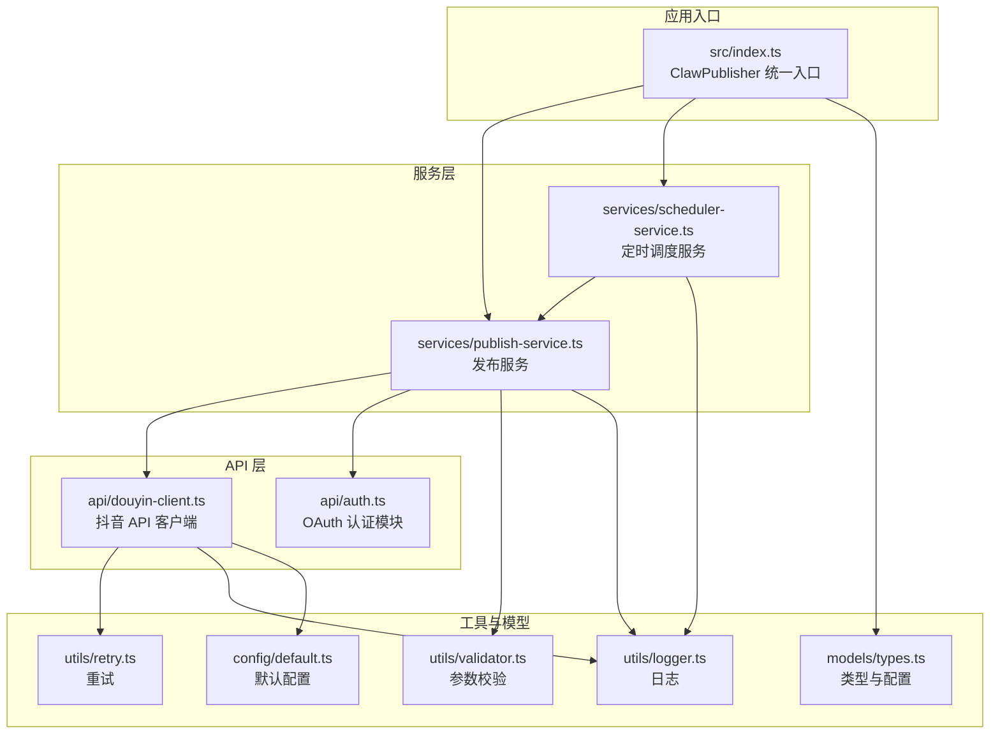
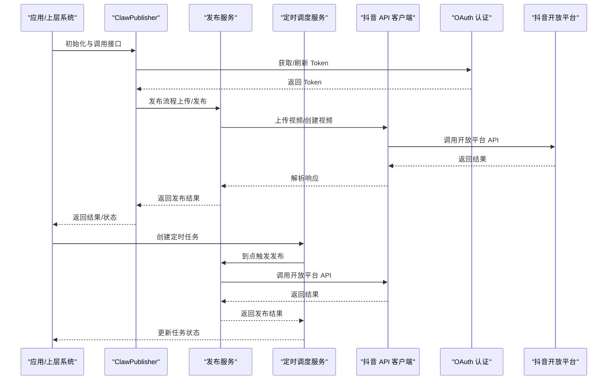
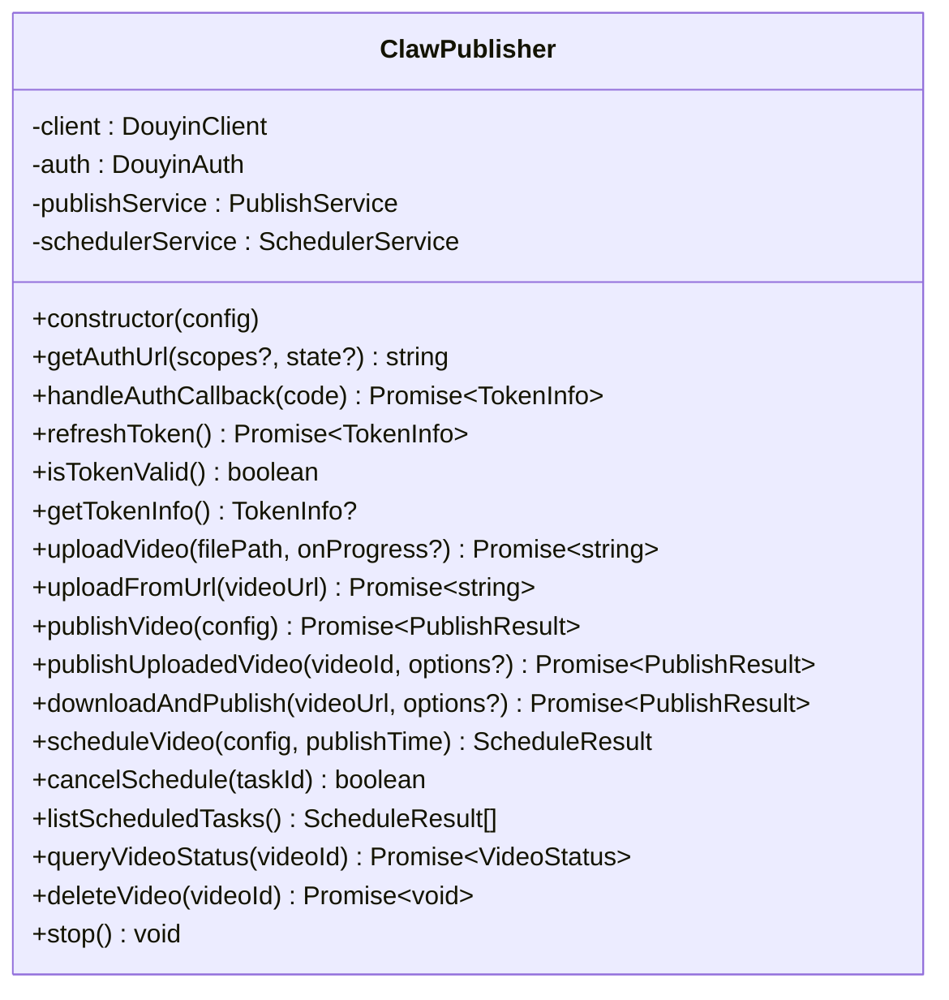
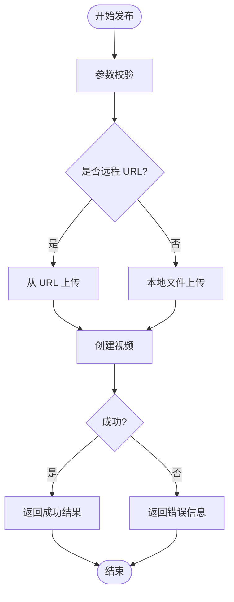
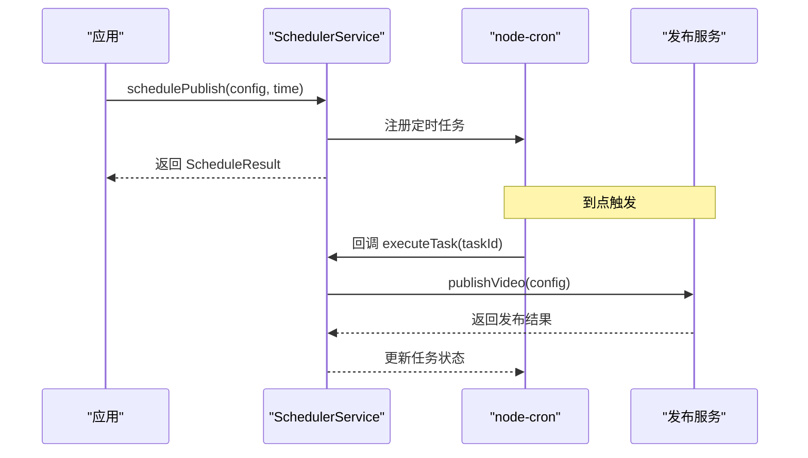
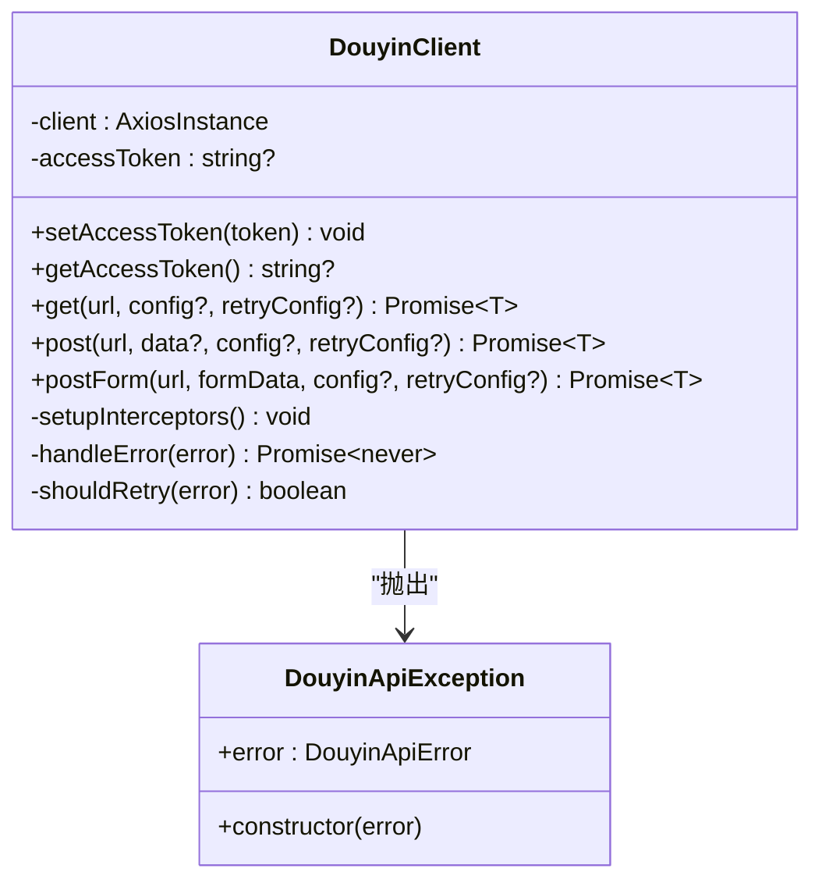
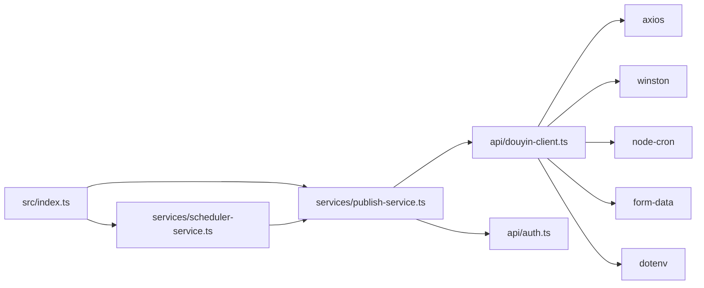

# 项目介绍

<cite>
**本文引用的文件**
- [README.md](file://README.md)
- [package.json](file://package.json)
- [src/index.ts](file://src/index.ts)
- [src/models/types.ts](file://src/models/types.ts)
- [src/services/publish-service.ts](file://src/services/publish-service.ts)
- [src/services/scheduler-service.ts](file://src/services/scheduler-service.ts)
- [src/api/douyin-client.ts](file://src/api/douyin-client.ts)
- [src/utils/logger.ts](file://src/utils/logger.ts)
- [src/utils/validator.ts](file://src/utils/validator.ts)
- [src/utils/retry.ts](file://src/utils/retry.ts)
- [config/default.ts](file://config/default.ts)
- [example.ts](file://example.ts)
- [tests/unit/auth.test.ts](file://tests/unit/auth.test.ts)
</cite>

## 目录
1. [引言](#引言)
2. [项目结构](#项目结构)
3. [核心组件](#核心组件)
4. [架构总览](#架构总览)
5. [详细组件分析](#详细组件分析)
6. [依赖关系分析](#依赖关系分析)
7. [性能考量](#性能考量)
8. [故障排查指南](#故障排查指南)
9. [结论](#结论)
10. [附录](#附录)

## 引言
ClawOperations 是一款专为“小龙虾”主题抖音营销账户打造的自动化发布与运营管理工具。其核心目标是帮助海鲜餐厅、食品品牌、美食博主等目标用户群体，解决手动发布效率低、内容管理混乱、数据分析困难等痛点，实现从视频上传、定时发布、内容管理到数据分析的全链路自动化与标准化。

本项目以抖音开放平台官方 API 为基础，提供统一的 SDK 化封装与服务编排，支持 OAuth 授权、视频上传与发布、定时任务调度、日志与重试机制、参数校验等能力，显著降低运营门槛，提升内容投放效率与一致性。

## 项目结构
项目采用按职责分层的组织方式，核心目录与职责如下：
- src/api：与抖音开放平台对接的 API 客户端与认证模块
- src/services：业务编排层，负责发布流程与定时调度
- src/utils：通用工具，如日志、重试、参数校验
- src/models：类型定义与配置常量
- config：全局配置常量（API 基址、上传策略、重试策略、内容与视频规格）
- tests：单元测试与模拟响应
- example.ts：完整的使用示例与工作流演示

图表来源
- [src/index.ts:1-248](file://src/index.ts#L1-L248)
- [src/services/publish-service.ts:1-228](file://src/services/publish-service.ts#L1-L228)
- [src/services/scheduler-service.ts:1-202](file://src/services/scheduler-service.ts#L1-L202)
- [src/api/douyin-client.ts:1-237](file://src/api/douyin-client.ts#L1-L237)
- [src/utils/logger.ts:1-61](file://src/utils/logger.ts#L1-L61)
- [src/utils/retry.ts:1-84](file://src/utils/retry.ts#L1-L84)
- [src/utils/validator.ts:1-116](file://src/utils/validator.ts#L1-L116)
- [src/models/types.ts:1-201](file://src/models/types.ts#L1-L201)
- [config/default.ts:1-49](file://config/default.ts#L1-L49)

章节来源
- [README.md:92-105](file://README.md#L92-L105)
- [package.json:1-34](file://package.json#L1-L34)

## 核心组件
- 统一入口与对外接口：ClawPublisher 提供认证、视频上传、发布、定时发布、视频状态查询与删除等统一方法，便于上层系统集成。
- 发布服务：封装上传与发布的完整流程，支持本地文件、远程 URL、下载后发布等多种模式；内置参数校验与日志记录。
- 定时调度服务：基于 node-cron 的任务调度，支持创建、取消、查询、清理与停止等操作。
- API 客户端：基于 axios 的抖音开放平台客户端，内置请求/响应拦截器、异常处理与指数退避重试。
- 工具与配置：日志、重试、参数校验模块，以及统一的配置常量（API 基址、上传阈值、重试策略、内容与视频规格）。

章节来源
- [src/index.ts:29-244](file://src/index.ts#L29-L244)
- [src/services/publish-service.ts:22-224](file://src/services/publish-service.ts#L22-L224)
- [src/services/scheduler-service.ts:23-199](file://src/services/scheduler-service.ts#L23-L199)
- [src/api/douyin-client.ts:13-237](file://src/api/douyin-client.ts#L13-L237)
- [src/utils/logger.ts:31-55](file://src/utils/logger.ts#L31-L55)
- [src/utils/retry.ts:41-81](file://src/utils/retry.ts#L41-L81)
- [src/utils/validator.ts:22-86](file://src/utils/validator.ts#L22-L86)
- [config/default.ts:5-48](file://config/default.ts#L5-L48)

## 架构总览
下图展示从应用入口到抖音开放平台的整体调用链路与职责划分。

图表来源
- [src/index.ts:69-244](file://src/index.ts#L69-L244)
- [src/services/publish-service.ts:38-80](file://src/services/publish-service.ts#L38-L80)
- [src/services/scheduler-service.ts:37-72](file://src/services/scheduler-service.ts#L37-L72)
- [src/api/douyin-client.ts:124-198](file://src/api/douyin-client.ts#L124-L198)

## 详细组件分析

### 组件一：ClawPublisher（统一入口）
- 职责：聚合认证、发布、定时调度、视频管理等能力，提供简洁易用的对外接口。
- 关键方法：
  - 认证：获取授权 URL、处理授权回调、刷新 Token、检查 Token 有效性、获取 Token 信息
  - 发布：上传视频、发布视频、发布已上传视频、下载并发布
  - 定时：创建定时任务、取消任务、列出任务、停止全部任务
  - 视频管理：查询状态、删除视频
- 设计要点：构造函数中完成客户端、认证、服务实例初始化；支持预置 Token 与后续刷新；日志记录初始化完成事件。

图表来源
- [src/index.ts:29-244](file://src/index.ts#L29-L244)

章节来源
- [src/index.ts:29-244](file://src/index.ts#L29-L244)

### 组件二：发布服务（PublishService）
- 职责：编排上传与发布的完整流程，支持多种输入方式（本地文件、远程 URL、下载后发布），并进行参数校验与日志记录。
- 关键流程：
  - publishVideo：参数校验 -> 上传视频（本地或 URL）-> 创建视频 -> 返回结果
  - publishUploadedVideo：直接发布已上传视频
  - downloadAndPublish：下载远程视频 -> 校验 -> 发布 -> 清理临时文件
  - queryVideoStatus / deleteVideo：查询与删除视频
- 错误处理：捕获异常并返回结构化错误信息；下载完成后清理临时文件。

图表来源
- [src/services/publish-service.ts:38-80](file://src/services/publish-service.ts#L38-L80)
- [src/services/publish-service.ts:133-172](file://src/services/publish-service.ts#L133-L172)

章节来源
- [src/services/publish-service.ts:22-224](file://src/services/publish-service.ts#L22-L224)

### 组件三：定时调度服务（SchedulerService）
- 职责：基于 node-cron 的任务调度，支持创建、取消、查询、清理与停止等操作。
- 关键流程：
  - schedulePublish：校验时间 -> 生成 cron 表达式 -> 注册定时任务 -> 存储任务信息
  - executeTask：到点触发 -> 调用发布服务 -> 更新任务状态
  - cancelSchedule / listScheduledTasks / stopAll：任务生命周期管理
- 设计要点：任务状态机（pending/completed/failed/cancelled）；清理已完成任务；统一时区 Asia/Shanghai。

图表来源
- [src/services/scheduler-service.ts:37-72](file://src/services/scheduler-service.ts#L37-L72)
- [src/services/scheduler-service.ts:140-162](file://src/services/scheduler-service.ts#L140-L162)

章节来源
- [src/services/scheduler-service.ts:23-199](file://src/services/scheduler-service.ts#L23-L199)

### 组件四：抖音 API 客户端（DouyinClient）
- 职责：基于 axios 的抖音开放平台客户端，统一处理请求/响应拦截、错误处理与指数退避重试。
- 关键能力：
  - 请求拦截：自动注入 access_token
  - 响应拦截：解析数据、检查错误码、抛出自定义异常
  - 重试策略：指数退避、最大重试次数、最大延迟、自定义重试条件
  - HTTP 方法：get/post/postForm
- 异常类型：DouyinApiException，携带错误码与消息。

图表来源
- [src/api/douyin-client.ts:13-237](file://src/api/douyin-client.ts#L13-L237)

章节来源
- [src/api/douyin-client.ts:13-237](file://src/api/douyin-client.ts#L13-L237)

### 组件五：工具与配置
- 日志：基于 winston，支持控制台与文件输出，可配置日志级别。
- 重试：withRetry 实现指数退避，支持自定义重试条件。
- 校验：validateVideoFile 与 validatePublishOptions，覆盖格式、大小、长度、数量与定时发布时间范围。
- 配置：API 基址、上传阈值、分片大小、重试次数与延迟、支持的视频格式、内容长度限制等。

章节来源
- [src/utils/logger.ts:31-55](file://src/utils/logger.ts#L31-L55)
- [src/utils/retry.ts:41-81](file://src/utils/retry.ts#L41-L81)
- [src/utils/validator.ts:22-86](file://src/utils/validator.ts#L22-L86)
- [config/default.ts:5-48](file://config/default.ts#L5-L48)

## 依赖关系分析
- 内部依赖：ClawPublisher 依赖 PublishService 与 SchedulerService；PublishService 依赖 DouyinClient 与 DouyinAuth；SchedulerService 依赖 PublishService。
- 外部依赖：axios（HTTP）、node-cron（定时）、winston（日志）、form-data（multipart）、dotenv（环境变量）。
- 测试：使用 Jest 与 ts-jest，配合 axios mock 验证认证流程与 Token 生命周期。

图表来源
- [src/index.ts:1-20](file://src/index.ts#L1-L20)
- [src/services/publish-service.ts:1-15](file://src/services/publish-service.ts#L1-L15)
- [src/services/scheduler-service.ts:1-4](file://src/services/scheduler-service.ts#L1-L4)
- [src/api/douyin-client.ts:1-6](file://src/api/douyin-client.ts#L1-L6)
- [package.json:14-29](file://package.json#L14-L29)

章节来源
- [package.json:14-29](file://package.json#L14-L29)
- [tests/unit/auth.test.ts:1-15](file://tests/unit/auth.test.ts#L1-L15)

## 性能考量
- 上传策略：根据配置阈值选择分片上传，避免单次请求过大导致失败与超时。
- 重试策略：指数退避减少抖动，结合最大重试次数与最大延迟，平衡稳定性与响应速度。
- 日志与监控：统一日志格式与级别，便于定位问题与评估性能瓶颈。
- 定时任务：cron 表达式与时区固定，确保任务按时执行且避免重复触发。

## 故障排查指南
- Token 相关
  - 现象：接口报错或鉴权失败
  - 排查：确认 Token 是否有效、是否需要刷新；检查 OAuth 授权流程与回调处理
  - 参考：[src/index.ts:77-112](file://src/index.ts#L77-L112)、[tests/unit/auth.test.ts:66-133](file://tests/unit/auth.test.ts#L66-L133)
- 上传与发布
  - 现象：上传卡住、发布失败
  - 排查：检查文件格式与大小限制、网络状况、重试日志；确认上传/发布流程是否正确
  - 参考：[src/utils/validator.ts:22-39](file://src/utils/validator.ts#L22-L39)、[src/services/publish-service.ts:38-80](file://src/services/publish-service.ts#L38-L80)
- 定时任务
  - 现象：任务未执行或重复执行
  - 排查：检查任务状态、cron 表达式生成逻辑、时区设置；必要时清理已完成任务
  - 参考：[src/services/scheduler-service.ts:37-72](file://src/services/scheduler-service.ts#L37-L72)、[src/services/scheduler-service.ts:169-176](file://src/services/scheduler-service.ts#L169-L176)
- API 异常
  - 现象：HTTP 错误或抖音特定错误码
  - 排查：查看响应拦截器中的错误处理与日志；确认 shouldRetry 条件
  - 参考：[src/api/douyin-client.ts:97-116](file://src/api/douyin-client.ts#L97-L116)、[src/api/douyin-client.ts:204-220](file://src/api/douyin-client.ts#L204-L220)

章节来源
- [src/index.ts:77-112](file://src/index.ts#L77-L112)
- [tests/unit/auth.test.ts:66-133](file://tests/unit/auth.test.ts#L66-L133)
- [src/utils/validator.ts:22-39](file://src/utils/validator.ts#L22-L39)
- [src/services/publish-service.ts:38-80](file://src/services/publish-service.ts#L38-L80)
- [src/services/scheduler-service.ts:37-72](file://src/services/scheduler-service.ts#L37-L72)
- [src/services/scheduler-service.ts:169-176](file://src/services/scheduler-service.ts#L169-L176)
- [src/api/douyin-client.ts:97-116](file://src/api/douyin-client.ts#L97-L116)
- [src/api/douyin-client.ts:204-220](file://src/api/douyin-client.ts#L204-L220)

## 结论
ClawOperations 通过模块化设计与完善的工具链，将抖音开放平台的能力以统一、稳定、可扩展的方式提供给小龙虾主题营销账户。其优势在于：
- 降低人工成本：自动化上传、发布与定时调度
- 提升一致性：统一的日志、重试与参数校验
- 增强可靠性：指数退避重试与错误处理
- 易于集成：清晰的对外接口与示例

适用于海鲜餐厅、食品品牌、美食博主等需要规模化、标准化内容运营的用户群体。

## 附录
- 价值主张与竞争优势
  - 对比传统人工运营：显著提升效率、降低人为失误、统一品牌风格与发布时间
  - 专业适配：针对小龙虾主题内容的特性（季节性、地域性、烹饪教程等）提供定制化能力
- 适用场景与目标用户
  - 海鲜餐厅：日常菜品推广、节日活动预热、限时优惠宣传
  - 食品品牌：产品种草、品牌故事、达人合作
  - 美食博主：内容日更、专题策划、粉丝互动
- 愿景与规划
  - 短期：完善认证与发布流程，增强稳定性与可观测性
  - 中期：扩展内容模板、趋势监测与数据分析能力
  - 长期：构建生态化运营平台，支持多账号、多渠道协同与智能投放

章节来源
- [README.md:1-152](file://README.md#L1-L152)
- [example.ts:159-193](file://example.ts#L159-L193)