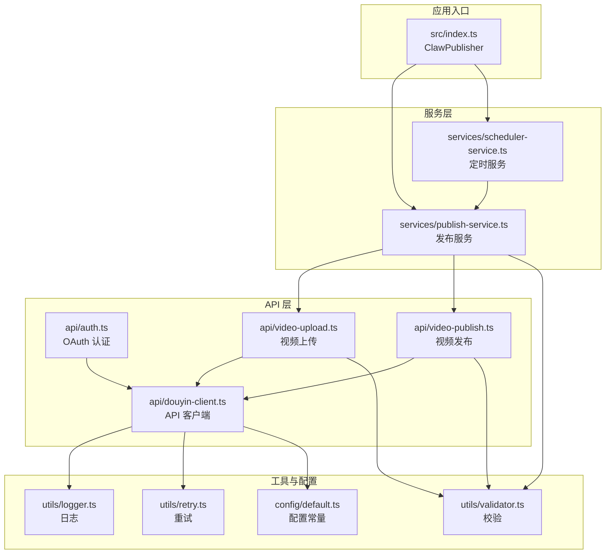
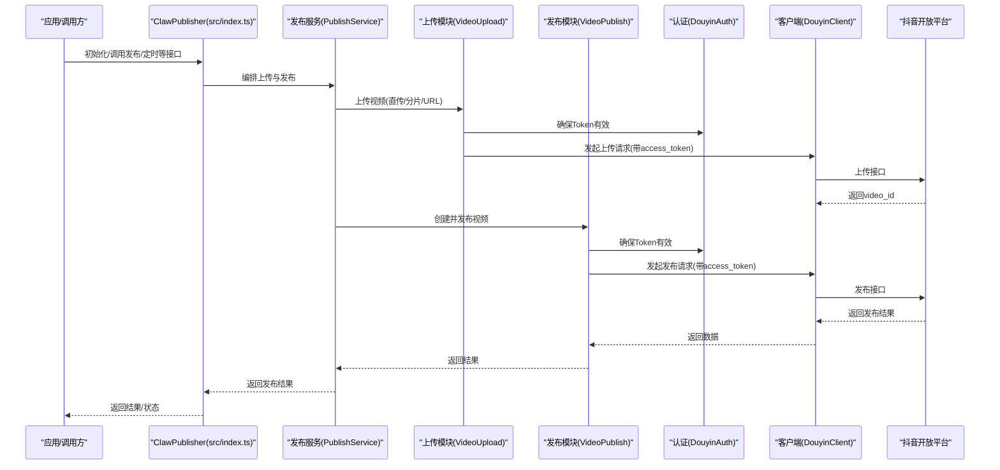
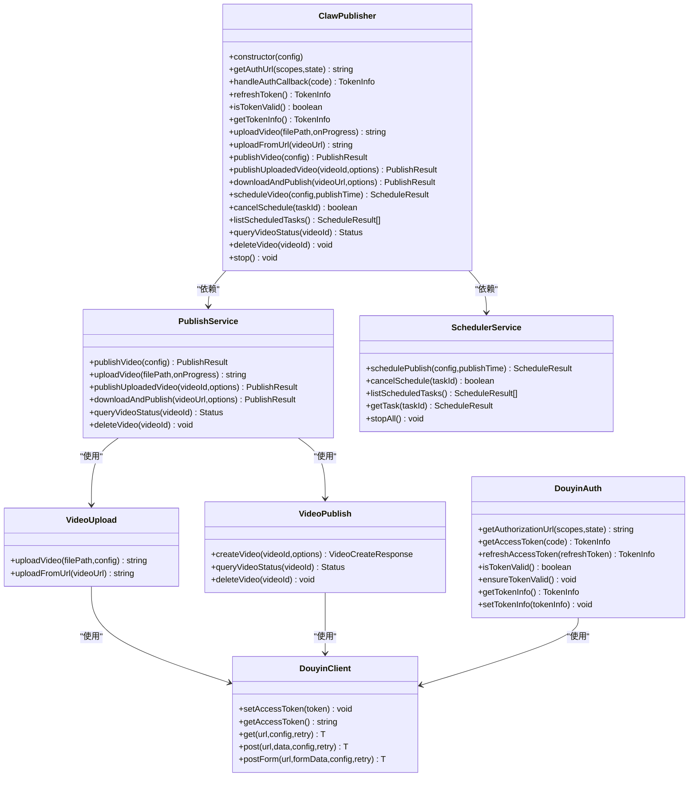
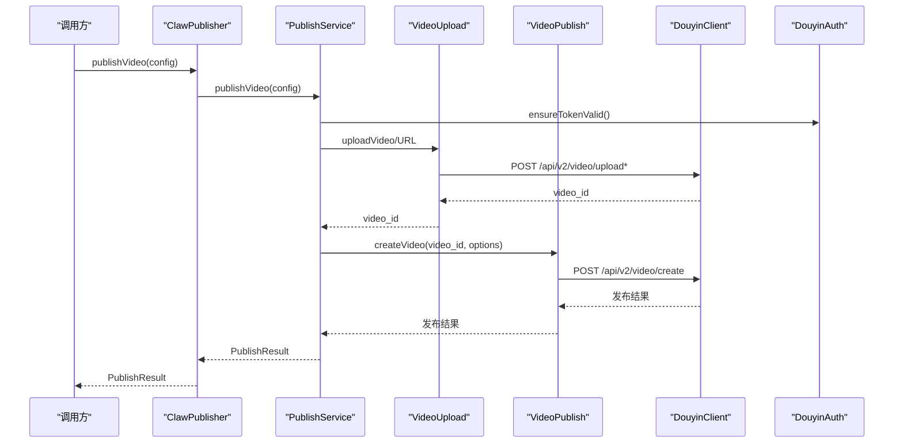
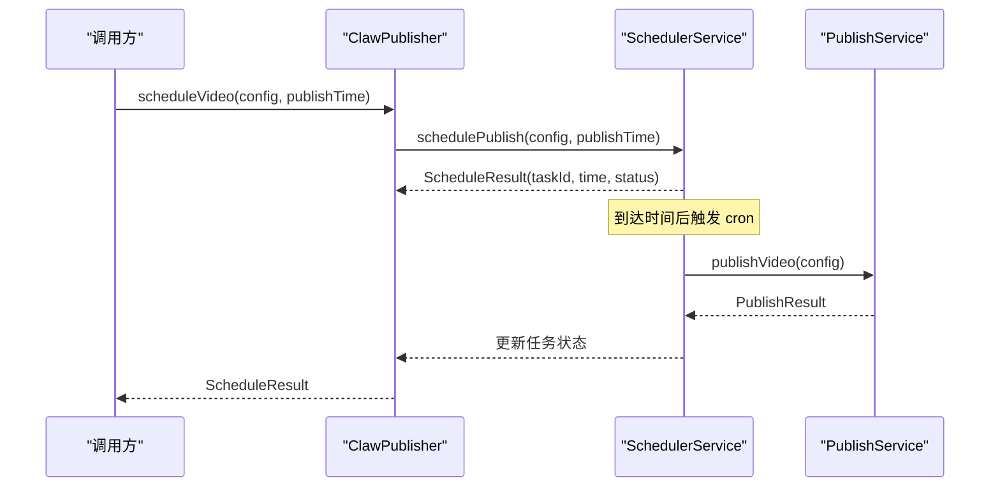
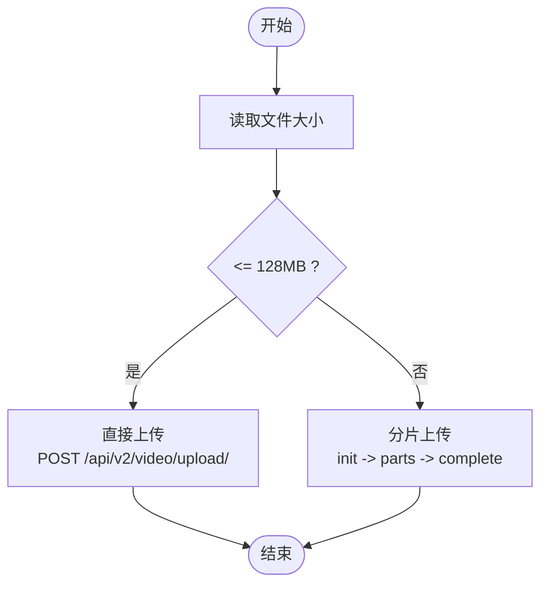
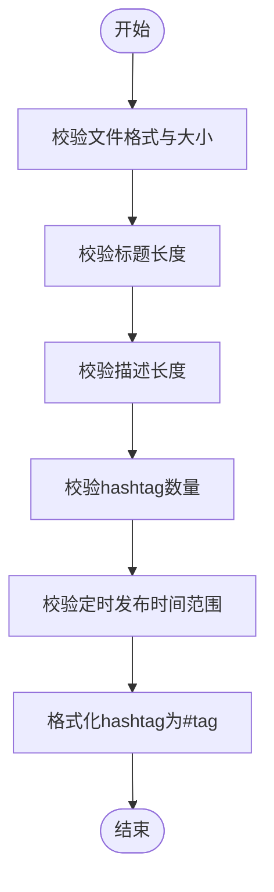
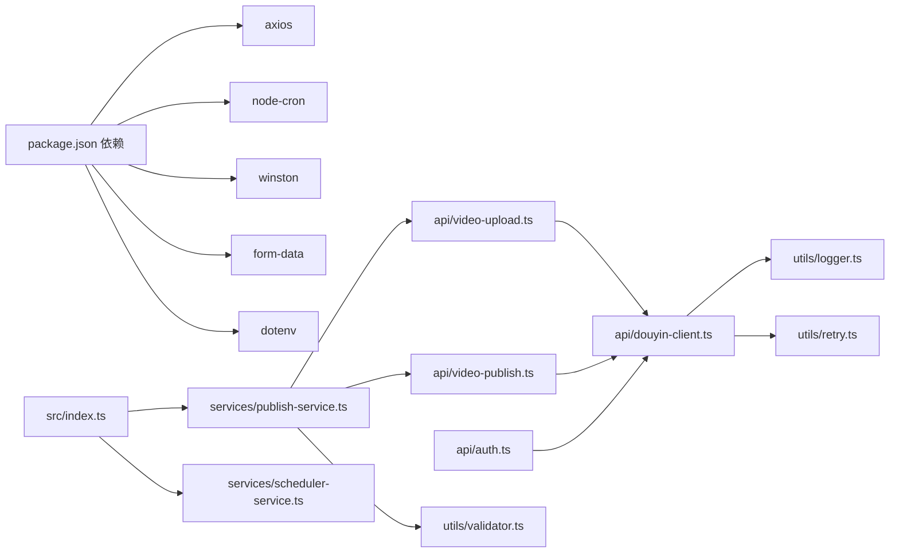

# 项目概述

<cite>
**本文引用的文件**
- [README.md](file://README.md)
- [package.json](file://package.json)
- [src/index.ts](file://src/index.ts)
- [src/models/types.ts](file://src/models/types.ts)
- [src/api/douyin-client.ts](file://src/api/douyin-client.ts)
- [src/api/auth.ts](file://src/api/auth.ts)
- [src/api/video-upload.ts](file://src/api/video-upload.ts)
- [src/api/video-publish.ts](file://src/api/video-publish.ts)
- [src/services/publish-service.ts](file://src/services/publish-service.ts)
- [src/services/scheduler-service.ts](file://src/services/scheduler-service.ts)
- [src/utils/logger.ts](file://src/utils/logger.ts)
- [src/utils/retry.ts](file://src/utils/retry.ts)
- [src/utils/validator.ts](file://src/utils/validator.ts)
- [config/default.ts](file://config/default.ts)
- [example.ts](file://example.ts)
</cite>

## 目录
1. [简介](#简介)
2. [项目结构](#项目结构)
3. [核心组件](#核心组件)
4. [架构总览](#架构总览)
5. [详细组件分析](#详细组件分析)
6. [依赖分析](#依赖分析)
7. [性能考虑](#性能考虑)
8. [故障排查指南](#故障排查指南)
9. [结论](#结论)
10. [附录](#附录)

## 简介
ClawOperations 是专为“小龙虾”主题抖音营销账户打造的自动化发布与管理平台。其核心目标是通过官方抖音开放平台 API，实现视频上传、定时发布、内容管理与基础数据分析的自动化，帮助品牌方高效运营抖音账号，降低人工成本，提升内容分发效率与一致性。

与传统手动发布相比，本系统具备以下优势：
- 统一入口与封装：以单一对外类暴露认证、上传、发布、定时等能力，便于集成与复用。
- 分片上传与断点续传友好：针对大文件自动采用分片上传策略，保障稳定性与速度。
- 指数退避重试：对限流与网络波动进行智能重试，提升成功率。
- 定时发布：基于 cron 的任务调度，支持多任务管理与状态跟踪。
- 参数校验与格式化：对标题、描述、hashtag、定时发布时间等进行严格校验，避免无效请求。
- 日志体系：统一的日志输出与文件落盘，便于问题定位与审计。

适用场景与价值主张：
- 快速规模化内容发布：批量、定时、跨账号发布，显著提升运营效率。
- 降低人为错误：严格的参数校验与统一的发布流程，减少违规与重复工作。
- 数据与合规：统一的访问令牌管理与日志记录，满足企业合规要求。
- 业务扩展：模块化设计便于接入更多营销工具（如评论管理、趋势监控等）。

## 项目结构
项目采用按职责分层的组织方式，核心目录与职责如下：
- config：集中存放全局配置常量（API 基址、上传阈值、重试策略、内容与视频规格限制等）
- src/api：与抖音开放平台对接的 API 层，包括客户端、认证、上传、发布等模块
- src/services：业务编排层，负责发布流程编排、定时任务管理
- src/utils：通用工具，包括日志、重试、参数校验
- tests：单元测试与模拟响应
- example.ts：使用示例，演示常见工作流

图表来源
- [src/index.ts:1-248](file://src/index.ts#L1-L248)
- [src/services/publish-service.ts:1-228](file://src/services/publish-service.ts#L1-L228)
- [src/services/scheduler-service.ts:1-202](file://src/services/scheduler-service.ts#L1-L202)
- [src/api/douyin-client.ts:1-237](file://src/api/douyin-client.ts#L1-L237)
- [src/api/auth.ts:1-190](file://src/api/auth.ts#L1-L190)
- [src/api/video-upload.ts:1-241](file://src/api/video-upload.ts#L1-L241)
- [src/api/video-publish.ts:1-174](file://src/api/video-publish.ts#L1-L174)
- [src/utils/logger.ts:1-61](file://src/utils/logger.ts#L1-L61)
- [src/utils/retry.ts:1-84](file://src/utils/retry.ts#L1-L84)
- [src/utils/validator.ts:1-116](file://src/utils/validator.ts#L1-L116)
- [config/default.ts:1-49](file://config/default.ts#L1-L49)

章节来源
- [README.md:92-105](file://README.md#L92-L105)
- [package.json:1-34](file://package.json#L1-L34)

## 核心组件
- 对外统一类：ClawPublisher（src/index.ts），聚合认证、上传、发布、定时等功能，提供简洁易用的 API。
- 发布服务：PublishService（src/services/publish-service.ts），编排上传与发布流程，处理进度回调、远程下载再发布、状态查询与删除等。
- 定时服务：SchedulerService（src/services/scheduler-service.ts），基于 node-cron 实现定时发布任务的注册、取消、查询与清理。
- API 客户端：DouyinClient（src/api/douyin-client.ts），封装 axios，统一注入 access_token、错误处理、指数退避重试。
- 认证模块：DouyinAuth（src/api/auth.ts），OAuth 授权 URL 生成、授权码换 Token、刷新 Token、有效性检查。
- 上传模块：VideoUpload（src/api/video-upload.ts），自动选择直传/分片上传，支持 URL 直传与进度回调。
- 发布模块：VideoPublish（src/api/video-publish.ts），构建发布参数（标题、描述、hashtag、POI、小程序/商品挂载、定时发布等），查询状态与删除。
- 工具与配置：logger、retry、validator；配置常量集中于 config/default.ts。

章节来源
- [src/index.ts:29-244](file://src/index.ts#L29-L244)
- [src/services/publish-service.ts:22-224](file://src/services/publish-service.ts#L22-L224)
- [src/services/scheduler-service.ts:23-199](file://src/services/scheduler-service.ts#L23-L199)
- [src/api/douyin-client.ts:13-237](file://src/api/douyin-client.ts#L13-L237)
- [src/api/auth.ts:29-190](file://src/api/auth.ts#L29-L190)
- [src/api/video-upload.ts:20-241](file://src/api/video-upload.ts#L20-L241)
- [src/api/video-publish.ts:15-174](file://src/api/video-publish.ts#L15-L174)
- [src/utils/logger.ts:31-61](file://src/utils/logger.ts#L31-L61)
- [src/utils/retry.ts:41-84](file://src/utils/retry.ts#L41-L84)
- [src/utils/validator.ts:22-116](file://src/utils/validator.ts#L22-L116)
- [config/default.ts:5-49](file://config/default.ts#L5-L49)

## 架构总览
下图展示了从应用入口到抖音开放平台的整体调用链路与模块协作关系：

图表来源
- [src/index.ts:115-210](file://src/index.ts#L115-L210)
- [src/services/publish-service.ts:38-80](file://src/services/publish-service.ts#L38-L80)
- [src/api/video-upload.ts:35-54](file://src/api/video-upload.ts#L35-L54)
- [src/api/video-publish.ts:30-54](file://src/api/video-publish.ts#L30-L54)
- [src/api/auth.ts:146-151](file://src/api/auth.ts#L146-L151)
- [src/api/douyin-client.ts:124-166](file://src/api/douyin-client.ts#L124-L166)

## 详细组件分析

### 类关系与职责（代码级）

图表来源
- [src/index.ts:29-244](file://src/index.ts#L29-L244)
- [src/services/publish-service.ts:22-31](file://src/services/publish-service.ts#L22-L31)
- [src/services/scheduler-service.ts:23-29](file://src/services/scheduler-service.ts#L23-L29)
- [src/api/douyin-client.ts:13-27](file://src/api/douyin-client.ts#L13-L27)
- [src/api/auth.ts:29-37](file://src/api/auth.ts#L29-L37)
- [src/api/video-upload.ts:20-27](file://src/api/video-upload.ts#L20-L27)
- [src/api/video-publish.ts:15-22](file://src/api/video-publish.ts#L15-L22)

章节来源
- [src/index.ts:29-244](file://src/index.ts#L29-L244)
- [src/services/publish-service.ts:22-31](file://src/services/publish-service.ts#L22-L31)
- [src/services/scheduler-service.ts:23-29](file://src/services/scheduler-service.ts#L23-L29)
- [src/api/douyin-client.ts:13-27](file://src/api/douyin-client.ts#L13-L27)
- [src/api/auth.ts:29-37](file://src/api/auth.ts#L29-L37)
- [src/api/video-upload.ts:20-27](file://src/api/video-upload.ts#L20-L27)
- [src/api/video-publish.ts:15-22](file://src/api/video-publish.ts#L15-L22)

### 发布流程（序列图）

图表来源
- [src/index.ts:153-155](file://src/index.ts#L153-L155)
- [src/services/publish-service.ts:38-80](file://src/services/publish-service.ts#L38-L80)
- [src/api/video-upload.ts:84-95](file://src/api/video-upload.ts#L84-L95)
- [src/api/video-publish.ts:42-53](file://src/api/video-publish.ts#L42-L53)
- [src/api/douyin-client.ts:149-166](file://src/api/douyin-client.ts#L149-L166)
- [src/api/auth.ts:146-151](file://src/api/auth.ts#L146-L151)

### 定时发布流程（序列图）

图表来源
- [src/index.ts:191-193](file://src/index.ts#L191-L193)
- [src/services/scheduler-service.ts:37-72](file://src/services/scheduler-service.ts#L37-L72)
- [src/services/scheduler-service.ts:140-162](file://src/services/scheduler-service.ts#L140-L162)
- [src/services/publish-service.ts:38-80](file://src/services/publish-service.ts#L38-L80)

### 上传策略（流程图）

图表来源
- [src/api/video-upload.ts:48-54](file://src/api/video-upload.ts#L48-L54)
- [src/api/video-upload.ts:104-152](file://src/api/video-upload.ts#L104-L152)
- [config/default.ts:10-15](file://config/default.ts#L10-L15)

### 参数校验与格式化（流程图）

图表来源
- [src/utils/validator.ts:22-86](file://src/utils/validator.ts#L22-L86)
- [src/utils/validator.ts:102-107](file://src/utils/validator.ts#L102-L107)
- [config/default.ts:26-40](file://config/default.ts#L26-L40)

## 依赖分析
- 外部依赖
  - axios：HTTP 客户端，统一请求与响应拦截
  - node-cron：定时任务调度
  - winston：日志框架
  - form-data：multipart/form-data 构造
  - dotenv：环境变量加载
- 内部模块耦合
  - PublishService 依赖 VideoUpload 与 VideoPublish，形成“编排-执行”的清晰边界
  - DouyinClient 作为基础设施被多个模块共享，避免重复逻辑
  - SchedulerService 仅依赖 PublishService，保持低耦合
  - Validator 与 Logger 作为横切关注点被广泛使用

图表来源
- [package.json:14-29](file://package.json#L14-L29)
- [src/index.ts:1-21](file://src/index.ts#L1-L21)
- [src/services/publish-service.ts:1-12](file://src/services/publish-service.ts#L1-L12)
- [src/api/douyin-client.ts:1-6](file://src/api/douyin-client.ts#L1-L6)

章节来源
- [package.json:14-29](file://package.json#L14-L29)
- [src/index.ts:1-21](file://src/index.ts#L1-L21)

## 性能考虑
- 上传策略
  - 小于 128MB：直传，简单高效
  - 大于等于 128MB：分片上传，支持断点续传与进度反馈
- 重试机制
  - 指数退避，结合抖音限流错误码与网络异常进行智能重试，降低失败率
- 并发与资源
  - 分片上传按序读取与发送，避免内存峰值过高
  - 远程下载发布后及时清理临时文件，避免磁盘占用
- 日志与可观测性
  - 控制台彩色输出与文件落盘，便于快速定位问题

[本节为通用性能建议，无需特定文件引用]

## 故障排查指南
- 认证相关
  - Token 过期：使用 refresh 方法刷新；确保在调用前检查有效性
  - 授权 URL 生成：确认 clientKey、redirectUri、scope 配置正确
- 上传相关
  - 文件格式/大小不合法：根据校验规则调整
  - 分片上传失败：检查网络与抖音接口状态，利用重试配置自动恢复
- 发布相关
  - 参数校验失败：检查标题、描述、hashtag 数量与定时发布时间范围
  - 发布状态查询：确认 video_id 正确且账号有相应权限
- 日志定位
  - 查看控制台与 app.log 文件，定位具体阶段与错误码

章节来源
- [src/api/auth.ts:98-127](file://src/api/auth.ts#L98-L127)
- [src/api/auth.ts:133-151](file://src/api/auth.ts#L133-L151)
- [src/api/douyin-client.ts:97-116](file://src/api/douyin-client.ts#L97-L116)
- [src/api/douyin-client.ts:204-220](file://src/api/douyin-client.ts#L204-L220)
- [src/utils/validator.ts:22-86](file://src/utils/validator.ts#L22-L86)
- [src/utils/logger.ts:35-54](file://src/utils/logger.ts#L35-L54)

## 结论
ClawOperations 以模块化与可扩展为核心设计理念，围绕抖音开放平台 API 构建了从认证、上传、发布到定时调度的完整自动化闭环。通过严格的参数校验、稳健的重试与日志体系，以及清晰的职责划分，系统能够稳定支撑小龙虾主题营销账号的规模化内容运营。对于初学者，可通过示例快速上手；对于有经验的开发者，其可扩展的架构与完善的工具链提供了良好的二次开发基础。

[本节为总结性内容，无需特定文件引用]

## 附录

### 使用案例与业务价值
- 快速发布：一键上传并发布，支持本地文件与远程 URL
- 定时发布：在黄金时段自动发布，提升曝光与互动
- 规范化管理：统一的标题、描述、hashtag 格式化，保证品牌一致性
- 成本优化：减少人工操作，提高内容分发效率与覆盖面

章节来源
- [example.ts:159-193](file://example.ts#L159-L193)
- [README.md:64-90](file://README.md#L64-L90)

### 抖音 API 集成基础概念（面向初学者）
- 访问令牌（access_token）：调用抖音开放平台接口的凭证，需在请求参数中携带
- OAuth 授权：通过授权 URL 与回调 code 获取 access_token 与 refresh_token
- 上传接口：支持直传与分片上传两种方式，依据文件大小自动选择
- 发布接口：创建并发布视频，支持标题、描述、hashtag、POI、小程序/商品挂载、定时发布等参数
- 定时发布：基于 cron 表达式设定发布时间，系统在指定时间自动执行发布

章节来源
- [src/api/douyin-client.ts:33-43](file://src/api/douyin-client.ts#L33-L43)
- [src/api/auth.ts:45-60](file://src/api/auth.ts#L45-L60)
- [src/api/auth.ts:67-91](file://src/api/auth.ts#L67-L91)
- [src/api/video-upload.ts:35-54](file://src/api/video-upload.ts#L35-L54)
- [src/api/video-publish.ts:30-54](file://src/api/video-publish.ts#L30-L54)
- [src/services/scheduler-service.ts:169-176](file://src/services/scheduler-service.ts#L169-L176)